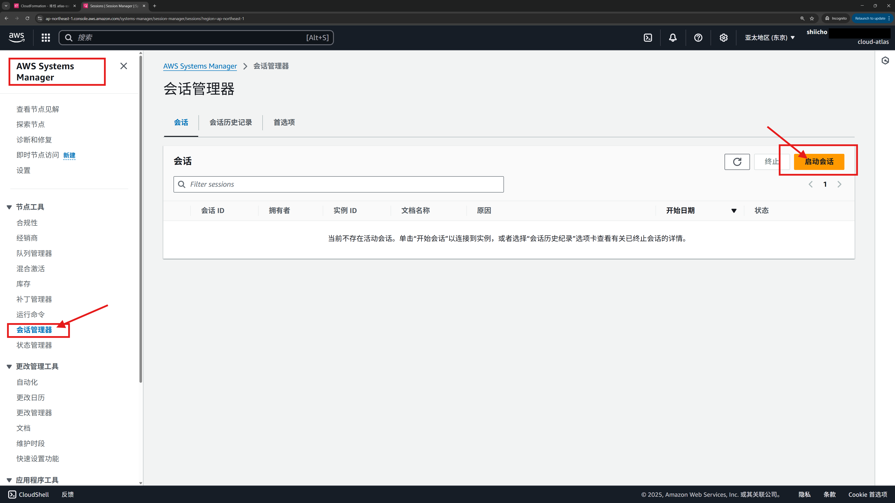
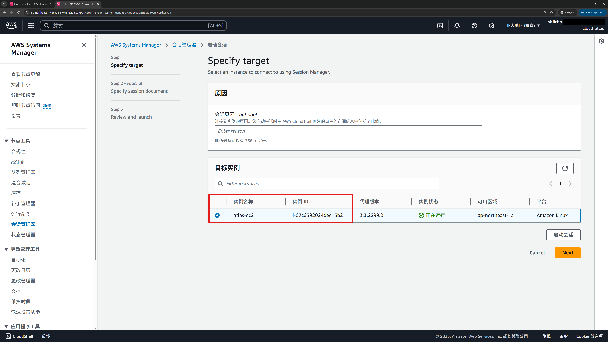
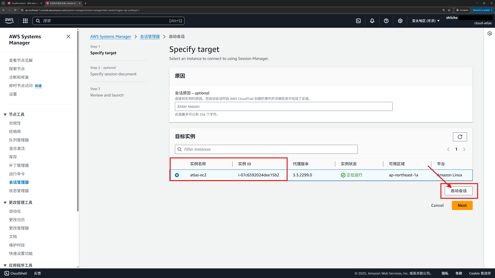
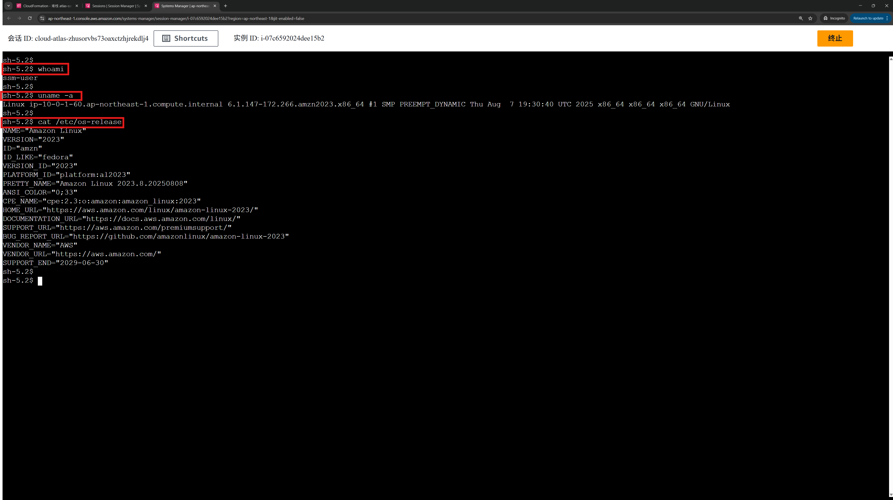

# 02 · 使用 Session Manager 免密登录 EC2（浏览器 Shell）

> **目标**：不需要密钥对、不开入站端口，直接在浏览器打开 EC2 的交互式 Shell。  
> **前置**：已完成 `01 · CloudFormation 部署` 并等待实例启动 1–3 分钟（SSM Agent 会自动注册）。  
> **区域**：建议 `ap-northeast-1`（东京）。

## 你将完成
- 在 **Systems Manager（系统管理器）** 中找到托管实例  
- 通过 **会话管理器 → 开始会话** 进入浏览器 Shell  
- 运行几条校验命令确认连通

## Step 1 — 打开“会话管理器”
**操作**：进入 **Systems Manager（系统管理器） → 会话管理器（Session Manager）**。  

  

## Step 2 — 选择目标实例
**操作**：在 **托管实例** 列表中，勾选你的实验机（标签包含 `atlas-ec2`，或用 `InstanceId` 搜索）。  
**参考**：**[01 · CloudFormation 部署最小实验环境](./01_cfn_deploy.md) 中创部署的EC2实例，CloudFormation输出中有 InstanceId**  

  

## Step 3 — 开始会话
**操作**：点击右上角 **开始会话**。  

  

## Step 4 — 浏览器内 Shell（验证）
**现象**：新标签页出现命令行界面，默认用户为 `ssm-user`。  
**验证命令**：

```bash
whoami
uname -a
cat /etc/os-release
```

  