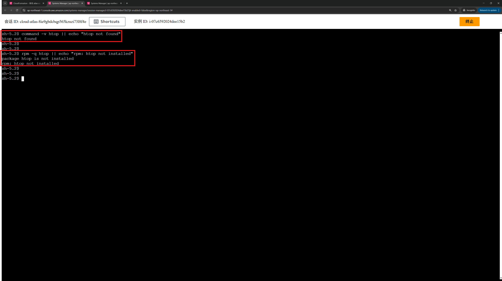
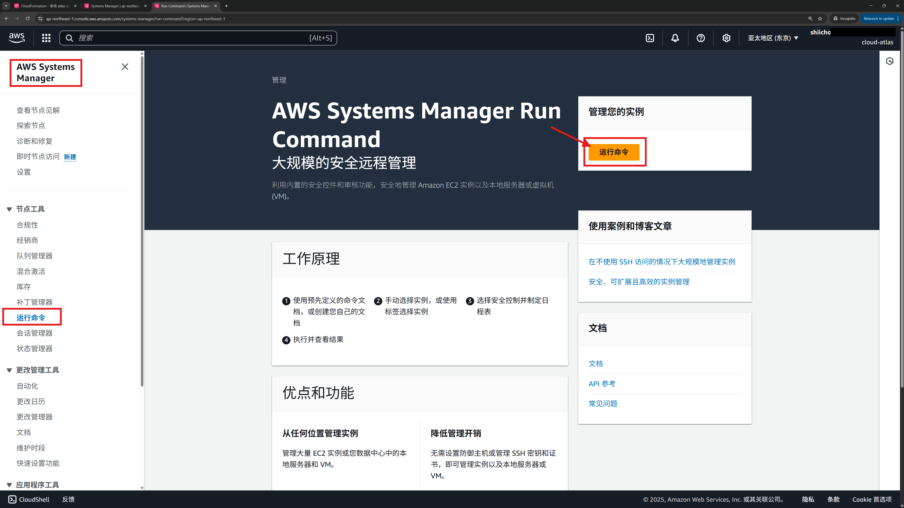
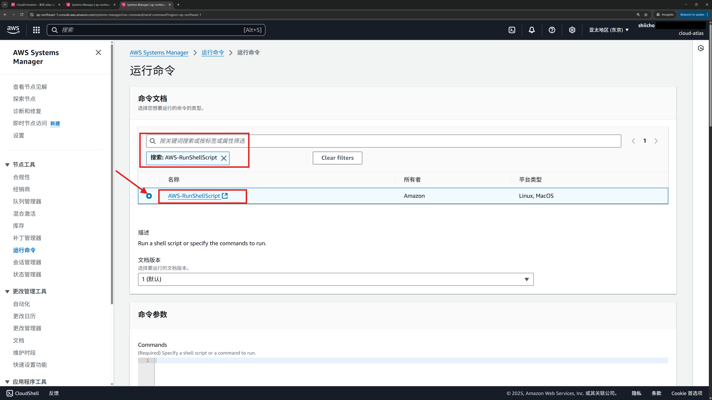
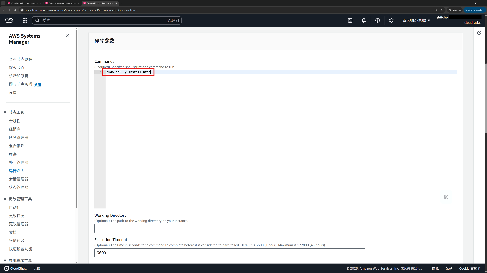
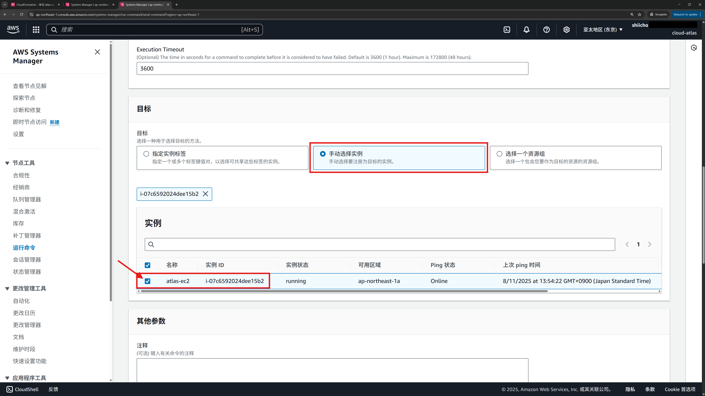
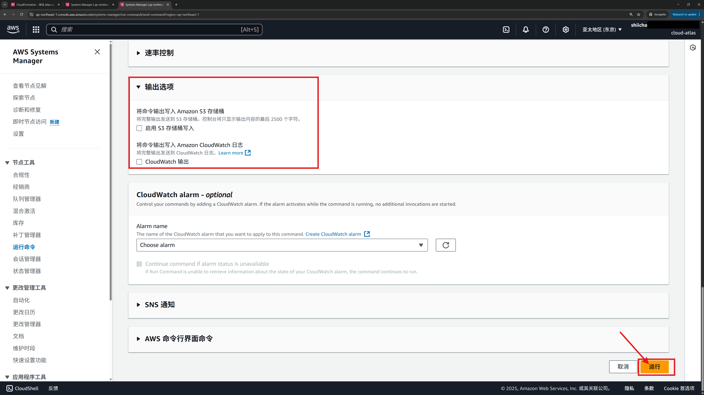
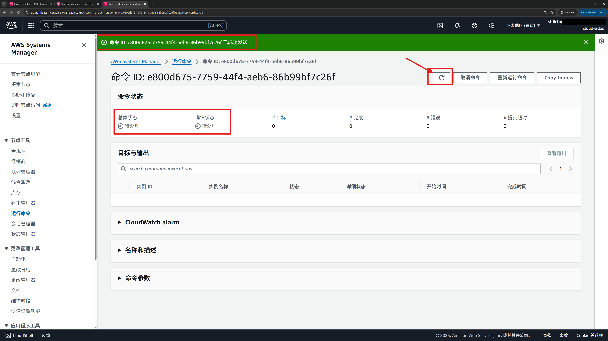
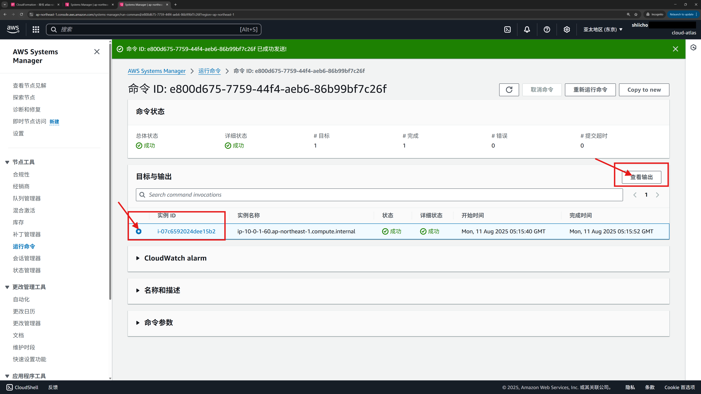
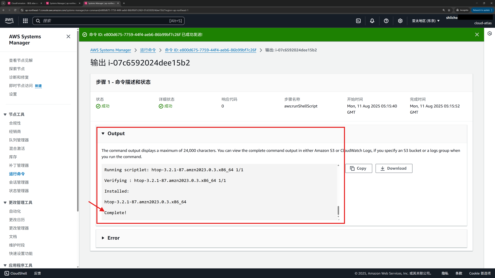
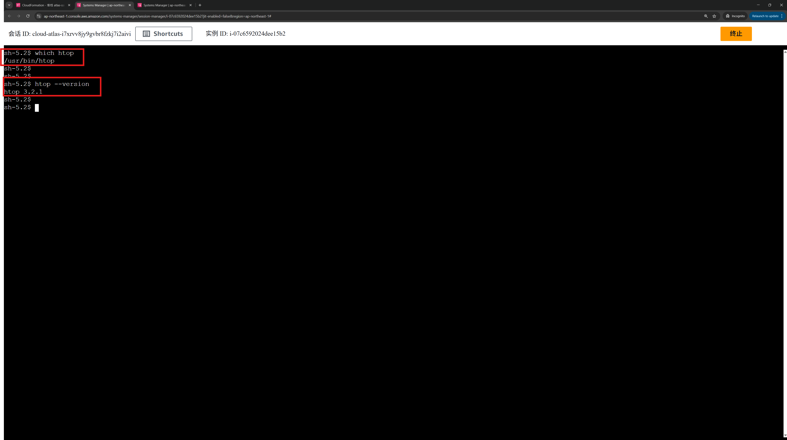

# 03 · Run Command 批量执行脚本（安装 htop：会话前后对比）

> **目标**：不开入站端口、无 SSH。先用**会话管理器**在实例里“手动检查”前置状态，再用 **运行命令（Run Command）** 远程安装，最后回到会话里“手动验证”结果。  
> **前置**：已完成 01、02；目标实例为“受管实例（Managed instance）”。  
> **系统**：Amazon Linux 2023（`dnf`）。  

## 你将完成

1. 会话管理器打开浏览器 Shell，**执行前检查**（未安装）
2. 运行命令远程执行安装脚本（`sudo dnf -y install htop`）
3. 会话管理器返回 Shell，**执行后验证**（路径与版本）
4. 理解 **fleet 一致化** 的威力；未来我们也会配置管理 **on-prem** 服务器

## Step 1 · 执行前检查（在实例里手动敲命令）

参考 **[02 · 使用 Session Manager 免密登录 EC2（浏览器 Shell）](./02_ssm_session.md)**  进入会话管理页面。  
在 Shell 中输入：
 ```bash
command -v htop || echo "htop not found"
rpm -q htop || echo "rpm: htop not installed"
```

**期望**：第一次通常显示 `htop not found` / `not installed`。  



## Step 2 · 通过“运行命令”远程安装（不直接操作实例）

**操作**：Systems Manager → **运行命令** → **运行命令**  



**操作**：**命令文档（Command document）** 选择 **AWS-RunShellScript**（类型：Command，平台：Linux）



**操作**：在 **命令参数（Commands）** 粘贴：

```bash
sudo dnf -y install htop
```


**操作**：**目标（Targets）** → **手动选择目标** → 勾选实验机



**操作**：在“输出选项” **取消勾选** 「启用 S3 存储桶写入」，其他保持默认，点击页面右下角 **运行（Run）**。  
**备注**：本课仅看控制台输出；S3/CloudWatch 日志将在未来课程中统一配置。



**期望**：输出包含 transaction summary，结尾 **Complete!**  





## Step 3 · 执行后验证（回到会话里手动敲命令）
在 Shell 中输入：
```bash
which htop
htop --version
```

**期望**：
* `which htop` 返回可执行路径（如 `/usr/bin/htop`）
* `htop --version` 显示版本（如 `htop 3.x …`）



## 为什么这很强大？

* **无需登录**：安装动作通过 **Run Command** 下发；你只用会话做**前后验证**，更安全。
* **可复制到一台或一群机器**：同一脚本可对 **fleet** 一键下发，确保**版本与配置一致**。
* **可审计**：结合后续“会话/命令日志落地（CloudWatch/S3）”，执行与结果**可追溯**。
* **不止云上**：在后续课程我们会演示如何把 **on-prem/自建服务器** 以托管实例注册到 SSM，用同样方式管理。

## 常见问题与排查

* **AccessDenied / Unauthorized**：实例角色需 **AmazonSSMManagedInstanceCore**；控制台用户也需相应权限。
* **Command timed out**：网络慢/镜像源不可用；重试或换源；增大“超时”。
* **Package not found**：Ubuntu 请改用：
  ```bash
  sudo apt-get update
  sudo apt-get -y install htop
  ```
* **无输出**：命令仍在执行；刷新命令详情；或检查是否把输出发往 CloudWatch/S3（见第 05 课）。

**下一步**：继续 **[（🙏未上传）04 · Parameter Store（创建/读取/在脚本中使用））](./04_parameter_store.md)**  ，把配置项/密钥集中管理，并在 Run Command 中安全读取；再到 **[（🙏未上传）05 · 会话/命令日志落地](./05_session_logging.md)**   做合规与审计。