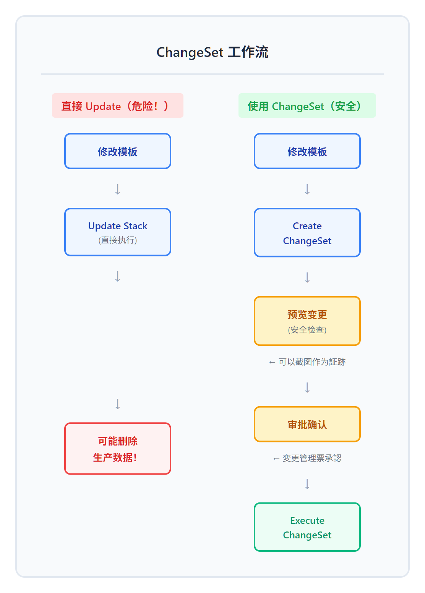
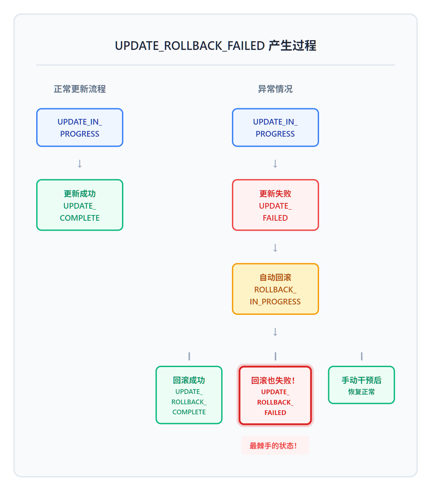

# 02 - 安全运维：ChangeSets 与回滚策略

> **目标**：掌握 CloudFormation 安全更新的核心技能，这是日本企业生产环境的必备要求  
> **时间**：45 分钟  
> **费用**：S3 Bucket（免费层 - 5GB 存储 + 2万次 GET/月）  
> **区域**：ap-northeast-1（Tokyo）推荐，或 us-east-1  
> **前置**：已完成 [00 - 基础](../00-fundamentals/) 和 [01 - 模板语法](../01-template-syntax/)

---

## 将学到的内容

1. 使用 ChangeSets 预览变更（日本企业必须！）
2. 理解 Stack Update 的 Replacement vs In-Place
3. 配置 DeletionPolicy 保护关键资源
4. 使用 StackPolicy 禁止危险操作
5. 处理 UPDATE_ROLLBACK_FAILED 状态

---

## 为什么这课如此重要？

在日本 IT 企业，任何生产环境变更都需要经过严格的「変更管理」（变更管理）流程：


<details>
<summary>View ASCII source</summary>

```
┌─────────────────────────────────────────────────────────────────────────┐
│                    日本企业変更管理フロー                                  │
├─────────────────────────────────────────────────────────────────────────┤
│                                                                         │
│   ┌──────────┐    ┌──────────┐    ┌──────────┐    ┌──────────┐         │
│   │ 変更申請  │───▶│ ChangeSet │───▶│   承認   │───▶│   実行   │         │
│   │ (申请)   │    │  (预览)   │    │ (审批)   │    │  (执行)  │         │
│   └──────────┘    └────┬─────┘    └──────────┘    └──────────┘         │
│                        │                                                │
│                        ▼                                                │
│                  ┌──────────┐                                           │
│                  │ Screenshot│  ← 証跡（审计证据）                        │
│                  │ 保存      │                                           │
│                  └──────────┘                                           │
│                                                                         │
│   【重要】ChangeSet = 変更管理票の承認材料                                 │
│                                                                         │
└─────────────────────────────────────────────────────────────────────────┘
```

</details>

**不使用 ChangeSet 直接更新 = 违反変更管理规定 = 可能被解雇！**

---

## Step 1 — 先跑起来！体验 ChangeSet（10 分钟）

> 先"尝到" ChangeSet 的威力，再理解原理。

### 1.1 创建初始 Stack

创建一个名为 `changeset-demo.yaml` 的文件：

```yaml
AWSTemplateFormatVersion: '2010-09-09'
Description: ChangeSet Demo - Initial Version

Resources:
  DemoBucket:
    Type: AWS::S3::Bucket
    Properties:
      BucketName: !Sub 'changeset-demo-${AWS::AccountId}'
      Tags:
        - Key: Name
          Value: ChangeSet Demo Bucket
        - Key: Environment
          Value: learning
        - Key: Version
          Value: v1
```

> 你也可以直接使用课程代码：`code/changeset-demo.yaml`

通过 Console 创建 Stack：

1. AWS Console -> CloudFormation -> **Create stack**
2. 上传 `changeset-demo.yaml`
3. Stack name: `changeset-demo`
4. 点击 **Next** -> **Next** -> **Submit**
5. 等待 `CREATE_COMPLETE`

<!-- SCREENSHOT: changeset-stack-created -->

### 1.2 准备修改版模板

现在修改模板，添加一个新标签：

```yaml
      Tags:
        - Key: Name
          Value: ChangeSet Demo Bucket
        - Key: Environment
          Value: learning
        - Key: Version
          Value: v2                    # 修改: v1 -> v2
        - Key: Owner                   # 新增
          Value: your-name             # 新增
```

### 1.3 创建 ChangeSet（而不是直接更新！）

**关键步骤**：不要点 "Update"，而是创建 ChangeSet！

1. 选择 `changeset-demo` Stack
2. 点击 **Stack actions** -> **Create change set for current stack**

<!-- SCREENSHOT: create-changeset-menu -->

3. 选择 **Replace current template**
4. 上传修改后的模板
5. 点击 **Next**
6. Change set name: `add-owner-tag`
7. 点击 **Next** -> **Next** -> **Submit**

<!-- SCREENSHOT: changeset-name-input -->

### 1.4 预览变更内容

ChangeSet 创建后，你会看到：

<!-- SCREENSHOT: changeset-preview -->

| 操作 | Logical ID | Physical ID | Resource type | Replacement |
|------|------------|-------------|---------------|-------------|
| Modify | DemoBucket | changeset-demo-xxx | AWS::S3::Bucket | False |

**关键信息**：

- **Modify** = 修改现有资源（不是删除重建）
- **Replacement: False** = In-Place 更新（安全！）

### 1.5 执行 ChangeSet

确认变更内容符合预期后：

1. 点击 **Execute change set**
2. 确认对话框点击 **Execute change set**

<!-- SCREENSHOT: execute-changeset -->

观察 Stack 状态变化：

```
UPDATE_IN_PROGRESS -> UPDATE_COMPLETE
```

恭喜！你刚刚完成了一次符合「変更管理」规范的安全更新！

---

## Step 2 — 发生了什么？（5 分钟）

### 2.1 ChangeSet 的核心价值



<details>
<summary>View ASCII source</summary>

```
┌─────────────────────────────────────────────────────────────────────────┐
│                        ChangeSet 工作流                                  │
├─────────────────────────────────────────────────────────────────────────┤
│                                                                         │
│   直接 Update（危险！）              使用 ChangeSet（安全）               │
│   ┌─────────────┐                  ┌─────────────┐                      │
│   │ 修改模板    │                  │ 修改模板    │                      │
│   └──────┬──────┘                  └──────┬──────┘                      │
│          │                                │                             │
│          ▼                                ▼                             │
│   ┌─────────────┐                  ┌─────────────┐                      │
│   │ Update Stack │                  │ Create      │                      │
│   │ (直接执行)   │                  │ ChangeSet   │                      │
│   └──────┬──────┘                  └──────┬──────┘                      │
│          │                                │                             │
│          │                                ▼                             │
│          │                         ┌─────────────┐                      │
│          │                         │ 预览变更    │ ← 可以截图作为証跡     │
│          │                         │ (安全检查)  │                      │
│          │                         └──────┬──────┘                      │
│          │                                │                             │
│          │                                ▼                             │
│          │                         ┌─────────────┐                      │
│          │                         │ 审批确认    │ ← 変更管理票承認       │
│          │                         └──────┬──────┘                      │
│          │                                │                             │
│          ▼                                ▼                             │
│   ┌─────────────┐                  ┌─────────────┐                      │
│   │ 可能删除    │                  │ Execute     │                      │
│   │ 生产数据！  │                  │ ChangeSet   │                      │
│   └─────────────┘                  └─────────────┘                      │
│                                                                         │
└─────────────────────────────────────────────────────────────────────────┘
```

</details>

### 2.2 Update 行为的三种类型

当你修改模板中的资源属性时，CloudFormation 会根据属性类型决定如何更新：

| 行为 | 英文 | 说明 | 风险 |
|------|------|------|------|
| **无变更** | No Interruption | 资源不受影响 | 安全 |
| **原地更新** | Modify (In-Place) | 直接修改资源，不中断服务 | 安全 |
| **替换** | **Replace** | **删除旧资源，创建新资源！** | **危险！** |

### 2.3 如何判断是否会 Replace？

在 ChangeSet 预览中，**Replacement** 列显示：

- `False` = In-Place 更新（安全）
- `True` = 会删除重建（**危险！需要特别审批**）
- `Conditional` = 取决于具体值

**常见触发 Replace 的属性变更**：

| 资源类型 | 触发 Replace 的属性 |
|----------|---------------------|
| S3 Bucket | BucketName |
| EC2 Instance | InstanceType (部分情况), ImageId |
| RDS Instance | DBInstanceIdentifier, Engine |
| Lambda Function | FunctionName |

> **在日本企业**：Replacement = 要リスク評価（需要风险评估）！

---

## Step 3 — DeletionPolicy：保护关键资源（10 分钟）

> 即使 Stack 被删除，也要保护重要数据！

### 3.1 理解 DeletionPolicy

默认情况下，删除 Stack 时，CloudFormation 会删除所有资源。

但对于生产数据库、重要 S3 Bucket，我们需要保护：


<details>
<summary>View ASCII source</summary>

```
┌─────────────────────────────────────────────────────────────────────────┐
│                        DeletionPolicy 选项                               │
├─────────────────────────────────────────────────────────────────────────┤
│                                                                         │
│   Delete (默认)              Retain            RetainExceptOnCreate     │
│   ┌─────────────┐          ┌─────────────┐          ┌─────────────┐    │
│   │   Stack     │          │   Stack     │          │   Stack     │    │
│   │   删除      │          │   删除      │          │   删除      │    │
│   └──────┬──────┘          └──────┬──────┘          └──────┬──────┘    │
│          │                        │                        │           │
│          ▼                        ▼                        ▼           │
│   ┌─────────────┐          ┌─────────────┐          ┌─────────────┐    │
│   │  资源也被   │          │  资源保留   │          │ 创建成功时  │    │
│   │   删除！    │          │  不被删除   │          │ 保留资源    │    │
│   └─────────────┘          └─────────────┘          └─────────────┘    │
│                                    │                 创建失败时删除     │
│        危险！                      │                 (2023年7月新增)    │
│   数据永久丢失              资源继续存在                                │
│                             需要手动管理                                │
│                                                                         │
│   Snapshot                                                              │
│   ┌─────────────┐   【支持 Snapshot 的资源】                            │
│   │ 先创建快照  │   - AWS::RDS::DBInstance / DBCluster                  │
│   │ 再删除资源  │   - AWS::EC2::Volume                                  │
│   │  可恢复    │   - AWS::Neptune::DBCluster                           │
│   └─────────────┘   - AWS::Redshift::Cluster                           │
│                     - AWS::DocDB::DBCluster                             │
│                     - AWS::ElastiCache::ReplicationGroup                │
│                     - AWS::ElastiCache::CacheCluster                    │
│                                                                         │
└─────────────────────────────────────────────────────────────────────────┘
```

</details>

### 3.2 实践：添加 DeletionPolicy

创建新模板 `deletion-policy-demo.yaml`：

```yaml
AWSTemplateFormatVersion: '2010-09-09'
Description: DeletionPolicy Demo - Protecting Critical Resources

Resources:
  # 普通 Bucket - 删除 Stack 时一起删除
  TempBucket:
    Type: AWS::S3::Bucket
    # DeletionPolicy: Delete  # 默认值，可以不写
    Properties:
      BucketName: !Sub 'temp-bucket-${AWS::AccountId}'
      Tags:
        - Key: Name
          Value: Temporary Bucket (will be deleted)

  # 重要 Bucket - 删除 Stack 时保留
  ImportantBucket:
    Type: AWS::S3::Bucket
    DeletionPolicy: Retain              # 关键！
    UpdateReplacePolicy: Retain         # 更新导致 Replace 时也保留
    Properties:
      BucketName: !Sub 'important-bucket-${AWS::AccountId}'
      Tags:
        - Key: Name
          Value: Important Bucket (will be retained)
        - Key: Protected
          Value: 'true'

Outputs:
  TempBucketName:
    Value: !Ref TempBucket
  ImportantBucketName:
    Value: !Ref ImportantBucket
```

> 课程代码：`code/deletion-policy-demo.yaml`

### 3.3 测试 DeletionPolicy

1. 创建 Stack: `deletion-policy-demo`
2. 等待 `CREATE_COMPLETE`
3. 删除 Stack
4. 观察结果：

```
TempBucket        -> 已删除
ImportantBucket   -> 仍然存在！
```

进入 S3 Console 验证：`important-bucket-xxx` 仍然存在。

### 3.4 UpdateReplacePolicy

当更新导致资源被 Replace 时，`UpdateReplacePolicy` 决定旧资源的命运：

```yaml
  CriticalDatabase:
    Type: AWS::RDS::DBInstance
    DeletionPolicy: Snapshot           # Stack 删除时创建快照
    UpdateReplacePolicy: Snapshot      # 更新导致 Replace 时也创建快照
    Properties:
      # ...
```

| 策略 | DeletionPolicy | UpdateReplacePolicy |
|------|----------------|---------------------|
| Delete | Stack 删除时删除资源 | Replace 时删除旧资源 |
| Retain | Stack 删除时保留资源 | Replace 时保留旧资源 |
| RetainExceptOnCreate | 创建成功时保留，创建失败时删除（推荐） | **不支持** |
| Snapshot | Stack 删除时创建快照 | Replace 时创建快照 |

> **注意**：`RetainExceptOnCreate` 只能用于 `DeletionPolicy`，不能用于 `UpdateReplacePolicy`。

> **推荐**：对于重要资源，使用 `RetainExceptOnCreate` 而非 `Retain`。  
> 这样在创建失败时资源会被清理，避免残留孤立资源。

---

## Step 4 — StackPolicy：禁止危险操作（8 分钟）

> 即使有人不小心修改了模板，也要阻止危险更新！

### 4.1 什么是 StackPolicy？

StackPolicy 是一个 JSON 文档，定义哪些资源可以被更新，哪些不可以。

**场景**：团队成员可能不小心修改了数据库配置，导致数据库被 Replace。StackPolicy 可以阻止这种操作！

### 4.2 创建 StackPolicy

创建 `stack-policy-example.json`：

```json
{
  "Statement": [
    {
      "Effect": "Allow",
      "Action": "Update:*",
      "Principal": "*",
      "Resource": "*"
    },
    {
      "Effect": "Deny",
      "Action": "Update:Replace",
      "Principal": "*",
      "Resource": "LogicalResourceId/CriticalDatabase"
    },
    {
      "Effect": "Deny",
      "Action": "Update:Delete",
      "Principal": "*",
      "Resource": "LogicalResourceId/CriticalDatabase"
    }
  ]
}
```

> 课程代码：`code/stack-policy-example.json`

**解读**：

- 第一条：允许所有资源的所有更新操作
- 第二条：禁止对 `CriticalDatabase` 的 Replace 操作
- 第三条：禁止删除 `CriticalDatabase`

### 4.3 应用 StackPolicy

**创建 Stack 时设置**：

1. Create stack -> 上传模板 -> Next
2. 在 **Stack policy** 部分，选择 **Enter stack policy**
3. 粘贴 StackPolicy JSON
4. 完成创建

**更新现有 Stack 的 StackPolicy**：

```bash
aws cloudformation set-stack-policy \
  --stack-name your-stack-name \
  --stack-policy-body file://stack-policy-example.json
```

### 4.4 StackPolicy 被触发时

如果有人尝试更新被保护的资源，会看到错误：

```
Action denied by stack policy: Update:Replace for resource CriticalDatabase
```

<!-- SCREENSHOT: stack-policy-denied -->

**临时覆盖 StackPolicy**（需要特殊权限）：

```bash
aws cloudformation update-stack \
  --stack-name your-stack-name \
  --template-body file://template.yaml \
  --stack-policy-during-update-body file://allow-all-policy.json
```

---

## Step 5 — 处理 UPDATE_ROLLBACK_FAILED（8 分钟）

> 这是最棘手的状态，但你必须知道如何处理！

### 5.1 什么是 UPDATE_ROLLBACK_FAILED？



<details>
<summary>View ASCII source</summary>

```
┌─────────────────────────────────────────────────────────────────────────┐
│                    UPDATE_ROLLBACK_FAILED 产生过程                       │
├─────────────────────────────────────────────────────────────────────────┤
│                                                                         │
│   正常更新流程                        异常情况                           │
│   ┌─────────────┐                   ┌─────────────┐                     │
│   │ UPDATE_IN_  │                   │ UPDATE_IN_  │                     │
│   │ PROGRESS    │                   │ PROGRESS    │                     │
│   └──────┬──────┘                   └──────┬──────┘                     │
│          │                                 │                            │
│          ▼                                 ▼                            │
│   ┌─────────────┐                   ┌─────────────┐                     │
│   │ 更新成功    │                   │ 更新失败    │                     │
│   │ UPDATE_     │                   │ UPDATE_     │                     │
│   │ COMPLETE    │                   │ FAILED      │                     │
│   └─────────────┘                   └──────┬──────┘                     │
│                                            │                            │
│                                            ▼                            │
│                                     ┌─────────────┐                     │
│                                     │ 自动回滚    │                     │
│                                     │ ROLLBACK_   │                     │
│                                     │ IN_PROGRESS │                     │
│                                     └──────┬──────┘                     │
│                                            │                            │
│                         ┌──────────────────┼──────────────────┐         │
│                         │                  │                  │         │
│                         ▼                  ▼                  ▼         │
│                   回滚成功           回滚也失败！        手动干预后      │
│                   ┌──────────┐       ┌──────────┐       ┌──────────┐   │
│                   │ UPDATE_  │       │ UPDATE_  │       │ 恢复正常  │   │
│                   │ ROLLBACK_│       │ ROLLBACK_│       └──────────┘   │
│                   │ COMPLETE │       │ FAILED   │                      │
│                   └──────────┘       └──────────┘                      │
│                                            ↑                            │
│                                            │                            │
│                                      最棘手的状态！                      │
│                                                                         │
└─────────────────────────────────────────────────────────────────────────┘
```

</details>

### 5.2 常见原因

| 原因 | 说明 | 解决方法 |
|------|------|----------|
| 资源被手动删除 | 回滚时找不到资源 | 手动创建资源或跳过 |
| 权限变更 | 回滚时没有足够权限 | 恢复 IAM 权限 |
| 依赖资源变化 | 依赖的资源已被修改 | 手动调整依赖 |
| 资源限制 | 如 EIP 数量限制 | 清理资源或申请配额 |

### 5.3 修复方法

**方法 1: Continue Update Rollback（推荐）**

1. 在 CloudFormation Console 选择失败的 Stack
2. 点击 **Stack actions** -> **Continue update rollback**
3. 在 **Advanced options** 中，选择要跳过的资源
4. 点击 **Continue update rollback**

<!-- SCREENSHOT: continue-update-rollback -->

**CLI 方式**：

```bash
aws cloudformation continue-update-rollback \
  --stack-name your-stack-name \
  --resources-to-skip ResourceLogicalId1 ResourceLogicalId2
```

**方法 2: 删除 Stack（最后手段）**

如果无法恢复，可能需要删除 Stack：

```bash
aws cloudformation delete-stack \
  --stack-name your-stack-name

# 如果删除也失败，保留某些资源
aws cloudformation delete-stack \
  --stack-name your-stack-name \
  --retain-resources ResourceLogicalId1 ResourceLogicalId2
```

---

## Step 6 — Failure Lab：故意触发回滚（5 分钟）

> 动手实验：故意创建失败的 Stack，观察自动回滚过程。

### 6.1 创建失败模板

创建一个会失败的模板 `failure-demo.yaml`：

```yaml
AWSTemplateFormatVersion: '2010-09-09'
Description: Failure Lab - Watch the rollback process

Resources:
  # 这个会成功
  DemoBucket:
    Type: AWS::S3::Bucket
    Properties:
      BucketName: !Sub 'failure-lab-${AWS::AccountId}'

  # 这个会失败（使用不存在的 AMI ID）
  FailingInstance:
    Type: AWS::EC2::Instance
    Properties:
      ImageId: ami-invalid-id-12345     # 无效的 AMI ID！
      InstanceType: t2.micro
```

### 6.2 观察回滚过程

1. 创建 Stack: `failure-lab`
2. 观察 Events 标签页：

```
CREATE_IN_PROGRESS    failure-lab           User Initiated
CREATE_IN_PROGRESS    DemoBucket            -
CREATE_COMPLETE       DemoBucket            -
CREATE_IN_PROGRESS    FailingInstance       -
CREATE_FAILED         FailingInstance       AMI ami-invalid-id-12345 does not exist
ROLLBACK_IN_PROGRESS  failure-lab           The following resource(s) failed...
DELETE_IN_PROGRESS    FailingInstance       -
DELETE_COMPLETE       FailingInstance       -
DELETE_IN_PROGRESS    DemoBucket            -
DELETE_COMPLETE       DemoBucket            -
ROLLBACK_COMPLETE     failure-lab           -
```

<!-- SCREENSHOT: rollback-events -->

**观察要点**：

- S3 Bucket 创建成功
- EC2 Instance 创建失败（无效 AMI）
- CloudFormation **自动回滚**：删除已创建的 S3 Bucket
- 最终状态：`ROLLBACK_COMPLETE`

这就是 CloudFormation 相比 Terraform 的一大优势：**自动回滚**！

---

## Step 7 — 清理资源（2 分钟）

```bash
# 删除所有演示 Stack
aws cloudformation delete-stack --stack-name changeset-demo
aws cloudformation delete-stack --stack-name deletion-policy-demo

# 注意：deletion-policy-demo 中的 ImportantBucket 会被保留！
# 如果不需要，手动删除：
aws s3 rb s3://important-bucket-YOUR_ACCOUNT_ID --force
```

---

## 职场小贴士

### 日本 IT 企业的変更管理实践

在日本的 SIer 和大企业中，変更管理（Change Management）是严格的流程：

**1. 変更管理票（变更申请单）**

每次基础设施变更都需要提交申请：

| 项目 | 内容 |
|------|------|
| 変更内容 | 添加 S3 Bucket 标签 |
| 変更理由 | 成本分配要求 |
| 影響範囲 | 本番環境 S3 Bucket |
| リスク | 低（In-Place 更新，無中断） |
| 証跡 | ChangeSet スクリーンショット |
| 承認者 | 山田部長 |

**2. ChangeSet = 承認材料**

ChangeSet 的预览截图是変更管理票的**必要附件**：

- 截图显示变更内容
- 特别标注 Replacement 风险
- 审批者确认后才能执行

**3. 証跡（审计证据）保存**

执行后保存：
- ChangeSet 执行前截图
- Stack Events 截图
- 执行时间记录

### 常见日语术语

| 日语 | 读音 | 中文 | 英文 |
|------|------|------|------|
| 変更管理 | henkou kanri | 变更管理 | Change Management |
| 変更管理票 | henkou kanri hyou | 变更申请单 | Change Request Form |
| 承認 | shounin | 审批 | Approval |
| 証跡 | shouseki | 审计证据 | Audit Trail |
| リスク判定 | risuku hantei | 风险评估 | Risk Assessment |
| 切り戻し | kirimudoshi | 回滚 | Rollback |

### Anti-Patterns（反模式）

**绝对不要做**：

1. **Direct Update without ChangeSet**
   - 在生产环境直接 Update Stack = 违规！
   - 必须通过 ChangeSet 预览

2. **No DeletionPolicy on Production Databases**
   - 生产数据库必须设置 `DeletionPolicy: Snapshot`
   - 误删 Stack 时至少有快照可恢复

3. **Ignoring UPDATE_ROLLBACK_FAILED**
   - 不要让 Stack 长期处于这个状态
   - 立即处理，恢复正常状态

---

## 检查清单

完成本课后，你应该能够：

- [ ] 解释 ChangeSet 的作用和使用场景
- [ ] 创建 ChangeSet 并预览变更内容
- [ ] 区分 Modify (In-Place) 和 Replace 的风险
- [ ] 配置 DeletionPolicy 保护关键资源
- [ ] 编写 StackPolicy JSON 阻止危险操作
- [ ] 处理 UPDATE_ROLLBACK_FAILED 状态
- [ ] 说明日本企业変更管理流程中 ChangeSet 的作用

---

## 面试准备

### よくある質問（常见面试题）

**Q: ChangeSet を使う理由は？**

A: 事前に変更内容を確認し、意図しない削除・置換を防ぐ。本番環境では必須。変更管理票の承認材料としても使用。

（用于事先确认变更内容，防止意外删除或替换。在生产环境是必须的。也作为变更申请单的审批材料使用。）

**Q: DeletionPolicy の種類は？**

A: 四種類：
- Delete（デフォルト）：スタック削除時にリソースも削除
- Retain：リソースを残す
- RetainExceptOnCreate（2023年新規）：作成成功時は残す、作成失敗時は削除（推奨）
- Snapshot：RDS/EBS/DocDB/ElastiCache でスナップショット取得後削除

（四种类型：Delete 默认删除资源，Retain 保留资源，RetainExceptOnCreate 创建成功时保留创建失败时删除（推荐），Snapshot 先创建快照再删除。）

**Q: Update で Replacement が発生する場合、どう対応しますか？**

A: まず ChangeSet で事前確認。Replacement の場合はリスク評価を行い、データバックアップを確認。本番環境では変更管理票で特別承認を取得。

（首先通过 ChangeSet 事先确认。如果是 Replacement，进行风险评估，确认数据备份。在生产环境需要通过变更申请单获得特别审批。）

**Q: UPDATE_ROLLBACK_FAILED の対処法は？**

A: Continue update rollback で回復を試みる。失敗したリソースを特定し、必要に応じてスキップ。最終手段としてスタック削除（retain resources オプション使用）。

（尝试 Continue update rollback 恢复。确定失败的资源，必要时跳过。最后手段是删除 Stack，使用 retain resources 选项。）

---

## 延伸阅读

- [AWS CloudFormation ChangeSets ユーザーガイド](https://docs.aws.amazon.com/ja_jp/AWSCloudFormation/latest/UserGuide/using-cfn-updating-stacks-changesets.html)
- [DeletionPolicy 属性](https://docs.aws.amazon.com/ja_jp/AWSCloudFormation/latest/UserGuide/aws-attribute-deletionpolicy.html)
- [StackPolicy](https://docs.aws.amazon.com/ja_jp/AWSCloudFormation/latest/UserGuide/protect-stack-resources.html)
- [UPDATE_ROLLBACK_FAILED の解決](https://docs.aws.amazon.com/ja_jp/AWSCloudFormation/latest/UserGuide/troubleshooting.html#troubleshooting-errors-update-rollback-failed)

---

## 下一步

你已经掌握了 CloudFormation 安全运维的核心技能。下一课我们将探索 2024 年的新功能：

- Infrastructure Composer 可视化设计
- IaC Generator 从现有资源生成模板
- Deployment Timeline View 调试技巧

-> [03 - 现代工具：Infrastructure Composer 与 IaC Generator](../03-modern-tools/)

---

## 系列导航

[<- 01 - 模板语法](../01-template-syntax/) | [Home](../) | [03 - 现代工具 ->](../03-modern-tools/)
