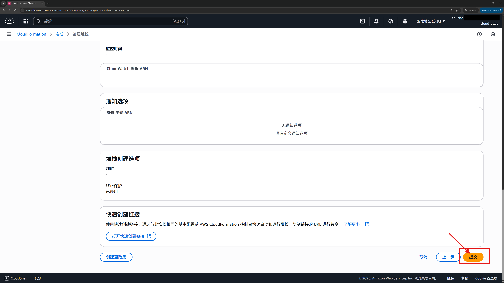
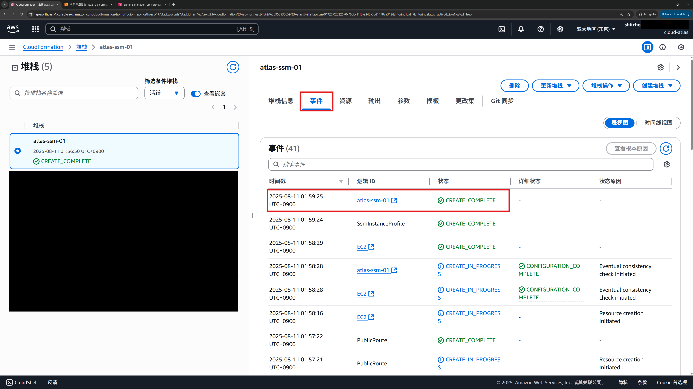
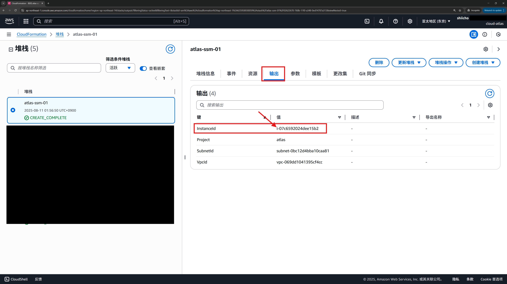

# 01 · 通过控制台部署最小 SSM 实验环境（VPC + EC2 + SSM）

> **目标**：用 CloudFormation 控制台一键部署可被 SSM 管理的 EC2（免密钥对、无入站端口）。
> **模板路径**：`cfn/ssm-lab-minimal.yaml`（参数 `Project` 默认值：`atlas`）
> **区域**：建议 `ap-northeast-1`（东京）
> **费用**：t3.micro + 基础网络，成本很低；**完成后记得删除堆栈（参考 Step 8）**

## 将完成的内容
1. 选择并上传模板
2. 填好堆栈名称与参数（`Project=atlas` 等）
3. 确认创建（含 IAM 资源勾选）
4. 观察创建事件至 `CREATE_COMPLETE`
5. 在 **输出（Outputs）** 读取 `InstanceId` 等信息

## Step 1 — 打开 CloudFormation 并创建堆栈
- **操作**：服务 → **CloudFormation** → **创建堆栈** → **使用新资源（标准）**（Create stack with new resources (standard)）。

## Step 2 — 选择模板（上传本地文件）
- **操作**：在 **准备模板**（Prepare template）选择 **模板已就绪** → **上传模板文件** → 选择 `ssm-lab-minimal.yaml` → **下一步**。

## Step 3 — 指定堆栈详细信息（Stack name & 参数）
- **操作**：
  - **堆栈名称**：`atlas-ssm-01`
  - **参数**：`Project=atlas`（保持默认即可）；`VpcCidr/ PublicSubnetCidr/ InstanceType/ AmiId` 默认
  - 点击 **下一步**

## Step 4 — 配置堆栈选项（可留空）
- **操作**：可添加标签（建议）
  - `Key=Project, Value=atlas`

## Step 5 — 审核并提交（确认 IAM 资源）
- **操作**：页面底部勾选
  - **我承认 AWS CloudFormation 可能会创建 IAM 资源**
  - 点击 **下一步**（Next）
  - 页面跳转后，下滑到底部，点击 **提交**（Submit）

## Step 6 — 观察创建事件（Events）
- **操作**：进入堆栈详情 → **事件**（Events）标签页，等待状态到 **CREATE_COMPLETE**。

## Step 7 — 获取输出（Outputs）
- **操作**：切到 **输出**（Outputs）标签页，记录：
  - `InstanceId`（后续在 SSM 中识别用）
  - `VpcId`、`SubnetId`（可选）

## （可选）Step 8 — 课程结束后清理堆栈，避免不必要扣费
- **操作**：选中 `atlas-ssm-01` → **删除**（Delete）→ 确认。

## 下一步
完成本章后，请继续：
- **[02 · 使用 Session Manager 免密登录 EC2（浏览器 Shell）](../02-session-manager/)**
- **[03 · Run Command 批量执行脚本（安装 htop）](../03-run-command/)**
