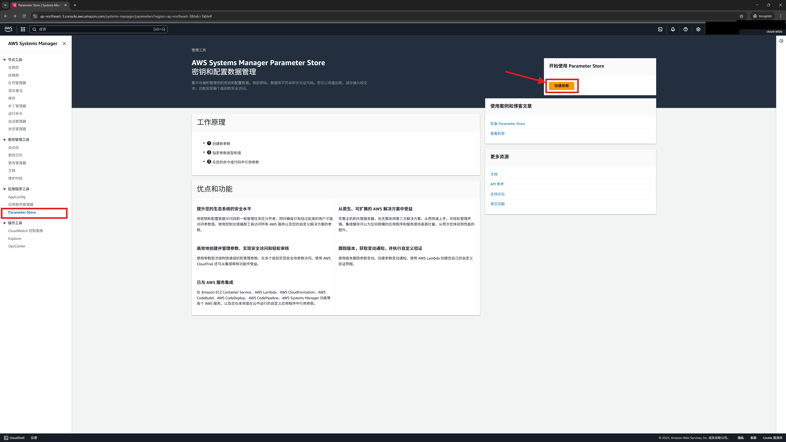
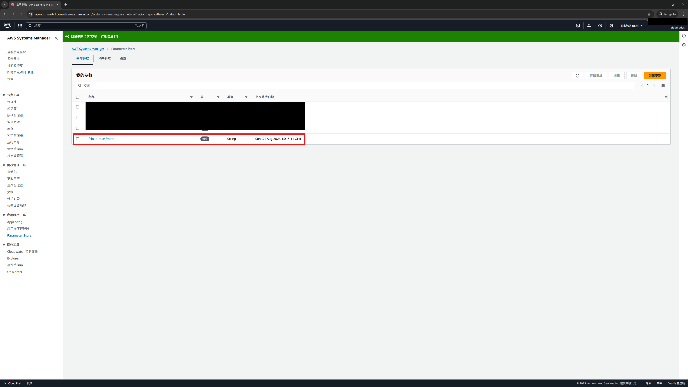
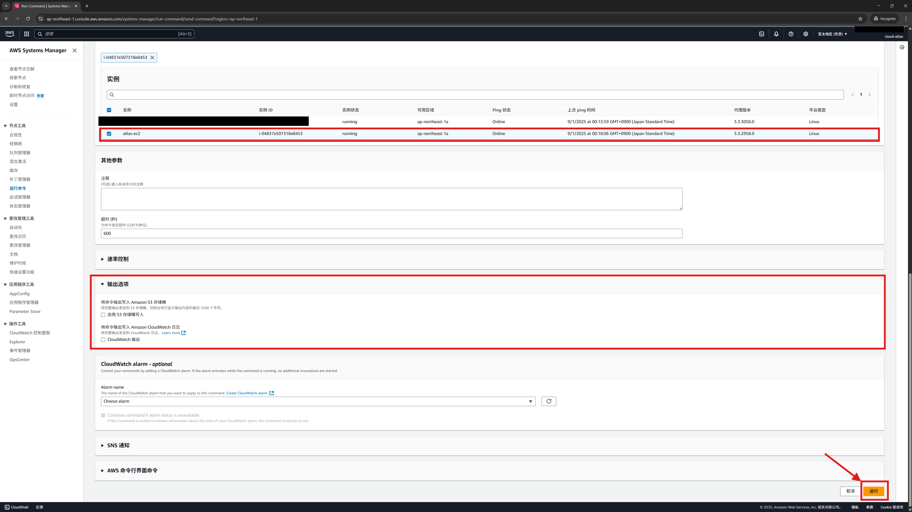
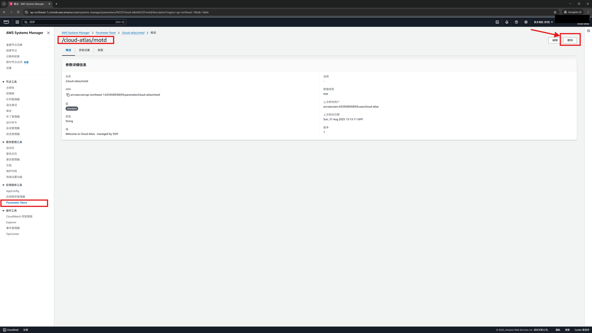

# 04 · Parameter Store 参数存储（写 MOTD 示例）

> **目标**: 用 **Parameter Store** 集中保存配置/密钥；通过 **Run Command** 在 EC2 上读取并应用。  
> **前置**: 已完成 [01](../01-cfn-deploy/)、[02](../02-session-manager/)；实例为受管实例（Managed instance）。  
> **系统**: Amazon Linux 2023（`dnf`）。

## 你将完成
- 在 **Parameter Store** 创建参数（示例: `/cloud-atlas/motd`）
- 用 **Run Command** 在 EC2 写入 `/etc/motd.d/10-cloud-atlas` （[小C科普：什么是 MOTD？](../../../glossary/linux/motd.md)）

## Step 1 — 创建参数（控制台）
**操作**: Systems Manager → **Parameter Store** → **创建参数**
- **名称**: `/cloud-atlas/motd`
- **层**: 标准
- **类型**: String
- **数据类型**: text
- **值**: `Welcome to Cloud Atlas · managed by SSM`





## Step 2 — Run Command 读取并写入 MOTD
参考上一课 [03 · Run Command 批量执行脚本（示例：安装 htop）](../03-run-command/) 的内容，进入【运行命令】页面，并选择 **AWS-RunShellScript**，在 **命令参数（Commands）** 粘贴：

```bash
set -euo pipefail

# 1) 安装 awscli（AL2023）
if ! command -v aws >/dev/null 2>&1; then
  sudo dnf -y install awscli
fi

# 2) 读取明文参数
MOTD=$(aws ssm get-parameter \
  --name /cloud-atlas/motd \
  --query 'Parameter.Value' \
  --output text)

# 3) 写入 motd（登录提示）
echo "$MOTD" | sudo tee /etc/motd.d/10-cloud-atlas >/dev/null

# 4) 输出确认
cat /etc/motd.d/10-cloud-atlas
```

参考上一课 [03 · Run Command 批量执行脚本（示例：安装 htop）](../03-run-command/) 的内容，选择目标EC2并运行。




## Step 3 — 验证（Session Manager 会话内）

参考第 02 课 [02 · Session Manager 免密登录 EC2（浏览器 Shell）](../02-session-manager/) ，在浏览器登录EC2，执行:

```bash
cat /etc/motd.d/10-cloud-atlas
# 期望: 显示 Welcome to Cloud Atlas · managed by SSM
```


## Step 4 — 清理 / Cleanup
删除Parameter Store参数: /cloud-atlas/motd



若不再使用实验环境: 按 01 课 [01 · CloudFormation 部署最小实验环境](../01-cfn-deploy/) 最后部分，删除 CloudFormation 栈。

## 相关参考
- [MOTD（Message of the Day）](../../../glossary/linux/motd.md)
- [SSM 会话为什么不自动显示 MOTD？（以及可选解决方案）](../../../glossary/aws/motd-ssm-autoprint.md)

## 下一步
- **[05 · 会话日志落地（CloudWatch）](../05-session-logging/)**
- **[06 · State Manager 状态管理器](../06-state-manager/)**
