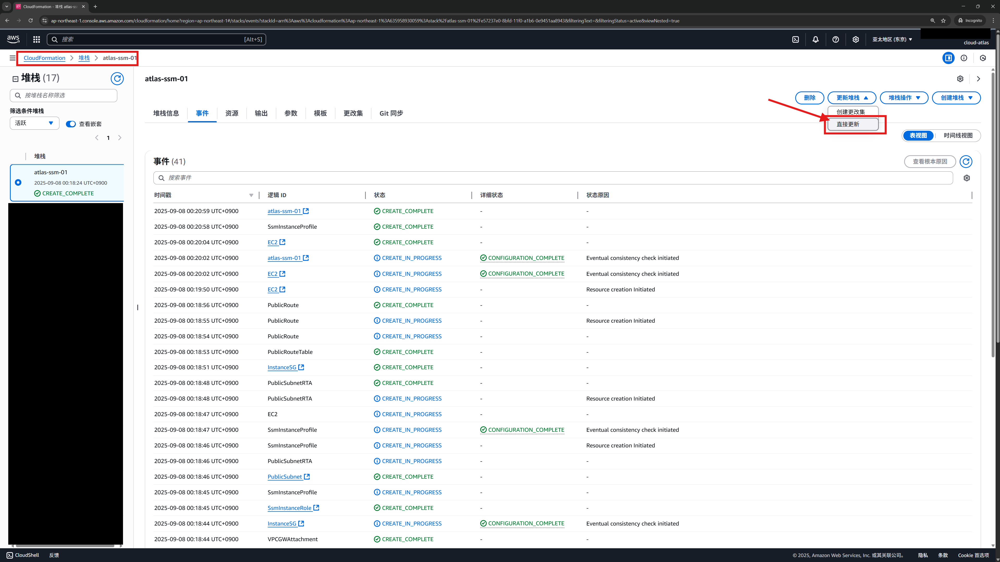
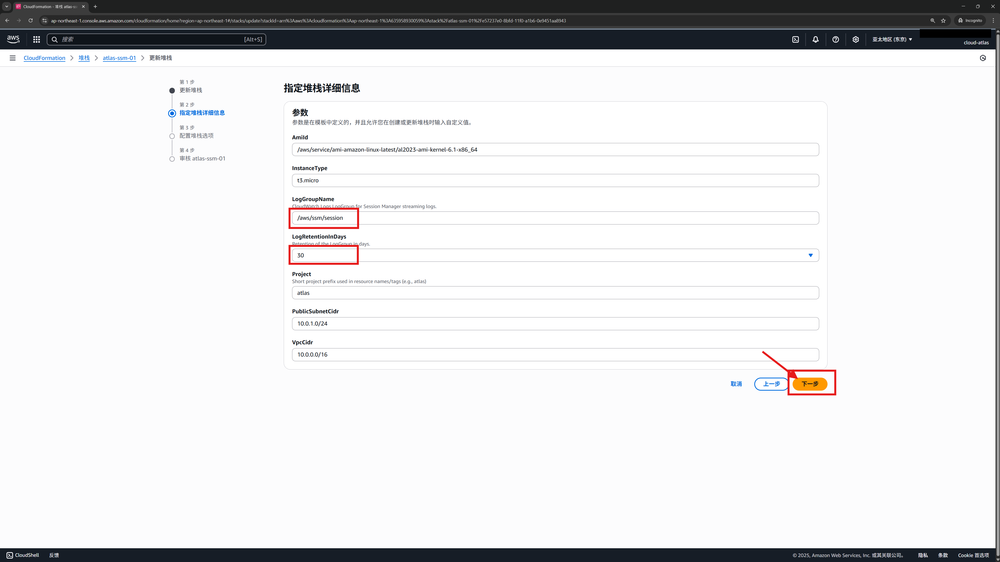
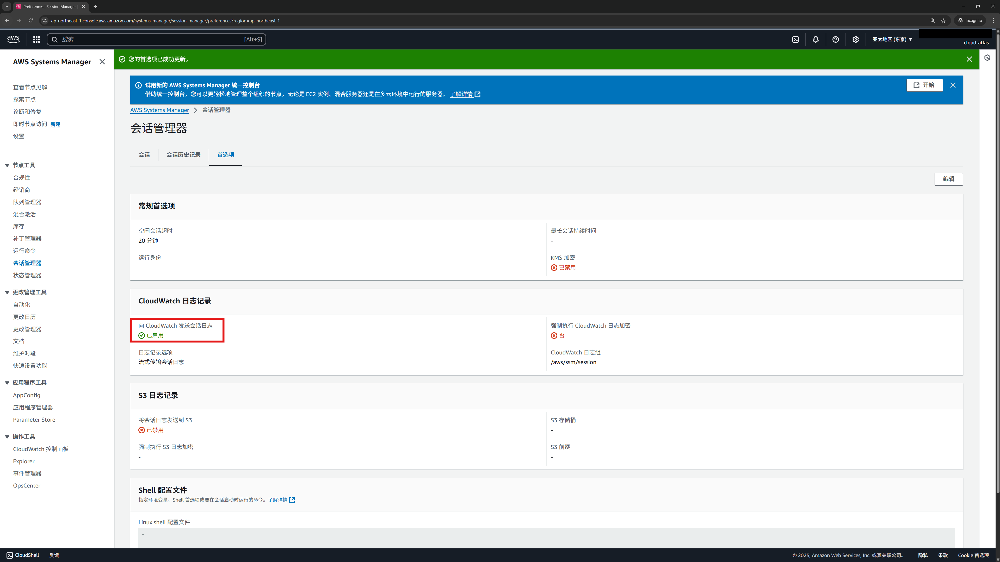
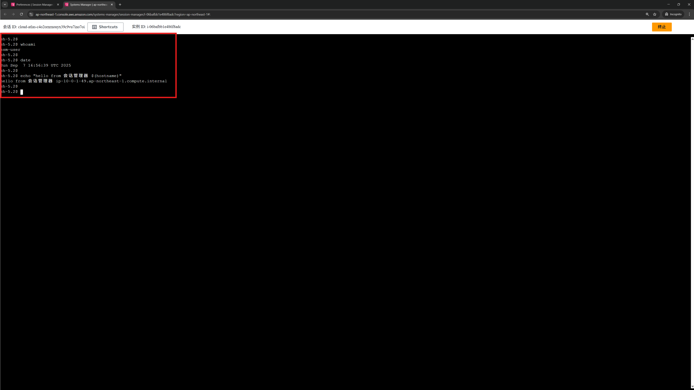
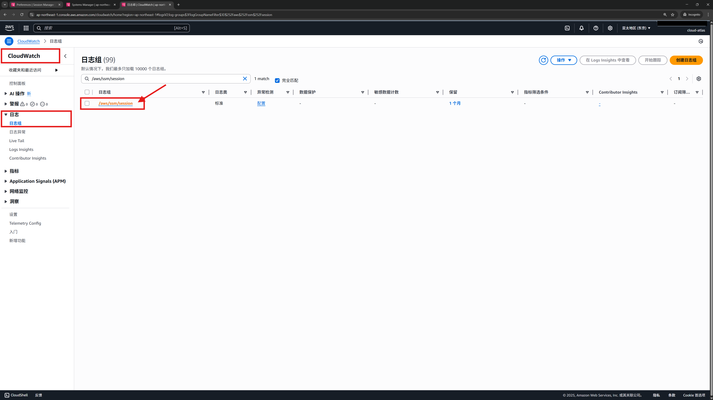
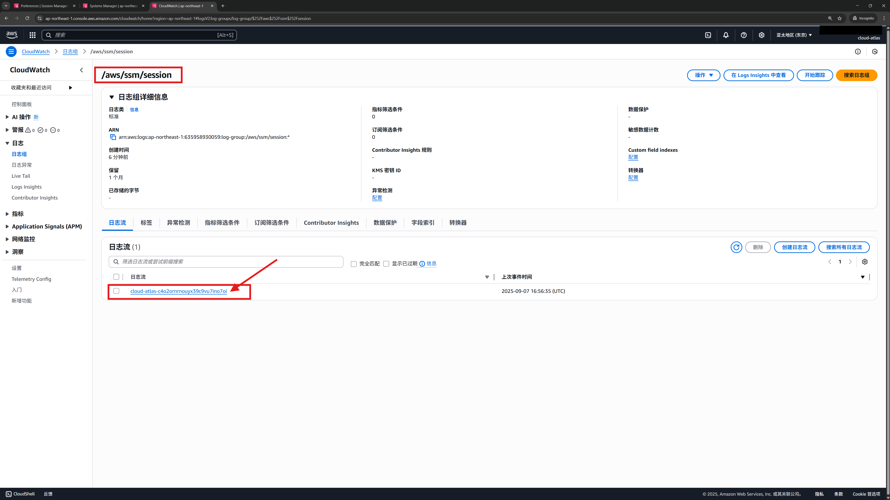
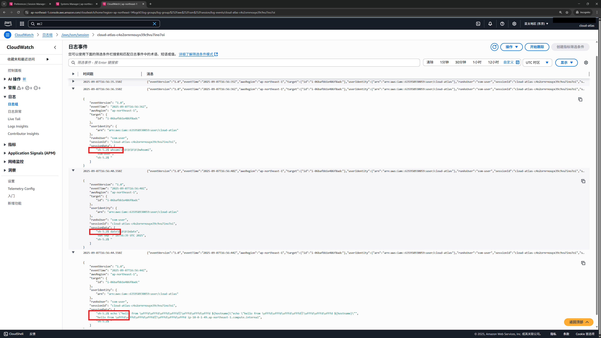

# 05 · Session logging 会话/命令日志落地（CloudWatch）

> **目标**：把 **会话管理器** 的交互会话内容（输入/输出）持续记录到 **CloudWatch Logs**，形成审计闭环。  
> **前置**：已完成 [01](../01-cfn-deploy/)/[02](../02-session-manager/)/[03](../03-run-command/)（最小环境 + 会话管理器 + 运行命令）；实例为受管实例（Managed instance）。  
> **系统**：Amazon Linux 2023（但本章与 OS 关系不大）。

## 你将完成 / What you'll do
- 用 **v2 模板** 为实验环境创建 **CloudWatch 日志组**（含保留期），并修改 IAM 权限，授权 CloudWatch 相关能力给 EC2
- 在 **会话管理器 首选项** 打开 **日志记录（流式传输会话日志）**
- 启动会话并验证，能在 **CloudWatch Logs** 看到会话内容
- 了解：如果想把日志写到 **S3** 时该怎么做（本课不做，只简述）

## Step 0 —（推荐）CloudFormation控制台更新堆栈：用 v2 模板创建日志组

前往 **CloudFormation 堆栈** 页面，选择[第 01 课](../01-cfn-deploy/)创建的栈，点击 **更新堆栈**，选择 **直接更新**



→ 选择 **替换现有模板**，选择 **上传模板文件**，并使用 [ssm-lab-minimal-v2.yaml](../01-cfn-deploy/cfn/ssm-lab-minimal-v2.yaml) 文件，点击 **下一步**


→ 参数页，保持以下默认设置，点击 **下一步** 到【配置堆栈选项】页面
- **LogGroupName**：`/cloud/aws-ssm/session`
- **LogRetentionInDays**：`30`



→ 勾选【我确认，AWS CloudFormation 可能创建 IAM 资源。】，点击 **下一步**


→ 确认【更改 (2)】的内容之后，点击 **提交**


→ 观察并等待【事件】变为 **UPDATE_COMPLETE**


## Step 1 — 设置日志记录首选项

Systems Manager → **会话管理器** → **首选项** → **编辑**


在【CloudWatch 日志记录】处，启用 **CloudWatch 日志记录**，并按照如下进行设置：
  - 选择您的首选日志记录选项：**流式传输会话日志（Recommended）**
  - 强制加密：取消勾选
  - Find Log Groups：选择 **在文本框中输入日志组名称**  ，并输入前面 CloudFormation 中创建的日志组，例如默认的 `/cloud/aws-ssm/session`

> 注意：如果你没有做 Step 0，或者 Step 0 中创建了不同名字的日志组，那么在文本框手填 `/cloud/aws-ssm/session` 会提示"**指定的日志组不存在**"


→ 其它设置保持默认即可，点击 **保存**


→ 此时，【向 CloudWatch 发送会话日志】的地方会显示  **已启用**



## Step 2 — 启动会话并产生日志

参考第 02 课 [02 · Session Manager 免密登录 EC2（浏览器 Shell）](../02-session-manager/) ，在浏览器登录EC2，执行:

```bash
whoami
date
echo "hello from 会话管理器 $(hostname)"
```



## Step 3 — 在 CloudWatch Logs 验证

打开 CloudWatch → **日志组** → 进入日志组 `/cloud/aws-ssm/session`




进入最新的 **日志流**（名称通常包含实例 ID 或 会话 ID）



能看到刚才会话的输入/输出



> 备注：sessionData 是 Base64，并且输出流（尤其是带交互的 shell）常含有 ANSI 转义序列（颜色、光标控制），控制台直接渲染就会看到黑框/奇怪符号。

## Step 4 — 清理 / Cleanup

若不再使用实验环境: 按 01 课 [01 · CloudFormation 部署最小实验环境](../01-cfn-deploy/) 最后部分，删除 CloudFormation 栈。

## （可选）把会话日志写到 S3 — 简述

需要做什么？ 创建 S3 桶，给桶加最小权限的 Bucket policy。

Bucket policy（示例，改成你的值）

```json
{
  "Version": "2012-10-17",
  "Statement": [{
    "Effect": "Allow",
    "Principal": { "Service": "ssm.amazonaws.com" },
    "Action": "s3:PutObject",
    "Resource": "arn:aws:s3:::<BUCKET_NAME>/ssm/session/*",
    "Condition": {
      "StringEquals": {
        "aws:SourceAccount": "<ACCOUNT_ID>",
        "aws:SourceArn": "arn:aws:ssm:<REGION>:<ACCOUNT_ID>:*"
      }
    }
  }]
}
```

## 相关参考

* [Session Manager 日志记录](https://docs.aws.amazon.com/systems-manager/latest/userguide/session-manager-logging.html)
* [为日志记录创建/更新实例角色权限](https://docs.aws.amazon.com/systems-manager/latest/userguide/getting-started-create-iam-instance-profile.html#create-iam-instance-profile-ssn-logging)

## 下一步
- **[06 · State Manager 状态管理器](../06-state-manager/)**
- **[07 · Hybrid 托管 On-Prem / Docker](../07-hybrid/)**
