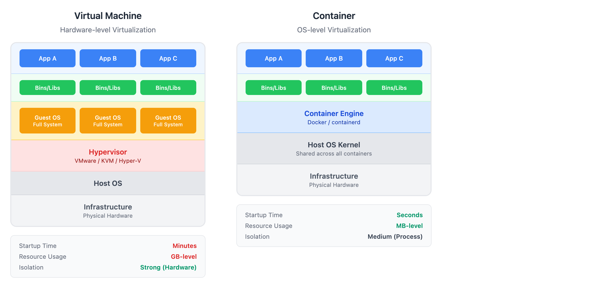
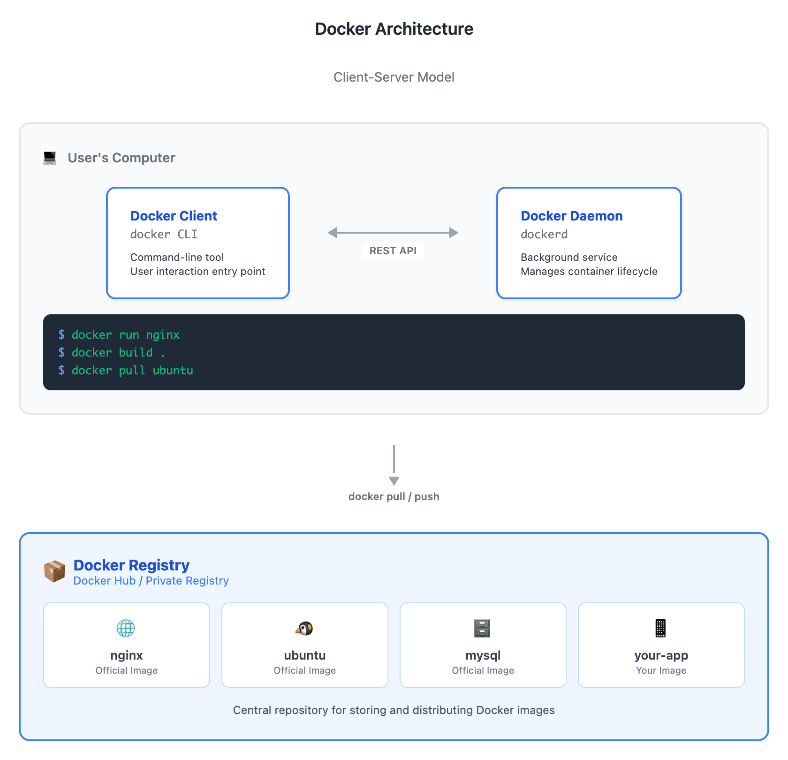
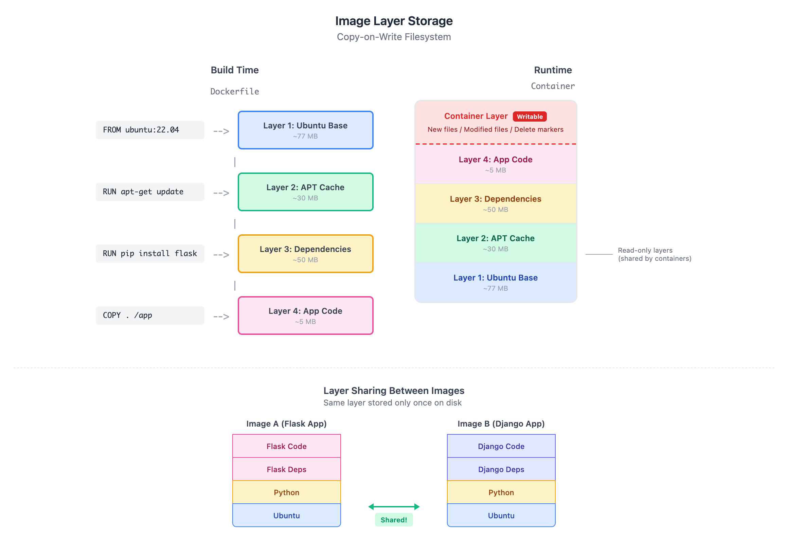

# 00 · 概念导入：Docker 架构与设计

> **目标**：理解 Docker 为什么这样设计，建立容器化的心智模型  
> **时间**：20 分钟阅读  
> **费用**：无（纯概念）  
> **动手**：本课为概念课，无需环境配置，阅读即可

---

## 容器化解决什么问题？

你是否遇到过这样的场景：

**场景一：「在我机器上能跑」**

```
开发者：「测试一下，在我机器上跑得好好的。」
运维：「但是在服务器上就报错啊。」
开发者：「那肯定是你环境有问题。」
运维：「我按照你的文档配的！」
开发者：「那可能文档漏了点东西...」

（一小时后）

运维：「Python 版本差了 0.0.1，依赖库版本也不一样。」
开发者：「...」
```

**场景二：环境依赖的噩梦**

```
项目 A：需要 Node.js 14
项目 B：需要 Node.js 18
项目 C：需要 Python 3.8 + 特定版本的 OpenSSL

同一台服务器跑这三个？祝你好运。
```

**场景三：部署成本高**

```
新人入职，配置开发环境：半天到一天
新服务器上线，配置运行环境：几小时
升级一个依赖，担心影响其他服务：提心吊胆
```

**核心痛点**：

| 问题 | 后果 |
|------|------|
| 环境不一致 | 开发、测试、生产三套环境各不相同 |
| 依赖冲突 | 不同应用需要不同版本的运行时 |
| 部署复杂 | 每次部署都是一次冒险 |
| 资源隔离弱 | 一个应用出问题可能影响整台服务器 |

**容器化的承诺**：

> 「一次打包，到处运行」  
> — Docker 的核心价值主张

把应用和它所有的依赖打包在一起，形成一个标准化的单元。这个单元在任何支持 Docker 的机器上都能以相同的方式运行。

---

## 容器 vs 虚拟机

很多人第一次听说容器，会问：「这和虚拟机有什么区别？」

让我们通过架构图来理解：



<details>
<summary>View ASCII source</summary>

```
                虚拟机架构                                    容器架构
           Virtual Machine                               Container

┌─────────────────────────────────────┐    ┌─────────────────────────────────────┐
│            Applications             │    │            Applications             │
├───────────┬───────────┬─────────────┤    ├───────────┬───────────┬─────────────┤
│   App A   │   App B   │   App C     │    │   App A   │   App B   │   App C     │
├───────────┼───────────┼─────────────┤    ├───────────┼───────────┼─────────────┤
│  Bins/    │  Bins/    │  Bins/      │    │  Bins/    │  Bins/    │  Bins/      │
│  Libs     │  Libs     │  Libs       │    │  Libs     │  Libs     │  Libs       │
├───────────┼───────────┼─────────────┤    ├───────────┴───────────┴─────────────┤
│  Guest    │  Guest    │  Guest      │    │           Container Engine          │
│   OS      │   OS      │   OS        │    │              (Docker)               │
│ (完整系统) │ (完整系统) │ (完整系统)   │    ├─────────────────────────────────────┤
├───────────┴───────────┴─────────────┤    │            Host OS Kernel           │
│            Hypervisor               │    │           (共享宿主机内核)            │
│          (虚拟机管理器)               │    ├─────────────────────────────────────┤
├─────────────────────────────────────┤    │           Infrastructure            │
│            Host OS                  │    │              (物理机)                │
├─────────────────────────────────────┤    └─────────────────────────────────────┘
│           Infrastructure            │
│              (物理机)                │
└─────────────────────────────────────┘

    每个 VM 都有完整的操作系统                   所有容器共享宿主机内核
    启动时间：分钟级                           启动时间：秒级
    资源占用：GB 级                           资源占用：MB 级
    隔离性：强（硬件级别）                      隔离性：中（进程级别）
```

</details>

**关键区别**：

| 特性 | 虚拟机 (VM) | 容器 (Container) |
|------|------------|-----------------|
| **虚拟化级别** | 硬件级别 | 操作系统级别 |
| **内核** | 每个 VM 有独立内核 | 共享宿主机内核 |
| **启动时间** | 分钟级 | 秒级（甚至毫秒级） |
| **资源占用** | GB 级（完整 OS） | MB 级（只有应用和依赖） |
| **隔离性** | 强（完全隔离） | 中（进程隔离） |
| **性能** | 有虚拟化开销 | 接近原生性能 |
| **典型用途** | 需要不同 OS、强隔离 | 微服务、快速部署 |

**理解关键**：容器不是「轻量级虚拟机」，而是 **「隔离的进程」**。

容器利用 Linux 内核的特性（namespaces、cgroups）实现进程隔离和资源限制，但本质上仍然是宿主机上的进程。这就是为什么容器如此轻量和快速。

---

## Docker 架构

理解 Docker 的架构，对于后续的学习至关重要。Docker 采用经典的 Client-Server 架构：



<details>
<summary>View ASCII source</summary>

```
                              Docker 架构图
                           Docker Architecture

┌─────────────────────────────────────────────────────────────────────────────┐
│                              用户的电脑                                       │
│  ┌─────────────────────────────────────────────────────────────────────┐    │
│  │                                                                     │    │
│  │   ┌─────────────────┐         REST API          ┌────────────────┐ │    │
│  │   │                 │ ◀─────────────────────▶   │                │ │    │
│  │   │  Docker Client  │                           │  Docker Daemon │ │    │
│  │   │   (docker CLI)  │                           │   (dockerd)    │ │    │
│  │   │                 │                           │                │ │    │
│  │   │  命令行工具       │                           │  后台服务       │ │    │
│  │   │  用户交互入口     │                           │  管理容器生命周期│ │    │
│  │   └─────────────────┘                           └───────┬────────┘ │    │
│  │                                                         │          │    │
│  │        docker run nginx                                 │          │    │
│  │        docker build .                                   │          │    │
│  │        docker pull ubuntu                               │          │    │
│  │                                                         │          │    │
│  └─────────────────────────────────────────────────────────┼──────────┘    │
│                                                            │               │
└────────────────────────────────────────────────────────────┼───────────────┘
                                                             │
                                            docker pull / push
                                                             │
                                                             ▼
┌─────────────────────────────────────────────────────────────────────────────┐
│                           Docker Registry                                    │
│                          (Docker Hub / 私有仓库)                              │
│                                                                              │
│   ┌──────────────┐  ┌──────────────┐  ┌──────────────┐  ┌──────────────┐    │
│   │    nginx     │  │    ubuntu    │  │    mysql     │  │   your-app   │    │
│   │   (官方镜像)   │  │   (官方镜像)  │  │   (官方镜像)  │  │   (你的镜像)   │    │
│   └──────────────┘  └──────────────┘  └──────────────┘  └──────────────┘    │
│                                                                              │
│   存储和分发 Docker 镜像的中央仓库                                              │
└─────────────────────────────────────────────────────────────────────────────┘
```

</details>

**三大组件**：

### 1. Docker Client（客户端）

- **是什么**：命令行工具 `docker`
- **作用**：用户与 Docker 交互的入口
- **工作方式**：将命令发送给 Docker Daemon

```bash
docker run nginx      # 运行容器
docker build .        # 构建镜像
docker pull ubuntu    # 拉取镜像
```

### 2. Docker Daemon（守护进程）

- **是什么**：后台运行的服务 `dockerd`
- **作用**：实际管理容器、镜像、网络、存储
- **工作方式**：监听 API 请求，执行 Docker 操作

Docker Daemon 负责：
- 创建、启动、停止、删除容器
- 构建、存储、管理镜像
- 配置网络、挂载存储
- 与 Registry 通信

### 3. Docker Registry（注册表/仓库）

- **是什么**：存储和分发镜像的服务
- **典型例子**：Docker Hub（默认公共仓库）
- **作用**：镜像的「应用商店」

```bash
docker pull nginx           # 从 Docker Hub 拉取
docker push myrepo/myapp    # 推送到 Registry
```

**Client-Server 架构的好处**：

- Docker Client 和 Daemon 可以在不同机器上
- 可以用同一个 Client 管理多个远程 Docker 主机
- API 标准化，支持各种工具集成

---

## 镜像与容器的关系

这是初学者最容易混淆的概念。让我们用一个比喻来理解：

> **镜像 (Image)** 就像「类 (Class)」  
> **容器 (Container)** 就像「实例 (Instance)」

或者更形象地：

> **镜像** 是「菜谱」— 描述了应用应该是什么样子  
> **容器** 是「做好的菜」— 根据菜谱实际运行的应用

**镜像 (Image)**：

- 只读的模板
- 包含应用代码、运行时、依赖、配置
- 可以被分享和重复使用
- 用 Dockerfile 构建

**容器 (Container)**：

- 镜像的运行实例
- 有自己的生命周期（创建、运行、停止、删除）
- 可以被暂停、重启
- 默认情况下是临时的（删除后数据消失）

```bash
# 一个镜像可以创建多个容器
docker run -d --name web1 nginx    # 容器 1
docker run -d --name web2 nginx    # 容器 2
docker run -d --name web3 nginx    # 容器 3

# 三个容器，都基于同一个 nginx 镜像
# 但彼此独立，互不影响
```

**关键理解**：容器本质上是一个 **隔离的进程**，它：
- 有独立的文件系统（来自镜像）
- 有独立的网络栈
- 有独立的进程空间
- 可以设置资源限制（CPU、内存）

---

## 分层存储机制

Docker 镜像采用 **分层存储 (Layered Storage)**，这是理解 Docker 高效的关键。



<details>
<summary>View ASCII source</summary>

```
                           镜像分层存储
                        Image Layer Storage

    构建时 (Dockerfile)                          运行时 (Container)

    FROM ubuntu:22.04                     ┌─────────────────────────┐
         │                                │   Container Layer       │
         ▼                                │   (可写层 - 临时)        │ ← 容器的修改
    ┌─────────────────────────┐           │   • 新建的文件           │    写在这里
    │   Layer 1: Ubuntu Base  │           │   • 修改的文件           │
    │   (基础镜像层)           │           │   • 删除的标记           │
    │   ~77 MB                │           ├─────────────────────────┤
    └─────────────────────────┘           │   Layer 4: App Code     │
         │                                │   (应用代码层)           │
    RUN apt-get update                    │   ~5 MB                 │
         │                                ├─────────────────────────┤
         ▼                                │   Layer 3: Dependencies │
    ┌─────────────────────────┐           │   (依赖层)              │
    │   Layer 2: APT Cache    │           │   ~50 MB                │
    │   (包管理更新)           │           ├─────────────────────────┤
    │   ~30 MB                │           │   Layer 2: APT Cache    │
    └─────────────────────────┘           │   (包管理更新)           │
         │                                │   ~30 MB                │
    RUN pip install flask                 ├─────────────────────────┤
         │                                │   Layer 1: Ubuntu Base  │
         ▼                                │   (基础镜像层)           │
    ┌─────────────────────────┐           │   ~77 MB                │
    │   Layer 3: Dependencies │           └─────────────────────────┘
    │   (依赖层)              │
    │   ~50 MB                │                    只读层
    └─────────────────────────┘                 (多个容器共享)
         │
    COPY . /app
         │
         ▼
    ┌─────────────────────────┐
    │   Layer 4: App Code     │
    │   (应用代码层)           │
    │   ~5 MB                 │
    └─────────────────────────┘


    镜像 A (Flask App)          镜像 B (Django App)
    ┌─────────────────┐        ┌─────────────────┐
    │  Flask Code     │        │  Django Code    │
    ├─────────────────┤        ├─────────────────┤
    │  Flask Deps     │        │  Django Deps    │
    ├─────────────────┤        ├─────────────────┤
    │     Python      │ ◀───── │     Python      │  ← 同一层，只存一份！
    ├─────────────────┤  共享   ├─────────────────┤
    │     Ubuntu      │ ◀───── │     Ubuntu      │  ← 同一层，只存一份！
    └─────────────────┘        └─────────────────┘
```

</details>

**分层的核心概念**：

1. **每条 Dockerfile 指令创建一层**
   ```dockerfile
   FROM ubuntu:22.04      # Layer 1
   RUN apt-get update     # Layer 2
   RUN pip install flask  # Layer 3
   COPY . /app            # Layer 4
   ```

2. **层是只读的**
   - 镜像的每一层都不可修改
   - 确保镜像的一致性和可复用性

3. **层可以被共享**
   - 多个镜像可以共享相同的基础层
   - `ubuntu:22.04` 只在磁盘上存储一份
   - 大大节省存储空间

4. **容器层是可写的**
   - 容器启动时，在镜像层之上添加一个可写层
   - 所有的修改都发生在这个容器层
   - 容器删除时，容器层也被删除（数据消失）

**分层存储的好处**：

| 好处 | 说明 |
|------|------|
| **节省存储** | 相同的层只存储一份 |
| **加速拉取** | 已有的层无需重新下载 |
| **加速构建** | 未改变的层使用缓存 |
| **便于分发** | 只传输差异层 |

**理解关键**：这就是为什么 Dockerfile 的顺序很重要——把不常变化的指令放在前面，可以最大化利用缓存。

---

## 核心概念总结

| 概念 | 要点 |
|------|------|
| **容器化的价值** | 解决「环境不一致」问题，一次打包到处运行 |
| **容器 vs VM** | 容器共享内核，更轻量、更快；VM 完全隔离，更安全 |
| **Docker 架构** | Client-Server 模式：Client → Daemon → Registry |
| **镜像 vs 容器** | 镜像是模板（只读），容器是实例（可运行） |
| **分层存储** | 每层只读可共享，容器层可写但临时 |

---

## 检查清单

读完本课，你应该能够：

- [ ] 解释容器化解决了什么问题
- [ ] 说出容器和虚拟机的三个主要区别
- [ ] 画出 Docker 的三层架构（Client, Daemon, Registry）
- [ ] 区分镜像和容器的概念
- [ ] 理解为什么 Docker 镜像采用分层存储

---

## 延伸阅读

- [Docker 官方文档 - Get Started](https://docs.docker.com/get-started/)
- [Docker 官方文档 - Docker Architecture](https://docs.docker.com/get-started/docker-overview/#docker-architecture)
- [Containers vs VMs - Docker Blog](https://www.docker.com/resources/what-container/)

---

## 系列导航

[Home](../) | [01 · 安装配置与第一个容器 -->](../01-first-container/)
