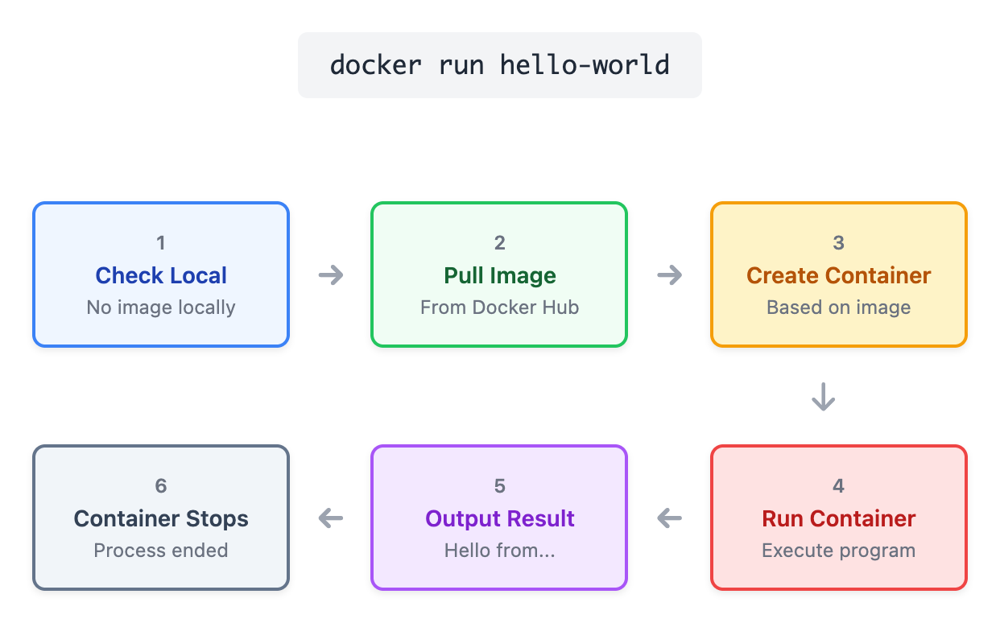
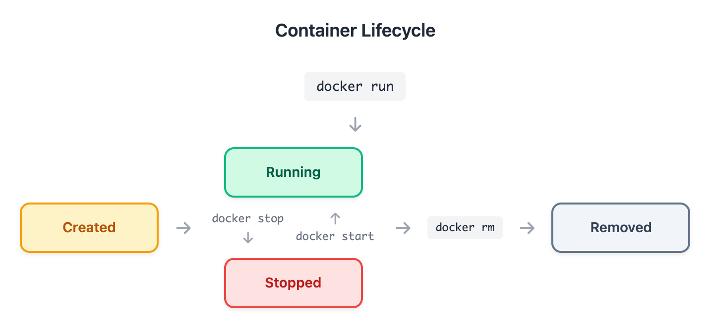

# 01 - 安装配置与第一个容器

> **目标**：安装 Docker，运行你的第一个容器，掌握容器生命周期管理
> **前置**：已阅读 [00 - 概念导入](../00-concepts/)
> **时间**：30-35 分钟
> **费用**：Free（本地操作）

---

## 将学到的内容

1. 安装 Docker Desktop 或 Docker Engine
2. 运行第一个容器（hello-world）
3. 掌握容器运行参数（-d, -it, --name）
4. 管理容器生命周期（ps, stop, start, rm）
5. 查看容器日志和状态（logs, inspect, stats）
6. 进入运行中的容器（exec -it）

---

## Step 1 - 先跑起来：5 分钟运行第一个容器

> **目标**：先"尝到" Docker 的味道，再理解原理。

### 1.1 检查 Docker 安装

```bash
docker --version
```

```
Docker version 24.x.x, build xxxxxx
```

> **版本说明**：显示 `Docker version 2x.x.x` 或更高版本即可。本课程兼容 Docker 20.10+。

> **没有安装 Docker？**
>
> **Windows / macOS（推荐 Docker Desktop）**：
> - 下载 [Docker Desktop](https://www.docker.com/products/docker-desktop/)
> - Windows 需要启用 WSL2
> - macOS 直接安装即可
>
> **Linux（Docker Engine）**：
> ```bash
> # Ubuntu/Debian
> curl -fsSL https://get.docker.com | sudo sh
> sudo usermod -aG docker $USER
> # 重新登录后生效
> ```

验证 Docker 服务正在运行：

```bash
docker info | head -5
```

```
Client: Docker Engine - Community
 Version:    24.0.7
 Context:    default
 Debug Mode: false
```

### 1.2 运行 Hello World

```bash
docker run hello-world
```

```
Unable to find image 'hello-world:latest' locally
latest: Pulling from library/hello-world
...
Hello from Docker!
This message shows that your installation appears to be working correctly.
...
```

**恭喜！你运行了第一个 Docker 容器！**

### 1.3 发生了什么？

刚才这一条命令，Docker 做了这些事：

1. **检查本地** — 本地没有 `hello-world` 镜像
2. **拉取镜像** — 从 Docker Hub 下载 `hello-world:latest`
3. **创建容器** — 基于镜像创建一个容器实例
4. **运行容器** — 执行容器内的程序
5. **输出结果** — 打印消息后程序退出
6. **容器停止** — 程序结束，容器进入停止状态



<details>
<summary>View ASCII source</summary>

```
                        docker run hello-world

┌─────────────────┐     ┌─────────────────┐     ┌─────────────────┐
│  1. 检查本地     │────▶│  2. 拉取镜像     │────▶│  3. 创建容器     │
│  本地没有镜像    │     │  从 Docker Hub   │     │  基于镜像       │
└─────────────────┘     └─────────────────┘     └─────────────────┘
                                                        │
                                                        ▼
┌─────────────────┐     ┌─────────────────┐     ┌─────────────────┐
│  6. 容器停止     │◀────│  5. 输出结果     │◀────│  4. 运行容器     │
│  程序结束       │     │  Hello from...   │     │  执行程序       │
└─────────────────┘     └─────────────────┘     └─────────────────┘
```

</details>

---

## Step 2 - 容器运行参数

`hello-world` 运行完就退出了。让我们运行一个能持续运行的容器。

### 2.1 后台运行 Nginx

```bash
docker run -d nginx
```

```
Unable to find image 'nginx:latest' locally
latest: Pulling from library/nginx
...
a1b2c3d4e5f6...  # 返回容器 ID
```

**参数说明**：
- `-d`（detach）：后台运行，不占用终端

### 2.2 查看运行中的容器

```bash
docker ps
```

```
CONTAINER ID   IMAGE   COMMAND                  CREATED          STATUS          PORTS     NAMES
a1b2c3d4e5f6   nginx   "/docker-entrypoint.…"   10 seconds ago   Up 9 seconds    80/tcp    nervous_tesla
```

> **观察**：容器有一个随机生成的名字（如 `nervous_tesla`）。这不利于管理！

### 2.3 给容器命名（推荐做法）

先停止并删除刚才的容器：

```bash
docker stop a1b2c3d4e5f6   # 用你的容器 ID
docker rm a1b2c3d4e5f6
```

重新运行，这次指定名字：

```bash
docker run -d --name web-server nginx
```

```
CONTAINER ID   IMAGE   COMMAND                  CREATED          STATUS          PORTS     NAMES
b2c3d4e5f6a7   nginx   "/docker-entrypoint.…"   5 seconds ago    Up 4 seconds    80/tcp    web-server
```

> **最佳实践**：始终使用 `--name` 给容器命名。随机名字难以管理，也难以在脚本中引用。

### 2.4 交互式运行

有些场景需要与容器交互（如进入 Shell）：

```bash
docker run -it ubuntu bash
```

```
root@c3d4e5f6a7b8:/#
```

**参数说明**：
- `-i`（interactive）：保持 STDIN 打开
- `-t`（tty）：分配伪终端
- `-it`：通常一起使用，提供交互式 Shell

在容器内尝试：

```bash
root@c3d4e5f6a7b8:/# cat /etc/os-release | head -2
PRETTY_NAME="Ubuntu 24.04.1 LTS"
VERSION_ID="24.04"

root@c3d4e5f6a7b8:/# exit
```

> **注意**：`exit` 后容器会停止，因为容器的主进程（bash）结束了。

### 2.5 参数总结

| 参数 | 说明 | 使用场景 |
|------|------|----------|
| `-d` | 后台运行（detach） | Web 服务器、数据库等长期运行的服务 |
| `-it` | 交互式 + 终端 | 调试、进入容器 Shell |
| `--name` | 指定容器名 | 所有场景（推荐始终使用） |
| `--rm` | 退出后自动删除 | 一次性任务、测试 |

---

## Step 3 - 容器生命周期



<details>
<summary>View ASCII source</summary>

```
                        容器生命周期
                    Container Lifecycle

                        docker run
                            │
                            ▼
┌─────────────┐       ┌─────────────┐
│   Created   │──────▶│   Running   │◀─────┐
│   已创建    │       │   运行中     │      │
└─────────────┘       └──────┬──────┘      │
                             │             │
                       docker stop    docker start
                             │             │
                             ▼             │
                       ┌─────────────┐     │
                       │   Stopped   │─────┘
                       │   已停止    │
                       └──────┬──────┘
                              │
                         docker rm
                              │
                              ▼
                       ┌─────────────┐
                       │   Removed   │
                       │   已删除    │
                       └─────────────┘
```

</details>

### 3.1 查看容器状态

```bash
# 查看运行中的容器
docker ps

# 查看所有容器（包括已停止的）
docker ps -a
```

```
CONTAINER ID   IMAGE          COMMAND    CREATED          STATUS                     NAMES
b2c3d4e5f6a7   nginx          ...        5 minutes ago    Up 5 minutes               web-server
c3d4e5f6a7b8   ubuntu         "bash"     2 minutes ago    Exited (0) 1 minute ago    eager_morse
```

> **重要**：`docker ps` 只显示运行中的容器。用 `docker ps -a` 看全部。

### 3.2 停止容器

```bash
docker stop web-server
```

```bash
docker ps -a
```

```
CONTAINER ID   IMAGE   COMMAND   CREATED          STATUS                      NAMES
b2c3d4e5f6a7   nginx   ...       10 minutes ago   Exited (0) 5 seconds ago    web-server
```

### 3.3 启动已停止的容器

```bash
docker start web-server
```

```bash
docker ps
```

```
CONTAINER ID   IMAGE   COMMAND   CREATED          STATUS         NAMES
b2c3d4e5f6a7   nginx   ...       11 minutes ago   Up 3 seconds   web-server
```

### 3.4 重启容器

```bash
docker restart web-server
```

### 3.5 删除容器

```bash
# 先停止
docker stop web-server

# 再删除
docker rm web-server

# 或者强制删除运行中的容器（谨慎使用）
docker rm -f web-server
```

### 3.6 清理所有停止的容器

```bash
# 查看会被删除的容器
docker container prune --dry-run

# 执行清理
docker container prune
```

```
WARNING! This will remove all stopped containers.
Are you sure you want to continue? [y/N] y
Deleted Containers:
c3d4e5f6a7b8...
...
Total reclaimed space: 0B
```

> **养成习惯**：定期运行 `docker container prune` 清理停止的容器，避免磁盘空间被占用。

---

## Step 4 - 查看日志和状态

### 4.1 启动一个带日志的容器

```bash
docker run -d --name web-server nginx
```

### 4.2 查看容器日志

```bash
docker logs web-server
```

```
/docker-entrypoint.sh: /docker-entrypoint.d/ is not empty, will attempt to perform configuration
/docker-entrypoint.sh: Looking for shell scripts in /docker-entrypoint.d/
...
```

实时跟踪日志（类似 `tail -f`）：

```bash
docker logs -f web-server
```

按 `Ctrl+C` 退出日志跟踪。

查看最后 N 行：

```bash
docker logs --tail 10 web-server
```

### 4.3 查看容器详细信息

```bash
docker inspect web-server
```

输出是 JSON 格式，包含容器的所有配置信息。

提取特定信息（如 IP 地址）：

```bash
docker inspect --format='{{.NetworkSettings.IPAddress}}' web-server
```

```
172.17.0.2
```

### 4.4 实时资源监控

```bash
docker stats
```

```
CONTAINER ID   NAME         CPU %     MEM USAGE / LIMIT     MEM %     NET I/O       BLOCK I/O   PIDS
b2c3d4e5f6a7   web-server   0.00%     3.34MiB / 7.77GiB     0.04%     1.05kB / 0B   0B / 0B     3
```

按 `Ctrl+C` 退出。

查看单个容器：

```bash
docker stats web-server --no-stream
```

---

## Step 5 - 进入容器

### 5.1 在运行中的容器执行命令

```bash
# 执行单个命令
docker exec web-server cat /etc/nginx/nginx.conf
```

### 5.2 进入容器 Shell

```bash
docker exec -it web-server bash
```

```
root@b2c3d4e5f6a7:/#
```

在容器内：

```bash
root@b2c3d4e5f6a7:/# ls /usr/share/nginx/html/
50x.html  index.html

root@b2c3d4e5f6a7:/# cat /etc/nginx/nginx.conf | head -5

root@b2c3d4e5f6a7:/# exit
```

> **注意**：`exec` 进入容器后 `exit`，容器不会停止。因为主进程（nginx）还在运行。
>
> 对比 `docker run -it`，那个场景下主进程就是 bash，exit 后容器就停止了。

### 5.3 exec vs run 的区别

| 命令 | 作用 | 容器状态 |
|------|------|----------|
| `docker run -it` | 创建新容器并进入 | exit 后容器停止（主进程结束）|
| `docker exec -it` | 进入已运行的容器 | exit 后容器继续运行 |

---

## Step 6 - Mini Project：Nginx 容器实战

现在让我们整合所学，完成一个完整的实战练习。

### 任务清单

1. 拉取 nginx 镜像
2. 后台运行 nginx 容器，命名为 `my-nginx`
3. 查看容器状态和日志
4. 进入容器查看 nginx 配置
5. 停止并删除容器
6. 清理环境

### 操作步骤

**1. 拉取镜像**

```bash
docker pull nginx:1.28
```

> **最佳实践**：使用明确的版本标签（如 `1.25`），而不是 `latest`。

**2. 运行容器**

```bash
docker run -d --name my-nginx nginx:1.28
```

**3. 验证运行状态**

```bash
docker ps
```

预期输出：

```
CONTAINER ID   IMAGE        COMMAND                  CREATED          STATUS          PORTS     NAMES
d4e5f6a7b8c9   nginx:1.28   "/docker-entrypoint.…"   5 seconds ago    Up 4 seconds    80/tcp    my-nginx
```

**4. 查看日志**

```bash
docker logs my-nginx
```

**5. 进入容器查看配置**

```bash
docker exec -it my-nginx bash
```

在容器内：

```bash
root@d4e5f6a7b8c9:/# cat /etc/nginx/nginx.conf
root@d4e5f6a7b8c9:/# ls /usr/share/nginx/html/
root@d4e5f6a7b8c9:/# nginx -v
root@d4e5f6a7b8c9:/# exit
```

**6. 查看资源使用**

```bash
docker stats my-nginx --no-stream
```

**7. 停止并删除容器**

```bash
docker stop my-nginx
docker rm my-nginx
```

**8. 验证清理完成**

```bash
docker ps -a | grep my-nginx
# 应该没有输出
```

### 检查点

完成以上步骤后，你应该：
- [ ] 成功运行了命名容器
- [ ] 看到了 nginx 的启动日志
- [ ] 进入了容器并查看了配置
- [ ] 正确停止并删除了容器

---

## 反模式警示

### 反模式 1：忘记删除停止的容器

**问题**：

```bash
docker ps -a
```

```
CONTAINER ID   IMAGE    STATUS                     NAMES
a1b2c3d4e5f6   nginx    Exited (0) 2 days ago      nervous_tesla
b2c3d4e5f6a7   nginx    Exited (0) 3 days ago      happy_morse
c3d4e5f6a7b8   ubuntu   Exited (0) 5 days ago      eager_darwin
...
```

停止的容器会占用磁盘空间（容器层数据）。

**解决方案**：

```bash
# 定期清理
docker container prune

# 或者使用 --rm 参数，退出后自动删除
docker run --rm -it ubuntu bash
```

### 反模式 2：不给容器命名

**问题**：

```bash
docker ps
```

```
CONTAINER ID   IMAGE   NAMES
a1b2c3d4e5f6   nginx   nervous_tesla
b2c3d4e5f6a7   nginx   happy_morse
```

哪个是哪个？难以管理！

**解决方案**：

```bash
# 始终使用 --name
docker run -d --name frontend nginx
docker run -d --name backend python
docker run -d --name database mysql
```

---

## 命令速查表

### 运行容器

```bash
docker run <image>                    # 前台运行
docker run -d <image>                 # 后台运行
docker run -d --name <name> <image>   # 指定名称
docker run -it <image> bash           # 交互式
docker run --rm <image>               # 退出后自动删除
```

### 容器生命周期

```bash
docker ps                    # 运行中的容器
docker ps -a                 # 所有容器
docker stop <container>      # 停止
docker start <container>     # 启动
docker restart <container>   # 重启
docker rm <container>        # 删除
docker rm -f <container>     # 强制删除
docker container prune       # 清理所有停止的容器
```

### 日志和状态

```bash
docker logs <container>           # 查看日志
docker logs -f <container>        # 实时跟踪
docker logs --tail 100 <container> # 最后 100 行
docker inspect <container>        # 详细信息
docker stats                      # 资源监控
docker stats <container> --no-stream  # 单次输出
```

### 进入容器

```bash
docker exec <container> <command>     # 执行命令
docker exec -it <container> bash      # 进入 Shell
docker exec -it <container> sh        # 如果没有 bash
```

---

## 本课小结

| 你学到了 | 命令 | 作用 |
|----------|------|------|
| 验证安装 | `docker --version` | 检查 Docker 版本 |
| 运行容器 | `docker run` | 创建并运行容器 |
| 后台运行 | `-d` | 不占用终端 |
| 交互式 | `-it` | 进入 Shell |
| 命名 | `--name` | 方便管理 |
| 查看状态 | `docker ps` | 容器列表 |
| 停止 | `docker stop` | 优雅停止 |
| 删除 | `docker rm` | 删除容器 |
| 日志 | `docker logs` | 查看输出 |
| 进入 | `docker exec -it` | 调试容器 |

**核心理念**：

> 容器是临时的进程，停止后不会自动删除。养成清理习惯，使用 `--name` 命名。

---

## 检查清单

完成本课后，确认你能够：

- [ ] 验证 Docker 安装正常（`docker --version`）
- [ ] 运行 `hello-world` 容器
- [ ] 使用 `-d` 后台运行容器
- [ ] 使用 `--name` 给容器命名
- [ ] 使用 `docker ps` 和 `docker ps -a` 查看容器
- [ ] 使用 `docker stop` 和 `docker rm` 管理容器
- [ ] 使用 `docker logs` 查看容器日志
- [ ] 使用 `docker exec -it` 进入运行中的容器
- [ ] 完成 Nginx 容器实战练习

---

## 职场小贴士

**日本 IT 现场**

在日本的运维现场（運用現場），容器技术越来越普及。一些常见场景：

- **コンテナ監視**（容器监控）：使用 `docker stats` 或 Prometheus 监控资源
- **ログ確認**（日志确认）：`docker logs` 是排查问题的第一步
- **障害対応**（故障处理）：需要快速进入容器确认状态

常用日语术语：

| 中文 | 日语 | 场景 |
|------|------|------|
| 容器 | コンテナ | 日常称呼 |
| 启动 | 起動（きどう） | 启动容器 |
| 停止 | 停止（ていし） | 停止容器 |
| 日志 | ログ | 查看日志 |
| 监控 | 監視（かんし） | 资源监控 |

**面试可能问到**：

> Q: コンテナが起動しない時、どう調査しますか？
> （容器启动失败时怎么排查？）
>
> A: まず `docker logs` でログを確認します。次に `docker inspect` で設定を確認します。
> （首先用 `docker logs` 查看日志，然后用 `docker inspect` 确认配置。）

---

## 下一步

你已经会运行和管理容器了。但目前我们用的都是现成的镜像（nginx, ubuntu）。

下一课我们学习如何构建自己的镜像：
- 编写 Dockerfile
- 理解镜像分层
- 使用构建缓存优化

-> [02 - 镜像与 Dockerfile](../02-images/)

---

## 延伸阅读

- [Docker Get Started](https://docs.docker.com/get-started/)
- [Docker CLI Reference](https://docs.docker.com/engine/reference/commandline/cli/)
- [Docker Hub - nginx](https://hub.docker.com/_/nginx)

---

## 系列导航

<- [00 - 概念导入](../00-concepts/) | [Home](../) | [02 - 镜像与 Dockerfile ->](../02-images/)
