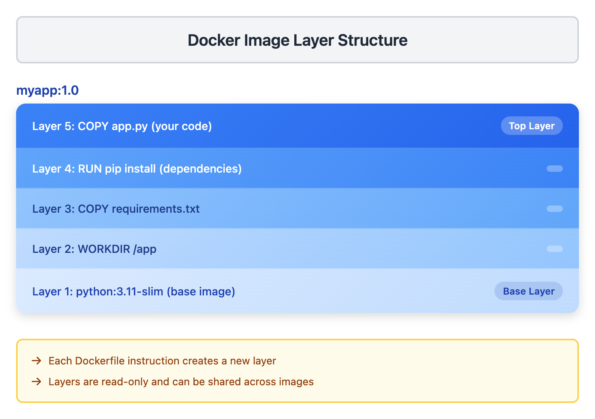
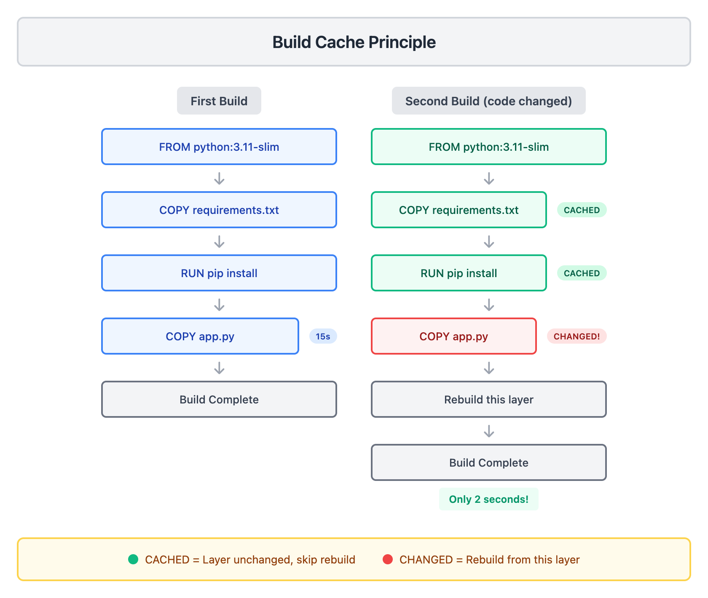

# 02 · 镜像与 Dockerfile

> **目标**：掌握 Docker 镜像管理和 Dockerfile 编写，理解构建缓存优化  
> **前置**：已完成 [01 · 第一个容器](../01-first-container/)  
> **时间**：45 分钟  
> **费用**：Free（本地 Docker 环境）

---

## 将学到的内容

1. 理解 Docker 镜像的本质（只读的分层文件系统）
2. 掌握镜像管理命令（pull, images, tag, rm, prune）
3. 编写 Dockerfile 构建自定义镜像
4. 理解并优化构建缓存
5. 使用 .dockerignore 排除不需要的文件

---

## Step 1 — 先跑起来：构建你的第一个镜像（10 分钟）

> 先体验构建流程，再理解原理。

### 1.1 准备项目目录

创建一个简单的 Python Flask 应用：

```bash
mkdir -p ~/docker-demo/myapp
cd ~/docker-demo/myapp
```

### 1.2 创建应用代码

**app.py**:

```bash
cat > app.py << 'EOF'
from flask import Flask
import os

app = Flask(__name__)

@app.route('/')
def hello():
    hostname = os.environ.get('HOSTNAME', 'unknown')
    return f'Hello from container: {hostname}\n'

@app.route('/health')
def health():
    return 'OK\n'

if __name__ == '__main__':
    app.run(host='0.0.0.0', port=5000)
EOF
```

**requirements.txt**:

```bash
cat > requirements.txt << 'EOF'
flask==3.1.2
EOF
```

### 1.3 编写 Dockerfile

```bash
cat > Dockerfile << 'EOF'
# 基础镜像：Python 3.11 slim 版本
FROM python:3.11-slim

# 设置工作目录
WORKDIR /app

# 复制依赖文件
COPY requirements.txt .

# 安装依赖
RUN pip install --no-cache-dir -r requirements.txt

# 复制应用代码
COPY app.py .

# 声明端口
EXPOSE 5000

# 启动命令
CMD ["python", "app.py"]
EOF
```

### 1.4 构建镜像

```bash
docker build -t myapp:1.0 .
```

```
[+] Building 15.2s (10/10) FINISHED
 => [internal] load build definition from Dockerfile
 => [1/5] FROM python:3.11-slim@sha256:...
 => [2/5] WORKDIR /app
 => [3/5] COPY requirements.txt .
 => [4/5] RUN pip install --no-cache-dir -r requirements.txt
 => [5/5] COPY app.py .
 => exporting to image
 => => naming to docker.io/library/myapp:1.0
```

### 1.5 运行验证

```bash
docker run -d --name myapp-test -p 5000:5000 myapp:1.0
curl http://localhost:5000
```

```
Hello from container: a1b2c3d4e5f6
```

成功了！你刚刚构建并运行了自己的第一个 Docker 镜像。

```bash
# 清理测试容器
docker rm -f myapp-test
```

---

## Step 2 — 发生了什么？（5 分钟）

### 2.1 镜像的分层结构



<details>
<summary>View ASCII source</summary>

```
┌─────────────────────────────────────────────────────────────────────┐
│                        Docker 镜像分层结构                            │
└─────────────────────────────────────────────────────────────────────┘

  myapp:1.0
  ┌─────────────────────────────────────────────────────────────────┐
  │  Layer 5: COPY app.py (你的代码)                    ← 最上层     │
  ├─────────────────────────────────────────────────────────────────┤
  │  Layer 4: RUN pip install (安装依赖)                             │
  ├─────────────────────────────────────────────────────────────────┤
  │  Layer 3: COPY requirements.txt                                 │
  ├─────────────────────────────────────────────────────────────────┤
  │  Layer 2: WORKDIR /app                                          │
  ├─────────────────────────────────────────────────────────────────┤
  │  Layer 1: python:3.11-slim (基础镜像)               ← 最底层     │
  └─────────────────────────────────────────────────────────────────┘

  每条 Dockerfile 指令 → 一个新的层
  层是只读的，可以被多个镜像共享
```

</details>

**核心理解**：

| 概念 | 解释 |
|------|------|
| 镜像 (Image) | 只读的分层文件系统，应用的打包 |
| 层 (Layer) | 每条 Dockerfile 指令产生一层 |
| 层共享 | 相同的层只存储一次，节省空间 |
| 容器层 | 容器运行时在镜像上添加可写层 |

### 2.2 Dockerfile 指令解析

你刚才写的每一行都做了什么：

```dockerfile
FROM python:3.11-slim     # 从 Docker Hub 拉取基础镜像
WORKDIR /app              # 设置后续命令的工作目录
COPY requirements.txt .   # 复制文件到镜像
RUN pip install ...       # 在构建时执行命令
COPY app.py .             # 再复制代码
EXPOSE 5000               # 声明端口（文档作用）
CMD ["python", "app.py"]  # 容器启动时执行的命令
```

---

## Step 3 — 镜像管理命令（8 分钟）

### 3.1 查看本地镜像

```bash
docker images
```

```
REPOSITORY   TAG       IMAGE ID       CREATED          SIZE
myapp        1.0       a1b2c3d4e5f6   5 minutes ago    156MB
python       3.11-slim 7890abcdef12   2 weeks ago      132MB
```

> **观察**：myapp 只比 python:3.11-slim 大 24MB，这就是你添加的层。

### 3.2 拉取镜像（指定版本）

```bash
# 拉取特定版本（推荐）
docker pull nginx:1.28

# 查看拉取的镜像
docker images nginx
```

```
REPOSITORY   TAG       IMAGE ID       CREATED       SIZE
nginx        1.28      a1b2c3d4e5f6   3 weeks ago   187MB
```

> **反模式警告**：不要使用 `docker pull nginx`（默认拉取 :latest）。  
> `:latest` 不代表"最新版"，只是一个普通标签，可能随时变化。

### 3.3 给镜像打标签

```bash
# 为发布准备：打版本标签
docker tag myapp:1.0 myapp:latest
docker tag myapp:1.0 your-registry/myapp:1.0

# 查看结果
docker images myapp
```

```
REPOSITORY   TAG       IMAGE ID       CREATED          SIZE
myapp        1.0       a1b2c3d4e5f6   10 minutes ago   156MB
myapp        latest    a1b2c3d4e5f6   10 minutes ago   156MB
```

> **注意**：`tag` 只是创建别名，两个标签指向同一个 IMAGE ID。

### 3.4 删除镜像

```bash
# 删除单个镜像
docker image rm nginx:1.28

# 或简写
docker rmi nginx:1.28

# 删除所有未使用的镜像（悬空镜像）
docker image prune

# 删除所有未被容器使用的镜像（谨慎使用）
docker image prune -a
```

### 3.5 查看镜像详情

```bash
docker image inspect myapp:1.0
```

这会输出镜像的完整 JSON 信息，包括：
- 创建时间
- 层的哈希值
- 环境变量
- 入口点和命令

---

## Step 4 — Dockerfile 指令详解（10 分钟）

### 4.1 常用指令一览

| 指令 | 作用 | 示例 |
|------|------|------|
| `FROM` | 基础镜像（必须是第一条） | `FROM python:3.11-slim` |
| `RUN` | 构建时执行命令 | `RUN apt-get update` |
| `COPY` | 复制文件到镜像 | `COPY . /app` |
| `WORKDIR` | 设置工作目录 | `WORKDIR /app` |
| `EXPOSE` | 声明端口（文档） | `EXPOSE 80` |
| `ENV` | 设置环境变量 | `ENV NODE_ENV=production` |
| `CMD` | 容器启动命令 | `CMD ["npm", "start"]` |
| `ENTRYPOINT` | 容器入口点 | `ENTRYPOINT ["python"]` |

### 4.2 COPY vs ADD

```dockerfile
# COPY: 简单复制（推荐）
COPY ./src /app/src
COPY requirements.txt /app/

# ADD: 额外功能（一般不用）
ADD https://example.com/file.tar.gz /tmp/   # 可以下载 URL
ADD archive.tar.gz /app/                     # 自动解压
```

> **最佳实践**：优先使用 `COPY`。`ADD` 的隐式行为可能造成困惑。

### 4.3 CMD vs ENTRYPOINT

```dockerfile
# CMD: 可以被 docker run 参数覆盖
CMD ["python", "app.py"]
# docker run myapp            → 执行 python app.py
# docker run myapp bash       → 执行 bash（覆盖了 CMD）

# ENTRYPOINT: 固定入口点
ENTRYPOINT ["python"]
CMD ["app.py"]
# docker run myapp            → 执行 python app.py
# docker run myapp test.py    → 执行 python test.py（CMD 被替换）
```

**使用场景**：

| 场景 | 推荐 |
|------|------|
| 普通应用 | 只用 `CMD` |
| 需要固定执行程序，参数可变 | `ENTRYPOINT` + `CMD` |
| CLI 工具容器 | `ENTRYPOINT` |

### 4.4 ENV 环境变量

```dockerfile
# 设置环境变量
ENV APP_ENV=production
ENV DB_HOST=localhost DB_PORT=5432

# 在后续指令中使用
WORKDIR /app/${APP_ENV}
```

运行时也可以覆盖：

```bash
docker run -e APP_ENV=development myapp:1.0
```

---

## Step 5 — 构建缓存优化（7 分钟）

### 5.1 缓存原理

Docker 构建时会缓存每一层。如果某一层没有变化，直接使用缓存。



<details>
<summary>View ASCII source</summary>

```
┌─────────────────────────────────────────────────────────────────────┐
│                        构建缓存工作原理                               │
└─────────────────────────────────────────────────────────────────────┘

  第一次构建：                    第二次构建（代码改了）：

  FROM python:3.11-slim          FROM python:3.11-slim
         ↓                              ↓
  COPY requirements.txt          COPY requirements.txt
         ↓                              ↓ ← CACHED
  RUN pip install                RUN pip install
         ↓                              ↓ ← CACHED
  COPY app.py      ← 15秒        COPY app.py      ← 改了！
         ↓                              ↓
      构建完成                    重新构建这一层
                                        ↓
                                    构建完成    ← 只需 2 秒
```

</details>

### 5.2 反模式：错误的指令顺序

```dockerfile
# BAD: 每次代码变化都要重新安装依赖
COPY . /app                      # 代码改了 → 缓存失效
RUN pip install -r requirements.txt  # 重新安装 → 浪费时间
```

### 5.3 最佳实践：频繁变化的放后面

```dockerfile
# GOOD: 依赖未变时使用缓存
COPY requirements.txt /app/      # 依赖文件单独复制
RUN pip install -r requirements.txt  # 缓存命中 → 跳过
COPY . /app                      # 代码最后复制
```

### 5.4 验证缓存效果

修改 `app.py`，再次构建：

```bash
echo '# comment' >> app.py
docker build -t myapp:1.1 .
```

观察输出，你会看到：

```
 => CACHED [2/5] WORKDIR /app
 => CACHED [3/5] COPY requirements.txt .
 => CACHED [4/5] RUN pip install --no-cache-dir -r requirements.txt
 => [5/5] COPY app.py .
```

前面的步骤都是 `CACHED`，只有 `COPY app.py` 重新执行。

---

## Step 6 — .dockerignore 文件（5 分钟）

### 6.1 为什么需要 .dockerignore

构建时，Docker 会把当前目录（构建上下文）发送给 Docker daemon。

如果目录包含大文件或敏感信息：
- 构建变慢
- 镜像变大
- 可能泄露密钥

### 6.2 创建 .dockerignore

```bash
cat > .dockerignore << 'EOF'
# Python
__pycache__/
*.pyc
*.pyo
.pytest_cache/
.venv/
venv/

# Git
.git/
.gitignore

# IDE
.vscode/
.idea/

# Docker
Dockerfile*
docker-compose*.yml

# 敏感文件
.env
*.pem
*.key
secrets/

# 其他
*.log
*.tmp
node_modules/
EOF
```

### 6.3 常见排除项

| 类型 | 示例 | 理由 |
|------|------|------|
| 依赖目录 | `node_modules/`, `venv/` | 镜像内会重新安装 |
| 版本控制 | `.git/` | 历史记录不需要 |
| 敏感信息 | `.env`, `*.key` | 安全风险 |
| 构建产物 | `*.log`, `__pycache__/` | 不需要 |
| Docker 文件 | `Dockerfile`, `docker-compose.yml` | 不需要复制到镜像 |

### 6.4 验证效果

```bash
# 创建一个大文件模拟
dd if=/dev/zero of=bigfile.tmp bs=1M count=100 2>/dev/null

# 不使用 .dockerignore（观察 Sending build context）
mv .dockerignore .dockerignore.bak
docker build -t test:no-ignore . 2>&1 | head -5

# 使用 .dockerignore
mv .dockerignore.bak .dockerignore
docker build -t test:with-ignore . 2>&1 | head -5

# 清理
rm bigfile.tmp
docker rmi test:no-ignore test:with-ignore 2>/dev/null
```

你会看到构建上下文大小的明显差异。

---

## Step 7 — Mini-Project：构建 Python 应用镜像（完整版）

现在让我们把学到的知识整合，构建一个优化过的镜像。

### 7.1 项目结构

```bash
cd ~/docker-demo/myapp
```

确保你有以下文件：

```
myapp/
├── app.py
├── requirements.txt
├── Dockerfile
└── .dockerignore
```

### 7.2 优化后的 Dockerfile

更新 Dockerfile，加入最佳实践：

```bash
cat > Dockerfile << 'EOF'
# ===========================================
# Python Flask Application
# Version: 1.0
# ===========================================

# 基础镜像：使用 slim 版本减小体积
FROM python:3.11-slim

# 元数据标签
LABEL maintainer="your-email@example.com"
LABEL version="1.0"
LABEL description="Simple Flask application"

# 设置工作目录
WORKDIR /app

# 设置环境变量
ENV PYTHONDONTWRITEBYTECODE=1 \
    PYTHONUNBUFFERED=1

# 先复制依赖文件（利用缓存）
COPY requirements.txt .

# 安装依赖
# --no-cache-dir 不缓存 pip 下载，减小镜像体积
RUN pip install --no-cache-dir -r requirements.txt

# 复制应用代码
COPY app.py .

# 声明端口
EXPOSE 5000

# 健康检查
# Note: Using Python instead of curl since python:3.11-slim doesn't include curl
HEALTHCHECK --interval=30s --timeout=10s --start-period=5s --retries=3 \
    CMD python -c "import urllib.request; urllib.request.urlopen('http://localhost:5000/health')" || exit 1

# 启动命令
CMD ["python", "app.py"]
EOF
```

### 7.3 构建并验证

```bash
# 构建镜像
docker build -t myapp:1.0 .

# 查看镜像大小
docker images myapp

# 运行容器
docker run -d --name myapp-prod -p 5000:5000 myapp:1.0

# 测试端点
curl http://localhost:5000
curl http://localhost:5000/health

# 查看健康状态
docker ps
```

```
CONTAINER ID   IMAGE       ...   STATUS                    ...
a1b2c3d4e5f6   myapp:1.0   ...   Up 10 seconds (healthy)   ...
```

### 7.4 清理

```bash
docker rm -f myapp-prod
```

---

## 反模式与最佳实践

### 反模式 1：使用 :latest 标签

```dockerfile
# BAD
FROM python:latest
```

**问题**：`:latest` 可能随时变化，导致构建不可预测。

**解决**：

```dockerfile
# GOOD
FROM python:3.11-slim
```

始终使用明确的版本标签。

### 反模式 2：安装不必要的包

```dockerfile
# BAD
RUN apt-get update && apt-get install -y \
    vim \
    curl \
    wget \
    htop \
    net-tools
```

**问题**：镜像体积膨胀，增加安全攻击面。

**解决**：只安装运行时必需的依赖。调试工具通过 `docker exec` 临时安装。

### 反模式 3：没有 .dockerignore

```bash
# BAD: 整个目录发送给 Docker
docker build -t myapp .
# Sending build context to Docker daemon  500MB
```

**问题**：构建慢，镜像可能包含敏感信息。

**解决**：始终创建 `.dockerignore` 排除不需要的文件。

---

## 本课小结

| 命令/文件 | 作用 | 要点 |
|-----------|------|------|
| `docker build -t name:tag .` | 构建镜像 | `-t` 指定名称和标签 |
| `docker images` | 列出镜像 | 查看本地所有镜像 |
| `docker pull image:tag` | 拉取镜像 | 始终指定版本 |
| `docker tag` | 打标签 | 创建别名，准备发布 |
| `docker image prune` | 清理镜像 | 删除悬空镜像 |
| `Dockerfile` | 镜像定义 | 频繁变化的指令放后面 |
| `.dockerignore` | 排除文件 | 减小上下文，保护敏感信息 |

**核心理念**：

> **镜像是只读的分层文件系统。指令顺序影响缓存效率。**

---

## 检查清单

完成本课后，确认你能够：

- [ ] 使用 `docker build -t name:tag .` 构建镜像
- [ ] 解释 Dockerfile 中 FROM, RUN, COPY, CMD 的作用
- [ ] 说明 CMD 和 ENTRYPOINT 的区别
- [ ] 优化 Dockerfile 指令顺序以利用缓存
- [ ] 创建 .dockerignore 排除不需要的文件
- [ ] 使用 `docker images`, `docker tag`, `docker rmi` 管理镜像
- [ ] 解释为什么不应该使用 `:latest` 标签

---

## 下一步

镜像构建好了，但容器重启后数据就丢失了。如何持久化数据？

[03 · 数据持久化](../03-volumes/)

---

## 常见问题

**Q: 构建时提示 "no space left on device"**

```bash
# 清理未使用的镜像、容器、网络、缓存
docker system prune -a
```

**Q: 如何减小镜像体积？**

1. 使用 `-slim` 或 `-alpine` 基础镜像
2. 合并 RUN 指令减少层数
3. 使用 `--no-cache-dir` 避免缓存
4. 进阶：使用 multi-stage build（高级课程）

**Q: 构建时如何不使用缓存？**

```bash
docker build --no-cache -t myapp:1.0 .
```

**Q: 如何查看镜像的层信息？**

```bash
docker history myapp:1.0
```

---

## 职场小贴士

在日本 IT 现场（日本語：IT現場）：

- **イメージ管理**（镜像管理）是运维基本功
- 镜像版本要和 **変更管理**（Change Management）配合
- 本番環境（生产环境）严禁使用 `:latest` 标签
- **障害対応**（故障处理）时，能快速定位到具体的镜像版本很重要

面试时可能被问到：

> **Q: Docker イメージを軽量化する方法は？**  
>
> A: Alpine ベースイメージを使う、RUN 命令を結合して層を減らす、.dockerignore で不要ファイルを除外、--no-cache-dir でキャッシュを無効化。マルチステージビルドも有効（上級テクニック）。

> **Q: Dockerfile のベストプラクティスは？**  
>
> A: 頻繁に変わるコマンドは後ろに配置（キャッシュ活用）、具体的なバージョンタグを使う、不要なパッケージは入れない、.dockerignore を必ず作成。

---

## 延伸阅读

- [Dockerfile reference](https://docs.docker.com/reference/dockerfile/)
- [Best practices for Dockerfile](https://docs.docker.com/build/building/best-practices/)
- [.dockerignore reference](https://docs.docker.com/build/building/context/#dockerignore-files)

---

## 系列导航

← [01 · 第一个容器](../01-first-container/) | [Home](../) | [03 · 数据持久化 →](../03-volumes/)
