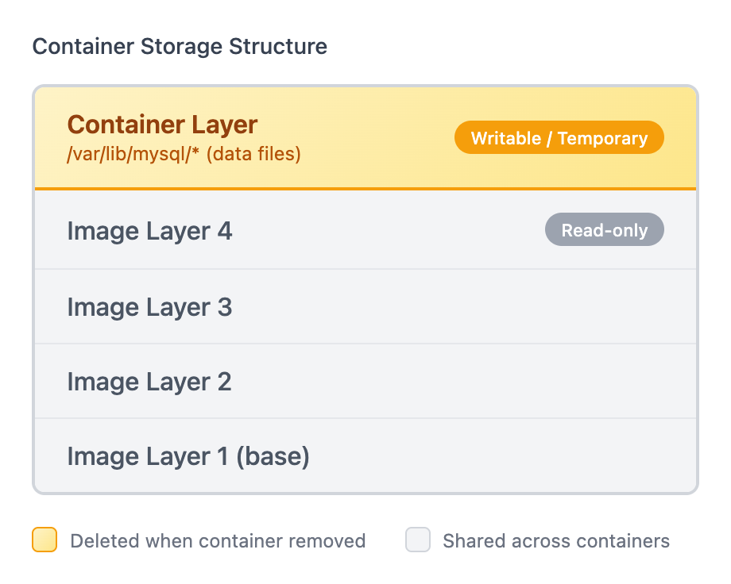
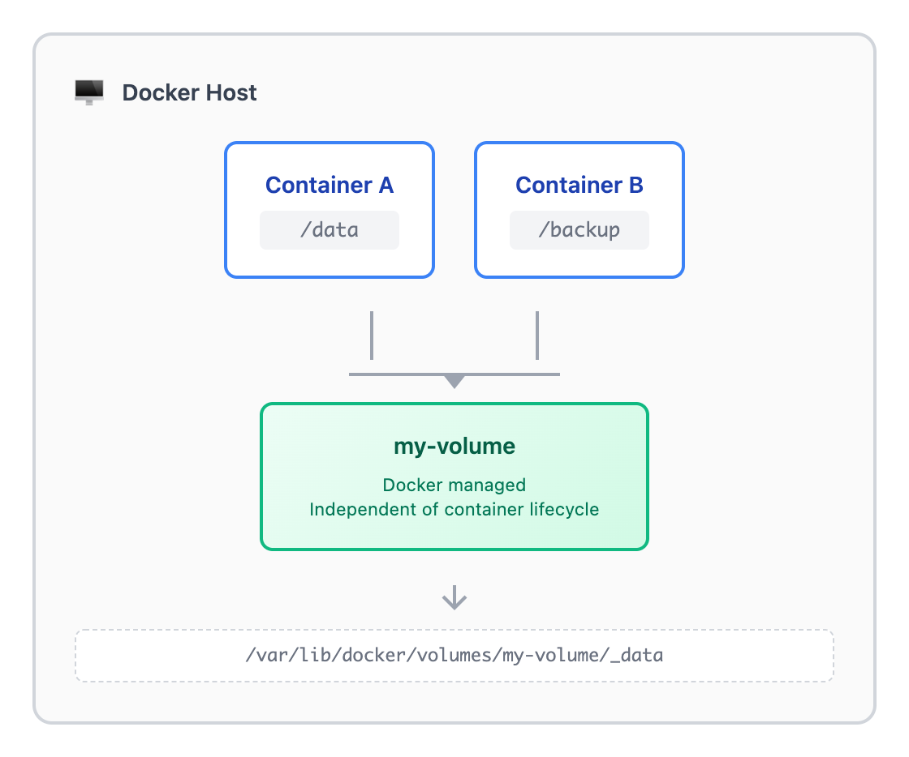

# 03 · 数据持久化：容器的生死与数据的永恒

> **目标**：掌握 Docker 数据持久化的两种方式：Volume 和 Bind Mount
> **前置**：已完成 [02 · 镜像与 Dockerfile](../02-images/)
> **时间**：40 分钟
> **费用**：无（本地操作）

---

## 将学到的内容

1. 理解容器数据的临时性（为什么数据会丢失）
2. 使用 Volume 持久化数据（Docker 管理）
3. 使用 Bind Mount 共享文件（开发场景）
4. 理解 Volume vs Bind Mount 的区别与适用场景
5. 使用只读挂载保护数据

---

## 失败实验室：数据丢失的惨痛教训

在学习解决方案之前，让我们**亲手体验一次数据丢失**。这个失败实验将让你永远记住为什么需要数据持久化。

### 实验：不用 Volume 的 MySQL

```bash
# 1. 启动一个 MySQL 容器（不使用 Volume）
docker run -d \
  --name mysql-temp \
  -e MYSQL_ROOT_PASSWORD=secret123 \
  -e MYSQL_DATABASE=testdb \
  mysql:8.4

# 2. 等待 MySQL 启动完成（约 30 秒）
docker logs -f mysql-temp
# 看到 "ready for connections" 后按 Ctrl+C 退出
```

```bash
# 3. 创建一些重要数据
docker exec -it mysql-temp mysql -uroot -psecret123 -e "
  USE testdb;
  CREATE TABLE users (id INT PRIMARY KEY, name VARCHAR(50));
  INSERT INTO users VALUES (1, 'Alice'), (2, 'Bob'), (3, 'Charlie');
  SELECT * FROM users;
"
```

```
+----+---------+
| id | name    |
+----+---------+
|  1 | Alice   |
|  2 | Bob     |
|  3 | Charlie |
+----+---------+
```

数据创建成功！现在，模拟一个常见场景：**容器需要重建**。

```bash
# 4. 删除容器（模拟升级、故障重启等场景）
docker rm -f mysql-temp

# 5. 用相同参数重新启动
docker run -d \
  --name mysql-temp \
  -e MYSQL_ROOT_PASSWORD=secret123 \
  -e MYSQL_DATABASE=testdb \
  mysql:8.4

# 等待启动
sleep 30

# 6. 查看数据...
docker exec -it mysql-temp mysql -uroot -psecret123 -e "
  USE testdb;
  SELECT * FROM users;
"
```

```
ERROR 1146 (42S02): Table 'testdb.users' doesn't exist
```

**数据消失了！** Alice、Bob、Charlie 都不见了。

### 为什么会这样？



<details>
<summary>View ASCII source</summary>

```
容器存储结构：

┌─────────────────────────────────┐
│      Container Layer            │  ← 可写层（临时！）
│   /var/lib/mysql/* (数据文件)    │     容器删除时一起删除
├─────────────────────────────────┤
│      Image Layer 4              │  ← 只读层
│      Image Layer 3              │
│      Image Layer 2              │
│      Image Layer 1 (base)       │
└─────────────────────────────────┘
```

</details>

**关键概念**：

| 层 | 特性 | 生命周期 |
|----|------|----------|
| **容器层（Container Layer）** | 可写，保存运行时数据 | 容器删除即销毁 |
| **镜像层（Image Layers）** | 只读，可共享 | 永久存在（直到删除镜像） |

> **容器设计哲学**：容器是**临时的进程**，应该随时可以销毁和重建。数据不应该依赖容器的生存。

清理实验环境：

```bash
docker rm -f mysql-temp
```

---

## Step 1 — Volume：Docker 管理的持久化（10 分钟）

### 1.1 什么是 Volume？

Volume 是 Docker 专门为持久化数据设计的机制：

- **独立于容器**：容器删除，Volume 保留
- **Docker 管理**：存储位置由 Docker 决定
- **高性能**：针对 Docker 优化
- **可在容器间共享**：多个容器可以使用同一个 Volume



<details>
<summary>View ASCII source</summary>

```
                     Docker Host
┌─────────────────────────────────────────────────┐
│                                                 │
│   Container A          Container B             │
│   ┌─────────┐          ┌─────────┐             │
│   │ /data   │          │ /backup │             │
│   └────┬────┘          └────┬────┘             │
│        │                    │                  │
│        └────────┬───────────┘                  │
│                 │                              │
│                 ▼                              │
│        ┌───────────────┐                       │
│        │   my-volume   │  ← Docker 管理        │
│        │               │    独立于容器生命周期   │
│        └───────────────┘                       │
│                 │                              │
│                 ▼                              │
│   /var/lib/docker/volumes/my-volume/_data     │
│                                                 │
└─────────────────────────────────────────────────┘
```

</details>

### 1.2 Volume 基本操作

```bash
# 创建 Volume
docker volume create mydata

# 列出所有 Volume
docker volume ls

# 查看 Volume 详情
docker volume inspect mydata

# 删除 Volume
docker volume rm mydata

# 清理所有未使用的 Volume（危险！）
docker volume prune
```

让我们实际操作：

```bash
# 创建一个 Volume
docker volume create mysql-data

# 查看详情
docker volume inspect mysql-data
```

```json
[
    {
        "CreatedAt": "2026-01-03T10:00:00Z",
        "Driver": "local",
        "Labels": {},
        "Mountpoint": "/var/lib/docker/volumes/mysql-data/_data",
        "Name": "mysql-data",
        "Options": {},
        "Scope": "local"
    }
]
```

**Mountpoint** 就是数据实际存储的位置（Docker 管理，一般不需要直接访问）。

### 1.3 使用 Volume 运行容器

```bash
# 使用 Volume 启动 MySQL
docker run -d \
  --name mysql-persistent \
  -e MYSQL_ROOT_PASSWORD=secret123 \
  -e MYSQL_DATABASE=testdb \
  -v mysql-data:/var/lib/mysql \
  mysql:8.4
```

**关键参数**：`-v mysql-data:/var/lib/mysql`

| 部分 | 含义 |
|------|------|
| `mysql-data` | Volume 名称（如果不存在会自动创建） |
| `:` | 分隔符 |
| `/var/lib/mysql` | 容器内的挂载路径 |

等待启动后，创建数据：

```bash
# 等待 MySQL 完全启动
sleep 30

# 创建测试数据
docker exec -it mysql-persistent mysql -uroot -psecret123 -e "
  USE testdb;
  CREATE TABLE users (id INT PRIMARY KEY, name VARCHAR(50));
  INSERT INTO users VALUES (1, 'Alice'), (2, 'Bob'), (3, 'Charlie');
  SELECT * FROM users;
"
```

### 1.4 验证数据持久化

现在，让我们重演之前的场景——删除并重建容器：

```bash
# 删除容器
docker rm -f mysql-persistent

# 用相同的 Volume 重新启动
docker run -d \
  --name mysql-persistent \
  -e MYSQL_ROOT_PASSWORD=secret123 \
  -e MYSQL_DATABASE=testdb \
  -v mysql-data:/var/lib/mysql \
  mysql:8.4

# 等待启动
sleep 30

# 查看数据
docker exec -it mysql-persistent mysql -uroot -psecret123 -e "
  USE testdb;
  SELECT * FROM users;
"
```

```
+----+---------+
| id | name    |
+----+---------+
|  1 | Alice   |
|  2 | Bob     |
|  3 | Charlie |
+----+---------+
```

**数据还在！** 这就是 Volume 的价值。

---

## Step 2 — Bind Mount：主机目录挂载（10 分钟）

### 2.1 什么是 Bind Mount？

Bind Mount 将**主机上的目录或文件**直接挂载到容器内：

- **你管理**：存储位置由你指定
- **实时同步**：主机和容器看到相同文件
- **适合开发**：代码修改立即生效


<details>
<summary>View ASCII source</summary>

```
                     Docker Host
┌─────────────────────────────────────────────────┐
│                                                 │
│   Container                                     │
│   ┌─────────────────────────────────┐          │
│   │                                 │          │
│   │   /app  ◄───────────────────────┼──────┐   │
│   │   - index.js                    │      │   │
│   │   - package.json                │      │   │
│   │                                 │      │   │
│   └─────────────────────────────────┘      │   │
│                                            │   │
│   主机文件系统                              │   │
│   ┌─────────────────────────────────┐      │   │
│   │  ~/projects/myapp               │      │   │
│   │   - index.js        ────────────┼──────┘   │
│   │   - package.json                │          │
│   │   (你的代码目录)                 │          │
│   └─────────────────────────────────┘          │
│                                                 │
└─────────────────────────────────────────────────┘

编辑主机文件 → 容器内立即看到变化
```

</details>

### 2.2 Bind Mount 语法

有两种写法：

```bash
# 方式 1：简写（-v）
docker run -v /host/path:/container/path image

# 方式 2：详细（--mount）推荐
docker run --mount type=bind,source=/host/path,target=/container/path image
```

### 2.3 开发场景实战

创建一个简单的 Node.js 应用来演示 Bind Mount 的开发体验：

```bash
# 创建项目目录
mkdir -p ~/docker-dev-demo
cd ~/docker-dev-demo

# 创建应用文件
cat > index.js << 'EOF'
const http = require('http');

const server = http.createServer((req, res) => {
  res.writeHead(200, { 'Content-Type': 'text/plain' });
  res.end('Hello from Docker!\n');
});

server.listen(3000, () => {
  console.log('Server running on port 3000');
});
EOF

# 创建 package.json
cat > package.json << 'EOF'
{
  "name": "docker-dev-demo",
  "version": "1.0.0",
  "main": "index.js",
  "scripts": {
    "start": "node index.js"
  }
}
EOF
```

使用 Bind Mount 运行：

```bash
# 使用 Bind Mount 启动容器
docker run -d \
  --name dev-server \
  -p 3000:3000 \
  -v $(pwd):/app \
  -w /app \
  node:22 \
  npm start
```

**参数说明**：

| 参数 | 作用 |
|------|------|
| `-v $(pwd):/app` | 将当前目录挂载到容器的 /app |
| `-w /app` | 设置容器工作目录为 /app |
| `-p 3000:3000` | 端口映射 |

验证服务运行：

```bash
curl http://localhost:3000
```

```
Hello from Docker!
```

### 2.4 实时同步演示

现在，**不重启容器**，直接修改主机上的代码：

```bash
# 修改代码
cat > ~/docker-dev-demo/index.js << 'EOF'
const http = require('http');

const server = http.createServer((req, res) => {
  res.writeHead(200, { 'Content-Type': 'text/plain' });
  res.end('Hello from Docker! - Updated!\n');
});

server.listen(3000, () => {
  console.log('Server running on port 3000');
});
EOF
```

```bash
# 重启容器使代码生效（Node.js 需要重启）
docker restart dev-server

# 再次测试
curl http://localhost:3000
```

```
Hello from Docker! - Updated!
```

代码修改立即反映到容器中，这就是 Bind Mount 的开发价值。

清理：

```bash
docker rm -f dev-server
```

---

## Step 3 — Volume vs Bind Mount 对比（5 分钟）

### 3.1 对比表

| 特性 | Volume | Bind Mount |
|------|--------|------------|
| **管理者** | Docker | 用户 |
| **存储位置** | Docker 决定 | 用户指定 |
| **跨平台** | 好（路径统一） | 差（路径格式不同） |
| **性能** | 高（针对 Docker 优化） | 一般（取决于主机 FS） |
| **备份** | 需要特殊方法 | 直接访问文件 |
| **初始内容** | 可保留容器原有内容 | 覆盖容器内容 |
| **推荐场景** | **生产环境、数据库** | **开发环境、配置文件** |

### 3.2 如何选择？

```
                       ┌─────────────────────┐
                       │    需要持久化数据？   │
                       └──────────┬──────────┘
                                  │
                    ┌────────────┴────────────┐
                    ▼                         ▼
                   YES                        NO
                    │                         │
        ┌───────────┴───────────┐            │
        │     生产还是开发？      │            ▼
        └───────────┬───────────┘       不需要挂载
                    │                   （数据临时）
        ┌───────────┴───────────┐
        ▼                       ▼
       生产                     开发
        │                       │
        ▼                       ▼
   ┌─────────┐            ┌─────────────┐
   │ Volume  │            │ Bind Mount  │
   │ 推荐    │            │ 推荐        │
   └─────────┘            └─────────────┘
```

### 3.3 常见场景推荐

| 场景 | 推荐方式 | 原因 |
|------|----------|------|
| MySQL / PostgreSQL 数据 | **Volume** | 数据安全，性能好 |
| Redis 数据 | **Volume** | 同上 |
| 本地开发代码 | **Bind Mount** | 实时同步，方便编辑 |
| 配置文件 | **Bind Mount** | 方便查看和修改 |
| 日志输出 | **Bind Mount** | 方便直接查看 |
| 共享数据（多容器） | **Volume** | Docker 管理更可靠 |

---

## Step 4 — 只读挂载（5 分钟）

### 4.1 为什么需要只读？

有些场景，你希望容器能**读取**主机文件，但**不能修改**：

- 配置文件（防止误修改）
- 密钥文件（安全考虑）
- 静态资源（只需要读取）

### 4.2 只读挂载语法

```bash
# 添加 :ro 后缀
docker run -v /host/config:/app/config:ro image

# 或使用 --mount
docker run --mount type=bind,source=/host/config,target=/app/config,readonly image
```

### 4.3 实际演示

```bash
# 创建配置文件
mkdir -p ~/docker-config-demo
echo "DEBUG=false" > ~/docker-config-demo/app.conf

# 以只读方式挂载
docker run -it --rm \
  -v ~/docker-config-demo:/config:ro \
  alpine sh
```

在容器内尝试：

```bash
# 可以读取
cat /config/app.conf
# 输出: DEBUG=false

# 尝试修改
echo "DEBUG=true" > /config/app.conf
# 错误: Read-only file system

# 退出容器
exit
```

只读挂载保护了配置文件不被容器修改。

---

## Mini-project：MySQL 数据持久化完整实战

现在把所学知识综合运用，完成一个完整的 MySQL 持久化部署：

### 任务目标

1. 创建一个命名 Volume 存储 MySQL 数据
2. 使用 Bind Mount 挂载初始化脚本
3. 启动 MySQL 容器
4. 验证数据持久化
5. 验证容器重建后数据仍存在

### Step 1：准备初始化脚本

```bash
# 创建项目目录
mkdir -p ~/mysql-persistent-demo
cd ~/mysql-persistent-demo

# 创建初始化 SQL 脚本
cat > init.sql << 'EOF'
-- Create users table
CREATE TABLE IF NOT EXISTS users (
    id INT AUTO_INCREMENT PRIMARY KEY,
    username VARCHAR(50) NOT NULL,
    email VARCHAR(100),
    created_at TIMESTAMP DEFAULT CURRENT_TIMESTAMP
);

-- Insert initial data
INSERT INTO users (username, email) VALUES
    ('admin', 'admin@example.com'),
    ('user1', 'user1@example.com'),
    ('user2', 'user2@example.com');

-- Show result
SELECT * FROM users;
EOF
```

### Step 2：创建 Volume 并启动容器

```bash
# 创建 Volume
docker volume create mysql-prod-data

# 启动 MySQL 容器
# - Volume 用于数据持久化
# - Bind Mount 用于初始化脚本（只读）
docker run -d \
  --name mysql-prod \
  -e MYSQL_ROOT_PASSWORD=prod_secret_123 \
  -e MYSQL_DATABASE=production \
  -v mysql-prod-data:/var/lib/mysql \
  -v $(pwd)/init.sql:/docker-entrypoint-initdb.d/init.sql:ro \
  -p 3306:3306 \
  mysql:8.4
```

**关键点**：
- `/docker-entrypoint-initdb.d/` 是 MySQL 镜像的特殊目录，启动时会执行其中的 SQL 文件
- 初始化脚本使用 `:ro` 只读挂载

### Step 3：验证数据

```bash
# 等待 MySQL 完全启动
sleep 30

# 查看初始化数据
docker exec -it mysql-prod mysql -uroot -pprod_secret_123 -e "
  USE production;
  SELECT * FROM users;
"
```

```
+----+----------+--------------------+---------------------+
| id | username | email              | created_at          |
+----+----------+--------------------+---------------------+
|  1 | admin    | admin@example.com  | 2026-01-03 10:00:00 |
|  2 | user1    | user1@example.com  | 2026-01-03 10:00:00 |
|  3 | user2    | user2@example.com  | 2026-01-03 10:00:00 |
+----+----------+--------------------+---------------------+
```

### Step 4：添加更多数据

```bash
# 添加新用户
docker exec -it mysql-prod mysql -uroot -pprod_secret_123 -e "
  USE production;
  INSERT INTO users (username, email) VALUES ('newuser', 'new@example.com');
  SELECT * FROM users;
"
```

### Step 5：模拟灾难恢复

```bash
# 删除容器（模拟故障）
docker rm -f mysql-prod

# 验证 Volume 还在
docker volume ls | grep mysql-prod-data

# 用相同 Volume 重新启动（注意：不需要初始化脚本了）
docker run -d \
  --name mysql-prod \
  -e MYSQL_ROOT_PASSWORD=prod_secret_123 \
  -v mysql-prod-data:/var/lib/mysql \
  -p 3306:3306 \
  mysql:8.4

# 等待启动
sleep 20

# 验证所有数据（包括新添加的）都还在
docker exec -it mysql-prod mysql -uroot -pprod_secret_123 -e "
  USE production;
  SELECT * FROM users;
"
```

```
+----+----------+--------------------+---------------------+
| id | username | email              | created_at          |
+----+----------+--------------------+---------------------+
|  1 | admin    | admin@example.com  | 2026-01-03 10:00:00 |
|  2 | user1    | user1@example.com  | 2026-01-03 10:00:00 |
|  3 | user2    | user2@example.com  | 2026-01-03 10:00:00 |
|  4 | newuser  | new@example.com    | 2026-01-03 10:01:00 |
+----+----------+--------------------+---------------------+
```

**所有数据完整保留！**

### 清理

```bash
# 停止并删除容器
docker rm -f mysql-prod

# 如果不再需要数据，删除 Volume
# docker volume rm mysql-prod-data
```

---

## 反模式警示

### 反模式 1：数据写入容器层

```bash
# 错误！数据写入容器层
docker run -d --name mysql-bad mysql:8.4
```

**问题**：容器删除 = 数据丢失

**正确做法**：

```bash
docker run -d \
  --name mysql-good \
  -v mysql-data:/var/lib/mysql \
  mysql:8.4
```

### 反模式 2：生产环境使用 Bind Mount

```bash
# 不推荐用于生产！
docker run -d \
  --name mysql-prod \
  -v /home/user/mysql-data:/var/lib/mysql \
  mysql:8.4
```

**问题**：
- 依赖主机路径，不可移植
- 权限问题（Windows/macOS/Linux 不同）
- 备份和迁移复杂

**正确做法**：

```bash
docker run -d \
  --name mysql-prod \
  -v mysql-prod-data:/var/lib/mysql \
  mysql:8.4
```

### 反模式 3：忘记 Volume 清理

```bash
# 查看所有 Volume
docker volume ls

# 查看未使用的 Volume
docker volume ls -f dangling=true
```

**问题**：长期积累会占用大量磁盘空间

**定期清理**：

```bash
# 清理未使用的 Volume（谨慎操作！）
docker volume prune

# 或者只清理指定的
docker volume rm <volume-name>
```

---

## 本课小结

| 命令 | 作用 | 示例 |
|------|------|------|
| `docker volume create` | 创建 Volume | `docker volume create mydata` |
| `docker volume ls` | 列出 Volume | `docker volume ls` |
| `docker volume inspect` | 查看详情 | `docker volume inspect mydata` |
| `docker volume rm` | 删除 Volume | `docker volume rm mydata` |
| `docker volume prune` | 清理未使用 | `docker volume prune` |
| `-v name:/path` | 挂载 Volume | `-v mysql-data:/var/lib/mysql` |
| `-v /host:/container` | Bind Mount | `-v $(pwd):/app` |
| `-v /host:/container:ro` | 只读挂载 | `-v ./config:/app/config:ro` |

**核心理念**：

| 概念 | 要点 |
|------|------|
| **容器临时性** | 容器层数据随容器删除而消失 |
| **Volume** | Docker 管理，生产首选 |
| **Bind Mount** | 用户管理，开发首选 |
| **只读挂载** | 保护配置文件和敏感数据 |

> **关键理念**：容器是临时的，数据需要外置。把容器当作"一次性的进程"。

---

## 检查清单

完成本课后，验证你能：

- [ ] 解释为什么容器数据会丢失
- [ ] 创建、列出、删除 Docker Volume
- [ ] 使用 Volume 运行 MySQL 并验证数据持久化
- [ ] 使用 Bind Mount 进行本地开发
- [ ] 说出 Volume 和 Bind Mount 的区别及适用场景
- [ ] 使用只读挂载保护文件

---

## 下一步

数据持久化解决了，但容器之间如何通信？多个容器如何组成一个应用？

--> [04 · 容器网络](../04-networking/)

---

## 职场小贴士

### 日本 IT 现场的数据管理

在日本的 IT 运维现场（特に本番環境），数据管理有严格的规范：

**数据分类与保护**

| 日语术语 | 含义 | Docker 对策 |
|----------|------|-------------|
| **本番データ** | 生产数据 | 必须使用 Volume，定期备份 |
| **開発データ** | 开发数据 | 可使用 Bind Mount |
| **機密データ** | 敏感数据 | 只读挂载，权限控制 |

**备份规范（バックアップ規定）**

```bash
# 典型的 Volume 备份脚本
docker run --rm \
  -v mysql-prod-data:/source:ro \
  -v $(pwd)/backup:/backup \
  alpine tar cvf /backup/mysql-backup-$(date +%Y%m%d).tar /source
```

在日本企业，备份通常需要：
- **日次バックアップ**：每日备份
- **週次バックアップ**：每周完整备份
- **保管期間**：明确保留期限

> **小贴士**：面试时，如果被问到数据管理经验，可以提到"Volume による永続化"和"定期バックアップ"，展示你对生产环境的理解。

---

## 延伸阅读

- [Docker Volumes](https://docs.docker.com/engine/storage/volumes/) - 官方文档
- [Bind Mounts](https://docs.docker.com/engine/storage/bind-mounts/) - 官方文档
- [Best practices for writing Dockerfiles](https://docs.docker.com/build/building/best-practices/) - 包含数据管理建议

---

## 系列导航

<- [02 · 镜像与 Dockerfile](../02-images/) | [Home](../) | [04 · 容器网络 ->](../04-networking/)
