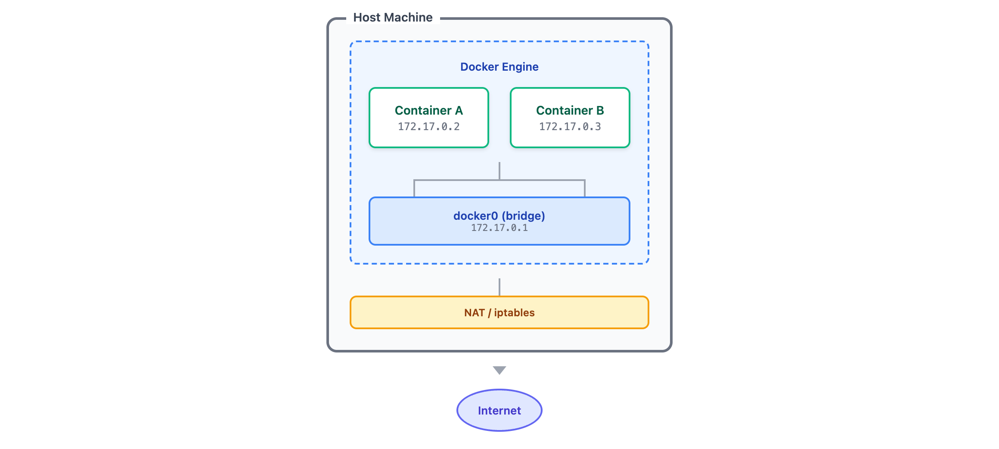
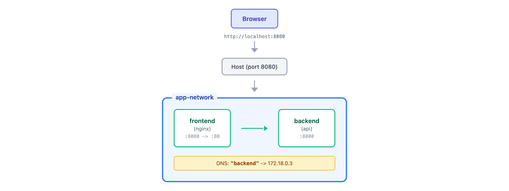

# 04 · 容器网络

> **目标**：理解 Docker 网络模型，掌握端口映射和容器间通信
> **前置**：已完成 [03 · 数据持久化](../03-volumes/)
> **时间**：40 分钟
> **费用**：无（本地操作）

---

## 将学到的内容

1. 理解 Docker 网络类型（bridge, host, none）
2. 掌握端口映射（-p 8080:80）
3. 创建和管理自定义网络
4. 实现容器间通信（DNS 服务发现）
5. 调试容器网络问题

---

## 核心理念

> **容器默认是隔离的，网络让它们能够对话。**

Docker 容器就像住在公寓楼里的住户：
- 每个容器有自己的"房间"（独立网络栈）
- 默认情况下，隔壁邻居互不认识
- 通过 **自定义网络**，容器可以用"名字"互相找到对方

这个设计理念很重要：**隔离是默认的，连接是显式的**。

---

## Step 1 — 先跑起来：两个容器对话（10 分钟）

> 先"尝到"网络的味道，再理解原理。

### 1.1 启动一个简单的 API 容器

```bash
# 使用 Python 内置 HTTP 服务器模拟 API
docker run -d --name api-server \
  python:3.11-slim \
  python -m http.server 8000
```

检查容器状态：

```bash
docker ps
```

```
CONTAINER ID   IMAGE              COMMAND                  STATUS         PORTS      NAMES
abc123def456   python:3.11-slim   "python -m http.serv…"   Up 5 seconds              api-server
```

### 1.2 尝试从另一个容器访问

```bash
# 启动一个临时容器，尝试访问 api-server
docker run --rm \
  curlimages/curl:latest \
  curl -s http://api-server:8000
```

**你会看到错误：**

```
curl: (6) Could not resolve host: api-server
```

**为什么失败？** 因为两个容器在默认的 bridge 网络中，**无法通过名字互相访问**。

### 1.3 创建自定义网络

```bash
# 创建一个自定义网络
docker network create app-network
```

### 1.4 重新启动容器，加入同一网络

```bash
# 停止并删除旧容器
docker stop api-server && docker rm api-server

# 在自定义网络中启动 API 容器
docker run -d --name api-server \
  --network app-network \
  python:3.11-slim \
  python -m http.server 8000

# 从另一个容器访问（同一网络）
docker run --rm \
  --network app-network \
  curlimages/curl:latest \
  curl -s http://api-server:8000
```

**成功！你会看到目录列表：**

```html
<!DOCTYPE HTML PUBLIC "-//W3C//DTD HTML 4.01//EN" ...>
<html>
<head>
<title>Directory listing for /</title>
...
```

**恭喜！你的两个容器成功对话了！**

---

## Step 2 — 发生了什么？（5 分钟）

### 2.1 Docker 网络模型



<details>
<summary>View ASCII source</summary>

<!-- DIAGRAM: docker-network-model -->
```
                        Host Machine
┌────────────────────────────────────────────────────────────┐
│                                                            │
│    ┌─────────────────────────────────────────────────┐    │
│    │              Docker Engine                       │    │
│    │                                                  │    │
│    │   ┌──────────────┐    ┌──────────────┐         │    │
│    │   │  Container A │    │  Container B │         │    │
│    │   │  172.17.0.2  │    │  172.17.0.3  │         │    │
│    │   └──────┬───────┘    └──────┬───────┘         │    │
│    │          │                   │                  │    │
│    │   ┌──────┴───────────────────┴───────┐         │    │
│    │   │         docker0 (bridge)          │         │    │
│    │   │           172.17.0.1              │         │    │
│    │   └─────────────────┬─────────────────┘         │    │
│    │                     │                           │    │
│    └─────────────────────┼───────────────────────────┘    │
│                          │                                 │
│              ┌───────────┴───────────┐                    │
│              │      NAT / iptables    │                    │
│              └───────────┬───────────┘                    │
│                          │                                 │
└──────────────────────────┼─────────────────────────────────┘
                           │
                     ┌─────┴─────┐
                     │  Internet  │
                     └───────────┘
```
<!-- /DIAGRAM -->

</details>

### 2.2 三种网络类型

| 网络类型 | 特点 | 使用场景 |
|---------|------|---------|
| **bridge** | 默认网络，容器隔离，通过 NAT 访问外部 | 单机多容器（最常用） |
| **host** | 容器共享主机网络栈，无隔离 | 性能敏感场景 |
| **none** | 完全无网络 | 安全隔离，离线处理 |

### 2.3 默认 bridge vs 自定义 bridge

这是关键区别：

| 特性 | 默认 bridge | 自定义 bridge |
|-----|------------|--------------|
| 容器名 DNS | 不支持 | **支持** |
| 自动连接 | 自动 | 需指定 `--network` |
| 隔离性 | 所有容器共享 | 网络间隔离 |
| 推荐度 | 仅用于快速测试 | **生产推荐** |

> **关键洞察**：自定义网络提供内置 DNS 服务，容器可以用名字互相访问。这就是为什么第一次失败，加入同一自定义网络后成功。

---

## Step 3 — 端口映射：让外部访问容器（8 分钟）

### 3.1 为什么需要端口映射？

容器内的服务默认只能被同一网络的容器访问。要让**主机**或**外部网络**访问，需要端口映射。


<details>
<summary>View ASCII source</summary>

<!-- DIAGRAM: port-mapping -->
```
                Browser (外部)
                     │
                     │ http://localhost:8080
                     ▼
         ┌───────────────────────┐
         │      Host Machine     │
         │                       │
         │   Port 8080 ─────┐    │
         │                  │    │
         │   ┌──────────────┼────┴───────┐
         │   │    Container │            │
         │   │              ▼            │
         │   │         Port 80           │
         │   │         (nginx)           │
         │   └───────────────────────────┘
         │                       │
         └───────────────────────┘

   -p 8080:80 = 主机的 8080 → 容器的 80
```
<!-- /DIAGRAM -->

</details>

### 3.2 端口映射语法

```bash
# 基本格式
docker run -p <主机端口>:<容器端口> <镜像>

# 示例
docker run -d -p 8080:80 nginx
```

### 3.3 动手实验：运行 Nginx 并映射端口

```bash
# 先清理之前的实验
docker stop api-server 2>/dev/null; docker rm api-server 2>/dev/null

# 启动 Nginx，映射端口
docker run -d --name web-server \
  -p 8080:80 \
  nginx:1.28
```

访问测试：

```bash
# 从主机访问
curl http://localhost:8080
```

你会看到 Nginx 欢迎页面的 HTML。

### 3.4 常用端口映射选项

```bash
# 指定主机端口
docker run -d -p 8080:80 nginx

# 随机主机端口（Docker 自动分配）
docker run -d -p 80 nginx

# 映射所有 EXPOSE 的端口
docker run -d -P nginx

# 绑定到特定主机 IP（安全）
docker run -d -p 127.0.0.1:8080:80 nginx

# 查看端口映射
docker port web-server
```

### 3.5 查看当前端口映射

```bash
docker ps
```

```
CONTAINER ID   IMAGE        PORTS                  NAMES
def456ghi789   nginx:1.28   0.0.0.0:8080->80/tcp   web-server
```

`0.0.0.0:8080->80/tcp` 表示：
- 主机所有 IP 的 8080 端口
- 映射到容器的 80 端口
- 使用 TCP 协议

---

## Step 4 — 网络管理命令（5 分钟）

### 4.1 网络生命周期命令

```bash
# 列出所有网络
docker network ls

# 创建网络
docker network create my-network

# 查看网络详情
docker network inspect my-network

# 删除网络
docker network rm my-network

# 清理未使用的网络
docker network prune
```

### 4.2 查看默认网络

```bash
docker network ls
```

```
NETWORK ID     NAME           DRIVER    SCOPE
abc123def456   bridge         bridge    local
ghi789jkl012   host           host      local
mno345pqr678   none           null      local
stu901vwx234   app-network    bridge    local
```

### 4.3 查看网络详情

```bash
docker network inspect app-network
```

```json
[
    {
        "Name": "app-network",
        "Driver": "bridge",
        "IPAM": {
            "Config": [
                {
                    "Subnet": "172.18.0.0/16",
                    "Gateway": "172.18.0.1"
                }
            ]
        },
        "Containers": {
            "abc123...": {
                "Name": "web-server",
                "IPv4Address": "172.18.0.2/16"
            }
        }
    }
]
```

### 4.4 动态连接/断开网络

容器运行后，仍可以连接或断开网络：

```bash
# 将运行中的容器连接到网络
docker network connect app-network web-server

# 从网络断开
docker network disconnect app-network web-server
```

---

## Step 5 — 容器间通信实战（10 分钟）

### 5.1 准备：清理环境

```bash
# 停止并删除所有实验容器
docker stop web-server 2>/dev/null; docker rm web-server 2>/dev/null

# 确保 app-network 存在
docker network create app-network 2>/dev/null || true
```

### 5.2 场景：前端 + 后端架构

我们要搭建：
- **backend**：一个简单的 API 服务
- **frontend**：Nginx 反向代理到 backend



<details>
<summary>View ASCII source</summary>

<!-- DIAGRAM: frontend-backend -->
```
                    Browser
                       │
                       │ http://localhost:8080
                       ▼
            ┌──────────────────────┐
            │    Host (port 8080)   │
            └──────────┬───────────┘
                       │
                       ▼
     ┌─────────────────────────────────────────┐
     │              app-network                 │
     │                                          │
     │  ┌─────────────┐    ┌─────────────┐     │
     │  │   frontend   │    │   backend    │     │
     │  │   (nginx)    │───▶│   (api)      │     │
     │  │  :8080 → :80 │    │    :8000     │     │
     │  └─────────────┘    └─────────────┘     │
     │                                          │
     │  DNS: "backend" → 172.18.0.3            │
     │                                          │
     └─────────────────────────────────────────┘
```
<!-- /DIAGRAM -->

</details>

### 5.3 启动后端服务

```bash
# 启动一个简单的 Python API 服务
docker run -d --name backend \
  --network app-network \
  python:3.11-slim \
  python -c "
from http.server import HTTPServer, BaseHTTPRequestHandler
import json

class Handler(BaseHTTPRequestHandler):
    def do_GET(self):
        self.send_response(200)
        self.send_header('Content-type', 'application/json')
        self.end_headers()
        response = {'message': 'Hello from backend!', 'status': 'ok'}
        self.wfile.write(json.dumps(response).encode())
    def log_message(self, format, *args):
        print(f'[API] {args[0]}')

HTTPServer(('0.0.0.0', 8000), Handler).serve_forever()
"
```

验证后端启动成功：

```bash
# 从同一网络访问
docker run --rm --network app-network \
  curlimages/curl:latest \
  curl -s http://backend:8000
```

```json
{"message": "Hello from backend!", "status": "ok"}
```

### 5.4 创建 Nginx 配置文件

```bash
# 创建临时目录存放配置
mkdir -p /tmp/nginx-config

# 创建 Nginx 配置
cat > /tmp/nginx-config/default.conf << 'EOF'
server {
    listen 80;

    # 静态首页
    location / {
        root /usr/share/nginx/html;
        index index.html;
    }

    # 反向代理到后端
    location /api/ {
        proxy_pass http://backend:8000/;
        proxy_set_header Host $host;
        proxy_set_header X-Real-IP $remote_addr;
    }
}
EOF

# 创建简单的首页
cat > /tmp/nginx-config/index.html << 'EOF'
<!DOCTYPE html>
<html>
<head>
    <title>Docker Network Demo</title>
</head>
<body>
    <h1>Frontend + Backend Demo</h1>
    <p>Visit <a href="/api/">/api/</a> to see the backend response.</p>
</body>
</html>
EOF
```

### 5.5 启动前端服务

```bash
docker run -d --name frontend \
  --network app-network \
  -p 8080:80 \
  -v /tmp/nginx-config/default.conf:/etc/nginx/conf.d/default.conf:ro \
  -v /tmp/nginx-config/index.html:/usr/share/nginx/html/index.html:ro \
  nginx:1.28
```

### 5.6 测试完整链路

```bash
# 访问首页
curl http://localhost:8080/

# 通过 Nginx 反向代理访问后端 API
curl http://localhost:8080/api/
```

你会看到后端返回的 JSON：

```json
{"message": "Hello from backend!", "status": "ok"}
```

**成功！** 请求流程：
1. 浏览器访问 `localhost:8080/api/`
2. 端口映射到 frontend 容器的 80 端口
3. Nginx 将 `/api/` 请求代理到 `http://backend:8000`
4. 因为在同一个 app-network，DNS 解析 `backend` 为对应 IP
5. 后端返回响应

---

## Step 6 — 调试网络问题（5 分钟）

### 6.1 常用调试命令

```bash
# 进入容器测试网络
docker exec -it frontend sh

# 在容器内测试 DNS
nslookup backend
ping backend

# 测试端口连通性
curl http://backend:8000

# 退出容器
exit
```

### 6.2 查看容器网络配置

```bash
# 查看容器 IP 地址
docker inspect --format='{{range .NetworkSettings.Networks}}{{.IPAddress}}{{end}}' backend

# 查看容器连接的网络
docker inspect --format='{{json .NetworkSettings.Networks}}' backend | python3 -m json.tool
```

### 6.3 常见问题排查

| 症状 | 可能原因 | 排查命令 |
|-----|---------|---------|
| 无法解析容器名 | 不在同一自定义网络 | `docker network inspect <network>` |
| 连接被拒绝 | 服务未启动/端口错误 | `docker logs <container>` |
| 连接超时 | 网络不通 | `docker exec <container> ping <target>` |
| 端口冲突 | 主机端口已占用 | `lsof -i :<port>` |

### 6.4 使用 nicolaka/netshoot 调试

```bash
# 网络调试瑞士军刀
docker run --rm -it \
  --network app-network \
  nicolaka/netshoot \
  bash
```

在 netshoot 容器内可以使用：
- `ping`, `curl`, `wget`
- `nslookup`, `dig`
- `tcpdump`, `netstat`
- `iptables`, `traceroute`

---

## Step 7 — Mini-project：前后端通信（5 分钟）

完成以下任务来巩固所学。

### 任务要求

1. 创建自定义网络 `demo-network`
2. 启动一个 Redis 容器，命名为 `cache`
3. 启动一个可以访问 Redis 的客户端容器
4. 验证容器间通信正常

### 参考步骤

<details>
<summary>展开查看参考解答</summary>

```bash
# 1. 创建网络
docker network create demo-network

# 2. 启动 Redis
docker run -d --name cache \
  --network demo-network \
  redis:7-alpine

# 3. 启动 Redis CLI 客户端
docker run -it --rm \
  --network demo-network \
  redis:7-alpine \
  redis-cli -h cache

# 4. 在 Redis CLI 中测试
# 127.0.0.1:6379> SET greeting "Hello from Docker network!"
# OK
# 127.0.0.1:6379> GET greeting
# "Hello from Docker network!"
# 127.0.0.1:6379> exit

# 5. 清理
docker stop cache && docker rm cache
docker network rm demo-network
```

</details>

### 验收标准

- [ ] 成功创建自定义网络
- [ ] Redis 容器正常运行
- [ ] 客户端能通过容器名 `cache` 连接 Redis
- [ ] SET/GET 命令执行成功

---

## Step 8 — 清理实验环境

```bash
# 停止并删除容器
docker stop frontend backend 2>/dev/null
docker rm frontend backend 2>/dev/null

# 删除网络
docker network rm app-network 2>/dev/null

# 清理临时文件
rm -rf /tmp/nginx-config
```

---

## 职场小贴士

### 日本 IT 现场的网络实践

在日本的运维现场（運用現場），容器网络的管理通常有这些考量：

**1. 网络分离策略**

```
本番環境（Production）: prod-network
検証環境（Staging）:    stg-network
開発環境（Development）: dev-network
```

**2. 文档要求**

日本企业通常要求详细的网络构成图（ネットワーク構成図）：

| 项目 | 要求 |
|-----|-----|
| コンテナ名 | 容器命名规范 |
| IP アドレス | 固定 IP 或 DHCP |
| ポートマッピング | 端口映射表 |
| 通信フロー | 数据流向图 |

**3. 监控项目**

```
監視項目:
- コンテナ間通信の疎通確認（容器间连通性）
- ポートリスニング状態（端口监听状态）
- ネットワーク遅延（网络延迟）
```

### 安全最佳实践

```bash
# 只绑定 localhost（开发环境）
docker run -p 127.0.0.1:8080:80 nginx

# 不要暴露数据库端口到外部
docker run --network app-network \
  -e MYSQL_ROOT_PASSWORD=secret \
  mysql:8.4
# 注意：没有 -p，只能容器间访问
```

---

## 检查清单

完成本课后，确认你能够：

- [ ] 解释三种 Docker 网络类型的区别
- [ ] 使用 `-p` 参数进行端口映射
- [ ] 创建自定义 bridge 网络
- [ ] 让容器通过名字互相访问
- [ ] 使用 `docker network` 系列命令管理网络
- [ ] 调试容器网络连接问题

---

## 本课小结

| 命令 | 作用 |
|------|------|
| `docker network ls` | 列出网络 |
| `docker network create <name>` | 创建网络 |
| `docker network inspect <name>` | 查看网络详情 |
| `docker network rm <name>` | 删除网络 |
| `docker network connect` | 连接容器到网络 |
| `docker run -p 8080:80` | 端口映射 |
| `docker run --network <name>` | 指定网络 |

**核心理念**：

| 概念 | 要点 |
|------|------|
| **默认隔离** | 容器默认网络隔离，需显式配置连接 |
| **自定义网络** | 提供 DNS 服务发现，用名字访问 |
| **端口映射** | 让外部访问容器服务 |
| **容器名 = 主机名** | 同一网络内，容器名即 DNS 名 |

---

## 反模式警告

### 不要使用 --link（已废弃）

```bash
# 错误：使用已废弃的 --link
docker run --link db:database myapp

# 正确：使用自定义网络
docker network create mynet
docker run --network mynet --name db mysql
docker run --network mynet myapp
```

### 不要用 IP 地址通信

```bash
# 错误：硬编码 IP（IP 会变化！）
curl http://172.17.0.2:8000

# 正确：使用容器名（DNS 自动解析）
curl http://backend:8000
```

---

## 下一步

容器一个个管理太麻烦？多容器应用如何一键启动？

--> [05 · Docker Compose 多容器编排](../05-compose/)

---

## 面试准备

**よくある質問**

**Q: Docker のネットワークタイプを説明してください**

A: 主に3種類あります。bridge（デフォルト、コンテナ間隔離）、host（ホストのネットワークを共有、隔離なし）、none（ネットワークなし）。本番では通常カスタム bridge ネットワークを使用し、コンテナ名での DNS 解決を活用します。

**Q: コンテナ間通信の方法は？**

A: カスタムネットワークを作成し、両コンテナを同じネットワークに参加させます。これにより、コンテナ名を使って通信できます（内蔵 DNS）。`--link` は非推奨なので使用しません。

**Q: ポートマッピングの `-p 8080:80` は何を意味しますか？**

A: ホストの 8080 番ポートをコンテナの 80 番ポートにマッピングします。外部からホストの 8080 番にアクセスすると、コンテナの 80 番ポートに転送されます。

**Q: コンテナが通信できない時のトラブルシューティングは？**

A: まず `docker network inspect` で同じネットワークにいるか確認。次に `docker exec` でコンテナ内から `ping` や `curl` でテスト。最後に `docker logs` でアプリケーションログを確認。

---

## トラブルシューティング

**コンテナ名で接続できない**

```bash
# 両方のコンテナが同じネットワークにいるか確認
docker network inspect app-network

# デフォルト bridge ネットワークでは DNS が動作しない
# → カスタムネットワークを使用する
```

**ポートが既に使用されている**

```bash
# エラー: Bind for 0.0.0.0:8080 failed: port is already allocated

# 使用中のポートを確認
lsof -i :8080
# または
docker ps | grep 8080

# 別のポートを使用
docker run -p 8081:80 nginx
```

**コンテナからインターネットに接続できない**

```bash
# DNS 設定を確認
docker exec container cat /etc/resolv.conf

# ホストのネットワーク設定を確認
# Docker Desktop の場合、再起動で解決することが多い
```

---

## 延伸阅读

- [Docker Networking Overview](https://docs.docker.com/engine/network/) - 官方网络文档
- [Docker Network Drivers](https://docs.docker.com/engine/network/drivers/) - 网络驱动详解
- [Container Networking From Scratch](https://www.youtube.com/watch?v=6v_BDHIgOY8) - 底层原理（视频）
- [Networking with Standalone Containers](https://docs.docker.com/engine/network/tutorials/standalone/) - 官方教程

---

## 系列导航

<- [03 · 数据持久化](../03-volumes/) | [Home](../) | [05 · Docker Compose ->](../05-compose/)
