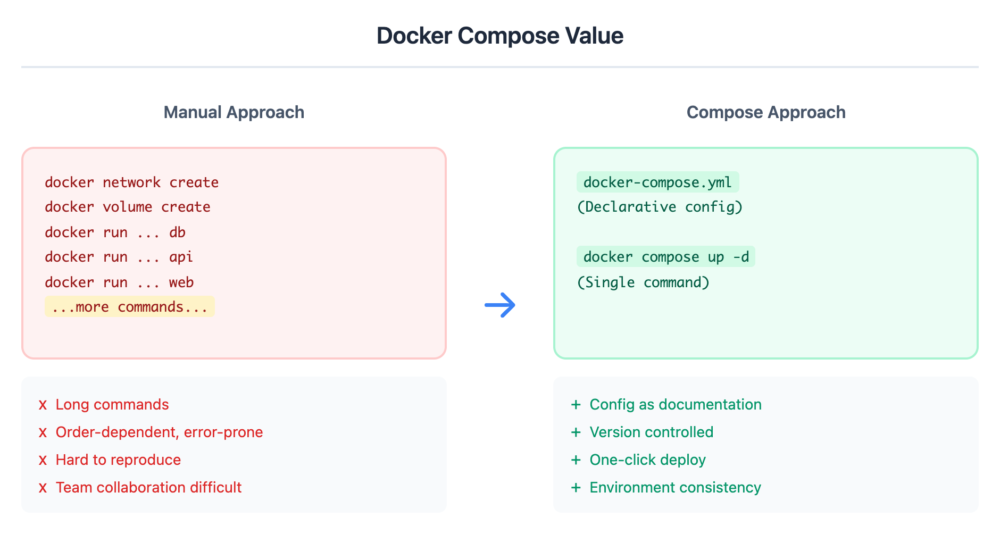
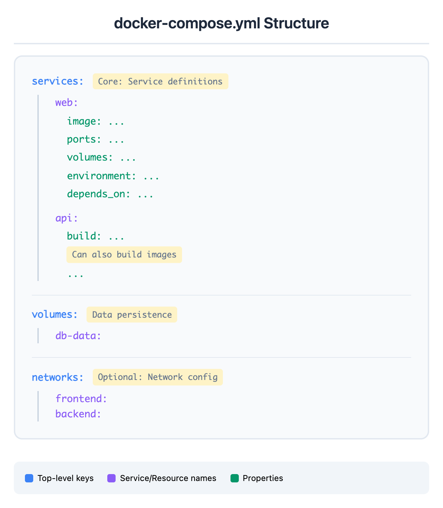

# 05 - Docker Compose 多容器编排

> **目标**：掌握 Docker Compose 编排多容器应用，实现一键部署  
> **前置**：已完成 [04 - 容器网络](../04-networking/)  
> **时间**：50 分钟  
> **费用**：Free（本地 Docker 环境）

---

## 将学到的内容

1. 理解 Docker Compose 的价值和使用场景
2. 编写 docker-compose.yml 配置文件
3. 掌握 Compose 生命周期命令
4. 使用环境变量管理敏感配置
5. 配置服务依赖和健康检查

---

## 核心理念

> **Compose = 声明式配置 + 一键部署。把"如何启动"写成代码，版本控制友好。**

手动启动多个容器需要记住大量参数，容易出错且难以复现。Docker Compose 让你用一个 YAML 文件声明整个应用栈，然后一条命令启动所有服务。

---

## Step 1 - 先跑起来：一键启动三层应用（10 分钟）

> 先体验完整流程，再理解原理。

### 1.1 准备工作

确保你的环境：
- Docker Desktop 或 Docker Engine 已安装
- `docker compose version` 输出版本信息

```bash
# 验证 Docker Compose 可用
docker compose version

# 输出示例：Docker Compose version v2.24.0
```

> **注意**：新版 Docker 使用 `docker compose`（无连字符），旧版使用 `docker-compose`。本课程使用新版语法。

### 1.2 创建项目目录

```bash
# 创建项目目录
mkdir -p ~/docker-compose-demo && cd ~/docker-compose-demo
```

### 1.3 创建 docker-compose.yml

创建一个完整的三层应用配置：

```bash
cat > docker-compose.yml << 'EOF'
# 三层应用示例：Nginx + API + Database
services:
  # 前端/反向代理层
  web:
    image: nginx:1.28-alpine
    ports:
      - "8080:80"
    volumes:
      - ./nginx/default.conf:/etc/nginx/conf.d/default.conf:ro
    depends_on:
      - api
    restart: unless-stopped

  # API 层
  api:
    image: python:3.11-alpine
    working_dir: /app
    volumes:
      - ./api:/app
    command: python -m http.server 5000
    environment:
      - DB_HOST=db
      - DB_PORT=5432
    depends_on:
      - db
    restart: unless-stopped

  # 数据库层
  db:
    image: postgres:17-alpine
    environment:
      POSTGRES_USER: demo
      POSTGRES_PASSWORD: secret123
      POSTGRES_DB: myapp
    volumes:
      - db-data:/var/lib/postgresql/data
    restart: unless-stopped

# 命名卷（数据持久化）
volumes:
  db-data:
EOF
```

### 1.4 创建配置文件

创建 Nginx 配置和简单的 API：

```bash
# 创建 Nginx 配置目录
mkdir -p nginx

# 创建反向代理配置
cat > nginx/default.conf << 'EOF'
server {
    listen 80;
    server_name localhost;

    location / {
        root /usr/share/nginx/html;
        index index.html;
    }

    location /api/ {
        proxy_pass http://api:5000/;
        proxy_set_header Host $host;
        proxy_set_header X-Real-IP $remote_addr;
    }

    location /health {
        return 200 'OK';
        add_header Content-Type text/plain;
    }
}
EOF

# 创建 API 目录和示例文件
mkdir -p api

cat > api/index.html << 'EOF'
{"status": "healthy", "service": "demo-api"}
EOF
```

### 1.5 一键启动

```bash
# 启动所有服务（后台运行）
docker compose up -d

# 查看服务状态
docker compose ps
```

输出示例：
```
NAME                        SERVICE   STATUS    PORTS
docker-compose-demo-api-1   api       running
docker-compose-demo-db-1    db        running   5432/tcp
docker-compose-demo-web-1   web       running   0.0.0.0:8080->80/tcp
```

### 1.6 验证应用

```bash
# 测试 Nginx
curl http://localhost:8080/health

# 测试 API 代理
curl http://localhost:8080/api/

# 查看日志
docker compose logs --tail=20
```

**恭喜！你用一条命令启动了三个相互连接的容器！**

---

## Step 2 - 发生了什么？（5 分钟）

### 2.1 为什么需要 Docker Compose？

没有 Compose 时，启动上面的三层应用需要：

```bash
# 手动方式（繁琐且易错）
docker network create demo-net
docker volume create db-data

docker run -d --name db --network demo-net \
  -e POSTGRES_USER=demo \
  -e POSTGRES_PASSWORD=secret123 \
  -e POSTGRES_DB=myapp \
  -v db-data:/var/lib/postgresql/data \
  postgres:17-alpine

docker run -d --name api --network demo-net \
  -e DB_HOST=db -e DB_PORT=5432 \
  -v $(pwd)/api:/app -w /app \
  python:3.11-alpine python -m http.server 5000

docker run -d --name web --network demo-net \
  -p 8080:80 \
  -v $(pwd)/nginx/default.conf:/etc/nginx/conf.d/default.conf:ro \
  nginx:1.28-alpine
```

**问题**：
- 命令长，参数多，容易打错
- 启动顺序需要手动控制
- 每次都要重复输入
- 无法版本控制

### 2.2 Docker Compose 的价值



<details>
<summary>View ASCII source</summary>

<!-- DIAGRAM: compose-value -->
```
                 Docker Compose 的价值

   手动方式                          Compose 方式
   ─────────                        ─────────────
   ┌─────────────────────────┐      ┌─────────────────────────┐
   │ docker network create   │      │                         │
   │ docker volume create    │      │  docker-compose.yml     │
   │ docker run ... db       │  →   │  (声明式配置)            │
   │ docker run ... api      │      │                         │
   │ docker run ... web      │      │  docker compose up -d   │
   │ ...更多命令...           │      │  (一条命令)              │
   └─────────────────────────┘      └─────────────────────────┘
         ↓                                    ↓
   • 命令冗长                         • 配置即文档
   • 顺序易错                         • 版本控制
   • 难以复现                         • 一键部署
   • 团队协作困难                     • 环境一致性
```
<!-- /DIAGRAM -->

</details>

### 2.3 Compose 自动做了什么

当执行 `docker compose up` 时，Compose 自动：

1. **创建网络**：`docker-compose-demo_default`（项目名_default）
2. **创建卷**：`docker-compose-demo_db-data`
3. **按依赖顺序启动容器**：db → api → web
4. **配置容器间 DNS**：服务名即主机名

```bash
# 查看 Compose 创建的资源
docker network ls | grep demo
docker volume ls | grep demo
```

---

## Step 3 - docker-compose.yml 结构（10 分钟）

### 3.1 文件结构概览



<details>
<summary>View ASCII source</summary>

<!-- DIAGRAM: compose-structure -->
```
              docker-compose.yml 结构

    ┌─────────────────────────────────────────┐
    │  services:        ← 服务定义（核心）      │
    │    web:                                  │
    │      image: ...                          │
    │      ports: ...                          │
    │      volumes: ...                        │
    │      environment: ...                    │
    │      depends_on: ...                     │
    │                                          │
    │    api:                                  │
    │      build: ...      ← 也可以构建镜像     │
    │      ...                                 │
    │                                          │
    │  volumes:           ← 卷定义             │
    │    db-data:                              │
    │                                          │
    │  networks:          ← 网络定义（可选）    │
    │    frontend:                             │
    │    backend:                              │
    └─────────────────────────────────────────┘
```
<!-- /DIAGRAM -->

</details>

### 3.2 服务配置详解

```yaml
services:
  api:
    # 镜像：使用现有镜像
    image: python:3.11-alpine

    # 或构建：从 Dockerfile 构建
    build:
      context: ./api          # 构建上下文
      dockerfile: Dockerfile  # Dockerfile 路径

    # 端口映射：主机端口:容器端口
    ports:
      - "5000:5000"
      - "5001:5001"

    # 卷挂载
    volumes:
      - ./src:/app            # Bind mount（开发用）
      - data:/var/data        # Named volume（持久化）
      - /app/node_modules     # 匿名卷（保护目录）

    # 环境变量
    environment:
      - NODE_ENV=production
      - DB_HOST=db
    # 或使用对象格式
    environment:
      NODE_ENV: production
      DB_HOST: db

    # 从文件加载环境变量
    env_file:
      - .env
      - .env.local

    # 依赖关系
    depends_on:
      - db
      - redis

    # 工作目录
    working_dir: /app

    # 启动命令
    command: npm start
    # 或数组格式
    command: ["npm", "run", "dev"]

    # 重启策略
    restart: unless-stopped
    # 选项：no, always, on-failure, unless-stopped

    # 网络
    networks:
      - frontend
      - backend
```

### 3.3 卷配置

```yaml
volumes:
  # 简单定义（Docker 管理）
  db-data:

  # 详细配置
  app-data:
    driver: local
    driver_opts:
      type: none
      o: bind
      device: /data/app
```

### 3.4 网络配置

```yaml
networks:
  # 简单定义
  frontend:

  # 详细配置
  backend:
    driver: bridge
    ipam:
      config:
        - subnet: 172.28.0.0/16

  # 使用外部网络
  existing-net:
    external: true
```

---

## Step 4 - Compose 命令（10 分钟）

### 4.1 核心命令速查

| 命令 | 说明 |
|------|------|
| `docker compose up -d` | 创建并启动所有服务（后台） |
| `docker compose down` | 停止并删除容器、网络 |
| `docker compose ps` | 查看服务状态 |
| `docker compose logs` | 查看服务日志 |
| `docker compose exec` | 在运行中的服务执行命令 |
| `docker compose build` | 构建或重新构建服务镜像 |
| `docker compose pull` | 拉取服务镜像 |
| `docker compose restart` | 重启服务 |

### 4.2 启动和停止

```bash
# 启动所有服务（后台）
docker compose up -d

# 启动指定服务
docker compose up -d web api

# 查看状态
docker compose ps

# 停止服务（保留容器）
docker compose stop

# 停止并删除容器、网络
docker compose down

# 同时删除卷（慎用！数据会丢失）
docker compose down -v

# 同时删除镜像
docker compose down --rmi all
```

### 4.3 日志和调试

```bash
# 查看所有服务日志
docker compose logs

# 实时跟踪日志
docker compose logs -f

# 指定服务的日志
docker compose logs -f api

# 显示最近 N 行
docker compose logs --tail=50 api

# 显示时间戳
docker compose logs -t api
```

### 4.4 进入容器和执行命令

```bash
# 进入容器 shell
docker compose exec api sh
docker compose exec db psql -U demo -d myapp

# 执行单个命令
docker compose exec api ls -la /app
docker compose exec db pg_dump -U demo myapp > backup.sql
```

### 4.5 构建相关

```bash
# 构建镜像
docker compose build

# 强制重新构建（不使用缓存）
docker compose build --no-cache

# 构建并启动
docker compose up -d --build

# 拉取最新镜像
docker compose pull
```

### 4.6 实战练习

```bash
cd ~/docker-compose-demo

# 查看当前状态
docker compose ps

# 查看 API 服务日志
docker compose logs api

# 进入数据库容器
docker compose exec db psql -U demo -d myapp -c '\dt'

# 重启 web 服务
docker compose restart web

# 停止所有服务
docker compose down
```

### 4.7 开发工作流：Compose Watch（推荐）

Docker Compose v2.22+ 引入了 `--watch` 模式，自动监控文件变化并同步/重建容器，无需手动重启。

**为什么比 bind mount 更好？**
- 跨平台一致性（Windows/Mac 的 bind mount 有同步延迟）
- 明确控制哪些变化触发重建 vs 仅同步
- 开发/生产配置分离更清晰

**三种 action 模式：**

| Action | 用途 | 示例场景 |
|--------|------|----------|
| `sync` | 仅同步文件（Hot Reload） | React/Flask 开发模式 |
| `rebuild` | 重新构建镜像 | Go/Rust 编译型语言 |
| `sync+restart` | 同步后重启进程 | 修改 nginx.conf 配置 |

**配置示例：**

```yaml
services:
  api:
    build: ./api
    develop:
      watch:
        - action: sync
          path: ./api
          target: /app
          ignore:
            - __pycache__
            - "*.pyc"
        - action: rebuild
          path: ./api/requirements.txt
```

**使用方法：**

```bash
# 启动并监控文件变化
docker compose up --watch

# 或后台运行
docker compose up -d --watch
```

**实际效果：**
1. 修改 `./api/app.py` → 自动同步到容器，Flask 热重载
2. 修改 `./api/requirements.txt` → 自动重新构建镜像

> **提示**：Compose Watch 是开发环境利器，生产环境请使用标准 `docker compose up -d`。

---

## Step 5 - 环境变量管理（5 分钟）

### 5.1 为什么需要环境变量？

**反模式**：直接在 docker-compose.yml 中硬编码敏感信息

```yaml
# 错误示范 - 密码暴露在版本控制中！
services:
  db:
    environment:
      POSTGRES_PASSWORD: my-secret-password  # 危险！
```

### 5.2 使用 .env 文件

创建 `.env` 文件（不提交到 Git）：

```bash
cat > .env << 'EOF'
# Database settings
POSTGRES_USER=demo
POSTGRES_PASSWORD=super-secret-password-123
POSTGRES_DB=myapp

# API settings
API_PORT=5000
DEBUG=false
EOF

# 添加到 .gitignore
echo '.env' >> .gitignore
```

在 docker-compose.yml 中引用：

```yaml
services:
  db:
    image: postgres:17-alpine
    environment:
      POSTGRES_USER: ${POSTGRES_USER}
      POSTGRES_PASSWORD: ${POSTGRES_PASSWORD}
      POSTGRES_DB: ${POSTGRES_DB}
```

### 5.3 提供示例配置

创建 `.env.example`（提交到 Git，供参考）：

```bash
cat > .env.example << 'EOF'
# Copy this file to .env and fill in the values
# cp .env.example .env

# Database settings
POSTGRES_USER=demo
POSTGRES_PASSWORD=your-password-here
POSTGRES_DB=myapp

# API settings
API_PORT=5000
DEBUG=false
EOF
```

### 5.4 环境变量优先级

Compose 环境变量按以下优先级加载（高到低）：

1. Shell 环境变量
2. `.env` 文件
3. `docker-compose.yml` 中的默认值

```bash
# 使用 Shell 变量覆盖
POSTGRES_PASSWORD=override docker compose up -d

# 检查变量解析结果
docker compose config
```

### 5.5 多环境配置

```bash
# 开发环境
docker compose --env-file .env.dev up -d

# 生产环境
docker compose --env-file .env.prod up -d
```

---

## Step 6 - 服务依赖与健康检查（5 分钟）

### 6.1 depends_on 的局限性

`depends_on` 只保证**启动顺序**，不保证**服务就绪**：

```yaml
services:
  api:
    depends_on:
      - db  # db 容器启动后立即启动 api
            # 但 db 可能还没准备好接受连接！
```

### 6.2 健康检查（推荐方案）

```yaml
services:
  db:
    image: postgres:17-alpine
    environment:
      POSTGRES_USER: ${POSTGRES_USER:-demo}
      POSTGRES_PASSWORD: ${POSTGRES_PASSWORD:-secret}
      POSTGRES_DB: ${POSTGRES_DB:-myapp}
    healthcheck:
      test: ["CMD-SHELL", "pg_isready -U ${POSTGRES_USER:-demo}"]
      interval: 10s
      timeout: 5s
      retries: 5
      start_period: 30s
    volumes:
      - db-data:/var/lib/postgresql/data

  api:
    image: python:3.11-alpine
    depends_on:
      db:
        condition: service_healthy  # 等待 db 健康后再启动
    environment:
      - DB_HOST=db
```

### 6.3 健康检查参数说明

| 参数 | 说明 | 示例 |
|------|------|------|
| `test` | 检查命令 | `["CMD-SHELL", "wget -q --spider http://localhost/health"]` |
| `interval` | 检查间隔 | `10s` |
| `timeout` | 超时时间 | `5s` |
| `retries` | 失败重试次数 | `3` |
| `start_period` | 启动宽限期 | `30s` |

### 6.4 常见服务的健康检查

```yaml
# PostgreSQL
healthcheck:
  test: ["CMD-SHELL", "pg_isready -U postgres"]

# MySQL
healthcheck:
  test: ["CMD", "mysqladmin", "ping", "-h", "localhost"]

# Redis
healthcheck:
  test: ["CMD", "redis-cli", "ping"]

# Nginx (alpine 镜像没有 curl，使用 wget)
healthcheck:
  test: ["CMD-SHELL", "wget -q --spider http://localhost/health || exit 1"]

# Python slim (没有 curl，使用 Python 内置模块)
healthcheck:
  test: ["CMD-SHELL", "python -c \"import urllib.request; urllib.request.urlopen('http://localhost:5000/health')\" || exit 1"]
```

> **注意**：不同基础镜像包含不同工具。`alpine` 镜像通常有 `wget` 但没有 `curl`；`python:slim` 镜像可以用 Python 内置模块。

---

## Mini-Project：三层应用完整部署

现在，让我们创建一个完整的、生产级别的三层应用配置。

### 目标

1. 部署 Nginx（反向代理）+ Flask API + PostgreSQL
2. 使用 .env 管理敏感配置
3. 配置健康检查确保服务就绪
4. 数据持久化

### 步骤

#### 1. 创建项目结构

```bash
# 创建新项目
mkdir -p ~/compose-project && cd ~/compose-project

# 创建目录结构
mkdir -p api nginx
```

#### 2. 创建 Flask API

```bash
cat > api/app.py << 'EOF'
from flask import Flask, jsonify
import os
import psycopg2

app = Flask(__name__)

def get_db_connection():
    return psycopg2.connect(
        host=os.environ.get('DB_HOST', 'db'),
        port=os.environ.get('DB_PORT', '5432'),
        user=os.environ.get('DB_USER', 'demo'),
        password=os.environ.get('DB_PASSWORD', 'secret'),
        database=os.environ.get('DB_NAME', 'myapp')
    )

@app.route('/health')
def health():
    return jsonify({'status': 'healthy'})

@app.route('/api/status')
def status():
    try:
        conn = get_db_connection()
        cur = conn.cursor()
        cur.execute('SELECT version()')
        db_version = cur.fetchone()[0]
        cur.close()
        conn.close()
        return jsonify({
            'api': 'running',
            'database': 'connected',
            'db_version': db_version
        })
    except Exception as e:
        return jsonify({
            'api': 'running',
            'database': 'error',
            'error': str(e)
        }), 500

@app.route('/api/info')
def info():
    return jsonify({
        'service': 'demo-api',
        'version': '1.0.0',
        'environment': os.environ.get('APP_ENV', 'development')
    })

if __name__ == '__main__':
    app.run(host='0.0.0.0', port=5000, debug=os.environ.get('DEBUG', 'false').lower() == 'true')
EOF

cat > api/requirements.txt << 'EOF'
flask==3.1.2
psycopg2-binary==2.9.11
gunicorn==23.0.0
EOF

cat > api/Dockerfile << 'EOF'
FROM python:3.11-slim

WORKDIR /app

# Install dependencies
COPY requirements.txt .
RUN pip install --no-cache-dir -r requirements.txt

# Copy application
COPY app.py .

# Create non-root user
RUN useradd -m appuser && chown -R appuser:appuser /app
USER appuser

EXPOSE 5000

CMD ["gunicorn", "--bind", "0.0.0.0:5000", "--workers", "2", "app:app"]
EOF
```

#### 3. 创建 Nginx 配置

```bash
cat > nginx/nginx.conf << 'EOF'
upstream api {
    server api:5000;
}

server {
    listen 80;
    server_name localhost;

    # Health check endpoint
    location /health {
        return 200 'OK';
        add_header Content-Type text/plain;
    }

    # Static files (if any)
    location / {
        root /usr/share/nginx/html;
        index index.html;
        try_files $uri $uri/ =404;
    }

    # API proxy
    location /api/ {
        proxy_pass http://api/api/;
        proxy_http_version 1.1;
        proxy_set_header Host $host;
        proxy_set_header X-Real-IP $remote_addr;
        proxy_set_header X-Forwarded-For $proxy_add_x_forwarded_for;
        proxy_set_header X-Forwarded-Proto $scheme;
        proxy_connect_timeout 30s;
        proxy_read_timeout 30s;
    }
}
EOF

# Create a simple index page
cat > nginx/index.html << 'EOF'
<!DOCTYPE html>
<html>
<head>
    <title>Docker Compose Demo</title>
    <style>
        body { font-family: Arial, sans-serif; margin: 40px; }
        .status { padding: 20px; margin: 10px 0; border-radius: 8px; }
        .healthy { background: #d4edda; color: #155724; }
        .error { background: #f8d7da; color: #721c24; }
        pre { background: #f4f4f4; padding: 15px; border-radius: 4px; }
    </style>
</head>
<body>
    <h1>Docker Compose Demo</h1>
    <div id="status" class="status">Loading...</div>
    <h2>API Response:</h2>
    <pre id="api-response">Loading...</pre>
    <script>
        fetch('/api/status')
            .then(r => r.json())
            .then(data => {
                document.getElementById('status').className = 'status healthy';
                document.getElementById('status').textContent = 'All services running!';
                document.getElementById('api-response').textContent = JSON.stringify(data, null, 2);
            })
            .catch(e => {
                document.getElementById('status').className = 'status error';
                document.getElementById('status').textContent = 'Error: ' + e.message;
            });
    </script>
</body>
</html>
EOF
```

#### 4. 创建 docker-compose.yml

```bash
cat > docker-compose.yml << 'EOF'
# Three-tier application: Nginx + Flask API + PostgreSQL
# Production-ready configuration with health checks

services:
  # Reverse proxy / Web server
  web:
    image: nginx:1.28-alpine
    ports:
      - "${WEB_PORT:-8080}:80"
    volumes:
      - ./nginx/nginx.conf:/etc/nginx/conf.d/default.conf:ro
      - ./nginx/index.html:/usr/share/nginx/html/index.html:ro
    depends_on:
      api:
        condition: service_healthy
    healthcheck:
      # Note: nginx:alpine 没有 curl，使用 wget
      test: ["CMD-SHELL", "wget -q --spider http://localhost/health || exit 1"]
      interval: 30s
      timeout: 10s
      retries: 3
    restart: unless-stopped
    networks:
      - frontend

  # Flask API
  api:
    build:
      context: ./api
      dockerfile: Dockerfile
    environment:
      - APP_ENV=${APP_ENV:-production}
      - DEBUG=${DEBUG:-false}
      - DB_HOST=db
      - DB_PORT=5432
      - DB_USER=${POSTGRES_USER:-demo}
      - DB_PASSWORD=${POSTGRES_PASSWORD}
      - DB_NAME=${POSTGRES_DB:-myapp}
    depends_on:
      db:
        condition: service_healthy
    healthcheck:
      # Note: python:slim 没有 curl，使用 Python 内置模块
      test: ["CMD-SHELL", "python -c \"import urllib.request; urllib.request.urlopen('http://localhost:5000/health')\" || exit 1"]
      interval: 30s
      timeout: 10s
      retries: 3
      start_period: 10s
    restart: unless-stopped
    networks:
      - frontend
      - backend

  # PostgreSQL Database
  db:
    image: postgres:17-alpine
    environment:
      POSTGRES_USER: ${POSTGRES_USER:-demo}
      POSTGRES_PASSWORD: ${POSTGRES_PASSWORD}
      POSTGRES_DB: ${POSTGRES_DB:-myapp}
    volumes:
      - db-data:/var/lib/postgresql/data
    healthcheck:
      test: ["CMD-SHELL", "pg_isready -U ${POSTGRES_USER:-demo} -d ${POSTGRES_DB:-myapp}"]
      interval: 10s
      timeout: 5s
      retries: 5
      start_period: 30s
    restart: unless-stopped
    networks:
      - backend

volumes:
  db-data:
    name: compose-project-db-data

networks:
  frontend:
    name: compose-project-frontend
  backend:
    name: compose-project-backend
EOF
```

#### 5. 创建环境变量文件

```bash
# 创建 .env 文件
cat > .env << 'EOF'
# Application settings
WEB_PORT=8080
APP_ENV=development
DEBUG=false

# Database settings (CHANGE THESE IN PRODUCTION!)
POSTGRES_USER=demo
POSTGRES_PASSWORD=change-me-in-production
POSTGRES_DB=myapp
EOF

# 创建 .env.example（提交到版本控制）
cat > .env.example << 'EOF'
# Copy this file to .env and fill in the values
# cp .env.example .env

# Application settings
WEB_PORT=8080
APP_ENV=development
DEBUG=false

# Database settings (CHANGE THESE IN PRODUCTION!)
POSTGRES_USER=demo
POSTGRES_PASSWORD=your-secure-password-here
POSTGRES_DB=myapp
EOF

# 创建 .gitignore
cat > .gitignore << 'EOF'
.env
*.pyc
__pycache__/
.DS_Store
EOF
```

#### 6. 启动并验证

```bash
# 构建并启动所有服务
docker compose up -d --build

# 查看启动日志
docker compose logs -f

# 等待所有服务健康（按 Ctrl+C 退出日志）
```

#### 7. 测试应用

```bash
# 等待服务就绪
sleep 10

# 测试健康检查
curl http://localhost:8080/health

# 测试 API
curl http://localhost:8080/api/status

# 测试 API 信息
curl http://localhost:8080/api/info

# 查看服务状态
docker compose ps
```

预期输出：
```
NAME                     SERVICE   STATUS    PORTS
compose-project-api-1    api       running (healthy)
compose-project-db-1     db        running (healthy)  5432/tcp
compose-project-web-1    web       running (healthy)  0.0.0.0:8080->80/tcp
```

#### 8. 打开浏览器验证

在浏览器中访问 `http://localhost:8080`，你应该看到：
- "All services running!" 状态
- API 返回的数据库连接信息

#### 9. 清理

```bash
# 停止并删除容器、网络
docker compose down

# 如果要删除数据卷（删除数据库数据）
docker compose down -v
```

### 验证成功

确认你完成了以下内容：

- [ ] `docker compose ps` 显示所有服务 `running (healthy)`
- [ ] `curl http://localhost:8080/health` 返回 `OK`
- [ ] `curl http://localhost:8080/api/status` 返回数据库连接状态
- [ ] 浏览器访问 `http://localhost:8080` 显示状态页面
- [ ] `.env` 文件包含敏感配置，不在版本控制中

---

## 职场小贴士

### 日本 IT 企业的 Compose 实践

在日本企业的开发和运维环境中，Docker Compose 常用于：

| 日本术语 | 英文 | 场景 |
|----------|------|------|
| 開発環境 | Development | 本地开发，`docker compose up` |
| テスト環境 | Testing/Staging | CI/CD 中自动部署测试 |
| 検証環境 | Verification | 变更前的验证测试 |
| 構成管理 | Configuration Management | docker-compose.yml 版本控制 |

### 常见的运维流程

```
変更申請 → レビュー → 検証環境テスト → 承認 → 本番反映
Change Request → Review → Staging Test → Approval → Production Deploy
```

### 运维文档示例（手順書）

```markdown
# コンテナ起動手順

## 前提条件
- Docker および Docker Compose インストール済み
- .env ファイル設定済み

## 起動手順
1. プロジェクトディレクトリに移動
   cd /opt/myapp

2. 環境変数確認
   cat .env | grep -v PASSWORD

3. サービス起動
   docker compose up -d

4. 起動確認
   docker compose ps
   docker compose logs --tail=50

## 停止手順
1. サービス停止
   docker compose down

2. 停止確認
   docker compose ps
```

### Compose 相关的日语表达

| 场景 | 日语表达 |
|------|----------|
| 启动服务 | コンテナを起動します |
| 检查状态 | ステータスを確認します |
| 查看日志 | ログを確認します |
| 重启服务 | サービスを再起動します |
| 环境变量 | 環境変数 |
| 健康检查 | ヘルスチェック |

---

## 检查清单

完成本课后，确认你能够：

- [ ] 解释 Docker Compose 的价值和使用场景
- [ ] 编写 docker-compose.yml 配置多服务应用
- [ ] 使用 `docker compose up/down/ps/logs` 管理服务
- [ ] 使用 `.env` 文件管理敏感配置
- [ ] 配置 `depends_on` 和 `healthcheck`
- [ ] 部署三层应用（Web + API + Database）
- [ ] 使用 `docker compose exec` 进入容器调试
- [ ] 了解 `docker compose up --watch` 开发工作流

---

## 常见问题排查

### 服务启动后立即退出

```bash
# 查看退出原因
docker compose logs <service>

# 常见原因：
# - 环境变量未设置（检查 .env）
# - 端口已被占用
# - 配置文件语法错误
```

### 服务间无法通信

```bash
# 检查网络
docker compose exec api ping db

# 确认服务名正确（使用服务名而非容器名）
# 正确：DB_HOST=db
# 错误：DB_HOST=compose-project-db-1
```

### 数据库连接失败

```bash
# 检查数据库是否就绪
docker compose exec db pg_isready -U demo

# 检查环境变量
docker compose exec api env | grep DB_

# 等待健康检查通过后再测试
docker compose ps  # 确认状态为 (healthy)
```

### Compose 文件语法错误

```bash
# 验证 compose 文件
docker compose config

# 常见错误：
# - 缩进不正确（使用空格，不要用 Tab）
# - 冒号后缺少空格
# - 字符串未加引号（含特殊字符时需要）
```

---

## 延伸阅读

- [Docker Compose 官方文档](https://docs.docker.com/compose/)
- [Compose File Reference](https://docs.docker.com/compose/compose-file/)
- [Use Compose Watch](https://docs.docker.com/compose/how-tos/file-watch/) - 开发环境文件监控
- [Compose Best Practices](https://docs.docker.com/compose/production/)
- [12-Factor App - Config](https://12factor.net/config)
- [06 - 日本 IT 运维实践](../06-japan-it/) - 下一课

---

## 系列导航

<- [04 - 容器网络](../04-networking/) | [Home](../) | [06 - 日本 IT 运维实践 ->](../06-japan-it/)
