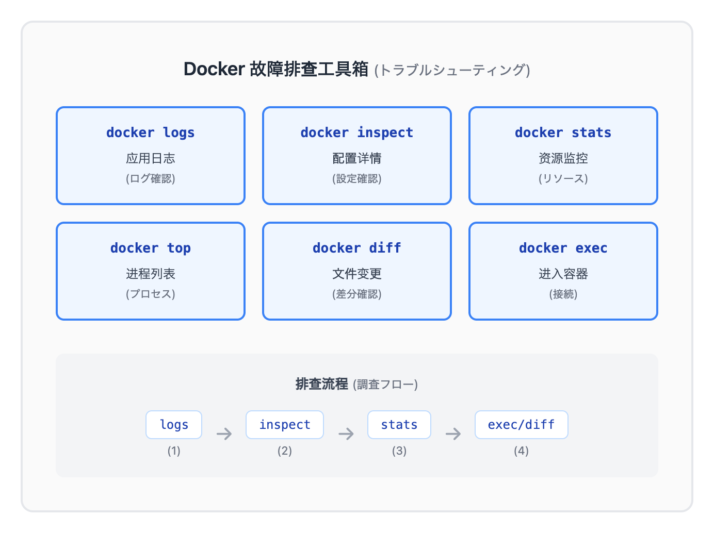
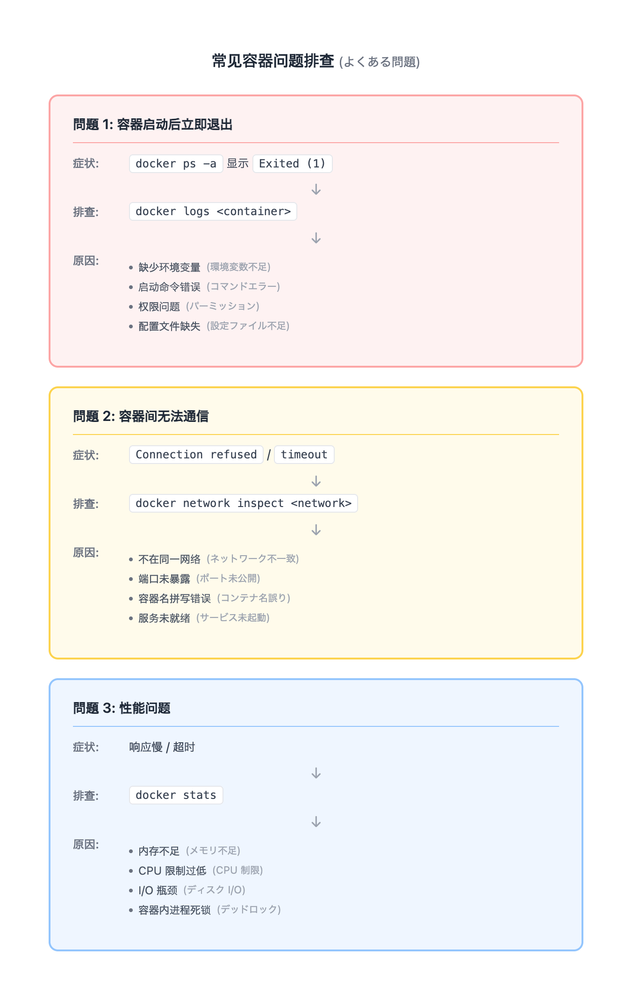
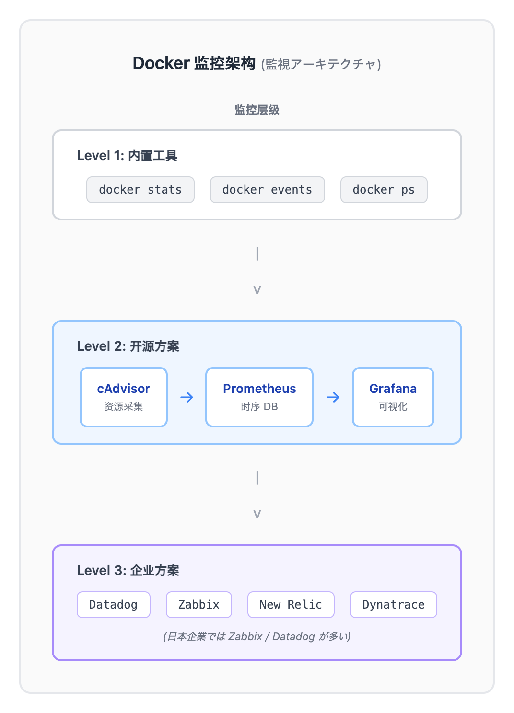
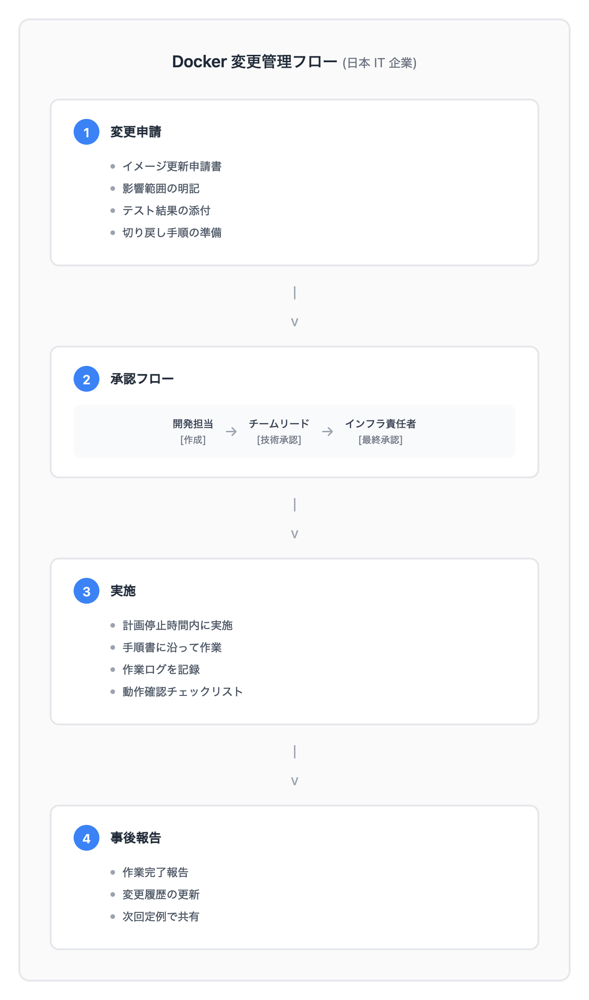

# 06 - 日本 IT 运维实践

> **目标**：将 Docker 技能映射到日本 IT 企业的运维场景和面试准备
> **前置**：已完成 [05 - Docker Compose](../05-compose/) 或具备容器编排经验
> **时间**：45-60 分钟
> **费用**：无（本地练习）
> **标记**：[OPTIONAL] 非日本就职者可跳过

---

## 将学到的内容

1. 掌握容器 **故障排查基础**（logs, inspect, stats, top, diff）
2. 理解 **常见问题排查** 场景与思路
3. 了解容器 **监控集成** 方案
4. 理解 **日志管理** 策略
5. 掌握日本 IT 企业的 **容器运维惯例**
6. 准备 **5 道 Docker 面试题**（附日语答案）

---

## 先跑起来：5 分钟排查一个问题容器

> 先动手排查，再理解方法论。

### 创建一个"问题"容器

```bash
# 创建工作目录
mkdir -p ~/docker-troubleshoot && cd ~/docker-troubleshoot

# 运行一个会失败的容器（缺少必要环境变量）
docker run -d --name broken-mysql mysql:8.0
```

### 发现问题

```bash
# 查看容器状态 - 发现已退出
docker ps -a | grep broken-mysql
```

**预期输出：**

```
abc123  mysql:8.0  "docker-entrypoint.s…"  10s ago  Exited (1) 5s ago  broken-mysql
```

容器启动后立即退出！让我们找出原因。

### 排查步骤

```bash
# Step 1: 查看日志
docker logs broken-mysql
```

**预期输出（关键行）：**

```
2026-01-03 10:00:00+00:00 [ERROR] [Entrypoint]: Database is uninitialized and password option is not specified
    You need to specify one of the following as an environment variable:
    - MYSQL_ROOT_PASSWORD
    - MYSQL_ALLOW_EMPTY_PASSWORD
    - MYSQL_RANDOM_ROOT_PASSWORD
```

**原因找到了**：缺少 `MYSQL_ROOT_PASSWORD` 环境变量。

### 修复并验证

```bash
# 删除问题容器
docker rm broken-mysql

# 正确启动（添加必要环境变量）
docker run -d --name working-mysql \
  -e MYSQL_ROOT_PASSWORD=secret123 \
  mysql:8.0

# 等待几秒后检查状态
sleep 5
docker ps | grep working-mysql
```

**预期输出：**

```
def456  mysql:8.0  "docker-entrypoint.s…"  10s ago  Up 10s  3306/tcp, 33060/tcp  working-mysql
```

容器正常运行！

### 清理

```bash
docker stop working-mysql
docker rm working-mysql
```

你刚刚完成了一次标准的容器故障排查流程！

---

## 发生了什么？

### 为什么容器排查如此重要？

在日本的 IT 运维现场（運用現場），容器故障是常见问题。与传统服务器不同：

1. **容器是临时的**（使い捨て）：问题容器直接删除重建
2. **日志是关键**：容器内没有持久化日志，必须及时捕获
3. **快速定位**：生产环境要求 MTTR（平均恢复时间）尽量短

**日本企业特点**：运维团队通常需要在 **障害発生から 30 分以内** 完成初步定位和报告。

---

## 核心概念

### 1. 故障排查工具箱



<details>
<summary>View ASCII source</summary>

<!-- DIAGRAM: docker-troubleshoot-tools -->
```
        Docker 故障排查工具箱 (トラブルシューティング)

    ┌─────────────────────────────────────────────────────────┐
    │                                                         │
    │   ┌─────────────┐    ┌─────────────┐    ┌───────────┐   │
    │   │ docker logs │    │docker inspect│   │docker stats│  │
    │   │             │    │             │    │           │   │
    │   │  应用日志    │    │  配置详情    │    │ 资源监控   │   │
    │   │  (ログ確認)  │    │  (設定確認)  │    │(リソース) │   │
    │   └─────────────┘    └─────────────┘    └───────────┘   │
    │                                                         │
    │   ┌─────────────┐    ┌─────────────┐    ┌───────────┐   │
    │   │ docker top  │    │ docker diff │    │docker exec │  │
    │   │             │    │             │    │           │   │
    │   │  进程列表    │    │  文件变更    │    │ 进入容器   │   │
    │   │ (プロセス)   │    │  (差分確認)  │    │ (接続)    │   │
    │   └─────────────┘    └─────────────┘    └───────────┘   │
    │                                                         │
    │                   排查流程 (調査フロー)                   │
    │                                                         │
    │       logs  →  inspect  →  stats  →  exec/diff          │
    │       (1)        (2)        (3)        (4)              │
    │                                                         │
    └─────────────────────────────────────────────────────────┘
```
<!-- /DIAGRAM -->

</details>

#### 命令详解

| 命令 | 日本語 | 用途 | 示例 |
|------|--------|------|------|
| `docker logs` | ログ確認 | 查看容器输出 | `docker logs -f --tail 100 app` |
| `docker inspect` | 設定確認 | 查看详细配置 | `docker inspect app \| jq '.[0].State'` |
| `docker stats` | リソース監視 | 实时资源使用 | `docker stats --no-stream` |
| `docker top` | プロセス確認 | 容器内进程 | `docker top app` |
| `docker diff` | 差分確認 | 文件系统变更 | `docker diff app` |
| `docker exec` | コンテナ接続 | 进入容器调试 | `docker exec -it app bash` |

#### 常用参数组合

```bash
# 日志排查三连
docker logs app                    # 全部日志
docker logs --tail 100 app         # 最后 100 行
docker logs -f app                 # 实时跟踪（Ctrl+C 退出）
docker logs --since 1h app         # 最近 1 小时

# 状态检查
docker inspect app --format '{{.State.Status}}'     # 容器状态
docker inspect app --format '{{.State.ExitCode}}'   # 退出码
docker inspect app --format '{{.RestartCount}}'     # 重启次数

# 资源监控
docker stats --no-stream --format "table {{.Name}}\t{{.CPUPerc}}\t{{.MemUsage}}"
```

### 2. 常见问题排查模式



<details>
<summary>View ASCII source</summary>

<!-- DIAGRAM: docker-common-issues -->
```
            常见容器问题排查 (よくある問題)

    ┌─────────────────────────────────────────────────────────┐
    │                                                         │
    │   問題 1: 容器启动后立即退出                               │
    │   ─────────────────────────────────────────────────     │
    │                                                         │
    │   症状: docker ps -a 显示 Exited (1)                     │
    │                    ↓                                    │
    │   排查: docker logs <container>                         │
    │                    ↓                                    │
    │   常见原因:                                              │
    │     • 缺少环境变量 (環境変数不足)                         │
    │     • 启动命令错误 (コマンドエラー)                        │
    │     • 权限问题 (パーミッション)                           │
    │     • 配置文件缺失 (設定ファイル不足)                      │
    │                                                         │
    └─────────────────────────────────────────────────────────┘

    ┌─────────────────────────────────────────────────────────┐
    │                                                         │
    │   問題 2: 容器间无法通信                                  │
    │   ─────────────────────────────────────────────────     │
    │                                                         │
    │   症状: Connection refused / timeout                    │
    │                    ↓                                    │
    │   排查: docker network inspect <network>                │
    │                    ↓                                    │
    │   常见原因:                                              │
    │     • 不在同一网络 (ネットワーク不一致)                    │
    │     • 端口未暴露 (ポート未公開)                           │
    │     • 容器名拼写错误 (コンテナ名誤り)                      │
    │     • 服务未就绪 (サービス未起動)                         │
    │                                                         │
    └─────────────────────────────────────────────────────────┘

    ┌─────────────────────────────────────────────────────────┐
    │                                                         │
    │   問題 3: 性能问题                                       │
    │   ─────────────────────────────────────────────────     │
    │                                                         │
    │   症状: 响应慢 / 超时                                    │
    │                    ↓                                    │
    │   排查: docker stats                                    │
    │                    ↓                                    │
    │   常见原因:                                              │
    │     • 内存不足 (メモリ不足)                               │
    │     • CPU 限制过低 (CPU 制限)                            │
    │     • I/O 瓶颈 (ディスク I/O)                            │
    │     • 容器内进程死锁 (デッドロック)                        │
    │                                                         │
    └─────────────────────────────────────────────────────────┘
```
<!-- /DIAGRAM -->

</details>

#### Exit Code 速查表

| Exit Code | 含义 | 日本語 | 排查方向 |
|-----------|------|--------|---------|
| 0 | 正常退出 | 正常終了 | 检查 CMD 是否为前台进程 |
| 1 | 通用错误 | 一般エラー | 查看 logs |
| 126 | 命令无执行权限 | 権限エラー | 检查文件权限 |
| 127 | 命令未找到 | コマンド不明 | 检查 PATH 或镜像内容 |
| 137 | SIGKILL（OOM） | OOM Kill | 增加内存限制 |
| 139 | SIGSEGV | セグフォルト | 应用程序 bug |
| 143 | SIGTERM | 正常停止 | docker stop 触发 |

### 3. 监控集成



<details>
<summary>View ASCII source</summary>

<!-- DIAGRAM: docker-monitoring -->
```
              Docker 监控架构 (監視アーキテクチャ)

    ┌─────────────────────────────────────────────────────────┐
    │                                                         │
    │                    监控层级                              │
    │                                                         │
    │   Level 1: 内置工具                                      │
    │   ┌─────────────────────────────────────────────┐       │
    │   │  docker stats    docker events    docker ps │       │
    │   └─────────────────────────────────────────────┘       │
    │                         │                               │
    │                         ▼                               │
    │   Level 2: 开源方案                                      │
    │   ┌─────────────────────────────────────────────┐       │
    │   │                                             │       │
    │   │   ┌──────────┐    ┌──────────┐    ┌──────┐  │       │
    │   │   │ cAdvisor │───▶│Prometheus│───▶│Grafana│ │       │
    │   │   │          │    │          │    │      │  │       │
    │   │   │ 资源采集  │    │  时序DB   │    │ 可视化│  │       │
    │   │   └──────────┘    └──────────┘    └──────┘  │       │
    │   │                                             │       │
    │   └─────────────────────────────────────────────┘       │
    │                         │                               │
    │                         ▼                               │
    │   Level 3: 企业方案                                      │
    │   ┌─────────────────────────────────────────────┐       │
    │   │   Datadog    Zabbix    New Relic    Dynatrace│      │
    │   │                                             │       │
    │   │   (日本企業では Zabbix / Datadog が多い)      │       │
    │   └─────────────────────────────────────────────┘       │
    │                                                         │
    └─────────────────────────────────────────────────────────┘
```
<!-- /DIAGRAM -->

</details>

#### 监控指标 (监视項目)

| 指标 | 日本語 | 阈值参考 | 工具 |
|------|--------|---------|------|
| CPU 使用率 | CPU 使用率 | > 80% 警告 | docker stats |
| 内存使用 | メモリ使用量 | > 85% 警告 | docker stats |
| 容器状态 | コンテナ状態 | != running | docker ps |
| 重启次数 | 再起動回数 | > 3 次/小时 | docker inspect |
| 网络 I/O | ネットワーク I/O | 异常峰值 | docker stats |
| 健康检查 | ヘルスチェック | unhealthy | docker inspect |

#### Prometheus + Grafana 快速部署

```yaml
# docker-compose.monitoring.yml
services:
  prometheus:
    image: prom/prometheus:v3.4.0
    ports:
      - "9090:9090"
    volumes:
      - ./prometheus.yml:/etc/prometheus/prometheus.yml
    command:
      - '--config.file=/etc/prometheus/prometheus.yml'

  grafana:
    image: grafana/grafana:12.3.0
    ports:
      - "3000:3000"
    environment:
      - GF_SECURITY_ADMIN_PASSWORD=admin

  cadvisor:
    image: gcr.io/cadvisor/cadvisor:v0.51.0
    ports:
      - "8080:8080"
    volumes:
      - /:/rootfs:ro
      - /var/run:/var/run:ro
      - /sys:/sys:ro
      - /var/lib/docker/:/var/lib/docker:ro
```

### 4. 日志管理

#### Log Driver 配置

```json
// /etc/docker/daemon.json
{
  "log-driver": "json-file",
  "log-opts": {
    "max-size": "10m",
    "max-file": "3"
  }
}
```

**配置说明**：

| 参数 | 说明 | 推荐值 |
|------|------|--------|
| max-size | 单个日志文件大小 | 10m - 100m |
| max-file | 保留文件数量 | 3 - 5 |

**重要**：生产环境必须配置日志轮转，否则磁盘会被日志撑满！

#### 常用 Log Driver

| Driver | 用途 | 日本企業での使用 |
|--------|------|----------------|
| json-file | 默认，本地存储 | 开发环境 |
| syslog | 发送到 syslog | 传统运维 |
| fluentd | 发送到 Fluentd | 推荐（Elastic Stack） |
| awslogs | 发送到 CloudWatch | AWS 环境 |

---

## 動手练习：监控与日志实战

### 练习 1：使用 docker stats 监控

```bash
# 启动测试容器
docker run -d --name stress-test alpine sh -c "while true; do :; done"

# 实时监控
docker stats stress-test

# 格式化输出（适合脚本/报告）
docker stats --no-stream --format "table {{.Name}}\t{{.CPUPerc}}\t{{.MemUsage}}"

# 清理
docker stop stress-test && docker rm stress-test
```

### 练习 2：配置健康检查

```bash
# 创建带健康检查的容器
cat > /tmp/healthcheck-compose.yml << 'EOF'
services:
  web:
    image: nginx:1.28
    ports:
      - "8080:80"
    healthcheck:
      test: ["CMD", "curl", "-f", "http://localhost/"]
      interval: 30s
      timeout: 10s
      retries: 3
      start_period: 10s
EOF

# 启动
docker compose -f /tmp/healthcheck-compose.yml up -d

# 查看健康状态
docker inspect web --format '{{.State.Health.Status}}'

# 清理
docker compose -f /tmp/healthcheck-compose.yml down
```

### 练习 3：日志分析

```bash
# 启动 Nginx 并生成请求
docker run -d --name nginx-log -p 8080:80 nginx:1.28

# 生成一些访问日志
for i in {1..10}; do curl -s http://localhost:8080 > /dev/null; done
curl -s http://localhost:8080/notfound > /dev/null

# 查看访问日志
docker logs nginx-log

# 只看错误（grep 404）
docker logs nginx-log 2>&1 | grep 404

# 清理
docker stop nginx-log && docker rm nginx-log
```

---

## 日本 IT 运维惯例

### 1. 文档化要求 (ドキュメント)

日本企業では以下のドキュメントが必須：

#### コンテナ一覧表

| 項目 | 内容 |
|------|------|
| コンテナ名 | web-server-01 |
| イメージ | nginx:1.28 |
| ポート | 80:80, 443:443 |
| ボリューム | /data/web:/usr/share/nginx/html |
| 環境 | 本番 (Production) |
| 担当者 | 運用チーム |
| 監視設定 | Zabbix Agent 有効 |

> **模板文件**: 参见 `templates/container-inventory.md`

#### 障害報告書

| 項目 | 内容 |
|------|------|
| 発生日時 | 2026-01-03 10:30:00 JST |
| 検知方法 | Zabbix アラート |
| 影響範囲 | Web サービス全体 |
| 原因 | コンテナ OOM Kill |
| 対応内容 | メモリ制限を 512MB → 1GB に変更 |
| 復旧日時 | 2026-01-03 10:45:00 JST |
| 再発防止策 | メモリ監視閾値の見直し |

> **模板文件**: 参见 `templates/incident-report.md`

### 2. 変更管理 (Change Management)



<details>
<summary>View ASCII source</summary>

<!-- DIAGRAM: docker-change-management -->
```
          Docker 変更管理フロー (日本 IT 企業)

    ┌─────────────────────────────────────────────────────────┐
    │                                                         │
    │   ① 変更申請                                            │
    │   ┌──────────────────────────────────────────────┐      │
    │   │  • イメージ更新申請書                          │      │
    │   │  • 影響範囲の明記                              │      │
    │   │  • テスト結果の添付                            │      │
    │   │  • 切り戻し手順の準備                          │      │
    │   └──────────────────────────────────────────────┘      │
    │                         │                               │
    │                         ▼                               │
    │   ② 承認フロー                                          │
    │   ┌──────────────────────────────────────────────┐      │
    │   │                                              │      │
    │   │   開発担当 → チームリード → インフラ責任者       │      │
    │   │      ↓           ↓              ↓            │      │
    │   │   [作成]      [技術承認]      [最終承認]       │      │
    │   │                                              │      │
    │   └──────────────────────────────────────────────┘      │
    │                         │                               │
    │                         ▼                               │
    │   ③ 実施                                               │
    │   ┌──────────────────────────────────────────────┐      │
    │   │  • 計画停止時間内に実施                        │      │
    │   │  • 手順書に沿って作業                          │      │
    │   │  • 作業ログを記録                              │      │
    │   │  • 動作確認チェックリスト                       │      │
    │   └──────────────────────────────────────────────┘      │
    │                         │                               │
    │                         ▼                               │
    │   ④ 事後報告                                           │
    │   ┌──────────────────────────────────────────────┐      │
    │   │  • 作業完了報告                                │      │
    │   │  • 変更履歴の更新                              │      │
    │   │  • 次回定例で共有                              │      │
    │   └──────────────────────────────────────────────┘      │
    │                                                         │
    └─────────────────────────────────────────────────────────┘
```
<!-- /DIAGRAM -->

</details>

**变更管理要点**：

| 項目 | 説明 | 頻度 |
|------|------|------|
| イメージ更新 | セキュリティパッチ適用 | 月次 |
| 設定変更 | 環境変数、ポート変更 | 都度申請 |
| スケール変更 | レプリカ数の増減 | 都度申請 |
| 定期再起動 | メモリリーク対策 | 週次/月次 |

### 3. 監視設定 (Monitoring)

日本企业常见的监控配置：

```yaml
# Zabbix Agent for Docker (example)
# 通常与运维团队协调设置

監視項目:
  死活監視:
    - コンテナ起動状態 (running/stopped)
    - ヘルスチェック状態

  リソース監視:
    - CPU 使用率 (閾値: 80%)
    - メモリ使用率 (閾値: 85%)
    - ディスク使用率 (閾値: 80%)

  ログ監視:
    - ERROR パターン検知
    - 特定キーワード検知

  性能監視:
    - レスポンスタイム
    - スループット
```

---

## 面试准备：5 道 Docker 问题

### 問題 1: コンテナと VM の違いは？

**質問（日本語）：**

> コンテナと仮想マシン（VM）の違いを説明してください。

**回答例：**

```
コンテナと VM は両方とも隔離された環境を提供しますが、
アーキテクチャが根本的に異なります。

主な違い：
1. カーネル共有
   - コンテナ：ホスト OS のカーネルを共有
   - VM：各 VM が独自のカーネルを持つ

2. リソース効率
   - コンテナ：軽量（MB 単位）、秒単位で起動
   - VM：重量（GB 単位）、分単位で起動

3. 隔離レベル
   - コンテナ：プロセスレベルの隔離
   - VM：ハードウェアレベルの隔離

4. 用途
   - コンテナ：マイクロサービス、CI/CD
   - VM：異なる OS、強い隔離が必要な場合

コンテナは軽量で高速ですが、VM はより強い隔離を提供します。
```

### 問題 2: Docker イメージを軽量化する方法は？

**質問（日本語）：**

> Docker イメージを軽量化するベストプラクティスを教えてください。

**回答例：**

```
イメージ軽量化の方法：

1. ベースイメージの選択
   - Alpine Linux を使用（約 5MB）
   - 例：python:3.11-alpine vs python:3.11（1GB → 50MB）

2. マルチステージビルド
   - ビルド環境と実行環境を分離
   - ビルドツールを最終イメージに含めない

3. レイヤー最適化
   - RUN 命令をまとめる
   - 不要ファイルは同じレイヤーで削除

4. .dockerignore の活用
   - node_modules、.git 等を除外
   - ビルドコンテキストを最小化

5. 不要パッケージの削除
   - キャッシュファイルの削除
   - ドキュメントの削除

軽量化はセキュリティ向上（攻撃対象の削減）にも繋がります。
```

### 問題 3: コンテナのデータ永続化方法は？

**質問（日本語）：**

> コンテナのデータを永続化する方法を説明してください。

**回答例：**

```
Docker のデータ永続化には主に 3 つの方法があります：

1. Volume（推奨）
   - Docker が管理するストレージ
   - コンテナ間で共有可能
   - 用途：データベース、アプリケーションデータ
   - 例：docker run -v mydata:/var/lib/mysql mysql

2. Bind Mount
   - ホストのディレクトリを直接マウント
   - 開発環境でのコード共有に最適
   - 用途：開発時のソースコード
   - 例：docker run -v $(pwd):/app node

3. tmpfs Mount
   - メモリ上の一時ストレージ
   - 高速だが揮発性
   - 用途：一時ファイル、機密情報

本番環境では Named Volume を推奨します。
Bind Mount はホストパスに依存するため、移植性が低下します。
```

### 問題 4: コンテナが起動しない時のトラブルシューティングは？

**質問（日本語）：**

> コンテナが起動しない場合のトラブルシューティング手順を教えてください。

**回答例：**

```
コンテナが起動しない場合の調査手順：

Step 1: ログ確認
  docker logs <container>
  → エラーメッセージを確認

Step 2: Exit Code 確認
  docker inspect <container> --format '{{.State.ExitCode}}'
  → 1: 一般エラー、137: OOM、127: コマンド不明

Step 3: 設定確認
  docker inspect <container>
  → 環境変数、ボリュームマウント、ネットワーク設定

Step 4: イメージ確認
  docker history <image>
  → イメージの構成を確認

Step 5: インタラクティブ実行
  docker run -it <image> sh
  → 手動で起動コマンドを試す

よくある原因：
- 環境変数の不足
- 設定ファイルの不備
- 権限問題（Permission denied）
- リソース制限（メモリ不足）
```

### 問題 5: Docker Compose の利点は？

**質問（日本語）：**

> Docker Compose を使う利点を教えてください。

**回答例：**

```
Docker Compose の利点：

1. 宣言的設定
   - YAML ファイルで環境を定義
   - バージョン管理が容易
   - 環境の再現性が高い

2. マルチコンテナ管理
   - 複数コンテナを一括管理
   - 依存関係の定義（depends_on）
   - ネットワークの自動作成

3. 開発効率の向上
   - docker compose up で全て起動
   - docker compose down で全て停止
   - チーム全員が同じ環境を使用可能

4. 環境分離
   - 開発、ステージング、本番で設定を分離
   - .env ファイルで環境変数管理

5. CI/CD 連携
   - テスト環境の自動構築
   - 本番デプロイの一部として使用

複数サービスを持つアプリケーションの開発・テストに最適です。
```

---

## 動手练习：障害対応シミュレーション

### Mini-Project：3 つの問題を解決せよ

以下の 3 つの問題コンテナを順番に起動し、原因を特定して修正してください。

#### 問題 1：環境変数未設定

```bash
# 問題コンテナを起動
docker run -d --name problem1 postgres:17

# 調査して修正
# ヒント: docker logs problem1
```

<details>
<summary>解答を見る</summary>

```bash
# 原因確認
docker logs problem1
# → Error: Database is uninitialized and superuser password is not specified.

# 修正
docker rm problem1
docker run -d --name problem1-fixed \
  -e POSTGRES_PASSWORD=secret \
  postgres:17

# 確認
docker ps | grep problem1-fixed
```

</details>

#### 問題 2：ポート競合

```bash
# 最初のコンテナ
docker run -d --name web1 -p 8080:80 nginx:1.28

# 問題コンテナ（同じポート）
docker run -d --name problem2 -p 8080:80 nginx:1.28

# 調査して修正
```

<details>
<summary>解答を見る</summary>

```bash
# エラー確認
docker logs problem2
# → docker: Error response from daemon: ... port is already allocated

# 修正：別のポートを使用
docker rm problem2
docker run -d --name problem2-fixed -p 8081:80 nginx:1.28

# 確認
docker ps | grep problem2
```

</details>

#### 問題 3：ボリュームパーミッション

```bash
# 読み取り専用ディレクトリを作成
mkdir -p /tmp/readonly-test
chmod 444 /tmp/readonly-test

# 問題コンテナ（書き込みが必要なのに読み取り専用）
docker run -d --name problem3 \
  -v /tmp/readonly-test:/data \
  alpine sh -c "echo 'test' > /data/test.txt && sleep 3600"

# 調査して修正
```

<details>
<summary>解答を見る</summary>

```bash
# 原因確認
docker logs problem3
# → sh: can't create /data/test.txt: Permission denied

# 修正：ホスト側の権限を変更
chmod 755 /tmp/readonly-test
docker rm problem3
docker run -d --name problem3-fixed \
  -v /tmp/readonly-test:/data \
  alpine sh -c "echo 'test' > /data/test.txt && sleep 3600"

# 確認
docker ps | grep problem3-fixed
cat /tmp/readonly-test/test.txt
```

</details>

#### 清理

```bash
docker stop web1 problem1-fixed problem2-fixed problem3-fixed 2>/dev/null
docker rm web1 problem1-fixed problem2-fixed problem3-fixed 2>/dev/null
rm -rf /tmp/readonly-test
```

---

## 检查清单

完成以下检查项，确认你已掌握本课内容：

- [ ] 能使用 `docker logs` 查看容器日志
- [ ] 能使用 `docker inspect` 查看容器配置
- [ ] 能使用 `docker stats` 监控资源使用
- [ ] 理解常见的 Exit Code 含义
- [ ] 能排查容器启动失败问题
- [ ] 理解日本企業のコンテナ運用惯例
- [ ] 能用日语回答 5 道面试题

---

## 延伸阅读

### Docker 文档

- [Docker Logs](https://docs.docker.com/reference/cli/docker/container/logs/)
- [Docker Stats](https://docs.docker.com/reference/cli/docker/container/stats/)
- [Configure logging drivers](https://docs.docker.com/engine/logging/configure/)

### 监控工具

- [cAdvisor](https://github.com/google/cadvisor)
- [Prometheus](https://prometheus.io/)
- [Grafana](https://grafana.com/)

### 日本 IT 运维

- [Zabbix](https://www.zabbix.com/) - 日本企业常用监控工具
- [Datadog](https://www.datadoghq.com/) - SaaS 监控平台

### 相关课程

- [Docker 00 · 概念导入](../00-concepts/) - Docker 架构与设计
- [Docker 05 · Compose](../05-compose/) - 多容器编排
- [Terraform 15 · 日本 IT 変更管理](../../iac/terraform/15-jp-change-mgmt/) - OIDC 权限分离

---

## 系列导航

← [05 · Docker Compose](../05-compose/) | [Home](../) | [Course Complete!]

---

## 附录：模板文件

本课使用的模板文件已提供完整版本：

> **路径说明**：模板位于 `cloud-atlas/devops/docker/06-japan-it/templates/`

| 文件 | 路径 | 用途 |
|------|------|------|
| コンテナ一覧表 | `templates/container-inventory.md` | 容器清单模板 |
| 障害報告書 | `templates/incident-report.md` | 故障报告模板 |

---

*本课程为日本 IT 就职者设计。如果你的目标是其他地区，可以跳过本课，直接应用前五课的 Docker 技能。*
