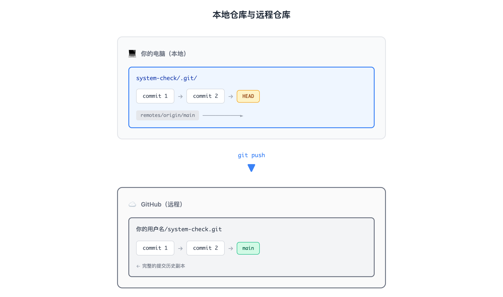

# 02 · 远程仓库：连接世界

> **目标**：将本地仓库推送到 GitHub，掌握远程同步操作  
> **前置**：已完成 [01 · 第一个提交](../01-first-commit/)  
> **时间**：35 分钟  
> **费用**：Free（GitHub 免费账户）

---

## 将学到的内容

1. 理解远程仓库的概念（只是另一个 Git 仓库）
2. 配置 SSH 密钥认证（推荐）或 HTTPS 认证
3. 将本地仓库推送到 GitHub
4. 克隆远程仓库（包括 sparse checkout 大仓库）
5. 理解 push、pull、fetch 的区别

---

## Step 1 — 先跑起来：推送到 GitHub（8 分钟）

> 先体验远程同步，再理解原理。

### 1.1 准备工作

确保你有：

- [x] GitHub 账户（没有？[注册](https://github.com/signup)）
- [x] Lesson 01 创建的 `system-check` 仓库

进入 Lesson 01 的项目目录：

```bash
cd ~/system-check
git status
```

```
On branch main
nothing to commit, working tree clean
```

### 1.2 在 GitHub 创建远程仓库

1. 打开 [github.com/new](https://github.com/new)
2. Repository name: `system-check`
3. **不要**勾选 "Add a README file"（我们已有本地仓库）
4. **不要**选择 .gitignore 或 license（同上）
5. 点击 **Create repository**

GitHub 会显示一个空仓库页面，里面有"push an existing repository"的指引。

### 1.3 连接本地与远程

先配置 SSH 密钥（如果还没有），然后添加远程仓库：

> **还没有 SSH 密钥？** 请先跳到 [Step 3 — 配置 SSH 认证](#step-3--配置-ssh-认证)，完成后再回到这里。

```bash
# 添加远程仓库（使用 SSH 地址）
git remote add origin git@github.com:你的用户名/system-check.git

# 验证远程配置
git remote -v
```

```
origin  git@github.com:你的用户名/system-check.git (fetch)
origin  git@github.com:你的用户名/system-check.git (push)
```

### 1.4 推送！

```bash
git push -u origin main
```

```
Enumerating objects: 9, done.
Counting objects: 100% (9/9), done.
Delta compression using up to 4 threads
Compressing objects: 100% (6/6), done.
Writing objects: 100% (9/9), 892 bytes | 892.00 KiB/s, done.
Total 9 (delta 1), reused 0 (delta 0)
To github.com:你的用户名/system-check.git
 * [new branch]      main -> main
Branch 'main' set up to track remote branch 'main' from 'origin'.
```

刷新 GitHub 页面 - 你的代码已经在云端了！

> **`-u` 是什么？**  
> `-u` (或 `--set-upstream`) 设置上游跟踪关系。之后只需 `git push` 即可，无需指定 origin main。

---

## Step 2 — 发生了什么？（5 分钟）

### 2.1 远程仓库的本质



<details>
<summary>View ASCII source</summary>

```
┌─────────────────────────────────────────────────────────────────────┐
│                         你的电脑（本地）                              │
│                                                                     │
│  ┌─────────────────────────────────────┐                           │
│  │        system-check/.git/           │                           │
│  │                                     │                           │
│  │  ┌─────────┐  ┌─────────┐  ┌─────┐ │                           │
│  │  │commit 1 │──│commit 2 │──│HEAD │ │                           │
│  │  └─────────┘  └─────────┘  └─────┘ │                           │
│  │                                     │                           │
│  │  remotes/origin/main ─────────────►│──── git push ────┐        │
│  └─────────────────────────────────────┘                  │        │
└───────────────────────────────────────────────────────────│────────┘
                                                            │
                                                            ▼
┌─────────────────────────────────────────────────────────────────────┐
│                          GitHub（远程）                              │
│                                                                     │
│  ┌─────────────────────────────────────┐                           │
│  │     你的用户名/system-check.git     │                           │
│  │                                     │                           │
│  │  ┌─────────┐  ┌─────────┐  ┌─────┐ │                           │
│  │  │commit 1 │──│commit 2 │──│main │ │  ← 完整的提交历史副本      │
│  │  └─────────┘  └─────────┘  └─────┘ │                           │
│  └─────────────────────────────────────┘                           │
└─────────────────────────────────────────────────────────────────────┘
```

</details>

**核心理解**：

| 误解 | 真相 |
|------|------|
| "代码住在 GitHub" | 你有完整副本，GitHub 也有完整副本 |
| "push 同步文件" | push 复制**提交**，不是文件 |
| "GitHub 是特殊的" | GitHub 只是另一个 Git 仓库（碰巧有 web 界面） |

### 2.2 origin 是什么？

```bash
git remote -v
```

`origin` 是远程仓库的**别名**（可以叫任何名字，origin 是惯例）。

你可以有多个远程：

```bash
# 示例：同时推送到 GitHub 和 Gitee
git remote add github git@github.com:user/repo.git
git remote add gitee git@gitee.com:user/repo.git
```

---

## Step 3 — 配置 SSH 认证（必做）

> SSH 密钥是 Git 远程操作的标准认证方式。

### 3.1 检查现有密钥

```bash
ls -la ~/.ssh/
```

如果看到 `id_ed25519` 或 `id_rsa` 文件，你已有密钥：
- **使用现有密钥**：直接跳到 [3.3 添加到 GitHub](#33-添加到-github)
- **创建新密钥**：继续下一步（会覆盖旧密钥，需谨慎）

如果目录为空或不存在，继续创建新密钥。

### 3.2 生成新密钥（如果没有）

```bash
ssh-keygen -t ed25519 -C "your-email@example.com"
```

> **提示**：`-C` 后的邮箱只是标签，用于识别密钥。建议使用 GitHub 账号邮箱。

```
Generating public/private ed25519 key pair.
Enter file in which to save the key (/home/user/.ssh/id_ed25519): [回车]
Enter passphrase (empty for no passphrase): [设置密码或直接回车]
Enter same passphrase again: [再次输入]
```

> **为什么用 ed25519？**  
> 比 RSA 更短、更快、更安全。如果系统不支持，用 `ssh-keygen -t rsa -b 4096`。

### 3.3 添加到 GitHub

复制公钥：

```bash
cat ~/.ssh/id_ed25519.pub
```

```
ssh-ed25519 AAAAC3NzaC1lZDI1NTE5AAAAI... your-email@example.com
```

1. 打开 [GitHub SSH Settings](https://github.com/settings/keys)
2. 点击 **New SSH key**
3. Title: `My Laptop`（或任何描述）
4. Key: 粘贴刚才复制的公钥
5. 点击 **Add SSH key**

### 3.4 测试连接

```bash
ssh -T git@github.com
```

```
Hi 你的用户名! You've successfully authenticated, but GitHub does not provide shell access.
```

看到这个消息？SSH 配置成功！

> **SSH vs HTTPS**  
>
> | 方式 | 优点 | 缺点 |  
> |------|------|------|  
> | SSH | 免密码、自动化友好 | 需要配置密钥 |  
> | HTTPS | 简单、防火墙友好 | 每次需要输入 token |  
>
> **推荐 SSH**，尤其是将来做 CI/CD 自动化。

---

## Step 4 — 克隆仓库（5 分钟）

> 当你要获取别人的代码，或在新电脑上继续工作。

### 4.1 标准克隆

```bash
cd ~
git clone git@github.com:你的用户名/system-check.git system-check-clone
cd system-check-clone
```

```
Cloning into 'system-check-clone'...
remote: Enumerating objects: 9, done.
...
```

你现在有两个完全独立的仓库：

- `~/system-check` — 原始仓库
- `~/system-check-clone` — 克隆副本

### 4.2 浅克隆（只要最新）

对于只想运行代码、不需要历史的场景：

```bash
git clone --depth 1 git@github.com:用户名/大仓库.git
```

好处：下载量大幅减少，速度快。

### 4.3 Sparse Checkout（大仓库必备）

当你只需要大仓库的一小部分时：

```bash
# GitHub（海外用户）
git clone --filter=blob:none --sparse https://github.com/shiicho/cloud-atlas ~/cloud-atlas
cd ~/cloud-atlas
git sparse-checkout set devops/git

# Gitee（中国大陆用户）
git clone --filter=blob:none --sparse https://gitee.com/shiicho/cloud-atlas ~/cloud-atlas
cd ~/cloud-atlas
git sparse-checkout set devops/git
```

> **注意**：直接使用 `sparse-checkout set`，不要用 `sparse-checkout init`（已弃用，可能在未来版本移除）。

```
Cloning into '/home/user/cloud-atlas'...
...
Filtering content: 100% (xx/xx), done.
```

验证：

```bash
ls ~/cloud-atlas/
```

```
devops/
```

只有你需要的目录被下载了！

> **为什么用 sparse checkout？**  
>
> cloud-atlas 包含多个课程，全部克隆需要几百 MB。  
> sparse checkout 只下载你需要的课程，节省时间和空间。

---

## Step 5 — 同步操作：push / pull / fetch（8 分钟）

### 5.1 三个命令的区别


<details>
<summary>View ASCII source</summary>

```
┌──────────────────┐                    ┌──────────────────┐
│   本地仓库        │                    │   远程仓库        │
│                  │                    │   (origin)       │
│  ┌────────────┐  │    git push       │  ┌────────────┐  │
│  │   main     │──│───────────────────▶│  │   main     │  │
│  │ (commits)  │  │                    │  │ (commits)  │  │
│  └────────────┘  │                    │  └────────────┘  │
│                  │    git fetch       │                  │
│  ┌────────────┐  │◀───────────────────│                  │
│  │origin/main │  │  (只下载，不合并)   │                  │
│  └────────────┘  │                    │                  │
│        │         │    git pull        │                  │
│        ▼         │◀───────────────────│                  │
│     merge        │  (fetch + merge)   │                  │
│        │         │                    │                  │
│        ▼         │                    │                  │
│  ┌────────────┐  │                    │                  │
│  │   main     │  │                    │                  │
│  └────────────┘  │                    │                  │
└──────────────────┘                    └──────────────────┘
```

</details>

| 命令 | 作用 | 安全性 |
|------|------|--------|
| `git push` | 上传本地提交到远程 | 需要远程是最新的 |
| `git fetch` | 下载远程更新，**不合并** | 完全安全 |
| `git pull` | fetch + merge（下载并合并） | 可能产生冲突 |

### 5.2 实践：模拟协作场景

**在 GitHub 上直接修改**（模拟队友的提交）：

1. 打开你的 GitHub 仓库
2. 点击 `check.sh` 文件
3. 点击编辑按钮（铅笔图标）
4. 添加一行注释：`# Modified on GitHub`
5. 点击 **Commit changes**

**回到本地**：

```bash
cd ~/system-check
git status
```

```
On branch main
Your branch is up to date with 'origin/main'.
```

等等，明明 GitHub 有新提交？`git status` 为什么说是最新的？

因为 Git 只检查本地的 `origin/main` 记录，不会自动联网查询。

### 5.3 使用 fetch 预览

```bash
git fetch
```

```
remote: Enumerating objects: 5, done.
...
From github.com:你的用户名/system-check
   a1b2c3d..d4e5f6g  main       -> origin/main
```

现在查看差异：

```bash
git status
```

```
On branch main
Your branch is behind 'origin/main' by 1 commit, and can be fast-forwarded.
```

```bash
git log --oneline origin/main
```

可以看到远程的新提交。

### 5.4 使用 pull 合并

```bash
git pull
```

```
Updating a1b2c3d..d4e5f6g
Fast-forward
 check.sh | 1 +
 1 file changed, 1 insertion(+)
```

现在本地和远程同步了。

> **fetch vs pull 何时用？**  
>
> | 场景 | 推荐 |  
> |------|------|  
> | 想先看看远程有什么变化 | `git fetch` + `git log` |  
> | 确定要合并远程更新 | `git pull` |  
> | 自动化脚本中 | 先 `fetch` 判断，再决定是否 `pull` |

---

## Step 6 — 动手练习：完整流程（5 分钟）

完成以下练习，验证你掌握了远程操作：

### 6.1 本地修改 → push

```bash
cd ~/system-check

# 添加新功能（内存检查，与 Lesson 01 的磁盘检查不同）
cat >> check.sh << 'EOF'

# Memory check
echo ""
echo "=== Memory Usage ==="
free -h | head -2
EOF

# 提交
git add check.sh
git commit -m "feat: add memory usage check"

# 推送
git push
```

刷新 GitHub 页面，确认更改已上传。

### 6.2 在另一个目录 pull

```bash
cd ~/system-check-clone
git pull
cat check.sh  # 应该看到新添加的 memory usage 代码
```

两个仓库现在是同步的。

---

## 本课小结

| 命令 | 作用 | 要点 |
|------|------|------|
| `git remote add` | 添加远程仓库 | 起名叫 origin（惯例） |
| `git push` | 上传提交 | `-u` 设置上游跟踪 |
| `git clone` | 克隆仓库 | 获得完整历史 |
| `git fetch` | 下载更新 | 安全预览，不修改工作区 |
| `git pull` | 下载并合并 | = fetch + merge |

**核心理念**：

> **Push 复制提交，不是同步文件。远程只是另一个仓库。**

```
本地仓库 ←──git clone──→ 远程仓库
         ←──git fetch──
         ──git push───→
         ←──git pull───  (fetch + merge)
```

---

## 检查清单

完成本课后，确认你能够：

- [ ] 生成 SSH 密钥并添加到 GitHub
- [ ] 使用 `ssh -T git@github.com` 测试连接
- [ ] 使用 `git remote add` 连接本地和远程仓库
- [ ] 使用 `git push -u origin main` 首次推送
- [ ] 使用 `git clone` 克隆仓库
- [ ] 使用 sparse checkout 克隆大仓库的子目录
- [ ] 解释 fetch 和 pull 的区别

---

## 下一步

代码推送到远程了，但多人协作时如何隔离开发？

→ [03 · 分支：Git 的杀手锏](../03-branches/)

---

## 常见问题

**Q: Permission denied (publickey)**

```bash
# 检查 SSH agent 是否运行
eval "$(ssh-agent -s)"
ssh-add ~/.ssh/id_ed25519

# 重新测试
ssh -T git@github.com
```

**Q: push 被拒绝（non-fast-forward）**

```bash
# 远程有你没有的提交，先 pull
git pull --rebase
git push
```

> 这种情况在 [04 · 冲突解决](../04-conflicts/) 中详细讲解。

**Q: 想改用 HTTPS 怎么办？**

```bash
# 查看当前远程 URL
git remote -v

# 改为 HTTPS
git remote set-url origin https://github.com/你的用户名/system-check.git
```

使用 HTTPS 时，密码用 [Personal Access Token](https://github.com/settings/tokens)，不是 GitHub 登录密码。

---

## 职场小贴士

在日本 IT 现场（日本語：IT現場）：

- **GitHub Enterprise** 在大企业普及率高
- **GitLab** 也很常见，操作几乎相同
- **社内リポジトリ**（公司内部仓库）可能有特殊的 SSH 配置
- push 前确认分支和远程正确，**本番環境への誤 push** 是大忌

面试时可能被问到：

> **Q: git fetch と git pull の違いは？**  
>
> A: fetch はリモートの更新をダウンロードするだけ。pull は fetch + merge で、ローカルに反映する。安全に確認したい場合は fetch を使う。

---

## 延伸阅读

- [GitHub SSH 文档](https://docs.github.com/en/authentication/connecting-to-github-with-ssh)
- [Git 远程仓库](https://git-scm.com/book/zh/v2/Git-基础-远程仓库的使用)
- [Sparse Checkout 官方文档](https://git-scm.com/docs/git-sparse-checkout)

---

## 系列导航

← [01 · 第一个提交](../01-first-commit/) | [Home](../) | [03 · 分支 →](../03-branches/)
