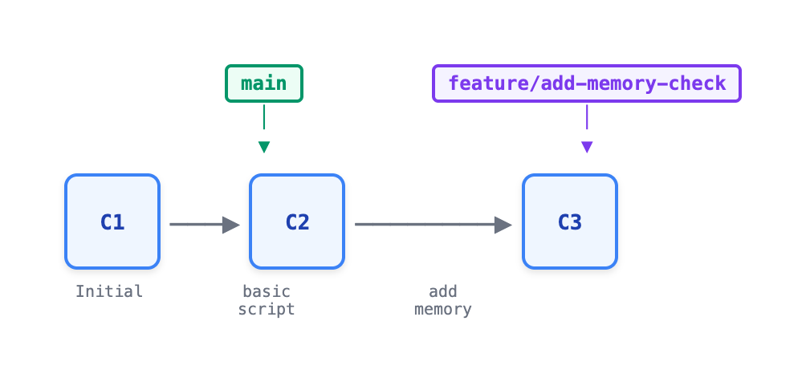

# 03 · 分支：Git 的杀手锏

> **目标**：掌握 Git 分支创建、切换、合并的完整工作流  
> **前置**：已完成 [02 · 远程仓库](../02-remote/)  
> **时间**：40 分钟  
> **费用**：无（本地操作）

---

## 将学到的内容

1. 理解为什么分支在 Git 中如此轻量（40 字节！）
2. 创建、切换、删除分支
3. 合并分支（Fast-forward vs 三方合并）
4. 理解 HEAD 指针的含义
5. 了解常见分支策略（Git Flow、GitHub Flow、Trunk-based）

---

## 为什么分支是"杀手锏"？

在学习命令之前，先理解为什么分支如此重要：

| 场景 | 没有分支 | 有分支 |
|------|----------|--------|
| 开发新功能 | 直接改主代码，出错影响所有人 | 在独立分支开发，安全隔离 |
| 紧急修复 | 混入正在开发的半成品 | 从稳定版本拉分支，快速修复 |
| 多人协作 | 互相覆盖，冲突不断 | 各自分支，合并时处理 |
| 实验想法 | 改坏了很难恢复 | 失败了直接删除分支 |

> **关键理念**：**分支是一次性的。大胆创建，及时删除。**

---

## Step 1 — 环境准备（2 分钟）

本课在本地进行，使用你之前的仓库或新建一个：

> **📁 路径说明**：本课提供两种选择。如果你想保持之前课程的进度，使用方式 1。如果想要干净的练习环境，使用方式 2。两种方式都可以完成本课所有练习。

```bash
# 方式 1：使用之前课程的仓库（推荐）
cd ~/system-check

# 方式 2：新建独立练习仓库
mkdir -p ~/git-branch-lab && cd ~/git-branch-lab
git init
echo "# Branch Lab" > README.md
git add README.md
git commit -m "Initial commit"
```

确认当前分支：

```bash
git branch
```

```
* main
```

星号 `*` 表示当前所在分支。

---

## Step 2 — 理解分支的本质（5 分钟）

### 2.1 分支 = 指针

Git 分支的秘密：**分支只是一个指向某个 commit 的指针**。

```bash
# 查看 main 分支指向的 commit
cat .git/refs/heads/main
```

```
a1b2c3d4e5f6...（40 字符的 SHA-1 哈希）
```

**这就是全部！** 一个分支只有 40 字节，所以：
- 创建分支：写 40 字节 → **瞬间完成**
- 切换分支：读 40 字节，更新文件 → **几乎瞬间**

### 2.2 HEAD = 你在哪里

```bash
cat .git/HEAD
```

```
ref: refs/heads/main
```

HEAD 是一个特殊指针，指向**当前所在的分支**。


<details>
<summary>View ASCII source</summary>

```
                    HEAD
                      │
                      ▼
                    main
                      │
                      ▼
    ┌─────┐    ┌─────┐    ┌─────┐
    │ C1  │───▶│ C2  │───▶│ C3  │
    └─────┘    └─────┘    └─────┘
      ▲
      │
   提交链（每个 commit 指向它的父提交）
```

</details>

**记住**：
- **Branch** = 指向 commit 的指针（可移动）
- **HEAD** = 指向当前分支的指针（你在哪）
- **Commit** = 项目快照 + 父指针

---

## Step 3 — 分支基本操作（8 分钟）

### 3.1 创建分支

```bash
# 创建新分支（不切换）
git branch feature-memory

# 查看所有分支
git branch
```

```
  feature-memory
* main
```

分支创建了，但你还在 `main` 上（星号位置）。

### 3.2 切换分支

有两种方式（效果相同）：

```bash
# 传统方式
git checkout feature-memory

# 新方式（Git 2.23+，推荐）
git switch feature-memory
```

```
Switched to branch 'feature-memory'
```

验证：

```bash
git branch
```

```
* feature-memory
  main
```

### 3.3 创建并切换（一步完成）

```bash
# 传统方式
git checkout -b feature-disk

# 新方式（推荐）
git switch -c feature-disk
```

> **💡 推荐使用 `git switch`**：语义更清晰。`checkout` 功能太多，容易混淆。

### 3.4 删除分支

```bash
# 切换到其他分支（不能删除当前分支）
git switch main

# 删除已合并的分支（安全）
git branch -d feature-disk

# 强制删除（未合并也删除）
git branch -D feature-disk
```

**常用参数**：

| 命令 | 作用 |
|------|------|
| `git branch` | 列出本地分支 |
| `git branch -a` | 列出所有分支（含远程） |
| `git branch -v` | 显示每个分支的最新提交 |
| `git branch --merged` | 已合并到当前分支的分支 |
| `git branch --no-merged` | 未合并的分支 |

---

## Step 4 — 在分支上工作（10 分钟）

### 4.1 准备工作

确保你有一个可以修改的文件：

```bash
git switch main

# 如果没有 check.sh，创建一个
cat > check.sh << 'EOF'
#!/bin/bash
# System Check Script

echo "=== System Information ==="
echo "Hostname: $(hostname)"
echo "OS: $(uname -s)"
echo "Date: $(date)"
EOF

chmod +x check.sh
git add check.sh
git commit -m "feat: add basic system check script"
```

### 4.2 创建 feature 分支并开发

```bash
# 创建并切换到 feature 分支
git switch -c feature/add-memory-check

# 添加功能
cat >> check.sh << 'EOF'

echo ""
echo "=== Memory Information ==="
free -h 2>/dev/null || vm_stat 2>/dev/null || echo "Memory info not available"
EOF

# 提交更改
git add check.sh
git commit -m "feat: add memory check to system script"
```

### 4.3 查看分支分叉

```bash
git log --oneline --all --graph
```

```
* 8d7e6f5 (HEAD -> feature/add-memory-check) feat: add memory check to system script
* a1b2c3d (main) feat: add basic system check script
* 9f8e7d6 Initial commit
```



<details>
<summary>View ASCII source</summary>

```
      main                feature/add-memory-check
        │                          │
        ▼                          ▼
    ┌─────┐    ┌─────┐        ┌─────┐
    │ C1  │───▶│ C2  │───────▶│ C3  │
    └─────┘    └─────┘        └─────┘
    Initial    basic script   add memory
```

</details>

---

## Step 5 — 合并分支（10 分钟）

### 5.1 Fast-forward 合并

当目标分支（main）没有新提交时，Git 只需移动指针：

```bash
# 切换到 main
git switch main

# 合并 feature 分支
git merge feature/add-memory-check
```

```
Updating a1b2c3d..8d7e6f5
Fast-forward
 check.sh | 4 ++++
 1 file changed, 4 insertions(+)
```

**Fast-forward** 意味着：main 指针直接"快进"到 feature 分支的位置。

```bash
git log --oneline --all --graph
```

```
* 8d7e6f5 (HEAD -> main, feature/add-memory-check) feat: add memory check
* a1b2c3d feat: add basic system check script
* 9f8e7d6 Initial commit
```


<details>
<summary>View ASCII source</summary>

```
Before Fast-forward:

      main                feature
        │                    │
        ▼                    ▼
    ┌─────┐    ┌─────┐    ┌─────┐
    │ C1  │───▶│ C2  │───▶│ C3  │
    └─────┘    └─────┘    └─────┘


After Fast-forward:

                         main, feature
                              │
                              ▼
    ┌─────┐    ┌─────┐    ┌─────┐
    │ C1  │───▶│ C2  │───▶│ C3  │
    └─────┘    └─────┘    └─────┘
```

</details>

### 5.2 三方合并（3-way Merge）

当两边都有新提交时，需要创建一个**合并提交**（merge commit）：

```bash
# 在 main 上做一些修改
echo "# System Check Tool" > README.md
git add README.md
git commit -m "docs: add README"

# 创建另一个 feature 分支
git switch -c feature/add-disk-check

# 添加磁盘检查功能
cat >> check.sh << 'EOF'

echo ""
echo "=== Disk Information ==="
df -h 2>/dev/null || echo "Disk info not available"
EOF

git add check.sh
git commit -m "feat: add disk check to system script"

# 切换回 main
git switch main

# 合并（此时 main 有新的 README 提交）
git merge feature/add-disk-check
```

Git 会打开编辑器让你编写合并提交信息。保存退出即可。

```
Merge made by the 'ort' strategy.
 check.sh | 4 ++++
 1 file changed, 4 insertions(+)
```

```bash
git log --oneline --all --graph
```

```
*   e4f5g6h (HEAD -> main) Merge branch 'feature/add-disk-check'
|\
| * c3d4e5f (feature/add-disk-check) feat: add disk check
* | b2c3d4e docs: add README
|/
* 8d7e6f5 (feature/add-memory-check) feat: add memory check
* a1b2c3d feat: add basic system check script
* 9f8e7d6 Initial commit
```


<details>
<summary>View ASCII source</summary>

```
Before 3-way Merge:

                main              feature
                  │                  │
                  ▼                  ▼
              ┌─────┐            ┌─────┐
         ┌───▶│ C4  │            │ C5  │
         │    └─────┘            └─────┘
         │                           │
    ┌─────┐    ┌─────┐    ┌─────┐    │
    │ C1  │───▶│ C2  │───▶│ C3  │────┘
    └─────┘    └─────┘    └─────┘


After 3-way Merge:

                               main
                                 │
                                 ▼
              ┌─────┐        ┌─────┐
         ┌───▶│ C4  │───────▶│ M   │  ← Merge Commit
         │    └─────┘        └─────┘
         │                       ▲
    ┌─────┐    ┌─────┐    ┌─────┐│   ┌─────┐
    │ C1  │───▶│ C2  │───▶│ C3  │└───│ C5  │
    └─────┘    └─────┘    └─────┘    └─────┘
                                       ▲
                                       │
                                   feature
```

</details>

**为什么叫"三方"？** Git 比较三个版本：
1. **共同祖先**（C3）
2. **当前分支**（main/C4）
3. **合并分支**（feature/C5）

### 5.3 合并后清理

合并完成后，删除 feature 分支：

```bash
git branch -d feature/add-memory-check
git branch -d feature/add-disk-check
```

```
Deleted branch feature/add-memory-check (was 8d7e6f5).
Deleted branch feature/add-disk-check (was c3d4e5f).
```

**为什么要删除？**
- 分支已完成使命
- 减少分支列表噪音
- 分支很便宜，用完就删

---

## Step 6 — 分支策略简介（3 分钟）

不同团队使用不同的分支策略。这里简要介绍三种主流策略：

### Git Flow

```
main ─────────────────────────────────────────────▶
        │                              ▲
        └───▶ develop ───▶ feature/* ──┘
                │
                └───▶ release/* ───▶ hotfix/*
```

- **分支**：main, develop, feature/*, release/*, hotfix/*
- **适用**：有明确发布周期的项目（每月发版）
- **日本企业**：较常见，符合承认流程文化

### GitHub Flow

```
main ─────────────────────────────────────────────▶
   │         │         │
   └──▶ PR ──┘   └──▶ PR ──┘
    feature/a     feature/b
```

- **分支**：main + 短期 feature 分支
- **适用**：持续部署，快速迭代
- **特点**：简单直接，PR 驱动

### Trunk-based Development

```
main ─────────────────────────────────────────────▶
   │ │ │ │ │ │ │ │
   └─┴─┴─┴─┴─┴─┴─┘
   (very short-lived branches)
```

- **分支**：主要在 main，极短期分支（< 1 天）
- **适用**：高频发布，强 CI/CD
- **要求**：强大的自动化测试

### 如何选择？

| 因素 | Git Flow | GitHub Flow | Trunk-based |
|------|----------|-------------|-------------|
| 发布频率 | 低（周/月） | 中（天/周） | 高（天/多次） |
| 团队规模 | 大 | 中小 | 任意 |
| 测试覆盖 | 一般 | 较高 | 必须高 |
| 复杂度 | 高 | 低 | 中 |

> **建议**：初学者先掌握 GitHub Flow，简单有效。

---

## 动手练习：Feature 分支工作流（Mini-project）

完成以下任务来巩固所学：

### 任务清单

```bash
# 1. 确认在 main 分支
git switch main

# 2. 创建 feature/add-network-check 分支
git switch -c feature/add-network-check

# 3. 添加网络检查功能
cat >> check.sh << 'EOF'

echo ""
echo "=== Network Information ==="
ip addr 2>/dev/null || ifconfig 2>/dev/null || echo "Network info not available"
EOF

# 4. 提交更改
git add check.sh
git commit -m "feat: add network check to system script"

# 5. 切换回 main，合并分支
git switch main
git merge feature/add-network-check

# 6. 删除已合并的 feature 分支
git branch -d feature/add-network-check

# 7. 查看合并历史
git log --oneline --graph
```

### 验收标准

- [ ] 成功创建并切换到 feature 分支
- [ ] 在 feature 分支上完成提交
- [ ] 成功合并回 main
- [ ] 已删除 feature 分支
- [ ] `git log --oneline --graph` 显示正确的历史

---

## 本课小结

| 命令 | 作用 | 备注 |
|------|------|------|
| `git branch` | 列出分支 | `-a` 显示所有 |
| `git branch <name>` | 创建分支 | 不切换 |
| `git switch <name>` | 切换分支 | 推荐使用 |
| `git switch -c <name>` | 创建并切换 | 一步完成 |
| `git merge <branch>` | 合并分支 | 在目标分支执行 |
| `git branch -d <name>` | 删除已合并分支 | 安全删除 |
| `git branch -D <name>` | 强制删除分支 | 未合并也删除 |

**核心理念**：

**Git 分支的本质**

| 概念 | 含义 |
|------|------|
| **Branch** | 40 字节指针 → 创建/删除几乎零成本 |
| **HEAD** | "你在这里" 指针 → 总是指向当前分支 |
| **Fast-forward** | 直接移动指针 → 线性历史 |
| **3-way Merge** | 创建合并提交 → 保留分支历史 |

> **关键理念**：分支是一次性的。大胆创建，及时删除。

---

## 下一步

分支合并时，如果两边修改了同一行代码怎么办？

--> [04 · 冲突解决与历史探索](../04-conflicts/)

---

## 面试准备

**Q: Git のブランチは何ですか？なぜ軽量？**

A: ブランチはコミットへのポインタ（40バイトのSHA-1）。作成・削除が瞬時に完了する。SVN と違い、ファイルコピーではない。

**Q: Fast-forward と 3-way merge の違いは？**

A: Fast-forward はポインタ移動のみ（マージコミットなし）。3-way merge は両方の変更を統合してマージコミットを作成。

**Q: ブランチ戦略の経験は？**

A: [あなたの経験に基づいて回答]
- Git Flow: 明確なリリースサイクルがある場合
- GitHub Flow: 継続的デプロイ、シンプル
- Trunk-based: 高頻度リリース、強い CI/CD

**Q: なぜ feature ブランチを使う？**

A: 開発を隔離し、main を安定させる。失敗しても簡単にやり直せる。コードレビューの単位になる。

---

## 职场小贴士

### 日本 IT 现场的分支实践

在日本的 IT 现场（特に SIer や大手企业），分支策略往往与**承認フロー**紧密结合：

```
開発者 ──▶ feature branch ──▶ PR ──▶ レビュー ──▶ 承認 ──▶ merge
```

这与日本企业重视**稟議**（りんぎ）的文化高度契合：
- **PR = 変更申請**：记录变更内容和理由
- **Review = レビュー承認**：技术检查
- **Merge = 本番反映**：正式生效

> **小贴士**：在日本团队，建议使用**英语分支名**（`feature/add-auth`），但 PR 描述可以用日语写，方便非技术人员理解。

---

## トラブルシューティング

**问题：`git switch` 命令不存在**

```bash
git --version
# Git 2.23 以下版本没有 switch 命令
# 解决：使用 git checkout，或升级 Git
```

**问题：删除分支时提示"未合并"**

```bash
error: The branch 'feature-x' is not fully merged.
```

这是 Git 的保护机制。确认分支确实不需要后：

```bash
git branch -D feature-x  # 强制删除
```

**问题：不小心在错误分支上提交了**

```bash
# 方法1：如果还没 push
git switch correct-branch
git cherry-pick <commit-hash>  # 把提交复制过来
git switch wrong-branch
git reset --hard HEAD~1        # 删除错误提交

# 方法2：创建新分支保存
git branch save-my-work
git switch main
```

---

## 延伸阅读

- [Git Branching - Basic Branching and Merging](https://git-scm.com/book/en/v2/Git-Branching-Basic-Branching-and-Merging) - 官方文档
- [Understanding Git Flow](https://nvie.com/posts/a-successful-git-branching-model/) - Git Flow 原始文章
- [GitHub Flow](https://docs.github.com/en/get-started/quickstart/github-flow) - GitHub 官方指南

---

## 系列导航

← [02 · 远程仓库](../02-remote/) | [Home](../) | [04 · 冲突解决 →](../04-conflicts/)
