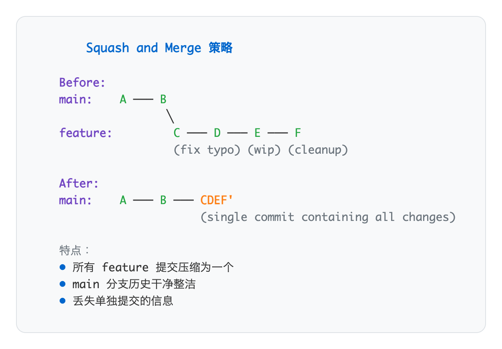
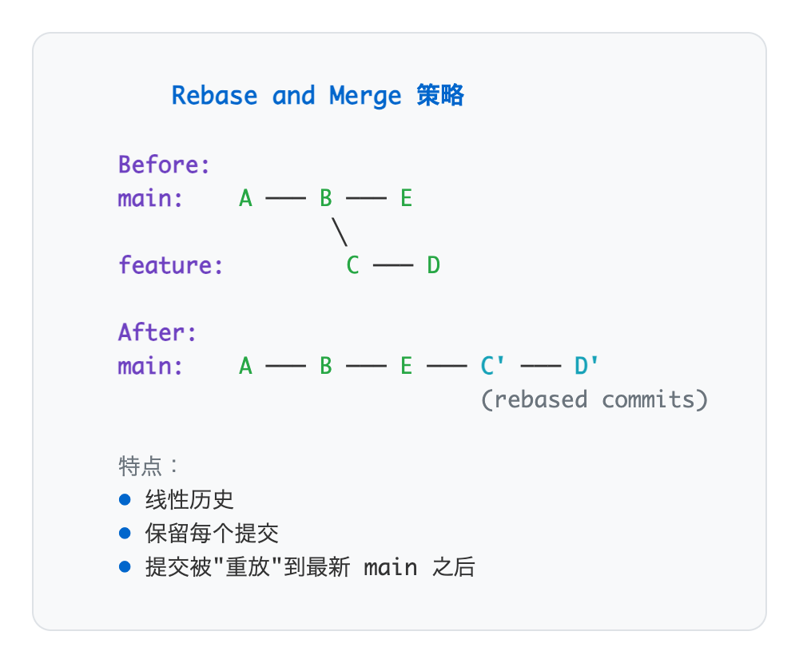

# 05 - Pull Request 协作流程

> **目标**：掌握 Pull Request 工作流，完成一次完整的 PR 协作循环  
> **前置**：已完成 [04 - 冲突解决](../04-conflicts/)  
> **时间**：50 分钟  
> **费用**：Free（GitHub 免费账户）

---

## 将学到的内容

1. 理解 Pull Request 的价值和工作流
2. 创建高质量的 Pull Request
3. 作为审查者和作者进行有效的代码审查
4. 配置 Protected Branches 保护主分支
5. 掌握三种合并策略：Merge Commit、Squash、Rebase

---

## 核心理念

> **PR 是对话，不是考试。目标是共同提升代码质量。**

Pull Request 不是为了"通过审核"，而是团队成员之间的协作对话。好的 PR 让每个人都能学到东西——作者从反馈中成长，审查者通过理解代码加深知识。

---

## Step 1 - 先跑起来：创建你的第一个 PR（10 分钟）

> 先体验完整流程，再理解原理。

### 1.1 准备工作

确保你有：
- GitHub 账户
- 本地 Git 已配置（`git config --global user.name` 和 `user.email`）
- 上一课创建的练习仓库（或任意你有权限的仓库）

### 1.2 创建 Feature 分支

```bash
# 进入你的练习仓库（lesson 02 推送到 GitHub 的那个）
cd ~/system-check

# 如果目录不存在，参考 lesson 01-02 创建，或快速初始化：
# mkdir ~/system-check && cd ~/system-check && git init

# 确保在最新的 main 分支
git checkout main
git pull origin main

# 创建并切换到新分支
git checkout -b feature/add-readme-badge
```

### 1.3 做一个小改动

首先确保有 `README.md` 文件：

```bash
# 如果还没有 README.md，先创建一个
[ ! -f README.md ] && echo '# System Check' > README.md
```

编辑 `README.md`，添加一个徽章：

```bash
# 在 README.md 顶部添加一行
echo '' | cat - README.md > temp && mv temp README.md
```

或手动编辑，在文件顶部添加：

```markdown

```

### 1.4 提交并推送

```bash
git add README.md
git commit -m "docs: add status badge to README"
git push -u origin feature/add-readme-badge
```

### 1.5 在 GitHub 创建 PR

推送后，终端会显示创建 PR 的链接：

```
remote: Create a pull request for 'feature/add-readme-badge' on GitHub by visiting:
remote:      https://github.com/your-name/system-check/pull/new/feature/add-readme-badge
```

点击链接，或在 GitHub 仓库页面点击 **"Compare & pull request"** 按钮。

填写 PR 信息：

**Title**: `docs: add status badge to README`

**Description**:
```markdown
## Summary
Add a status badge to README for visual indication of project status.

## Changes
- Added learning status badge at the top of README.md

## Testing
- Verified badge renders correctly on GitHub

## Checklist
- [x] Changes are minimal and focused
- [x] README renders correctly
```

点击 **"Create pull request"**。

**恭喜！你创建了第一个 Pull Request！**

---

## Step 2 - 发生了什么？（5 分钟）

### 2.1 什么是 Pull Request？

Pull Request（PR）是一种**请求将你的代码合并到目标分支**的机制。


<details>
<summary>View ASCII source</summary>

<!-- DIAGRAM: pr-concept -->
```
                     Pull Request 概念图

    ┌─────────────────────────────────────────────────────────┐
    │                    GitHub Repository                     │
    │                                                         │
    │   main ──○──○──○──○─────────────────○ (合并后)          │
    │                   ╲                 ╱                   │
    │                    ╲    PR #1      ╱                    │
    │   feature ──────────○──○──○──────○                      │
    │                     ↑        ↑                          │
    │                 开发提交   审查修改                       │
    │                                                         │
    │   ┌─────────────────────────────────────────────────┐   │
    │   │  PR 是一个对话平台：                              │   │
    │   │  • 代码差异展示                                   │   │
    │   │  • 讨论和评论                                     │   │
    │   │  • CI/CD 自动检查                                │   │
    │   │  • 审批流程                                       │   │
    │   └─────────────────────────────────────────────────┘   │
    └─────────────────────────────────────────────────────────┘
```
<!-- /DIAGRAM -->

</details>

> **GitLab 术语**：GitLab 中称为 Merge Request（MR），概念完全相同。

### 2.2 PR 的价值

| 价值 | 说明 |
|------|------|
| **代码审查** | 在合并前让其他人检查代码 |
| **知识共享** | 团队成员了解代码库的变化 |
| **质量门禁** | CI/CD 自动运行测试和检查 |
| **历史记录** | 保留决策过程和讨论 |
| **协作平台** | 异步讨论，不需要同时在线 |

### 2.3 PR 工作流全貌


<details>
<summary>View ASCII source</summary>

<!-- DIAGRAM: pr-workflow -->
```
              完整的 Pull Request 工作流

   开发者                    GitHub                    团队
      │                        │                        │
    1 │── 从 main 创建分支 ────▶│                        │
    2 │── 开发并提交 ──────────▶│                        │
    3 │── 推送到远程 ──────────▶│                        │
    4 │── 创建 PR ─────────────▶│                        │
      │                        │──5 通知审查者 ─────────▶│
      │                        │                      6 │ 代码审查
      │                        │◀──── 7 评论/建议 ───────│
    8 │◀─ 收到反馈 ─────────────│                        │
    9 │── 修改代码 ────────────▶│                        │
      │                        │─────10 更新通知 ───────▶│
      │                        │                     11 │ 批准 (Approve)
      │                        │◀─────12 合并 ───────────│
   13 │── 删除分支 ────────────▶│                        │
      │                        │                        │
```
<!-- /DIAGRAM -->

</details>

---

## Step 3 - 创建高质量的 PR（10 分钟）

### 3.1 好的 PR 长什么样？

**黄金法则**：
1. **小而专注** - 一个 PR 解决一个问题
2. **标题清晰** - 一眼看出做了什么
3. **描述充分** - 解释为什么这样做
4. **包含测试说明** - 如何验证更改

### 3.2 PR 模板

在仓库中创建 `.github/pull_request_template.md`：

```bash
mkdir -p .github
cat > .github/pull_request_template.md << 'EOF'
## Summary
<!-- Brief description of what this PR does -->

## Changes
<!-- List the key changes -->
-

## Why
<!-- Explain why these changes are needed -->

## Testing
<!-- How to test these changes -->
- [ ] Tested locally
- [ ] Added/updated tests

## Checklist
- [ ] Code follows project style guidelines
- [ ] Self-review completed
- [ ] Documentation updated (if needed)
- [ ] No sensitive information committed

## Related Issues
<!-- Link to related issues: Fixes #123, Relates to #456 -->
EOF
```

### 3.3 Commit 规范（Conventional Commits）

好的提交信息让 PR 更容易审查：

| 类型 | 用途 | 示例 |
|------|------|------|
| `feat:` | 新功能 | `feat: add user authentication` |
| `fix:` | 修复 Bug | `fix: resolve memory leak in parser` |
| `docs:` | 文档更新 | `docs: update API documentation` |
| `refactor:` | 重构（不改变行为） | `refactor: extract validation logic` |
| `test:` | 测试相关 | `test: add unit tests for login` |
| `chore:` | 维护任务 | `chore: update dependencies` |

**完整格式**：

```
<type>(<scope>): <subject>

<body>

<footer>
```

**示例**：

```
feat(auth): add password reset functionality

Users can now request a password reset email.
The reset link expires after 24 hours.

Closes #234
```

### 3.4 PR 大小指南

| 大小 | 代码行数 | 审查时间 | 建议 |
|------|----------|----------|------|
| **XS** | < 50 行 | 5 分钟 | 理想大小 |
| **S** | 50-200 行 | 15 分钟 | 推荐 |
| **M** | 200-500 行 | 30 分钟 | 可接受 |
| **L** | 500-1000 行 | 1+ 小时 | 考虑拆分 |
| **XL** | > 1000 行 | 很难审查 | 必须拆分 |

> **经验法则**：如果你要写很长的 PR 描述来解释所有变更，说明 PR 太大了。

---

## Step 4 - 代码审查（10 分钟）

代码审查是 PR 的核心。无论是审查者还是作者，都需要掌握正确的方法。

### 4.1 作为审查者（Reviewer）

**审查流程**：

1. **理解上下文** - 先读 PR 描述，理解目的
2. **全局浏览** - 看文件列表，了解变更范围
3. **逐文件审查** - 检查每个文件的改动
4. **运行代码**（可选） - 本地检出分支测试

**关注点**：

| 类别 | 检查项 |
|------|--------|
| **逻辑** | 代码是否正确实现了目标？ |
| **设计** | 架构是否合理？是否有更好的方式？ |
| **可读性** | 代码是否易于理解？命名是否清晰？ |
| **边界情况** | 是否处理了错误情况？ |
| **安全** | 是否有安全隐患？（SQL注入、硬编码密钥等） |
| **测试** | 是否有足够的测试覆盖？ |

**评论类型**：

```markdown
# 必须修改（Blocker）
🔴 **必须修改**：这里有 SQL 注入风险，需要使用参数化查询。

# 建议修改（Suggestion）
💡 **建议**：可以考虑用 `map()` 替代 `for` 循环，代码会更简洁。

# 提问（Question）
❓ **问题**：这个函数为什么要返回 null 而不是抛出异常？

# 赞美（Praise）
👍 **很棒**：这个重构让代码清晰多了！
```

### 4.2 作为作者（Author）

**提交 PR 后**：

1. **自我审查** - 在请求他人审查前，自己先过一遍
2. **添加上下文** - 在复杂的代码处添加注释说明
3. **及时响应** - 收到反馈后尽快回复
4. **感谢审查者** - 审查需要时间和精力

**处理反馈**：

| 情况 | 正确做法 |
|------|----------|
| 同意修改 | 修改代码，回复"已修改" |
| 需要讨论 | 解释你的考虑，寻求共识 |
| 不同意 | 礼貌说明理由，可以请第三方意见 |

**示例回复**：

```markdown
# 同意并修改
> 建议用 map() 替代 for 循环

Good point! 已修改，确实更简洁了。

# 解释决策
> 为什么不用 async/await？

这里用的是同步 API（文件系统操作），async/await 不会带来好处，
反而增加复杂度。如果后续需要异步操作，我们再重构。
```

### 4.3 审查礼仪

**Do's（推荐）**：
- 对事不对人：批评代码，不批评人
- 提问而非指责："这样做是否考虑过..." 而不是 "你为什么不..."
- 承认自己可能有误："我可能理解错了，但是..."
- 及时给予正面反馈

**Don'ts（避免）**：
- 不要用全大写或感叹号
- 不要讽刺或贬低
- 不要在公开场合批评个人
- 不要拖延审查

---

## Step 5 - Protected Branches（5 分钟）

### 5.1 为什么需要保护分支？

在团队协作中，直接 push 到 main 分支可能导致：
- 未经审查的代码进入生产环境
- 破坏性变更影响所有人
- 审计追溯困难

### 5.2 配置 Branch Protection Rules

在 GitHub 仓库中：

**Settings** -> **Branches** -> **Add branch protection rule**

常用配置：

| 选项 | 说明 | 推荐 |
|------|------|------|
| **Require a pull request before merging** | 禁止直接 push，必须通过 PR | 必选 |
| **Require approvals** | 需要指定数量的审批 | 推荐 1-2 |
| **Dismiss stale approvals** | 代码变更后需要重新审批 | 推荐 |
| **Require status checks to pass** | CI 必须通过才能合并 | 强烈推荐 |
| **Require conversation resolution** | 所有讨论必须解决 | 可选 |
| **Include administrators** | 管理员也受规则约束 | 推荐 |

### 5.3 配置示例

为 `main` 分支启用保护：


<details>
<summary>View ASCII source</summary>

<!-- DIAGRAM: branch-protection -->
```
           Protected Branch 配置示意

  ┌──────────────────────────────────────────────────┐
  │  Branch protection rule: main                     │
  ├──────────────────────────────────────────────────┤
  │                                                  │
  │  ✅ Require a pull request before merging        │
  │     └── ✅ Require approvals: 1                  │
  │     └── ✅ Dismiss stale pull request approvals  │
  │                                                  │
  │  ✅ Require status checks to pass                │
  │     └── ✅ ci/test                               │
  │     └── ✅ ci/lint                               │
  │                                                  │
  │  ✅ Require conversation resolution              │
  │                                                  │
  │  ✅ Include administrators                       │
  │                                                  │
  └──────────────────────────────────────────────────┘

  效果：
  ┌────────┐    ┌────────┐    ┌────────┐    ┌────────┐
  │  Push  │ ─▶ │   PR   │ ─▶ │ Review │ ─▶ │ Merge  │
  │(blocked)│    │Created │    │+ CI ✓  │    │  ✓     │
  └────────┘    └────────┘    └────────┘    └────────┘
```
<!-- /DIAGRAM -->

</details>

### 5.4 Repository Rulesets（现代方案）

> **2023 年起**，GitHub 推出了 **Repository Rulesets** 作为 Protected Branches 的现代替代方案。

**Rulesets vs Protected Branches：**

| 特性 | Protected Branches | Rulesets |
|------|-------------------|----------|
| 多规则叠加 | ❌ 一个分支一条规则 | ✅ 多条规则可叠加 |
| 组织级策略 | ❌ 仅仓库级 | ✅ 可跨仓库强制执行 |
| 可见性 | 仅管理员 | 任何有读权限的人 |
| 测试模式 | ❌ | ✅ Evaluate 模式先测试 |
| 提交信息规范 | ❌ | ✅ 可强制 Conventional Commits |

**配置路径：**

```
Settings -> Rules -> Rulesets -> New ruleset
```

**推荐使用场景：**
- 新项目：直接使用 Rulesets
- 现有项目：Protected Branches 仍然有效，无需迁移
- 组织级管理：使用 Rulesets（需 Enterprise）

> **参考**：[GitHub Rulesets 文档](https://docs.github.com/en/repositories/configuring-branches-and-merges-in-your-repository/managing-rulesets/about-rulesets)

---

## Step 6 - 合并策略（5 分钟）

当 PR 准备合并时，GitHub 提供三种合并方式。

### 6.1 Merge Commit（合并提交）

```
git merge --no-ff feature
```


<details>
<summary>View ASCII source</summary>

<!-- DIAGRAM: merge-commit -->
```
      Merge Commit 策略

  main:    A ─── B ─────────── M (merge commit)
                  ╲           ╱
  feature:         C ─── D ──╯

  特点：
  • 保留完整历史
  • 创建专门的合并提交
  • 可以看出哪些提交来自哪个分支
```
<!-- /DIAGRAM -->

</details>

| 优点 | 缺点 |
|------|------|
| 保留完整历史 | 历史可能变得复杂 |
| 可追溯每个提交 | 合并提交增加噪音 |
| 适合审计要求高的场景 | |

### 6.2 Squash and Merge（压缩合并）

```
git merge --squash feature
```



<details>
<summary>View ASCII source</summary>

<!-- DIAGRAM: squash-merge -->
```
      Squash and Merge 策略

  Before:
  main:    A ─── B
                  ╲
  feature:         C ─── D ─── E ─── F
                   (fix typo) (wip) (cleanup)

  After:
  main:    A ─── B ─── CDEF'
                       (single commit containing all changes)

  特点：
  • 所有 feature 提交压缩为一个
  • main 分支历史干净整洁
  • 丢失单独提交的信息
```
<!-- /DIAGRAM -->

</details>

| 优点 | 缺点 |
|------|------|
| main 历史简洁 | 丢失详细提交历史 |
| 每个 PR = 一个提交 | 不适合大型 PR |
| 隐藏开发过程中的"乱"提交 | |

### 6.3 Rebase and Merge（变基合并）

```
git rebase main feature && git merge --ff-only feature
```



<details>
<summary>View ASCII source</summary>

<!-- DIAGRAM: rebase-merge -->
```
      Rebase and Merge 策略

  Before:
  main:    A ─── B ─── E
                  ╲
  feature:         C ─── D

  After:
  main:    A ─── B ─── E ─── C' ─── D'
                             (rebased commits)

  特点：
  • 线性历史
  • 保留每个提交
  • 提交被"重放"到最新 main 之后
```
<!-- /DIAGRAM -->

</details>

| 优点 | 缺点 |
|------|------|
| 线性历史，易于理解 | 改变了提交 SHA |
| 保留每个提交 | 不适合已共享的分支 |
| 适合追求整洁历史的团队 | |

### 6.4 如何选择？

| 场景 | 推荐策略 |
|------|----------|
| **日常开发** | Squash（大多数团队的选择） |
| **需要审计** | Merge Commit（保留完整历史） |
| **追求线性历史** | Rebase（需要团队共识） |
| **开源项目** | Squash 或 Merge（取决于项目风格） |

> **团队一致性**：选择一种策略并坚持使用，比选择"最好的"策略更重要。

---

## Mini-Project：完整 PR 循环（10 分钟）

现在，让我们完成一个完整的 PR 协作循环。

### 目标

1. 创建一个有意义的 PR
2. 使用 PR 模板
3. 自我审查
4. 合并并清理

### 步骤

#### 1. 创建新分支

```bash
cd ~/system-check
git checkout main
git pull origin main
git checkout -b feature/add-contribution-guide
```

#### 2. 添加贡献指南

创建 `CONTRIBUTING.md`：

```bash
cat > CONTRIBUTING.md << 'EOF'
# Contributing Guide

Thank you for considering contributing to this project!

## How to Contribute

1. Fork the repository
2. Create a feature branch (`git checkout -b feature/amazing-feature`)
3. Commit your changes (`git commit -m 'feat: add amazing feature'`)
4. Push to the branch (`git push origin feature/amazing-feature`)
5. Open a Pull Request

## Commit Message Guidelines

We follow [Conventional Commits](https://www.conventionalcommits.org/en/v1.0.0/):

- `feat:` - New features
- `fix:` - Bug fixes
- `docs:` - Documentation changes
- `refactor:` - Code refactoring
- `test:` - Adding tests

## Code Review Process

- All PRs require at least one approval
- CI checks must pass before merging
- Please respond to review comments promptly

## Questions?

Feel free to open an issue if you have questions!
EOF
```

#### 3. 提交并推送

```bash
git add CONTRIBUTING.md .github/
git commit -m "docs: add contributing guide and PR template"
git push -u origin feature/add-contribution-guide
```

#### 4. 创建 PR

在 GitHub 上创建 PR，使用你创建的模板填写内容。

**Title**: `docs: add contributing guide and PR template`

**Description**（使用模板）：

```markdown
## Summary
Add contribution guidelines and PR template to improve collaboration.

## Changes
- Added CONTRIBUTING.md with contribution guidelines
- Added PR template for consistent PR descriptions

## Why
As the project grows, having clear contribution guidelines helps
new contributors understand the process and maintain consistency.

## Testing
- [x] Verified markdown renders correctly on GitHub
- [x] Confirmed PR template appears when creating new PRs

## Checklist
- [x] Code follows project style guidelines
- [x] Self-review completed
- [x] Documentation updated (if needed)
- [x] No sensitive information committed
```

#### 5. 自我审查

在 PR 页面，点击 **"Files changed"** 标签页：

1. 检查每个文件的变更
2. 在需要注意的地方添加评论
3. 确认没有遗漏

#### 6. 合并 PR

作为仓库所有者，你可以自己合并：

1. 确认所有检查通过
2. 点击 **"Merge pull request"**
3. 选择合并策略（建议 Squash and merge）
4. 点击 **"Confirm merge"**

#### 7. 清理

```bash
# 删除远程分支（GitHub 可能已自动删除）
git push origin --delete feature/add-contribution-guide

# 更新本地
git checkout main
git pull origin main

# 删除本地分支
git branch -d feature/add-contribution-guide
```

### 验证成功

```bash
# 确认文件已在 main 分支
cat CONTRIBUTING.md

# 查看提交历史
git log --oneline -5
```

你应该看到一个干净的 squash 提交（如果选择了 Squash and merge）：

```
a1b2c3d (HEAD -> main, origin/main) docs: add contributing guide and PR template
...
```

---

## 职场小贴士

### 日本 IT 企业的 PR 文化

在日本企业，PR（或 MR）通常需要符合変更管理流程：

| 日本术语 | 英文 | 对应的 PR 要素 |
|----------|------|---------------|
| 変更依頼書 | Change Request | PR 描述 |
| 影響範囲 | Impact Scope | Files changed |
| 承認フロー | Approval Flow | Required reviewers |
| 変更履歴 | Change History | Git log |
| 動作確認 | Operation Check | Testing checklist |

### PR 审查的日语表达

| 场景 | 日语表达 |
|------|----------|
| 请求审查 | レビューお願いします |
| 指出问题 | ここは修正が必要かと思います |
| 提出建议 | こちらの方法も検討いただけますか |
| 批准 | LGTM (Looks Good To Me) / 問題ありません |
| 感谢审查 | レビューありがとうございます |

### 运维场景的 PR 实践

在基础设施运维中，PR 尤其重要：

```
# IaC 变更示例 PR

## Summary
Add CloudWatch alarm for high CPU usage.

## Changes
- Added CPU utilization alarm in monitoring.tf
- Threshold: 80% for 5 minutes
- SNS notification to ops-alerts

## Impact
- 監視対象: production-web-servers
- 予想されるアラート: 高負荷時に通知

## Rollback Plan
terraform destroy -target=aws_cloudwatch_metric_alarm.cpu_high

## Checklist
- [x] terraform plan shows expected changes
- [x] No breaking changes to existing resources
- [x] SNS topic exists and is configured
```

---

## 检查清单

完成本课后，确认你能够：

- [ ] 理解 PR 的概念和价值
- [ ] 创建带有清晰描述的 PR
- [ ] 使用 PR 模板
- [ ] 作为审查者提供有效反馈
- [ ] 作为作者响应审查意见
- [ ] 配置 Protected Branches 或 Rulesets
- [ ] 选择合适的合并策略
- [ ] 完成完整的 PR 循环（创建 -> 审查 -> 合并 -> 清理）

---

## 面试准备

**Q: Pull Request のメリットは？**

A: コードレビューによる品質向上、知識共有、CI/CD との連携による自動チェック、変更履歴の記録。チーム開発では必須のプラクティス。

**Q: コードレビューで心がけていることは？**

A: 目的を理解してからレビュー、建設的なフィードバック、必須と提案を区別、良い点も指摘。対人ではなくコードに対してコメント。

**Q: Squash merge と通常の merge の違いは？**

A: Squash は複数コミットを一つにまとめてマージ。main ブランチの履歴がきれいになる。通常の merge は全コミットを保持、完全な履歴が必要な場合に使用。

**Q: Protected Branch を設定する理由は？**

A: 本番ブランチへの直接 push を防止、必須レビューや CI チェックを強制、変更管理と監査要件への対応。

---

## トラブルシューティング

### PR がマージできない

**原因 1: ブランチの競合**

```bash
git checkout feature/my-feature
git fetch origin main
git merge origin/main
# 競合を解決
git push
```

**原因 2: CI チェック失敗**

→ ワークフローのログを確認し、エラーを修正

**原因 3: 承認不足**

→ 必要な承認者にレビューを依頼

### 間違えて main に push した

```bash
# まず落ち着く！
# Protected Branch なら拒否されているはず

# もし push されてしまった場合（チームに確認してから）
git push origin HEAD:refs/heads/fix-branch
# → fix-branch として PR を作成
```

### レビューコメントが見つからない

→ PR ページで "Files changed" → "Conversations" フィルターを確認

---

## 延伸阅读

- [GitHub - About Pull Requests](https://docs.github.com/en/pull-requests/collaborating-with-pull-requests/proposing-changes-to-your-work-with-pull-requests/about-pull-requests)
- [Google Engineering Practices - Code Review](https://google.github.io/eng-practices/review/)
- [Conventional Commits](https://www.conventionalcommits.org/en/v1.0.0/)
- [How to Write a Git Commit Message](https://cbea.ms/git-commit/)
- [06 - 日本 IT 应用指南](../06-japan-it/) - 下一课

---

## 系列导航

← [04 · 冲突解决](../04-conflicts/) | [Home](../) | [06 · 日本 IT 指南 →](../06-japan-it/)
