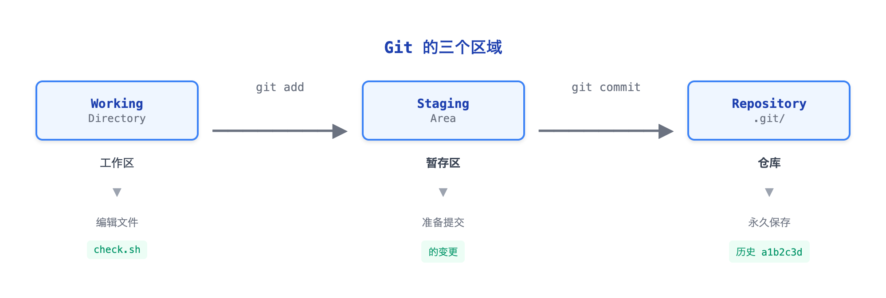

# 01 - 第一个提交：本地仓库

> **目标**：创建你的第一个 Git 仓库，体验 add/commit 工作流  
> **前置**：已阅读 [00 - 概念导入](../00-concepts/)  
> **时间**：25-30 分钟  
> **费用**：Free（本地操作）

---

## 将学到的内容

1. 配置 Git 用户信息（记录在每个提交中）
2. 初始化本地仓库并理解 `.git/` 目录
3. 掌握 `add` -> `commit` 工作流
4. 使用 `status` 和 `log` 检查状态
5. 创建 `.gitignore` 避免敏感文件入库

---

## Step 1 - 先跑起来：3 分钟创建第一个提交

> **目标**：先"尝到" Git 的味道，再理解原理。

### 1.1 检查 Git 安装

```bash
git --version
```

```
git version 2.x.x
```

> **版本说明**：显示 `2.x.x` 即可（如 2.40.0、2.52.0 等），本课程兼容 Git 2.28+。

> **没有安装 Git？**  
> - macOS: `brew install git`  
> - Linux: `sudo apt install git` 或 `sudo yum install git`  
> - Windows: 下载 [Git for Windows](https://git-scm.com/download/win)

### 1.2 配置用户信息（首次使用必做）

```bash
git config --global user.name "你的名字"
git config --global user.email "your@email.com"
git config --global init.defaultBranch main
```

> **Note:** `init.defaultBranch main` 确保新仓库使用 `main` 作为默认分支，与 GitHub/GitLab 保持一致。Git 3.0 将把 `main` 设为默认值。

验证配置：

```bash
git config --list | grep user
```

```
user.name=你的名字
user.email=your@email.com
```

### 1.3 创建项目目录

```bash
mkdir -p ~/system-check
cd ~/system-check
```

### 1.4 初始化仓库

```bash
git init
```

```
Initialized empty Git repository in /home/user/system-check/.git/
```

### 1.5 创建第一个文件

```bash
cat > check.sh << 'EOF'
#!/bin/bash
# 系统检查脚本 v1.0 - System health check script

echo "=== System Check ==="
echo "Hostname: $(hostname)"
echo "Date: $(date)"
echo "Uptime: $(uptime -p 2>/dev/null || uptime)"
EOF
chmod +x check.sh
```

### 1.6 第一个提交！

```bash
git add check.sh
git commit -m "feat: add system check script"
```

```
[main (root-commit) a1b2c3d] feat: add system check script
 1 file changed, 8 insertions(+)
 create mode 100755 check.sh
```

### 1.7 查看历史

```bash
git log --oneline
```

```
a1b2c3d (HEAD -> main) feat: add system check script
```

**恭喜！你创建了第一个 Git 提交！**

---

## Step 2 - 发生了什么？

现在你已经"尝到"了 Git，让我们理解刚才发生了什么。

### 2.1 三个区域



<details>
<summary>View ASCII source</summary>

```
                            Git 的三个区域

                   git add                  git commit
┌────────────────┐            ┌────────────────┐            ┌────────────────┐
│    Working     │            │    Staging     │            │   Repository   │
│   Directory    │ ────────▶  │     Area       │ ────────▶  │     .git/      │
└────────────────┘            └────────────────┘            └────────────────┘
     工作区                        暂存区                        仓库
        │                            │                            │
        ▼                            ▼                            ▼
    编辑文件                      准备提交                     永久保存
    check.sh                      的变更                    历史 a1b2c3d
```

</details>

**理解这三个区域**：

| 区域 | 英文名 | 作用 | 类比 |
|------|--------|------|------|
| 工作区 | Working Directory | 你编辑文件的地方 | 写作业的书桌 |
| 暂存区 | Staging Area | 准备提交的内容 | 装好的快递盒 |
| 仓库 | Repository | 永久保存的历史 | 寄出的快递 |

### 2.2 命令对应关系

```bash
# 编辑文件 → 工作区变化
vim check.sh

# add → 放入暂存区
git add check.sh

# commit → 保存到仓库
git commit -m "message"
```

### 2.3 .git 目录

```bash
ls -la .git/
```

```
total 32
drwxr-xr-x  8 user user 4096 Jan  2 10:00 .
drwxr-xr-x  3 user user 4096 Jan  2 10:00 ..
-rw-r--r--  1 user user   23 Jan  2 10:00 HEAD
drwxr-xr-x  2 user user 4096 Jan  2 10:00 branches
-rw-r--r--  1 user user   92 Jan  2 10:00 config
-rw-r--r--  1 user user   73 Jan  2 10:00 description
drwxr-xr-x  2 user user 4096 Jan  2 10:00 hooks
drwxr-xr-x  2 user user 4096 Jan  2 10:00 info
drwxr-xr-x  4 user user 4096 Jan  2 10:00 objects
drwxr-xr-x  4 user user 4096 Jan  2 10:00 refs
```

> **重要**：`.git/` 是仓库的大脑。删除它 = 删除所有历史！

---

## Step 3 - 动手练习：多次提交

> **目标**：创建有意义的提交历史，学会使用 `status` 检查状态。

### 3.1 添加更多功能

**添加磁盘检查**：

```bash
cat >> check.sh << 'EOF'

# Disk usage check
echo ""
echo "=== Disk Usage ==="
df -h / | tail -1
EOF
```

查看状态：

```bash
git status
```

```
On branch main
Changes not staged for commit:
  (use "git add <file>..." to update what will be committed)

        modified:   check.sh

no changes added to commit (use "git add" and/or "git commit -a")
```

> **解读**：Git 检测到 `check.sh` 被修改了，但还没有放入暂存区。

提交：

```bash
git add check.sh
git commit -m "feat: add disk usage check"
```

### 3.2 创建 .gitignore

**为什么需要 .gitignore？**

有些文件不应该提交到 Git：
- 日志文件（每次运行都不同）
- 敏感信息（密码、密钥）
- 编译产物（可以重新生成）

```bash
cat > .gitignore << 'EOF'
# 日志文件
*.log
output.txt

# 敏感信息 - NEVER commit these!
.env
*.pem
credentials.json

# OS 生成的文件
.DS_Store
Thumbs.db

# 编辑器临时文件
*.swp
*.swo
*~
.idea/
.vscode/
EOF
```

提交：

```bash
git add .gitignore
git commit -m "chore: add .gitignore for logs and secrets"
```

### 3.3 创建 .gitattributes

**为什么需要 .gitattributes？**

团队成员可能使用不同操作系统（Windows/macOS/Linux）。这个文件确保换行符统一，避免协作问题。

```bash
cat > .gitattributes << 'EOF'
# 自动处理换行符
* text=auto

# Shell 脚本强制使用 LF（Linux 格式）
*.sh text eol=lf
EOF
```

提交：

```bash
git add .gitattributes
git commit -m "chore: add .gitattributes for cross-platform compatibility"
```

> **简单理解**：`text=auto` 自动处理换行符，`eol=lf` 确保 Shell 脚本使用 Linux 格式（否则在服务器上可能无法运行）。

### 3.4 验证文件忽略生效

创建一个日志文件：

```bash
./check.sh > output.txt
ls -la
```

检查状态：

```bash
git status
```

```
On branch main
nothing to commit, working tree clean
```

> **观察**：`output.txt` 没有出现在状态中，因为它被 `.gitignore` 忽略了。

### 3.5 查看完整历史

```bash
git log --oneline
```

```
d4e5f6g (HEAD -> main) chore: add .gitattributes for cross-platform compatibility
c3d4e5f chore: add .gitignore for logs and secrets
b2c3d4e feat: add disk usage check
a1b2c3d feat: add system check script
```

**你现在有了 4 个有意义的提交！**

---

## Step 4 - 关键概念深入

### 4.1 Git 追踪的是内容，不是文件

这是理解 Git 的关键洞察：

```bash
# 创建空目录
mkdir empty-folder
git status
```

```
On branch main
nothing to commit, working tree clean
```

> **观察**：空目录没有出现！Git 追踪的是文件内容，不是目录结构。

**如果需要保留空目录**（常见于项目模板）：

```bash
touch empty-folder/.gitkeep
git add empty-folder/.gitkeep
git commit -m "chore: add placeholder for empty folder"
```

### 4.2 暂存区的价值

为什么要有暂存区？为什么不直接 commit？

**场景**：你修改了 3 个文件，但只想提交其中 2 个。

```bash
# 模拟修改多个文件
echo "# README" > README.md
echo "debug info" > debug.log

git status
```

```
On branch main
Untracked files:
        README.md
        debug.log
```

只添加 README.md：

```bash
git add README.md
git status
```

```
On branch main
Changes to be committed:
        new file:   README.md

Untracked files:
        debug.log
```

提交：

```bash
git commit -m "docs: add README"
```

> **暂存区让你精确控制每次提交的内容。**

### 4.3 提交信息规范

好的提交信息让历史更易读：

| 前缀 | 含义 | 例子 |
|------|------|------|
| `feat:` | 新功能 | `feat: add memory check` |
| `fix:` | 修复 bug | `fix: correct disk calculation` |
| `docs:` | 文档 | `docs: update README` |
| `chore:` | 杂项维护 | `chore: update .gitignore` |
| `refactor:` | 重构 | `refactor: simplify check logic` |

这叫做 **Conventional Commits** 格式，在团队协作中很常见。

---

## Step 5 - IaC 工程师的 .gitignore

作为基础设施工程师，你需要知道哪些文件绝对不能提交：

```bash
cat > ~/.gitignore_global << 'EOF'
# ===========================================
# IaC 项目通用 .gitignore
# ===========================================

# ----- Terraform -----
*.tfstate
*.tfstate.*
.terraform/
# 注意：.terraform.lock.hcl 应该提交（不要忽略）
# 它确保团队和 CI/CD 使用相同的 provider 版本
*.tfplan
*.tfvars          # 可能含敏感变量
crash.log

# ----- Ansible -----
*.retry

# ----- CloudFormation -----
packaged-*.yaml   # sam package 输出

# ----- Secrets (CRITICAL!) -----
.env
.env.*
*.pem
*.key
**/secrets/
credentials.json
service-account.json

# ----- Logs -----
*.log
logs/

# ----- OS -----
.DS_Store
Thumbs.db

# ----- Editors -----
.idea/
.vscode/
*.swp
*.swo
*~
EOF
```

设置为全局 gitignore：

```bash
git config --global core.excludesfile ~/.gitignore_global
```

> **警告**：`terraform.tfstate` 包含敏感信息（密码、密钥）。  
> 一旦提交到 Git，即使删除也会留在历史中！

---

## Step 6 - 常用命令速查

### 状态检查

```bash
git status              # 查看当前状态
git status -s           # 简短格式
git log --oneline       # 简洁历史
git log --oneline -5    # 最近 5 条
git log --graph         # 图形化（分支时有用）
```

### 添加与提交

```bash
git add <file>          # 添加指定文件
git add .               # 添加所有变更
git add -p              # 交互式添加（选择部分变更）
git commit -m "message" # 提交
git commit --amend      # 修改最后一次提交（谨慎使用！）
```

### 查看差异

```bash
git diff                # 工作区 vs 暂存区
git diff --staged       # 暂存区 vs 最新提交
git diff HEAD~1         # 最新提交 vs 上一个提交
```

---

## 本课小结

| 你学到了 | 命令 | 作用 |
|----------|------|------|
| 配置 | `git config` | 设置用户信息 |
| 初始化 | `git init` | 创建仓库 |
| 暂存 | `git add` | 选择要提交的内容 |
| 提交 | `git commit` | 保存到历史 |
| 状态 | `git status` | 检查当前状态 |
| 历史 | `git log` | 查看提交历史 |
| 忽略 | `.gitignore` | 排除不需要的文件 |

**核心理念**：


<details>
<summary>View ASCII source</summary>

```
  编辑文件           git add           git commit
     │                 │                  │
     ▼                 ▼                  ▼
┌─────────┐      ┌──────────┐      ┌────────────┐
│ Working │ ───▶ │ Staging  │ ───▶ │ Repository │
│Directory│      │   Area   │      │  (.git/)   │
└─────────┘      └──────────┘      └────────────┘
```

</details>

**关键洞察**：Git 追踪的是内容，不是文件。空目录不会被追踪。

---

## 检查清单

完成本课后，确认你能够：

- [ ] 使用 `git config` 设置用户名和邮箱
- [ ] 使用 `git init` 初始化新仓库
- [ ] 理解 `.git/` 目录的作用
- [ ] 使用 `git add` 和 `git commit` 创建提交
- [ ] 使用 `git status` 检查当前状态
- [ ] 使用 `git log` 查看历史
- [ ] 创建 `.gitignore` 排除敏感文件
- [ ] 有至少 3 个有意义的提交

---

## 职场小贴士

**日本 IT 现场**

在日本的开发现场，Git 提交记录经常被用于：

- **変更履歴**（变更历史）：追溯代码变更
- **レビュー**（Review）：代码审查的基础
- **障害調査**（故障调查）：定位问题引入时间

提交信息规范常见两种风格：

```bash
# 英文 Conventional Commits（推荐，自动化工具友好）
git commit -m "feat: add memory check function"

# 日语描述（部分团队使用）
git commit -m "メモリチェック機能を追加"
```

> **建议**：跟随团队规范。没有规范时，使用 Conventional Commits。

---

## 下一步

你的提交还只在本地电脑上。如果电脑坏了，一切都会丢失。

下一课我们学习如何将代码推送到远程仓库，实现：
- 备份
- 团队协作
- 在任何地方工作

-> [02 - 远程仓库：连接世界](../02-remote/)

---

## 延伸阅读

- [Pro Git Book - Getting Started](https://git-scm.com/book/en/v2/Getting-Started-About-Version-Control)
- [Conventional Commits](https://www.conventionalcommits.org/en/v1.0.0/)
- [GitHub .gitignore Templates](https://github.com/github/gitignore)

---

## 系列导航

← [00 · 概念导入](../00-concepts/) | [Home](../) | [02 · 远程仓库 →](../02-remote/)
