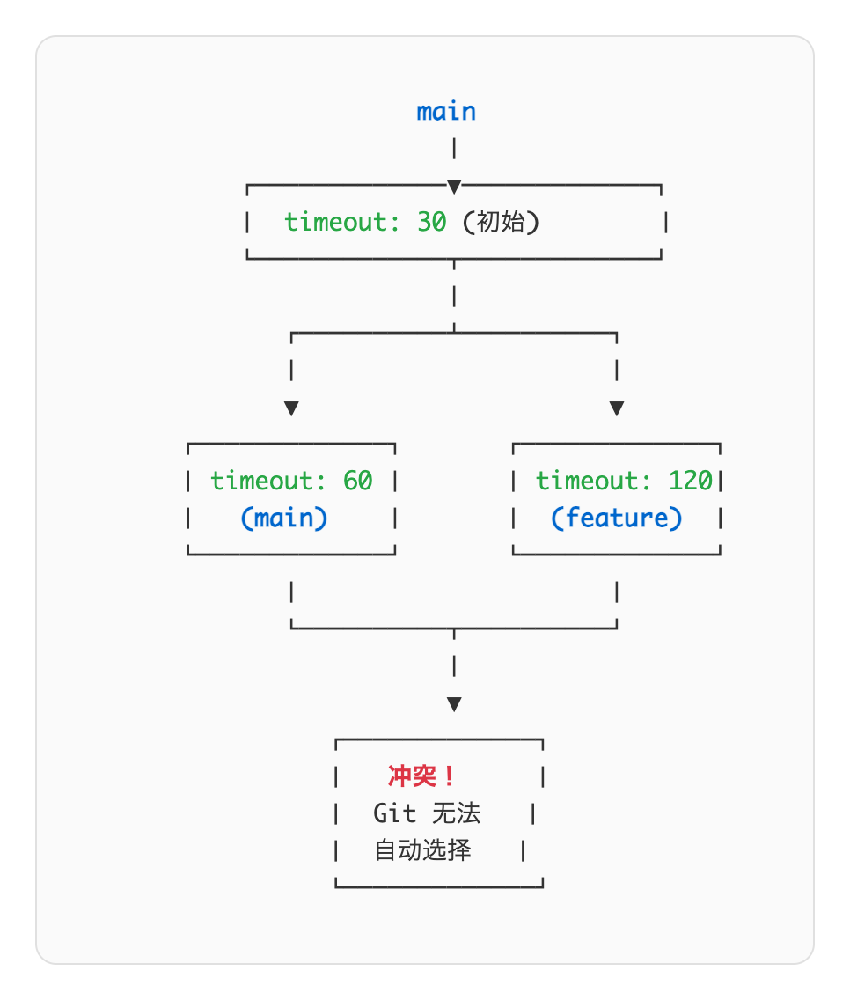

# 04 · 冲突解决与历史探索

> **目标**：学会解决合并冲突，掌握历史探索工具  
> **前置**：已完成 [03 · 分支](../03-branches/)  
> **时间**：40-45 分钟  
> **费用**：无（本地操作）

---

## 将学到的内容

1. 理解为什么会发生冲突
2. 识别和解决合并冲突（conflict markers）
3. 使用 `git diff` 查看差异
4. 使用 `git log --graph` 探索历史
5. 使用 `git blame` 追溯代码来源
6. 通过"失败实验室"消除对冲突的恐惧

---

## 核心理念

> **冲突不是 Git 的 bug，是 Git 在说"我需要你做决定"。**

当两个分支修改了同一文件的同一位置，Git 无法自动判断保留哪个版本。这不是错误，而是 Git 在请求人类介入。

冲突是正常的，每个开发者都会遇到。学会解决冲突，你就掌握了团队协作的关键技能。

---

## Step 1 — 环境准备（2 分钟）

确认 Git 配置：

```bash
git config user.name
git config user.email
```

> **📁 路径说明**：本课使用独立的 `~/git-practice/conflict-lab` 目录，而非之前的 `~/system-check`。这是有意设计的——冲突练习会创建大量实验性提交，使用独立目录可以保持你的主项目干净。课程结束后可以删除这个目录。

进入练习目录（或创建新目录）：

```bash
mkdir -p ~/git-practice/conflict-lab
cd ~/git-practice/conflict-lab
```

---

## Step 2 — 先跑起来：制造并解决冲突（10 分钟）

> 先"尝到"冲突的味道，再理解原理。

### 2.1 初始化项目

```bash
git init
```

创建一个配置文件：

```bash
cat > config.yaml << 'EOF'
# Server Configuration
server:
  host: localhost
  port: 8080
  timeout: 30

# Database
database:
  host: localhost
  port: 5432
EOF
```

提交：

```bash
git add config.yaml
git commit -m "feat: add initial config"
```

### 2.2 在 main 分支修改

```bash
# 修改 timeout 为 60
sed -i.bak 's/timeout: 30/timeout: 60/' config.yaml && rm -f config.yaml.bak
git add config.yaml
git commit -m "fix: increase timeout to 60s"
```

### 2.3 创建 feature 分支并修改同一行

```bash
# 回到初始状态创建分支
git checkout HEAD~1
git checkout -b feature/timeout-config
```

```bash
# 修改 timeout 为 120（不同的值！）
sed -i.bak 's/timeout: 30/timeout: 120/' config.yaml && rm -f config.yaml.bak
git add config.yaml
git commit -m "feat: set timeout to 120s for slow networks"
```

### 2.4 尝试合并 — 触发冲突！

```bash
git checkout main
git merge feature/timeout-config
```

**你会看到：**

```
Auto-merging config.yaml
CONFLICT (content): Merge conflict in config.yaml
Automatic merge failed; fix conflicts and then commit the result.
```

**恭喜！你成功制造了一个冲突！**

### 2.5 查看冲突状态

```bash
git status
```

```
On branch main
You have unmerged paths.
  (fix conflicts and run "git commit")
  (use "git merge --abort" to abort the merge)

Unmerged paths:
  (use "git add <file>..." to mark resolution)
        both modified:   config.yaml
```

### 2.6 查看冲突内容

```bash
cat config.yaml
```

```yaml
# Server Configuration
server:
  host: localhost
  port: 8080
<<<<<<< HEAD
  timeout: 60
=======
  timeout: 120
>>>>>>> feature/timeout-config

# Database
database:
  host: localhost
  port: 5432
```

### 2.7 理解冲突标记


<details>
<summary>View ASCII source</summary>

<!-- DIAGRAM: conflict-markers -->
```
┌─────────────────────────────────────────────────────────────┐
│  <<<<<<< HEAD                                               │
│  ─────────────────────────────────────────────────────────  │
│  这是你当前分支（main）的内容                                │
│                                                             │
│  =======                                                    │
│  ─────────────────────────────────────────────────────────  │
│  这是要合并进来的分支（feature/timeout-config）的内容        │
│                                                             │
│  >>>>>>> feature/timeout-config                             │
└─────────────────────────────────────────────────────────────┘
```
<!-- /DIAGRAM -->

</details>

| 标记 | 含义 |
|------|------|
| `<<<<<<< HEAD` | 当前分支内容开始 |
| `=======` | 分隔线 |
| `>>>>>>> branch-name` | 合并分支内容结束 |

### 2.8 解决冲突

打开 `config.yaml`，手动编辑：

```bash
vim config.yaml   # 或用你喜欢的编辑器
```

**删除所有冲突标记，保留你想要的内容：**

```yaml
# Server Configuration
server:
  host: localhost
  port: 8080
  timeout: 120

# Database
database:
  host: localhost
  port: 5432
```

> 解决冲突时，你可以：  
> - 保留 HEAD 的内容  
> - 保留合并分支的内容  
> - 两边都保留  
> - 写全新的内容

### 2.9 完成合并

```bash
# 标记冲突已解决
git add config.yaml

# 完成合并提交
git commit -m "merge: resolve timeout conflict, use 120s"
```

### 2.10 验证

```bash
git log --oneline --graph
```

```
*   abc1234 (HEAD -> main) merge: resolve timeout conflict, use 120s
|\
| * def5678 (feature/timeout-config) feat: set timeout to 120s for slow networks
* | ghi9012 fix: increase timeout to 60s
|/
* jkl3456 feat: add initial config
```

**你刚刚成功解决了第一个冲突！**

---

## Step 3 — 发生了什么？（5 分钟）

### 3.1 冲突产生的条件



<details>
<summary>View ASCII source</summary>

<!-- DIAGRAM: conflict-scenario -->
```
                    main
                      │
        ┌─────────────▼─────────────┐
        │  timeout: 30 (初始)        │
        └─────────────┬─────────────┘
                      │
           ┌──────────┴──────────┐
           │                     │
           ▼                     ▼
    ┌─────────────┐       ┌─────────────┐
    │ timeout: 60 │       │ timeout: 120│
    │   (main)    │       │  (feature)  │
    └─────────────┘       └─────────────┘
           │                     │
           └──────────┬──────────┘
                      │
                      ▼
              ┌─────────────┐
              │   冲突！     │
              │  Git 无法   │
              │  自动选择   │
              └─────────────┘
```
<!-- /DIAGRAM -->

</details>

**冲突发生时：**

1. 两个分支从同一个提交分叉
2. 两边都修改了**同一文件的同一位置**
3. Git 无法判断哪个修改是"正确的"

**不会冲突的情况：**

- 修改不同文件
- 修改同一文件的不同位置
- 一方只是添加新内容

### 3.2 Git 如何尝试合并

Git 使用三方合并（three-way merge）：

1. **Base**：两个分支的共同祖先
2. **Ours**：当前分支（HEAD）
3. **Theirs**：要合并的分支

```
        Base (timeout: 30)
              │
       ┌──────┴──────┐
       │             │
    Ours          Theirs
 (timeout: 60)  (timeout: 120)
       │             │
       └──────┬──────┘
              │
         如果同一位置
         都有修改 → 冲突
```

### 3.3 合并 vs 放弃

```bash
# 解决冲突后完成合并
git add <file>
git commit

# 或者放弃合并，回到合并前状态
git merge --abort
```

---

## Step 4 — 动手实验：使用 diff 查看差异（8 分钟）

> `git diff` 是理解变更的利器。

### 4.1 基本 diff 用法

```bash
# 创建新文件
cat > app.sh << 'EOF'
#!/bin/bash
# Application startup script

echo "Starting application..."
sleep 1
echo "Application started"
EOF

git add app.sh
git commit -m "feat: add startup script"
```

修改文件：

```bash
cat > app.sh << 'EOF'
#!/bin/bash
# Application startup script v2

echo "Starting application..."
echo "Loading configuration..."
sleep 2
echo "Application started successfully"
EOF
```

查看差异：

```bash
git diff
```

```diff
diff --git a/app.sh b/app.sh
index abc1234..def5678 100644
--- a/app.sh
+++ b/app.sh
@@ -1,6 +1,7 @@
 #!/bin/bash
-# Application startup script
+# Application startup script v2

 echo "Starting application..."
-sleep 1
-echo "Application started"
+echo "Loading configuration..."
+sleep 2
+echo "Application started successfully"
```

### 4.2 理解 diff 输出

| 符号 | 含义 |
|------|------|
| `-` | 删除的行（红色） |
| `+` | 添加的行（绿色） |
| `@@` | 变更位置（行号范围） |
| `---` | 原文件 |
| `+++` | 新文件 |

### 4.3 常用 diff 命令

```bash
# 工作区 vs 暂存区（未 add 的修改）
git diff

# 暂存区 vs 最新提交（已 add 未 commit 的修改）
git diff --staged

# 两个提交之间
git diff HEAD~2..HEAD

# 两个分支之间
git diff main..feature/timeout-config

# 只看文件名
git diff --name-only

# 统计修改行数
git diff --stat
```

### 4.4 实践：对比分支

```bash
# 查看 feature 分支和 main 的差异
git diff main..feature/timeout-config
```

```diff
diff --git a/config.yaml b/config.yaml
index abc1234..def5678 100644
--- a/config.yaml
+++ b/config.yaml
@@ -2,7 +2,7 @@
 server:
   host: localhost
   port: 8080
-  timeout: 60
+  timeout: 120
```

> **提示**：合并前先用 `git diff` 预览变更，可以减少意外。

---

## Step 5 — 动手实验：探索历史（8 分钟）

> `git log` 不只是看提交列表。

### 5.1 图形化历史

```bash
git log --oneline --graph --all
```

```
*   abc1234 (HEAD -> main) merge: resolve timeout conflict, use 120s
|\
| * def5678 (feature/timeout-config) feat: set timeout to 120s
* | ghi9012 fix: increase timeout to 60s
|/
* jkl3456 feat: add initial config
```

### 5.2 理解图形符号

| 符号 | 含义 |
|------|------|
| `*` | 提交 |
| `\|` | 分支线 |
| `\` `/` | 分支/合并点 |
| `(HEAD -> main)` | 当前位置和分支 |

### 5.3 实用 log 选项

```bash
# 显示每个提交的差异
git log -p

# 只看最近 5 个提交
git log -5

# 按作者筛选
git log --author="your-name"

# 按日期筛选
git log --since="2024-01-01" --until="2024-12-31"

# 按提交信息搜索
git log --grep="timeout"

# 查看特定文件的历史
git log -- config.yaml

# 查看某个文件被修改的提交
git log -p -- config.yaml
```

### 5.4 查看单个提交

```bash
# 查看某个提交的详细内容
git show abc1234

# 只看某个提交中的特定文件
git show abc1234:config.yaml
```

---

## Step 6 — 动手实验：使用 blame 追溯（5 分钟）

> `blame` 不是责怪，是理解代码历史。

### 6.1 基本 blame 用法

```bash
git blame config.yaml
```

```
abc1234 (Your Name 2024-01-15 10:30:00 +0900 1) # Server Configuration
abc1234 (Your Name 2024-01-15 10:30:00 +0900 2) server:
abc1234 (Your Name 2024-01-15 10:30:00 +0900 3)   host: localhost
abc1234 (Your Name 2024-01-15 10:30:00 +0900 4)   port: 8080
def5678 (Your Name 2024-01-15 11:00:00 +0900 5)   timeout: 120
```

### 6.2 理解 blame 输出

每行显示：

| 字段 | 含义 |
|------|------|
| `abc1234` | 最后修改该行的提交 ID |
| `(Your Name` | 修改者 |
| `2024-01-15 10:30:00` | 修改时间 |
| `1)` | 行号 |
| 内容 | 该行代码 |

### 6.3 常用 blame 选项

```bash
# 只看第 3-8 行
git blame -L 3,8 config.yaml

# 显示邮箱
git blame -e config.yaml

# 忽略空白字符变更
git blame -w config.yaml

# 检测代码移动（跨文件追踪）
git blame -M config.yaml

# 检测代码复制（从其他文件）
git blame -C config.yaml
```

### 6.4 blame 的实际用途

1. **理解代码意图**：为什么这行是这样写的？
2. **找到负责人**：谁最了解这段代码？
3. **追溯 bug 来源**：这个问题是什么时候引入的？
4. **代码考古**：重构前了解历史背景

```bash
# 场景：发现一个奇怪的配置值
git blame -L 5,5 config.yaml
# → 找到提交 ID

git show abc1234
# → 查看提交信息，理解为什么这样设置
```

---

## Step 7 — 失败实验室：更复杂的冲突（10 分钟）

> 通过刻意失败学习，消除对冲突的恐惧。

### 7.1 创建多文件冲突场景

```bash
# 清理并重新开始
cd ~/git-practice
rm -rf conflict-lab
mkdir conflict-lab && cd conflict-lab
git init
```

创建项目文件：

```bash
# 创建多个配置文件
cat > database.yaml << 'EOF'
database:
  host: localhost
  port: 5432
  name: myapp
  pool_size: 10
EOF

cat > server.yaml << 'EOF'
server:
  host: 0.0.0.0
  port: 8080
  workers: 4
EOF

git add .
git commit -m "feat: initial project setup"
```

### 7.2 模拟团队成员 A 的工作

```bash
git checkout -b feature/performance
```

```bash
# A 修改数据库连接池
sed -i.bak 's/pool_size: 10/pool_size: 20/' database.yaml && rm -f database.yaml.bak

# A 也修改 server workers
sed -i.bak 's/workers: 4/workers: 8/' server.yaml && rm -f server.yaml.bak

git add .
git commit -m "perf: increase pool and workers for production"
```

### 7.3 模拟团队成员 B 的工作

```bash
git checkout main
git checkout -b feature/security
```

```bash
# B 修改数据库连接池（不同的值！）
sed -i.bak 's/pool_size: 10/pool_size: 5/' database.yaml && rm -f database.yaml.bak

# B 也修改 server workers（不同的值！）
sed -i.bak 's/workers: 4/workers: 2/' server.yaml && rm -f server.yaml.bak

git add .
git commit -m "security: reduce resources to limit attack surface"
```

### 7.4 合并第一个分支

```bash
git checkout main
git merge feature/performance
```

```
Updating abc1234..def5678
Fast-forward
 database.yaml | 2 +-
 server.yaml   | 2 +-
 2 files changed, 2 insertions(+), 2 deletions(-)
```

**没有冲突！** 因为 main 没有改变。

### 7.5 合并第二个分支 — 多文件冲突！

```bash
git merge feature/security
```

```
Auto-merging server.yaml
CONFLICT (content): Merge conflict in server.yaml
Auto-merging database.yaml
CONFLICT (content): Merge conflict in database.yaml
Automatic merge failed; fix conflicts and then commit the result.
```

**两个文件都有冲突！**

### 7.6 检查状态

```bash
git status
```

```
Unmerged paths:
  (use "git add <file>..." to mark resolution)
        both modified:   database.yaml
        both modified:   server.yaml
```

### 7.7 逐个解决

**先解决 database.yaml：**

```bash
cat database.yaml
```

```yaml
database:
  host: localhost
  port: 5432
  name: myapp
<<<<<<< HEAD
  pool_size: 20
=======
  pool_size: 5
>>>>>>> feature/security
```

决定：生产环境需要性能，保留 20

```bash
cat > database.yaml << 'EOF'
database:
  host: localhost
  port: 5432
  name: myapp
  pool_size: 20
EOF
git add database.yaml
```

**再解决 server.yaml：**

```bash
cat server.yaml
```

决定：折中方案，使用 4 workers

```bash
cat > server.yaml << 'EOF'
server:
  host: 0.0.0.0
  port: 8080
  workers: 4
EOF
git add server.yaml
```

### 7.8 完成合并

```bash
git commit -m "merge: balance performance and security settings"
```

### 7.9 查看合并历史

```bash
git log --oneline --graph --all
```

```
*   abc1234 (HEAD -> main) merge: balance performance and security settings
|\
| * def5678 (feature/security) security: reduce resources to limit attack surface
* | ghi9012 (feature/performance) perf: increase pool and workers for production
|/
* jkl3456 feat: initial project setup
```

**你刚刚处理了多文件冲突！**

---

## Step 8 — Mini Project：模拟团队冲突场景（5 分钟）

### 8.1 场景描述

你和同事同时修改了部署脚本的超时配置。你需要解决冲突并保留合理的值。

### 8.2 准备环境

```bash
cd ~/git-practice
rm -rf team-conflict
mkdir team-conflict && cd team-conflict
git init
```

### 8.3 创建部署脚本

```bash
cat > deploy.sh << 'EOF'
#!/bin/bash
# Deployment script

TIMEOUT=30
RETRY_COUNT=3
LOG_LEVEL="info"

echo "Deploying with timeout=${TIMEOUT}s..."
EOF

git add deploy.sh
git commit -m "feat: add deployment script"
```

### 8.4 你的修改（main 分支）

```bash
# 你认为超时太短
sed -i.bak 's/TIMEOUT=30/TIMEOUT=60/' deploy.sh && rm -f deploy.sh.bak
git add deploy.sh
git commit -m "fix: increase timeout for slow deployments"
```

### 8.5 同事的修改（feature 分支）

```bash
git checkout HEAD~1
git checkout -b feature/reliability
```

```bash
# 同事认为应该增加重试次数，并用更长的超时
sed -i.bak 's/TIMEOUT=30/TIMEOUT=120/' deploy.sh && rm -f deploy.sh.bak
sed -i.bak 's/RETRY_COUNT=3/RETRY_COUNT=5/' deploy.sh && rm -f deploy.sh.bak
git add deploy.sh
git commit -m "feat: improve reliability with longer timeout and more retries"
```

### 8.6 你的任务

1. 切换到 main 分支
2. 合并 feature/reliability 分支
3. 解决冲突（决定合理的 TIMEOUT 值）
4. 完成合并
5. 用 `git log --graph` 查看历史
6. 用 `git blame deploy.sh` 查看每行的来源

<details>
<summary>参考解答</summary>

```bash
git checkout main
git merge feature/reliability
# 冲突！

# 编辑 deploy.sh，选择合适的值
cat > deploy.sh << 'EOF'
#!/bin/bash
# Deployment script

TIMEOUT=120
RETRY_COUNT=5
LOG_LEVEL="info"

echo "Deploying with timeout=${TIMEOUT}s..."
EOF

git add deploy.sh
git commit -m "merge: use longer timeout and more retries for reliability"

# 查看历史
git log --oneline --graph --all

# 查看 blame
git blame deploy.sh
```

</details>

---

## 职场小贴士

### 日本 IT 现场的冲突处理

在日本的开发现场，代码冲突的处理通常需要**確認**（确认）和**相談**（商量）：

1. **发现冲突时**：先暂停，不要盲目解决
2. **与相关人员确认**：「この部分、〇〇さんと変更が競合しているのですが...」
3. **记录决定理由**：合并提交信息中说明为什么这样选择
4. **运维现场**：配置文件冲突更敏感，可能需要 **変更管理** 流程

### 提交信息规范

```bash
# 合并冲突的提交信息示例
git commit -m "merge: resolve config timeout conflict

Merged feature/reliability into main.
Conflict in deploy.sh:
- Used TIMEOUT=120 (longer is safer for production)
- Kept RETRY_COUNT=5 from feature branch

Discussed with @teammate on 2024-01-15"
```

### 预防冲突的最佳实践

1. **小而频繁的提交**：减少冲突范围
2. **经常同步**：`git pull` 保持最新
3. **沟通**：团队成员同时修改同一文件时提前通知
4. **分工明确**：避免多人同时修改同一文件

---

## 检查清单

完成本课后，确认你能够：

- [ ] 解释为什么会发生合并冲突
- [ ] 识别冲突标记（`<<<<<<<`, `=======`, `>>>>>>>`）
- [ ] 手动解决合并冲突并完成合并
- [ ] 使用 `git diff` 查看工作区、暂存区、分支间的差异
- [ ] 使用 `git log --graph` 查看分支历史
- [ ] 使用 `git blame` 追溯代码来源
- [ ] 使用 `git merge --abort` 放弃合并

---

## 本课小结

| 命令 | 作用 |
|------|------|
| `git merge <branch>` | 合并分支 |
| `git merge --abort` | 放弃合并 |
| `git diff` | 查看差异 |
| `git diff --staged` | 查看暂存区差异 |
| `git log --graph` | 图形化历史 |
| `git blame <file>` | 追溯每行来源 |
| `git show <commit>` | 查看提交详情 |

**冲突解决流程：**

```
git merge → 冲突 → 编辑文件（删除标记）→ git add → git commit
```

**核心理念：**

```
冲突 ≠ 错误
冲突 = Git 需要人类决策
```

---

## 下一步

冲突解决掌握了，但团队协作还需要代码审查机制。

→ [05 · Pull Request 协作流程](../05-pull-requests/)

---

## 面试准备

**よくある質問**

**Q: コンフリクトが発生したらどう対応しますか？**

A: まず `git status` で競合ファイルを確認。ファイルを開いて `<<<<<<<` マーカーを見つけ、両方の変更を理解した上で適切な内容に編集。その後 `git add` でマーク、`git commit` で完了。必要に応じてチームメンバーと相談。

**Q: コンフリクトを防ぐ方法は？**

A: 小さく頻繁にコミット、定期的に `git pull` で同期、チーム内でのコミュニケーション。同じファイルを複数人が編集する場合は事前に共有。

**Q: git blame の使い方と用途は？**

A: 各行の最終変更者と変更時期を表示。バグの原因調査、コードの背景理解、責任者の特定に使用。`-L` オプションで特定行のみ表示可能。

**Q: git diff の主なオプションは？**

A: `git diff`（作業ディレクトリ vs ステージング）、`git diff --staged`（ステージング vs 最新コミット）、`git diff branch1..branch2`（ブランチ間比較）。

---

## トラブルシューティング

**よくある問題**

**マージを途中でやめたい**

```bash
git merge --abort
# マージ前の状態に戻る
```

**競合マーカーを消し忘れた**

```bash
# ファイル内に <<<<<<<, =======, >>>>>>> が残っている
grep -n "<<<<<<" *.yaml
# 見つかったら編集して削除
```

**間違った内容でコミットしてしまった**

```bash
# 直前のコミットを取り消し（変更は保持）
git reset --soft HEAD~1
# 再編集して再コミット
```

**どちらの変更が正しいかわからない**

```bash
# 両方のブランチの変更を確認
git log -p main -- config.yaml
git log -p feature/x -- config.yaml
# または担当者に確認
```

---

## 延伸阅读

- [Git - Basic Merge Conflicts](https://git-scm.com/book/en/v2/Git-Branching-Basic-Branching-and-Merging#_basic_merge_conflicts)
- [Git diff Documentation](https://git-scm.com/docs/git-diff)
- [Git blame Documentation](https://git-scm.com/docs/git-blame)
- [Atlassian - Merge Conflicts](https://www.atlassian.com/git/tutorials/using-branches/merge-conflicts)

---

## 系列导航

← [03 · 分支](../03-branches/) | [Home](../) | [05 · Pull Request →](../05-pull-requests/)
