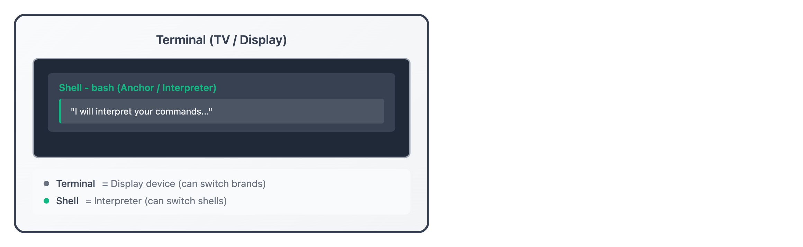

# 01 · 欢迎来到 Linux

> **目标**：在 10 分钟内运行你的第一个 Linux 命令，体验终端的力量  
> **前置**：无需任何 Linux 经验  
> **时间**：⚡ 15 分钟（速读）/ 🔬 40 分钟（完整实操）  
> **环境**：任意 Linux 发行版（Ubuntu, CentOS, WSL 均可）  

---

## 将学到的内容

1. 理解 Linux 是什么以及为何它对 IT 职业如此重要
2. 认识主要的 Linux 发行版及其使用场景
3. 打开终端并运行你的第一批命令
4. 理解终端（Terminal）和 Shell 的区别

---

## Step 1 — 先跑起来：看看你的系统（2 分钟）

> 🎯 **目标**：先"尝到"Linux 的味道，再理解原理。  

打开你的终端，运行：

```bash
neofetch
```

**看到了什么？**

```
        .-/+oossssoo+/-.               user@hostname
    `:+ssssssssssssssssss+:`           --------------
  -+ssssssssssssssssssyyssss+-         OS: Ubuntu 22.04.3 LTS x86_64
 .ossssssssssssssssssdMMMNysssso.      Host: Virtual Machine
/ssssssssssshdmmNNmmyNMMMMhssssss/     Kernel: 5.15.0-91-generic
+ssssssssshmydMMMMMMMNddddyssssssss+   Uptime: 2 hours, 15 mins
/sssssssshNMMMyhhyyyyhmNMMMNhssssss/   Packages: 1847 (dpkg)
.ssssssssdMMMNhsssssssssshNMMMdssss.   Shell: bash 5.1.16
+sssshhhyNMMNyssssssssssssyNMMMysss+   Terminal: /dev/pts/0
ossyNMMMNyMMhsssssssssssssshmmmhssso   CPU: Intel i7 (4) @ 2.30GHz
ossyNMMMNyMMhsssssssssssssshmmmhssso   Memory: 1024MiB / 4096MiB
+sssshhhyNMMNyssssssssssssyNMMMysss+
```

🎉 **恭喜！你刚刚运行了第一个 Linux 命令！**

> **💡 没有 neofetch？** 试试 `fastfetch`（现代替代品）或 `cat /etc/os-release`：  
> ```bash  
> fastfetch        # 推荐，更快更现代  
> cat /etc/os-release  # 无需安装，内置命令  
> ```  

---

## Step 2 — 什么是 Linux？（10 分钟）

### 2.1 Linux 无处不在

现在你已经"尝过"Linux 了，让我们了解它是什么。

**Linux 是什么？**

| 组件 | 说明 |
|------|------|
| **内核（Kernel）** | 操作系统的核心，管理硬件和资源 |
| **发行版（Distribution）** | 内核 + 软件包 + 配置 = 完整系统 |
| **开源（Open Source）** | 代码公开，任何人可以查看、修改、分发 |

**Linux 在哪里？**

- 🌐 **全球 90%+ 的服务器**运行 Linux
- ☁️ **AWS、Azure、GCP** 的大多数云实例是 Linux
- 📱 Android 系统基于 Linux 内核
- 🚀 SpaceX 火箭、Tesla 汽车都运行 Linux

### 2.2 主要发行版

对于日本 IT 行业来说，了解这些发行版很重要：

| 发行版 | 特点 | 使用场景 |
|--------|------|----------|
| **RHEL / CentOS / AlmaLinux** | 企业级稳定性 | 日本企业服务器首选 |
| **Ubuntu** | 用户友好、文档丰富 | 开发环境、云服务器 |
| **Debian** | 极其稳定 | 长期运行的生产服务器 |
| **Amazon Linux** | AWS 优化 | AWS EC2 实例 |

> 💼 **日本 IT 小贴士**：日本企业（特别是金融、制造业）普遍使用 RHEL 系发行版。  
> 掌握 `yum`/`dnf` 包管理器会让你在面试中加分。  

---

## Step 3 — 终端 vs Shell（10 分钟）

### 3.1 它们是不同的东西

很多初学者混淆这两个概念。让我用一个比喻来解释：



<details>
<summary>View ASCII source</summary>

```
┌─────────────────────────────────────────────────────────────┐
│                    电视机 (Terminal)                         │
│  ┌───────────────────────────────────────────────────────┐  │
│  │                                                       │  │
│  │    新闻主播 (Shell - bash)                            │  │
│  │    ┌─────────────────────────────────────────────┐   │  │
│  │    │ "今天我将为您解读命令..."                    │   │  │
│  │    └─────────────────────────────────────────────┘   │  │
│  │                                                       │  │
│  └───────────────────────────────────────────────────────┘  │
│                                                             │
│  🔹 终端 = 显示设备（可以换不同品牌的电视机）              │
│  🔹 Shell = 解释器（可以换不同的主播）                      │
└─────────────────────────────────────────────────────────────┘
```

</details>

| 概念 | 是什么 | 例子 |
|------|--------|------|
| **Terminal（终端）** | 显示界面的程序 | GNOME Terminal, iTerm2, Windows Terminal |
| **Shell（壳）** | 解释命令的程序 | bash, zsh, fish |

### 3.2 确认你的 Shell

```bash
echo $SHELL
```

```
/bin/bash
```

> 💡 **bash** (Bourne Again Shell) 是最常见的 Shell，也是我们课程使用的默认 Shell。  

---

## Step 4 — 动手实验：五个基础命令（20 分钟）

> 🎯 **目标**：掌握最安全、最常用的五个命令。  

### 4.1 我是谁？

```bash
whoami
```

```
terraform
```

**理解**：你以什么身份登录到系统。

### 4.2 现在几点？

```bash
date
```

```
Sat Jan  4 10:30:45 JST 2025
```

**理解**：系统能回答你的问题。

### 4.3 日历

```bash
cal
```

```
    January 2025
Su Mo Tu We Th Fr Sa
          1  2  3  4
 5  6  7  8  9 10 11
12 13 14 15 16 17 18
19 20 21 22 23 24 25
26 27 28 29 30 31
```

**理解**：Linux 有很多内置的实用工具。

### 4.4 清屏

```bash
clear
```

（屏幕变干净了）

**理解**：你可以控制终端的显示。

> 💡 **快捷键**：`Ctrl + L` 也可以清屏！  

### 4.5 让计算机说话

```bash
echo 'Hello, Linux!'
```

```
Hello, Linux!
```

**理解**：`echo` 命令会"回声"你的输入。这在脚本中非常有用。

---

## Step 5 — 安全提示：Ctrl+C 是你的好朋友（5 分钟）

**遇到问题时**，按 `Ctrl + C` 可以中断当前命令。

试试看：

```bash
# 这个命令会持续运行
cat
```

（光标在等待输入...）

按 `Ctrl + C`：

```
^C
```

命令被中断了！你随时可以用这个"紧急刹车"。

> ⚡ **记住**：`Ctrl + C` = 我要停止！  

---

## 本课小结

| 你学到的 | 命令/概念 |
|----------|-----------|
| 查看系统信息 | `neofetch`, `cat /etc/os-release` |
| Linux 是什么 | 内核 + 发行版 = 完整操作系统 |
| 终端 vs Shell | 显示器 vs 解释器 |
| 五个基础命令 | `whoami`, `date`, `cal`, `clear`, `echo` |
| 紧急刹车 | `Ctrl + C` |

**核心理念**：终端不可怕！大多数命令只是"询问"系统，不会造成任何破坏。

---

## 下一步

你已经知道怎么跟 Linux 对话了。接下来，让我们学习如何"看看周围"——了解你在文件系统中的位置。

→ [02 · 第一步 - Shell 提示符](../02-first-steps/)

---

## 面试准备

💼 **よくある質問**

**Q: Linux とは何ですか？**

A: Linux はオープンソースのオペレーティングシステムのカーネルです。カーネルにソフトウェアを追加したものを「ディストリビューション」と呼びます（Ubuntu、RHEL など）。

**Q: なぜ Linux が重要ですか？**

A: サーバーの 90% 以上が Linux で動いており、クラウドインフラの基盤です。インフラエンジニアにとって必須スキルです。

**Q: bash と sh の違いは？**

A: `sh` は POSIX 標準の最小限シェル、`bash` は機能拡張版（配列、履歴など）。スクリプトの互換性には `#!/bin/sh` を使うことも。

---

## トラブルシューティング

🔧 **よくある問題**

**`neofetch: command not found`**

```bash
# neofetch 已停止维护，推荐使用 fastfetch（更快、维护活跃）
# Ubuntu 23.04+ / Debian 13+
sudo apt install fastfetch

# RHEL 9 / AlmaLinux 9 / Rocky Linux 9
sudo dnf install fastfetch

# 旧系统仍可安装 neofetch
# Ubuntu/Debian
sudo apt install neofetch
# RHEL/CentOS (需 EPEL)
sudo dnf install epel-release && sudo dnf install neofetch

# 无需安装的替代命令
cat /etc/os-release
```

> **💡 Note**: neofetch 于 2024 年停止维护，fastfetch 是其现代替代品，速度更快且持续更新。

**ターミナルが応答しない**

→ `Ctrl + C` で中断、それでもダメなら `Ctrl + D` でログアウト

**日本語が文字化けする**

```bash
export LANG=ja_JP.UTF-8
```

---

## 检查清单

在继续下一课之前，确认你能：

- [ ] 打开终端并运行命令
- [ ] 解释 Linux 内核和发行版的区别
- [ ] 说明终端和 Shell 的区别
- [ ] 使用 `whoami`, `date`, `cal`, `clear`, `echo` 命令
- [ ] 用 `Ctrl + C` 中断命令

---

## 系列导航

← [课程首页](../) | [Home](/) | [02 · Shell 提示符 →](../02-first-steps/)
