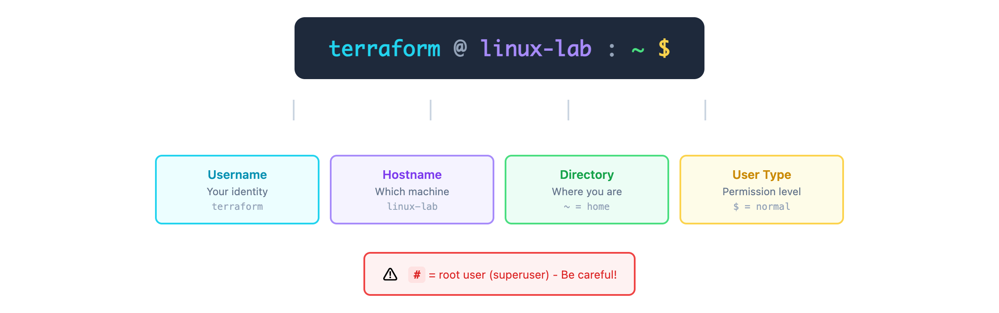

# 02 · 第一步 - Shell 提示符

> **目标**：理解 Shell 提示符，掌握"我在哪里？周围有什么？"的基本感知  
> **前置**：已完成 [01 · 欢迎来到 Linux](../01-welcome-linux/)  
> **时间**：⚡ 20 分钟（速读）/ 🔬 55 分钟（完整实操）  
> **环境**：任意 Linux 发行版  

---

## 将学到的内容

1. 读懂 Shell 提示符的每个部分
2. 用 `pwd` 知道"我在哪里"
3. 用 `ls` 看看"周围有什么"
4. 使用 Tab 补全和命令历史提高效率

---

## Step 1 — 先跑起来：定位自己（2 分钟）

> 🎯 **目标**：立即知道你在哪里，周围有什么。  

打开终端，运行：

```bash
pwd && ls
```

**看到了什么？**

```
/home/terraform
Desktop  Documents  Downloads  Music  Pictures  Videos
```

> 💡 **你的输出可能不同**：目录列表因系统而异。重要的是理解 `pwd` 和 `ls` 的作用。

🎉 **恭喜！你已经知道自己在哪，周围有什么了！**

- `pwd` = Print Working Directory = "我在哪？"
- `ls` = List = "周围有什么？"

---

## Step 2 — 解读 Shell 提示符（15 分钟）

### 2.1 提示符的结构

每次你看到终端等待输入时，都会看到一个提示符：

```
terraform@linux-lab:~$
```

让我们拆解它：



<details>
<summary>View ASCII source</summary>

```
   terraform  @   linux-lab   :    ~     $
      │       │      │        │    │     │
      │       │      │        │    │     └── 用户类型标识
      │       │      │        │    │         $ = 普通用户
      │       │      │        │    │         # = root 用户（危险！）
      │       │      │        │    │
      │       │      │        │    └── 当前目录
      │       │      │        │        ~ = 家目录的简写
      │       │      │        │
      │       │      │        └── 分隔符
      │       │      │
      │       │      └── 主机名 (hostname)
      │       │          你连接的是哪台机器
      │       │
      │       └── @ 符号（分隔用户名和主机名）
      │
      └── 用户名 (username)
          你是谁
```

</details>

| 部分 | 含义 | 例子 |
|------|------|------|
| `terraform` | 用户名 | 你是谁 |
| `@` | 分隔符 | at = 在 |
| `linux-lab` | 主机名 | 哪台机器 |
| `:` | 分隔符 | - |
| `~` | 当前目录 | ~ = 家目录 |
| `$` | 用户类型 | $ = 普通用户 |

### 2.2 危险信号：`#` vs `$`

```bash
# 普通用户
terraform@linux-lab:~$

# root 用户 - 注意最后变成了 #
root@linux-lab:/#
```

> ⚠️ **重要**：看到 `#` 表示你是 root（超级管理员）。  
> 在 root 下操作要格外小心！  

---

## Step 3 — GPS 命令：pwd（10 分钟）

### 3.1 你的位置

`pwd` 是 Linux 中的 GPS —— 告诉你精确位置。

```bash
pwd
```

```
/home/terraform
```

**这是什么意思？**

```
/               ← 根目录（文件系统的起点）
└── home        ← 存放用户目录的地方
    └── terraform  ← 你的个人目录（家目录）
```

### 3.2 养成习惯

在执行任何重要操作之前，先问问自己："我在哪？"

```bash
# 好习惯：先定位
pwd
# 然后再操作
```

> 💡 **专业提示**：很多事故发生是因为"以为自己在 A 目录，其实在 B 目录"。  

---

## Step 4 — 环顾四周：ls（20 分钟）

### 4.1 基本用法

```bash
ls
```

```
Desktop  Documents  Downloads  Music  Pictures  Videos
```

看到的是当前目录下的文件和文件夹。

### 4.2 长格式：ls -l

```bash
ls -l
```

```
total 24
drwxr-xr-x 2 terraform terraform 4096 Jan  4 10:00 Desktop
drwxr-xr-x 2 terraform terraform 4096 Jan  4 10:00 Documents
drwxr-xr-x 2 terraform terraform 4096 Jan  4 10:00 Downloads
drwxr-xr-x 2 terraform terraform 4096 Jan  4 10:00 Music
drwxr-xr-x 2 terraform terraform 4096 Jan  4 10:00 Pictures
drwxr-xr-x 2 terraform terraform 4096 Jan  4 10:00 Videos
```

**解读第一行：**

```
drwxr-xr-x  2  terraform  terraform  4096  Jan  4 10:00  Desktop
│           │     │          │        │       │            │
│           │     │          │        │       │            └── 名称
│           │     │          │        │       └── 修改时间
│           │     │          │        └── 大小（字节）
│           │     │          └── 所属组
│           │     └── 所有者
│           └── 链接数
└── 类型和权限（d=目录，-=文件）
```

### 4.3 显示隐藏文件：ls -a

```bash
ls -a
```

```
.  ..  .bash_history  .bashrc  .profile  Desktop  Documents  ...
```

**隐藏文件的秘密**：以 `.` 开头的文件默认不显示！

| 名称 | 含义 |
|------|------|
| `.` | 当前目录 |
| `..` | 上级目录 |
| `.bashrc` | Shell 配置文件 |
| `.bash_history` | 命令历史 |

### 4.4 终极组合：ls -la

```bash
ls -la
```

这是最常用的组合：**所有文件 + 详细信息**。

> 💡 **专业提示**：很多人会设置别名 `alias ll='ls -la'`  

---

## Step 5 — 效率工具：Tab 补全和历史（15 分钟）

### 5.1 Tab 补全：少打字，少出错

试试这个：

```bash
# 输入 'cat /etc/os-rel' 然后按 Tab
cat /etc/os-rel<Tab>
```

自动补全为：

```bash
cat /etc/os-release
```

**Tab 补全的魔力：**

```bash
# 输入 'ca' 然后按两次 Tab
ca<Tab><Tab>
```

显示所有以 `ca` 开头的命令：

```
cal     capsh   cat     catchsegv
```

### 5.2 命令历史：上下箭头

按 `↑`（上箭头）可以调出上一条命令。

```bash
# 按上箭头
↑  # 显示上一条命令
↑  # 显示再上一条
↓  # 返回下一条
```

### 5.3 历史搜索：Ctrl+R

```bash
# 按 Ctrl+R，然后输入 'pwd'
(reverse-i-search)`pwd': pwd
```

它会搜索历史中包含 'pwd' 的命令！

### 5.4 常用快捷键

| 快捷键 | 作用 |
|--------|------|
| `Tab` | 自动补全 |
| `↑` / `↓` | 浏览历史 |
| `Ctrl + R` | 搜索历史 |
| `Ctrl + C` | 中断命令 |
| `Ctrl + L` | 清屏 |
| `Ctrl + A` | 跳到行首 |
| `Ctrl + E` | 跳到行尾 |

---

## Step 6 — 动手练习（10 分钟）

### 6.1 GPS 训练

```bash
# 1. 确认当前位置
pwd

# 2. 查看周围
ls

# 3. 查看详细信息
ls -l

# 4. 发现隐藏文件
ls -a

# 5. 完整视图
ls -la
```

### 6.2 Tab 补全训练

```bash
# 练习 Tab 补全
cat /etc/ho<Tab>       # 应该补全为 /etc/hostname 或显示选项
cat /etc/hos<Tab>      # 更精确的补全
```

### 6.3 历史训练

```bash
# 1. 运行几个命令
whoami
date
pwd
ls -la

# 2. 用上箭头浏览
↑ ↑ ↑ ↑

# 3. 用 Ctrl+R 搜索
Ctrl+R who<Enter>  # 应该找到 whoami
```

---

## 本课小结

| 你学到的 | 命令/技巧 |
|----------|-----------|
| Shell 提示符结构 | `用户名@主机名:目录$` |
| 危险信号 | `#` = root 用户 |
| 定位命令 | `pwd` |
| 查看命令 | `ls`, `ls -l`, `ls -a`, `ls -la` |
| Tab 补全 | 少打字，少出错 |
| 命令历史 | `↑`, `↓`, `Ctrl+R` |

**核心理念**：永远知道自己在哪里，看清周围有什么。

---

## 下一步

现在你能定位自己了。接下来学习如何"移动"——在文件系统中自由导航。

→ [03 · 文件系统导航](../03-navigation/)

---

## 面试准备

💼 **よくある質問**

**Q: pwd は何の略ですか？**

A: Print Working Directory の略です。現在の作業ディレクトリのフルパスを表示します。

**Q: ls -la の各オプションは何ですか？**

A: `-l` は詳細表示（long format）、`-a` は隠しファイルを含む全ファイル表示（all）です。

**Q: Tab 補完が効かない場合は？**

A: 複数の候補がある場合は Tab を 2 回押すと候補一覧が表示されます。

---

## トラブルシューティング

🔧 **よくある問題**

**Tab 補完が動かない**

```bash
# bash-completion がインストールされているか確認
apt list --installed | grep bash-completion

# インストールされていなければ
sudo apt install bash-completion
```

**日本語ファイル名が表示されない**

```bash
# ロケール確認
locale

# 設定
export LANG=ja_JP.UTF-8
```

**コマンド履歴が保存されない**

```bash
# .bash_history の確認
ls -la ~/.bash_history

# HISTSIZE 確認
echo $HISTSIZE
```

---

## 检查清单

在继续下一课之前，确认你能：

- [ ] 解读 Shell 提示符的各个部分
- [ ] 识别 `$` 和 `#` 的区别
- [ ] 使用 `pwd` 确认位置
- [ ] 使用 `ls -la` 查看所有文件详情
- [ ] 使用 Tab 补全
- [ ] 使用上箭头浏览历史
- [ ] 使用 `Ctrl+R` 搜索历史

---

## 系列导航

← [01 · 欢迎来到 Linux](../01-welcome-linux/) | [Home](../) | [03 · 文件系统导航 →](../03-navigation/)
