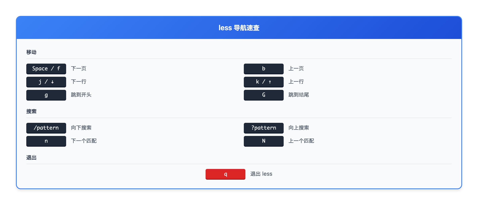

# 05 · 查看文件内容

> **目标**：掌握查看和浏览文件内容的各种方法
> **前置**：已完成 [04 · 文件和目录](../04-files-directories/)
> **时间**：⚡ 20 分钟（速读）/ 🔬 60 分钟（完整实操）
> **环境**：任意 Linux 发行版  

---

## 将学到的内容

1. 用 `cat` 查看完整文件
2. 用 `head` 和 `tail` 预览开头和结尾
3. 用 `less` 浏览大文件
4. 用 `tail -f` 实时监控日志

---

## Step 1 — 先跑起来：发现系统秘密（2 分钟）

> 🎯 **目标**：用一个命令看到你的操作系统信息。  

```bash
cat /etc/os-release
```

**看到了什么？**

```
PRETTY_NAME="Ubuntu 22.04.3 LTS"
NAME="Ubuntu"
VERSION_ID="22.04"
VERSION="22.04.3 LTS (Jammy Jellyfish)"
VERSION_CODENAME=jammy
ID=ubuntu
ID_LIKE=debian
HOME_URL="https://www.ubuntu.com/"
SUPPORT_URL="https://help.ubuntu.com/"
BUG_REPORT_URL="https://bugs.launchpad.net/ubuntu/"
```

🎉 **原来系统信息就是一个普通的文本文件！**

Linux 的哲学：一切皆文件。配置、日志、设备信息，都是可读的文本。

---

## Step 2 — cat：一次看完（15 分钟）

### 2.1 基本用法

```bash
cat /etc/hostname
```

```
linux-lab
```

`cat` = con**cat**enate（连接），也常用于查看文件。

### 2.2 查看多个文件

```bash
cat file1.txt file2.txt
```

这就是"连接"的本意——把多个文件内容连在一起输出。

### 2.3 带行号

```bash
cat -n /etc/passwd
```

```
     1	root:x:0:0:root:/root:/bin/bash
     2	daemon:x:1:1:daemon:/usr/sbin:/usr/sbin/nologin
     3	bin:x:2:2:bin:/bin:/usr/sbin/nologin
     ...
```

### 2.4 cat 的限制

```bash
# 对于大文件，cat 不是好选择
cat /var/log/syslog  # 可能刷屏几分钟！
```

> ⚠️ **注意**：`cat` 适合小文件。大文件用 `less` 或 `head`/`tail`。  

---

## Step 3 — head 和 tail：看开头和结尾（20 分钟）

> **📦 发行版兼容性**：本节使用 `/var/log/syslog` 作为示例（Ubuntu/Debian）。
> - **RHEL/CentOS/AlmaLinux**: 使用 `/var/log/messages`
> - **现代 systemd 系统**: 推荐使用 `journalctl`（后续课程详细介绍）
>
> ```bash
> # RHEL 系列替代命令
> head /var/log/messages
> tail -f /var/log/messages
>
> # systemd 日志（推荐）
> journalctl -n 20          # 最近 20 条
> journalctl -f             # 实时跟踪
> ```

### 3.1 head - 看开头

```bash
# 默认显示前 10 行
head /var/log/syslog

# 指定行数
head -n 5 /var/log/syslog
# 或简写
head -5 /var/log/syslog
```

### 3.2 tail - 看结尾

```bash
# 默认显示最后 10 行
tail /var/log/syslog

# 指定行数
tail -n 20 /var/log/syslog
# 或简写
tail -20 /var/log/syslog
```

### 3.3 实用场景

| 命令 | 使用场景 |
|------|----------|
| `head -1 file` | 查看文件标题行 |
| `tail -20 /var/log/syslog` | 查看最近的日志 |
| `head -100 bigfile.csv` | 预览大文件结构 |

### 3.4 组合使用

```bash
# 查看第 11-20 行
head -20 file.txt | tail -10

# 查看第 5 行
head -5 file.txt | tail -1
```

---

## Step 4 — less：大文件浏览器（20 分钟）

### 4.1 为什么用 less？

- 不会一次加载整个文件到内存
- 可以前后翻页
- 支持搜索
- 退出后屏幕干净

```bash
less /var/log/syslog
```

### 4.2 less 导航键



<details>
<summary>View ASCII source</summary>

```
┌─────────────────────────────────────────────────────────────┐
│                     less 导航速查                            │
├─────────────────────────────────────────────────────────────┤
│                                                             │
│  移动：                                                      │
│    Space / f     下一页                                      │
│    b             上一页                                      │
│    ↓ / j         下一行                                      │
│    ↑ / k         上一行                                      │
│    g             跳到开头                                    │
│    G             跳到结尾                                    │
│                                                             │
│  搜索：                                                      │
│    /pattern      向下搜索 pattern                            │
│    ?pattern      向上搜索 pattern                            │
│    n             下一个匹配                                  │
│    N             上一个匹配                                  │
│                                                             │
│  退出：                                                      │
│    q             退出                                        │
│                                                             │
└─────────────────────────────────────────────────────────────┘
```

</details>

| 按键 | 动作 |
|------|------|
| `Space` 或 `f` | 下一页 |
| `b` | 上一页 |
| `g` | 跳到开头 |
| `G` | 跳到结尾 |
| `/pattern` | 向下搜索 |
| `n` | 下一个匹配 |
| `N` | 上一个匹配 |
| `q` | 退出 |

### 4.3 实践练习

```bash
# 打开日志文件
less /var/log/syslog

# 试试以下操作：
# 1. 按 Space 翻页
# 2. 按 G 跳到末尾
# 3. 按 g 回到开头
# 4. 输入 /error 搜索 "error"
# 5. 按 n 找下一个
# 6. 按 q 退出
```

---

## Step 5 — tail -f：实时监控日志（15 分钟）

### 5.1 运维人员的秘密武器

```bash
tail -f /var/log/syslog
```

`-f` = follow（跟随）。文件有新内容时，自动显示！

### 5.2 为什么这很重要？

在日本 IT 运维（障害対応）中，`tail -f` 是：
- 实时监控应用日志
- 观察服务启动过程
- 调试问题时跟踪输出

### 5.3 实践演示

打开两个终端窗口：

**终端 1：监控日志**

```bash
tail -f /var/log/syslog
```

**终端 2：产生日志**

```bash
logger "This is a test message from terminal 2"
```

**观察终端 1**：你会看到新消息实时出现！

### 5.4 监控多个文件

```bash
# 同时监控多个日志
tail -f /var/log/syslog /var/log/auth.log
```

### 5.5 退出

按 `Ctrl + C` 停止监控。

---

## Step 6 — 综合练习（5 分钟）

### 6.1 日志侦探

```bash
# 1. 查看系统信息
cat /etc/os-release

# 2. 预览大日志
head -20 /var/log/syslog
tail -20 /var/log/syslog

# 3. 浏览日志，搜索错误
less /var/log/syslog
# 输入 /error 搜索

# 4. 实时监控
tail -f /var/log/syslog
# Ctrl+C 退出
```

### 6.2 选择正确的工具

| 场景 | 使用 |
|------|------|
| 小配置文件 | `cat` |
| 查看日志最后几行 | `tail -20` |
| 浏览大文件 | `less` |
| 实时监控 | `tail -f` |
| 查看文件开头 | `head` |

---

## 本课小结

| 命令 | 用途 | 关键选项 |
|------|------|----------|
| `cat` | 完整输出 | `-n`（行号） |
| `head` | 看开头 | `-n 数字` |
| `tail` | 看结尾 | `-n 数字`, `-f`（跟随） |
| `less` | 浏览大文件 | 用 `/` 搜索，`q` 退出 |

**核心理念**：选择合适的工具。小文件用 `cat`，大文件用 `less`，日志用 `tail -f`。

---

## 下一步

你现在能查看各种文件了。接下来学习如何"求助"——使用 man 手册和帮助系统。

→ [06 · 获取帮助](../06-getting-help/)

---

## 面试准备

💼 **よくある質問**

**Q: cat, less, more の違いは？**

A: `cat` は全内容を一度に出力、`more` は前方のみページング、`less` は双方向ページング＋検索。`less` が最も機能豊富です。

**Q: tail -f の実務での使い方は？**

A: 障害対応でリアルタイムログ監視。例：`tail -f /var/log/nginx/error.log` でエラーを即座に確認。

**Q: 大きなファイルで特定の行を見るには？**

A: `sed -n '100p' file` で 100 行目、または `head -100 file | tail -1`。大量の場合は `awk 'NR==100' file`。

---

## トラブルシューティング

🔧 **よくある問題**

**`less: command not found`**

```bash
# less をインストール
sudo apt install less    # Debian/Ubuntu
sudo yum install less    # RHEL/CentOS
```

**`cat` が止まらない（巨大ファイル）**

```bash
# Ctrl+C で中断
# 次回から head/less を使う
head -100 bigfile.txt
```

**日本語が文字化けする**

```bash
# ロケール設定
export LANG=ja_JP.UTF-8

# または less のオプション
less -R file.txt
```

**`Permission denied` で読めない**

```bash
# 権限確認
ls -la /path/to/file

# sudo で読む
sudo cat /var/log/secure
# または
sudo less /var/log/secure
```

---

## 检查清单

在继续下一课之前，确认你能：

- [ ] 使用 `cat` 查看小文件
- [ ] 使用 `head -n` 和 `tail -n` 指定行数
- [ ] 在 `less` 中翻页、搜索、退出
- [ ] 使用 `tail -f` 实时监控日志
- [ ] 用 `Ctrl+C` 停止 `tail -f`

---

## 系列导航

← [04 · 文件和目录](../04-files-directories/) | [Home](../) | [06 · 获取帮助 →](../06-getting-help/)
