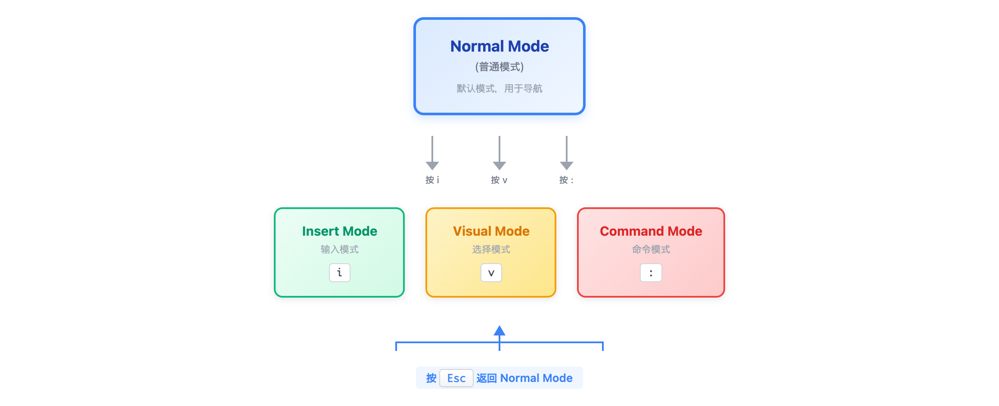

# 07 · 文本编辑基础

> **目标**：学会用 nano 和 vim 编辑文件  
> **前置**：已完成 [06 · 获取帮助](../06-getting-help/)  
> **时间**：90 分钟  
> **环境**：任意 Linux 发行版  

---

## 将学到的内容

1. 用 nano 编辑文件（主要编辑器）
2. vim 生存技能（必备应急技能）
3. 理解"如何退出 vim"的梗
4. 安全编辑实践

---

## Step 1 — 先跑起来：编辑你的第一个文件（2 分钟）

> 🎯 **目标**：立即体验文件编辑。  

```bash
nano ~/playground/test.txt
```

**操作：**
1. 输入：`Hello from nano!`
2. 按 `Ctrl + O`（保存）
3. 按 `Enter`（确认文件名）
4. 按 `Ctrl + X`（退出）

验证：

```bash
cat ~/playground/test.txt
```

```
Hello from nano!
```

🎉 **你刚刚编辑并保存了一个文件！**

---

## Step 2 — nano：你的主力编辑器（25 分钟）

### 2.1 为什么 nano？

- 简单直观，像记事本
- 屏幕底部显示快捷键
- 上手零学习成本

### 2.2 启动 nano

```bash
nano filename.txt          # 编辑文件（不存在则创建）
nano -l filename.txt       # 显示行号
nano +10 filename.txt      # 跳到第 10 行
```

### 2.3 nano 快捷键

屏幕底部显示的 `^` 表示 Ctrl 键。


<details>
<summary>View ASCII source</summary>

```
┌─────────────────────────────────────────────────────────────┐
│                     nano 快捷键速查                          │
├─────────────────────────────────────────────────────────────┤
│                                                             │
│  文件操作：                                                  │
│    Ctrl + O      保存文件（Write Out）                       │
│    Ctrl + X      退出 nano                                   │
│    Ctrl + R      插入文件内容                                │
│                                                             │
│  编辑：                                                      │
│    Ctrl + K      剪切当前行                                  │
│    Ctrl + U      粘贴                                        │
│    Ctrl + \      查找替换                                    │
│                                                             │
│  导航：                                                      │
│    Ctrl + W      搜索                                        │
│    Ctrl + _      跳到指定行号                                │
│    Ctrl + A      跳到行首                                    │
│    Ctrl + E      跳到行尾                                    │
│                                                             │
│  信息：                                                      │
│    Ctrl + C      显示光标位置                                │
│    Ctrl + G      帮助文档                                    │
│                                                             │
└─────────────────────────────────────────────────────────────┘
```

</details>

| 快捷键 | 动作 |
|--------|------|
| `Ctrl + O` | 保存（Write Out） |
| `Ctrl + X` | 退出 |
| `Ctrl + K` | 剪切当前行 |
| `Ctrl + U` | 粘贴 |
| `Ctrl + W` | 搜索 |
| `Ctrl + \` | 查找替换 |
| `Ctrl + G` | 帮助 |

### 2.4 nano 实践

```bash
nano ~/playground/practice.txt
```

**练习：**

1. 输入几行文字
2. `Ctrl + W` 搜索某个词
3. `Ctrl + K` 剪切一行
4. 移动光标到新位置
5. `Ctrl + U` 粘贴
6. `Ctrl + O` 保存
7. `Ctrl + X` 退出

---

## Step 3 — vim 生存模式（30 分钟）

### 3.1 为什么必须学 vim？

> 每台 Linux 服务器都装有 vim（或 vi），但不一定有 nano。  
>
> 当你 SSH 到一台远程服务器，需要紧急修改配置，发现没有 nano 时，  
> vim 是你唯一的选择。  

### 3.2 vim 的模式

这是 vim 最重要的概念：**vim 有多种模式**。



<details>
<summary>View ASCII source</summary>

```
                    ┌─────────────────┐
                    │   Normal Mode   │ ← 默认模式，用于导航
                    │   （普通模式）   │
                    └────────┬────────┘
                             │
              ┌──────────────┼──────────────┐
              │              │              │
              ▼              ▼              ▼
       ┌──────────┐   ┌──────────┐   ┌──────────┐
       │  Insert  │   │  Visual  │   │ Command  │
       │  Mode    │   │  Mode    │   │  Mode    │
       │ 输入模式  │   │ 选择模式  │   │ 命令模式  │
       └──────────┘   └──────────┘   └──────────┘
            │              │              │
            └──────────────┴──────────────┘
                           │
                      按 Esc 返回 Normal Mode
```

</details>

| 模式 | 进入方式 | 用途 |
|------|----------|------|
| Normal（普通） | `Esc` | 导航、命令 |
| Insert（插入） | `i` | 输入文字 |
| Visual（可视） | `v` | 选择文本 |
| Command（命令） | `:` | 保存、退出等 |

### 3.3 vim 生存套件

**记住这 5 个操作，你就能"活着出来"：**

| 按键 | 动作 | 助记 |
|------|------|------|
| `Esc` | 回到普通模式 | 安全港 |
| `i` | 进入插入模式 | **i**nsert |
| `:wq` | 保存并退出 | **w**rite + **q**uit |
| `:q!` | 不保存退出 | **q**uit，`!` = 强制 |
| `u` | 撤销 | **u**ndo |

### 3.4 vim 生存演练

```bash
vim ~/playground/vim-test.txt
```

**按顺序执行：**

1. **按 `i`**：进入插入模式（左下角显示 `-- INSERT --`）
2. **输入**：`I survived vim!`
3. **按 `Esc`**：回到普通模式
4. **输入 `:wq`**：保存并退出

验证：

```bash
cat ~/playground/vim-test.txt
```

```
I survived vim!
```

### 3.5 关于"如何退出 vim"的梗

这是程序员界最著名的笑话之一：

> "一百万程序员进入 vim，一百万程序员在 Google 搜索'如何退出 vim'"  


<details>
<summary>View ASCII source</summary>

```
┌─────────────────────────────────────────────────────────────┐
│                                                             │
│       Stack Overflow 问题浏览量排行榜 TOP 1                 │
│                                                             │
│       "How to exit the Vim editor?"                         │
│                                                             │
│       浏览量：5,000,000+                                    │
│                                                             │
│       评论："这救了我的命"                                   │
│             "我在 vim 里困了 3 天"                          │
│             "最终我重启了服务器..."                         │
│                                                             │
└─────────────────────────────────────────────────────────────┘
```

</details>

**答案**：按 `Esc` 确保在普通模式，然后输入 `:q!`（不保存）或 `:wq`（保存）。

---

## Step 4 — 安全编辑实践（15 分钟）

### 4.1 编辑前备份

**黄金法则**：编辑配置文件前，先备份！

```bash
# 备份原文件
cp /etc/hosts /etc/hosts.bak

# 或加时间戳
cp /etc/hosts /etc/hosts.$(date +%Y%m%d)
```

### 4.2 验证变更

```bash
# 编辑后对比
diff /etc/hosts /etc/hosts.bak
```

### 4.3 sudo 编辑系统文件

```bash
# 系统文件需要 sudo
sudo nano /etc/hosts

# 或
sudo vim /etc/hosts
```

### 4.4 实践：安全编辑工作流

```bash
# 1. 备份
cp /etc/hosts /tmp/hosts.bak

# 2. 编辑副本
nano /tmp/hosts.bak

# 3. 验证
diff /etc/hosts /tmp/hosts.bak

# 4. 确认无误后（这里只是演示，不要实际覆盖）
# sudo cp /tmp/hosts.bak /etc/hosts
```

---

## Step 5 — vim 额外技能（可选）（10 分钟）

如果你想提升 vim 技能，以下是一些常用操作：

### 5.1 导航

| 按键 | 动作 |
|------|------|
| `h j k l` | 左下上右（比箭头键快） |
| `gg` | 跳到文件开头 |
| `G` | 跳到文件结尾 |
| `0` | 跳到行首 |
| `$` | 跳到行尾 |

### 5.2 编辑

| 按键 | 动作 |
|------|------|
| `dd` | 删除整行 |
| `yy` | 复制整行 |
| `p` | 粘贴 |
| `/pattern` | 搜索 |
| `n` | 下一个匹配 |

### 5.3 vim 配置

```bash
# 创建 vim 配置文件
cat > ~/.vimrc << 'EOF'
set number          " 显示行号
set showmatch       " 括号匹配
syntax on           " 语法高亮
EOF
```

---

## Step 6 — 综合练习（5 分钟）

### 6.1 编辑器选择

```bash
# 1. nano 编辑（日常首选）
nano ~/playground/notes.txt
# 写点内容，Ctrl+O 保存，Ctrl+X 退出

# 2. vim 生存演练
vim ~/playground/vim-notes.txt
# i → 输入内容 → Esc → :wq

# 3. 验证两个文件
cat ~/playground/notes.txt
cat ~/playground/vim-notes.txt
```

---

## 本课小结

| 编辑器 | 使用场景 | 保存退出 |
|--------|----------|----------|
| **nano** | 日常编辑（首选） | `Ctrl+O`, `Ctrl+X` |
| **vim** | 应急/高级编辑 | `Esc` → `:wq` |

**vim 生存套件**：
1. `Esc` - 回到安全
2. `i` - 开始输入
3. `:wq` - 保存退出
4. `:q!` - 放弃退出
5. `u` - 撤销

**核心理念**：nano 用于日常，vim 用于应急。编辑前一定备份！

---

## 下一步

你现在可以编辑文件了！接下来学习如何"定制"——配置你的 Shell 环境。

→ [08 · Shell 配置](../08-shell-config/)

---

## 面试准备

💼 **よくある質問**

**Q: vi と vim の違いは？**

A: `vi` は 1976 年の原版、`vim` (Vi IMproved) は 1991 年の拡張版。多くのシステムで `vi` は `vim` へのエイリアスです。

**Q: なぜ vim がサーバーで重要？**

A: `vim` はほぼ全ての Linux ディストリビューションにプリインストール。`nano` がない環境でも `vim` は使えます。

**Q: vim で誤って編集した場合は？**

A: `u` で undo、複数回押せば連続 undo。`:q!` で保存せず終了すれば元ファイルは無傷。

---

## トラブルシューティング

🔧 **よくある問題**

**vim で日本語が入力できない**

```bash
# ロケール確認
locale

# ターミナルの設定を確認
# UTF-8 encoding が必要
```

**nano がインストールされていない**

```bash
# インストール
sudo apt install nano     # Debian/Ubuntu
sudo yum install nano     # RHEL/CentOS
```

**vim から出られない！**

```bash
# ステップ 1: Esc を何度か押す
# ステップ 2: :q! と入力して Enter
# それでもダメなら Ctrl+Z で一時停止、fg で戻る
```

**Ctrl+Z を押してしまった（vim が消えた）**

```bash
# vim がバックグラウンドに行った
fg    # フォアグラウンドに戻す
```

---

## 检查清单

在继续下一课之前，确认你能：

- [ ] 用 nano 创建、编辑、保存文件
- [ ] 在 nano 中使用 Ctrl+W 搜索
- [ ] 用 vim 进入插入模式、输入、保存退出
- [ ] 用 `:q!` 从 vim 不保存退出
- [ ] 编辑文件前先备份

---

## 系列导航

← [06 · 获取帮助](../06-getting-help/) | [Home](../) | [08 · Shell 配置 →](../08-shell-config/)
