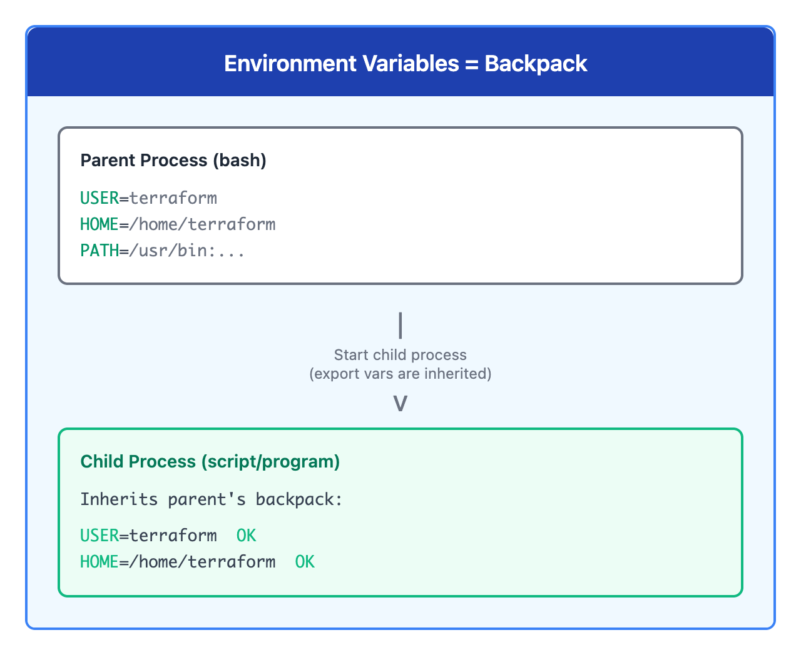

# 09 · 环境变量和 PATH

> **目标**：理解环境变量和 PATH，创建自己的命令
> **前置**：已完成 [08 · Shell 配置](../08-shell-config/)
> **时间**：⚡ 15 分钟（速读）/ 🔬 50 分钟（完整实操）
> **环境**：任意 Linux 发行版  

---

## 将学到的内容

1. 理解什么是环境变量
2. 掌握 PATH 的工作原理
3. 正确设置和导出变量
4. 创建自己的可执行脚本

---

## Step 1 — 先跑起来：看看 PATH 里有什么（2 分钟）

> 🎯 **目标**：揭开"命令从哪里来"的秘密。  

```bash
echo $PATH | tr ':' '\n'
```

**看到了什么？**

```
/usr/local/bin
/usr/bin
/bin
/usr/local/sbin
/usr/sbin
/sbin
```

🎉 **这就是系统找命令的地方！**

当你输入 `ls` 时，系统会按顺序在这些目录里寻找。

---

## Step 2 — 环境变量基础（25 分钟）

### 2.1 什么是环境变量？

环境变量是 Shell 中存储信息的"容器"。

```bash
# 查看所有环境变量
env

# 查看特定变量
echo $USER
echo $HOME
echo $SHELL
```

### 2.2 重要的环境变量

| 变量 | 含义 | 示例值 |
|------|------|--------|
| `USER` | 当前用户名 | `terraform` |
| `HOME` | 家目录路径 | `/home/terraform` |
| `SHELL` | 默认 Shell | `/bin/bash` |
| `PATH` | 命令搜索路径 | `/usr/bin:/bin:...` |
| `PWD` | 当前目录 | `/home/terraform` |
| `LANG` | 语言设置 | `en_US.UTF-8` |

### 2.3 背包比喻



<details>
<summary>View ASCII source</summary>

```
┌─────────────────────────────────────────────────────────────┐
│                   环境变量 = 背包                            │
├─────────────────────────────────────────────────────────────┤
│                                                             │
│    父进程（bash）                                            │
│    ┌──────────────────────┐                                 │
│    │ 背包：               │                                 │
│    │ USER=terraform       │                                 │
│    │ HOME=/home/terraform │                                 │
│    │ PATH=/usr/bin:...    │                                 │
│    └──────────┬───────────┘                                 │
│               │                                             │
│               │ 启动子进程                                   │
│               │ (export 的变量会被继承)                      │
│               ▼                                             │
│    ┌──────────────────────┐                                 │
│    │ 子进程（脚本/程序）   │                                 │
│    │ 继承了父进程的背包    │                                 │
│    │ USER=terraform ✓     │                                 │
│    │ HOME=/home/...  ✓    │                                 │
│    └──────────────────────┘                                 │
│                                                             │
└─────────────────────────────────────────────────────────────┘
```

</details>

环境变量就像一个"背包"，子进程会继承父进程的环境变量。

---

## Step 3 — 设置变量：export 的重要性（20 分钟）

### 3.1 两种变量设置方式

```bash
# 方式 1：仅当前 Shell
MY_VAR="hello"
echo $MY_VAR  # hello

# 方式 2：导出给子进程
export MY_VAR="hello"
```

### 3.2 区别演示

```bash
# 不使用 export
MY_VAR="test"
bash -c 'echo $MY_VAR'  # 输出为空！

# 使用 export
export MY_VAR="test"
bash -c 'echo $MY_VAR'  # 输出 test
```

### 3.3 export 的重要性

| 场景 | 是否需要 export |
|------|-----------------|
| 只在当前 Shell 使用 | 不需要 |
| 子进程需要使用 | 需要 |
| 脚本需要使用 | 需要 |
| PATH 修改 | 必须 export |

### 3.4 正确的语法

```bash
# ✅ 正确
export VAR="value"

# ✅ 也正确
VAR="value"
export VAR

# ❌ 错误：等号两边不能有空格！
VAR = "value"  # 错误！
```

---

## Step 4 — PATH 深入理解（20 分钟）

### 4.1 PATH 的工作原理

当你输入命令时：

1. Shell 读取 PATH 变量
2. 按顺序在每个目录中查找命令
3. 找到第一个匹配就执行
4. 找不到则报错 "command not found"

```bash
# 查看命令位置
which ls
# /bin/ls

# 查看完整搜索路径
type ls
# ls is /bin/ls
```

### 4.2 修改 PATH

**正确方式：追加**

```bash
# 在末尾添加
export PATH="$PATH:/new/path"

# 在开头添加（优先级更高）
export PATH="/new/path:$PATH"
```

**错误方式：覆盖**

```bash
# ❌ 危险！会丢失其他路径
export PATH="/new/path"
```

### 4.3 破坏和修复 PATH 实验

```bash
# 开一个子 Shell（安全实验）
bash

# 破坏 PATH
export PATH=""

# 尝试命令
ls
# bash: ls: command not found

# 使用完整路径仍然可以
/bin/ls

# 退出子 Shell，恢复正常
exit

# 验证恢复
ls  # 正常工作
```

---

## Step 5 — 创建自己的命令（20 分钟）

### 5.1 创建 ~/bin 目录

```bash
# 创建个人脚本目录
mkdir -p ~/bin

# 添加到 PATH
echo 'export PATH="$PATH:$HOME/bin"' >> ~/.bashrc
source ~/.bashrc

# 验证
echo $PATH | tr ':' '\n' | grep bin
```

### 5.2 创建第一个脚本命令

```bash
# 创建脚本
cat > ~/bin/hello << 'EOF'
#!/bin/bash
echo "Hello from my first command!"
echo "Current user: $USER"
echo "Current time: $(date)"
EOF

# 添加执行权限
chmod +x ~/bin/hello

# 运行！
hello
```

**输出：**

```
Hello from my first command!
Current user: terraform
Current time: Sat Jan  4 14:30:45 JST 2025
```

### 5.3 更实用的命令示例

```bash
# 创建系统信息命令
cat > ~/bin/sysinfo << 'EOF'
#!/bin/bash
echo "=== System Information ==="
echo "Hostname: $(hostname)"
echo "User: $USER"
echo "Date: $(date)"
echo "Uptime: $(uptime -p)"
echo "Disk Usage:"
df -h /
EOF

chmod +x ~/bin/sysinfo

# 运行
sysinfo
```

---

## Step 6 — 综合练习（5 分钟）

### 6.1 完整流程

```bash
# 1. 创建 ~/bin
mkdir -p ~/bin

# 2. 确保 PATH 包含 ~/bin
grep 'PATH.*HOME/bin' ~/.bashrc || echo 'export PATH="$PATH:$HOME/bin"' >> ~/.bashrc
source ~/.bashrc

# 3. 创建快速笔记命令
cat > ~/bin/note << 'EOF'
#!/bin/bash
NOTE_FILE=~/notes.txt
echo "[$(date '+%Y-%m-%d %H:%M:%S')] $*" >> "$NOTE_FILE"
echo "Note saved!"
EOF

chmod +x ~/bin/note

# 4. 使用
note "This is my first note"
note "Learning about PATH"

# 5. 查看笔记
cat ~/notes.txt
```

---

## 本课小结

| 概念 | 说明 |
|------|------|
| 环境变量 | Shell 中存储信息的容器 |
| `export` | 让变量对子进程可见 |
| `PATH` | 命令搜索路径，冒号分隔 |
| `~/bin` | 个人脚本目录（加入 PATH） |
| `chmod +x` | 使脚本可执行 |

**核心理念**：
- 用 `export` 才能让子进程看到变量
- 修改 PATH 用追加，不要覆盖
- 把常用脚本放 `~/bin`，一劳永逸

---

## 下一步

你现在理解了命令如何被找到，也能创建自己的命令了！接下来是课程的最终挑战——实战 Capstone 项目。

→ [10 · 实战：你的第一个脚本](../10-capstone-first-script/)

---

## 面试准备

💼 **よくある質問**

**Q: PATH に . を追加してもいい？**

A: セキュリティ上危険です。カレントディレクトリに悪意のある `ls` があれば実行されます。常にフルパスか `./script` を使用。

**Q: export と env の違いは？**

A: `export` は現在のシェルで変数を設定し子プロセスに継承。`env` はコマンド実行時のみ一時的に環境変数を設定。

**Q: シェルスクリプトで PATH が見つからない場合は？**

A: スクリプトは非ログインシェルで実行されるため `.bashrc` が読まれないことがあります。スクリプト内で `source ~/.bashrc` するか、フルパスを使用。

---

## トラブルシューティング

🔧 **よくある問題**

**`command not found` でも which で見つかる**

```bash
# 新しい PATH が反映されていない
source ~/.bashrc

# または hash をクリア
hash -r
```

**自作コマンドが実行できない**

```bash
# 実行権限確認
ls -la ~/bin/mycommand

# 権限付与
chmod +x ~/bin/mycommand

# shebang 確認
head -1 ~/bin/mycommand  # #!/bin/bash があるか
```

**PATH が長すぎる/重複がある**

```bash
# 重複を確認
echo $PATH | tr ':' '\n' | sort | uniq -c | sort -rn

# .bashrc で重複追加していないか確認
grep PATH ~/.bashrc
```

---

## 检查清单

在继续下一课之前，确认你能：

- [ ] 查看和理解常见环境变量
- [ ] 解释 `export` 的作用
- [ ] 正确修改 PATH（追加，不覆盖）
- [ ] 创建 ~/bin 并添加到 PATH
- [ ] 创建可执行脚本并运行

---

## 系列导航

← [08 · Shell 配置](../08-shell-config/) | [Home](../) | [10 · 实战项目 →](../10-capstone-first-script/)
