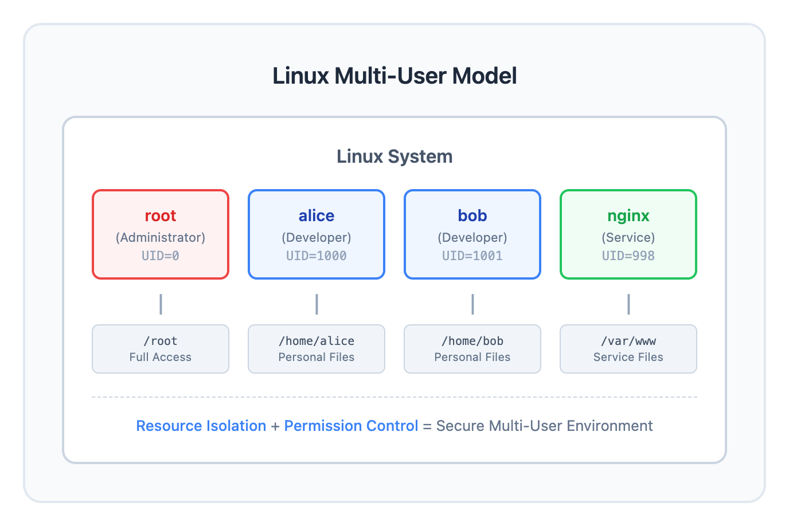
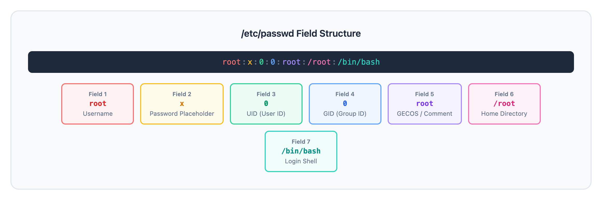

# 01 - 用户与用户组（Users and Groups）

> **目标**：掌握 Linux 多用户系统的账户管理，学会创建和管理用户与组  
> **前置**：基础 Linux 命令行操作（cd, ls, cat, nano/vim）  
> **时间**：⚡ 25 分钟（速读）/ 🔬 90 分钟（完整实操）  
> **实战场景**：新员工入职时的账户创建与权限分配  

---

## 将学到的内容

1. 理解 Linux 多用户模型（multi-user model）
2. 读懂 /etc/passwd 和 /etc/group 文件结构
3. 区分 UID/GID 的不同范围（系统账户 vs 普通用户）
4. 使用 useradd、usermod、userdel 管理用户
5. 使用 groupadd、groupmod、groupdel 管理用户组
6. 理解主组（primary group）与附加组（supplementary groups）

---

## 先跑起来！（5 分钟）

> 在学习理论之前，先体验用户管理的基本操作。  
> 运行这些命令，观察输出 -- 这就是你将要掌握的技能。  

```bash
# 查看当前用户信息
whoami
id

# 查看系统中有哪些用户（只看用户名）
cut -d: -f1 /etc/passwd | head -10

# 查看系统中有哪些组
cut -d: -f1 /etc/group | head -10

# 查看自己属于哪些组
groups

# 查看 /etc/passwd 中自己的记录
grep "^$(whoami):" /etc/passwd
```

**你刚刚查看了 Linux 系统的用户和组信息！**

Linux 是**多用户操作系统**：多个用户可以同时使用同一台机器，每个用户有独立的身份、文件和权限。

现在让我们深入理解背后的原理。

---

## Step 1 -- 多用户模型：为什么需要用户？（10 分钟）

### 1.1 Linux 的多用户设计



<details>
<summary>View ASCII source</summary>

```
┌─────────────────────────────────────────────────────────────────┐
│                     Linux 系统                                   │
│                                                                  │
│  ┌──────────┐  ┌──────────┐  ┌──────────┐  ┌──────────┐        │
│  │  root    │  │  alice   │  │   bob    │  │  nginx   │        │
│  │ (管理员) │  │ (开发者) │  │ (开发者) │  │ (服务)  │        │
│  │ UID=0    │  │ UID=1000 │  │ UID=1001 │  │ UID=998  │        │
│  └────┬─────┘  └────┬─────┘  └────┬─────┘  └────┬─────┘        │
│       │             │             │             │               │
│       ▼             ▼             ▼             ▼               │
│  ┌──────────┐  ┌──────────┐  ┌──────────┐  ┌──────────┐        │
│  │ /root    │  │/home/alice│ │/home/bob │  │/var/www  │        │
│  │ 完全权限 │  │ 个人文件  │ │ 个人文件 │  │ 服务文件 │        │
│  └──────────┘  └──────────┘  └──────────┘  └──────────┘        │
│                                                                  │
│  资源隔离 + 权限控制 = 安全的多用户环境                          │
└─────────────────────────────────────────────────────────────────┘
```

</details>

### 1.2 为什么需要多用户？

| 需求 | 解决方案 |
|------|----------|
| **隔离** | 每个用户有独立的 home 目录 |
| **权限** | 文件所有权控制谁能读写 |
| **审计** | 谁做了什么操作有迹可查 |
| **服务** | 每个服务以独立用户运行（nginx, mysql） |

### 1.3 两类用户

| 类型 | UID 范围 | 特点 | 示例 |
|------|----------|------|------|
| 系统用户 | 0-999 | 运行服务，无交互登录 | root, nginx, mysql |
| 普通用户 | 1000+ | 真人使用，可交互登录 | alice, bob, tanaka |

> **UID 0 是特殊的**：只有 UID=0 的用户（即 root）拥有系统完全控制权。  

---

## Step 2 -- /etc/passwd：用户数据库（15 分钟）

### 2.1 查看 passwd 文件

```bash
# 查看文件前 10 行
head -10 /etc/passwd

# 查看某个具体用户
grep "^root:" /etc/passwd
```

### 2.2 字段解析

每行代表一个用户，用冒号 `:` 分隔 7 个字段：



<details>
<summary>View ASCII source</summary>

```
root:x:0:0:root:/root:/bin/bash
 │   │ │ │  │     │      │
 │   │ │ │  │     │      └─ 7. 登录 Shell（login shell）
 │   │ │ │  │     └──────── 6. 家目录（home directory）
 │   │ │ │  └────────────── 5. 注释/全名（GECOS field）
 │   │ │ └───────────────── 4. 主组 GID（primary group ID）
 │   │ └─────────────────── 3. 用户 UID（user ID）
 │   └───────────────────── 2. 密码占位符（实际在 /etc/shadow）
 └───────────────────────── 1. 用户名（username）
```

</details>

### 2.3 动手解析

```bash
# 解析当前用户的信息
grep "^$(whoami):" /etc/passwd

# 使用 awk 分解字段
grep "^$(whoami):" /etc/passwd | awk -F: '{
    print "用户名: " $1
    print "UID:    " $3
    print "GID:    " $4
    print "注释:   " $5
    print "家目录: " $6
    print "Shell:  " $7
}'
```

### 2.4 常见 Shell 设置

| Shell | 用途 |
|-------|------|
| `/bin/bash` | 普通交互用户 |
| `/bin/sh` | 脚本或兼容性需求 |
| `/sbin/nologin` | 禁止登录（服务账户） |
| `/bin/false` | 禁止登录（更严格） |

```bash
# 查看哪些用户不能登录
grep -E 'nologin|false' /etc/passwd | cut -d: -f1
```

---

## Step 3 -- /etc/group：组数据库（10 分钟）

### 3.1 查看 group 文件

```bash
# 查看文件前 10 行
head -10 /etc/group

# 查看特定组
grep "^wheel:" /etc/group    # RHEL/CentOS
grep "^sudo:" /etc/group     # Debian/Ubuntu
```

### 3.2 字段解析


<details>
<summary>View ASCII source</summary>

```
devteam:x:1002:alice,bob,tanaka
   │    │   │        │
   │    │   │        └─ 4. 组成员列表（逗号分隔）
   │    │   └────────── 3. 组 GID
   │    └────────────── 2. 密码占位符（很少使用）
   └─────────────────── 1. 组名
```

</details>

### 3.3 主组 vs 附加组

| 类型 | 说明 | 存储位置 |
|------|------|----------|
| 主组（primary group） | 用户创建文件时的默认组 | /etc/passwd 第 4 字段 |
| 附加组（supplementary groups） | 用户额外所属的组 | /etc/group 第 4 字段 |

```bash
# 查看自己的组信息
id

# 输出示例：
# uid=1000(alice) gid=1000(alice) groups=1000(alice),27(sudo),1002(devteam)
#                  │                       │
#                  主组                     附加组
```

---

## Step 4 -- 用户管理命令（20 分钟）

> **注意**：以下命令需要 root 权限（使用 sudo）  

### 4.1 创建用户：useradd

```bash
# 基础语法
sudo useradd [选项] 用户名

# 创建标准用户（推荐方式）
sudo useradd -m -s /bin/bash developer
#             │        │
#             │        └─ 指定 login shell
#             └────────── 创建 home 目录

# 验证用户已创建
grep "^developer:" /etc/passwd
ls -la /home/developer
```

**常用选项**：

| 选项 | 含义 | 示例 |
|------|------|------|
| `-m` | 创建 home 目录 | `-m` |
| `-s` | 指定 shell | `-s /bin/bash` |
| `-c` | 添加注释 | `-c "Developer Account"` |
| `-u` | 指定 UID | `-u 1500` |
| `-g` | 指定主组 | `-g developers` |
| `-G` | 指定附加组 | `-G docker,sudo` |
| `-d` | 指定 home 路径 | `-d /opt/developer` |

### 4.2 设置密码：passwd

```bash
# 为用户设置密码
sudo passwd developer
# 会提示输入两次密码

# 查看密码状态
sudo passwd -S developer
# 输出：developer PS 2026-01-04 0 99999 7 -1 (Password set...)
```

### 4.3 修改用户：usermod

```bash
# 添加用户到附加组（保留原有组）
sudo usermod -aG docker developer
#             │
#             └─ -a = append（追加），不加会覆盖所有附加组！

# 修改登录 shell
sudo usermod -s /bin/zsh developer

# 锁定账户
sudo usermod -L developer

# 解锁账户
sudo usermod -U developer

# 验证修改
id developer
```

> **重要**：`usermod -G` 不带 `-a` 会**覆盖**所有附加组！  

### 4.4 删除用户：userdel

```bash
# 只删除用户（保留 home 目录）
sudo userdel developer

# 删除用户并清理 home 目录
sudo userdel -r developer
#             │
#             └─ 删除 home 目录和邮件

# 验证用户已删除
grep "^developer:" /etc/passwd    # 应该无输出
```

---

## Step 5 -- 组管理命令（15 分钟）

### 5.1 创建组：groupadd

```bash
# 创建新组
sudo groupadd devteam

# 指定 GID 创建
sudo groupadd -g 2000 qagroup

# 验证
grep "^devteam:" /etc/group
```

### 5.2 修改组：groupmod

```bash
# 重命名组
sudo groupmod -n dev-team devteam

# 修改 GID
sudo groupmod -g 2001 dev-team

# 验证
grep "dev-team" /etc/group
```

### 5.3 删除组：groupdel

```bash
# 删除组
sudo groupdel dev-team

# 注意：不能删除作为某用户主组的组
```

### 5.4 查看组成员

```bash
# 方法 1：使用 getent
getent group devteam

# 方法 2：使用 members 命令（需安装）
# sudo apt install members    # Debian/Ubuntu
# members devteam

# 方法 3：使用 lid（RHEL/CentOS）
# lid -g devteam
```

---

## Step 6 -- 动手实验：新员工入职（15 分钟）

> **场景**：你是系统管理员，新员工田中（tanaka）入职开发部门。  
> 需要为他创建账户并分配到开发组。  

### 6.1 创建开发组

```bash
# 检查组是否存在
grep "^devteam:" /etc/group || sudo groupadd devteam
```

### 6.2 创建用户

```bash
# 创建用户并设置主组、附加组
sudo useradd -m \
    -s /bin/bash \
    -c "Tanaka - Developer" \
    -G devteam \
    tanaka

# 设置密码
sudo passwd tanaka
```

### 6.3 验证

```bash
# 检查用户信息
id tanaka

# 检查 passwd 记录
grep "^tanaka:" /etc/passwd

# 检查 home 目录
ls -la /home/tanaka

# 检查组成员
grep "^devteam:" /etc/group
```

### 6.4 测试登录

```bash
# 切换到新用户（需要密码）
su - tanaka

# 验证身份
whoami
id
pwd    # 应该是 /home/tanaka

# 退出
exit
```

### 6.5 清理（可选）

```bash
# 删除测试用户和组
sudo userdel -r tanaka
sudo groupdel devteam 2>/dev/null
```

---

## 反模式：常见错误

### 错误 1：创建用户时忘记 -m

```bash
# 错误：没有 -m，不创建 home 目录
sudo useradd developer
# 用户没有 home 目录，无法正常工作

# 正确：始终为交互用户创建 home 目录
sudo useradd -m -s /bin/bash developer
```

**后果**：用户登录后工作目录是 `/`，无法保存个人文件。

### 错误 2：普通用户使用 UID < 1000

```bash
# 错误：为普通用户指定系统 UID
sudo useradd -u 500 developer
# 可能与系统账户冲突

# 正确：普通用户使用 UID >= 1000
sudo useradd -m developer    # 让系统自动分配
```

**后果**：可能与软件包创建的系统用户冲突，导致权限混乱。

### 错误 3：删除用户不清理 home 目录

```bash
# 错误：只删除用户记录
sudo userdel developer
# home 目录 /home/developer 仍然存在，占用空间

# 正确：连同 home 目录一起删除
sudo userdel -r developer
```

**后果**：遗留文件占用磁盘空间，且可能包含敏感信息。

### 错误 4：usermod -G 不带 -a

```bash
# 危险！这会覆盖所有附加组
sudo usermod -G newgroup developer
# developer 现在只属于 newgroup，原来的 docker、sudo 等组都没了

# 正确：使用 -aG 追加组
sudo usermod -aG newgroup developer
```

**后果**：用户突然失去 docker、sudo 等权限，可能导致工作中断。

---

## 职场小贴士（Japan IT Context）

### 账户管理（アカウント管理）

在日本 IT 企业，账户管理是运维团队的核心职责之一。

| 日语术语 | 含义 | 典型场景 |
|----------|------|----------|
| アカウント作成 | 账户创建 | 新员工入职时 |
| アカウント削除 | 账户删除 | 员工离职时 |
| 権限変更 | 权限变更 | 岗位调动时 |
| 棚卸し（たなおろし） | 账户审计 | 定期检查 |

### 命名规范

日本企业常用的用户名规范：

```bash
# 方式 1：员工号
useradd -m -c "田中太郎" e12345

# 方式 2：姓氏拼音
useradd -m -c "田中太郎" tanaka

# 方式 3：姓氏 + 名字首字母
useradd -m -c "田中太郎" tanaka_t
```

### 定期审计（棚卸し）

```bash
# 列出所有普通用户（UID >= 1000）
awk -F: '$3 >= 1000 && $3 < 65534 {print $1, $5}' /etc/passwd

# 查看最近登录记录
lastlog | grep -v "Never"

# 查看长期未登录的账户
lastlog | awk '$NF != "in" && $NF != "**" {print $1}' | head -20
```

**重要**：离职员工的账户必须及时删除或禁用（退職時のアカウント無効化）。

---

## 检查清单

完成本课后，你应该能够：

- [ ] 解释 Linux 多用户模型的意义
- [ ] 读懂 /etc/passwd 的 7 个字段
- [ ] 读懂 /etc/group 的 4 个字段
- [ ] 区分系统用户（UID < 1000）和普通用户
- [ ] 使用 `useradd -m -s /bin/bash` 创建用户
- [ ] 使用 `passwd` 设置用户密码
- [ ] 使用 `usermod -aG` 添加用户到附加组（注意 -a！）
- [ ] 使用 `userdel -r` 完全删除用户
- [ ] 使用 `groupadd` 和 `groupdel` 管理组
- [ ] 使用 `id` 和 `groups` 验证用户信息

---

## 本课小结

| 概念 | 命令/文件 | 记忆点 |
|------|-----------|--------|
| 用户数据库 | `/etc/passwd` | 7 个字段，冒号分隔 |
| 组数据库 | `/etc/group` | 4 个字段，成员逗号分隔 |
| 查看用户信息 | `id`, `whoami` | id 显示所有组 |
| 创建用户 | `useradd -m -s` | 必须加 -m 创建 home |
| 设置密码 | `passwd` | 新用户必须设置 |
| 修改用户 | `usermod -aG` | 加组必须带 -a |
| 删除用户 | `userdel -r` | 加 -r 清理 home |
| 创建组 | `groupadd` | 可用 -g 指定 GID |
| 删除组 | `groupdel` | 主组不能删除 |

---

## 延伸阅读

- [Linux man page: useradd](https://man7.org/linux/man-pages/man8/useradd.8.html)
- [Linux man page: passwd (file)](https://man7.org/linux/man-pages/man5/passwd.5.html)
- 下一课：[02 - 密码与账户管理](../02-password-account-management/) -- 学习密码策略、账户锁定与审计
- 相关课程：[06 - sudo 配置](../06-sudo-configuration/) -- 权限提升的安全管理

---

## 系列导航

[系列首页](../) | [02 - 密码与账户管理 -->](../02-password-account-management/)
