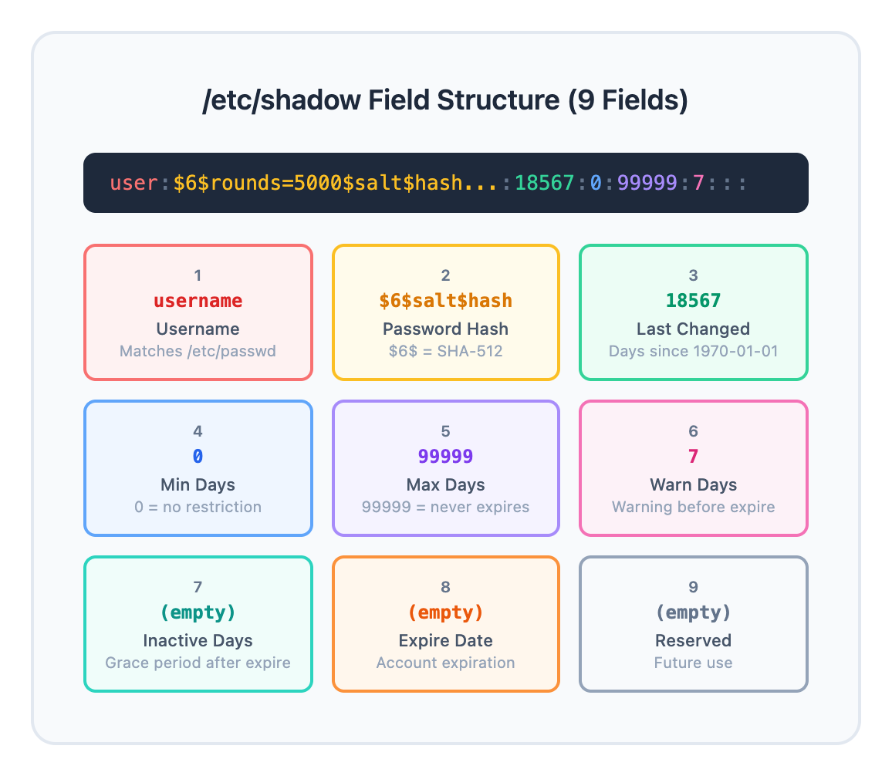
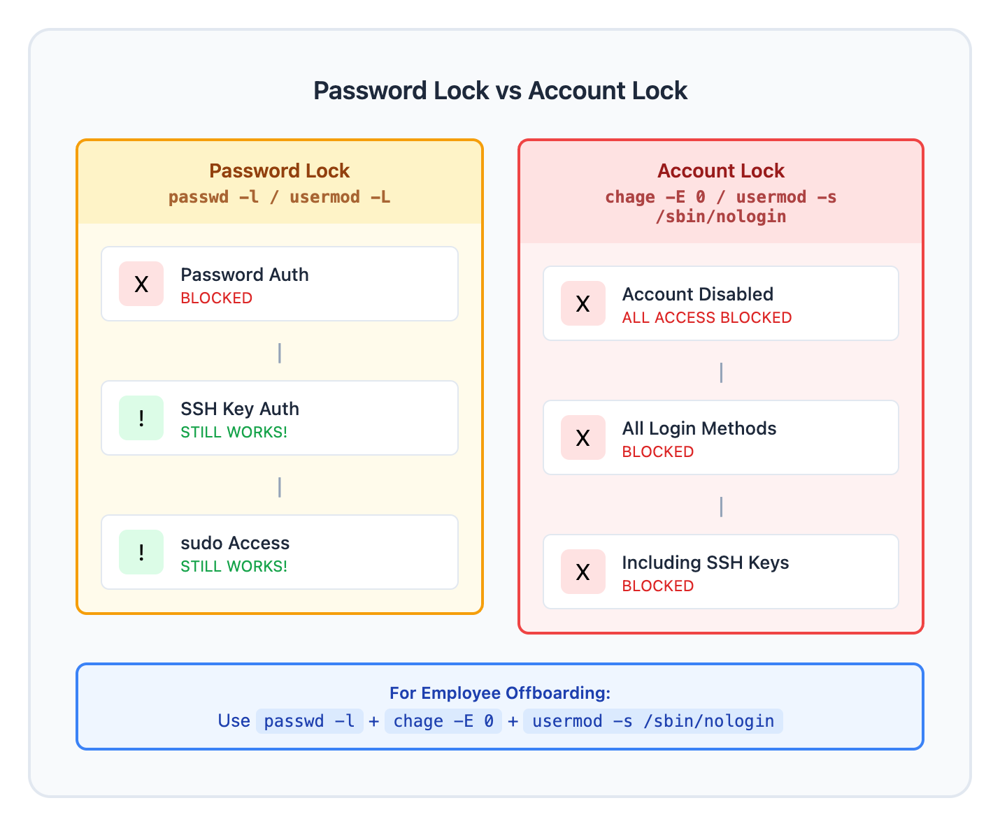
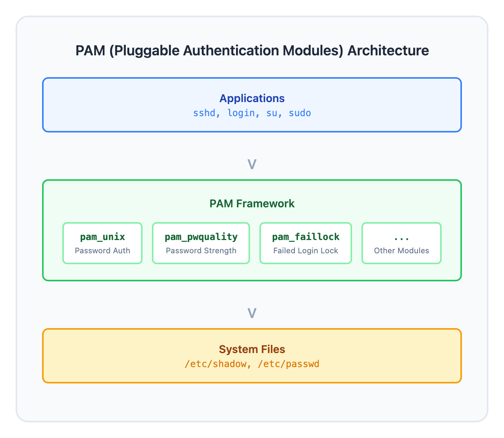

# 02 - Password and Account Management / 密码与账户管理

> **目标**：掌握 Linux 密码管理和账户安全配置  
> **前置**：完成 Lesson 01（用户与用户组）  
> **时间**：⚡ 25 分钟（速读）/ 🔬 90 分钟（完整实操）  
> **实战场景**：员工入职/离职时的账户安全管理  

---

## 将学到的内容

1. 理解 `/etc/shadow` 文件结构和密码哈希
2. 使用 `chage` 配置密码老化策略
3. 使用 `passwd` 锁定/解锁账户
4. 区分 **账户锁定** 和 **密码锁定**
5. 配置登录 shell（nologin vs false）
6. 使用 `lastlog` 和 `faillog` 审计账户
7. 配置 PAM 实现密码复杂度和账户锁定策略

---

## 先跑起来！（5 分钟）

> 在学习理论之前，先体验密码管理的威力。  
> 需要 root 权限运行以下命令。  

```bash
# 查看当前用户的密码老化信息
sudo chage -l $(whoami)

# 查看 shadow 文件中的密码哈希（前几行）
sudo head -3 /etc/shadow

# 查看最近登录记录
lastlog | head -10

# 查看失败的登录尝试（如果有的话）
sudo faillog -a 2>/dev/null | head -10
```

**你刚刚查看了 Linux 密码管理的核心！**

- `chage -l` 显示密码过期策略
- `/etc/shadow` 存储加密后的密码
- `lastlog` 和 `faillog` 用于安全审计

现在让我们深入理解每个概念。

---

## Step 1 - /etc/shadow 文件结构（15 分钟）

### 1.1 为什么需要 shadow 文件？

早期 Unix 系统把密码哈希存在 `/etc/passwd` 中，但该文件需要所有用户可读（因为包含用户信息）。这意味着任何人都能获取密码哈希并尝试破解。

**解决方案**：把敏感信息移到 `/etc/shadow`，只有 root 可读。

```bash
# 查看权限差异
ls -l /etc/passwd /etc/shadow
# -rw-r--r-- 1 root root   2834 Jan  1 10:00 /etc/passwd
# -rw-r----- 1 root shadow 1534 Jan  1 10:00 /etc/shadow
```

### 1.2 shadow 文件的 9 个字段

```bash
# 查看一条 shadow 记录
sudo grep "^$(whoami):" /etc/shadow
```

输出格式：
```
username:$6$salt$hash:18567:0:99999:7:::
```



<details>
<summary>View ASCII source</summary>

```
用户名   密码哈希（加密后）              最后修改  最小  最大  警告  不活跃  过期    保留
  |           |                           |      |    |    |     |      |       |
  v           v                           v      v    v    v     v      v       v
┌─────┬───────────────────────────────┬───────┬────┬─────┬────┬─────┬───────┬───────┐
│user │ $6$rounds=5000$salt$hash...   │ 18567 │  0 │99999│  7 │     │       │       │
└─────┴───────────────────────────────┴───────┴────┴─────┴────┴─────┴───────┴───────┘
  1              2                        3      4    5     6    7      8       9
```

</details>

| 字段 | 名称 | 说明 | 常见值 |
|------|------|------|--------|
| 1 | username | 用户名 | 与 /etc/passwd 对应 |
| 2 | password | 加密密码 | `$6$...` (SHA-512) |
| 3 | lastchange | 最后修改日期 | 从 1970-01-01 起的天数 |
| 4 | min | 最短使用天数 | 0 = 无限制 |
| 5 | max | 最长使用天数 | 99999 = 无限制 |
| 6 | warn | 过期前警告天数 | 7 天常见 |
| 7 | inactive | 过期后宽限天数 | 空 = 无宽限期 |
| 8 | expire | 账户过期日期 | 空 = 永不过期 |
| 9 | reserved | 保留字段 | 未使用 |

### 1.3 密码哈希格式

密码字段的格式：`$id$salt$hash`

```bash
# 常见的哈希算法标识
# $1$ = MD5     （已废弃，不安全）
# $5$ = SHA-256 （可接受）
# $6$ = SHA-512 （推荐，现代 Linux 默认）
# $y$ = yescrypt（新一代，部分发行版支持）

# 查看系统默认使用的哈希算法
grep "^ENCRYPT_METHOD" /etc/login.defs
```

### 1.4 特殊密码标记

| 标记 | 含义 |
|------|------|
| `!` 或 `!!` | 密码被锁定 |
| `*` | 账户被禁用（系统账户常见） |
| 空 | 无密码（危险！） |
| `!$6$...` | 锁定的密码（! 前缀） |

```bash
# 查看系统账户的密码字段（通常是 * 或 !!）
sudo grep "^daemon:" /etc/shadow
sudo grep "^nobody:" /etc/shadow
```

---

## Step 2 - 密码老化策略 chage（20 分钟）

### 2.1 查看当前策略

```bash
# 查看指定用户的密码策略
sudo chage -l testuser

# 输出示例：
# Last password change                : Jan 01, 2026
# Password expires                    : never
# Password inactive                   : never
# Account expires                     : never
# Minimum number of days between password change : 0
# Maximum number of days between password change : 99999
# Number of days of warning before password expires : 7
```

### 2.2 配置密码老化

```bash
# 创建测试用户（如果还没有）
sudo useradd -m -s /bin/bash testuser
sudo passwd testuser  # 设置密码

# 设置密码策略
# -M 90  : 密码最长使用 90 天
# -m 7   : 密码至少使用 7 天才能再次修改
# -W 14  : 过期前 14 天开始警告
# -I 30  : 过期后 30 天内可以登录修改密码，之后账户锁定
sudo chage -M 90 -m 7 -W 14 -I 30 testuser

# 验证设置
sudo chage -l testuser
```

### 2.3 设置账户过期日期

```bash
# 设置账户在特定日期过期（合同工、实习生常用）
sudo chage -E 2026-03-31 testuser

# 取消账户过期限制
sudo chage -E -1 testuser

# 查看变更
sudo chage -l testuser
```

### 2.4 强制用户下次登录修改密码

```bash
# 方法 1：使用 chage
sudo chage -d 0 testuser

# 方法 2：使用 passwd -e（效果相同）
sudo passwd -e testuser

# 验证：lastchange 变成 password must be changed
sudo chage -l testuser
```

### 2.5 修改全局默认策略

新用户的默认密码策略在 `/etc/login.defs` 中定义：

```bash
# 查看默认值
grep -E "^PASS_MAX_DAYS|^PASS_MIN_DAYS|^PASS_WARN_AGE" /etc/login.defs

# 典型输出：
# PASS_MAX_DAYS   99999
# PASS_MIN_DAYS   0
# PASS_WARN_AGE   7
```

> **注意**：修改 `/etc/login.defs` 只影响新创建的用户，不影响现有用户。  

---

## Step 3 - passwd 命令高级用法（15 分钟）

### 3.1 锁定和解锁密码

```bash
# 锁定用户密码
sudo passwd -l testuser

# 查看锁定状态
sudo passwd -S testuser
# testuser LK 2026-01-01 7 90 14 30 (Password locked.)
#           ^^ LK = Locked

# 尝试登录（使用另一个终端）
# su - testuser  # 会失败：Authentication failure

# 解锁密码
sudo passwd -u testuser

# 再次查看状态
sudo passwd -S testuser
# testuser PS 2026-01-01 7 90 14 30 (Password set, SHA512 crypt.)
#           ^^ PS = Password Set
```

### 3.2 passwd -S 状态码解读

| 状态 | 含义 |
|------|------|
| PS | Password Set（密码已设置） |
| LK | Locked（密码被锁定） |
| NP | No Password（无密码） |

### 3.3 密码锁定的原理

```bash
# 查看锁定前后 shadow 文件的变化
sudo grep "^testuser:" /etc/shadow
# testuser:$6$xxxxx...

sudo passwd -l testuser
sudo grep "^testuser:" /etc/shadow
# testuser:!$6$xxxxx...  <- 注意密码前面多了 !

sudo passwd -u testuser
sudo grep "^testuser:" /etc/shadow
# testuser:$6$xxxxx...   <- ! 被移除了
```

### 3.4 设置空密码（危险操作）

```bash
# 删除用户密码（仅用于演示，生产环境禁止！）
sudo passwd -d testuser

# 查看状态
sudo passwd -S testuser
# testuser NP ...  (Empty password.)

# 立即恢复密码
sudo passwd testuser
```

---

## Step 4 - 账户锁定 vs 密码锁定（10 分钟）

### 4.1 关键区别

这是一个**非常重要的安全概念**：



<details>
<summary>View ASCII source</summary>

```
┌─────────────────────────────────────────────────────────────────────┐
│                        访问控制层次                                  │
├─────────────────────────────────────────────────────────────────────┤
│                                                                     │
│   密码锁定 (passwd -l)              账户锁定 (usermod -L 或过期)    │
│   ──────────────────                ────────────────────────────    │
│                                                                     │
│   ┌─────────────┐                   ┌─────────────┐                 │
│   │  密码认证   │ ← 被阻止          │   账户本身   │ ← 被禁用        │
│   └─────────────┘                   └─────────────┘                 │
│          │                                 │                        │
│          ▼                                 ▼                        │
│   ┌─────────────┐                   ┌─────────────┐                 │
│   │  SSH 密钥   │ ← 仍然有效！       │  所有登录    │ ← 全部阻止      │
│   └─────────────┘                   └─────────────┘                 │
│          │                                 │                        │
│          ▼                                 ▼                        │
│   ┌─────────────┐                   ┌─────────────┐                 │
│   │  sudo 权限  │ ← 仍然有效！       │  包括SSH密钥 │ ← 全部阻止      │
│   └─────────────┘                   └─────────────┘                 │
│                                                                     │
└─────────────────────────────────────────────────────────────────────┘
```

</details>

| 方法 | 阻止密码登录 | 阻止 SSH 密钥登录 | 阻止 sudo |
|------|--------------|-------------------|-----------|
| `passwd -l` | Yes | **No** | No |
| `usermod -L` | Yes | **No** | No |
| `chage -E 0` | Yes | Yes | Yes |
| `usermod -s /sbin/nologin` | Yes | Yes | Yes |

### 4.2 安全的账户禁用方法

```bash
# 完全禁用账户的推荐步骤（离职员工处理）

# 1. 锁定密码
sudo passwd -l testuser

# 2. 设置账户过期
sudo chage -E 0 testuser

# 3. 可选：更改登录 shell
sudo usermod -s /sbin/nologin testuser

# 验证
sudo chage -l testuser
# Account expires: Jan 01, 1970  (已过期)

grep "^testuser:" /etc/passwd
# ... :/sbin/nologin  (无法获得 shell)
```

### 4.3 nologin vs /bin/false

两者都可以阻止用户登录，但有细微差别：

```bash
# /sbin/nologin - 会显示消息然后退出
# /bin/false    - 直接退出，无消息

# 查看 nologin 消息
cat /etc/nologin.txt 2>/dev/null || echo "文件不存在时使用默认消息"

# 系统账户通常使用 nologin
grep nologin /etc/passwd | head -3
```

| 类型 | 适用场景 |
|------|----------|
| `/sbin/nologin` | 服务账户、临时禁用的用户 |
| `/bin/false` | 仅用于 FTP/SFTP 的账户 |

---

## Step 5 - 登录审计（10 分钟）

### 5.1 lastlog - 最后登录记录

```bash
# 显示所有用户最后登录时间
lastlog

# 只显示最近 30 天内登录过的用户
lastlog -t 30

# 查看特定用户
lastlog -u testuser
```

### 5.2 faillog - 失败登录记录

```bash
# 显示所有失败的登录尝试
sudo faillog -a

# 查看特定用户的失败记录
sudo faillog -u testuser

# 重置失败计数（解锁因多次失败被锁定的账户）
sudo faillog -r -u testuser
```

### 5.3 其他审计命令

```bash
# last - 登录历史记录
last | head -20

# lastb - 失败的登录尝试（需要 /var/log/btmp 存在）
sudo lastb | head -10

# who - 当前登录用户
who

# w - 当前登录用户及其活动
w
```

### 5.4 日志文件位置

| 发行版 | 认证日志 |
|--------|----------|
| RHEL/CentOS | `/var/log/secure` |
| Debian/Ubuntu | `/var/log/auth.log` |
| systemd 系统 | `journalctl -u sshd` |

```bash
# 查看最近的认证日志
sudo tail -20 /var/log/auth.log 2>/dev/null || \
sudo tail -20 /var/log/secure 2>/dev/null || \
sudo journalctl -u sshd --since "1 hour ago"
```

---

## Step 6 - PAM 基础配置（25 分钟）

### 6.1 什么是 PAM？

PAM (Pluggable Authentication Modules) 是 Linux 的可插拔认证框架。它让系统管理员可以灵活配置认证策略，而不需要修改应用程序代码。



<details>
<summary>View ASCII source</summary>

```
┌─────────────────────────────────────────────────────────────────────┐
│                        应用程序 (sshd, login, su)                    │
└───────────────────────────────┬─────────────────────────────────────┘
                                │
                                ▼
┌─────────────────────────────────────────────────────────────────────┐
│                           PAM 框架                                   │
├─────────────────────────────────────────────────────────────────────┤
│                                                                     │
│   ┌─────────────┐  ┌─────────────┐  ┌─────────────┐  ┌───────────┐ │
│   │  pam_unix   │  │pam_pwquality│  │ pam_faillock│  │  其他模块  │ │
│   │ (密码认证)   │  │ (密码强度)   │  │ (失败锁定)  │  │    ...    │ │
│   └─────────────┘  └─────────────┘  └─────────────┘  └───────────┘ │
│                                                                     │
└─────────────────────────────────────────────────────────────────────┘
                                │
                                ▼
┌─────────────────────────────────────────────────────────────────────┐
│                     /etc/shadow, /etc/passwd                         │
└─────────────────────────────────────────────────────────────────────┘
```

</details>

### 6.2 PAM 配置文件结构

```bash
# PAM 配置文件位置
ls /etc/pam.d/

# 常见配置文件
# /etc/pam.d/system-auth   - 系统认证（RHEL/CentOS）
# /etc/pam.d/common-auth   - 通用认证（Debian/Ubuntu）
# /etc/pam.d/sshd          - SSH 登录
# /etc/pam.d/su            - su 命令
# /etc/pam.d/sudo          - sudo 命令
```

PAM 配置行格式：
```
type    control    module-path    [module-arguments]
```

| 字段 | 说明 | 常见值 |
|------|------|--------|
| type | 模块类型 | auth, account, password, session |
| control | 控制标志 | required, requisite, sufficient, optional |
| module-path | 模块路径 | pam_unix.so, pam_pwquality.so |
| arguments | 模块参数 | 因模块而异 |

---

> **安全警告 - 请务必阅读！**  
>
> PAM 配置错误可能导致你完全无法登录系统！  
>
> **在修改任何 PAM 配置之前，请执行以下步骤：**  
>
> 1. **保持一个 root 终端会话打开** - 不要关闭它  
> 2. **在新终端中测试登录** - 验证修改是否正确  
> 3. **准备好恢复方案** - 控制台访问或 Live CD  
> 4. **备份配置文件** - 修改前先复制  
>
> ```bash  
> # 备份 PAM 配置  
> sudo cp -r /etc/pam.d /etc/pam.d.backup  
>
> # 如果是 RHEL/CentOS，还要备份 authconfig 相关文件  
> sudo cp /etc/security/pwquality.conf /etc/security/pwquality.conf.backup  
> ```  

---

### 6.3 配置密码复杂度（pam_pwquality）

pam_pwquality 模块用于强制密码强度要求。

```bash
# 查看当前密码策略配置
cat /etc/security/pwquality.conf

# 编辑密码复杂度配置
sudo nano /etc/security/pwquality.conf
```

常用配置选项：

```bash
# /etc/security/pwquality.conf

# 最小密码长度
minlen = 12

# 最少数字字符
dcredit = -1

# 最少大写字母
ucredit = -1

# 最少小写字母
lcredit = -1

# 最少特殊字符
ocredit = -1

# 最大连续相同字符
maxrepeat = 3

# 新密码与旧密码至少不同的字符数
difok = 5

# 禁止使用用户名
usercheck = 1

# 禁止使用字典词
dictcheck = 1
```

### 6.4 动手练习：配置密码复杂度

```bash
# 步骤 1：备份现有配置
sudo cp /etc/security/pwquality.conf /etc/security/pwquality.conf.bak

# 步骤 2：设置密码复杂度要求
sudo tee /etc/security/pwquality.conf.d/custom.conf << 'EOF'
# 企业密码策略
minlen = 12
dcredit = -1
ucredit = -1
lcredit = -1
ocredit = -1
maxrepeat = 3
usercheck = 1
EOF

# 步骤 3：测试密码复杂度（使用测试用户）
# 先在另一个终端保持 root 登录！
sudo passwd testuser
# 尝试简单密码如 "password" - 应该被拒绝
# 尝试复杂密码如 "MyC0mplex!Pass123" - 应该被接受

# 如果出问题，恢复备份：
# sudo cp /etc/security/pwquality.conf.bak /etc/security/pwquality.conf
```

### 6.5 配置账户锁定（pam_faillock）

pam_faillock 模块用于在多次登录失败后锁定账户。

> **注意**：在较旧的系统上可能使用 `pam_tally2`，但它已被废弃。现代系统使用 `pam_faillock`。  

**RHEL/CentOS 8+ 配置：**

```bash
# 查看当前 faillock 配置
cat /etc/security/faillock.conf

# 编辑配置
sudo nano /etc/security/faillock.conf
```

```bash
# /etc/security/faillock.conf

# 5 次失败后锁定
deny = 5

# 锁定持续时间（秒），0 = 永久锁定直到管理员解锁
unlock_time = 900

# 失败计数有效期（秒）
fail_interval = 900

# 是否也对 root 用户生效
even_deny_root = false

# root 用户锁定时间（如果启用）
root_unlock_time = 60

# 审计目录
dir = /var/run/faillock
```

**Debian/Ubuntu 配置：**

需要手动编辑 PAM 配置文件：

```bash
# 备份原始配置
sudo cp /etc/pam.d/common-auth /etc/pam.d/common-auth.bak

# 编辑 common-auth
sudo nano /etc/pam.d/common-auth
```

在文件开头添加：
```
auth    required    pam_faillock.so preauth silent deny=5 unlock_time=900
auth    [default=die] pam_faillock.so authfail deny=5 unlock_time=900
```

### 6.6 动手练习：测试账户锁定

```bash
# 确保 faillock 配置正确后...

# 查看用户锁定状态
sudo faillock --user testuser

# 模拟失败登录（使用错误密码）
# 在另一个终端尝试：
# su - testuser  # 输入错误密码 5 次

# 查看锁定记录
sudo faillock --user testuser

# 解锁用户
sudo faillock --user testuser --reset

# 验证已解锁
sudo faillock --user testuser
```

### 6.7 常用 PAM 模块一览

| 模块 | 功能 | 配置文件 |
|------|------|----------|
| pam_unix | 标准密码认证 | /etc/shadow |
| pam_pwquality | 密码强度检查 | /etc/security/pwquality.conf |
| pam_faillock | 登录失败锁定 | /etc/security/faillock.conf |
| pam_limits | 资源限制 | /etc/security/limits.conf |
| pam_wheel | 限制 su 使用 | /etc/pam.d/su |
| pam_securetty | root 登录终端限制 | /etc/securetty |

---

## 反模式：常见错误

### 错误 1：在脚本中存储明文密码

```bash
# 危险！密码明文存储在脚本中
#!/bin/bash
mysql -u admin -p'MyPassword123' -e "SELECT * FROM users"

# 正确做法：使用配置文件或凭证管理器
# MySQL 示例：~/.my.cnf（权限 600）
# [client]
# user=admin
# password=MyPassword123

# 或使用环境变量（仍然不够安全，但好于硬编码）
mysql -u admin -p"${MYSQL_PASSWORD}" -e "SELECT * FROM users"

# 最佳实践：使用 vault 或凭证管理服务
```

### 错误 2：密码永不过期

```bash
# 危险！密码永不过期
sudo chage -M 99999 username

# 问题：
# - 密码可能已被泄露但仍在使用
# - 不符合安全合规要求
# - 员工离职后密码仍然有效

# 正确做法：设置合理的过期策略
sudo chage -M 90 -W 14 username  # 90 天过期，提前 14 天警告
```

### 错误 3：混淆密码锁定和账户锁定

```bash
# 常见误解：认为 passwd -l 能阻止所有登录

# 危险场景：
sudo passwd -l exemployee
# 该用户仍然可以用 SSH 密钥登录！

# 正确做法：完全禁用账户
sudo passwd -l exemployee
sudo chage -E 0 exemployee
sudo usermod -s /sbin/nologin exemployee

# 更彻底：移除 SSH 密钥
sudo rm -f /home/exemployee/.ssh/authorized_keys
```

### 错误 4：不测试 PAM 配置就关闭终端

```bash
# 致命错误：修改 PAM 配置后直接关闭终端

# 正确流程：
# 1. 保持当前 root 终端打开
# 2. 修改 PAM 配置
# 3. 打开新终端测试登录
# 4. 确认正常后才关闭旧终端

# 如果被锁在外面：
# - 使用控制台 (console) 登录
# - 使用 Live CD 挂载系统分区，恢复 PAM 配置
# - 云服务器可使用 serial console 或 rescue mode
```

---

## 职场小贴士（Japan IT Context）

### 密码策略合规要求

在日本企业环境中，密码管理有严格的合规要求：

| 日语术语 | 含义 | 技术实现 |
|----------|------|----------|
| パスワードポリシー | 密码策略 | `/etc/security/pwquality.conf` |
| 定期変更 | 定期更换 | `chage -M 90` |
| 複雑性要件 | 复杂度要求 | `minlen`, `dcredit`, `ucredit` |
| アカウントロック | 账户锁定 | `pam_faillock` |

### 员工离职处理（退職時のアカウント無効化）

日本公司对离职员工的账户处理非常严格：

```bash
# 离职当天的标准操作流程
# 1. 确认离职时间（人事部门通知）
# 2. 立即禁用账户

# 离职员工处理脚本示例
EXEMPLOYEE="tanaka"
DATE=$(date +%Y%m%d)

# 锁定密码
sudo passwd -l ${EXEMPLOYEE}

# 设置账户过期
sudo chage -E $(date +%Y-%m-%d) ${EXEMPLOYEE}

# 更改 shell
sudo usermod -s /sbin/nologin ${EXEMPLOYEE}

# 记录操作日志（障害報告用）
echo "[${DATE}] Account ${EXEMPLOYEE} disabled by $(whoami)" | \
  sudo tee -a /var/log/account_changes.log
```

### 审计日志要求

SOC2、ISMS 等合规框架要求保留认证日志：

```bash
# 定期审计命令
# 查看从未登录的账户
lastlog | grep "Never logged in"

# 查看长期未登录的账户（超过 90 天）
lastlog -b 90

# 导出账户状态报告
for user in $(awk -F: '$3 >= 1000 {print $1}' /etc/passwd); do
  echo -n "${user}: "
  sudo passwd -S ${user}
done > /tmp/account_audit_$(date +%Y%m%d).txt
```

---

## 检查清单

完成本课后，你应该能够：

- [ ] 解释 `/etc/shadow` 的 9 个字段含义
- [ ] 识别密码哈希算法（$6$ = SHA-512）
- [ ] 使用 `chage` 配置密码老化策略
- [ ] 使用 `passwd -l/-u` 锁定/解锁密码
- [ ] 区分密码锁定和账户锁定的区别
- [ ] 理解 `nologin` 和 `/bin/false` 的用途
- [ ] 使用 `lastlog` 和 `faillog` 审计账户
- [ ] 配置 `pam_pwquality` 强制密码复杂度
- [ ] 配置 `pam_faillock` 实现登录失败锁定
- [ ] 安全地测试 PAM 配置（保持备份会话）

---

## 本课小结

| 概念 | 命令/文件 | 记忆点 |
|------|-----------|--------|
| 密码存储 | `/etc/shadow` | 只有 root 可读 |
| 哈希算法 | `$6$` | SHA-512，现代标准 |
| 密码老化 | `chage -M/-m/-W` | 过期/最短/警告天数 |
| 强制改密 | `passwd -e` 或 `chage -d 0` | 下次登录必须改密 |
| 密码锁定 | `passwd -l/-u` | 只阻止密码认证 |
| 账户锁定 | `chage -E 0` | 完全禁止登录 |
| 登录 shell | `/sbin/nologin` | 服务账户、临时禁用 |
| 登录审计 | `lastlog`, `faillog` | 安全合规必备 |
| 密码强度 | `pam_pwquality` | `/etc/security/pwquality.conf` |
| 失败锁定 | `pam_faillock` | 防止暴力破解 |

---

## 延伸阅读

- [Linux Shadow Password HOWTO](https://tldp.org/HOWTO/Shadow-Password-HOWTO.html)
- [PAM System Administrators' Guide](https://www.linux-pam.org/Linux-PAM-html/Linux-PAM_SAG.html)
- [RHEL Security Hardening Guide](https://access.redhat.com/documentation/en-us/red_hat_enterprise_linux/8/html/security_hardening/index)
- 相关课程：[Lesson 06 - sudo 配置](../06-sudo-configuration/) - 学习权限提升管理

---

## 系列导航

[上一课：01 - 用户与用户组](../01-users-and-groups/) | [系列首页](../) | [下一课：03 - 文件权限基础 ->](../03-file-permissions-fundamentals/)
