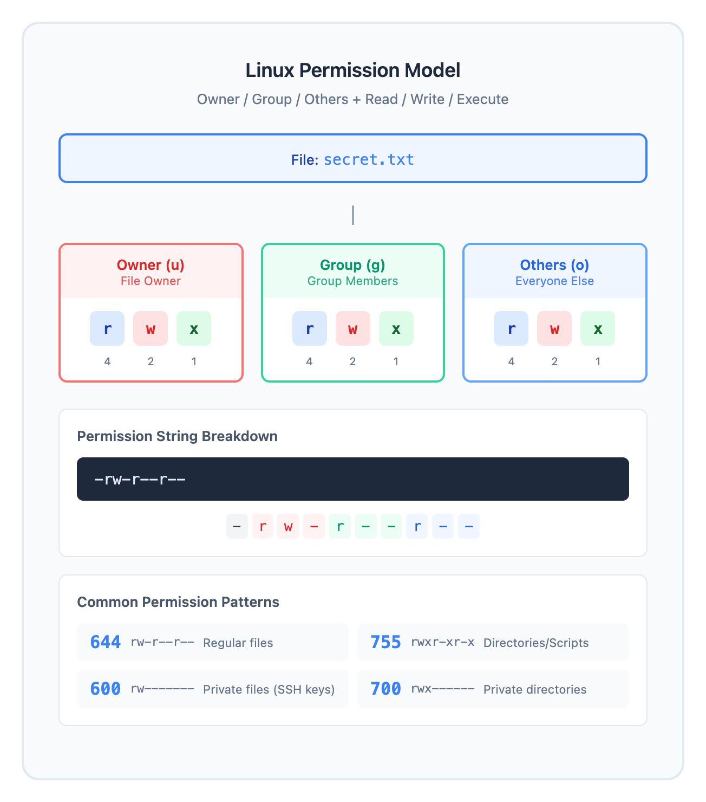
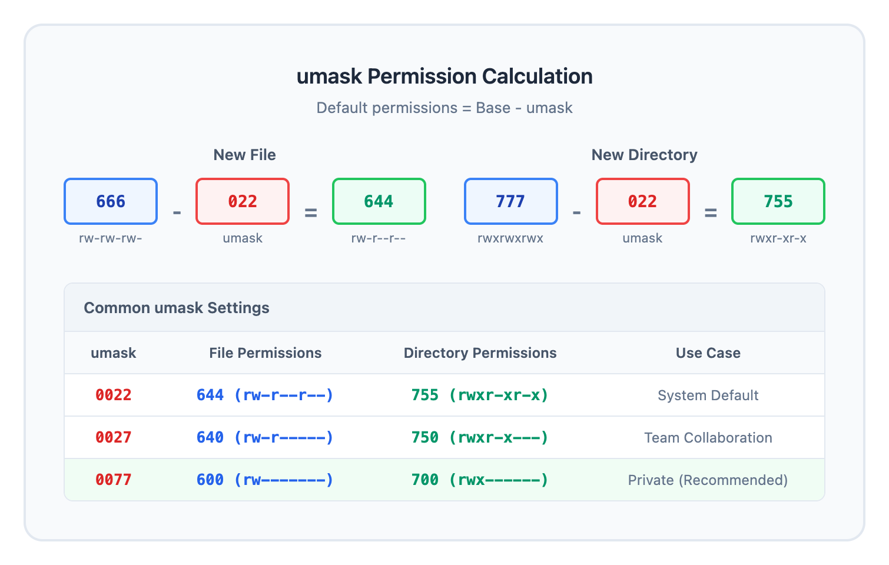

# 03 · 文件权限基础（File Permissions Fundamentals）

> **目标**：掌握 Linux 权限模型，学会正确设置文件和目录权限  
> **前置**：完成 Lesson 01-02（用户与用户组管理）  
> **时间**：2-2.5 小时  
> **实战场景**：团队协作目录配置、安全权限审计  

---

## 将学到的内容

1. 理解 Linux 权限模型（owner, group, others）
2. 读懂权限字符串（rwxrwxrwx）和八进制表示
3. 使用 chmod 修改权限（符号模式和数字模式）
4. 使用 chown/chgrp 更改文件所有权
5. 理解 umask 对新建文件的影响
6. **避免致命错误**：为什么 `chmod 777` 是安全灾难

---

## 先跑起来！（5 分钟）

> 在学习理论之前，先体验权限控制的威力。  
> 运行这些命令，观察输出 — 这就是你将要掌握的技能。  

```bash
# 创建练习目录
mkdir -p ~/perm-lab && cd ~/perm-lab

# 创建一个测试文件
echo "机密数据" > secret.txt

# 查看当前权限
ls -l secret.txt
# 输出类似: -rw-r--r-- 1 youruser youruser 13 Jan  4 10:00 secret.txt

# 去掉其他用户的读取权限
chmod o-r secret.txt
ls -l secret.txt
# 输出: -rw-r----- 1 youruser youruser 13 Jan  4 10:00 secret.txt

# 让文件只有自己能读写
chmod 600 secret.txt
ls -l secret.txt
# 输出: -rw------- 1 youruser youruser 13 Jan  4 10:00 secret.txt

# 创建一个目录，体验目录权限
mkdir testdir
ls -ld testdir
# 输出: drwxr-xr-x 2 youruser youruser 64 Jan  4 10:00 testdir
```

**你刚刚控制了谁能访问你的文件！**

这就是 Linux 安全的基石：**精确控制每个文件的访问权限**。

现在让我们理解背后的原理。

---

## Step 1 — 权限模型：谁能做什么（15 分钟）

### 1.1 三类用户，三种权限

Linux 将访问者分为三类，每类有三种操作权限：



<details>
<summary>View ASCII source</summary>

```
Linux 权限模型 (Permission Model)
═══════════════════════════════════════════════════════════════════════════

                        ┌─────────────────────────────────┐
                        │         文件 (File)              │
                        │         secret.txt              │
                        └──────────────┬──────────────────┘
                                       │
        ┌──────────────────────────────┼──────────────────────────────┐
        │                              │                              │
        ▼                              ▼                              ▼
┌───────────────┐            ┌───────────────┐            ┌───────────────┐
│   Owner (u)   │            │   Group (g)   │            │  Others (o)   │
│   文件所有者   │            │   所属用户组   │            │   其他用户    │
├───────────────┤            ├───────────────┤            ├───────────────┤
│  r  w  x      │            │  r  w  x      │            │  r  w  x      │
│  读 写 执行    │            │  读 写 执行    │            │  读 写 执行    │
│  4  2  1      │            │  4  2  1      │            │  4  2  1      │
└───────────────┘            └───────────────┘            └───────────────┘

权限字符串解读:
-rw-r--r--  →  类型 | owner权限 | group权限 | others权限
 │└┬┘└┬┘└┬┘
 │ │  │  └── others: r-- (只读)
 │ │  └───── group:  r-- (只读)
 │ └──────── owner:  rw- (读写)
 └────────── 文件类型: - (普通文件)

八进制换算:
r = 4    w = 2    x = 1
rw- = 4+2+0 = 6
r-- = 4+0+0 = 4
r-x = 4+0+1 = 5

常见权限组合:
644 = rw-r--r--  (普通文件默认)
755 = rwxr-xr-x  (目录/可执行文件)
600 = rw-------  (私密文件)
700 = rwx------  (私密目录)
```

</details>

### 1.2 权限字符串解读

```bash
# 查看详细权限
ls -l secret.txt
# -rw-r--r-- 1 alice developers 13 Jan  4 10:00 secret.txt
#  │└──┬──┘│ │  │     │
#  │   │   │ │  │     └── 所属组 (group)
#  │   │   │ │  └──────── 所有者 (owner)
#  │   │   │ └─────────── 硬链接数
#  │   │   └───────────── 权限位 (9个字符)
#  │   └───────────────── 详见下表
#  └───────────────────── 文件类型
```

**文件类型标识**：

| 字符 | 类型 | 说明 |
|------|------|------|
| `-` | 普通文件 | 文本、二进制、脚本等 |
| `d` | 目录 | directory |
| `l` | 符号链接 | symbolic link |
| `b` | 块设备 | 磁盘等 |
| `c` | 字符设备 | 终端等 |

### 1.3 rwx 在文件和目录上的区别

这是**最容易混淆**的概念之一：

| 权限 | 对文件 | 对目录 |
|------|--------|--------|
| r (read) | 读取内容 | 列出目录内容（ls） |
| w (write) | 修改内容 | 创建/删除/重命名文件 |
| x (execute) | 执行程序 | **进入目录**（cd） |

**重要**：目录的 `x` 权限是**访问**目录的钥匙！

```bash
# 实验：目录权限的影响
mkdir testdir
touch testdir/file.txt

# 去掉目录的 x 权限
chmod a-x testdir

# 尝试进入目录 — 失败！
cd testdir
# bash: cd: testdir: Permission denied

# 尝试列出内容 — 也失败！（有 r 但没有 x）
ls testdir
# ls: cannot access 'testdir': Permission denied

# 恢复 x 权限
chmod a+x testdir
cd testdir  # 现在可以了
```

### 1.4 记忆口诀

```
文件 rwx：读内容、改内容、跑程序
目录 rwx：看清单、改文件、能进门（x = 门钥匙）
```

---

## Step 2 — chmod：修改权限（20 分钟）

### 2.1 符号模式（Symbolic Mode）

符号模式直观易读，适合日常使用：

```bash
chmod [who][operator][permission] file

# who: u(owner), g(group), o(others), a(all)
# operator: +(添加), -(移除), =(设置)
# permission: r, w, x
```

**实战示例**：

```bash
cd ~/perm-lab

# 创建测试文件
touch demo.sh
ls -l demo.sh
# -rw-r--r-- 1 youruser youruser 0 Jan  4 10:00 demo.sh

# 给所有者添加执行权限
chmod u+x demo.sh
ls -l demo.sh
# -rwxr--r-- 1 youruser youruser 0 Jan  4 10:00 demo.sh

# 移除其他用户的所有权限
chmod o-rwx demo.sh
ls -l demo.sh
# -rwxr----- 1 youruser youruser 0 Jan  4 10:00 demo.sh

# 给组添加写权限
chmod g+w demo.sh
ls -l demo.sh
# -rwxrw---- 1 youruser youruser 0 Jan  4 10:00 demo.sh

# 设置所有人只读
chmod a=r demo.sh
ls -l demo.sh
# -r--r--r-- 1 youruser youruser 0 Jan  4 10:00 demo.sh

# 多个操作组合
chmod u+wx,g+x,o= demo.sh
ls -l demo.sh
# -rwxr-x--- 1 youruser youruser 0 Jan  4 10:00 demo.sh
```

### 2.2 八进制模式（Octal Mode）

八进制模式简洁高效，适合脚本和快速设置：

```bash
# 每位数字 = r(4) + w(2) + x(1)
chmod 755 file  # rwxr-xr-x
chmod 644 file  # rw-r--r--
chmod 600 file  # rw-------
chmod 700 dir   # rwx------
```

**常用权限组合速查**：

| 八进制 | 权限字符 | 典型用途 |
|--------|----------|----------|
| 755 | rwxr-xr-x | 目录、可执行脚本 |
| 644 | rw-r--r-- | 普通文件、配置文件 |
| 600 | rw------- | 私密文件（SSH 密钥） |
| 700 | rwx------ | 私密目录 |
| 640 | rw-r----- | 组内共享文件 |
| 750 | rwxr-x--- | 组内共享目录 |
| 444 | r--r--r-- | 只读文件 |

### 2.3 递归修改（-R 参数）

```bash
# 递归修改目录及其所有内容
chmod -R 755 /path/to/dir

# 但是！这会把文件也设成可执行 — 通常不是你想要的
# 正确做法：分别设置目录和文件
find /path/to/dir -type d -exec chmod 755 {} \;
find /path/to/dir -type f -exec chmod 644 {} \;
```

---

## Step 3 — chown 和 chgrp：更改所有权（15 分钟）

### 3.1 chown 基础

```bash
# 切换到 root（需要 sudo）
# 更改文件所有者
sudo chown newuser file.txt

# 同时更改所有者和组
sudo chown newuser:newgroup file.txt
# 或使用点号（旧语法，不推荐）
sudo chown newuser.newgroup file.txt

# 只更改组（省略用户名）
sudo chown :newgroup file.txt

# 递归更改目录
sudo chown -R newuser:newgroup /path/to/dir
```

### 3.2 chgrp：单独更改组

```bash
# 更改文件所属组
sudo chgrp developers file.txt

# 递归更改
sudo chgrp -R developers /path/to/dir

# 普通用户只能改成自己所属的组
groups  # 查看自己的组
chgrp mygroup file.txt  # 只能改成自己所属的组
```

### 3.3 实战：团队协作目录

```bash
# 场景：创建一个 devteam 组的共享目录

# 1. 创建目录
sudo mkdir /opt/project

# 2. 创建组（如果不存在）
sudo groupadd devteam

# 3. 设置目录所有权
sudo chown root:devteam /opt/project

# 4. 设置权限：组成员可读写执行
sudo chmod 775 /opt/project

# 5. 验证
ls -ld /opt/project
# drwxrwxr-x 2 root devteam 64 Jan  4 10:00 /opt/project

# 6. 把用户加入组
sudo usermod -aG devteam alice
sudo usermod -aG devteam bob

# 7. 用户需要重新登录才能生效
# 或使用 newgrp devteam
```

---

## Step 4 — umask：控制默认权限（15 分钟）

### 4.1 umask 是什么？

`umask` 是一个**掩码**，决定新建文件和目录的**默认权限**。

```bash
# 查看当前 umask
umask
# 输出: 0022 (常见默认值)

# 以符号形式显示
umask -S
# 输出: u=rwx,g=rx,o=rx
```

### 4.2 umask 计算逻辑

```
新文件权限 = 666 - umask  (文件不带执行权限)
新目录权限 = 777 - umask

umask = 0022 时：
- 新文件: 666 - 022 = 644 (rw-r--r--)
- 新目录: 777 - 022 = 755 (rwxr-xr-x)

umask = 0077 时（更安全）：
- 新文件: 666 - 077 = 600 (rw-------)
- 新目录: 777 - 077 = 700 (rwx------)
```



<details>
<summary>View ASCII source</summary>

```
umask 权限计算 (Permission Calculation)
═══════════════════════════════════════════════════════════════════════════

默认最大权限:
┌─────────────────┬─────────────────┐
│    新文件        │    新目录        │
│    666          │    777          │
│  rw-rw-rw-      │  rwxrwxrwx      │
└────────┬────────┴────────┬────────┘
         │                 │
         │  减去 umask     │
         │                 │
         ▼                 ▼
    umask = 022       umask = 022
    ┌───────┐         ┌───────┐
    │ 0 2 2 │         │ 0 2 2 │
    │ --- -w- -w- │   │ --- -w- -w- │
    └───────┘         └───────┘
         │                 │
         ▼                 ▼
    最终权限           最终权限
    ┌───────┐         ┌───────┐
    │ 6 4 4 │         │ 7 5 5 │
    │ rw-r--r-- │     │ rwxr-xr-x │
    └───────┘         └───────┘

常见 umask 设置:
┌─────────┬────────────┬────────────┬─────────────────────────┐
│ umask   │ 文件权限    │ 目录权限    │ 使用场景                 │
├─────────┼────────────┼────────────┼─────────────────────────┤
│ 0022    │ 644        │ 755        │ 系统默认（多用户共享）    │
│ 0027    │ 640        │ 750        │ 组内协作                 │
│ 0077    │ 600        │ 700        │ 私密环境（推荐）         │
└─────────┴────────────┴────────────┴─────────────────────────┘
```

</details>

### 4.3 临时和永久设置 umask

```bash
# 临时设置（只对当前 shell 有效）
umask 0077

# 验证
touch secure_file
mkdir secure_dir
ls -l secure_file
# -rw------- 1 youruser youruser 0 Jan  4 10:00 secure_file
ls -ld secure_dir
# drwx------ 2 youruser youruser 64 Jan  4 10:00 secure_dir

# 永久设置 — 添加到 ~/.bashrc 或 ~/.profile
echo "umask 0077" >> ~/.bashrc

# 系统级设置（影响所有用户）
# 编辑 /etc/profile 或 /etc/login.defs
```

### 4.4 实战练习：观察 umask 效果

```bash
cd ~/perm-lab

# 当前 umask
umask
# 假设输出 0022

# 创建文件和目录
touch file1
mkdir dir1
ls -l file1
# -rw-r--r-- (644)
ls -ld dir1
# drwxr-xr-x (755)

# 更改 umask
umask 0077

# 再创建
touch file2
mkdir dir2
ls -l file2
# -rw------- (600)
ls -ld dir2
# drwx------ (700)

# 恢复默认
umask 0022
```

---

## Step 5 — 动手实验：权限场景实战（25 分钟）

### 5.1 场景 A：保护 SSH 密钥

SSH 密钥权限**必须**正确设置，否则 SSH 会拒绝使用：

```bash
# 创建模拟 SSH 目录
mkdir -p ~/.ssh-test
touch ~/.ssh-test/id_rsa
touch ~/.ssh-test/id_rsa.pub

# 错误的权限（太开放）
chmod 644 ~/.ssh-test/id_rsa

# SSH 会报错:
# WARNING: UNPROTECTED PRIVATE KEY FILE!
# Permissions 0644 for 'id_rsa' are too open.

# 正确的权限
chmod 700 ~/.ssh-test        # 目录只有所有者能访问
chmod 600 ~/.ssh-test/id_rsa     # 私钥只有所有者能读写
chmod 644 ~/.ssh-test/id_rsa.pub # 公钥可以公开

# 验证
ls -la ~/.ssh-test/
```

### 5.2 场景 B：Web 服务器目录

```bash
# 模拟 Web 目录结构
sudo mkdir -p /var/www/mysite
sudo touch /var/www/mysite/index.html
sudo mkdir /var/www/mysite/uploads

# 设置所有权（Web 服务器用户通常是 www-data 或 nginx）
sudo chown -R www-data:www-data /var/www/mysite

# 目录权限：755（Web 服务器需要进入和列出）
sudo chmod 755 /var/www/mysite

# 文件权限：644（Web 服务器需要读取）
sudo chmod 644 /var/www/mysite/index.html

# uploads 目录需要写权限（但不是 777！）
sudo chmod 755 /var/www/mysite/uploads

# 验证
ls -laR /var/www/mysite/
```

### 5.3 场景 C：团队共享开发目录

```bash
# 创建开发团队共享目录
sudo mkdir /opt/dev-project
sudo groupadd devs 2>/dev/null  # 如果组不存在则创建
sudo chown :devs /opt/dev-project
sudo chmod 775 /opt/dev-project

# 把当前用户加入组
sudo usermod -aG devs $USER

# 切换组（不用重新登录）
newgrp devs

# 创建文件测试
touch /opt/dev-project/mycode.py
ls -l /opt/dev-project/
# 注意：新文件的组可能是个人组，而不是 devs
# 解决方案见 Lesson 04（SGID）
```

---

## 反模式：致命的权限错误

### 反模式 1：chmod 777（世界可写）

```bash
# 极度危险！
chmod 777 file.txt    # 任何人都能修改/删除
chmod 777 /var/www/   # 任何人都能修改网站文件
```

**为什么是安全灾难？**

1. **任何用户都能修改/删除** — 恶意用户、被入侵的进程
2. **攻击者可以注入恶意代码** — 修改脚本、植入后门
3. **无法追溯责任** — 所有人都有权限
4. **违反最小权限原则** — 安全的基本原则

**正确做法**：

```bash
# 分析需求，给最小必要权限
chmod 755 /var/www/           # 目录：所有者读写执行，其他人只读
chmod 644 /var/www/index.html # 文件：所有者读写，其他人只读
```

### 反模式 2：chmod -R 777 /（系统级灾难）

```bash
# 绝对不要运行！
sudo chmod -R 777 /        # 破坏整个系统
sudo chmod -R 777 /etc     # 破坏系统配置
sudo chmod -R 777 /var     # 破坏日志和数据
```

**后果**：

1. **系统可能无法启动** — 某些文件要求特定权限
2. **SSH 拒绝工作** — SSH 要求密钥权限严格
3. **安全审计失败** — 违反所有安全合规标准
4. **可能需要重装系统** — 恢复成本极高

**如果你不小心运行了**：

```bash
# 立即停止！
# 考虑从备份恢复
# 或使用安装盘进入救援模式

# 临时救急（可能部分恢复）
# 需要根据发行版查找正确权限
```

### 反模式 3：忽略目录的 x 权限

```bash
# 错误：给目录设置 644
chmod 644 mydir/
# 结果：无法进入目录！

ls mydir/
# ls: cannot access 'mydir': Permission denied

cd mydir/
# bash: cd: mydir: Permission denied

# 正确：目录必须有 x 权限才能进入
chmod 755 mydir/
```

### 反模式 4：忘记递归设置子目录

```bash
# 只设置了顶层目录
chmod 750 /opt/project

# 但子目录仍然是 777
ls -la /opt/project/
# drwxrwxrwx  subdir/  # 危险！

# 正确：递归设置
chmod -R 750 /opt/project/

# 更好：分别设置目录和文件
find /opt/project -type d -exec chmod 750 {} \;
find /opt/project -type f -exec chmod 640 {} \;
```

---

## 职场小贴士（Japan IT Context）

### 权限管理在日本 IT 职场

在日本的 IT 运维现场，权限管理有严格的规范：

| 日语术语 | 含义 | 实践要点 |
|----------|------|----------|
| 権限変更履歴（けんげんへんこうりれき） | 权限变更记录 | 每次 chmod/chown 都要记录 |
| 最小権限の原則（さいしょうけんげんのげんそく） | 最小权限原则 | 只给必要权限 |
| 変更管理（へんこうかんり） | 变更管理 | 权限变更需要审批 |
| 監査対応（かんさたいおう） | 审计应对 | 保留变更证据 |

### 实际场景

**共享目录设置（チーム共有ディレクトリ）**：

日本企业常见的团队协作目录设置：

```bash
# 创建项目目录
sudo mkdir /opt/projects/customer-a

# 设置组所有权
sudo chown :dev-team /opt/projects/customer-a
sudo chmod 2775 /opt/projects/customer-a  # SGID 确保新文件继承组

# 记录变更（変更履歴）
echo "$(date): Created /opt/projects/customer-a, owner=dev-team, mode=2775" >> /var/log/permission-changes.log
```

**权限变更申请（権限変更申請）**：

在正式环境中，权限变更通常需要：

1. **申請書**（申请单）— 说明变更理由
2. **承認**（审批）— 上级或安全团队审批
3. **実施記録**（实施记录）— 记录执行内容和时间
4. **確認**（验证）— 变更后检查是否正确

```bash
# 变更前记录现状
ls -la /path/to/file > /tmp/before_change.txt

# 执行变更
sudo chmod 640 /path/to/file

# 变更后记录
ls -la /path/to/file > /tmp/after_change.txt

# 对比
diff /tmp/before_change.txt /tmp/after_change.txt
```

### 安全审计要点

日本企业的安全审计（セキュリティ監査）经常检查：

```bash
# 查找 world-writable 文件（任何人可写）
find / -type f -perm -o+w 2>/dev/null | head -20

# 查找 world-writable 目录
find / -type d -perm -o+w 2>/dev/null | head -20

# 查找没有所有者的文件
find / -nouser -o -nogroup 2>/dev/null | head -20
```

---

## 检查清单

完成本课后，你应该能够：

- [ ] 读懂 `ls -l` 输出的权限字符串（如 `drwxr-xr-x`）
- [ ] 解释 owner、group、others 三类用户的区别
- [ ] 说明 r、w、x 在文件和目录上的不同含义
- [ ] 使用 chmod 符号模式修改权限（如 `u+x`, `g-w`, `o=r`）
- [ ] 使用 chmod 八进制模式修改权限（如 755, 644, 600）
- [ ] 使用 chown 和 chgrp 更改文件所有权
- [ ] 解释 umask 如何影响新建文件的权限
- [ ] 计算 umask 对应的默认文件和目录权限
- [ ] 解释为什么 `chmod 777` 是安全灾难
- [ ] 正确设置 SSH 密钥文件权限（600）

---

## 本课小结

| 概念 | 命令/语法 | 记忆点 |
|------|-----------|--------|
| 权限三元组 | owner/group/others | 谁拥有、同组、其他 |
| 权限位 | r(4) w(2) x(1) | 读、写、执行 |
| 目录特殊 | x = 进入目录 | 没有 x 就是锁着的门 |
| 符号模式 | `chmod u+x file` | 直观，适合人读 |
| 八进制模式 | `chmod 755 file` | 高效，适合脚本 |
| 改所有者 | `chown user:group file` | 需要 root 权限 |
| 改组 | `chgrp group file` | 普通用户只能改成自己的组 |
| 默认权限 | umask | 666/777 减去 umask |
| 危险操作 | `chmod 777` | **永远不要用！** |

---

## 延伸阅读

- [chmod Manual](https://man7.org/linux/man-pages/man1/chmod.1.html)
- [Understanding Linux File Permissions](https://www.linux.com/training-tutorials/understanding-linux-file-permissions/)
- 下一课：[04 · 特殊权限 (SUID, SGID, Sticky Bit)](../04-special-permissions/) — 学习特殊权限位
- 相关课程：[05 · ACL 与文件属性](../05-acls-file-attributes/) — 更细粒度的权限控制

---

## 系列导航

[02 · 密码与账户管理 ←](../02-password-account-management/) | [系列首页](../) | [04 · 特殊权限 →](../04-special-permissions/)
