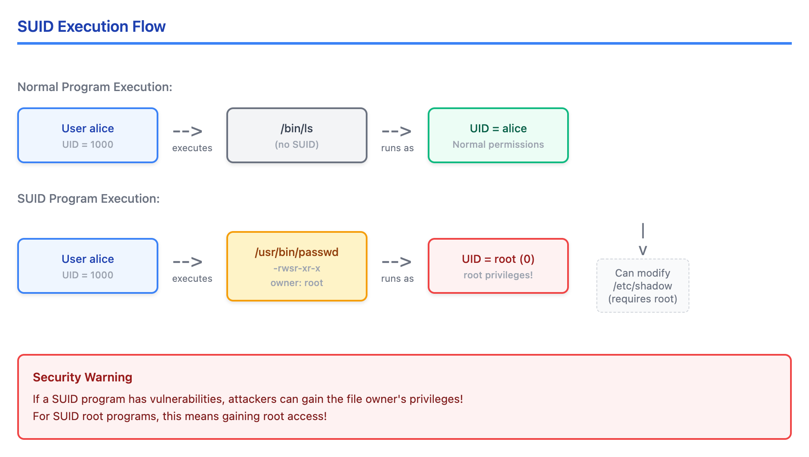
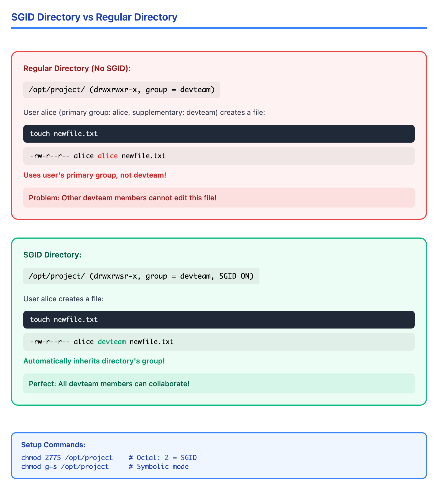
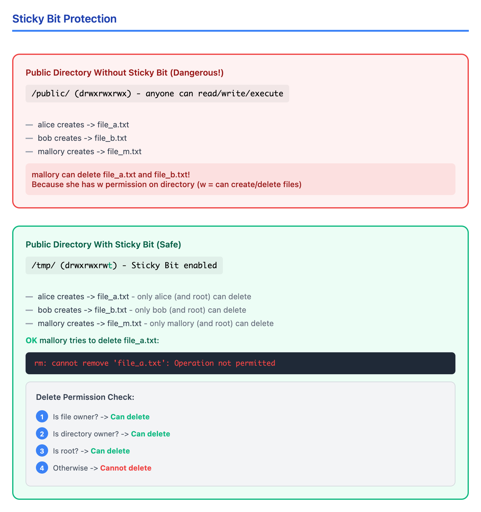

# 04 · 特殊权限 (SUID, SGID, Sticky Bit)

> **目标**：掌握 Linux 特殊权限位，理解其安全影响，学会审计系统 SUID 文件  
> **前置**：完成 Lesson 03（文件权限基础）  
> **时间**：2-2.5 小时  
> **实战场景**：安全审计、团队协作目录、/tmp 权限理解  

---

## 将学到的内容

1. 理解 SUID（Set User ID）及其安全风险
2. 理解 SGID 在文件和目录上的不同行为
3. 理解 Sticky Bit 保护共享目录
4. 使用八进制和符号表示法设置特殊权限
5. **审计系统 SUID 文件** — 安全运维必备技能
6. **识别 SUID 攻击向量** — 为什么 SUID 是攻击者的优先目标

---

## 先跑起来！（5 分钟）

> 在学习理论之前，先观察系统中的特殊权限。  
> 运行这些命令，注意输出中的 `s` 和 `t` — 这就是特殊权限的标志。  

```bash
# 查看 /usr/bin/passwd — 一个典型的 SUID 程序
ls -l /usr/bin/passwd
# 输出类似: -rwsr-xr-x 1 root root 68208 Jan  1 00:00 /usr/bin/passwd
#             ^-- 注意这个 's'！

# 查看 /tmp — 一个典型的 Sticky Bit 目录
ls -ld /tmp
# 输出类似: drwxrwxrwt 10 root root 4096 Jan  4 10:00 /tmp
#                    ^-- 注意这个 't'！

# 找出系统中所有 SUID 程序（可能需要几秒）
find /usr -perm -4000 -ls 2>/dev/null | head -5

# 创建一个 SGID 目录体验一下
mkdir -p ~/perm-lab/shared
chmod 2775 ~/perm-lab/shared
ls -ld ~/perm-lab/shared
# 输出: drwxrwsr-x 2 youruser youruser 64 Jan  4 10:00 shared
#               ^-- 注意这个 's'！
```

**你刚刚发现了 Linux 中的"超能力位"！**

- `s` 在 owner 执行位 = **SUID**（程序以文件所有者身份运行）
- `s` 在 group 执行位 = **SGID**（程序以文件组身份运行/目录继承组）
- `t` 在 others 执行位 = **Sticky Bit**（只有所有者能删除文件）

这些特殊权限非常强大，但也是**重大安全隐患**。现在让我们深入理解。

---

## Step 1 — SUID：以文件所有者身份执行（25 分钟）

### 1.1 为什么需要 SUID？

思考这个问题：普通用户如何修改自己的密码？

```bash
# 密码存储在 /etc/shadow
ls -l /etc/shadow
# -rw-r----- 1 root shadow 1234 Jan  1 00:00 /etc/shadow

# 普通用户无法直接修改这个文件
cat /etc/shadow
# cat: /etc/shadow: Permission denied
```

但是普通用户可以运行 `passwd` 命令修改密码，这是怎么做到的？

**答案：SUID（Set User ID）**

```bash
ls -l /usr/bin/passwd
# -rwsr-xr-x 1 root root 68208 Jan  1 00:00 /usr/bin/passwd
```

注意 owner 权限中的 `s`（而不是 `x`）— 这表示 SUID 已设置。

### 1.2 SUID 执行流程



<details>
<summary>View ASCII source</summary>

```
SUID 执行流程 (SUID Execution Flow)
═══════════════════════════════════════════════════════════════════════════

普通程序执行:
┌─────────────┐     执行      ┌─────────────┐     运行身份     ┌─────────────┐
│  用户 alice  │─────────────▶│   /bin/ls   │─────────────────▶│ UID = alice │
│  UID = 1000 │               │ (无 SUID)    │                 │ 普通权限     │
└─────────────┘               └─────────────┘                 └─────────────┘


SUID 程序执行:
┌─────────────┐     执行      ┌─────────────┐     运行身份     ┌─────────────┐
│  用户 alice  │─────────────▶│ /usr/bin/   │─────────────────▶│ UID = root  │
│  UID = 1000 │               │   passwd    │                 │  (0)        │
└─────────────┘               │ (SUID root) │                 │ root 权限！  │
                              │ -rwsr-xr-x  │                 └─────────────┘
                              │ owner: root │
                              └─────────────┘
                                    │
                                    ▼
                              程序可以修改
                              /etc/shadow
                              (需要 root 权限)

⚠️ 安全警告:
如果 SUID 程序有漏洞，攻击者可以获得程序所有者的权限！
对于 SUID root 程序，这意味着获得 root 权限！
```

</details>

### 1.3 设置和识别 SUID

**八进制表示**：`4xxx`（第一位是 4）

```bash
# 设置 SUID
chmod 4755 program    # rwsr-xr-x
chmod u+s program     # 符号模式

# 移除 SUID
chmod 0755 program    # rwxr-xr-x
chmod u-s program     # 符号模式
```

**识别 SUID**：

```bash
# 权限字符串中的 's' 或 'S'
ls -l /usr/bin/passwd
# -rwsr-xr-x  →  's' 在 owner 的执行位，表示 SUID 已设置

# 's'（小写）= SUID + 执行权限
# 'S'（大写）= SUID 已设置，但没有执行权限（不正常状态）

# 查找 SUID 程序（全系统）
find / -perm -4000 -type f 2>/dev/null

# 更详细的输出
find / -perm -4000 -ls 2>/dev/null | head -20
```

### 1.4 常见的 SUID 程序

```bash
# 查看系统中合法的 SUID 程序
find /usr -perm -4000 -ls 2>/dev/null
```

常见合法 SUID 程序：

| 程序 | 用途 | 为什么需要 SUID |
|------|------|-----------------|
| `/usr/bin/passwd` | 修改密码 | 需要写入 /etc/shadow |
| `/usr/bin/su` | 切换用户 | 需要设置新的 UID |
| `/usr/bin/sudo` | 提权执行 | 需要临时获取 root 权限 |
| `/usr/bin/ping` | 网络诊断 | 需要发送 RAW 网络包（某些系统） |
| `/usr/bin/mount` | 挂载文件系统 | 需要修改系统挂载表 |
| `/usr/bin/chsh` | 修改登录 shell | 需要写入 /etc/passwd |

### 1.5 SUID 安全风险

**SUID 是攻击者的首要目标！**

```bash
# 安全审计：查找所有 SUID 程序
find / -perm -4000 -type f 2>/dev/null > /tmp/suid_files.txt
wc -l /tmp/suid_files.txt
cat /tmp/suid_files.txt
```

**为什么危险？**

1. **SUID 程序的漏洞 = 权限提升**
   - 如果 SUID root 程序有漏洞，攻击者获得 root 权限
   - 历史上无数权限提升漏洞来自 SUID 程序

2. **意外的 SUID 文件可能是后门**
   - 攻击者可能留下 SUID shell 作为后门
   - 定期审计 SUID 文件清单至关重要

3. **自定义 SUID 程序风险极高**
   - 除非有专业安全审计，否则不要创建 SUID 程序

### 1.6 为什么 SUID 对脚本无效？

**这是一个关键的安全特性！**

```bash
# 创建一个 shell 脚本
cat > ~/perm-lab/test-script.sh << 'EOF'
#!/bin/bash
echo "Running as: $(whoami)"
echo "Effective UID: $(id -u)"
EOF
chmod 4755 ~/perm-lab/test-script.sh  # 设置 SUID

# 运行脚本
~/perm-lab/test-script.sh
# Running as: youruser
# Effective UID: 1000
# 注意：仍然是当前用户，SUID 没有生效！
```

**为什么脚本的 SUID 被忽略？**

1. **Race Condition 攻击**：脚本执行分两步
   - Shell 解释器先读取脚本
   - 然后执行脚本内容
   - 攻击者可以在两步之间替换脚本内容

2. **现代 Linux 内核直接忽略脚本的 SUID**
   - 这是一个**安全特性**，不是 bug
   - 保护系统免受脚本注入攻击

3. **如果你需要脚本以 root 运行**
   - 使用 sudo（推荐）
   - 使用 C 语言包装程序（仅限专家）

---

## Step 2 — SGID：组权限继承（20 分钟）

### 2.1 SGID 的双重含义

SGID（Set Group ID）的行为取决于目标类型：

| 目标类型 | SGID 效果 |
|----------|-----------|
| **可执行文件** | 程序以文件所属组的身份运行 |
| **目录** | 新建文件自动继承目录的组 |

### 2.2 SGID 在文件上（较少使用）

```bash
# 查看系统中的 SGID 程序
find /usr -perm -2000 -ls 2>/dev/null | head -5

# 常见例子：wall 命令（向所有终端发送消息）
ls -l /usr/bin/wall
# -rwxr-sr-x 1 root tty 19024 Jan  1 00:00 /usr/bin/wall
#        ^-- 注意 group 位置的 's'
```

### 2.3 SGID 在目录上（团队协作神器）

这是 SGID 最常用的场景！



<details>
<summary>View ASCII source</summary>

```
SGID 目录 vs 普通目录 (SGID Directory vs Regular Directory)
═══════════════════════════════════════════════════════════════════════════

普通目录（无 SGID）:
┌────────────────────────────────────────────────────────────────────────┐
│  /opt/project/  (drwxrwxr-x, group = devteam)                          │
│                                                                        │
│  用户 alice (主组: alice, 附加组: devteam) 创建文件:                    │
│                                                                        │
│      touch newfile.txt                                                 │
│                                                                        │
│      -rw-r--r-- alice alice newfile.txt                                │
│                       ^^^^^ 使用用户的主组，而不是 devteam！            │
│                                                                        │
│  问题：其他 devteam 成员无法编辑这个文件！                              │
└────────────────────────────────────────────────────────────────────────┘


SGID 目录:
┌────────────────────────────────────────────────────────────────────────┐
│  /opt/project/  (drwxrwsr-x, group = devteam, SGID ON)                 │
│                        ^^^                                             │
│                                                                        │
│  用户 alice 创建文件:                                                  │
│                                                                        │
│      touch newfile.txt                                                 │
│                                                                        │
│      -rw-r--r-- alice devteam newfile.txt                              │
│                       ^^^^^^^ 自动继承目录的组！                        │
│                                                                        │
│  完美：所有 devteam 成员都可以协作！                                   │
└────────────────────────────────────────────────────────────────────────┘

设置方法:
chmod 2775 /opt/project     # 八进制：2 = SGID
chmod g+s /opt/project      # 符号模式
```

</details>

### 2.4 实战：创建团队协作目录

```bash
# 创建项目目录
sudo mkdir -p /opt/team-project

# 创建或使用现有组
sudo groupadd devteam 2>/dev/null || echo "Group exists"

# 设置目录所有权
sudo chown :devteam /opt/team-project

# 设置 SGID + 组可读写执行
sudo chmod 2775 /opt/team-project

# 验证设置
ls -ld /opt/team-project
# drwxrwsr-x 2 root devteam 64 Jan  4 10:00 /opt/team-project
#       ^-- 's' 表示 SGID 已设置

# 把用户加入组
sudo usermod -aG devteam $USER

# 切换到新组（避免重新登录）
newgrp devteam

# 在目录中创建文件
touch /opt/team-project/shared-doc.txt

# 验证新文件继承了组
ls -l /opt/team-project/shared-doc.txt
# -rw-r--r-- 1 youruser devteam 0 Jan  4 10:00 shared-doc.txt
#                       ^^^^^^^ 自动继承了 devteam 组！
```

### 2.5 SGID 标识

```bash
# 's'（小写）= SGID + 组执行权限
ls -ld /opt/team-project
# drwxrwsr-x  →  正常

# 'S'（大写）= SGID 设置但没有组执行权限
chmod g-x /opt/team-project
ls -ld /opt/team-project
# drwxrwSr-x  →  不正常状态（SGID 无意义）

# 恢复正常
chmod g+x /opt/team-project
```

---

## Step 3 — Sticky Bit：保护共享目录（15 分钟）

### 3.1 Sticky Bit 的作用

Sticky Bit 解决一个问题：**如何让所有人都能在目录中创建文件，但只能删除自己的文件？**



<details>
<summary>View ASCII source</summary>

```
Sticky Bit 保护机制 (Sticky Bit Protection)
═══════════════════════════════════════════════════════════════════════════

无 Sticky Bit 的公共目录（危险！）:
┌────────────────────────────────────────────────────────────────────────┐
│  /public/  (drwxrwxrwx)  — 任何人可读写执行                             │
│                                                                        │
│     alice 创建 → file_a.txt                                            │
│     bob 创建   → file_b.txt                                            │
│     mallory 创建 → file_m.txt                                          │
│                                                                        │
│     ⚠️ mallory 可以删除 file_a.txt 和 file_b.txt！                      │
│     因为她对目录有 w 权限（目录的 w = 可创建/删除文件）                   │
└────────────────────────────────────────────────────────────────────────┘


有 Sticky Bit 的公共目录（安全）:
┌────────────────────────────────────────────────────────────────────────┐
│  /tmp/  (drwxrwxrwt)  — Sticky Bit 已设置                              │
│                   ^                                                    │
│     alice 创建 → file_a.txt  — 只有 alice（和 root）能删除              │
│     bob 创建   → file_b.txt  — 只有 bob（和 root）能删除                │
│     mallory 创建 → file_m.txt — 只有 mallory（和 root）能删除           │
│                                                                        │
│     ✅ mallory 尝试删除 file_a.txt                                      │
│        rm: cannot remove 'file_a.txt': Operation not permitted         │
│                                                                        │
│     删除文件的权限检查:                                                 │
│     1. 是文件所有者？ → 可以删除                                        │
│     2. 是目录所有者？ → 可以删除                                        │
│     3. 是 root？     → 可以删除                                        │
│     4. 其他情况      → 禁止删除                                         │
└────────────────────────────────────────────────────────────────────────┘
```

</details>

### 3.2 /tmp 目录详解

```bash
# 查看 /tmp 权限
ls -ld /tmp
# drwxrwxrwt 10 root root 4096 Jan  4 10:00 /tmp
#          ^-- 't' 表示 Sticky Bit

# 使用 stat 查看详细信息
stat /tmp
# Access: (1777/drwxrwxrwt)
#          ^^^^  八进制 1777 = Sticky Bit + rwxrwxrwx
```

### 3.3 设置 Sticky Bit

**八进制表示**：`1xxx`（第一位是 1）

```bash
# 创建测试目录
mkdir ~/perm-lab/shared-public

# 设置 Sticky Bit
chmod 1777 ~/perm-lab/shared-public    # 八进制
# 或
chmod o+t ~/perm-lab/shared-public     # 符号模式

# 验证
ls -ld ~/perm-lab/shared-public
# drwxrwxrwt 2 youruser youruser 64 Jan  4 10:00 shared-public
```

### 3.4 Sticky Bit 标识

```bash
# 't'（小写）= Sticky Bit + others 执行权限
# drwxrwxrwt  →  正常状态

# 'T'（大写）= Sticky Bit 设置但没有 others 执行权限
chmod o-x ~/perm-lab/shared-public
ls -ld ~/perm-lab/shared-public
# drwxrwxrwT  →  'T' 大写

# 恢复
chmod o+x ~/perm-lab/shared-public
```

### 3.5 实战：验证 Sticky Bit 保护

需要两个用户来测试（使用 root 模拟）：

```bash
# 以 root 创建一个有 Sticky Bit 的目录
sudo mkdir /tmp/sticky-test
sudo chmod 1777 /tmp/sticky-test

# 以当前用户创建文件
touch /tmp/sticky-test/my-file.txt

# 尝试以其他用户删除（需要切换用户或使用 root 模拟）
# 模拟方法：创建另一个用户的文件
sudo touch /tmp/sticky-test/other-user-file.txt
sudo chown nobody:nogroup /tmp/sticky-test/other-user-file.txt

# 尝试删除别人的文件
rm /tmp/sticky-test/other-user-file.txt
# rm: cannot remove '/tmp/sticky-test/other-user-file.txt': Operation not permitted

# 清理
rm /tmp/sticky-test/my-file.txt
sudo rm -rf /tmp/sticky-test
```

---

## Step 4 — 特殊权限速查表（5 分钟）

### 4.1 八进制表示法

特殊权限使用**第四位**（最前面）：

```
chmod SUGS rwx rwx rwx
      |||
      ||└─ 1 = Sticky Bit
      |└── 2 = SGID
      └─── 4 = SUID

例子:
4755 = SUID + rwxr-xr-x     （-rwsr-xr-x）
2755 = SGID + rwxr-xr-x     （-rwxr-sr-x）
1777 = Sticky + rwxrwxrwx   （drwxrwxrwt）
6755 = SUID + SGID + 755    （-rwsr-sr-x）
```

### 4.2 符号表示法

| 符号 | 含义 | 示例 |
|------|------|------|
| `u+s` | 添加 SUID | `chmod u+s program` |
| `u-s` | 移除 SUID | `chmod u-s program` |
| `g+s` | 添加 SGID | `chmod g+s directory` |
| `g-s` | 移除 SGID | `chmod g-s directory` |
| `o+t` | 添加 Sticky Bit | `chmod o+t directory` |
| `o-t` | 移除 Sticky Bit | `chmod o-t directory` |

### 4.3 总结对比

| 特殊权限 | 八进制 | 符号 | 显示位置 | 适用对象 | 效果 |
|----------|--------|------|----------|----------|------|
| SUID | 4xxx | u+s | owner x 位 (s/S) | 可执行文件 | 以文件所有者身份运行 |
| SGID | 2xxx | g+s | group x 位 (s/S) | 可执行文件/目录 | 以文件组身份运行/继承组 |
| Sticky | 1xxx | o+t | others x 位 (t/T) | 目录 | 只有所有者能删除文件 |

---

## Step 5 — 安全审计实战（20 分钟）

### 5.1 SUID 文件审计

**这是每个系统管理员必须定期执行的安全任务！**

```bash
# 查找所有 SUID 文件
sudo find / -perm -4000 -type f 2>/dev/null > ~/suid_audit_$(date +%Y%m%d).txt

# 查看结果
cat ~/suid_audit_$(date +%Y%m%d).txt | wc -l
echo "发现 $(cat ~/suid_audit_$(date +%Y%m%d).txt | wc -l) 个 SUID 文件"

# 详细信息（包含权限、所有者、大小）
sudo find / -perm -4000 -ls 2>/dev/null > ~/suid_audit_detailed.txt

# 只看可疑位置（不在标准路径）
sudo find / -perm -4000 -type f 2>/dev/null | grep -v -E '^/(usr|bin|sbin)'
```

### 5.2 比对基线

```bash
# 首次运行：创建基线
sudo find / -perm -4000 -type f 2>/dev/null | sort > ~/suid_baseline.txt

# 后续审计：与基线比对
sudo find / -perm -4000 -type f 2>/dev/null | sort > ~/suid_current.txt
diff ~/suid_baseline.txt ~/suid_current.txt

# 如果有差异：
# < 开头 = 基线有但现在没有（可能被移除）
# > 开头 = 现在有但基线没有（新增的，需要调查！）
```

### 5.3 SGID 文件审计

```bash
# 查找所有 SGID 文件和目录
sudo find / -perm -2000 2>/dev/null > ~/sgid_audit.txt

# 仅 SGID 可执行文件
sudo find / -perm -2000 -type f 2>/dev/null

# 仅 SGID 目录
sudo find / -perm -2000 -type d 2>/dev/null
```

### 5.4 容器环境的 SUID 最小化

在容器（Docker/Kubernetes）环境中，应该**最小化 SUID 文件**：

```bash
# 在 Dockerfile 中移除不必要的 SUID
# 查找容器镜像中的 SUID 文件
docker run --rm alpine find / -perm -4000 -type f 2>/dev/null

# 在 Dockerfile 中移除 SUID
# RUN find / -perm -4000 -type f -exec chmod u-s {} \;

# 或只保留必需的（如 su, sudo）
```

### 5.5 World-Writable 目录审计

除了 SUID，还应检查任何人都能写入的目录：

```bash
# 查找 world-writable 目录（除了 /tmp 等已知目录）
sudo find / -type d -perm -0002 2>/dev/null | grep -v -E '^/(tmp|var/tmp|dev/shm)'

# 查找没有 Sticky Bit 的 world-writable 目录（危险！）
sudo find / -type d -perm -0002 ! -perm -1000 2>/dev/null
```

---

## 反模式：特殊权限的危险用法

### 反模式 1：给脚本设置 SUID（无效且危险的意图）

```bash
# 错误做法：
chmod 4755 myscript.sh
./myscript.sh
# 脚本仍以当前用户身份运行，SUID 不生效

# 为什么不生效？
# Linux 内核故意忽略脚本的 SUID — 这是安全特性！

# 如果脚本的 SUID 能生效会怎样？
# 攻击者可以：
# 1. 创建一个恶意脚本
# 2. 设置 SUID root
# 3. 获得 root 权限
# 这就是为什么内核阻止这种行为
```

**正确做法**：

```bash
# 使用 sudo（推荐）
sudo -u root myscript.sh

# 或在 sudoers 中配置
# username ALL=(root) NOPASSWD: /path/to/myscript.sh
```

### 反模式 2：给自定义程序添加 SUID

```bash
# 极其危险！
# 除非你是安全专家并且代码经过审计，否则不要这样做
chmod u+s /home/user/myprogram

# 风险：
# 1. 程序漏洞 = 权限提升
# 2. 缓冲区溢出 = root shell
# 3. 环境变量注入 = 任意代码执行
```

**正确做法**：

```bash
# 使用 sudo 而不是 SUID
# 在 sudoers 中精确控制

# 使用 capabilities 代替 SUID（更精细的权限控制）
sudo setcap cap_net_raw+ep /path/to/program
# 只给程序发送 RAW 网络包的能力，而不是完整 root 权限
```

### 反模式 3：忽略意外的 SUID 文件

```bash
# 发现新的 SUID 文件但不调查
diff baseline.txt current.txt
# > /home/user/.hidden/backdoor

# 这可能是攻击者留下的后门！
# 必须立即调查

# 正确做法：
# 1. 记录发现
# 2. 检查文件内容和创建时间
# 3. 如果可疑，保留证据并上报安全团队
```

### 反模式 4：SGID 目录没有正确设置组权限

```bash
# 设置了 SGID 但组没有写权限
chmod 2755 /opt/project    # drwxr-sr-x
# 组成员只能读取，不能创建文件

# 正确做法：确保组有写权限
chmod 2775 /opt/project    # drwxrwsr-x
```

---

## 职场小贴士（Japan IT Context）

### 安全审计与合规

在日本 IT 职场，SUID 审计是安全合规的重要环节：

| 日语术语 | 含义 | 与本课关联 |
|----------|------|------------|
| セキュリティ監査（せきゅりてぃかんさ） | 安全审计 | 定期检查 SUID 文件清单 |
| 権限昇格（けんげんしょうかく） | 权限提升 | SUID 漏洞的风险 |
| 最小権限の原則 | 最小权限原则 | 减少不必要的 SUID |
| 変更管理 | 变更管理 | SUID 变更需要审批 |

### 合规标准要求

**PCI-DSS**（支付卡行业数据安全标准）：

- 要求 11.5：监控关键系统文件的完整性
- SUID 文件清单必须定期审计

**ISMS**（信息安全管理体系 / ISO 27001）：

- A.12.6.1：技术脆弱性管理
- 要求维护系统配置基线，包括 SUID 文件清单

### 实际场景

**月度安全检查（月次セキュリティチェック）**：

```bash
#!/bin/bash
# 月度 SUID 审计脚本

BASELINE="/var/log/security/suid_baseline.txt"
CURRENT="/tmp/suid_current_$(date +%Y%m%d).txt"
REPORT="/var/log/security/suid_report_$(date +%Y%m%d).txt"

# 生成当前清单
find / -perm -4000 -type f 2>/dev/null | sort > "$CURRENT"

# 比对基线
echo "=== SUID File Audit Report ===" > "$REPORT"
echo "Date: $(date)" >> "$REPORT"
echo "Baseline: $BASELINE" >> "$REPORT"
echo "" >> "$REPORT"

if [ ! -f "$BASELINE" ]; then
    echo "WARNING: No baseline file found!" >> "$REPORT"
    echo "Creating baseline..." >> "$REPORT"
    cp "$CURRENT" "$BASELINE"
else
    echo "New SUID files:" >> "$REPORT"
    comm -13 "$BASELINE" "$CURRENT" >> "$REPORT"
    echo "" >> "$REPORT"
    echo "Removed SUID files:" >> "$REPORT"
    comm -23 "$BASELINE" "$CURRENT" >> "$REPORT"
fi

# 输出报告
cat "$REPORT"
```

**チーム共有ディレクトリ（团队共享目录）设置标准**：

```bash
# 日本企业常见的团队目录设置

# 1. 创建项目目录
sudo mkdir -p /opt/projects/customer-a

# 2. 创建项目组
sudo groupadd prj-customer-a

# 3. 设置 SGID 确保文件组继承
sudo chown root:prj-customer-a /opt/projects/customer-a
sudo chmod 2775 /opt/projects/customer-a

# 4. 记录变更（変更履歴必須！）
logger "Created project directory /opt/projects/customer-a with SGID (operator: $USER)"
```

---

## 检查清单

完成本课后，你应该能够：

- [ ] 解释 SUID 的作用（程序以文件所有者身份运行）
- [ ] 解释为什么 SUID 对脚本无效（内核安全特性）
- [ ] 使用 `find / -perm -4000` 查找系统 SUID 文件
- [ ] 解释 SGID 在可执行文件和目录上的不同行为
- [ ] 创建 SGID 目录实现团队文件协作
- [ ] 解释 Sticky Bit 如何保护 /tmp 目录
- [ ] 使用八进制（4755, 2775, 1777）设置特殊权限
- [ ] 使用符号模式（u+s, g+s, o+t）设置特殊权限
- [ ] 识别权限字符串中的 s/S 和 t/T
- [ ] 执行 SUID 安全审计并比对基线
- [ ] 解释为什么不应该给自定义程序设置 SUID

---

## 本课小结

| 特殊权限 | 八进制 | 符号 | 效果 | 典型用例 |
|----------|--------|------|------|----------|
| SUID | 4xxx | u+s | 以文件所有者运行 | /usr/bin/passwd |
| SGID (文件) | 2xxx | g+s | 以文件组运行 | /usr/bin/wall |
| SGID (目录) | 2xxx | g+s | 新文件继承目录组 | 团队共享目录 |
| Sticky Bit | 1xxx | o+t | 只有所有者能删除 | /tmp |

**安全要点**：

| 风险 | 应对 |
|------|------|
| SUID 是攻击目标 | 定期审计，最小化 |
| 脚本 SUID 无效 | 使用 sudo 代替 |
| 意外 SUID 可能是后门 | 比对基线，及时调查 |
| 容器中的 SUID | 构建时移除不必要的 SUID |

---

## 延伸阅读

- [Linux Capabilities](https://man7.org/linux/man-pages/man7/capabilities.7.html) — SUID 的现代替代方案
- [setuid and setgid](https://en.wikipedia.org/wiki/Setuid) — 深入理解原理
- 下一课：[05 · ACL 与文件属性](../05-acls-file-attributes/) — 更细粒度的权限控制
- 相关课程：[06 · sudo 配置](../06-sudo-configuration/) — 安全的权限提升

---

## 系列导航

[03 · 文件权限基础 <-](../03-file-permissions-fundamentals/) | [系列首页](../) | [05 · ACL 与文件属性 ->](../05-acls-file-attributes/)
