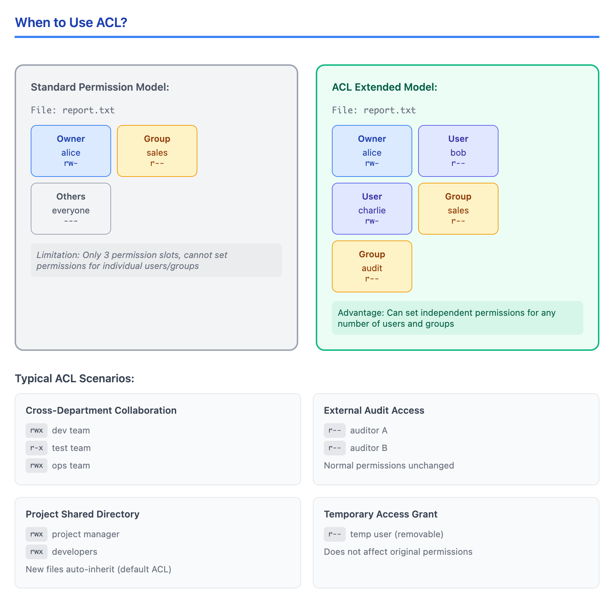
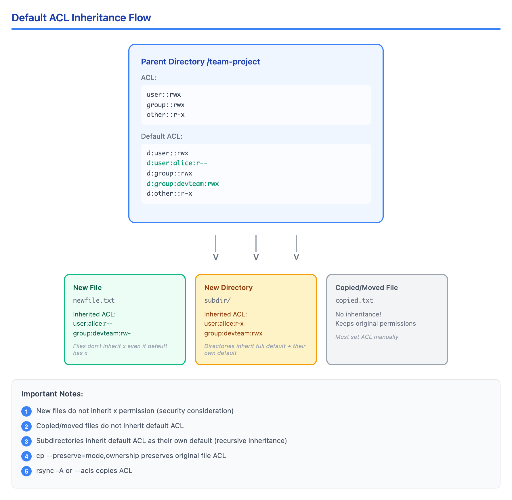

# 05 · ACL 与文件属性（ACLs and File Attributes）

> **目标**：掌握 ACL 细粒度权限控制和文件属性保护  
> **前置**：完成 Lesson 03-04（文件权限与特殊权限）  
> **时间**：2 小时  
> **实战场景**：团队协作目录、配置文件保护、合规性要求  

---

## 将学到的内容

1. 理解什么时候需要 ACL（标准权限不够用时）
2. 使用 getfacl/setfacl 读取和设置 ACL
3. 配置目录默认 ACL 实现权限继承
4. 理解 ACL mask 对有效权限的影响
5. 使用 chattr/lsattr 设置文件不可变属性
6. **识别 ACL 文件**：ls -l 输出中的 `+` 号

---

## 先跑起来！（5 分钟）

> 在学习理论之前，先体验 ACL 和文件属性的威力。  
> 运行这些命令，观察输出 — 这就是你将要掌握的技能。  

```bash
# 创建练习目录
mkdir -p ~/acl-lab && cd ~/acl-lab

# 场景：你有一个文件，只想让特定用户访问
touch secret-report.txt
chmod 600 secret-report.txt  # 只有自己能读写

# 问题：现在要给 alice 用户读取权限，但不改变文件的组
# 传统权限做不到！只能改组或开放 others

# ACL 解决方案：
sudo setfacl -m u:nobody:r secret-report.txt
getfacl secret-report.txt
# 注意输出中多了 user:nobody:r--

# 看 ls -l 的变化
ls -l secret-report.txt
# 输出: -rw-r-----+ 1 youruser youruser ...
#              ^
#              这个 + 号表示文件有 ACL！

# 文件保护：让文件无法被删除或修改（即使是 root）
touch protected.conf
sudo chattr +i protected.conf
sudo rm protected.conf  # 会失败！
# rm: cannot remove 'protected.conf': Operation not permitted

# 查看文件属性
lsattr protected.conf
# ----i------------ protected.conf

# 解除保护（清理用）
sudo chattr -i protected.conf
```

**你刚刚用 ACL 给特定用户授权，并用 chattr 保护了文件！**

这就是精细权限控制：**标准权限管不了的，ACL 来帮忙；重要文件怕误删，chattr 来保护**。

现在让我们理解背后的原理。

---

## Step 1 — 什么时候需要 ACL？（10 分钟）

### 1.1 标准权限的局限

标准 Linux 权限（owner/group/others）只能满足简单场景：

| 场景 | 标准权限能解决？ |
|------|------------------|
| 文件只给自己用 | 是 (chmod 600) |
| 文件让组内成员都能用 | 是 (chmod 640) |
| 文件让所有人都能读 | 是 (chmod 644) |
| **文件给特定用户 A 读，特定用户 B 写** | 否 |
| **让用户 C 能访问，但不想改组** | 否 |
| **新建文件自动继承特定权限** | 部分（umask 有限） |

### 1.2 ACL 的使用场景

ACL（Access Control Lists）适用于以下情况：



<details>
<summary>View ASCII source</summary>

```
何时使用 ACL？(When to Use ACL)
═══════════════════════════════════════════════════════════════════════════

标准权限模型:
┌─────────────────────────────────────────────────────────────────────────┐
│                           文件: report.txt                               │
│                                                                          │
│  ┌──────────┐          ┌──────────┐          ┌──────────┐               │
│  │  Owner   │          │  Group   │          │  Others  │               │
│  │  alice   │          │  sales   │          │  其他人   │               │
│  │  rw-     │          │  r--     │          │  ---     │               │
│  └──────────┘          └──────────┘          └──────────┘               │
│                                                                          │
│  限制: 只有 3 个权限槽位，无法针对个别用户/组设置                            │
└─────────────────────────────────────────────────────────────────────────┘

ACL 扩展模型:
┌─────────────────────────────────────────────────────────────────────────┐
│                           文件: report.txt                               │
│                                                                          │
│  ┌──────────┐  ┌──────────┐  ┌──────────┐  ┌──────────┐  ┌──────────┐  │
│  │  Owner   │  │  User    │  │  User    │  │  Group   │  │  Group   │  │
│  │  alice   │  │  bob     │  │  charlie │  │  sales   │  │  audit   │  │
│  │  rw-     │  │  r--     │  │  rw-     │  │  r--     │  │  r--     │  │
│  └──────────┘  └──────────┘  └──────────┘  └──────────┘  └──────────┘  │
│                                                                          │
│  优势: 可以给任意数量的用户和组设置独立权限                                  │
└─────────────────────────────────────────────────────────────────────────┘

典型 ACL 场景:
┌─────────────────────────────────────┬─────────────────────────────────────┐
│  跨部门协作                          │  外部审计访问                        │
│  ├── 开发组: rwx                     │  ├── 审计员 A: r--                   │
│  ├── 测试组: r-x                     │  ├── 审计员 B: r--                   │
│  └── 运维组: rwx                     │  └── 正常权限保持不变                 │
├─────────────────────────────────────┼─────────────────────────────────────┤
│  项目共享目录                        │  临时访问授权                        │
│  ├── 项目经理: rwx                   │  ├── 临时用户: r-- (可随时移除)       │
│  ├── 开发人员: rwx                   │  └── 不影响原有权限结构               │
│  └── 新文件自动继承权限 (default ACL) │                                     │
└─────────────────────────────────────┴─────────────────────────────────────┘
```

</details>

### 1.3 何时不用 ACL

**ACL 增加复杂性**，以下情况不需要 ACL：

```bash
# 不需要 ACL 的情况：

# 1. 只需要 owner 访问
chmod 600 private.txt  # 够了

# 2. 整个组都需要访问
chgrp devteam shared.txt
chmod 640 shared.txt  # 够了

# 3. 所有人都可以读
chmod 644 public.txt  # 够了
```

**原则**：能用标准权限解决的，就不要用 ACL。

---

## Step 2 — setfacl/getfacl 基础（20 分钟）

### 2.1 查看 ACL：getfacl

```bash
cd ~/acl-lab

# 创建测试文件
touch project-doc.txt
chmod 640 project-doc.txt

# 查看 ACL（即使没有额外 ACL 也能看）
getfacl project-doc.txt
```

输出解读：

```
# file: project-doc.txt
# owner: youruser
# group: youruser
user::rw-           ← 文件所有者权限
group::r--          ← 文件所属组权限
other::---          ← 其他用户权限
```

### 2.2 添加用户 ACL：setfacl -m

```bash
# 给 nobody 用户添加读权限
sudo setfacl -m u:nobody:r project-doc.txt

# 再次查看
getfacl project-doc.txt
```

输出变化：

```
# file: project-doc.txt
# owner: youruser
# group: youruser
user::rw-
user:nobody:r--     ← 新增的用户 ACL
group::r--
mask::r--           ← mask（稍后解释）
other::---
```

### 2.3 ACL 语法详解

```bash
setfacl -m ENTRY file

# ENTRY 格式:
# u:USERNAME:PERMISSIONS  - 用户 ACL
# g:GROUPNAME:PERMISSIONS - 组 ACL
# o::PERMISSIONS          - 其他用户（等同于 chmod o=）
# m::PERMISSIONS          - 设置 mask
```

**实战示例**：

```bash
cd ~/acl-lab

# 创建新文件
touch team-data.txt
chmod 600 team-data.txt  # 初始只有自己能访问

# 给用户 nobody 添加只读权限
sudo setfacl -m u:nobody:r team-data.txt

# 给 daemon 组添加读写权限
sudo setfacl -m g:daemon:rw team-data.txt

# 一次添加多个 ACL 条目
sudo setfacl -m u:nobody:r,g:daemon:rw another-file.txt

# 查看结果
getfacl team-data.txt
ls -l team-data.txt  # 注意 + 号
```

### 2.4 移除 ACL：setfacl -x

```bash
# 移除特定用户的 ACL
sudo setfacl -x u:nobody team-data.txt

# 移除特定组的 ACL
sudo setfacl -x g:daemon team-data.txt

# 移除所有 ACL（恢复到标准权限）
sudo setfacl -b team-data.txt

# 验证
getfacl team-data.txt
ls -l team-data.txt  # + 号消失了
```

### 2.5 ls -l 中的 + 号

```bash
# 带 ACL 的文件
ls -l team-data.txt
# -rw-r-----+ 1 youruser youruser 0 Jan  4 10:00 team-data.txt
#          ^
#          + 号表示有 ACL

# 移除 ACL 后
setfacl -b team-data.txt
ls -l team-data.txt
# -rw-r----- 1 youruser youruser 0 Jan  4 10:00 team-data.txt
#          ^
#          没有 + 号了
```

---

## Step 3 — 默认 ACL 与权限继承（20 分钟）

### 3.1 问题：新文件的权限

在团队共享目录中，新建的文件通常不会自动有正确的权限：

```bash
# 场景：创建团队目录
sudo mkdir /tmp/team-project
sudo chgrp daemon /tmp/team-project
sudo chmod 2775 /tmp/team-project  # SGID 让新文件继承组

# 问题：但新文件的 ACL 不会自动设置
touch /tmp/team-project/newfile.txt
getfacl /tmp/team-project/newfile.txt
# 没有给 nobody 用户的权限...
```

### 3.2 解决方案：Default ACL

**Default ACL** 定义在目录上，决定该目录下新建文件/子目录的 ACL。

```bash
# 在目录上设置默认 ACL
sudo setfacl -m d:u:nobody:r /tmp/team-project
sudo setfacl -m d:g:daemon:rwx /tmp/team-project

# 查看目录的 ACL
getfacl /tmp/team-project
```

输出：

```
# file: team-project
# owner: root
# group: daemon
# flags: -s-
user::rwx
group::rwx
other::r-x
default:user::rwx        ← 默认 ACL 开始
default:user:nobody:r--  ← 新文件自动获得
default:group::rwx
default:group:daemon:rwx ← 新文件自动获得
default:mask::rwx
default:other::r-x
```

### 3.3 验证继承

```bash
# 创建新文件
touch /tmp/team-project/inherited-file.txt

# 检查新文件的 ACL
getfacl /tmp/team-project/inherited-file.txt
# user:nobody:r--     ← 自动继承！
# group:daemon:rw-    ← 自动继承！（注意是 rw- 不是 rwx，因为是文件）

# 创建子目录
mkdir /tmp/team-project/subdir

# 子目录也继承默认 ACL
getfacl /tmp/team-project/subdir
```

### 3.4 ACL 继承流程图



<details>
<summary>View ASCII source</summary>

```
Default ACL 继承流程 (ACL Inheritance Flow)
═══════════════════════════════════════════════════════════════════════════

                    ┌─────────────────────────────────────┐
                    │        父目录 /team-project         │
                    │                                     │
                    │  ACL:                               │
                    │  ├── user::rwx                      │
                    │  ├── group::rwx                     │
                    │  └── other::r-x                     │
                    │                                     │
                    │  Default ACL:                       │
                    │  ├── d:user::rwx                    │
                    │  ├── d:user:alice:r--    ──────┐    │
                    │  ├── d:group::rwx              │    │
                    │  ├── d:group:devteam:rwx  ────┐│    │
                    │  └── d:other::r-x             ││    │
                    └──────────────┬────────────────┴┴────┘
                                   │
               ┌───────────────────┼───────────────────┐
               │                   │                   │
               ▼                   ▼                   ▼
    ┌──────────────────┐ ┌──────────────────┐ ┌──────────────────┐
    │  新建文件         │ │  新建目录         │ │  cp/mv 的文件     │
    │  newfile.txt     │ │  subdir/         │ │  copied.txt      │
    │                  │ │                  │ │                  │
    │  继承的 ACL:      │ │  继承的 ACL:      │ │  不继承！         │
    │  user:alice:r--  │ │  user:alice:r-x  │ │  保持原有权限     │
    │  group:devteam:  │ │  group:devteam:  │ │                  │
    │    rw- (无x)     │ │    rwx           │ │  需要手动设置     │
    └──────────────────┘ └──────────────────┘ └──────────────────┘
          │                     │
          ▼                     ▼
    文件不继承 x          目录继承完整
    即使 default         default ACL
    有 x 权限           （包括自己的 default）

注意事项:
┌─────────────────────────────────────────────────────────────────────────┐
│  1. 新建文件不继承 x 权限（安全考虑）                                      │
│  2. 复制/移动的文件不继承 default ACL                                     │
│  3. 子目录会继承 default ACL 作为自己的 default（递归继承）                │
│  4. cp --preserve=mode,ownership 会保留原文件 ACL                        │
│  5. rsync -A 或 --acls 才会复制 ACL                                      │
└─────────────────────────────────────────────────────────────────────────┘
```

</details>

### 3.5 设置默认 ACL 的语法

```bash
# d: 前缀表示 default ACL
setfacl -m d:u:USERNAME:PERMISSIONS dir/
setfacl -m d:g:GROUPNAME:PERMISSIONS dir/

# 一次设置多个默认 ACL
setfacl -m d:u:alice:rx,d:g:devteam:rwx dir/

# 移除特定默认 ACL
setfacl -x d:u:alice dir/

# 移除所有默认 ACL
setfacl -k dir/

# 移除所有 ACL（包括默认）
setfacl -b dir/
```

---

## Step 4 — ACL Mask 与有效权限（15 分钟）

### 4.1 什么是 mask？

**mask** 是 ACL 的"最大权限上限"，限制所有非 owner 用户的有效权限。

```bash
cd ~/acl-lab

# 创建文件并设置 ACL
touch mask-demo.txt
setfacl -m u:nobody:rwx mask-demo.txt
setfacl -m g:daemon:rwx mask-demo.txt

# 查看 ACL
getfacl mask-demo.txt
```

输出：

```
# file: mask-demo.txt
# owner: youruser
# group: youruser
user::rw-
user:nobody:rwx         #effective:rw-  ← 实际权限被 mask 限制！
group::r--
group:daemon:rwx        #effective:r--  ← 实际权限被 mask 限制！
mask::rw-               ← mask 是 rw-，所以 x 被限制
other::---
```

### 4.2 mask 的计算规则

```
有效权限 = ACL 权限 AND mask

示例：
- ACL 权限: rwx (7)
- mask:     rw- (6)
- 有效权限: rw- (6)  ← x 被 mask 阻止
```

### 4.3 修改 mask

```bash
# 设置 mask 为 rwx（允许所有权限）
setfacl -m m::rwx mask-demo.txt

# 再次查看
getfacl mask-demo.txt
# user:nobody:rwx   ← 没有 #effective 注释了，权限完整
# group:daemon:rwx
# mask::rwx
```

### 4.4 mask 被自动修改的情况

**重要**：当你用 chmod 修改权限时，可能会意外修改 mask！

```bash
# 当前状态
getfacl mask-demo.txt | grep mask
# mask::rwx

# 使用 chmod 修改组权限
chmod g=r mask-demo.txt

# 检查 mask
getfacl mask-demo.txt | grep mask
# mask::r--  ← mask 被改成了 r！

# 这会限制所有 ACL 条目的有效权限
getfacl mask-demo.txt
# user:nobody:rwx   #effective:r--  ← 被限制了！
```

**解决方案**：修改带 ACL 的文件权限后，检查并恢复 mask：

```bash
# 恢复 mask
setfacl -m m::rwx mask-demo.txt
```

---

## Step 5 — 文件属性：chattr/lsattr（15 分钟）

### 5.1 什么是文件属性？

文件属性是比权限更底层的保护机制，可以限制**任何用户（包括 root）**的操作。

常用属性：

| 属性 | 含义 | 用途 |
|------|------|------|
| `i` (immutable) | 不可变 | 文件无法修改、删除、重命名 |
| `a` (append-only) | 只追加 | 只能追加内容，不能修改已有内容 |
| `A` | 不更新 atime | 提高性能 |

### 5.2 设置不可变属性（+i）

```bash
cd ~/acl-lab

# 创建重要配置文件
echo "critical configuration" > critical.conf

# 设置不可变属性
sudo chattr +i critical.conf

# 查看属性
lsattr critical.conf
# ----i------------ critical.conf

# 尝试修改 — 失败！
echo "new content" >> critical.conf
# bash: critical.conf: Operation not permitted

# 尝试删除 — 失败！
rm critical.conf
# rm: cannot remove 'critical.conf': Operation not permitted

# 即使是 root 也不行！
sudo rm critical.conf
# rm: cannot remove 'critical.conf': Operation not permitted

# 移除属性后才能操作
sudo chattr -i critical.conf
rm critical.conf  # 现在可以了
```

### 5.3 设置只追加属性（+a）

```bash
# 适用于日志文件
echo "log entry 1" > app.log
sudo chattr +a app.log

# 可以追加
echo "log entry 2" >> app.log
cat app.log
# log entry 1
# log entry 2

# 但不能覆盖或删除
echo "overwrite" > app.log
# bash: app.log: Operation not permitted

rm app.log
# rm: cannot remove 'app.log': Operation not permitted

# 移除属性
sudo chattr -a app.log
```

### 5.4 批量查看属性

```bash
# 查看目录下所有文件的属性
lsattr ~/acl-lab/

# 递归查看
lsattr -R /etc/ 2>/dev/null | grep -v "^$"
```

### 5.5 实战：保护系统配置文件

```bash
# 保护 SSH 配置（防止意外修改）
sudo chattr +i /etc/ssh/sshd_config

# 保护 resolv.conf（防止被网络管理器覆盖）
sudo chattr +i /etc/resolv.conf

# 查看保护状态
lsattr /etc/ssh/sshd_config /etc/resolv.conf

# 需要修改时先解除保护
sudo chattr -i /etc/ssh/sshd_config
sudo vim /etc/ssh/sshd_config
sudo chattr +i /etc/ssh/sshd_config
```

---

## Step 6 — 动手实验（20 分钟）

### 6.1 实验 A：跨部门文档共享

**场景**：财务报表需要给特定用户读取权限，但不能改变文件组。

```bash
cd ~/acl-lab

# 创建财务报表
echo "Q4 Revenue: $1,000,000" > finance-report.txt
chmod 600 finance-report.txt  # 初始只有自己能看

# 需求：给 nobody 用户（模拟审计员）只读权限
sudo setfacl -m u:nobody:r finance-report.txt

# 验证
getfacl finance-report.txt
ls -l finance-report.txt  # 看到 + 号

# 检查：原来的权限结构没变
stat finance-report.txt  # owner 和 group 保持不变
```

### 6.2 实验 B：团队项目目录

**场景**：创建一个共享目录，新建文件自动让团队成员可访问。

```bash
# 创建目录
sudo mkdir -p /tmp/dev-project
sudo chown $USER:daemon /tmp/dev-project
sudo chmod 2775 /tmp/dev-project

# 设置默认 ACL：新文件自动给 nobody 用户读权限
sudo setfacl -m d:u:nobody:r /tmp/dev-project
sudo setfacl -m d:g:daemon:rwx /tmp/dev-project

# 验证默认 ACL
getfacl /tmp/dev-project

# 创建新文件
touch /tmp/dev-project/module1.py
touch /tmp/dev-project/module2.py

# 验证继承
getfacl /tmp/dev-project/module1.py
# 应该看到 user:nobody:r--

# 创建子目录
mkdir /tmp/dev-project/tests

# 子目录也继承默认 ACL
getfacl /tmp/dev-project/tests
```

### 6.3 实验 C：配置文件保护

**场景**：保护关键配置文件，防止误操作。

```bash
cd ~/acl-lab

# 创建模拟配置文件
cat > server.conf << 'EOF'
# Server Configuration
# WARNING: This file is protected
port = 8080
max_connections = 100
EOF

# 设置不可变属性
sudo chattr +i server.conf

# 尝试各种操作 — 都会失败
echo "hack" >> server.conf  # Operation not permitted
rm server.conf              # Operation not permitted
mv server.conf backup.conf  # Operation not permitted

# 查看属性
lsattr server.conf

# 清理：移除保护
sudo chattr -i server.conf
```

### 6.4 检查清单

完成以下任务：

- [ ] 给特定用户设置 ACL 权限
- [ ] 在目录上设置默认 ACL
- [ ] 验证新文件继承默认 ACL
- [ ] 理解 mask 对有效权限的影响
- [ ] 使用 chattr +i 保护文件
- [ ] 使用 lsattr 查看文件属性

---

## 反模式：常见错误

### 反模式 1：过度使用 ACL

```bash
# 错误：用 ACL 解决标准权限能解决的问题
setfacl -m u:alice:rw file.txt
setfacl -m u:bob:rw file.txt
setfacl -m u:charlie:rw file.txt
# 这三个人本来就在同一个组！

# 正确：使用标准组权限
chgrp devteam file.txt
chmod 660 file.txt
```

**原则**：ACL 增加复杂性，能用标准权限就不要用 ACL。

### 反模式 2：忘记 mask 限制

```bash
# 设置了 ACL，但 chmod 意外修改了 mask
setfacl -m u:alice:rwx file.txt
chmod 640 file.txt  # 这会把 mask 改成 r--！

# alice 实际只有 r-- 权限，不是 rwx！
getfacl file.txt
# user:alice:rwx     #effective:r--

# 正确：设置 ACL 后检查 mask
setfacl -m m::rwx file.txt
```

### 反模式 3：忘记 chattr 保护

```bash
# 设置了 chattr +i 但没有文档记录
sudo chattr +i /etc/important.conf

# 6 个月后...
# 新运维："为什么这个文件改不了？权限明明是 644 啊！"
# 花了 2 小时排查...

# 正确：记录所有 chattr 保护的文件
echo "/etc/important.conf - immutable, set on 2026-01-04, reason: prevent accidental modification" >> /root/chattr-log.txt
```

### 反模式 4：ACL 复制问题

```bash
# 复制文件时 ACL 丢失
cp source.txt dest.txt  # 默认不复制 ACL

# 正确：保留 ACL
cp --preserve=mode,ownership dest.txt  # 大部分情况工作
# 或使用专门支持 ACL 的工具
rsync -A source.txt dest.txt  # -A 或 --acls
```

---

## 职场小贴士（Japan IT Context）

### ACL 在日本企业的应用

在日本的 SIer（システムインテグレーター）环境中，ACL 常用于：

| 日语术语 | 含义 | ACL 应用场景 |
|----------|------|--------------|
| 共有フォルダ（きょうゆうフォルダ） | 共享文件夹 | 项目目录的 default ACL |
| アクセス権管理（アクセスけんかんり） | 访问权管理 | 跨部门文档共享 |
| 監査対応（かんさたいおう） | 审计应对 | 审计员只读 ACL |
| 変更禁止設定（へんこうきんしせってい） | 禁止变更设置 | chattr +i 保护 |

### 实际场景

**项目共享目录（プロジェクト共有）**：

日本企业常见的项目目录结构：

```bash
# /opt/projects/customer-a/
#   ├── src/        ← 开发者: rwx
#   ├── docs/       ← 全员: r-x
#   ├── deploy/     ← 运维: rwx, 开发: r-x
#   └── config/     ← chattr +i 保护

# 设置 src 目录的 ACL
sudo setfacl -m g:developers:rwx /opt/projects/customer-a/src
sudo setfacl -m d:g:developers:rwx /opt/projects/customer-a/src

# 设置 deploy 目录的 ACL
sudo setfacl -m g:operators:rwx /opt/projects/customer-a/deploy
sudo setfacl -m g:developers:rx /opt/projects/customer-a/deploy
```

**配置文件保护（設定ファイル保護）**：

在日本企业的运维环境中，chattr 常用于合规要求：

```bash
# PCI-DSS / ISMS 合规：保护关键配置
sudo chattr +i /etc/ssh/sshd_config
sudo chattr +i /etc/pam.d/system-auth
sudo chattr +i /etc/security/limits.conf

# 记录在变更管理系统中
# 変更管理番号: CHG-2026-001
# 対象: /etc/ssh/sshd_config
# 内容: chattr +i 設定
# 理由: セキュリティ監査対応
```

**ACL 变更审计（ACL 変更監査）**：

```bash
# 变更前记录
getfacl /path/to/dir > /tmp/acl_before_$(date +%Y%m%d).txt

# 执行变更
setfacl -m ...

# 变更后记录
getfacl /path/to/dir > /tmp/acl_after_$(date +%Y%m%d).txt

# 生成变更报告
diff /tmp/acl_before_*.txt /tmp/acl_after_*.txt > /tmp/acl_change_report.txt
```

---

## 检查清单

完成本课后，你应该能够：

- [ ] 解释什么时候需要 ACL（标准权限不够用时）
- [ ] 使用 getfacl 查看文件和目录的 ACL
- [ ] 使用 setfacl -m 添加用户和组的 ACL
- [ ] 使用 setfacl -x 移除特定 ACL 条目
- [ ] 使用 setfacl -b 移除所有 ACL
- [ ] 识别 ls -l 输出中的 `+` 号（表示有 ACL）
- [ ] 在目录上设置默认 ACL（d: 前缀）
- [ ] 解释默认 ACL 如何被新文件继承
- [ ] 理解 mask 对有效权限的限制作用
- [ ] 使用 chattr +i 设置不可变属性
- [ ] 使用 chattr +a 设置只追加属性
- [ ] 使用 lsattr 查看文件属性
- [ ] 记录 chattr 保护的文件以便日后维护

---

## 本课小结

| 概念 | 命令/语法 | 记忆点 |
|------|-----------|--------|
| 查看 ACL | `getfacl file` | 详细显示所有 ACL |
| 添加 ACL | `setfacl -m u:USER:PERM file` | -m = modify |
| 移除 ACL | `setfacl -x u:USER file` | -x = remove entry |
| 清除 ACL | `setfacl -b file` | -b = remove all |
| 默认 ACL | `setfacl -m d:u:USER:PERM dir/` | d: = default |
| ACL 标识 | `ls -l` 显示 `+` | + 表示有 ACL |
| mask | 限制有效权限 | chmod 可能改变 mask |
| 不可变 | `chattr +i file` | 任何人都不能改 |
| 只追加 | `chattr +a file` | 适合日志文件 |
| 查看属性 | `lsattr file` | i=immutable, a=append |
| 使用原则 | ACL 增加复杂性 | 能不用就不用 |

---

## 延伸阅读

- [setfacl Manual](https://man7.org/linux/man-pages/man1/setfacl.1.html)
- [getfacl Manual](https://man7.org/linux/man-pages/man1/getfacl.1.html)
- [chattr Manual](https://man7.org/linux/man-pages/man1/chattr.1.html)
- 上一课：[04 · 特殊权限 (SUID, SGID, Sticky Bit)](../04-special-permissions/) — SUID/SGID/Sticky Bit
- 下一课：[06 · sudo 配置](../06-sudo-configuration/) — sudo 精细配置
- 综合实战：[12 · Capstone: 多用户环境](../12-capstone-multiuser-environment/) — 运用所有权限知识

---

## 系列导航

[04 · 特殊权限 ←](../04-special-permissions/) | [系列首页](../) | [06 · sudo 配置 →](../06-sudo-configuration/)
