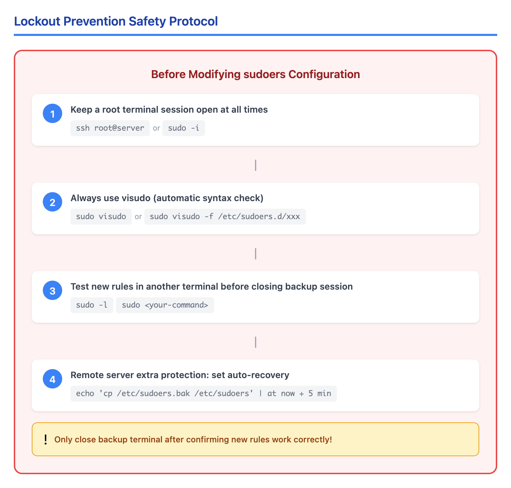
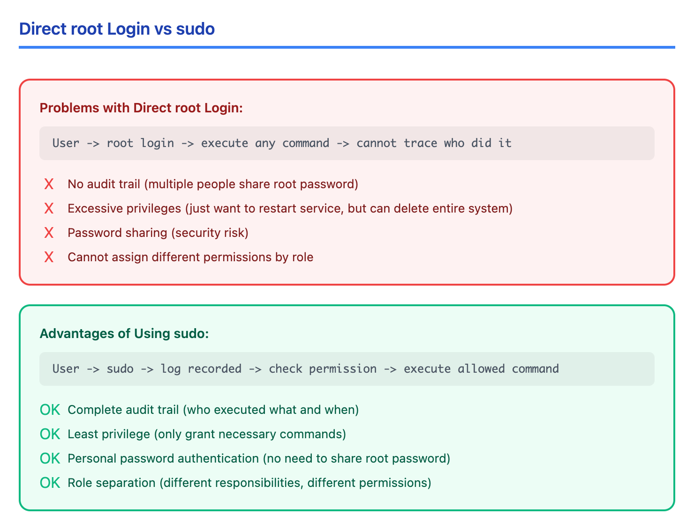
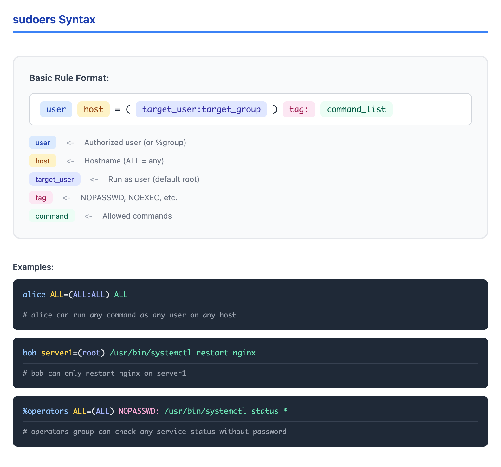

# 06 - sudo 配置（sudo Configuration）

> **目标**：掌握 sudo 的安全配置，实现最小权限原则的特权管理  
> **前置**：用户与组管理（Lesson 01-02），基础权限概念  
> **时间**：⚡ 30 分钟（速读）/ 🔬 120 分钟（完整实操）  
> **实战场景**：为运维团队配置基于角色的 sudo 权限  

---

## 将学到的内容

1. 理解为什么使用 sudo 而非直接 root 登录
2. 读懂 sudoers 文件结构和语法
3. 使用 User_Alias、Host_Alias、Cmnd_Alias 组织权限
4. 理解标签规范（NOPASSWD, NOEXEC）及其安全影响
5. 使用 visudo 安全编辑配置
6. 使用 /etc/sudoers.d/ 模块化管理
7. 配置 sudo 审计日志
8. 应用 Defaults 指令优化安全设置

---

## 先跑起来！（5 分钟）

> 在学习理论之前，先体验 sudo 的基本操作。  
> 运行这些命令，观察输出 -- 这就是你将要掌握的技能。  

```bash
# 查看当前用户的 sudo 权限
sudo -l

# 以 root 身份执行单个命令
sudo whoami

# 查看 sudo 配置文件的语法检查
sudo visudo -c

# 查看 sudo 的日志（RHEL/CentOS）
sudo grep sudo /var/log/secure | tail -5

# 或者（Debian/Ubuntu）
sudo grep sudo /var/log/auth.log | tail -5
```

**你刚刚使用了 sudo -- Linux 最重要的权限控制机制！**

与直接使用 root 不同，sudo 提供了**精细的权限控制**和**完整的审计追踪**。

现在让我们深入理解为什么以及如何配置 sudo。

---

## 安全警告：防止锁定

> **重要**：错误配置 sudoers 文件可能导致你完全失去 sudo 权限！  

在修改 sudo 配置之前，**必须**遵循以下安全协议：



<details>
<summary>View ASCII source</summary>

```
┌─────────────────────────────────────────────────────────────────┐
│                    防锁定安全协议                                 │
│                                                                  │
│  ┌─────────────────────────────────────────────────────────┐    │
│  │ 1. 保持一个 root 终端会话始终打开                         │    │
│  │    ssh root@server  或  sudo -i                         │    │
│  └─────────────────────────────────────────────────────────┘    │
│                         ▼                                        │
│  ┌─────────────────────────────────────────────────────────┐    │
│  │ 2. 始终使用 visudo（自动语法检查）                        │    │
│  │    sudo visudo  或  sudo visudo -f /etc/sudoers.d/xxx   │    │
│  └─────────────────────────────────────────────────────────┘    │
│                         ▼                                        │
│  ┌─────────────────────────────────────────────────────────┐    │
│  │ 3. 在另一个终端测试新规则，再关闭备份会话                  │    │
│  │    # 新终端                                              │    │
│  │    sudo -l                                               │    │
│  │    sudo <your-command>                                   │    │
│  └─────────────────────────────────────────────────────────┘    │
│                         ▼                                        │
│  ┌─────────────────────────────────────────────────────────┐    │
│  │ 4. 远程服务器额外保护：设置自动恢复                        │    │
│  │    echo 'cp /etc/sudoers.bak /etc/sudoers' | at now + 5 min │
│  └─────────────────────────────────────────────────────────┘    │
│                                                                  │
│  ⚠️  只有确认新规则正常工作后，才能关闭备份终端！                │
└─────────────────────────────────────────────────────────────────┘
```

</details>

**操作步骤**：

```bash
# 1. 备份当前配置
sudo cp /etc/sudoers /etc/sudoers.bak

# 2. 远程服务器：设置 5 分钟后自动恢复（需要 at 命令）
echo 'cp /etc/sudoers.bak /etc/sudoers' | sudo at now + 5 minutes

# 3. 修改配置（使用 visudo）
sudo visudo

# 4. 在新终端测试
# ssh user@server
# sudo -l
# sudo <test-command>

# 5. 如果一切正常，取消自动恢复任务
sudo atq                    # 查看任务 ID
sudo atrm <job-id>          # 删除任务
```

---

## Step 1 -- 为什么用 sudo？（10 分钟）

### 1.1 root 直接登录的问题



<details>
<summary>View ASCII source</summary>

```
直接使用 root 的问题：
┌──────────────────────────────────────────────────────────┐
│                                                          │
│  用户 → root 登录 → 执行任何命令 → 无法追踪是谁做的       │
│                                                          │
│  ❌ 无审计追踪（多人共用 root 密码）                      │
│  ❌ 权限过大（只想重启服务，却能删除整个系统）             │
│  ❌ 密码共享（安全隐患）                                  │
│  ❌ 无法按角色分配不同权限                                │
│                                                          │
└──────────────────────────────────────────────────────────┘

使用 sudo 的优势：
┌──────────────────────────────────────────────────────────┐
│                                                          │
│  用户 → sudo → 记录日志 → 检查权限 → 执行允许的命令       │
│                                                          │
│  ✅ 完整审计追踪（谁在何时执行了什么）                    │
│  ✅ 最小权限（只授予需要的命令）                          │
│  ✅ 个人密码认证（无需共享 root 密码）                    │
│  ✅ 角色分离（不同职责不同权限）                          │
│                                                          │
└──────────────────────────────────────────────────────────┘
```

</details>

### 1.2 sudo vs su vs login as root

| 方式 | 审计 | 权限控制 | 密码 | 推荐场景 |
|------|------|----------|------|----------|
| `ssh root@server` | 差 | 无 | root 密码 | **不推荐** |
| `su -` | 差 | 无 | root 密码 | 紧急情况 |
| `sudo -i` | 好 | 可配置 | 用户密码 | 需要完整 shell |
| `sudo <cmd>` | 好 | 精细 | 用户密码 | **推荐** |

### 1.3 sudo 的工作流程

```bash
# 用户执行 sudo 命令
$ sudo systemctl restart nginx

# sudo 的处理流程：
# 1. 读取 /etc/sudoers 和 /etc/sudoers.d/*
# 2. 检查用户是否有权限执行此命令
# 3. 如果需要，验证用户密码（有缓存）
# 4. 记录日志（时间、用户、命令）
# 5. 以目标用户身份（默认 root）执行命令
```

---

## Step 2 -- sudoers 文件结构（20 分钟）

### 2.1 sudoers 文件位置

```bash
# 主配置文件
/etc/sudoers

# 模块化配置目录（推荐）
/etc/sudoers.d/

# 查看文件（不要用 cat，用 visudo -c 检查语法）
sudo visudo -c
sudo visudo -c -f /etc/sudoers.d/*
```

### 2.2 基本语法

每条规则的格式：



<details>
<summary>View ASCII source</summary>

```
用户    主机=(目标用户:目标组)    标签: 命令列表

示例：
alice   ALL=(ALL:ALL)             ALL
  │      │    │    │               │
  │      │    │    │               └─ 可执行的命令
  │      │    │    └─────────────── 目标组（可选）
  │      │    └──────────────────── 目标用户（默认 root）
  │      └───────────────────────── 主机名（ALL = 任意）
  └──────────────────────────────── 被授权的用户

更多示例：
bob     server1=(root)            /usr/bin/systemctl restart nginx
        │         │                         │
        │         │                         └─ 只能重启 nginx
        │         └─────────────────────────── 只能在 server1 上
        └───────────────────────────────────── bob 用户

%operators  ALL=(ALL)  NOPASSWD: /usr/bin/systemctl status *
    │                      │                     │
    │                      │                     └─ 可查看任意服务状态
    │                      └─────────────────────── 无需密码
    └────────────────────────────────────────────── operators 组
```

</details>

### 2.3 读懂默认配置

```bash
# 查看默认配置（注意：用 less 而非编辑）
sudo cat /etc/sudoers

# 典型的默认配置：
# root    ALL=(ALL:ALL) ALL           # root 可以做任何事
# %wheel  ALL=(ALL:ALL) ALL           # wheel 组成员可以做任何事 (RHEL)
# %sudo   ALL=(ALL:ALL) ALL           # sudo 组成员可以做任何事 (Debian)
```

### 2.4 理解 ALL 的含义

| 位置 | ALL 的含义 | 示例 |
|------|-----------|------|
| 主机位置 | 任意主机 | `alice ALL=(root) /bin/ls` |
| 用户位置 | 任意目标用户 | `alice server1=(ALL) /bin/ls` |
| 命令位置 | 任意命令 | `alice ALL=(root) ALL` |

> **安全提示**：生产环境应避免在命令位置使用 ALL。  

---

## Step 3 -- 别名：组织复杂权限（15 分钟）

### 3.1 四种别名类型

| 别名类型 | 用途 | 语法 |
|----------|------|------|
| User_Alias | 用户组 | `User_Alias ADMINS = alice, bob` |
| Host_Alias | 主机组 | `Host_Alias WEBSERVERS = web1, web2` |
| Runas_Alias | 目标用户组 | `Runas_Alias DBA = mysql, postgres` |
| Cmnd_Alias | 命令组 | `Cmnd_Alias SERVICES = /usr/bin/systemctl` |

### 3.2 实际示例

```bash
# 使用 visudo 编辑
sudo visudo

# 添加以下内容：

# 用户别名：运维组
User_Alias OPERATORS = tanaka, yamamoto, suzuki

# 主机别名：Web 服务器群
Host_Alias WEBSERVERS = web01, web02, web03
Host_Alias DBSERVERS = db01, db02

# 命令别名：服务管理
Cmnd_Alias SERVICES = /usr/bin/systemctl start *, \
                      /usr/bin/systemctl stop *, \
                      /usr/bin/systemctl restart *, \
                      /usr/bin/systemctl status *

# 命令别名：日志查看
Cmnd_Alias LOGS = /usr/bin/tail -f /var/log/*, \
                  /usr/bin/less /var/log/*, \
                  /usr/bin/cat /var/log/*

# 使用别名授权
OPERATORS  WEBSERVERS=(root)  SERVICES, LOGS
```

### 3.3 通配符使用

```bash
# 命令路径通配符
/usr/bin/systemctl * nginx    # systemctl 的任何子命令对 nginx
/usr/bin/systemctl status *   # 查看任意服务状态
/usr/bin/yum install *        # 安装任意软件包

# 注意安全风险：
# /usr/bin/vim *              # 危险！vim 可以执行 shell
# /usr/bin/less *             # 危险！less 可以执行 shell (!command)
```

---

## Step 4 -- 标签规范（Tag Specifications）（15 分钟）

### 4.1 常用标签

| 标签 | 含义 | 使用场景 |
|------|------|----------|
| NOPASSWD | 无需密码 | 自动化脚本、监控 |
| PASSWD | 需要密码（默认） | 敏感操作 |
| NOEXEC | 禁止命令执行子进程 | 防止编辑器逃逸 |
| EXEC | 允许执行子进程（默认） | 正常使用 |
| SETENV | 允许保留环境变量 | 需要特定环境 |
| NOSETENV | 不保留环境变量（默认） | 安全默认 |

### 4.2 NOPASSWD：何时使用

```bash
# 场景 1：自动化脚本（如 Ansible、监控）
# 仅对特定命令免密
deploy  ALL=(root) NOPASSWD: /usr/bin/systemctl restart app

# 场景 2：Zabbix 监控用户
zabbix  ALL=(root) NOPASSWD: /usr/bin/systemctl status *

# 场景 3：CI/CD 部署用户
jenkins ALL=(root) NOPASSWD: /usr/local/bin/deploy.sh
```

### 4.3 NOPASSWD 的安全风险

> **警告**：`NOPASSWD: ALL` 是**高安全风险**配置！  

```bash
# 危险配置 - 不要这样做！
alice ALL=(ALL) NOPASSWD: ALL
# 如果 alice 账户被入侵，攻击者立即获得完整 root 权限
# 没有任何密码验证阻止！

# 正确做法：仅对必要的、审计过的命令免密
alice ALL=(root) NOPASSWD: /usr/bin/systemctl restart nginx, \
                           /usr/bin/systemctl status nginx
```

**NOPASSWD: ALL 的危害**：

1. 账户泄露 = 完全 root 权限
2. 横向移动更容易
3. 无法通过密码提供额外保护层
4. 违反最小权限原则

### 4.4 NOEXEC：防止编辑器逃逸

```bash
# 问题：用户有 vim 权限时可以通过 :!bash 获得 shell
alice ALL=(root) /usr/bin/vim /etc/nginx/*
# alice 可以在 vim 中执行 :!bash 获得 root shell

# 解决：使用 NOEXEC
alice ALL=(root) NOEXEC: /usr/bin/vim /etc/nginx/*
# 现在 :!bash 会被阻止
```

**常见可执行子进程的命令**：

| 命令 | 逃逸方法 | 建议 |
|------|----------|------|
| vim/vi | `:!bash` 或 `:shell` | 用 NOEXEC 或用 sudoedit |
| less | `!bash` | 用 NOEXEC |
| more | `!bash` | 用 NOEXEC |
| man | `!bash` | 用 NOEXEC |
| awk | `system("bash")` | 限制使用 |
| find | `-exec` | 禁止 -exec 选项 |

---

## Step 5 -- visudo：安全编辑（10 分钟）

### 5.1 为什么必须用 visudo

```bash
# visudo 的保护机制：
# 1. 锁定文件，防止并发编辑
# 2. 保存前语法检查
# 3. 语法错误时拒绝保存
# 4. 使用临时文件，原子性更新

# 直接编辑的危险：
sudo vim /etc/sudoers    # 危险！语法错误会锁定 sudo
sudo nano /etc/sudoers   # 危险！同上
```

### 5.2 visudo 基本用法

```bash
# 编辑主配置文件
sudo visudo

# 编辑 drop-in 文件
sudo visudo -f /etc/sudoers.d/operators

# 检查语法
sudo visudo -c
sudo visudo -c -f /etc/sudoers.d/operators

# 更改编辑器
sudo EDITOR=nano visudo
```

### 5.3 语法错误处理

当 visudo 检测到语法错误时：

```
>>> /etc/sudoers: syntax error near line 25 <<<  
What now?
Options are:
  (e)dit sudoers file again
  (x)it without saving changes
  (Q)uit and save changes (DANGER!)

What now? e
```

**选择**：

- `e` - 返回编辑，修复错误（推荐）
- `x` - 放弃更改，保持原配置（安全）
- `Q` - 强制保存（**危险！可能锁定系统**）

---

## Step 6 -- /etc/sudoers.d/ 模块化配置（15 分钟）

### 6.1 为什么使用 drop-in 目录

```bash
# 主配置文件引用 drop-in 目录
#includedir /etc/sudoers.d

# 优势：
# 1. 模块化管理（每个角色/用户一个文件）
# 2. 方便自动化（Ansible/Puppet 可直接添加文件）
# 3. 减少主配置冲突
# 4. 便于审计和回滚
```

### 6.2 文件命名规范

```bash
# 正确的文件名（不含特殊字符）
/etc/sudoers.d/operators
/etc/sudoers.d/90-monitoring
/etc/sudoers.d/jenkins-deploy

# 错误的文件名（会被忽略）
/etc/sudoers.d/operators.bak     # 包含 .
/etc/sudoers.d/operators~        # 包含 ~
/etc/sudoers.d/operators.rpmsave # 包含 .

# 注意：文件名不能包含 . 或以 ~ 结尾
```

### 6.3 实战：创建角色配置

```bash
# 创建运维人员配置
sudo visudo -f /etc/sudoers.d/operators

# 添加内容：
# Operators group - service management
Cmnd_Alias OPERATOR_CMDS = /usr/bin/systemctl restart *, \
                           /usr/bin/systemctl stop *, \
                           /usr/bin/systemctl start *, \
                           /usr/bin/systemctl status *, \
                           /usr/bin/journalctl -u *

%operators ALL=(root) OPERATOR_CMDS
```

```bash
# 创建监控用户配置
sudo visudo -f /etc/sudoers.d/monitoring

# 添加内容：
# Monitoring user - read-only system info
zabbix ALL=(root) NOPASSWD: /usr/bin/systemctl status *, \
                            /usr/bin/df -h, \
                            /usr/bin/free -m, \
                            /usr/bin/netstat -tlnp
```

### 6.4 设置正确权限

```bash
# sudoers.d 文件必须是 0440 权限
sudo chmod 0440 /etc/sudoers.d/operators
sudo chmod 0440 /etc/sudoers.d/monitoring

# 验证
ls -la /etc/sudoers.d/
```

---

## Step 7 -- sudo 日志与审计（15 分钟）

### 7.1 默认日志位置

| 发行版 | 日志文件 | 日志系统 |
|--------|----------|----------|
| RHEL/CentOS | /var/log/secure | rsyslog |
| Debian/Ubuntu | /var/log/auth.log | rsyslog |
| 现代系统 | journalctl | systemd-journald |

### 7.2 查看 sudo 日志

```bash
# RHEL/CentOS
sudo grep sudo /var/log/secure | tail -20

# Debian/Ubuntu
sudo grep sudo /var/log/auth.log | tail -20

# 使用 journalctl（推荐）
sudo journalctl -t sudo --since "1 hour ago"

# 查看特定用户的 sudo 记录
sudo grep "tanaka.*sudo" /var/log/secure
```

### 7.3 日志内容解读

```
Jan  4 10:30:15 server1 sudo: tanaka : TTY=pts/0 ; PWD=/home/tanaka ;
    USER=root ; COMMAND=/usr/bin/systemctl restart nginx
    │           │              │              │              │
    │           │              │              │              └─ 执行的命令
    │           │              │              └──────────────── 目标用户
    │           │              └─────────────────────────────── 工作目录
    │           └────────────────────────────────────────────── 终端
    └────────────────────────────────────────────────────────── 执行用户

# 失败的 sudo 尝试
Jan  4 10:31:00 server1 sudo: bob : command not allowed ;
    TTY=pts/1 ; PWD=/home/bob ; USER=root ; COMMAND=/usr/bin/rm -rf /
```

### 7.4 增强日志配置

```bash
# 在 /etc/sudoers 中添加日志选项
sudo visudo

# 添加以下 Defaults：
Defaults    logfile="/var/log/sudo.log"    # 独立日志文件
Defaults    log_input                       # 记录输入
Defaults    log_output                      # 记录输出
Defaults    iolog_dir="/var/log/sudo-io"    # I/O 日志目录
```

```bash
# 创建日志目录
sudo mkdir -p /var/log/sudo-io
sudo chmod 0700 /var/log/sudo-io

# 配置 logrotate
sudo cat > /etc/logrotate.d/sudo << 'EOF'
/var/log/sudo.log {
    weekly
    rotate 12
    compress
    missingok
    notifempty
}
EOF
```

---

## Step 8 -- Defaults 指令（15 分钟）

### 8.1 常用 Defaults 设置

```bash
# 安全相关
Defaults    requiretty              # 要求真实终端（防止脚本注入）
Defaults    env_reset               # 重置环境变量（安全默认）
Defaults    secure_path="/usr/local/sbin:/usr/local/bin:/usr/sbin:/usr/bin:/sbin:/bin"

# 密码相关
Defaults    passwd_tries=3          # 密码尝试次数
Defaults    passwd_timeout=5        # 密码输入超时（分钟）
Defaults    timestamp_timeout=15    # 密码缓存时间（分钟，0=每次都问）

# 邮件通知
Defaults    mail_always            # 每次 sudo 都发邮件
Defaults    mail_badpass           # 密码错误时发邮件
Defaults    mailto="admin@example.com"

# 审计相关
Defaults    logfile="/var/log/sudo.log"
Defaults    log_host, log_year     # 日志包含主机名和年份
```

### 8.2 针对特定用户/组的 Defaults

```bash
# 特定用户
Defaults:jenkins    !requiretty        # jenkins 不需要 tty
Defaults:zabbix     !authenticate      # zabbix 无需认证（等同于 NOPASSWD 全局）

# 特定组
Defaults:%operators timestamp_timeout=5   # operators 组密码缓存 5 分钟

# 特定命令
Defaults!/usr/bin/su    !root_sudo     # su 命令特殊处理
```

### 8.3 推荐的安全配置

```bash
# 在 visudo 中添加以下推荐配置
sudo visudo

# === 安全基线 ===
Defaults    env_reset
Defaults    secure_path="/usr/local/sbin:/usr/local/bin:/usr/sbin:/usr/bin:/sbin:/bin"
Defaults    requiretty
Defaults    passwd_tries=3
Defaults    passwd_timeout=3
Defaults    timestamp_timeout=5
Defaults    logfile="/var/log/sudo.log"
Defaults    log_host, log_year
Defaults    mail_badpass
Defaults    mail_no_perms
Defaults    mailto="security@example.com"
```

---

## Step 9 -- 动手实验（30 分钟）

### 实验 1：基础 sudo 设置

> **场景**：为新运维人员 tanaka 配置基本 sudo 权限。  

```bash
# 1. 保持备份终端打开
# 新开一个终端作为 root 备份：
sudo -i    # 或 su -

# 2. 创建测试用户和组（如果不存在）
sudo groupadd operators 2>/dev/null
sudo useradd -m -s /bin/bash -G operators tanaka
sudo passwd tanaka

# 3. 创建配置文件
sudo visudo -f /etc/sudoers.d/operators

# 添加以下内容：
# Operators can manage services
%operators ALL=(root) /usr/bin/systemctl status *, \
                      /usr/bin/systemctl restart nginx, \
                      /usr/bin/journalctl -u nginx

# 4. 设置权限
sudo chmod 0440 /etc/sudoers.d/operators

# 5. 验证语法
sudo visudo -c

# 6. 测试（在新终端）
su - tanaka
sudo -l                              # 查看权限
sudo systemctl status nginx          # 应该成功
sudo systemctl restart sshd          # 应该失败（未授权）
```

### 实验 2：角色分离的 sudo 配置

> **场景**：配置多角色环境 - 运维、开发、监控各有不同权限。  

```bash
# 1. 创建角色组
sudo groupadd operators 2>/dev/null
sudo groupadd developers 2>/dev/null
sudo groupadd monitoring 2>/dev/null

# 2. 创建运维配置
sudo visudo -f /etc/sudoers.d/90-operators

# 添加：
# === Operators Role ===
# Full service management
Cmnd_Alias OPERATOR_SERVICES = /usr/bin/systemctl restart *, \
                               /usr/bin/systemctl stop *, \
                               /usr/bin/systemctl start *, \
                               /usr/bin/systemctl reload *

# Log access
Cmnd_Alias OPERATOR_LOGS = /usr/bin/journalctl *, \
                           /usr/bin/tail -f /var/log/*

%operators ALL=(root) OPERATOR_SERVICES, OPERATOR_LOGS

# 3. 创建开发配置
sudo visudo -f /etc/sudoers.d/90-developers

# 添加：
# === Developers Role ===
# Read-only access
Cmnd_Alias DEV_READONLY = /usr/bin/systemctl status *, \
                          /usr/bin/journalctl -u *, \
                          /usr/bin/docker logs *

# Application deployment
Cmnd_Alias DEV_DEPLOY = /usr/local/bin/deploy.sh

%developers ALL=(root) DEV_READONLY, DEV_DEPLOY

# 4. 创建监控配置
sudo visudo -f /etc/sudoers.d/90-monitoring

# 添加：
# === Monitoring Role ===
# System checks (no password for automation)
Cmnd_Alias MON_CHECKS = /usr/bin/systemctl status *, \
                        /usr/bin/df -h, \
                        /usr/bin/free -m, \
                        /usr/bin/netstat -tlnp, \
                        /usr/bin/ss -tlnp

%monitoring ALL=(root) NOPASSWD: MON_CHECKS

# 5. 设置权限
sudo chmod 0440 /etc/sudoers.d/90-*

# 6. 验证所有配置
sudo visudo -c
```

### 实验 3：审计 sudo 使用

```bash
# 1. 查看最近的 sudo 活动
sudo journalctl -t sudo --since "today" | head -20

# 2. 查找失败的 sudo 尝试
sudo grep "NOT allowed" /var/log/secure 2>/dev/null || \
sudo grep "NOT allowed" /var/log/auth.log 2>/dev/null

# 3. 统计每个用户的 sudo 使用次数
sudo grep "COMMAND=" /var/log/secure 2>/dev/null | \
    awk -F: '{print $4}' | sort | uniq -c | sort -rn

# 4. 列出所有有 sudo 权限的用户
for user in $(getent group wheel sudo operators 2>/dev/null | cut -d: -f4 | tr ',' '\n' | sort -u); do
    echo "User: $user"
    sudo -l -U $user 2>/dev/null | head -5
done

# 5. 审计 sudoers.d 文件
echo "=== sudoers.d files ==="
ls -la /etc/sudoers.d/
echo ""
echo "=== Contents ==="
for f in /etc/sudoers.d/*; do
    echo "--- $f ---"
    sudo cat "$f" 2>/dev/null
    echo ""
done
```

---

## 反模式：常见错误

### 错误 1：NOPASSWD: ALL

```bash
# 危险！不要这样做
alice ALL=(ALL) NOPASSWD: ALL
# 如果 alice 的账户被入侵，攻击者直接获得完整 root 权限

# 正确：仅对必要命令免密
alice ALL=(root) NOPASSWD: /usr/bin/systemctl restart nginx
```

**安全风险**：HIGH - 账户泄露等于 root 权限泄露。

### 错误 2：直接编辑 /etc/sudoers

```bash
# 危险！
sudo vim /etc/sudoers
# 语法错误可能导致所有用户失去 sudo 权限

# 正确：始终使用 visudo
sudo visudo
sudo visudo -f /etc/sudoers.d/myconfig
```

**后果**：可能完全锁定系统的 sudo 功能。

### 错误 3：user ALL=(ALL) ALL 无理由

```bash
# 不好的做法：给普通用户完整 root 权限
developer ALL=(ALL) ALL
# 这与直接给 root 密码没有本质区别

# 正确：按需授权
developer ALL=(root) /usr/bin/docker *, \
                     /usr/bin/systemctl restart app
```

**原则**：只授予完成工作所需的最小权限。

### 错误 4：用 sudo 启动交互式 shell

```bash
# 不好的做法
sudo bash
sudo -i
# 所有后续命令都以 root 运行，失去精细审计

# 正确：对每个需要提权的命令单独使用 sudo
sudo systemctl restart nginx
sudo vim /etc/nginx/nginx.conf    # 或更好：sudoedit
```

**问题**：失去命令级别的审计追踪，增加误操作风险。

### 错误 5：忽略 sudoers.d 文件权限

```bash
# 危险！权限过于宽松
chmod 644 /etc/sudoers.d/myconfig
# 其他用户可以读取（泄露权限配置）

# 正确：严格权限
chmod 0440 /etc/sudoers.d/myconfig
chown root:root /etc/sudoers.d/myconfig
```

---

## 职场小贴士（Japan IT Context）

### 权限管理台帐（権限管理台帳）

在日本企业，sudo 权限变更通常需要正式流程：

| 日语术语 | 含义 | 场景 |
|----------|------|------|
| 権限管理台帳 | 权限管理台账 | 记录谁有什么权限 |
| 変更申請 | 变更申请 | sudo 权限变更需要审批 |
| 承認フロー | 审批流程 | 申请 → 上长确认 → IT 安全审批 |
| 棚卸し | 盘点审计 | 定期检查权限是否合理 |

### 标准变更流程

```bash
# 典型的 sudo 权限变更流程：

# 1. 提交变更申请（変更申請）
#    - 申请人：田中
#    - 申请内容：运维组需要重启 nginx 权限
#    - 理由：日常运维需要

# 2. 审批（承認）
#    - 上长确认：○
#    - 安全审批：○

# 3. 实施并记录
sudo visudo -f /etc/sudoers.d/operators
# 记录变更内容和时间

# 4. 验证
sudo -l -U tanaka
```

### 定期审计示例

```bash
#!/bin/bash
# sudo-audit.sh - 运维组定期审计脚本

echo "=== sudo 权限审计报告 ==="
echo "日期: $(date '+%Y年%m月%d日')"
echo ""

echo "=== 1. sudoers.d 配置文件 ==="
ls -la /etc/sudoers.d/

echo ""
echo "=== 2. 有 sudo 权限的用户 ==="
for group in wheel sudo operators; do
    echo "--- $group グループ ---"
    getent group $group 2>/dev/null | cut -d: -f4 | tr ',' '\n'
done

echo ""
echo "=== 3. 最近 7 天的 sudo 使用记录 ==="
sudo journalctl -t sudo --since "7 days ago" | wc -l
echo "条记录"

echo ""
echo "=== 4. 失败的 sudo 尝试 ==="
sudo journalctl -t sudo --since "7 days ago" | grep -c "NOT allowed"
echo "次"
```

### 离职处理（退職時の対応）

```bash
# 员工离职时的 sudo 权限清理

# 1. 立即禁用账户
sudo usermod -L tanaka
sudo usermod -s /sbin/nologin tanaka

# 2. 从 sudo 组移除
sudo gpasswd -d tanaka operators
sudo gpasswd -d tanaka wheel

# 3. 检查个人 sudoers.d 文件
sudo rm -f /etc/sudoers.d/tanaka

# 4. 审计记录
echo "$(date): Removed sudo access for tanaka (退職)" >> /var/log/access-changes.log
```

---

## 检查清单

完成本课后，你应该能够：

- [ ] 解释为什么使用 sudo 而不是 root 登录
- [ ] 阅读并理解 sudoers 文件的基本语法
- [ ] 使用 `visudo` 安全编辑 sudoers 文件
- [ ] 在 `/etc/sudoers.d/` 创建模块化配置
- [ ] 使用 User_Alias、Cmnd_Alias 组织权限
- [ ] 正确使用 NOPASSWD（仅对特定命令）
- [ ] 理解 NOEXEC 标签防止 shell 逃逸
- [ ] 配置 Defaults 指令增强安全
- [ ] 查看和分析 sudo 日志
- [ ] 执行 sudo 权限审计
- [ ] 遵循防锁定安全协议

---

## 本课小结

| 概念 | 命令/配置 | 记忆点 |
|------|-----------|--------|
| 查看权限 | `sudo -l` | 当前用户可执行的 sudo 命令 |
| 安全编辑 | `visudo` | **必须**用 visudo，不能直接编辑 |
| 模块化配置 | `/etc/sudoers.d/` | 每个角色一个文件 |
| 别名 | User_Alias, Cmnd_Alias | 组织复杂权限 |
| 免密执行 | NOPASSWD: | **仅对特定命令**，绝不用 ALL |
| 防逃逸 | NOEXEC: | 阻止编辑器执行 shell |
| 日志审计 | `/var/log/secure` | 记录谁在何时执行了什么 |
| 安全默认 | Defaults | env_reset, secure_path, requiretty |
| 检查语法 | `visudo -c` | 修改后验证配置 |

---

## 延伸阅读

- [sudoers man page](https://www.sudo.ws/man/sudoers.man.html)
- [sudo man page](https://www.sudo.ws/man/sudo.man.html)
- [NIST Guidelines on Least Privilege](https://csrc.nist.gov/publications/detail/sp/800-53/rev-5/final)
- 上一课：[05 - ACL 与文件属性](../05-acls-file-attributes/) -- 扩展权限控制
- 下一课：[07 - 进程基础](../07-process-fundamentals/) -- 进程管理与监控
- 相关课程：[12 - 综合实战：多用户环境](../12-capstone-multiuser-environment/) -- 应用 sudo 配置

---

## 系列导航

[<-- 05 - ACL 与文件属性](../05-acls-file-attributes/) | [系列首页](../) | [07 - 进程基础 -->](../07-process-fundamentals/)
