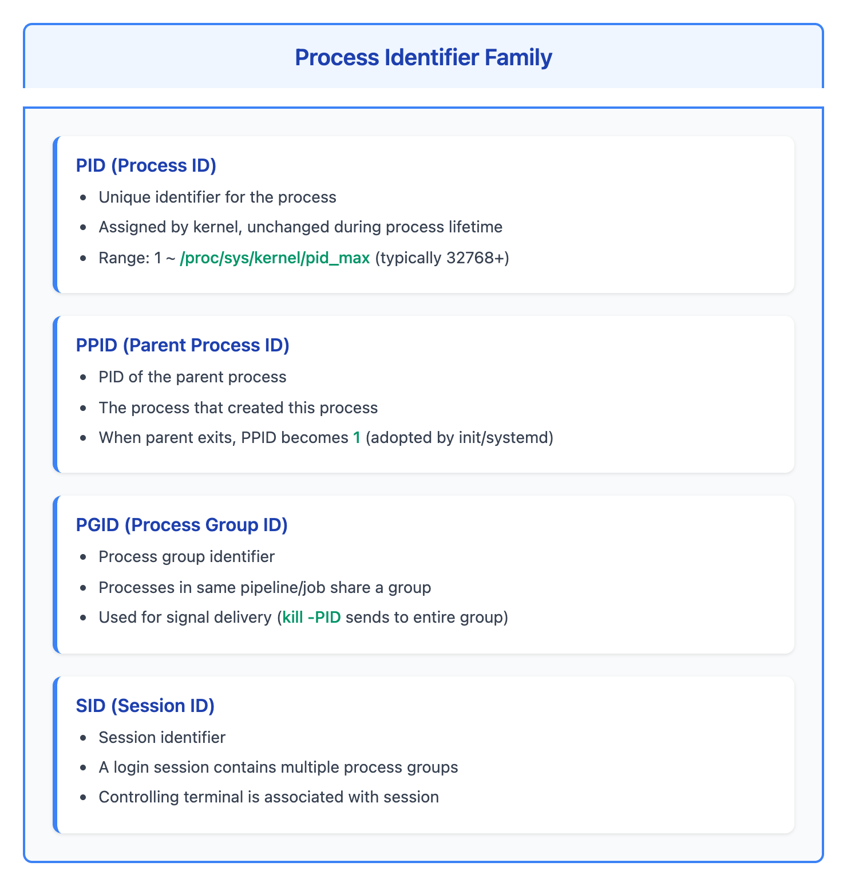
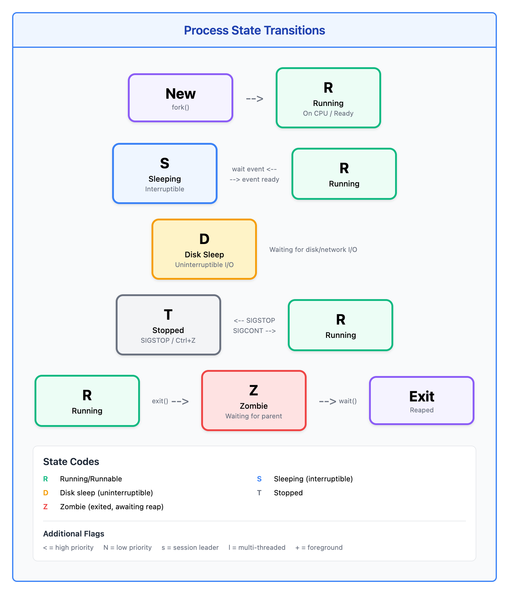
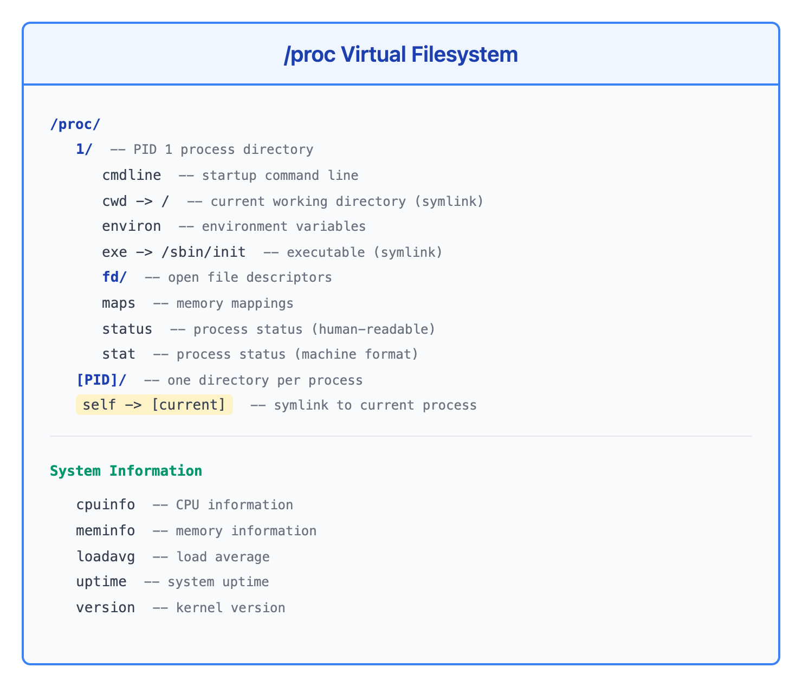
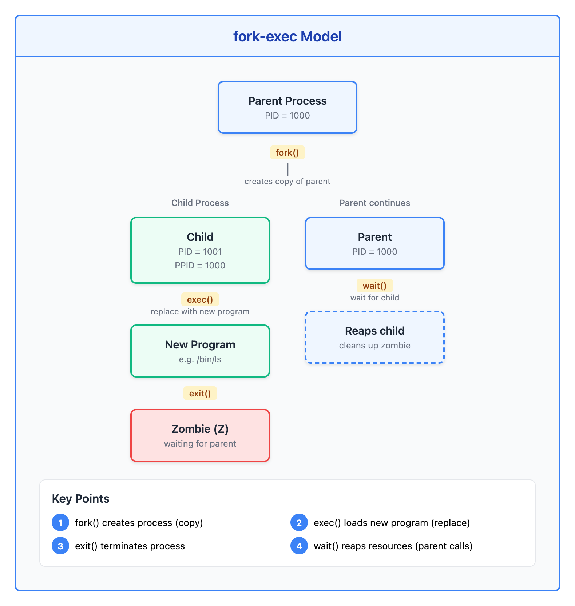

# 07 - 进程基础（Process Fundamentals）

> **目标**：深入理解 Linux 进程概念，掌握进程监控和问题诊断的核心技能  
> **前置**：基础 Linux 命令行操作，文件系统导航  
> **时间**：120-150 分钟  
> **实战场景**：运用监视中的进程检查、故障排查中的问题进程识别  

---

## 将学到的内容

1. 理解进程标识符（PID, PPID, PGID, SID）
2. 识别进程状态（R, S, D, T, Z）及其含义
3. 使用 ps 的两种风格（BSD vs POSIX）
4. 使用 top/htop 进行交互式监控
5. 用 pstree 查看进程层次结构
6. 探索 /proc 虚拟文件系统获取进程详情
7. 理解进程生命周期（fork-exec 模型）
8. 识别问题进程（CPU/内存消耗、僵尸进程、D 状态）

---

## 先跑起来！（5 分钟）

> 在学习理论之前，先体验进程查看的基本操作。  
> 运行这些命令，观察输出 -- 这就是你将要掌握的技能。  

```bash
# 查看当前 shell 的进程信息
echo "My PID: $$, My Parent PID: $PPID"

# 查看所有进程（BSD 风格）
ps aux | head -10

# 查看进程树
pstree -p | head -20

# 查看当前进程的详细状态
cat /proc/self/status | head -15

# 找到最消耗 CPU 的进程
ps aux --sort=-%cpu | head -5
```

**你刚刚查看了系统中运行的进程！**

每个命令、每个服务、每个后台任务都是一个进程。理解进程是 Linux 运维的核心技能。

现在让我们深入理解进程的世界。

---

## Step 1 -- 进程身份标识（15 分钟）

### 1.1 进程 ID 家族

每个进程都有一组标识符，用于追踪其身份和关系：



<details>
<summary>View ASCII source</summary>

```
┌─────────────────────────────────────────────────────────────────┐
│                    进程标识符家族                                │
├─────────────────────────────────────────────────────────────────┤
│                                                                  │
│   PID (Process ID)                                               │
│   ├── 进程的唯一标识符                                           │
│   ├── 内核分配，进程存活期间不变                                  │
│   └── 范围：1 ~ /proc/sys/kernel/pid_max（通常 32768 或更大）    │
│                                                                  │
│   PPID (Parent Process ID)                                       │
│   ├── 父进程的 PID                                               │
│   ├── 创建本进程的进程                                           │
│   └── 父进程退出后，PPID 变为 1（被 init/systemd 收养）          │
│                                                                  │
│   PGID (Process Group ID)                                        │
│   ├── 进程组标识符                                               │
│   ├── 同一管道/作业的进程属于同一组                               │
│   └── 用于信号分发（kill -PID 发送给整组）                       │
│                                                                  │
│   SID (Session ID)                                               │
│   ├── 会话标识符                                                 │
│   ├── 一个登录会话包含多个进程组                                  │
│   └── 控制终端与会话关联                                         │
│                                                                  │
└─────────────────────────────────────────────────────────────────┘
```

</details>

### 1.2 查看进程 ID

```bash
# 当前 shell 的 PID 和 PPID
echo "PID: $$"
echo "PPID: $PPID"

# 使用 ps 查看详细 ID 信息
ps -o pid,ppid,pgid,sid,comm -p $$

# 查看所有进程的 ID 关系
ps -eo pid,ppid,pgid,sid,comm | head -20
```

### 1.3 进程层次结构


<details>
<summary>View ASCII source</summary>

```
                    ┌───────────────────┐
                    │   init/systemd    │
                    │      PID=1        │
                    └─────────┬─────────┘
                              │
        ┌─────────────────────┼─────────────────────┐
        │                     │                     │
        ▼                     ▼                     ▼
┌───────────────┐    ┌───────────────┐    ┌───────────────┐
│    sshd       │    │   crond       │    │    nginx      │
│   PID=1234    │    │   PID=456     │    │   PID=789     │
│   PPID=1      │    │   PPID=1      │    │   PPID=1      │
└───────┬───────┘    └───────────────┘    └───────┬───────┘
        │                                         │
        ▼                                         ▼
┌───────────────┐                        ┌───────────────┐
│  sshd (会话)   │                        │ nginx worker  │
│   PID=5678    │                        │   PID=790     │
│   PPID=1234   │                        │   PPID=789    │
└───────┬───────┘                        └───────────────┘
        │
        ▼
┌───────────────┐
│    bash       │
│   PID=5680    │
│   PPID=5678   │
└───────────────┘

说明：
- init/systemd 是所有进程的祖先（PID=1）
- 守护进程直接由 init 启动（PPID=1）
- 用户登录 shell 通过 sshd → bash 链创建
```

</details>

### 1.4 PID=1 的特殊性

```bash
# 查看 PID=1 是什么
ps -p 1 -o pid,comm,args

# 在现代系统通常是 systemd
# 在老系统可能是 init 或 upstart

# PID=1 的职责：
# 1. 系统初始化
# 2. 收养孤儿进程（父进程退出后）
# 3. 回收僵尸进程
```

---

## Step 2 -- 进程状态（20 分钟）

### 2.1 进程状态详解

进程在生命周期中会经历不同的状态：



<details>
<summary>View ASCII source</summary>

```
┌─────────────────────────────────────────────────────────────────┐
│                      进程状态转换图                               │
├─────────────────────────────────────────────────────────────────┤
│                                                                  │
│                        ┌───────────┐                             │
│            fork()      │     R     │  CPU 时间片                  │
│     ┌─────────────────▶│  Running  │◀────────────┐               │
│     │                  │  运行态    │             │               │
│     │                  └─────┬─────┘             │               │
│     │                        │                   │               │
│     │                        │ 等待资源          │ 资源可用       │
│     │                        ▼                   │               │
│  ┌──┴──┐               ┌───────────┐            │               │
│  │ New │               │     S     │────────────┘               │
│  │ 新建 │               │ Sleeping  │                            │
│  └─────┘               │ 可中断睡眠 │                            │
│                        └───────────┘                             │
│                              │                                   │
│                              │ 不可中断 I/O                      │
│                              ▼                                   │
│                        ┌───────────┐                             │
│                        │     D     │                             │
│                        │  Disk     │  (等待磁盘/网络 I/O)         │
│                        │  Sleep    │  不可中断！                  │
│                        └───────────┘                             │
│                                                                  │
│     ┌───────────┐                         ┌───────────┐         │
│     │     T     │◀──── SIGSTOP ───────────│     R     │         │
│     │  Stopped  │                         │           │         │
│     │  停止态    │─────── SIGCONT ────────▶│           │         │
│     └───────────┘                         └───────────┘         │
│                                                                  │
│                        ┌───────────┐      ┌───────────┐         │
│                        │     Z     │      │   Exit    │         │
│          exit()        │  Zombie   │      │   退出     │         │
│     ─────────────────▶ │  僵尸态    │─────▶│           │         │
│                        │(等待父进程)│      └───────────┘         │
│                        └───────────┘         wait()              │
│                                                                  │
└─────────────────────────────────────────────────────────────────┘

状态码速查：
  R = Running/Runnable   运行中/可运行
  S = Sleeping           可中断睡眠（等待事件）
  D = Disk sleep         不可中断睡眠（等待 I/O）
  T = Stopped            已停止（收到 SIGSTOP）
  Z = Zombie             僵尸（已退出，等待父进程回收）

附加标志：
  < = 高优先级           N = 低优先级
  s = session leader     l = 多线程
  + = 前台进程组
```

</details>

### 2.2 各状态实际含义

| 状态 | 代码 | 含义 | 常见场景 |
|------|------|------|----------|
| Running | R | 正在运行或等待 CPU | 活跃计算任务 |
| Sleeping | S | 等待事件（可被信号唤醒） | 大多数进程的默认状态 |
| Disk Sleep | D | 等待 I/O（不可中断） | 磁盘/NFS 操作 |
| Stopped | T | 被信号暂停 | 调试、Ctrl+Z |
| Zombie | Z | 已退出但未被回收 | 父进程未 wait() |

### 2.3 查看进程状态

```bash
# ps 输出中的 STAT 列
ps aux | head -5
#  USER  PID %CPU %MEM   VSZ   RSS TTY STAT START   TIME COMMAND
#  root    1  0.0  0.1  1234  5678 ?   Ss   Jan01   0:03 /sbin/init

# STAT 列解读：
# S  = 睡眠状态
# Ss = 睡眠 + session leader
# R+ = 运行 + 前台进程组

# 查看特定状态的进程
ps aux | awk '$8 ~ /^R/'     # 运行状态
ps aux | awk '$8 ~ /^D/'     # D 状态（可能有问题！）
ps aux | awk '$8 ~ /^Z/'     # 僵尸进程
ps aux | awk '$8 ~ /^T/'     # 停止状态
```

### 2.4 问题状态：D 和 Z

**D 状态（Disk Sleep / Uninterruptible Sleep）**：

```bash
# D 状态是不可中断的！
# - 通常是在等待磁盘或网络 I/O
# - kill -9 也无法杀死 D 状态进程
# - 持续的 D 状态通常意味着 I/O 问题

# 查找 D 状态进程
ps aux | awk '$8 ~ /^D/ {print}'

# D 状态的常见原因：
# 1. 磁盘故障或 I/O 饱和
# 2. NFS 挂载无响应
# 3. 存储设备问题
# 4. 内核 bug（罕见）
```

**Z 状态（Zombie）**：

```bash
# 僵尸进程已经退出，但父进程还没有 wait()
# 僵尸进程只占用进程表条目，不占用其他资源
# 少量僵尸通常无害，大量累积需要关注

# 查找僵尸进程
ps aux | awk '$8 == "Z"'

# 查找僵尸进程的父进程
ps -eo pid,ppid,stat,comm | awk '$3 == "Z" {print "Zombie:", $1, "Parent:", $2}'
```

---

## Step 3 -- ps 命令详解（20 分钟）

### 3.1 两种风格

ps 命令有两种主要风格，都要掌握：

```bash
# BSD 风格（无前导破折号）
ps aux

# POSIX/Unix 风格（有前导破折号）
ps -ef

# 两者输出略有不同，但都常用
```

### 3.2 ps aux 详解

```bash
# BSD 风格：显示所有用户的所有进程
ps aux

# 各列含义：
# USER   - 进程所有者
# PID    - 进程 ID
# %CPU   - CPU 使用百分比
# %MEM   - 内存使用百分比
# VSZ    - 虚拟内存大小（KB）
# RSS    - 常驻内存大小（KB）
# TTY    - 控制终端（? = 无终端，守护进程）
# STAT   - 进程状态
# START  - 启动时间
# TIME   - 累计 CPU 时间
# COMMAND - 命令名

# 示例输出：
# USER  PID %CPU %MEM    VSZ   RSS TTY   STAT START TIME COMMAND
# root    1  0.0  0.1 169348 13132 ?     Ss   Jan01 0:09 /usr/lib/systemd/systemd
```

### 3.3 ps -ef 详解

```bash
# POSIX 风格：显示完整格式
ps -ef

# 各列含义：
# UID    - 用户 ID
# PID    - 进程 ID
# PPID   - 父进程 ID
# C      - CPU 使用率
# STIME  - 启动时间
# TTY    - 终端
# TIME   - CPU 时间
# CMD    - 完整命令行

# 显示进程树格式
ps -ef --forest
```

### 3.4 自定义输出格式

```bash
# 自定义列输出
ps -eo pid,ppid,user,%cpu,%mem,stat,start,time,comm

# 常用的自定义格式：
# 查看进程和父进程关系
ps -eo pid,ppid,comm --sort=ppid

# 查看内存使用详情
ps -eo pid,user,rss,vsz,%mem,comm --sort=-rss | head -20

# 查看进程启动命令
ps -eo pid,user,args | grep nginx

# 显示线程
ps -eLo pid,tid,ppid,comm
```

### 3.5 排序和过滤

```bash
# 按 CPU 使用率排序（降序）
ps aux --sort=-%cpu | head -10

# 按内存使用排序（降序）
ps aux --sort=-%mem | head -10

# 按启动时间排序（最新的在前）
ps aux --sort=-start_time | head -10

# 查找特定进程
ps aux | grep nginx
ps -C nginx -o pid,user,%cpu,comm    # 更精确

# 查找特定用户的进程
ps -u www-data -o pid,%cpu,comm
```

---

## Step 4 -- top 和 htop（15 分钟）

### 4.1 top 基础

```bash
# 启动 top
top

# top 界面说明：
# 第 1 行：系统时间、运行时长、用户数、负载
# 第 2 行：任务统计（总数、运行、睡眠、停止、僵尸）
# 第 3 行：CPU 使用率
# 第 4 行：内存使用
# 第 5 行：交换区使用
# 下方：进程列表
```

### 4.2 top 交互命令

```bash
# 在 top 中按以下键：

# 排序
P   # 按 CPU 排序（默认）
M   # 按内存排序
T   # 按运行时间排序
N   # 按 PID 排序

# 显示控制
1   # 显示各 CPU 核心使用率
c   # 显示完整命令行
H   # 显示线程
V   # 树形显示

# 过滤
u   # 按用户过滤
o   # 添加过滤器（例如：COMMAND=nginx）

# 操作
k   # 杀死进程（输入 PID）
r   # 调整优先级（renice）

# 退出
q   # 退出 top
```

### 4.3 top 批处理模式

```bash
# 非交互式运行（用于脚本和日志）
top -b -n 1 | head -20          # 运行一次
top -b -n 5 -d 2 > top.log      # 每 2 秒采样，共 5 次

# 查看特定进程
top -p 1234                     # 只显示 PID 1234
top -p 1234,5678,9012           # 显示多个 PID
```

### 4.4 htop（推荐）

htop 是 top 的增强版，界面更友好：

```bash
# 安装 htop
# RHEL/CentOS
sudo dnf install htop -y
# Debian/Ubuntu
sudo apt install htop -y

# 启动
htop
```

htop 的优势：

| 特性 | top | htop |
|------|-----|------|
| 彩色界面 | 需配置 | 默认 |
| 鼠标支持 | 无 | 有 |
| 水平滚动 | 无 | 有 |
| 进程树视图 | 需按 V | 按 F5 |
| 批量操作 | 无 | 有（空格选择） |
| 搜索进程 | 需输入过滤器 | 按 / 直接搜索 |

```bash
# htop 常用快捷键
F1    # 帮助
F2    # 设置
F3    # 搜索
F4    # 过滤
F5    # 树形视图
F6    # 排序
F9    # 杀死进程
F10   # 退出
Space # 标记进程
```

---

## Step 5 -- pstree：进程树（10 分钟）

### 5.1 基本用法

```bash
# 显示进程树
pstree

# 显示 PID
pstree -p

# 显示用户
pstree -u

# 组合使用
pstree -pu
```

### 5.2 实用选项

```bash
# 高亮当前进程
pstree -h

# 显示特定用户的进程树
pstree www-data

# 显示特定进程的子树
pstree -p 1234

# 显示特定进程的祖先
pstree -s -p 1234

# 紧凑显示（合并相同进程）
pstree -c    # 不合并
pstree       # 默认合并，如 nginx---3*[nginx]
```

### 5.3 示例输出解读

```bash
$ pstree -p
systemd(1)─┬─NetworkManager(850)─┬─{NetworkManager}(923)
           │                     └─{NetworkManager}(925)
           ├─sshd(1234)───sshd(5678)───bash(5680)───pstree(6789)
           ├─nginx(789)─┬─nginx(790)
           │            └─nginx(791)
           └─crond(456)

# 解读：
# systemd(1) 是根进程
# sshd(1234) 是主 sshd 守护进程
# sshd(5678) 是为你的 SSH 会话创建的子进程
# bash(5680) 是你的 shell
# pstree(6789) 是你刚运行的命令
# {NetworkManager} 用花括号表示线程
# nginx---3*[nginx] 表示 3 个相同的 nginx worker
```

---

## Step 6 -- /proc 虚拟文件系统（20 分钟）

### 6.1 /proc 概述

/proc 是一个虚拟文件系统，提供内核和进程信息的接口：



<details>
<summary>View ASCII source</summary>

```
┌─────────────────────────────────────────────────────────────────┐
│                    /proc 虚拟文件系统                            │
├─────────────────────────────────────────────────────────────────┤
│                                                                  │
│  /proc/                                                          │
│  ├── 1/                    ← PID 1 的进程目录                    │
│  │   ├── cmdline           ← 启动命令行                          │
│  │   ├── cwd -> /          ← 当前工作目录（符号链接）             │
│  │   ├── environ           ← 环境变量                            │
│  │   ├── exe -> /sbin/init ← 可执行文件（符号链接）               │
│  │   ├── fd/               ← 打开的文件描述符                    │
│  │   ├── maps              ← 内存映射                            │
│  │   ├── status            ← 进程状态（可读格式）                 │
│  │   └── stat              ← 进程状态（机器格式）                 │
│  │                                                               │
│  ├── [PID]/                ← 每个进程一个目录                    │
│  │                                                               │
│  ├── self -> [当前进程]     ← 指向当前进程的符号链接               │
│  │                                                               │
│  ├── cpuinfo               ← CPU 信息                           │
│  ├── meminfo               ← 内存信息                           │
│  ├── loadavg               ← 负载平均值                          │
│  ├── uptime                ← 系统运行时间                        │
│  └── version               ← 内核版本                           │
│                                                                  │
└─────────────────────────────────────────────────────────────────┘
```

</details>

### 6.2 进程目录探索

```bash
# 查看当前 shell 进程
ls -la /proc/self

# 查看进程命令行
cat /proc/self/cmdline | tr '\0' ' '; echo

# 查看进程状态
cat /proc/self/status

# 重要的 status 字段：
# Name:     进程名
# State:    状态（R/S/D/T/Z）
# Pid:      进程 ID
# PPid:     父进程 ID
# Uid:      用户 ID（real, effective, saved, filesystem）
# Gid:      组 ID
# VmSize:   虚拟内存大小
# VmRSS:    常驻内存大小
# Threads:  线程数
```

### 6.3 文件描述符

```bash
# 查看进程打开的文件
ls -l /proc/self/fd

# 输出示例：
# lrwx------ 1 user user 0 Jan  4 10:00 0 -> /dev/pts/0
# lrwx------ 1 user user 0 Jan  4 10:00 1 -> /dev/pts/0
# lrwx------ 1 user user 0 Jan  4 10:00 2 -> /dev/pts/0
# lr-x------ 1 user user 0 Jan  4 10:00 3 -> /proc/1234/fd

# 解读：
# 0 = stdin（标准输入）
# 1 = stdout（标准输出）
# 2 = stderr（标准错误）
# 3+ = 其他打开的文件

# 统计进程打开的文件数
ls /proc/1234/fd | wc -l

# 查看特定进程的文件描述符
ls -l /proc/$(pgrep nginx | head -1)/fd
```

### 6.4 内存映射

```bash
# 查看进程的内存映射
cat /proc/self/maps | head -20

# 输出示例：
# 地址范围              权限 偏移   设备  inode  路径
# 00400000-0040b000     r-xp 00000 fd:00 123456 /usr/bin/bash
# 00600000-00601000     r--p 0000b fd:00 123456 /usr/bin/bash
# 00601000-00602000     rw-p 0000c fd:00 123456 /usr/bin/bash

# 权限说明：
# r = 可读
# w = 可写
# x = 可执行
# p = 私有
# s = 共享
```

### 6.5 系统信息

```bash
# CPU 信息
cat /proc/cpuinfo | grep "model name" | head -1

# 内存信息
cat /proc/meminfo | head -10

# 负载平均值
cat /proc/loadavg
# 输出：1分钟 5分钟 15分钟 运行进程/总进程 最近PID

# 系统运行时间
cat /proc/uptime
# 输出：运行秒数 空闲秒数

# 内核版本
cat /proc/version
```

### 6.6 实用技巧

```bash
# 找到进程的可执行文件路径
readlink /proc/1234/exe

# 找到进程的当前工作目录
readlink /proc/1234/cwd

# 查看进程的环境变量
cat /proc/1234/environ | tr '\0' '\n'

# 查看进程的限制
cat /proc/1234/limits

# 检查进程是否存在
[ -d /proc/1234 ] && echo "Process exists" || echo "Process not found"
```

---

## Step 7 -- 进程生命周期（15 分钟）

### 7.1 fork-exec 模型

Linux 创建新进程采用 fork-exec 模型：



<details>
<summary>View ASCII source</summary>

```
┌─────────────────────────────────────────────────────────────────┐
│                      fork-exec 模型                              │
├─────────────────────────────────────────────────────────────────┤
│                                                                  │
│     父进程 (Parent)                                              │
│     PID = 1000                                                   │
│          │                                                       │
│          │ fork()                                                │
│          │ 创建子进程（完全复制父进程）                            │
│          ▼                                                       │
│     ┌────────────────────────────────────────┐                  │
│     │                                        │                  │
│     │  子进程 (Child)        父进程继续执行    │                  │
│     │  PID = 1001            PID = 1000      │                  │
│     │  PPID = 1000                           │                  │
│     │       │                     │          │                  │
│     │       │ exec()              │ wait()   │                  │
│     │       │ 替换为新程序         │ 等待子进程 │                  │
│     │       ▼                     │          │                  │
│     │  新程序执行                  │          │                  │
│     │  （如 /bin/ls）              │          │                  │
│     │       │                     │          │                  │
│     │       │ exit()              │          │                  │
│     │       │ 进程退出             │          │                  │
│     │       ▼                     │          │                  │
│     │  僵尸状态 (Z)               │          │                  │
│     │  等待父进程回收              │          │                  │
│     │       │                     │          │                  │
│     │       └─────────────────────┘          │                  │
│     │               父进程调用 wait()         │                  │
│     │               回收子进程资源            │                  │
│     │                                        │                  │
│     └────────────────────────────────────────┘                  │
│                                                                  │
│  关键点：                                                        │
│  1. fork() 创建进程（复制）                                       │
│  2. exec() 加载新程序（替换）                                     │
│  3. exit() 退出进程                                              │
│  4. wait() 回收资源（父进程调用）                                  │
│                                                                  │
└─────────────────────────────────────────────────────────────────┘
```

</details>

### 7.2 观察 fork-exec

```bash
# 创建一个简单的脚本来观察 fork
cat > /tmp/show-fork.sh << 'EOF'
#!/bin/bash
echo "Parent PID: $$"
bash -c 'echo "Child PID: $$, Parent: $PPID"'
echo "Back to parent"
EOF
chmod +x /tmp/show-fork.sh

# 运行并观察
/tmp/show-fork.sh
```

### 7.3 孤儿进程

```bash
# 孤儿进程：父进程退出后，子进程被 init/systemd 收养

# 创建孤儿进程的示例
bash -c 'sleep 60 &'
# 此时 sleep 的 PPID 是当前 shell

# 查看
ps -o pid,ppid,comm -p $(pgrep -f "sleep 60")

# 当父 shell 退出后，sleep 会被 PID=1 收养
```

### 7.4 僵尸进程的产生

```bash
# 僵尸进程产生原因：
# 子进程退出后，父进程没有调用 wait() 回收

# 模拟僵尸进程（仅供学习）
cat > /tmp/create-zombie.c << 'EOF'
#include <stdio.h>
#include <unistd.h>
int main() {
    pid_t pid = fork();
    if (pid > 0) {
        // 父进程不调用 wait()，直接睡眠
        printf("Parent PID: %d, sleeping...\n", getpid());
        sleep(60);
    } else {
        // 子进程立即退出
        printf("Child PID: %d exiting\n", getpid());
    }
    return 0;
}
EOF

# 如果有 gcc，可以编译运行
# gcc -o /tmp/create-zombie /tmp/create-zombie.c
# /tmp/create-zombie &
# ps aux | grep Z
```

---

## Step 8 -- 动手实验（30 分钟）

### 实验 1：进程探索

> **场景**：熟悉进程查看的各种方法。  

```bash
# 1. 查看当前进程的身份信息
echo "PID: $$"
echo "PPID: $PPID"
ps -o pid,ppid,pgid,sid,tty,comm -p $$

# 2. 查看完整的进程链（从你的 shell 到 init）
pstree -s -p $$

# 3. 比较 ps aux 和 ps -ef
echo "=== ps aux ==="
ps aux | head -5
echo ""
echo "=== ps -ef ==="
ps -ef | head -5

# 4. 查找最消耗资源的进程
echo "=== Top 5 CPU consumers ==="
ps aux --sort=-%cpu | head -6

echo "=== Top 5 Memory consumers ==="
ps aux --sort=-%mem | head -6
```

### 实验 2：深入 /proc

> **场景**：通过 /proc 获取进程详细信息。  

```bash
# 找一个长期运行的进程（如 sshd）
PROC_PID=$(pgrep -o sshd)
echo "Examining PID: $PROC_PID"

# 1. 查看进程状态
echo "=== Status ==="
cat /proc/$PROC_PID/status | grep -E "^(Name|State|Pid|PPid|Uid|Gid|VmSize|VmRSS|Threads):"

# 2. 查看命令行
echo ""
echo "=== Command Line ==="
cat /proc/$PROC_PID/cmdline | tr '\0' ' '; echo

# 3. 查看打开的文件数量
echo ""
echo "=== Open Files ==="
ls /proc/$PROC_PID/fd | wc -l
echo "files open"

# 4. 查看可执行文件路径
echo ""
echo "=== Executable ==="
readlink /proc/$PROC_PID/exe

# 5. 查看工作目录
echo ""
echo "=== Working Directory ==="
readlink /proc/$PROC_PID/cwd

# 6. 查看内存映射的库
echo ""
echo "=== Shared Libraries ==="
cat /proc/$PROC_PID/maps | grep '\.so' | awk '{print $6}' | sort -u | head -10
```

### 实验 3：识别问题进程

> **场景**：运维监控中发现系统异常，需要找出问题进程。  

```bash
# 1. 查找 D 状态进程（可能的 I/O 问题）
echo "=== D-state processes (I/O wait) ==="
ps aux | awk '$8 ~ /^D/ {print $2, $8, $11}'
# 如果有输出，说明有进程在等待 I/O

# 2. 查找僵尸进程
echo ""
echo "=== Zombie processes ==="
ps aux | awk '$8 == "Z" {print "Zombie:", $2, "Parent:", $3, "Command:", $11}'

# 3. 如果有僵尸，找出问题父进程
ZOMBIE_PARENTS=$(ps -eo ppid,stat | awk '$2 == "Z" {print $1}' | sort -u)
if [ -n "$ZOMBIE_PARENTS" ]; then
    echo ""
    echo "=== Parent processes with zombies ==="
    for ppid in $ZOMBIE_PARENTS; do
        ps -p $ppid -o pid,user,comm
    done
fi

# 4. 查找长时间运行的进程
echo ""
echo "=== Long running processes (>24h CPU time) ==="
ps -eo pid,user,etime,time,comm --sort=-time | head -10

# 5. 查找大量线程的进程
echo ""
echo "=== Processes with many threads ==="
ps -eo pid,user,nlwp,comm --sort=-nlwp | head -10
# nlwp = number of lightweight processes (threads)
```

### 实验 4：实时监控

> **场景**：使用 top/htop 进行实时监控。  

```bash
# 1. top 基础使用
echo "启动 top，尝试以下操作："
echo "  - 按 P 按 CPU 排序"
echo "  - 按 M 按内存排序"
echo "  - 按 1 显示各 CPU 核心"
echo "  - 按 c 显示完整命令"
echo "  - 按 q 退出"
echo ""
echo "按 Enter 开始..."
read
top -d 2

# 2. 如果安装了 htop
if command -v htop &>/dev/null; then
    echo ""
    echo "启动 htop，更友好的界面："
    echo "  - F5 切换树形视图"
    echo "  - F4 过滤进程"
    echo "  - Space 选择进程"
    echo "  - F10 退出"
    echo ""
    echo "按 Enter 开始..."
    read
    htop
fi

# 3. 批处理模式（适合脚本）
echo ""
echo "=== top 批处理输出 ==="
top -b -n 1 | head -20
```

---

## 反模式：常见错误

### 错误 1：忽略 D 状态进程

```bash
# 错误做法：看到 D 状态进程不管
ps aux | awk '$8 ~ /^D/'
# "哦有几个 D 状态，应该没事..."

# 正确做法：立即调查
# D 状态进程无法被 kill，通常意味着 I/O 问题
# 检查以下内容：
dmesg | tail -50                    # 内核消息
iostat -x 1 3                       # I/O 统计
df -h                               # 磁盘空间
mount | grep nfs                    # NFS 挂载状态
```

**原因**：D 状态持续意味着 I/O 子系统有问题，可能导致系统无响应。

### 错误 2：忽略僵尸进程累积

```bash
# 错误做法：少量僵尸就不管
# "就几个僵尸，系统还在运行，没事..."

# 正确做法：找出产生僵尸的父进程并修复
ps -eo ppid,stat | awk '$2 == "Z" {print $1}' | sort | uniq -c | sort -rn

# 如果同一个父进程产生大量僵尸：
# 1. 这是个 bug - 父进程没有正确 wait() 子进程
# 2. 重启父进程可以清理现有僵尸
# 3. 报告给开发团队修复代码
```

**原因**：僵尸累积会耗尽进程表条目，最终导致无法创建新进程。

### 错误 3：只用 top 做故障排查

```bash
# 错误做法：只看 top 就下结论
top
# "CPU 高的是这个进程，杀了它！"

# 正确做法：结合多种工具
# 1. top/htop - 实时概览
# 2. ps - 详细快照
# 3. /proc - 深入分析
# 4. pstree - 理解进程关系

# 例如：高 CPU 进程的完整调查
PID=1234
ps -p $PID -o pid,ppid,user,%cpu,%mem,etime,args
cat /proc/$PID/status
ls -l /proc/$PID/fd | wc -l
cat /proc/$PID/stack 2>/dev/null
```

**原因**：top 只是概览，深入分析需要多种工具配合。

### 错误 4：混淆虚拟内存和物理内存

```bash
# 错误理解：VSZ 很大就是内存泄漏
ps aux --sort=-vsz | head -5
# "VSZ 这么大，肯定有问题！"

# 正确理解：
# VSZ (Virtual Size) = 虚拟内存，包括代码、数据、共享库、映射文件等
# RSS (Resident Set Size) = 实际使用的物理内存

# 关注 RSS 和 %MEM
ps aux --sort=-%mem | head -5

# 内存泄漏的标志是 RSS 持续增长
# 可以定期采样观察
while true; do
    date
    ps -p $PID -o pid,rss,%mem
    sleep 60
done
```

---

## 职场小贴士（Japan IT Context）

### 运用监视（運用監視）

在日本 IT 企业，进程监控是日常运维的核心任务：

| 日语术语 | 含义 | 场景 |
|----------|------|------|
| 運用監視 | 运维监控 | 日常进程检查 |
| プロセス確認 | 进程确认 | 故障排查第一步 |
| 異常検知 | 异常检测 | 监控告警 |
| 性能劣化 | 性能下降 | CPU/内存异常 |

### 监控工具集成

```bash
# 日本企业常用的监控软件
# Zabbix - 开源，国内外都很流行
# JP1/AJS - Hitachi 出品，日本大企业标配
# Hinemos - NTT 出品，日本企业常用

# Zabbix 进程监控项目示例
# - proc.num[<name>,<user>,<state>]
#   proc.num[nginx]          # nginx 进程数
#   proc.num[,,Z]            # 僵尸进程数
#   proc.num[httpd,apache]   # apache 用户的 httpd 进程

# 进程数监控脚本（给 Zabbix agent 用）
#!/bin/bash
# /usr/local/bin/check_process.sh
PROC_NAME=$1
ps -C "$PROC_NAME" --no-headers | wc -l
```

### 障害対応（故障处理）

```bash
# 故障处理的进程检查流程

# 1. 快速概览
echo "=== 系统概览 ==="
uptime                              # 负载
free -h                             # 内存
df -h                               # 磁盘

# 2. 进程检查
echo "=== 进程检查 ==="
ps aux | head -5
ps aux --sort=-%cpu | head -5
ps aux --sort=-%mem | head -5

# 3. 问题进程
echo "=== 问题进程 ==="
ps aux | awk '$8 ~ /^[DZ]/'         # D/Z 状态

# 4. 服务状态
echo "=== 关键服务 ==="
systemctl is-active nginx httpd sshd mysql
```

### 夜勤（夜班）监控

```bash
# 夜班值班的进程监控脚本
# 定期执行，异常时告警

#!/bin/bash
# night-shift-check.sh

LOG=/var/log/night-shift-$(date +%Y%m%d).log
ALERT_EMAIL="oncall@company.co.jp"

{
    echo "=== $(date '+%Y-%m-%d %H:%M:%S') プロセス確認 ==="

    # 僵尸进程检查
    ZOMBIE_COUNT=$(ps aux | awk '$8 == "Z"' | wc -l)
    if [ $ZOMBIE_COUNT -gt 10 ]; then
        echo "[警告] 僵尸进程数: $ZOMBIE_COUNT"
        mail -s "[Alert] Zombie processes detected" $ALERT_EMAIL <<< "Zombie count: $ZOMBIE_COUNT"
    fi

    # D 状态检查
    DSTATE_COUNT=$(ps aux | awk '$8 ~ /^D/' | wc -l)
    if [ $DSTATE_COUNT -gt 5 ]; then
        echo "[警告] D状態プロセス数: $DSTATE_COUNT"
        mail -s "[Alert] D-state processes detected" $ALERT_EMAIL <<< "D-state count: $DSTATE_COUNT"
    fi

    # 负载检查
    LOAD=$(cat /proc/loadavg | awk '{print $1}')
    CPU_COUNT=$(nproc)
    if (( $(echo "$LOAD > $CPU_COUNT" | bc -l) )); then
        echo "[警告] 高負荷: $LOAD (CPU: $CPU_COUNT)"
    fi

    echo ""
} >> $LOG
```

---

## 检查清单

完成本课后，你应该能够：

- [ ] 解释 PID、PPID、PGID、SID 的含义
- [ ] 识别进程状态（R, S, D, T, Z）及其含义
- [ ] 使用 `ps aux` 和 `ps -ef` 查看进程
- [ ] 自定义 ps 输出格式（-o 选项）
- [ ] 使用 top/htop 进行交互式监控
- [ ] 使用 pstree 查看进程层次结构
- [ ] 通过 /proc 获取进程详细信息
- [ ] 理解 fork-exec 进程创建模型
- [ ] 找出 CPU/内存消耗大户
- [ ] 识别和分析 D 状态和僵尸进程
- [ ] 应用进程监控技能进行故障排查

---

## 本课小结

| 概念 | 命令/路径 | 记忆点 |
|------|-----------|--------|
| 进程 ID | PID, PPID, PGID, SID | 身份、父子、组、会话 |
| 进程状态 | R, S, D, T, Z | 运行、睡眠、IO等待、停止、僵尸 |
| BSD 风格 | `ps aux` | 显示所有进程，详细信息 |
| POSIX 风格 | `ps -ef` | 显示 PPID，支持 --forest |
| 自定义格式 | `ps -eo ...` | 按需选择列 |
| 交互监控 | `top`, `htop` | 实时查看，htop 更友好 |
| 进程树 | `pstree -p` | 可视化父子关系 |
| 进程详情 | `/proc/<pid>/` | status, cmdline, fd, maps |
| D 状态 | 不可中断 | 调查 I/O 问题 |
| 僵尸进程 | Z 状态 | 找出问题父进程 |

---

## 延伸阅读

- [Linux Process Management](https://www.kernel.org/doc/html/latest/admin-guide/pm/)
- [The /proc Filesystem](https://www.kernel.org/doc/html/latest/filesystems/proc.html)
- [ps(1) man page](https://man7.org/linux/man-pages/man1/ps.1.html)
- 上一课：[06 - sudo 配置](../06-sudo-configuration/) -- 权限提升配置
- 下一课：[08 - 信号与作业控制](../08-signals-job-control/) -- 进程信号和作业管理
- 相关课程：[LX03 - 文本处理](../../text-processing/) -- 结合管道处理 ps 输出

---

## 系列导航

[<-- 06 - sudo 配置](../06-sudo-configuration/) | [系列首页](../) | [08 - 信号与作业控制 -->](../08-signals-job-control/)
