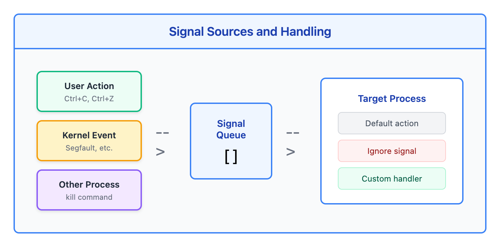
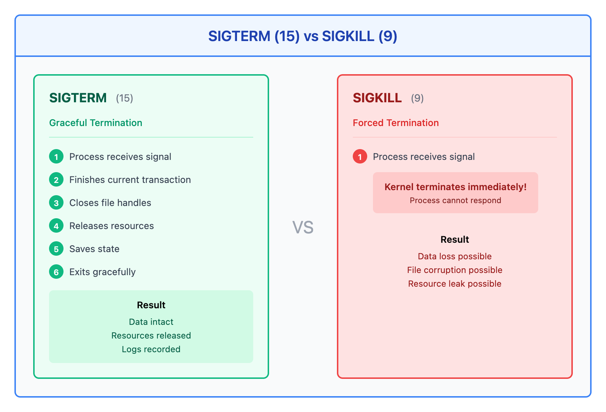
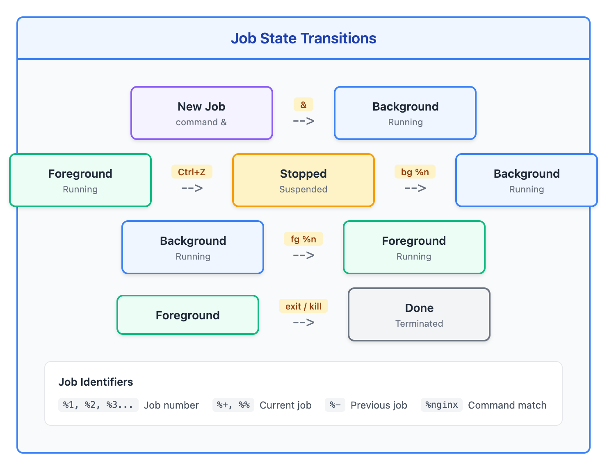

# 08 - 信号与作业控制（Signals and Job Control）

> **目标**：掌握进程间信号通信和 shell 作业控制，实现优雅的进程管理  
> **前置**：进程基础（Lesson 07），基础命令行操作  
> **时间**：⚡ 25 分钟（速读）/ 🔬 90 分钟（完整实操）  
> **实战场景**：障害対応中终止卡死进程，长时间运行任务的会话管理  

---

## 将学到的内容

1. 理解常用信号及其编号（SIGTERM, SIGKILL, SIGHUP）
2. 使用 kill、killall、pkill 发送信号
3. 理解 SIGTERM vs SIGKILL 的本质区别
4. 掌握作业控制（&, Ctrl+Z, fg, bg, jobs）
5. 使用 nohup 让进程在退出登录后继续运行
6. 使用 disown 分离已运行的进程
7. 了解 screen/tmux 持久会话管理

---

## 先跑起来！（5 分钟）

> 在学习理论之前，先体验信号和作业控制的威力。  
> 运行这些命令，观察输出 -- 这就是你将要掌握的技能。  

```bash
# 启动一个后台进程
sleep 300 &

# 查看后台作业
jobs

# 查看进程 ID
jobs -l

# 发送 SIGTERM（优雅终止）
kill %1

# 再启动一个，试试 Ctrl+Z
sleep 300
# 按 Ctrl+Z 暂停

# 查看暂停的作业
jobs

# 把它放到后台继续运行
bg %1

# 把它带回前台
fg %1
# 然后 Ctrl+C 终止
```

**你刚刚体验了 shell 的作业控制系统！**

这些技能在日本 IT 职场的运维工作中每天都会用到：
- **障害対応**：终止卡死的进程
- **メンテナンス作業**：让长时间任务在断开连接后继续运行

现在让我们深入理解背后的原理。

---

## Step 1 -- 信号：进程间的通信（15 分钟）

### 1.1 什么是信号

信号（Signal）是 Unix/Linux 系统中进程间通信的一种机制。当你按下 Ctrl+C 终止程序时，实际上是向进程发送了一个 SIGINT 信号。



<details>
<summary>View ASCII source</summary>

```
┌─────────────────────────────────────────────────────────────────┐
│                        信号的来源                                │
│                                                                  │
│   ┌──────────────┐                                              │
│   │   用户操作    │                                              │
│   │  (Ctrl+C)    │──────┐                                       │
│   └──────────────┘      │                                       │
│                         ▼                                        │
│   ┌──────────────┐   ┌────────────────┐   ┌──────────────────┐  │
│   │   内核事件    │──▶│    信号队列     │──▶│   目标进程        │  │
│   │ (段错误等)   │   │                │   │                  │  │
│   └──────────────┘   └────────────────┘   │  处理方式:        │  │
│                         ▲                  │  - 默认动作       │  │
│   ┌──────────────┐      │                  │  - 忽略信号       │  │
│   │   其他进程    │──────┘                  │  - 自定义处理     │  │
│   │  (kill cmd)  │                        └──────────────────┘  │
│   └──────────────┘                                              │
│                                                                  │
└─────────────────────────────────────────────────────────────────┘
```

</details>

### 1.2 常用信号列表

| 信号名 | 编号 | 默认动作 | 用途 | 可捕获 |
|--------|------|----------|------|--------|
| SIGHUP | 1 | 终止 | 挂起（终端断开）/ 重新加载配置 | 是 |
| SIGINT | 2 | 终止 | 键盘中断（Ctrl+C） | 是 |
| SIGQUIT | 3 | 终止+core | 键盘退出（Ctrl+\） | 是 |
| SIGKILL | 9 | 终止 | 强制杀死进程 | **否** |
| SIGTERM | 15 | 终止 | 优雅终止（默认） | 是 |
| SIGSTOP | 19 | 停止 | 暂停进程 | **否** |
| SIGTSTP | 20 | 停止 | 键盘暂停（Ctrl+Z） | 是 |
| SIGCONT | 18 | 继续 | 恢复暂停的进程 | 是 |

```bash
# 查看所有信号列表
kill -l

# 查看特定信号的编号
kill -l SIGTERM    # 输出: 15
kill -l SIGKILL    # 输出: 9
```

### 1.3 信号的三种处理方式

1. **默认动作**：执行系统定义的默认行为（如终止进程）
2. **忽略信号**：进程可以选择忽略某些信号
3. **自定义处理**：进程可以注册信号处理函数

> **重要**：SIGKILL (9) 和 SIGSTOP (19) **无法被捕获或忽略**，这是内核强制的。  

---

## Step 2 -- SIGTERM vs SIGKILL：优雅与暴力（20 分钟）

### 2.1 核心区别

这是本课**最重要**的概念。理解这两个信号的区别，是正确进程管理的基础。



<details>
<summary>View ASCII source</summary>

```
┌───────────────────────────────────────────────────────────────────────────┐
│                    SIGTERM (15) vs SIGKILL (9)                            │
│                                                                           │
│  SIGTERM (优雅终止)                                                        │
│  ─────────────────                                                        │
│                                                                           │
│  ┌────────┐    SIGTERM     ┌────────────────────────────────┐             │
│  │  用户   │───────────────▶│          进程                  │             │
│  └────────┘                │                                │             │
│                            │  1. 收到信号                    │             │
│                            │  2. 完成当前事务                │             │
│                            │  3. 关闭文件句柄                │             │
│                            │  4. 释放资源                    │             │
│                            │  5. 保存状态                    │             │
│                            │  6. 优雅退出                    │             │
│                            └────────────────────────────────┘             │
│                                         │                                  │
│                                         ▼                                  │
│                                  ┌─────────────┐                          │
│                                  │ 数据完整    │                          │
│                                  │ 资源释放    │                          │
│                                  │ 日志记录    │                          │
│                                  └─────────────┘                          │
│                                                                           │
│  ═══════════════════════════════════════════════════════════════════════  │
│                                                                           │
│  SIGKILL (强制终止)                                                        │
│  ─────────────────                                                        │
│                                                                           │
│  ┌────────┐    SIGKILL     ┌────────────────────────────────┐             │
│  │  用户   │───────────────▶│          进程                  │             │
│  └────────┘                │                                │             │
│                            │      ╔══════════════════╗      │             │
│                            │      ║  内核直接终止！   ║      │             │
│                            │      ║  进程无法响应    ║      │             │
│                            │      ╚══════════════════╝      │             │
│                            └────────────────────────────────┘             │
│                                         │                                  │
│                                         ▼                                  │
│                                  ┌─────────────┐                          │
│                                  │ 数据丢失    │                          │
│                                  │ 文件损坏    │                          │
│                                  │ 资源泄露    │                          │
│                                  └─────────────┘                          │
│                                                                           │
└───────────────────────────────────────────────────────────────────────────┘
```

</details>

### 2.2 为什么不能首先使用 kill -9

> **反模式警告**：把 `kill -9` 作为第一选择是**中等严重性**的错误操作。  

**风险**：

1. **数据损坏**：进程可能正在写入文件，被强制终止导致文件半写
2. **事务中断**：数据库进程可能正在提交事务
3. **资源泄露**：临时文件、锁文件、共享内存可能无法清理
4. **子进程孤儿化**：子进程可能变成僵尸进程

**正确做法**：

```bash
# 步骤 1：发送 SIGTERM（默认）
kill <pid>
# 或明确指定
kill -15 <pid>
kill -SIGTERM <pid>

# 步骤 2：等待 30 秒
sleep 30

# 步骤 3：检查进程是否还在
ps -p <pid>

# 步骤 4：如果还在，再用 SIGKILL
kill -9 <pid>
```

### 2.3 实际演示

```bash
# 创建一个会优雅处理信号的脚本
cat > /tmp/graceful.sh << 'EOF'
#!/bin/bash

cleanup() {
    echo "收到终止信号，正在清理..."
    echo "保存数据..."
    sleep 2
    echo "关闭连接..."
    sleep 1
    echo "清理完成，退出"
    exit 0
}

# 注册 SIGTERM 处理函数
trap cleanup SIGTERM SIGINT

echo "进程启动，PID: $$"
echo "等待信号... (按 Ctrl+C 或发送 SIGTERM)"

while true; do
    sleep 1
done
EOF
chmod +x /tmp/graceful.sh

# 终端 1：运行脚本
/tmp/graceful.sh

# 终端 2：发送 SIGTERM
kill $(pgrep -f graceful.sh)

# 观察：进程会优雅地清理并退出
```

```bash
# 对比：使用 SIGKILL
# 终端 1：再次运行
/tmp/graceful.sh

# 终端 2：发送 SIGKILL
kill -9 $(pgrep -f graceful.sh)

# 观察：进程立即终止，没有任何清理消息
```

### 2.4 特殊情况：何时可以直接用 SIGKILL

有些情况下，SIGTERM 无法终止进程：

1. **D 状态进程**（不可中断睡眠）：通常是等待 I/O，只能等待或重启系统
2. **僵尸进程**：已死亡但未被父进程回收，需要杀父进程
3. **进程忽略 SIGTERM**：某些设计不当的程序
4. **已经尝试 SIGTERM 等待足够时间**：确认进程不响应后

```bash
# 检查进程状态
ps aux | grep <pid>
# 第 8 列是状态：
# R = 运行
# S = 可中断睡眠（可以接收信号）
# D = 不可中断睡眠（无法接收信号）
# Z = 僵尸
# T = 停止
```

---

## Step 3 -- kill、killall、pkill 命令（15 分钟）

### 3.1 kill：按 PID 发送信号

```bash
# 基本语法
kill [-信号] <PID>

# 发送 SIGTERM（默认）
kill 1234

# 发送 SIGKILL
kill -9 1234
kill -KILL 1234
kill -SIGKILL 1234

# 发送 SIGHUP（常用于重新加载配置）
kill -1 1234
kill -HUP 1234

# 发送信号给多个进程
kill 1234 5678 9012
```

### 3.2 killall：按名称发送信号

```bash
# 基本语法
killall [-信号] <进程名>

# 终止所有 nginx 进程
killall nginx

# 强制终止所有 python 进程
killall -9 python

# 只终止属于特定用户的进程
killall -u tanaka nginx

# 交互式确认
killall -i nginx
# 会逐个询问是否终止

# 等待进程终止
killall -w nginx
# 命令会阻塞直到所有进程终止
```

### 3.3 pkill：按模式发送信号

pkill 比 killall 更灵活，支持正则表达式和更多筛选条件。

```bash
# 基本语法
pkill [-信号] [选项] <模式>

# 按命令名模式匹配
pkill nginx           # 匹配进程名包含 "nginx"
pkill -f "python app" # 匹配完整命令行（-f 很重要！）

# 按用户
pkill -u tanaka       # 终止 tanaka 的所有进程
pkill -u tanaka nginx # 终止 tanaka 的 nginx 进程

# 按终端
pkill -t pts/0        # 终止 pts/0 终端的所有进程

# 按父进程
pkill -P 1234         # 终止 PID 1234 的所有子进程

# 只发信号给最新的进程
pkill -n nginx        # 只终止最新启动的 nginx

# 只发信号给最老的进程
pkill -o nginx        # 只终止最早启动的 nginx
```

### 3.4 pgrep：查找进程（不发送信号）

```bash
# pgrep 和 pkill 选项相同，但只显示 PID
pgrep nginx
pgrep -f "python app.py"
pgrep -u tanaka

# 显示进程名
pgrep -a nginx
# 输出: 1234 nginx: master process /usr/sbin/nginx

# 显示完整命令
pgrep -af "python"
# 输出: 5678 python /opt/app/main.py --config /etc/app.conf
```

### 3.5 三个命令的比较

| 特性 | kill | killall | pkill |
|------|------|---------|-------|
| 输入 | PID | 精确进程名 | 模式/正则 |
| 匹配方式 | 精确 | 精确名称 | 模式匹配 |
| 完整命令行匹配 | 否 | 否 | -f 选项 |
| 按用户筛选 | 否 | -u | -u |
| 按终端筛选 | 否 | 否 | -t |
| 跨平台兼容性 | 最好 | 较好 | Linux 最佳 |

---

## Step 4 -- 作业控制：fg、bg、jobs（15 分钟）

### 4.1 什么是作业

在 shell 中，一个**作业（Job）**是一个或多个进程的集合，由 shell 管理。



<details>
<summary>View ASCII source</summary>

```
┌───────────────────────────────────────────────────────────────────┐
│                        作业状态转换图                              │
│                                                                   │
│                          ┌─────────────┐                          │
│                          │   前台运行   │                          │
│                          │ (Foreground) │                          │
│                          └──────┬──────┘                          │
│                      Ctrl+Z │   │ fg %n                           │
│                             ▼   │                                  │
│  ┌─────────────┐      ┌─────────────┐      ┌─────────────┐       │
│  │   新建作业   │──&──▶│   后台运行   │◀─bg──│    暂停     │       │
│  │  command &  │      │ (Background) │      │  (Stopped)  │       │
│  └─────────────┘      └──────┬──────┘      └─────────────┘       │
│                              │ fg %n              ▲                │
│                              ▼                    │                │
│                          ┌─────────────┐         │                │
│                          │   前台运行   │─Ctrl+Z──┘                │
│                          │ (Foreground) │                          │
│                          └──────┬──────┘                          │
│                                 │ exit / kill                      │
│                                 ▼                                  │
│                          ┌─────────────┐                          │
│                          │    终止     │                          │
│                          │  (Done)     │                          │
│                          └─────────────┘                          │
│                                                                   │
│  作业标识：                                                        │
│  %1, %2, %3...  - 作业编号                                        │
│  %+, %%         - 当前作业                                        │
│  %-             - 前一个作业                                      │
│  %nginx         - 命令名匹配的作业                                │
│                                                                   │
└───────────────────────────────────────────────────────────────────┘
```

</details>

### 4.2 后台运行：&

```bash
# 在命令末尾加 & 让进程在后台运行
sleep 100 &
# 输出: [1] 12345
#       作业号  PID

# 启动多个后台作业
sleep 200 &
sleep 300 &

# 查看后台作业
jobs
# 输出:
# [1]   Running    sleep 100 &
# [2]-  Running    sleep 200 &
# [3]+  Running    sleep 300 &
#       +表示当前作业，-表示前一个作业
```

### 4.3 暂停：Ctrl+Z

```bash
# 运行一个前台进程
sleep 100

# 按 Ctrl+Z 暂停
# 输出: [1]+  Stopped    sleep 100

# 查看状态
jobs
# 输出: [1]+  Stopped    sleep 100
```

### 4.4 fg 和 bg

```bash
# bg：让暂停的作业在后台继续运行
bg %1
# 或
bg %+    # 当前作业
bg %-    # 前一个作业
bg       # 默认当前作业

# fg：把后台作业带到前台
fg %1
fg %sleep    # 按命令名匹配

# 实际示例
sleep 100       # 前台运行
# Ctrl+Z        # 暂停
jobs            # [1]+ Stopped sleep 100
bg %1           # 后台继续
jobs            # [1]+ Running sleep 100 &
fg %1           # 带回前台
# Ctrl+C        # 终止
```

### 4.5 作业标识符

```bash
# 多种方式引用作业
%1        # 作业编号 1
%+, %%    # 当前作业（最近操作的）
%-        # 前一个作业
%string   # 命令以 string 开头的作业
%?string  # 命令包含 string 的作业

# 示例
jobs
# [1]   Running    sleep 100 &
# [2]-  Running    python app.py &
# [3]+  Running    nginx &

fg %py      # 带 python 到前台
kill %?app  # 杀死包含 "app" 的作业
```

---

## Step 5 -- 断开连接后保持运行（20 分钟）

### 5.1 问题：SSH 断开后进程终止

当你断开 SSH 连接或关闭终端时，shell 会向其所有子进程发送 **SIGHUP** 信号，导致进程终止。

```bash
# 这是问题所在：
ssh server
./long-running-task.sh &
exit  # 断开连接后，long-running-task.sh 也会终止！
```

### 5.2 解决方案 1：nohup

`nohup`（no hang up）让进程忽略 SIGHUP 信号。

```bash
# 基本语法
nohup command &

# 示例：运行长任务
nohup ./backup.sh &
# 输出：nohup: ignoring input and appending output to 'nohup.out'

# 指定输出文件
nohup ./backup.sh > /var/log/backup.log 2>&1 &

# 完整的生产级用法
nohup /opt/scripts/data-sync.sh \
    > /var/log/data-sync.log \
    2>&1 &
echo $!  # 显示 PID，记录下来

# 检查 nohup.out
tail -f nohup.out
```

**重要**：`nohup` 必须和 `&` 一起使用！

```bash
# 错误用法（进程仍在前台）
nohup ./backup.sh
# 如果你按 Ctrl+C，进程会终止

# 正确用法
nohup ./backup.sh &
```

### 5.3 解决方案 2：disown

`disown` 用于将**已经运行**的进程从 shell 的作业列表中移除。

```bash
# 场景：已经启动了一个长任务，忘记用 nohup
./long-task.sh &

# 发现问题：如果断开，这个进程会终止
jobs
# [1]+  Running    ./long-task.sh &

# 使用 disown 将其从 shell 分离
disown %1

# 现在 jobs 中不再显示
jobs
# (空)

# 但进程仍在运行
pgrep -f long-task
```

```bash
# disown 的选项
disown %1       # 移除作业 1
disown -h %1    # 不移除，但让作业忽略 SIGHUP
disown -a       # 移除所有作业
disown -r       # 只移除运行中的作业

# 最佳实践：disown -h
# 作业仍在 jobs 列表中，但不会收到 SIGHUP
./important-task.sh &
disown -h %1
jobs  # 仍然显示
# 但断开连接时不会终止
```

### 5.4 解决方案 3：screen / tmux

对于需要**长期交互**的任务，screen 或 tmux 是更好的选择。

```bash
# 安装（如果没有）
sudo yum install screen tmux    # RHEL/CentOS
sudo apt install screen tmux    # Debian/Ubuntu

# === screen 基本用法 ===
# 创建新会话
screen -S mysession

# 在 screen 内运行任务
./long-task.sh
# 按 Ctrl+A D 分离（detach）

# 列出会话
screen -ls

# 重新连接
screen -r mysession

# === tmux 基本用法 ===
# 创建新会话
tmux new -s mysession

# 在 tmux 内运行任务
./long-task.sh
# 按 Ctrl+B D 分离

# 列出会话
tmux ls

# 重新连接
tmux attach -t mysession
```

### 5.5 三种方案的比较

| 特性 | nohup | disown | screen/tmux |
|------|-------|--------|-------------|
| 事前规划 | 需要 | 事后补救 | 需要 |
| 交互能力 | 无 | 无 | 完整终端 |
| 输出重定向 | 需手动 | 原样 | 自动保存 |
| 重新连接 | 不可 | 不可 | 可以 |
| 适用场景 | 一次性任务 | 忘记 nohup | 需要交互的长任务 |

### 5.6 生产环境最佳实践

```bash
# 方案 1：简单的一次性任务
nohup /opt/scripts/backup.sh > /var/log/backup-$(date +%Y%m%d).log 2>&1 &
echo "Backup started with PID: $!"

# 方案 2：需要监控的任务（推荐）
tmux new -d -s backup '/opt/scripts/backup.sh; echo Done; read'
# -d: 后台启动
# -s backup: 会话名称
# read: 完成后等待，方便查看结果

# 检查状态
tmux ls

# 查看输出
tmux attach -t backup

# 方案 3：使用 systemd 服务（最推荐，但需要 root）
# 对于真正的后台服务，应该创建 systemd unit file
```

---

## Step 6 -- 动手实验（30 分钟）

### 实验 1：信号发送练习

> **场景**：练习正确的进程终止方法。  

```bash
# 1. 创建测试脚本
cat > /tmp/test-signal.sh << 'EOF'
#!/bin/bash
trap 'echo "收到 SIGTERM，开始清理..."; sleep 2; echo "清理完成"; exit 0' SIGTERM
trap 'echo "收到 SIGINT (Ctrl+C)"; exit 1' SIGINT

echo "进程启动，PID: $$"
echo "支持的信号: SIGTERM, SIGINT"
echo "等待信号..."

count=0
while true; do
    ((count++))
    echo "运行中... ($count 秒)"
    sleep 1
done
EOF
chmod +x /tmp/test-signal.sh

# 2. 在后台运行
/tmp/test-signal.sh &
# 记下 PID

# 3. 发送 SIGTERM
kill %1
# 观察优雅退出过程

# 4. 再次运行，测试 SIGKILL
/tmp/test-signal.sh &
kill -9 %1
# 观察：没有清理消息，直接终止
```

### 实验 2：作业控制练习

```bash
# 1. 启动多个后台作业
sleep 100 &
sleep 200 &
sleep 300 &

# 2. 查看作业
jobs -l    # 显示 PID

# 3. 把 sleep 200 带到前台
fg %2

# 4. 按 Ctrl+Z 暂停
# 输出: [2]+  Stopped    sleep 200

# 5. 让它在后台继续
bg %2

# 6. 终止所有 sleep 作业
kill %1 %2 %3

# 7. 验证
jobs       # 应该为空
```

### 实验 3：断开连接后保持运行

```bash
# 方法 1：nohup
# 创建模拟任务
cat > /tmp/long-task.sh << 'EOF'
#!/bin/bash
for i in {1..60}; do
    echo "$(date): 任务运行中... ($i/60)"
    sleep 1
done
echo "任务完成！"
EOF
chmod +x /tmp/long-task.sh

# 使用 nohup 运行
cd /tmp
nohup ./long-task.sh > task.log 2>&1 &
echo "任务已启动，PID: $!"

# 检查日志
tail -f task.log
# Ctrl+C 退出 tail

# 方法 2：tmux（如果可用）
tmux new -d -s mytask '/tmp/long-task.sh'
tmux ls
tmux attach -t mytask
# Ctrl+B D 分离
```

### 实验 4：实际场景 - 障害対応

> **场景**：模拟处理一个卡死的进程。  

```bash
# 1. 创建一个"卡死"的进程
cat > /tmp/stuck.sh << 'EOF'
#!/bin/bash
# 模拟一个忽略 SIGTERM 的进程（不要在生产中这样做！）
trap '' SIGTERM
echo "进程启动，PID: $$"
echo "此进程会忽略 SIGTERM"
while true; do
    sleep 1
done
EOF
chmod +x /tmp/stuck.sh

# 2. 运行它
/tmp/stuck.sh &
STUCK_PID=$!
echo "卡死进程 PID: $STUCK_PID"

# 3. 尝试正常终止
kill $STUCK_PID
sleep 3
ps -p $STUCK_PID
# 进程仍在运行

# 4. 等待后使用 SIGKILL
echo "SIGTERM 无效，等待 5 秒后使用 SIGKILL..."
sleep 5
kill -9 $STUCK_PID
ps -p $STUCK_PID
# 进程已终止
```

---

## 反模式：常见错误

### 错误 1：kill -9 作为第一选择

```bash
# 危险！不要这样做
kill -9 $(pgrep nginx)
# 数据库可能有未提交的事务
# 日志可能写到一半

# 正确做法
kill $(pgrep nginx)        # 先 SIGTERM
sleep 30                   # 等待
pgrep nginx && kill -9 $(pgrep nginx)  # 必要时才 SIGKILL
```

**安全风险**：MEDIUM - 可能导致数据损坏、文件不完整。

### 错误 2：使用 nohup 但忘记 &

```bash
# 错误：进程仍在前台
nohup ./backup.sh
# Ctrl+C 会终止进程

# 正确：必须放到后台
nohup ./backup.sh &
```

### 错误 3：不检查进程是否处理 SIGHUP

```bash
# 许多守护进程用 SIGHUP 重新加载配置
kill -HUP $(pgrep nginx)   # nginx 会重新加载配置，不会终止！
kill -HUP $(pgrep sshd)    # sshd 会重新读取配置

# 要终止这些进程，用 SIGTERM
kill $(pgrep nginx)
```

**常见的 SIGHUP 行为**：

| 进程 | SIGHUP 行为 |
|------|-------------|
| nginx | 重新加载配置 |
| apache | 优雅重启 |
| sshd | 重新读取配置 |
| rsyslogd | 重新打开日志文件 |

### 错误 4：忽略 D 状态进程

```bash
# D 状态（不可中断睡眠）的进程无法被杀死
ps aux | awk '$8 ~ /^D/'

# 不要反复尝试 kill -9
# 应该：
# 1. 检查 I/O 等待原因（dmesg, iostat）
# 2. 解决底层问题（磁盘、NFS 等）
# 3. 必要时重启系统
```

---

## 职场小贴士（Japan IT Context）

### 障害対応（故障处理）中的信号使用

在日本 IT 职场，处理故障时进程管理是核心技能：

| 日语术语 | 含义 | 信号使用场景 |
|----------|------|--------------|
| 障害対応（しょうがいたいおう） | 故障处理 | 终止卡死进程 |
| 強制終了（きょうせいしゅうりょう） | 强制终止 | 最后手段才用 kill -9 |
| 正常停止（せいじょうていし） | 正常停止 | 先用 SIGTERM |
| メンテナンス作業 | 维护作业 | nohup 用于长时间任务 |

### 典型的障害対応流程

```bash
# 1. 确认问题进程
ps aux | grep <问题进程>
top -p <PID>

# 2. 记录状态（这很重要！）
echo "=== $(date) ===" >> /var/log/incident.log
ps aux | grep <进程名> >> /var/log/incident.log

# 3. 尝试正常终止
kill <PID>
echo "Sent SIGTERM to PID <PID>" >> /var/log/incident.log

# 4. 等待并确认
sleep 30
if ps -p <PID> > /dev/null; then
    echo "Process did not terminate, sending SIGKILL" >> /var/log/incident.log
    kill -9 <PID>
fi

# 5. 记录结果
echo "Process terminated at $(date)" >> /var/log/incident.log
```

### 夜勤（やきん）中的长时间任务

```bash
# 夜勤时经常需要运行长时间的维护任务

# 方法 1：nohup + 日志
nohup /opt/maintenance/data-migration.sh \
    > /var/log/maintenance/migration-$(date +%Y%m%d).log \
    2>&1 &
echo "Migration started at $(date), PID: $!" | tee -a /var/log/shift-report.log

# 方法 2：tmux 会话（方便交接）
tmux new -s maintenance-$(date +%m%d)
# 在 tmux 中运行任务
# Ctrl+B D 分离

# 交接时：
# "maintenance-0104 の tmux セッションで移行作業が実行中です"
# "tmux attach -t maintenance-0104 で確認できます"
```

### 运维文档模板

```markdown
## プロセス強制終了手順（进程强制终止步骤）

### 前提条件
- 対象プロセスが応答しないことを確認済み
- 正常停止（SIGTERM）を試行済み（30秒待機）

### 手順
1. プロセス状態確認
   ```
   ps aux | grep <プロセス名>
   ```

2. SIGTERM 送信
   ```
   kill <PID>
   ```

3. 30秒待機後、プロセス確認
   ```
   sleep 30 && ps -p <PID>
   ```

4. 必要に応じて SIGKILL
   ```
   kill -9 <PID>
   ```

### 注意事項
- kill -9 は最終手段として使用
- データ損失のリスクあり
- 実行前後でログを記録すること
```

---

## 检查清单

完成本课后，你应该能够：

- [ ] 解释 SIGTERM 和 SIGKILL 的区别
- [ ] 说明为什么不应该首先使用 `kill -9`
- [ ] 使用 kill、killall、pkill 发送信号
- [ ] 使用 `&` 在后台启动进程
- [ ] 使用 Ctrl+Z 暂停进程，fg/bg 切换前后台
- [ ] 使用 `jobs` 查看作业列表
- [ ] 使用 `nohup` 让进程在退出登录后继续运行
- [ ] 使用 `disown` 分离已运行的进程
- [ ] 了解 screen/tmux 的基本使用
- [ ] 正确处理 D 状态和僵尸进程

---

## 本课小结

| 概念 | 命令/操作 | 记忆点 |
|------|-----------|--------|
| 优雅终止 | `kill <PID>` 或 `kill -15` | **默认首选**，允许清理 |
| 强制终止 | `kill -9` | **最后手段**，可能数据损坏 |
| 按名称杀 | `killall nginx` | 精确匹配进程名 |
| 按模式杀 | `pkill -f "python app"` | 正则匹配命令行 |
| 后台运行 | `command &` | 不阻塞终端 |
| 暂停进程 | `Ctrl+Z` | 变为 Stopped 状态 |
| 后台继续 | `bg %n` | Stopped → Running |
| 前台继续 | `fg %n` | 带回前台 |
| 查看作业 | `jobs -l` | 显示 PID |
| 断开存活 | `nohup cmd &` | 忽略 SIGHUP |
| 事后补救 | `disown %n` | 从 shell 分离 |
| 持久会话 | `tmux` / `screen` | 可重连的终端 |

---

## 延伸阅读

- [signal(7) man page](https://man7.org/linux/man-pages/man7/signal.7.html)
- [Bash Job Control](https://www.gnu.org/software/bash/manual/html_node/Job-Control.html)
- [tmux Wiki](https://github.com/tmux/tmux/wiki)
- 上一课：[07 - 进程基础](../07-process-fundamentals/) -- 进程状态与监控
- 下一课：[09 - 软件包管理 (RPM/DNF)](../09-package-management-rpm-dnf/) -- 安装与管理软件
- 相关课程：[LX05 - Systemd 服务管理](../../lx05-systemd/) -- 服务的启动与停止

---

## 系列导航

[<-- 07 - 进程基础](../07-process-fundamentals/) | [系列首页](../) | [09 - 软件包管理 -->](../09-package-management-rpm-dnf/)
