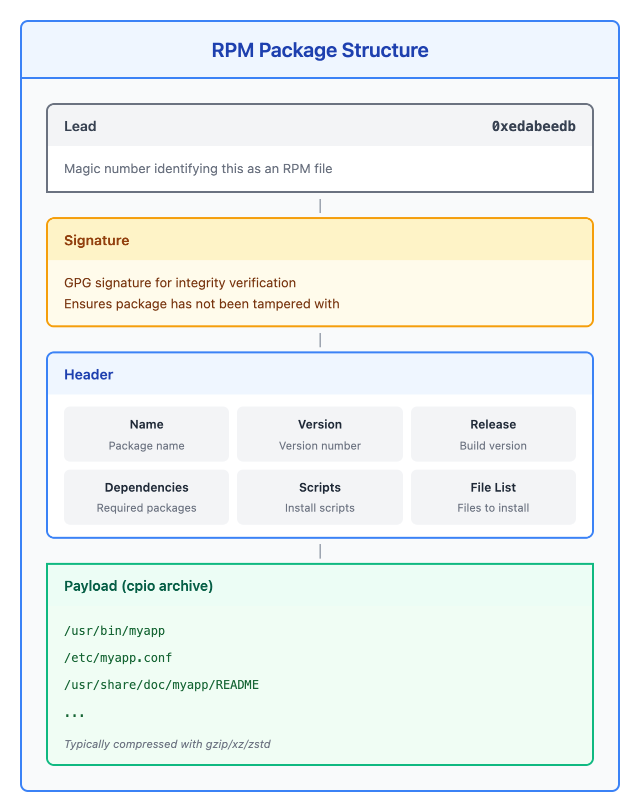
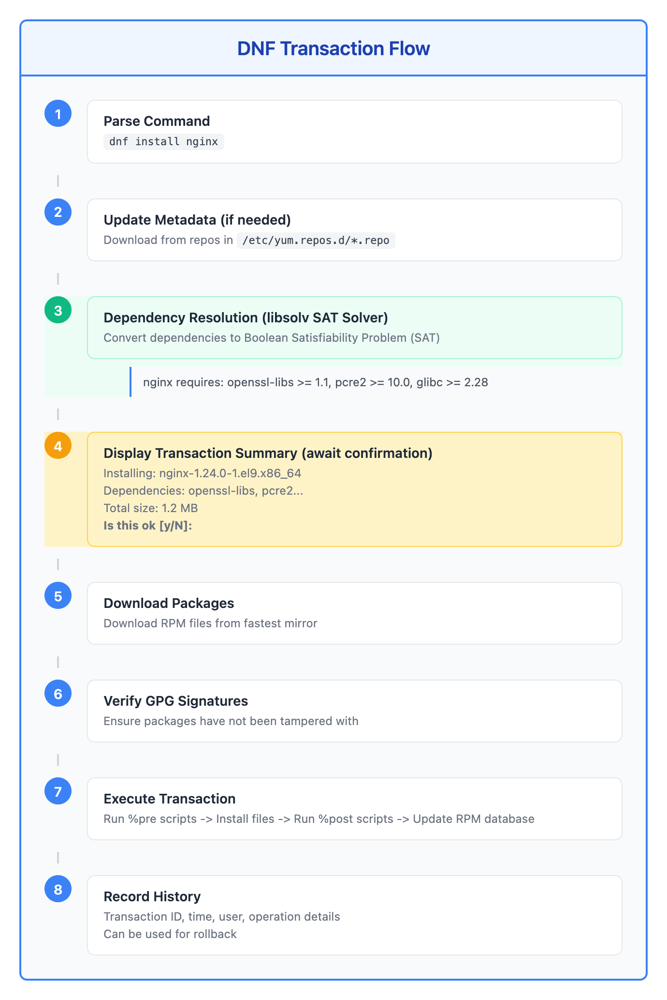

# 09 - 软件包管理 (RPM/DNF)

> **目标**：掌握 RHEL 系统的软件包管理，学会查询、安装、更新和回滚操作  
> **前置**：基础 Linux 命令行操作，进程管理概念  
> **时间**：⚡ 30 分钟（速读）/ 🔬 120 分钟（完整实操）  
> **实战场景**：企业环境下的软件包生命周期管理  

---

## 将学到的内容

1. 理解 RPM 软件包的结构（header + payload）
2. 使用 rpm 命令查询已安装软件包
3. 使用 rpm -V 验证软件包完整性
4. 使用 dnf 安装、删除、更新软件包
5. 使用 dnf search/info/list 查找软件包信息
6. 使用 dnf history 查看和回滚变更
7. 理解依赖解析和事务处理
8. 了解 libsolv SAT solver 的工作原理

---

## 先跑起来！（5 分钟）

> 在学习理论之前，先体验软件包管理的基本操作。  
> 运行这些命令，观察输出 -- 这就是你将要掌握的技能。  

```bash
# 查看系统已安装的软件包数量
rpm -qa | wc -l

# 查看 bash 软件包的详细信息
rpm -qi bash

# 查看 bash 包含哪些文件
rpm -ql bash | head -10

# 查找某个文件属于哪个软件包
rpm -qf /usr/bin/ls

# 搜索可用的软件包
dnf search htop

# 查看软件包变更历史
dnf history | head -10
```

**你刚刚使用了 RPM 和 DNF -- RHEL 系统的核心软件包管理工具！**

RPM 是底层工具，直接操作单个软件包；DNF 是高层工具，自动处理依赖关系。

现在让我们深入理解软件包管理的原理和最佳实践。

---

## Step 1 -- RPM 软件包结构（15 分钟）

### 1.1 什么是 RPM？

RPM（Red Hat Package Manager）是 RHEL、CentOS、AlmaLinux、Rocky Linux、Fedora 等发行版使用的软件包格式。



<details>
<summary>View ASCII source</summary>

```
┌─────────────────────────────────────────────────────────────────┐
│                     RPM 软件包结构                               │
│                                                                  │
│  ┌─────────────────────────────────────────────────────────┐    │
│  │                      Lead                                │    │
│  │              (Magic Number: 0xedabeedb)                 │    │
│  │              标识这是一个 RPM 文件                       │    │
│  └─────────────────────────────────────────────────────────┘    │
│                              │                                   │
│                              ▼                                   │
│  ┌─────────────────────────────────────────────────────────┐    │
│  │                     Signature                            │    │
│  │              GPG 签名（验证完整性）                       │    │
│  │              用于确保包未被篡改                          │    │
│  └─────────────────────────────────────────────────────────┘    │
│                              │                                   │
│                              ▼                                   │
│  ┌─────────────────────────────────────────────────────────┐    │
│  │                      Header                              │    │
│  │    ┌─────────────┬─────────────┬─────────────┐          │    │
│  │    │   Name      │   Version   │   Release   │          │    │
│  │    │  软件名称    │   版本号     │  发布版本   │          │    │
│  │    └─────────────┴─────────────┴─────────────┘          │    │
│  │    ┌─────────────┬─────────────┬─────────────┐          │    │
│  │    │ Dependencies│   Scripts   │  File List  │          │    │
│  │    │  依赖信息    │ 安装脚本    │  文件列表   │          │    │
│  │    └─────────────┴─────────────┴─────────────┘          │    │
│  └─────────────────────────────────────────────────────────┘    │
│                              │                                   │
│                              ▼                                   │
│  ┌─────────────────────────────────────────────────────────┐    │
│  │                  Payload (cpio archive)                  │    │
│  │    ┌────────────────────────────────────────────────┐   │    │
│  │    │  /usr/bin/myapp                                │   │    │
│  │    │  /etc/myapp.conf                               │   │    │
│  │    │  /usr/share/doc/myapp/README                   │   │    │
│  │    │  ...（实际安装的文件）                          │   │    │
│  │    └────────────────────────────────────────────────┘   │    │
│  │              通常使用 gzip/xz/zstd 压缩                  │    │
│  └─────────────────────────────────────────────────────────┘    │
│                                                                  │
└─────────────────────────────────────────────────────────────────┘
```

</details>

### 1.2 RPM 文件命名规范

```
nginx-1.24.0-1.el9.x86_64.rpm
  │     │    │  │    │      │
  │     │    │  │    │      └─ 扩展名
  │     │    │  │    └──────── 架构 (x86_64, aarch64, noarch)
  │     │    │  └───────────── 发行版 (el9 = RHEL 9)
  │     │    └──────────────── Release 版本（构建版本）
  │     └───────────────────── Version 版本（上游版本）
  └─────────────────────────── Name 软件名称
```

**常见架构**：

| 架构 | 含义 | 示例 |
|------|------|------|
| x86_64 | 64位 Intel/AMD | 大多数服务器 |
| aarch64 | 64位 ARM | AWS Graviton |
| noarch | 架构无关 | 纯脚本/配置 |
| i686 | 32位 x86 | 遗留系统 |

### 1.3 RPM 数据库

```bash
# RPM 数据库位置
ls -la /var/lib/rpm/

# 数据库包含：
# - 已安装软件包信息
# - 文件所有权信息
# - 依赖关系图
# - 安装/更新历史

# 重建数据库（出问题时使用）
sudo rpm --rebuilddb
```

---

## Step 2 -- rpm 查询命令（20 分钟）

### 2.1 查询已安装软件包

```bash
# -q 是查询模式，-a 是所有已安装的包
rpm -qa                        # 列出所有已安装的软件包
rpm -qa | wc -l                # 统计已安装包数量
rpm -qa | grep nginx           # 查找包含 nginx 的包
rpm -qa --last | head -10      # 按安装时间排序（最新在前）
```

### 2.2 查询软件包信息

```bash
# -qi = query info（查询信息）
rpm -qi bash

# 输出示例：
# Name        : bash
# Version     : 5.1.8
# Release     : 6.el9
# Architecture: x86_64
# Install Date: Fri 03 Jan 2026 10:30:15 AM JST
# Group       : System Environment/Shells
# Size        : 7903756
# License     : GPLv3+
# Signature   : RSA/SHA256, ...
# Source RPM  : bash-5.1.8-6.el9.src.rpm
# Build Date  : Wed 15 Nov 2025 02:15:30 PM UTC
# Build Host  : x86-64-01.build.eng.rdu2.redhat.com
# Packager    : Red Hat, Inc. <http://bugzilla.redhat.com/bugzilla>
# Vendor      : Red Hat, Inc.
# URL         : https://www.gnu.org/software/bash
# Summary     : The GNU Bourne Again shell
# Description : The GNU Bourne Again shell ...
```

### 2.3 查询软件包文件列表

```bash
# -ql = query list（查询文件列表）
rpm -ql bash                   # 列出 bash 包含的所有文件
rpm -ql bash | wc -l           # 统计文件数量
rpm -ql bash | grep bin        # 只看可执行文件

# -qc = query config（查询配置文件）
rpm -qc bash                   # 只列出配置文件

# -qd = query docs（查询文档文件）
rpm -qd bash                   # 只列出文档文件
```

### 2.4 反向查询：文件属于哪个包

```bash
# -qf = query file（查询文件所属包）
rpm -qf /usr/bin/ls            # 查找 ls 命令属于哪个包
rpm -qf /etc/passwd            # 查找配置文件属于哪个包
rpm -qf /usr/lib64/libc.so.6   # 查找库文件属于哪个包

# 实用场景：发现未知进程时
ps aux | grep suspicious
rpm -qf /path/to/suspicious    # 确认进程来源
```

### 2.5 查询依赖关系

```bash
# -qR = query requires（查询依赖）
rpm -qR bash                   # bash 依赖哪些包

# -q --provides = 查询提供什么
rpm -q --provides bash         # bash 提供什么功能

# -q --whatprovides = 谁提供这个功能
rpm -q --whatprovides /bin/sh  # 谁提供 /bin/sh

# -q --whatrequires = 谁依赖这个包
rpm -q --whatrequires bash     # 哪些包依赖 bash
```

### 2.6 查询脚本

```bash
# -q --scripts = 查询安装脚本
rpm -q --scripts nginx

# RPM 支持四种脚本：
# %pretrans   - 事务开始前
# %pre        - 安装前
# %post       - 安装后
# %preun      - 卸载前
# %postun     - 卸载后
# %posttrans  - 事务结束后
```

### 2.7 rpm 查询速查表

| 命令 | 含义 | 用途 |
|------|------|------|
| `rpm -qa` | query all | 列出所有已安装包 |
| `rpm -qi <pkg>` | query info | 显示包信息 |
| `rpm -ql <pkg>` | query list | 列出包文件 |
| `rpm -qf <file>` | query file | 查找文件所属包 |
| `rpm -qR <pkg>` | query requires | 查看依赖 |
| `rpm -qc <pkg>` | query config | 只显示配置文件 |
| `rpm -qd <pkg>` | query docs | 只显示文档文件 |
| `rpm -q --scripts <pkg>` | query scripts | 显示安装脚本 |

---

## Step 3 -- rpm -V 验证软件包（15 分钟）

### 3.1 什么是软件包验证

`rpm -V` 比较已安装文件与 RPM 数据库中记录的原始状态，检测文件是否被修改。

```bash
# -V = verify（验证）
rpm -V bash                    # 验证 bash 包
rpm -Va                        # 验证所有已安装的包（耗时）
rpm -Va > /tmp/rpm-verify.log 2>&1  # 保存验证结果
```

### 3.2 理解验证输出

```bash
# 验证输出格式
S.5....T.  c /etc/nginx/nginx.conf

# 每个字符的含义：
# S = Size 大小变化
# M = Mode 权限变化
# 5 = MD5 校验和变化（内容变化）
# D = Device 设备号变化
# L = Link 符号链接变化
# U = User 所有者变化
# G = Group 所属组变化
# T = Time 修改时间变化
# P = Capabilities 变化

# 文件类型标识：
# c = config 配置文件
# d = documentation 文档文件
# g = ghost 虚拟文件
# l = license 许可文件
# r = readme 说明文件
```

### 3.3 验证示例

```bash
# 验证 nginx 包
sudo rpm -V nginx

# 典型输出（配置文件被修改是正常的）：
S.5....T.  c /etc/nginx/nginx.conf

# 解读：
# S = 大小变了
# 5 = 内容变了（MD5 不同）
# T = 修改时间变了
# c = 这是配置文件
# 结论：nginx.conf 被管理员修改过（正常）

# 检查二进制文件是否被篡改（安全审计）
rpm -V coreutils | grep -v "^......G"
# 如果二进制文件显示变化，可能是安全问题！
```

### 3.4 安全审计场景

```bash
#!/bin/bash
# rpm-security-audit.sh - 安全审计脚本

echo "=== RPM 安全审计报告 ==="
echo "日期: $(date '+%Y-%m-%d %H:%M:%S')"
echo ""

echo "=== 1. 检查被修改的二进制文件 ==="
# 排除配置文件和文档，只看可执行文件
rpm -Va 2>/dev/null | grep -E "^.{5}.*\s+/usr/(s)?bin/" | grep -v " c "

echo ""
echo "=== 2. 检查被修改的库文件 ==="
rpm -Va 2>/dev/null | grep -E "^.{5}.*\s+/usr/lib(64)?/" | grep -v " c "

echo ""
echo "=== 3. 最近安装的软件包 ==="
rpm -qa --last | head -10

echo ""
echo "=== 完成 ==="
```

---

## Step 4 -- DNF 基础操作（20 分钟）

### 4.1 DNF vs YUM

DNF（Dandified YUM）是 RHEL 8+ 的默认包管理器，取代了旧版 YUM。

| 特性 | YUM | DNF |
|------|-----|-----|
| 依赖解析器 | Python 实现 | libsolv (C语言 SAT solver) |
| 性能 | 较慢 | 更快 |
| 内存使用 | 较高 | 较低 |
| Python 版本 | Python 2 | Python 3 |
| RHEL 版本 | RHEL 7 及之前 | RHEL 8+ |

> **注意**：RHEL 8+ 中 `yum` 命令是 `dnf` 的符号链接，保持向后兼容。  

### 4.2 安装软件包

```bash
# 安装单个软件包
sudo dnf install htop

# 安装多个软件包
sudo dnf install htop vim-enhanced tmux

# 自动确认（脚本中使用）
sudo dnf install -y htop

# 安装本地 RPM 文件（自动解决依赖）
sudo dnf install ./package.rpm

# 安装软件包组
sudo dnf groupinstall "Development Tools"
```

### 4.3 删除软件包

```bash
# 删除软件包
sudo dnf remove htop

# 删除软件包及其未使用的依赖
sudo dnf autoremove htop

# 清理所有不需要的依赖
sudo dnf autoremove
```

### 4.4 更新软件包

```bash
# 更新所有软件包
sudo dnf update

# 更新特定软件包
sudo dnf update nginx

# 只检查可用更新（不安装）
dnf check-update

# 安全更新
sudo dnf update --security

# 更新到特定版本
sudo dnf update nginx-1.24.0
```

### 4.5 DNF 事务流程



<details>
<summary>View ASCII source</summary>

```
┌─────────────────────────────────────────────────────────────────┐
│                     DNF 事务处理流程                             │
│                                                                  │
│  用户命令                                                        │
│      │                                                           │
│      ▼                                                           │
│  ┌──────────────────────────────────────────────────────────┐   │
│  │  1. 解析命令                                              │   │
│  │     dnf install nginx                                     │   │
│  └──────────────────────────────────────────────────────────┘   │
│      │                                                           │
│      ▼                                                           │
│  ┌──────────────────────────────────────────────────────────┐   │
│  │  2. 更新元数据（如需要）                                   │   │
│  │     从 /etc/yum.repos.d/*.repo 定义的源下载              │   │
│  └──────────────────────────────────────────────────────────┘   │
│      │                                                           │
│      ▼                                                           │
│  ┌──────────────────────────────────────────────────────────┐   │
│  │  3. 依赖解析（libsolv SAT Solver）                        │   │
│  │     ┌────────────────────────────────────────────────┐   │   │
│  │     │  nginx 需要:                                    │   │   │
│  │     │    - openssl-libs >= 1.1                       │   │   │
│  │     │    - pcre2 >= 10.0                             │   │   │
│  │     │    - glibc >= 2.28                             │   │   │
│  │     │  解析为布尔可满足性问题 (SAT)                   │   │   │
│  │     └────────────────────────────────────────────────┘   │   │
│  └──────────────────────────────────────────────────────────┘   │
│      │                                                           │
│      ▼                                                           │
│  ┌──────────────────────────────────────────────────────────┐   │
│  │  4. 显示事务摘要（等待确认）                              │   │
│  │     Installing: nginx-1.24.0-1.el9.x86_64                │   │
│  │     Dependencies: openssl-libs, pcre2 ...               │   │
│  │     Total size: 1.2 MB                                   │   │
│  │     Is this ok [y/N]:                                    │   │
│  └──────────────────────────────────────────────────────────┘   │
│      │                                                           │
│      ▼                                                           │
│  ┌──────────────────────────────────────────────────────────┐   │
│  │  5. 下载软件包                                            │   │
│  │     从最快的镜像下载 RPM 文件                            │   │
│  └──────────────────────────────────────────────────────────┘   │
│      │                                                           │
│      ▼                                                           │
│  ┌──────────────────────────────────────────────────────────┐   │
│  │  6. 验证 GPG 签名                                         │   │
│  │     确保软件包未被篡改                                    │   │
│  └──────────────────────────────────────────────────────────┘   │
│      │                                                           │
│      ▼                                                           │
│  ┌──────────────────────────────────────────────────────────┐   │
│  │  7. 执行事务                                              │   │
│  │     - 运行 %pre 脚本                                      │   │
│  │     - 安装文件                                            │   │
│  │     - 运行 %post 脚本                                     │   │
│  │     - 更新 RPM 数据库                                     │   │
│  └──────────────────────────────────────────────────────────┘   │
│      │                                                           │
│      ▼                                                           │
│  ┌──────────────────────────────────────────────────────────┐   │
│  │  8. 记录历史                                              │   │
│  │     事务 ID、时间、用户、操作详情                         │   │
│  │     可用于回滚                                            │   │
│  └──────────────────────────────────────────────────────────┘   │
│                                                                  │
└─────────────────────────────────────────────────────────────────┘
```

</details>

---

## Step 5 -- dnf search/info/list（15 分钟）

### 5.1 搜索软件包

```bash
# 搜索软件包名称和描述
dnf search nginx

# 只搜索名称
dnf search --names-only nginx

# 搜索提供特定文件的包
dnf provides /usr/bin/htop
dnf provides "*/nginx.conf"

# 搜索提供特定功能的包
dnf provides "webserver"
```

### 5.2 查看软件包信息

```bash
# 显示软件包详细信息
dnf info nginx

# 输出示例：
# Available Packages
# Name         : nginx
# Epoch        : 1
# Version      : 1.24.0
# Release      : 1.el9
# Architecture : x86_64
# Size         : 594 k
# Source       : nginx-1.24.0-1.el9.src.rpm
# Repository   : appstream
# Summary      : A high performance web server
# URL          : https://nginx.org
# License      : BSD-2-Clause
# Description  : Nginx is a web server ...

# 查看已安装包的信息
dnf info --installed nginx
```

### 5.3 列出软件包

```bash
# 列出所有可用软件包
dnf list available | head -20

# 列出已安装的软件包
dnf list installed

# 列出可更新的软件包
dnf list updates

# 列出特定模式的软件包
dnf list "nginx*"
dnf list installed "python3-*"
```

### 5.4 查看仓库信息

```bash
# 列出已启用的仓库
dnf repolist

# 列出所有仓库（包括禁用的）
dnf repolist all

# 查看仓库详细信息
dnf repoinfo appstream
```

---

## Step 6 -- dnf history 和回滚（20 分钟）

### 6.1 查看历史记录

```bash
# 查看事务历史
dnf history

# 输出示例：
# ID     | Command line              | Date and time    | Action(s)      | Altered
# -------------------------------------------------------------------------------
#     15 | install htop              | 2026-01-04 10:30 | Install        |    1
#     14 | update nginx              | 2026-01-03 14:22 | Upgrade        |    3
#     13 | remove vim                | 2026-01-02 09:15 | Erase          |    1

# 查看特定事务的详细信息
dnf history info 15

# 查看最近 N 条记录
dnf history list last
```

### 6.2 回滚事务

```bash
# 撤销特定事务（undo）
sudo dnf history undo 15

# 示例：如果事务 15 是安装 htop，undo 会卸载 htop

# 重做事务（redo）
sudo dnf history redo 15

# 回滚到特定时间点（rollback）
sudo dnf history rollback 12
# 撤销从 12 之后的所有事务
```

### 6.3 history 命令详解

| 命令 | 功能 | 示例 |
|------|------|------|
| `dnf history` | 列出历史 | 查看最近操作 |
| `dnf history info <id>` | 事务详情 | 查看具体变更 |
| `dnf history undo <id>` | 撤销事务 | 卸载刚安装的包 |
| `dnf history redo <id>` | 重做事务 | 重新执行操作 |
| `dnf history rollback <id>` | 回滚到 | 恢复到某状态 |
| `dnf history userinstalled` | 用户安装 | 非依赖安装的包 |

### 6.4 回滚实战场景

```bash
# 场景：更新后服务异常，需要回滚

# 1. 查看最近的更新操作
dnf history | head -5

# 2. 查看更新了什么
dnf history info 15

# 3. 确认要回滚
sudo dnf history undo 15

# 4. 验证服务恢复
systemctl status myservice

# 5. 锁定版本防止再次更新
sudo dnf versionlock add package-name
```

### 6.5 版本锁定

```bash
# 安装 versionlock 插件
sudo dnf install python3-dnf-plugin-versionlock

# 锁定软件包版本
sudo dnf versionlock add nginx

# 查看已锁定的包
dnf versionlock list

# 解锁
sudo dnf versionlock delete nginx

# 清除所有锁定
sudo dnf versionlock clear
```

---

## Step 7 -- 依赖解析与 SAT Solver（10 分钟）

### 7.1 什么是依赖地狱

**依赖地狱（Dependency Hell）** 是指软件包之间的依赖关系冲突：

```
Package A 需要 lib-1.0
Package B 需要 lib-2.0
lib-1.0 和 lib-2.0 互相冲突
→ 无法同时安装 A 和 B
```

### 7.2 libsolv SAT Solver

DNF 使用 **libsolv** 库进行依赖解析，它将问题转换为布尔可满足性问题（SAT）：

```
依赖关系转换为逻辑表达式：
- install(nginx) → install(openssl) AND install(pcre2)
- install(openssl-1.1) XOR install(openssl-3.0)  # 冲突
- ...

SAT Solver 求解：
找到一组软件包版本的组合，使所有约束都满足
```

**优势**：
- 比 YUM 的迭代算法更快
- 能处理更复杂的依赖关系
- 提供更清晰的冲突解释

### 7.3 处理依赖问题

```bash
# 查看依赖问题
dnf check

# 查看软件包依赖树
dnf repoquery --requires nginx
dnf repoquery --requires --resolve nginx

# 查看反向依赖（谁依赖这个包）
dnf repoquery --whatrequires nginx

# 模拟安装（不实际执行）
dnf install nginx --assumeno
```

---

## Step 8 -- 动手实验（30 分钟）

### 实验 1：RPM 查询练习

```bash
# 1. 统计系统已安装的软件包
echo "=== 已安装软件包统计 ==="
rpm -qa | wc -l

# 2. 查找最近安装的 10 个软件包
echo "=== 最近安装的软件包 ==="
rpm -qa --last | head -10

# 3. 查看 systemd 包的信息
echo "=== systemd 包信息 ==="
rpm -qi systemd

# 4. 找出 /usr/bin/curl 属于哪个包
echo "=== curl 命令属于 ==="
rpm -qf /usr/bin/curl

# 5. 列出 curl 包的所有文件
echo "=== curl 包文件列表 ==="
rpm -ql curl | head -20

# 6. 查看 curl 的依赖
echo "=== curl 依赖 ==="
rpm -qR curl
```

### 实验 2：DNF 操作练习

```bash
# 1. 搜索 htop
echo "=== 搜索 htop ==="
dnf search htop

# 2. 查看 htop 信息
echo "=== htop 信息 ==="
dnf info htop

# 3. 安装 htop（需要 root）
echo "=== 安装 htop ==="
sudo dnf install -y htop

# 4. 验证安装
echo "=== 验证安装 ==="
rpm -qi htop
which htop

# 5. 查看安装历史
echo "=== 安装历史 ==="
dnf history | head -5

# 6. 查看事务详情
echo "=== 最近事务详情 ==="
dnf history info last
```

### 实验 3：回滚变更

```bash
# 1. 查看当前历史
dnf history

# 2. 记住当前事务 ID
CURRENT_ID=$(dnf history | awk 'NR==2 {print $1}')
echo "当前事务 ID: $CURRENT_ID"

# 3. 安装测试软件包
sudo dnf install -y vim-enhanced

# 4. 验证安装
rpm -q vim-enhanced

# 5. 查看新事务
dnf history | head -3

# 6. 撤销安装
NEW_ID=$(dnf history | awk 'NR==2 {print $1}')
echo "撤销事务 ID: $NEW_ID"
sudo dnf history undo $NEW_ID -y

# 7. 验证已卸载
rpm -q vim-enhanced
```

### 实验 4：软件包验证

```bash
# 1. 验证核心工具包
echo "=== 验证 coreutils ==="
rpm -V coreutils

# 2. 验证 bash 包
echo "=== 验证 bash ==="
rpm -V bash

# 3. 模拟配置文件修改
sudo cp /etc/bashrc /etc/bashrc.bak
sudo echo "# Test comment" >> /etc/bashrc

# 4. 再次验证
echo "=== 修改后验证 bash ==="
rpm -V bash

# 5. 恢复配置
sudo mv /etc/bashrc.bak /etc/bashrc

# 6. 最终验证
echo "=== 恢复后验证 ==="
rpm -V bash
```

---

## 反模式：常见错误

### 错误 1：使用 rpm --nodeps 或 --force

```bash
# 极其危险！不要这样做！
rpm -ivh --nodeps package.rpm    # 跳过依赖检查
rpm -ivh --force package.rpm     # 强制安装

# 后果：
# 1. 破坏 RPM 数据库一致性
# 2. 软件可能无法运行（缺少依赖）
# 3. 未来更新会失败（依赖地狱）
# 4. 系统变得不可预测

# 正确做法：使用 dnf 安装（自动处理依赖）
sudo dnf install ./package.rpm
```

**安全风险**：HIGH - 破坏系统完整性，后续维护成本极高。

### 错误 2：不了解软件包来源就安装

```bash
# 危险！从不可信来源安装
curl -O https://random-site.com/software.rpm
sudo rpm -ivh software.rpm    # 没有验证签名！

# 正确做法：
# 1. 使用官方仓库
sudo dnf install official-package

# 2. 如果必须安装外部 RPM，验证签名
rpm --checksig package.rpm
rpm -K package.rpm

# 3. 检查软件包内容
rpm -qlp package.rpm    # 查看将要安装的文件
rpm -qip package.rpm    # 查看包信息
```

### 错误 3：混合不兼容的仓库

```bash
# 危险！混用不兼容的仓库
# 例如：RHEL 9 系统添加 RHEL 7 的仓库

# 问题：
# 1. 库版本冲突（glibc 等核心库）
# 2. 依赖无法解析
# 3. 可能损坏系统

# 正确做法：
# 1. 只使用与发行版匹配的仓库
dnf repolist

# 2. 使用仓库优先级
# /etc/yum.repos.d/myrepo.repo
# [myrepo]
# priority=10    # 数字越小优先级越高

# 3. 在测试环境验证后再用于生产
```

### 错误 4：忽略 GPG 签名警告

```bash
# 危险！禁用 GPG 检查
sudo dnf install --nogpgcheck suspicious.rpm

# /etc/yum.repos.d/bad.repo
# gpgcheck=0    # 极其危险！

# 正确做法：始终启用 GPG 检查
# gpgcheck=1
# gpgkey=https://example.com/RPM-GPG-KEY

# 导入可信的 GPG 密钥
sudo rpm --import https://repo.example.com/RPM-GPG-KEY
```

**安全风险**：CRITICAL - 允许安装被篡改的软件包。

---

## 职场小贴士（Japan IT Context）

### RHEL 是企业标准（内部標準）

在日本企业环境中，RHEL（Red Hat Enterprise Linux）是最常见的服务器操作系统：

| 日语术语 | 含义 | 场景 |
|----------|------|------|
| 内部標準 | 内部标准 | 公司规定使用 RHEL |
| パッケージ管理 | 软件包管理 | RPM/DNF 操作 |
| 検証環境 | 测试环境 | 先在测试环境验证 |
| 本番環境 | 生产环境 | 正式运行环境 |

### 软件包审批流程（承認フロー）

在大型企业，安装软件包通常需要审批：

```
申请流程（変更申請）：
1. 提交安装申请（インストール申請）
   - 软件名称和版本
   - 安装理由
   - 影响范围

2. 技术审查（技術審査）
   - 安全性确认
   - 兼容性确认
   - 依赖关系确认

3. 审批（承認）
   - 直属上长确认
   - 安全部门审批（如需要）

4. 实施（実施）
   - 在测试环境验证
   - 在生产环境安装
   - 记录变更内容
```

### 内部镜像服务器

大型企业通常使用内部软件包镜像：

```bash
# 常见的镜像解决方案：
# - Red Hat Satellite（官方）
# - Nexus Repository
# - Artifactory
# - 自建 createrepo 镜像

# 配置内部镜像
# /etc/yum.repos.d/internal.repo
[internal-base]
name=Internal Base Repository
baseurl=https://mirror.internal.company.co.jp/rhel9/baseos/
enabled=1
gpgcheck=1
gpgkey=file:///etc/pki/rpm-gpg/RPM-GPG-KEY-internal

# 好处：
# 1. 网络隔离（服务器不能直接访问外网）
# 2. 版本控制（统一管理允许安装的版本）
# 3. 安全审计（所有软件包都经过扫描）
# 4. 高速下载（内网速度快）
```

### 定期更新计划（定期アップデート）

```bash
# 日本企业典型的更新策略：

# 安全更新（セキュリティアップデート）
# - 每周或每月执行
# - 仅安装安全补丁
sudo dnf update --security

# 完整更新（フルアップデート）
# - 每季度或半年执行
# - 在定期维护窗口（定期メンテナンス）进行
# - 需要提前申请和通知

# 内核更新（カーネルアップデート）
# - 需要重启，影响大
# - 通常在夜间或周末执行
# - 需要特别审批
```

---

## 检查清单

完成本课后，你应该能够：

- [ ] 解释 RPM 软件包的结构（header + payload）
- [ ] 使用 `rpm -qa` 列出已安装的软件包
- [ ] 使用 `rpm -qi` 查看软件包信息
- [ ] 使用 `rpm -ql` 列出软件包文件
- [ ] 使用 `rpm -qf` 查找文件所属的软件包
- [ ] 使用 `rpm -V` 验证软件包完整性
- [ ] 使用 `dnf install/remove/update` 管理软件包
- [ ] 使用 `dnf search/info/list` 查找软件包信息
- [ ] 使用 `dnf history` 查看和回滚变更
- [ ] 理解为什么**绝不**使用 `rpm --nodeps` 或 `--force`
- [ ] 理解企业环境的软件包管理流程

---

## 本课小结

| 概念 | 命令 | 记忆点 |
|------|------|--------|
| 列出所有包 | `rpm -qa` | query all |
| 查看包信息 | `rpm -qi <pkg>` | query info |
| 列出包文件 | `rpm -ql <pkg>` | query list |
| 查找文件所属包 | `rpm -qf <file>` | query file |
| 验证包完整性 | `rpm -V <pkg>` | verify |
| 安装软件包 | `dnf install <pkg>` | 自动解决依赖 |
| 删除软件包 | `dnf remove <pkg>` | 可用 autoremove |
| 更新软件包 | `dnf update` | 安全更新加 --security |
| 搜索软件包 | `dnf search <keyword>` | 搜索名称和描述 |
| 查看历史 | `dnf history` | 支持回滚 |
| 回滚变更 | `dnf history undo <id>` | 撤销特定事务 |
| 锁定版本 | `dnf versionlock add` | 防止意外更新 |

---

## 延伸阅读

- [DNF Documentation](https://dnf.readthedocs.io/)
- [RPM Packaging Guide](https://rpm-packaging-guide.github.io/)
- [Red Hat Package Management Guide](https://access.redhat.com/documentation/en-us/red_hat_enterprise_linux/9/html/managing_software_with_the_dnf_tool/)
- 上一课：[08 - 信号与作业控制](../08-signals-job-control/) -- 进程信号管理
- 下一课：[10 - 软件包管理 (DEB/APT)](../10-package-management-deb-apt/) -- Debian 系软件包管理
- 相关课程：[11 - 软件源与 GPG](../11-repository-gpg/) -- 仓库和签名管理

---

## 系列导航

[<-- 08 - 信号与作业控制](../08-signals-job-control/) | [系列首页](../) | [10 - 软件包管理 (DEB/APT) -->](../10-package-management-deb-apt/)
