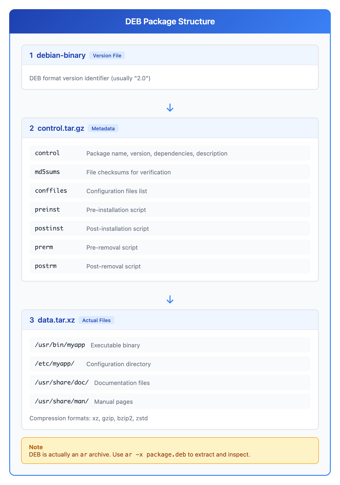
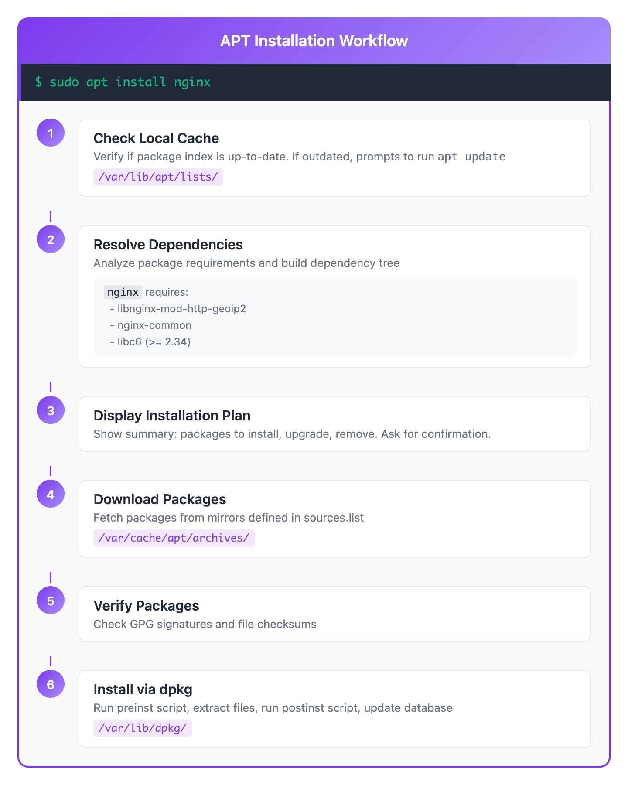

# 10 - 软件包管理 (DEB/APT)

> **目标**：掌握 Debian/Ubuntu 系统的软件包管理，学会查询、安装、更新操作  
> **前置**：基础 Linux 命令行操作，了解 RPM/DNF 概念（[上一课](../09-package-management-rpm-dnf/)）  
> **时间**：⚡ 25 分钟（速读）/ 🔬 90 分钟（完整实操）  
> **实战场景**：Ubuntu/Debian 环境下的软件包生命周期管理  

---

## 将学到的内容

1. 理解 DEB 软件包的结构（control.tar.gz + data.tar.xz）
2. 使用 dpkg 命令查询已安装软件包
3. 使用 apt 安装、删除、更新软件包
4. 使用 apt search/show/list 查找软件包信息
5. 理解 apt vs apt-get 的区别（交互 vs 脚本）
6. 使用 apt-cache 查询软件包信息
7. 掌握 RPM 命令到 DEB 命令的映射

---

## 先跑起来！（5 分钟）

> 在学习理论之前，先体验 DEB 软件包管理的基本操作。  
> 运行这些命令，观察输出 -- 这就是你将要掌握的技能。  

```bash
# 查看系统已安装的软件包数量
dpkg -l | tail -n +6 | wc -l

# 查看 bash 软件包的详细信息
dpkg -s bash

# 查看 bash 包含哪些文件
dpkg -L bash | head -10

# 查找某个文件属于哪个软件包
dpkg -S /bin/bash

# 搜索可用的软件包
apt search htop

# 查看软件包详细信息
apt show htop
```

**你刚刚使用了 dpkg 和 apt -- Debian 系统的核心软件包管理工具！**

如果你学过上一课的 RPM/DNF，会发现逻辑非常相似：
- dpkg 相当于 rpm（底层工具，操作单个包）
- apt 相当于 dnf（高层工具，自动处理依赖）

现在让我们深入理解 DEB 软件包管理的原理。

---

## Step 1 -- DEB 软件包结构（10 分钟）

### 1.1 什么是 DEB？

DEB 是 Debian、Ubuntu、Linux Mint、Raspberry Pi OS 等发行版使用的软件包格式。



<details>
<summary>View ASCII source</summary>

```
┌─────────────────────────────────────────────────────────────────┐
│                     DEB 软件包结构                               │
│                                                                  │
│  ┌─────────────────────────────────────────────────────────┐    │
│  │                    debian-binary                         │    │
│  │              版本号文件（通常是 "2.0"）                   │    │
│  │              标识 DEB 包格式版本                          │    │
│  └─────────────────────────────────────────────────────────┘    │
│                              │                                   │
│                              ▼                                   │
│  ┌─────────────────────────────────────────────────────────┐    │
│  │                   control.tar.gz                         │    │
│  │    ┌─────────────────────────────────────────────────┐  │    │
│  │    │  control     - 包名、版本、依赖、描述            │  │    │
│  │    │  md5sums     - 文件校验和                        │  │    │
│  │    │  conffiles   - 配置文件列表                      │  │    │
│  │    │  preinst     - 安装前脚本                        │  │    │
│  │    │  postinst    - 安装后脚本                        │  │    │
│  │    │  prerm       - 卸载前脚本                        │  │    │
│  │    │  postrm      - 卸载后脚本                        │  │    │
│  │    └─────────────────────────────────────────────────┘  │    │
│  └─────────────────────────────────────────────────────────┘    │
│                              │                                   │
│                              ▼                                   │
│  ┌─────────────────────────────────────────────────────────┐    │
│  │                    data.tar.xz                           │    │
│  │    ┌────────────────────────────────────────────────┐   │    │
│  │    │  /usr/bin/myapp                                │   │    │
│  │    │  /etc/myapp/config.conf                        │   │    │
│  │    │  /usr/share/doc/myapp/README                   │   │    │
│  │    │  /usr/share/man/man1/myapp.1.gz                │   │    │
│  │    │  ...（实际安装的文件）                          │   │    │
│  │    └────────────────────────────────────────────────┘   │    │
│  │              压缩格式：xz, gzip, bzip2, zstd            │    │
│  └─────────────────────────────────────────────────────────┘    │
│                                                                  │
│  注意：DEB 实际上是一个 ar 归档文件                             │
│        可以用 ar -x package.deb 解开查看                        │
│                                                                  │
└─────────────────────────────────────────────────────────────────┘
```

</details>

### 1.2 DEB vs RPM 结构对比

| 特性 | DEB | RPM |
|------|-----|-----|
| 归档格式 | ar 归档 | cpio 归档 |
| 元数据 | control.tar.gz | Header 段 |
| 数据 | data.tar.xz | Payload (cpio) |
| 签名 | 可选（外部） | 内嵌 GPG 签名 |
| 校验和 | md5sums 文件 | Header 中记录 |

### 1.3 DEB 文件命名规范

```
nginx_1.24.0-1ubuntu1_amd64.deb
  │     │    │    │      │    │
  │     │    │    │      │    └─ 扩展名
  │     │    │    │      └────── 架构 (amd64, arm64, all)
  │     │    │    └───────────── 发行版修订 (ubuntu1)
  │     │    └────────────────── Debian 修订版本
  │     └─────────────────────── 上游版本
  └───────────────────────────── 软件名称
```

**常见架构**：

| 架构 | 含义 | 对应 RPM |
|------|------|----------|
| amd64 | 64位 Intel/AMD | x86_64 |
| arm64 | 64位 ARM | aarch64 |
| all | 架构无关 | noarch |
| i386 | 32位 x86 | i686 |

### 1.4 查看 DEB 包内部结构

```bash
# 下载一个包（不安装）用于研究
apt download htop

# 查看 ar 归档内容
ar -t htop_*.deb

# 输出：
# debian-binary
# control.tar.xz
# data.tar.xz

# 解压查看内容
ar -x htop_*.deb
tar -tf control.tar.xz
tar -tf data.tar.xz | head -20

# 清理
rm -f htop_*.deb debian-binary control.tar.xz data.tar.xz
```

---

## Step 2 -- dpkg 查询命令（15 分钟）

### 2.1 列出已安装的软件包

```bash
# -l = list（列出）
dpkg -l                          # 列出所有已安装的软件包
dpkg -l | tail -n +6 | wc -l     # 统计已安装包数量（跳过头部）
dpkg -l | grep nginx             # 查找包含 nginx 的包
dpkg -l 'nginx*'                 # 通配符匹配
```

**dpkg -l 输出格式**：

```
Desired=Unknown/Install/Remove/Purge/Hold
| Status=Not/Inst/Conf-files/Unpacked/halF-conf/Half-inst/trig-aWait/Trig-pend
|/ Err?=(none)/Reinst-required (Status,Err: uppercase=bad)
||/ Name           Version      Architecture Description
+++-==============-============-============-=================================
ii  bash           5.2-2ubuntu1 amd64        GNU Bourne Again SHell
```

**状态标记含义**：

| 第一列（期望） | 第二列（状态） | 含义 |
|----------------|----------------|------|
| i | i | 已安装且正常 |
| i | c | 已删除但保留配置 |
| r | c | 待删除，保留配置 |
| p | c | 待清除（purge） |
| h | i | 已安装，版本锁定 |

### 2.2 查询软件包信息

```bash
# -s = status（状态）
dpkg -s bash

# 输出示例：
# Package: bash
# Status: install ok installed
# Priority: required
# Section: shells
# Installed-Size: 1892
# Maintainer: Ubuntu Developers <ubuntu-devel-discuss@lists.ubuntu.com>
# Architecture: amd64
# Version: 5.2-2ubuntu1
# Depends: base-files (>= 2.1.12), debianutils (>= 2.15)
# Pre-Depends: libc6 (>= 2.36), libtinfo6 (>= 6)
# Recommends: bash-completion
# Suggests: bash-doc
# Conffiles:
#  /etc/bash.bashrc 89269e1298235f1b12b4c24b6c37e94b
#  /etc/skel/.bashrc 3de8f8e4e67780e51d8f9a8866a7c6ec
# Description: GNU Bourne Again SHell
#  Bash is an sh-compatible command language interpreter ...
```

### 2.3 列出软件包文件

```bash
# -L = List files（列出文件）
dpkg -L bash                   # 列出 bash 包含的所有文件
dpkg -L bash | wc -l           # 统计文件数量
dpkg -L bash | grep bin        # 只看可执行文件

# 查看软件包安装的配置文件
dpkg -L nginx | grep /etc
```

### 2.4 反向查询：文件属于哪个包

```bash
# -S = Search（搜索）
dpkg -S /bin/bash              # 查找文件属于哪个包
dpkg -S /etc/passwd            # 查找配置文件属于哪个包
dpkg -S /usr/lib/x86_64-linux-gnu/libc.so.6  # 查找库文件

# 模糊搜索（支持通配符）
dpkg -S '*nginx*'              # 包含 nginx 的所有文件
dpkg -S '/usr/bin/vim*'        # vim 相关可执行文件

# 实用场景：发现未知进程时
ps aux | grep suspicious
dpkg -S /path/to/suspicious    # 确认进程来源
```

### 2.5 dpkg 命令速查表

| 命令 | 含义 | RPM 等价 |
|------|------|----------|
| `dpkg -l` | 列出所有已安装包 | `rpm -qa` |
| `dpkg -l <pattern>` | 按模式列出包 | `rpm -qa \| grep` |
| `dpkg -s <pkg>` | 显示包状态/信息 | `rpm -qi <pkg>` |
| `dpkg -L <pkg>` | 列出包文件 | `rpm -ql <pkg>` |
| `dpkg -S <file>` | 查找文件所属包 | `rpm -qf <file>` |
| `dpkg -c <deb>` | 列出 deb 包内容 | `rpm -qlp <rpm>` |
| `dpkg -I <deb>` | 显示 deb 包信息 | `rpm -qip <rpm>` |

---

## Step 3 -- apt 基础操作（20 分钟）

### 3.1 apt vs apt-get：何时用哪个

**关键区别**：

| 特性 | apt | apt-get |
|------|-----|---------|
| 目标用户 | 交互使用 | 脚本/自动化 |
| 输出格式 | 彩色、进度条 | 纯文本、稳定格式 |
| 命令简洁 | 更短 | 更长但更明确 |
| 稳定性 | 可能变化 | 保证向后兼容 |
| 推荐场景 | 终端手动操作 | Shell 脚本、CI/CD |

**记忆法**：
- **apt** = "Awesome for People in Terminals"（人用）
- **apt-get** = "Get it done in scripts"（脚本用）

```bash
# 交互使用（推荐 apt）
apt update
apt install nginx

# 脚本中（推荐 apt-get）
#!/bin/bash
apt-get update
apt-get install -y nginx
```

### 3.2 更新软件包列表

```bash
# 更新本地软件包索引（必须先执行！）
sudo apt update

# 输出示例：
# Hit:1 http://archive.ubuntu.com/ubuntu jammy InRelease
# Get:2 http://archive.ubuntu.com/ubuntu jammy-updates InRelease [119 kB]
# Get:3 http://security.ubuntu.com/ubuntu jammy-security InRelease [110 kB]
# ...
# Reading package lists... Done
# Building dependency tree... Done
# 15 packages can be upgraded. Run 'apt list --upgradable' to see them.
```

**重要**：`apt update` 只更新索引，不安装任何软件！

### 3.3 安装软件包

```bash
# 安装单个软件包
sudo apt install htop

# 安装多个软件包
sudo apt install htop vim tmux

# 自动确认（脚本中使用）
sudo apt install -y htop

# 安装特定版本
sudo apt install nginx=1.24.0-1ubuntu1

# 安装本地 deb 文件（自动解决依赖）
sudo apt install ./package.deb

# 只下载不安装
apt download htop
```

### 3.4 删除软件包

```bash
# 删除软件包（保留配置文件）
sudo apt remove nginx

# 删除软件包及其配置文件
sudo apt purge nginx

# 删除不再需要的依赖
sudo apt autoremove

# 组合：删除包 + 清理配置 + 删除依赖
sudo apt purge nginx && sudo apt autoremove
```

**remove vs purge**：

| 操作 | 删除程序 | 删除配置 | 使用场景 |
|------|----------|----------|----------|
| remove | Yes | No | 可能重装，保留设置 |
| purge | Yes | Yes | 彻底清除 |

### 3.5 升级软件包

```bash
# 升级所有可升级的软件包
sudo apt upgrade

# 升级单个软件包
sudo apt install --only-upgrade nginx

# 检查可升级的软件包
apt list --upgradable

# 完全升级（可能删除包以解决依赖）
sudo apt full-upgrade
# 注意：full-upgrade 比 upgrade 更激进，可能删除包

# 只下载升级包（不安装）
sudo apt upgrade --download-only
```

### 3.6 APT 事务流程



<details>
<summary>View ASCII source</summary>

```
┌─────────────────────────────────────────────────────────────────┐
│                      APT 安装流程                                │
│                                                                  │
│  sudo apt install nginx                                         │
│      │                                                           │
│      ▼                                                           │
│  ┌──────────────────────────────────────────────────────────┐   │
│  │  1. 检查本地缓存                                          │   │
│  │     /var/lib/apt/lists/ 是否有最新索引？                  │   │
│  │     如果太旧，提示运行 apt update                         │   │
│  └──────────────────────────────────────────────────────────┘   │
│      │                                                           │
│      ▼                                                           │
│  ┌──────────────────────────────────────────────────────────┐   │
│  │  2. 解析依赖关系                                          │   │
│  │     nginx 需要:                                           │   │
│  │       - libnginx-mod-http-geoip2                         │   │
│  │       - nginx-common                                      │   │
│  │       - libc6 (>= 2.34)                                  │   │
│  │       ...                                                 │   │
│  └──────────────────────────────────────────────────────────┘   │
│      │                                                           │
│      ▼                                                           │
│  ┌──────────────────────────────────────────────────────────┐   │
│  │  3. 显示安装计划                                          │   │
│  │     The following NEW packages will be installed:         │   │
│  │       nginx nginx-common libnginx-mod-...                │   │
│  │     0 upgraded, 5 newly installed, 0 to remove           │   │
│  │     Need to get 1,234 kB of archives.                    │   │
│  │     Do you want to continue? [Y/n]                       │   │
│  └──────────────────────────────────────────────────────────┘   │
│      │                                                           │
│      ▼                                                           │
│  ┌──────────────────────────────────────────────────────────┐   │
│  │  4. 下载软件包                                            │   │
│  │     从 /etc/apt/sources.list 中的镜像下载                │   │
│  │     保存到 /var/cache/apt/archives/                      │   │
│  └──────────────────────────────────────────────────────────┘   │
│      │                                                           │
│      ▼                                                           │
│  ┌──────────────────────────────────────────────────────────┐   │
│  │  5. 验证软件包                                            │   │
│  │     检查 GPG 签名和校验和                                 │   │
│  └──────────────────────────────────────────────────────────┘   │
│      │                                                           │
│      ▼                                                           │
│  ┌──────────────────────────────────────────────────────────┐   │
│  │  6. 安装软件包（dpkg 执行）                               │   │
│  │     - 运行 preinst 脚本                                   │   │
│  │     - 解压文件到目标位置                                  │   │
│  │     - 运行 postinst 脚本                                  │   │
│  │     - 更新 dpkg 数据库 (/var/lib/dpkg/)                  │   │
│  └──────────────────────────────────────────────────────────┘   │
│                                                                  │
└─────────────────────────────────────────────────────────────────┘
```

</details>

---

## Step 4 -- apt search/show/list（10 分钟）

### 4.1 搜索软件包

```bash
# 搜索软件包（名称和描述）
apt search nginx

# 只搜索包名
apt search --names-only nginx

# 使用正则表达式
apt search '^nginx'    # 以 nginx 开头的包

# 搜索结果示例：
# nginx/jammy-updates 1.24.0-1ubuntu1 amd64
#   high performance web server
# nginx-core/jammy-updates 1.24.0-1ubuntu1 amd64
#   nginx web/proxy server (standard version)
```

### 4.2 查看软件包详情

```bash
# 显示软件包详细信息
apt show nginx

# 输出示例：
# Package: nginx
# Version: 1.24.0-1ubuntu1
# Priority: optional
# Section: web
# Maintainer: Ubuntu Developers <ubuntu-devel-discuss@lists.ubuntu.com>
# Installed-Size: 44.0 kB
# Depends: nginx-core (<< 1.24.0-1ubuntu1.1~) | nginx-full ...
# Suggests: nginx-doc
# Homepage: https://nginx.org
# Download-Size: 3,596 B
# APT-Sources: http://archive.ubuntu.com/ubuntu jammy-updates/main amd64
# Description: small, powerful, scalable web/proxy server

# 显示所有可用版本
apt show -a nginx
```

### 4.3 列出软件包

```bash
# 列出所有已安装的软件包
apt list --installed

# 列出可升级的软件包
apt list --upgradable

# 列出所有可用的软件包
apt list

# 按模式列出
apt list 'nginx*'
apt list --installed 'python3-*'
```

### 4.4 apt-cache 命令（补充）

`apt-cache` 提供更详细的缓存查询功能：

```bash
# 搜索（类似 apt search）
apt-cache search nginx

# 显示包信息（类似 apt show）
apt-cache show nginx

# 显示依赖关系
apt-cache depends nginx

# 显示反向依赖（谁依赖这个包）
apt-cache rdepends nginx

# 显示包的策略（版本优先级）
apt-cache policy nginx

# 输出示例：
# nginx:
#   Installed: 1.24.0-1ubuntu1
#   Candidate: 1.24.0-1ubuntu1
#   Version table:
#  *** 1.24.0-1ubuntu1 500
#         500 http://archive.ubuntu.com/ubuntu jammy-updates/main amd64
#      1.22.0-1ubuntu1 500
#         500 http://archive.ubuntu.com/ubuntu jammy/main amd64
```

---

## Step 5 -- RPM 到 DEB 命令映射（10 分钟）

如果你熟悉 RPM/DNF，下表帮助你快速掌握 DEB/APT 命令：

### 5.1 完整映射表

| 操作 | RPM/DNF | DEB/APT |
|------|---------|---------|
| **安装** | | |
| 安装软件包 | `dnf install <pkg>` | `apt install <pkg>` |
| 安装本地包 | `dnf install ./pkg.rpm` | `apt install ./pkg.deb` |
| **删除** | | |
| 删除软件包 | `dnf remove <pkg>` | `apt remove <pkg>` |
| 删除包及配置 | `dnf remove <pkg>` | `apt purge <pkg>` |
| 清理无用依赖 | `dnf autoremove` | `apt autoremove` |
| **更新** | | |
| 更新索引 | `dnf check-update` | `apt update` |
| 升级所有包 | `dnf update` | `apt upgrade` |
| 升级单个包 | `dnf update <pkg>` | `apt install --only-upgrade <pkg>` |
| **查询（底层）** | | |
| 列出所有已安装 | `rpm -qa` | `dpkg -l` |
| 显示包信息 | `rpm -qi <pkg>` | `dpkg -s <pkg>` |
| 列出包文件 | `rpm -ql <pkg>` | `dpkg -L <pkg>` |
| 查找文件所属包 | `rpm -qf <file>` | `dpkg -S <file>` |
| 验证包完整性 | `rpm -V <pkg>` | `debsums <pkg>` |
| **查询（高层）** | | |
| 搜索软件包 | `dnf search <key>` | `apt search <key>` |
| 显示包详情 | `dnf info <pkg>` | `apt show <pkg>` |
| 列出可用包 | `dnf list available` | `apt list` |
| 列出已安装包 | `dnf list installed` | `apt list --installed` |
| **仓库** | | |
| 列出仓库 | `dnf repolist` | `apt-cache policy` |
| 显示包来源 | `dnf info <pkg>` | `apt-cache policy <pkg>` |

### 5.2 快速对照卡片

```
┌───────────────────────────────────────────────────────────────┐
│               RPM → DEB 命令速查卡                             │
├───────────────────────────────────────────────────────────────┤
│  rpm -qa              →  dpkg -l                              │
│  rpm -qi bash         →  dpkg -s bash                         │
│  rpm -ql bash         →  dpkg -L bash                         │
│  rpm -qf /bin/bash    →  dpkg -S /bin/bash                    │
├───────────────────────────────────────────────────────────────┤
│  dnf install nginx    →  apt install nginx                    │
│  dnf remove nginx     →  apt remove nginx / apt purge nginx   │
│  dnf update           →  apt update && apt upgrade            │
│  dnf search nginx     →  apt search nginx                     │
│  dnf info nginx       →  apt show nginx                       │
└───────────────────────────────────────────────────────────────┘
```

---

## Step 6 -- 动手实验（25 分钟）

### 实验 1：dpkg 查询练习

```bash
# 1. 统计系统已安装的软件包
echo "=== 已安装软件包统计 ==="
dpkg -l | tail -n +6 | wc -l

# 2. 查看 coreutils 包的信息
echo "=== coreutils 包信息 ==="
dpkg -s coreutils

# 3. 找出 /usr/bin/ls 属于哪个包
echo "=== ls 命令属于 ==="
dpkg -S /usr/bin/ls

# 4. 列出 coreutils 包的前 20 个文件
echo "=== coreutils 包文件列表 ==="
dpkg -L coreutils | head -20

# 5. 查找包含 "curl" 的已安装包
echo "=== 包含 curl 的包 ==="
dpkg -l '*curl*'
```

### 实验 2：apt 操作练习

```bash
# 1. 更新软件包索引（必须先执行！）
echo "=== 更新软件包索引 ==="
sudo apt update

# 2. 搜索 htop
echo "=== 搜索 htop ==="
apt search --names-only htop

# 3. 查看 htop 信息
echo "=== htop 信息 ==="
apt show htop

# 4. 安装 htop
echo "=== 安装 htop ==="
sudo apt install -y htop

# 5. 验证安装
echo "=== 验证安装 ==="
dpkg -s htop | grep -E "^(Package|Status|Version)"
which htop

# 6. 检查 htop 依赖了哪些包
echo "=== htop 依赖 ==="
apt-cache depends htop
```

### 实验 3：软件包版本管理

```bash
# 1. 查看 nginx 的所有可用版本
echo "=== nginx 版本策略 ==="
apt-cache policy nginx

# 2. 查看系统中可升级的软件包
echo "=== 可升级的软件包 ==="
apt list --upgradable

# 3. 模拟升级（不实际执行）
echo "=== 模拟升级 ==="
apt upgrade --simulate
# 或者
apt upgrade -s
```

### 实验 4：remove vs purge 对比

```bash
# 安装一个用于测试的软件包
sudo apt install -y cowsay

# 检查配置文件
dpkg -L cowsay | grep /etc

# 使用 remove 删除（保留配置）
sudo apt remove cowsay

# 检查状态（应该是 rc = removed, config-files）
dpkg -l cowsay

# 使用 purge 彻底清除
sudo apt purge cowsay

# 再次检查（应该找不到了）
dpkg -l cowsay 2>/dev/null || echo "包已完全删除"
```

### 实验 5：探索 DEB 包结构

```bash
# 创建工作目录
mkdir -p ~/deb-lab && cd ~/deb-lab

# 下载一个小软件包
apt download cowsay

# 查看 ar 归档内容
ar -t cowsay_*.deb

# 解压 deb 包
ar -x cowsay_*.deb
ls -la

# 查看控制信息
tar -tf control.tar.* | head -10
tar -xf control.tar.* ./control 2>/dev/null || tar -xf control.tar.* control
cat control

# 查看数据文件列表
tar -tf data.tar.* | head -20

# 清理
cd ~ && rm -rf ~/deb-lab
```

---

## 反模式：常见错误

### 错误 1：在脚本中使用 apt

```bash
# 不推荐：apt 的输出格式可能变化
#!/bin/bash
apt install -y nginx

# 推荐：apt-get 输出稳定，适合自动化
#!/bin/bash
apt-get update
apt-get install -y nginx
```

**原因**：`apt` 设计用于人机交互，输出格式可能随版本变化。`apt-get` 保证向后兼容。

### 错误 2：不运行 apt update 就安装

```bash
# 错误：直接安装可能找不到包或安装旧版本
sudo apt install some-new-package
# E: Unable to locate package some-new-package

# 正确：先更新索引
sudo apt update
sudo apt install some-new-package
```

**最佳实践**：

```bash
# 脚本中的标准模式
sudo apt-get update && sudo apt-get install -y package-name
```

### 错误 3：用 dpkg -i 安装有依赖的包

```bash
# 错误：dpkg 不解决依赖
sudo dpkg -i package-with-deps.deb
# dpkg: dependency problems prevent configuration of package...

# 正确：使用 apt 安装本地 deb（自动解决依赖）
sudo apt install ./package-with-deps.deb

# 或者：先 dpkg，再修复依赖
sudo dpkg -i package.deb
sudo apt-get install -f    # -f = fix broken
```

### 错误 4：忽略 apt upgrade 和 apt full-upgrade 的区别

```bash
# apt upgrade: 保守升级，不会删除包
sudo apt upgrade

# apt full-upgrade: 激进升级，可能删除包以解决依赖
sudo apt full-upgrade

# 生产环境建议：
# 1. 先用 upgrade
# 2. 仔细审查 full-upgrade 的删除列表
# 3. 在测试环境验证后再用于生产
```

### 错误 5：remove 后忘记 autoremove

```bash
# 问题：remove 只删除指定包，依赖残留
sudo apt remove nginx
# nginx 删除了，但其依赖还在

# 最佳实践：
sudo apt remove nginx
sudo apt autoremove    # 清理不再需要的依赖

# 或者一步完成
sudo apt remove nginx && sudo apt autoremove -y
```

---

## 职场小贴士（Japan IT Context）

### Ubuntu 在日本企业的使用情况

在日本企业 IT 环境中，Ubuntu/Debian 的使用场景有限：

| 环境 | 常见系统 | 说明 |
|------|----------|------|
| 企业服务器 | RHEL, CentOS | 内部標準（内部标准）通常是 RHEL |
| AWS EC2 默认 | Amazon Linux 2/2023 | 基于 RHEL/Fedora |
| 开发环境 | Ubuntu | 开发者个人选择较多 |
| 容器基础镜像 | Alpine, Debian | 轻量化需求 |
| IoT/嵌入式 | Raspbian, Ubuntu Core | 树莓派等设备 |

**日语术语**：

| 日语 | 含义 | 场景 |
|------|------|------|
| パッケージ管理 | 软件包管理 | 通用术语 |
| 依存関係 | 依赖关系 | apt depends |
| 更新 / アップデート | 更新 | apt update/upgrade |
| インストール | 安装 | apt install |

### 为什么还要学 DEB/APT？

1. **容器时代**：Dockerfile 中大量使用 Debian/Ubuntu 作为基础镜像
2. **CI/CD 环境**：GitHub Actions、GitLab CI 默认使用 Ubuntu
3. **云服务**：一些 SaaS 要求特定 Ubuntu 版本
4. **跨发行版能力**：运维工程师需要掌握两套体系

```dockerfile
# 常见的 Dockerfile 模式
FROM ubuntu:22.04
RUN apt-get update && apt-get install -y \
    nginx \
    && rm -rf /var/lib/apt/lists/*
```

### 脚本最佳实践

```bash
#!/bin/bash
# 适用于 CI/CD 或自动化场景的标准模式

# 1. 设置非交互模式
export DEBIAN_FRONTEND=noninteractive

# 2. 更新索引
apt-get update

# 3. 安装软件包（无确认提示）
apt-get install -y --no-install-recommends package-name

# 4. 清理缓存（减小镜像体积）
rm -rf /var/lib/apt/lists/*
```

**选项说明**：

| 选项 | 作用 |
|------|------|
| `-y` | 自动确认 |
| `--no-install-recommends` | 不安装推荐包（减小体积） |
| `DEBIAN_FRONTEND=noninteractive` | 禁止交互式配置对话框 |

---

## 检查清单

完成本课后，你应该能够：

- [ ] 解释 DEB 软件包的结构（control.tar.gz + data.tar.xz）
- [ ] 使用 `dpkg -l` 列出已安装的软件包
- [ ] 使用 `dpkg -s` 查看软件包信息
- [ ] 使用 `dpkg -L` 列出软件包文件
- [ ] 使用 `dpkg -S` 查找文件所属的软件包
- [ ] 理解 `apt` vs `apt-get` 的区别（交互 vs 脚本）
- [ ] 使用 `apt update` 更新软件包索引
- [ ] 使用 `apt install/remove/purge` 管理软件包
- [ ] 使用 `apt search/show/list` 查找软件包信息
- [ ] 将 RPM 命令映射到 DEB 等效命令
- [ ] 避免在脚本中使用 `apt`（应使用 `apt-get`）
- [ ] 避免不运行 `apt update` 就安装软件包

---

## 本课小结

| 概念 | 命令 | RPM 等价 |
|------|------|----------|
| 列出所有包 | `dpkg -l` | `rpm -qa` |
| 查看包信息 | `dpkg -s <pkg>` | `rpm -qi <pkg>` |
| 列出包文件 | `dpkg -L <pkg>` | `rpm -ql <pkg>` |
| 查找文件所属包 | `dpkg -S <file>` | `rpm -qf <file>` |
| 更新索引 | `apt update` | `dnf check-update` |
| 安装软件包 | `apt install <pkg>` | `dnf install <pkg>` |
| 删除软件包 | `apt remove <pkg>` | `dnf remove <pkg>` |
| 彻底删除 | `apt purge <pkg>` | - |
| 升级软件包 | `apt upgrade` | `dnf update` |
| 搜索软件包 | `apt search <key>` | `dnf search <key>` |
| 显示包详情 | `apt show <pkg>` | `dnf info <pkg>` |
| 清理依赖 | `apt autoremove` | `dnf autoremove` |

---

## 延伸阅读

- [Debian Package Management](https://www.debian.org/doc/manuals/debian-reference/ch02.en.html)
- [Ubuntu Package Management](https://help.ubuntu.com/community/AptGet/Howto)
- [apt vs apt-get](https://itsfoss.com/apt-vs-apt-get-difference/)
- 上一课：[09 - 软件包管理 (RPM/DNF)](../09-package-management-rpm-dnf/) -- RHEL 系软件包管理
- 下一课：[11 - 软件源与 GPG](../11-repository-gpg/) -- 仓库和签名管理

---

## 系列导航

[<-- 09 - 软件包管理 (RPM/DNF)](../09-package-management-rpm-dnf/) | [系列首页](../) | [11 - 软件源与 GPG -->](../11-repository-gpg/)
