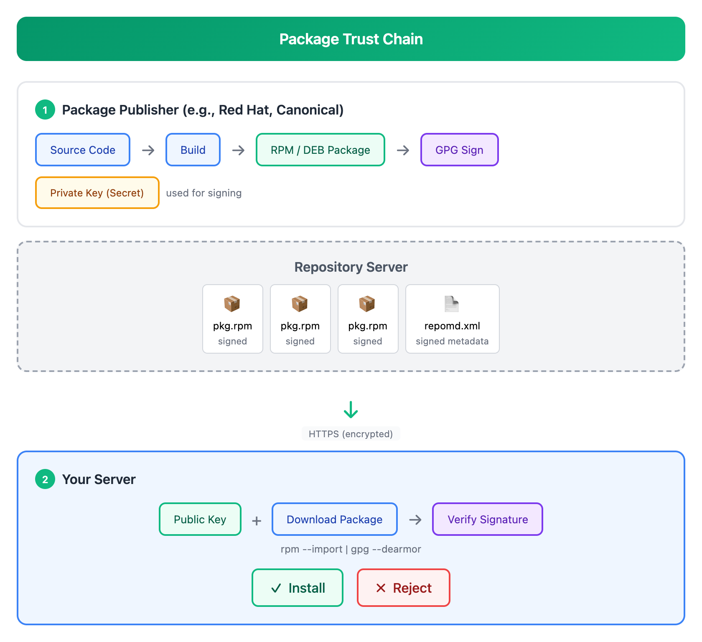
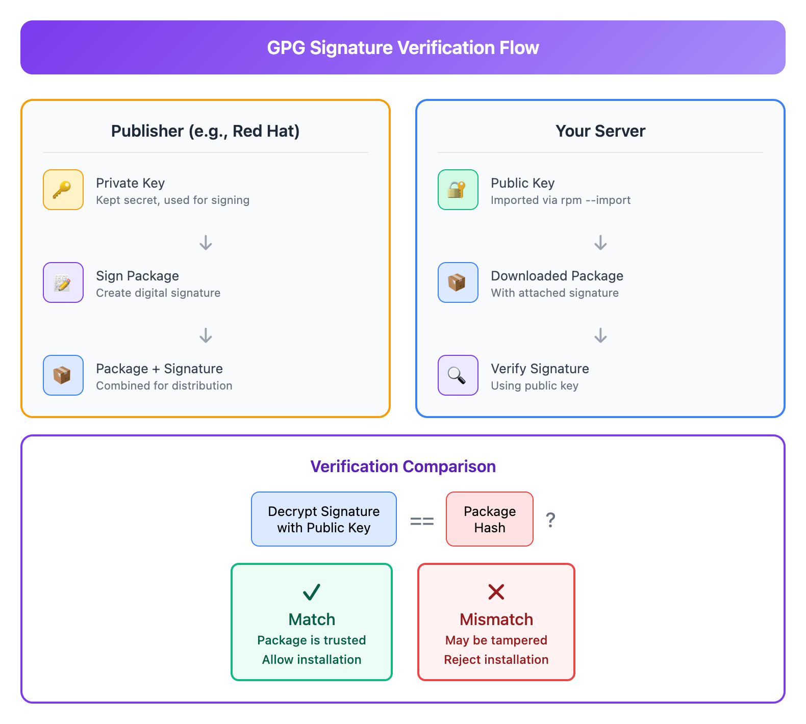

# 11 - 软件源与 GPG (Repository and GPG)

> **目标**：掌握软件源的配置与管理，理解 GPG 签名验证机制，学会安全地添加第三方仓库  
> **前置**：基础 Linux 命令行操作，软件包管理基础 (Lesson 09-10)  
> **时间**：⚡ 25 分钟（速读）/ 🔬 90 分钟（完整实操）  
> **实战场景**：企业环境下的软件源管理与安全验证  

---

## 将学到的内容

1. 配置和管理 DNF/YUM 仓库 (`/etc/yum.repos.d/`)
2. 配置和管理 APT 仓库 (`sources.list` 和 `sources.list.d/`)
3. 理解 GPG 签名和验证的核心概念
4. 使用 `rpm --import` 导入 GPG 密钥
5. 使用现代方法配置 APT 仓库 (`/etc/apt/keyrings/`)
6. 配置仓库优先级
7. 添加 EPEL 等第三方仓库
8. 理解企业环境的镜像配置

---

## 先跑起来！（5 分钟）

> 在学习理论之前，先体验软件源管理的基本操作。  
> 运行这些命令，观察输出 -- 这就是你将要掌握的技能。  

### RHEL/CentOS/AlmaLinux 用户

```bash
# 查看当前启用的仓库
dnf repolist

# 查看仓库配置文件
ls /etc/yum.repos.d/

# 查看某个仓库的详细配置
cat /etc/yum.repos.d/almalinux.repo 2>/dev/null || \
cat /etc/yum.repos.d/rocky.repo 2>/dev/null || \
cat /etc/yum.repos.d/redhat.repo 2>/dev/null | head -20

# 查看已导入的 GPG 密钥
rpm -qa gpg-pubkey* | head -5
```

### Debian/Ubuntu 用户

```bash
# 查看当前软件源
cat /etc/apt/sources.list

# 查看额外的源配置
ls /etc/apt/sources.list.d/

# 查看新式 GPG 密钥存放位置
ls /etc/apt/keyrings/ 2>/dev/null || echo "目录不存在（正常）"

# 查看已配置的仓库
apt-cache policy | head -20
```

**你刚刚查看了系统的软件源配置！**

软件源（Repository）就像是软件的"仓库"，告诉包管理器去哪里下载软件。
GPG 签名确保你下载的软件没有被篡改。

现在让我们深入理解软件源和 GPG 的原理。

---

## Step 1 -- 理解软件源的信任链（10 分钟）

### 1.1 为什么需要 GPG 签名？

当你运行 `dnf install nginx` 时，软件包从远程服务器下载。如何确保：
- 软件包确实来自官方仓库？
- 传输过程中没有被篡改？
- 没有被中间人攻击替换？

**答案：GPG 数字签名。**



<details>
<summary>View ASCII source</summary>

<!-- DIAGRAM: repository-trust-chain -->
```
┌─────────────────────────────────────────────────────────────────────────────┐
│                          软件包信任链 (Trust Chain)                           │
│                                                                              │
│  ┌─────────────────────────────────────────────────────────────────────┐    │
│  │                        软件包发布方                                  │    │
│  │  ┌──────────────┐     ┌──────────────┐     ┌──────────────┐        │    │
│  │  │  Source Code │────▶│    Build     │────▶│  RPM / DEB   │        │    │
│  │  │    源代码     │     │   编译构建    │     │   软件包      │        │    │
│  │  └──────────────┘     └──────────────┘     └──────┬───────┘        │    │
│  │                                                    │                │    │
│  │                                            ┌───────▼───────┐       │    │
│  │  ┌──────────────┐                          │   GPG Sign    │       │    │
│  │  │ Private Key  │─────────────────────────▶│   签名软件包   │       │    │
│  │  │  私钥 (保密)  │                          │               │       │    │
│  │  └──────────────┘                          └───────┬───────┘       │    │
│  └────────────────────────────────────────────────────│───────────────┘    │
│                                                       │                     │
│                              ┌────────────────────────▼────────────────┐   │
│                              │         Repository Server               │   │
│                              │           软件源服务器                   │   │
│                              │  ┌─────────┐  ┌─────────┐  ┌─────────┐ │   │
│                              │  │ pkg.rpm │  │ pkg.rpm │  │ pkg.rpm │ │   │
│                              │  │ (signed)│  │ (signed)│  │ (signed)│ │   │
│                              │  └─────────┘  └─────────┘  └─────────┘ │   │
│                              │                                         │   │
│                              │  ┌─────────────────────────────────┐   │   │
│                              │  │   repomd.xml (签名的元数据)     │   │   │
│                              │  └─────────────────────────────────┘   │   │
│                              └────────────────────────────────────────┘   │
│                                               │                            │
│                                               │ https (传输加密)           │
│                                               ▼                            │
│  ┌─────────────────────────────────────────────────────────────────────┐  │
│  │                          你的服务器                                  │  │
│  │                                                                      │  │
│  │  ┌──────────────┐     ┌──────────────┐     ┌──────────────┐        │  │
│  │  │ Public Key   │     │   Download   │     │   Verify     │        │  │
│  │  │  公钥 (公开)  │────▶│   下载软件包  │────▶│   验证签名    │        │  │
│  │  │              │     │              │     │              │        │  │
│  │  │ rpm --import │     │              │     │  签名匹配？   │        │  │
│  │  └──────────────┘     └──────────────┘     └──────┬───────┘        │  │
│  │                                                    │                │  │
│  │                                     ┌──────────────┴──────────────┐│  │
│  │                                     │              │              ││  │
│  │                                     ▼              ▼              ││  │
│  │                              ┌─────────────┐ ┌─────────────┐     ││  │
│  │                              │  ✓ 安装    │ │  ✗ 拒绝    │     ││  │
│  │                              │  Install   │ │  Reject    │     ││  │
│  │                              └─────────────┘ └─────────────┘     ││  │
│  └──────────────────────────────────────────────────────────────────┘│  │
│                                                                        │  │
└────────────────────────────────────────────────────────────────────────┘
```
<!-- /DIAGRAM -->

</details>

### 1.2 GPG 签名验证流程



<details>
<summary>View ASCII source</summary>

<!-- DIAGRAM: gpg-verification-flow -->
```
┌─────────────────────────────────────────────────────────────────────┐
│                      GPG 签名验证流程                                │
│                                                                      │
│   发布方（如 Red Hat）                    你的服务器                  │
│                                                                      │
│   ┌─────────────┐                                                   │
│   │ Private Key │                                                   │
│   │   私钥       │                                                   │
│   └──────┬──────┘                                                   │
│          │                                                          │
│          │ 签名                                                     │
│          ▼                                                          │
│   ┌─────────────┐         下载          ┌─────────────┐            │
│   │   Package   │─────────────────────▶ │   Package   │            │
│   │  + Signature│                       │  + Signature│            │
│   │  (软件包+签名)│                       │  (软件包+签名)│            │
│   └─────────────┘                       └──────┬──────┘            │
│                                                │                    │
│   ┌─────────────┐         发布          ┌──────▼──────┐            │
│   │ Public Key  │─────────────────────▶ │ Public Key  │            │
│   │   公钥       │   (rpm --import)      │   公钥       │            │
│   └─────────────┘                       └──────┬──────┘            │
│                                                │                    │
│                                                │ 验证               │
│                                                ▼                    │
│                                         ┌─────────────┐            │
│                                         │   比较      │            │
│                                         │             │            │
│                                         │ 公钥解密签名 │            │
│                                         │     ||      │            │
│                                         │ 软件包哈希？ │            │
│                                         └──────┬──────┘            │
│                                                │                    │
│                              ┌─────────────────┴─────────────────┐ │
│                              │                                   │ │
│                              ▼                                   ▼ │
│                       ┌─────────────┐                   ┌─────────────┐
│                       │  ✓ 匹配    │                   │  ✗ 不匹配   │
│                       │  软件包可信 │                   │  可能被篡改  │
│                       │  允许安装   │                   │  拒绝安装   │
│                       └─────────────┘                   └─────────────┘
│                                                                      │
└─────────────────────────────────────────────────────────────────────┘
```
<!-- /DIAGRAM -->

</details>

### 1.3 公钥加密简介

| 概念 | 说明 |
|------|------|
| **Private Key（私钥）** | 只有发布方持有，用于签名软件包 |
| **Public Key（公钥）** | 公开发布，用于验证签名 |
| **数字签名** | 用私钥对软件包哈希值加密的结果 |
| **验证过程** | 用公钥解密签名，与软件包哈希比对 |

**关键理解**：
- 私钥签名 = 只有真正的发布方能创建有效签名
- 公钥验证 = 任何人都能验证签名是否有效
- 签名无效 = 软件包被篡改或来源不可信

---

## Step 2 -- DNF/YUM 仓库配置（20 分钟）

### 2.1 仓库配置文件位置

```bash
# 仓库配置目录
ls -la /etc/yum.repos.d/

# 典型输出（AlmaLinux 9）：
# almalinux-appstream.repo
# almalinux-baseos.repo
# almalinux-crb.repo
# almalinux-extras.repo
```

### 2.2 仓库配置文件结构

```bash
cat /etc/yum.repos.d/almalinux-baseos.repo
```

```ini
# 仓库配置详解
[baseos]                          # 仓库 ID（唯一标识）
name=AlmaLinux $releasever - BaseOS    # 仓库名称（人类可读）
mirrorlist=https://mirrors.almalinux.org/mirrorlist/$releasever/baseos
# 或者使用固定 URL：
# baseurl=https://repo.almalinux.org/almalinux/$releasever/BaseOS/$basearch/os/
enabled=1                         # 1=启用, 0=禁用
gpgcheck=1                        # 1=验证签名, 0=不验证（危险！）
gpgkey=file:///etc/pki/rpm-gpg/RPM-GPG-KEY-AlmaLinux-9
                                  # GPG 公钥位置
countme=1                         # 统计计数（可选）
metadata_expire=86400             # 元数据过期时间（秒）
```

### 2.3 重要配置选项

| 选项 | 说明 | 推荐值 |
|------|------|--------|
| `enabled` | 是否启用仓库 | 按需设置 |
| `gpgcheck` | 是否验证 GPG 签名 | **必须为 1** |
| `gpgkey` | GPG 公钥路径 | 指向有效密钥 |
| `baseurl` | 固定仓库地址 | 用于内部镜像 |
| `mirrorlist` | 镜像列表地址 | 自动选择最快镜像 |
| `priority` | 优先级（1-99，低优先） | 默认 99 |
| `sslverify` | 验证 HTTPS 证书 | **必须为 1** |
| `metadata_expire` | 元数据缓存时间 | 根据需求调整 |

### 2.4 手动创建仓库配置

```bash
# 示例：添加内部镜像仓库
sudo tee /etc/yum.repos.d/internal-mirror.repo << 'EOF'
[internal-baseos]
name=Internal Mirror - BaseOS
baseurl=https://mirror.internal.company.co.jp/almalinux/9/BaseOS/x86_64/os/
enabled=1
gpgcheck=1
gpgkey=file:///etc/pki/rpm-gpg/RPM-GPG-KEY-AlmaLinux-9
priority=10

[internal-appstream]
name=Internal Mirror - AppStream
baseurl=https://mirror.internal.company.co.jp/almalinux/9/AppStream/x86_64/os/
enabled=1
gpgcheck=1
gpgkey=file:///etc/pki/rpm-gpg/RPM-GPG-KEY-AlmaLinux-9
priority=10
EOF

# 验证配置
dnf repolist
```

### 2.5 仓库管理命令

```bash
# 列出所有仓库（包括禁用的）
dnf repolist all

# 启用仓库
sudo dnf config-manager --set-enabled crb

# 禁用仓库
sudo dnf config-manager --set-disabled crb

# 临时禁用仓库安装软件
sudo dnf install --disablerepo=epel package-name

# 只从特定仓库安装
sudo dnf install --enablerepo=epel --disablerepo=* htop

# 清除仓库缓存
sudo dnf clean all

# 重建缓存
sudo dnf makecache
```

---

## Step 3 -- GPG 密钥管理 (RPM)（15 分钟）

### 3.1 查看已导入的 GPG 密钥

```bash
# 列出所有导入的 GPG 密钥
rpm -qa gpg-pubkey*

# 查看密钥详细信息
rpm -qi gpg-pubkey-xxxxxxxx-xxxxxxxx

# 输出示例：
# Name        : gpg-pubkey
# Version     : d36cb86c
# Release     : 5ed6b326
# Summary     : gpg(AlmaLinux OS 9 <packager@almalinux.org>)
# Description :
# -----BEGIN PGP PUBLIC KEY BLOCK-----
# ...
```

### 3.2 导入 GPG 密钥

```bash
# 方法 1：从 URL 导入
sudo rpm --import https://repo.almalinux.org/almalinux/RPM-GPG-KEY-AlmaLinux-9

# 方法 2：从本地文件导入
sudo rpm --import /etc/pki/rpm-gpg/RPM-GPG-KEY-AlmaLinux-9

# 方法 3：DNF 安装时自动导入（会提示确认）
sudo dnf install package-from-new-repo
# "Importing GPG key... Is this ok [y/N]:"
```

### 3.3 验证软件包签名

```bash
# 检查 RPM 文件的签名
rpm --checksig package.rpm
# 或
rpm -K package.rpm

# 输出示例（成功）：
# package.rpm: digests signatures OK

# 输出示例（失败）：
# package.rpm: digests SIGNATURES NOT OK

# 查看软件包的签名信息
rpm -qpi package.rpm | grep Signature
```

### 3.4 删除 GPG 密钥（谨慎操作）

```bash
# 找到密钥的完整名称
rpm -qa gpg-pubkey*

# 删除特定密钥（极少需要这样做）
sudo rpm -e gpg-pubkey-xxxxxxxx-xxxxxxxx
```

---

## Step 4 -- APT 仓库配置（15 分钟）

### 4.1 传统配置方式（sources.list）

```bash
# 主配置文件
cat /etc/apt/sources.list
```

```
# 格式：deb [选项] 仓库地址 发行版代号 组件
deb http://archive.ubuntu.com/ubuntu noble main restricted
deb http://archive.ubuntu.com/ubuntu noble universe multiverse
deb http://archive.ubuntu.com/ubuntu noble-updates main restricted
deb http://security.ubuntu.com/ubuntu noble-security main restricted

# deb-src 行用于源代码包
deb-src http://archive.ubuntu.com/ubuntu noble main restricted
```

### 4.2 组件说明

| 组件 | Debian | Ubuntu | 说明 |
|------|--------|--------|------|
| main | main | main | 官方支持的自由软件 |
| contrib | contrib | restricted | 依赖非自由软件的自由软件 |
| non-free | non-free | multiverse | 非自由软件 |
| non-free-firmware | - | - | Debian 12+ 非自由固件 |
| - | - | universe | 社区维护的自由软件 |

### 4.3 现代配置方式（DEB822 格式）

从 Ubuntu 24.04 / Debian 12 开始，推荐使用 `.sources` 文件：

```bash
# 查看新格式配置
cat /etc/apt/sources.list.d/ubuntu.sources
```

```
Types: deb
URIs: http://archive.ubuntu.com/ubuntu
Suites: noble noble-updates noble-backports
Components: main restricted universe multiverse
Signed-By: /usr/share/keyrings/ubuntu-archive-keyring.gpg

Types: deb
URIs: http://security.ubuntu.com/ubuntu
Suites: noble-security
Components: main restricted universe multiverse
Signed-By: /usr/share/keyrings/ubuntu-archive-keyring.gpg
```

### 4.4 sources.list.d 目录

```bash
# 第三方仓库放在这个目录
ls /etc/apt/sources.list.d/

# 每个仓库一个文件，便于管理
# 例如：
# docker.list
# google-chrome.list
# kubernetes.list
```

---

## Step 5 -- APT GPG 密钥管理（现代方法）（15 分钟）

### 5.1 apt-key 已弃用！

```bash
# 旧方法（已弃用，不要使用！）
# apt-key add key.gpg              # 不安全！
# apt-key list                      # 即将移除

# 警告信息：
# Warning: apt-key is deprecated. Manage keyring files in trusted.gpg.d instead.
```

**为什么弃用 apt-key？**
- 全局信任：添加的密钥信任所有仓库
- 安全风险：恶意仓库可能篡改其他仓库的包
- 管理困难：密钥与仓库没有绑定关系

### 5.2 现代方法：signed-by 指令

现代 APT 使用 `signed-by` 选项，将密钥与特定仓库绑定：

```bash
# 密钥存放目录
ls /etc/apt/keyrings/

# 如果目录不存在，创建它
sudo mkdir -p /etc/apt/keyrings/
```

### 5.3 添加第三方仓库（现代方法）

以 Docker 官方仓库为例：

```bash
# 1. 下载 GPG 密钥并转换格式
curl -fsSL https://download.docker.com/linux/ubuntu/gpg | \
    sudo gpg --dearmor -o /etc/apt/keyrings/docker.gpg

# 2. 设置正确权限
sudo chmod a+r /etc/apt/keyrings/docker.gpg

# 3. 添加仓库配置（使用 signed-by 绑定密钥）
echo "deb [arch=$(dpkg --print-architecture) signed-by=/etc/apt/keyrings/docker.gpg] \
    https://download.docker.com/linux/ubuntu $(lsb_release -cs) stable" | \
    sudo tee /etc/apt/sources.list.d/docker.list > /dev/null

# 4. 更新软件包列表
sudo apt update

# 5. 验证仓库已添加
apt-cache policy docker-ce
```

### 5.4 密钥格式说明

| 格式 | 扩展名 | 说明 |
|------|--------|------|
| ASCII armored | `.asc`, `.gpg` (文本) | 可直接查看的文本格式 |
| Binary | `.gpg` (二进制) | 需要 `gpg --dearmor` 转换 |

```bash
# 转换 ASCII 格式到二进制格式
gpg --dearmor < key.asc > key.gpg

# 查看密钥信息
gpg --show-keys /etc/apt/keyrings/docker.gpg
```

### 5.5 完整示例：添加 Node.js 仓库

```bash
#!/bin/bash
# add-nodejs-repo.sh - 添加 Node.js 官方仓库（现代方法）

set -e

# 变量
KEYRING_PATH="/etc/apt/keyrings/nodesource.gpg"
SOURCES_PATH="/etc/apt/sources.list.d/nodesource.list"
NODE_MAJOR="22"  # Node.js LTS 主版本（22.x 支持到 2027-04）

# 1. 下载并安装 GPG 密钥
echo "下载 GPG 密钥..."
curl -fsSL https://deb.nodesource.com/gpgkey/nodesource-repo.gpg.key | \
    sudo gpg --dearmor -o "$KEYRING_PATH"

# 2. 创建仓库配置
echo "创建仓库配置..."
echo "deb [signed-by=$KEYRING_PATH] https://deb.nodesource.com/node_$NODE_MAJOR.x nodistro main" | \
    sudo tee "$SOURCES_PATH"

# 3. 更新软件包列表
echo "更新软件包列表..."
sudo apt update

# 4. 验证
echo "验证仓库配置..."
apt-cache policy nodejs

echo "完成！可以使用 'sudo apt install nodejs' 安装 Node.js"
```

---

## Step 6 -- 添加 EPEL 仓库（10 分钟）

### 6.1 什么是 EPEL？

**EPEL**（Extra Packages for Enterprise Linux）是 Fedora 项目为 RHEL 及其衍生版提供的额外软件包仓库。

```bash
# 包含许多在 RHEL 默认仓库中没有的软件：
# - htop, tmux, ansible
# - nginx (更新版本), python3-pip
# - 开发工具和库
```

### 6.2 安装 EPEL（RHEL/AlmaLinux/Rocky）

```bash
# 方法 1：使用 dnf 安装（推荐）
sudo dnf install epel-release -y

# 方法 2：手动安装 RPM
# RHEL 9
sudo dnf install https://dl.fedoraproject.org/pub/epel/epel-release-latest-9.noarch.rpm

# 验证安装
dnf repolist | grep epel

# 输出示例：
# epel                   Extra Packages for Enterprise Linux 9 - x86_64
```

### 6.3 验证 EPEL GPG 密钥

```bash
# 查看 EPEL 密钥
rpm -qi gpg-pubkey-* | grep -A 1 "Summary.*EPEL"

# 验证某个 EPEL 软件包
rpm --checksig /var/cache/dnf/epel-*/packages/htop-*.rpm
```

### 6.4 EPEL 使用示例

```bash
# 搜索 EPEL 中的软件包
dnf --enablerepo=epel search htop

# 从 EPEL 安装软件
sudo dnf install htop

# 仅从 EPEL 安装（排除其他仓库）
sudo dnf install --disablerepo="*" --enablerepo="epel" htop
```

---

## Step 7 -- 仓库优先级配置（10 分钟）

### 7.1 为什么需要优先级？

当多个仓库提供同一软件包时，需要控制使用哪个版本：

```
场景：
- BaseOS 提供 nginx-1.22
- EPEL 提供 nginx-1.24
- 内部镜像提供 nginx-1.22（经过安全审查）

需求：优先使用内部镜像的版本
```

### 7.2 DNF 优先级配置

```bash
# 安装优先级插件（通常已预装）
sudo dnf install dnf-plugins-core

# 在仓库配置中添加 priority
# /etc/yum.repos.d/internal-mirror.repo
[internal-baseos]
name=Internal Mirror - BaseOS
baseurl=https://mirror.internal.company.co.jp/almalinux/9/BaseOS/x86_64/os/
enabled=1
gpgcheck=1
gpgkey=file:///etc/pki/rpm-gpg/RPM-GPG-KEY-AlmaLinux-9
priority=10    # 数字越小优先级越高（1-99）

# EPEL 配置较低优先级
# /etc/yum.repos.d/epel.repo
[epel]
name=Extra Packages for Enterprise Linux 9
...
priority=90    # 较低优先级
```

### 7.3 APT 优先级配置（pinning）

```bash
# 创建优先级配置文件
sudo tee /etc/apt/preferences.d/docker << 'EOF'
Package: docker-*
Pin: origin download.docker.com
Pin-Priority: 1000
EOF

# 优先级说明：
# 1001+   : 强制安装（即使降级）
# 990-1000: 优先于已安装版本
# 500-989 : 优先于未安装版本
# 100-499 : 不优先
# < 100   : 永不安装
```

```bash
# 查看软件包优先级
apt-cache policy docker-ce
```

---

## Step 8 -- 动手实验（25 分钟）

### 实验 1：添加 EPEL 仓库（RHEL 系）

```bash
# 1. 检查当前仓库
echo "=== 当前仓库 ==="
dnf repolist

# 2. 安装 EPEL
echo "=== 安装 EPEL ==="
sudo dnf install -y epel-release

# 3. 验证 GPG 密钥已导入
echo "=== GPG 密钥 ==="
rpm -qa gpg-pubkey* | grep -i epel || echo "EPEL 密钥已导入（作为依赖）"

# 4. 查看 EPEL 仓库配置
echo "=== EPEL 配置 ==="
cat /etc/yum.repos.d/epel.repo | head -20

# 5. 从 EPEL 安装软件
echo "=== 安装 htop ==="
sudo dnf install -y htop

# 6. 验证软件包来源
echo "=== 验证来源 ==="
dnf info htop | grep Repository
```

### 实验 2：GPG 密钥验证（RHEL 系）

```bash
# 1. 列出所有 GPG 密钥
echo "=== 已导入的 GPG 密钥 ==="
rpm -qa gpg-pubkey*

# 2. 查看某个密钥的详细信息
echo "=== 密钥详情 ==="
KEY=$(rpm -qa gpg-pubkey* | head -1)
rpm -qi $KEY

# 3. 下载一个 RPM 包（不安装）
echo "=== 下载软件包 ==="
dnf download htop

# 4. 验证签名
echo "=== 验证签名 ==="
rpm --checksig htop-*.rpm

# 5. 查看签名详情
echo "=== 签名详情 ==="
rpm -qpi htop-*.rpm | grep -E "(Signature|Vendor|Packager)"

# 6. 清理
rm -f htop-*.rpm
```

### 实验 3：添加第三方 APT 仓库（Debian/Ubuntu）

```bash
# 1. 创建 keyrings 目录
echo "=== 准备目录 ==="
sudo mkdir -p /etc/apt/keyrings

# 2. 以 GitHub CLI 为例
echo "=== 下载 GPG 密钥 ==="
curl -fsSL https://cli.github.com/packages/githubcli-archive-keyring.gpg | \
    sudo gpg --dearmor -o /etc/apt/keyrings/githubcli.gpg

# 3. 设置权限
sudo chmod a+r /etc/apt/keyrings/githubcli.gpg

# 4. 添加仓库配置
echo "=== 添加仓库 ==="
echo "deb [arch=$(dpkg --print-architecture) signed-by=/etc/apt/keyrings/githubcli.gpg] \
    https://cli.github.com/packages stable main" | \
    sudo tee /etc/apt/sources.list.d/github-cli.list

# 5. 更新并验证
echo "=== 验证仓库 ==="
sudo apt update
apt-cache policy gh

# 6. 查看密钥信息
echo "=== 密钥信息 ==="
gpg --show-keys /etc/apt/keyrings/githubcli.gpg
```

---

## 反模式：常见错误

### 错误 1：gpgcheck=0（严重安全风险）

```bash
# 极其危险！绝对不要这样做！
[some-repo]
name=Some Repository
baseurl=https://repo.example.com/packages/
enabled=1
gpgcheck=0    # ← 致命错误！

# 后果：
# 1. 允许安装未签名的软件包
# 2. 无法检测软件包是否被篡改
# 3. 供应链攻击的入口
# 4. 违反企业安全合规

# 正确做法：始终启用 GPG 检查
gpgcheck=1
gpgkey=https://repo.example.com/RPM-GPG-KEY
```

**安全风险：CRITICAL** - 这是供应链攻击的主要入口。攻击者可以：
- 中间人攻击替换软件包
- 在软件包中植入后门
- 完全控制你的系统

### 错误 2：随意添加第三方仓库

```bash
# 危险！从不明来源添加仓库
# 某论坛帖子说"运行这个命令就能解决问题"
curl http://random-site.com/setup.sh | sudo bash

# 正确做法：
# 1. 只使用官方或可信的仓库
# 2. 验证仓库的 GPG 密钥
# 3. 检查仓库的维护状态
# 4. 在测试环境先验证
# 5. 遵循企业审批流程
```

### 错误 3：使用已弃用的 apt-key

```bash
# 旧方法（已弃用）
curl -fsSL https://example.com/key.gpg | sudo apt-key add -

# 问题：
# 1. 密钥全局信任，影响所有仓库
# 2. apt-key 将被完全移除
# 3. 安全模型存在缺陷

# 正确做法：使用 signed-by 绑定
curl -fsSL https://example.com/key.gpg | \
    sudo gpg --dearmor -o /etc/apt/keyrings/example.gpg

echo "deb [signed-by=/etc/apt/keyrings/example.gpg] https://repo.example.com stable main" | \
    sudo tee /etc/apt/sources.list.d/example.list
```

### 错误 4：忽略 HTTPS 证书验证

```bash
# 危险！禁用 SSL 验证
[insecure-repo]
name=Insecure Repository
baseurl=https://repo.example.com/packages/
sslverify=0    # ← 危险！

# 后果：
# - 中间人攻击可以拦截流量
# - 无法确保连接到真正的服务器
# - GPG 验证也可能被绕过

# 正确做法：
sslverify=1    # 默认值，保持启用
sslcacert=/etc/pki/tls/certs/ca-bundle.crt
```

---

## 职场小贴士（Japan IT Context）

### 内部镜像是标准配置（内部ミラー）

在日本企业环境中，服务器通常不能直接访问互联网。软件包通过内部镜像分发：

```bash
# 企业常见的镜像解决方案：

# 1. Red Hat Satellite（官方企业版）
#    - 集中管理订阅和软件包
#    - 提供内容视图和生命周期管理
#    - 大型企业首选

# 2. Nexus Repository Manager
#    - 支持多种格式（RPM, DEB, Docker, npm...）
#    - 开源版免费
#    - 中小型企业常用

# 3. Artifactory
#    - 企业级制品管理
#    - 支持所有主流包格式
#    - 集成 CI/CD 管道

# 内部仓库配置示例
[internal-mirror]
name=Internal Mirror Repository
baseurl=https://nexus.internal.company.co.jp/repository/rhel-9-baseos/
enabled=1
gpgcheck=1
gpgkey=file:///etc/pki/rpm-gpg/RPM-GPG-KEY-AlmaLinux-9
sslverify=1
sslcacert=/etc/pki/ca-trust/source/anchors/company-ca.crt
```

### 变更申请是必须的（変更申請）

添加或修改软件源需要正式的变更申请：

| 日语术语 | 含义 | 说明 |
|----------|------|------|
| 変更申請 | 变更申请 | 正式的变更请求表单 |
| 承認フロー | 审批流程 | 需要多级审批 |
| 影響調査 | 影响调查 | 评估变更的风险 |
| 実施手順書 | 实施手册 | 详细的操作步骤 |
| 切り戻し手順 | 回滚手册 | 失败时的恢复步骤 |

```
典型的变更申请内容：

1. 変更内容（变更内容）
   - 添加 EPEL 仓库到 XX 服务器群

2. 変更理由（变更原因）
   - 需要安装 htop 用于性能监控

3. 影響範囲（影响范围）
   - 本番環境 Web サーバー 10 台

4. リスク評価（风险评估）
   - 低：仅添加仓库配置，不安装软件
   - GPG 验证确保软件包安全

5. 実施日時（实施时间）
   - 2026年1月15日 22:00-23:00

6. 切り戻し手順（回滚手册）
   - 删除 /etc/yum.repos.d/epel*.repo
   - 运行 dnf clean all
```

### 版本控制很重要

企业环境中，软件包版本需要严格控制：

```bash
# 使用版本锁定防止意外更新
sudo dnf versionlock add nginx-1.24.0-1.el9

# 在 Satellite/Nexus 中设置内容视图
# 只允许经过测试的版本进入生产环境

# 示例：软件包生命周期
# 开発環境 → 検証環境 → ステージング → 本番環境
# (开发)    → (测试)   → (预发布)    → (生产)
```

---

## 检查清单

完成本课后，你应该能够：

- [ ] 解释 GPG 签名验证的工作原理
- [ ] 理解为什么**绝不**设置 `gpgcheck=0`
- [ ] 配置 DNF/YUM 仓库 (`/etc/yum.repos.d/`)
- [ ] 使用 `rpm --import` 导入 GPG 密钥
- [ ] 使用 `rpm --checksig` 验证软件包签名
- [ ] 配置 APT 仓库（使用现代 `signed-by` 方法）
- [ ] 将 GPG 密钥放在 `/etc/apt/keyrings/` 目录
- [ ] 添加 EPEL 仓库
- [ ] 配置仓库优先级
- [ ] 理解企业环境的镜像配置需求
- [ ] 避免使用已弃用的 `apt-key`

---

## 本课小结

| 概念 | RPM/DNF | DEB/APT | 记忆点 |
|------|---------|---------|--------|
| 仓库配置目录 | `/etc/yum.repos.d/` | `/etc/apt/sources.list.d/` | 每个仓库单独文件 |
| GPG 密钥位置 | `/etc/pki/rpm-gpg/` | `/etc/apt/keyrings/` | 新版 APT 推荐 |
| 导入密钥 | `rpm --import` | `gpg --dearmor` | APT 需要转换格式 |
| 验证签名 | `rpm --checksig` | APT 自动验证 | 确保包未被篡改 |
| 启用签名检查 | `gpgcheck=1` | `signed-by=` | **必须启用** |
| 仓库优先级 | `priority=10` | `Pin-Priority:` | 控制版本选择 |
| 清除缓存 | `dnf clean all` | `apt clean` | 更新配置后执行 |

---

## 安全要点速查

| 操作 | 正确做法 | 错误做法 | 风险 |
|------|----------|----------|------|
| GPG 检查 | `gpgcheck=1` | `gpgcheck=0` | CRITICAL |
| HTTPS 验证 | `sslverify=1` | `sslverify=0` | HIGH |
| 添加仓库 | 使用官方源 | 随机第三方源 | HIGH |
| APT 密钥 | `signed-by=` | `apt-key add` | MEDIUM |
| 仓库来源 | 验证后添加 | 直接执行脚本 | HIGH |

---

## 延伸阅读

- [DNF Documentation](https://dnf.readthedocs.io/)
- [Debian Repository Format](https://wiki.debian.org/DebianRepository/Format)
- [APT Secure](https://wiki.debian.org/SecureApt)
- [Red Hat: Signing RPM Packages](https://access.redhat.com/documentation/en-us/red_hat_enterprise_linux/9/html/packaging_and_distributing_software/signing-packages_packaging-software)
- 上一课：[10 - 软件包管理 (DEB/APT)](../10-package-management-deb-apt/) -- Debian 系软件包管理
- 下一课：[12 - 综合实战：多用户环境](../12-capstone-multiuser-environment/) -- 课程综合项目
- 相关课程：[09 - 软件包管理 (RPM/DNF)](../09-package-management-rpm-dnf/) -- RPM 基础知识

---

## 系列导航

[<-- 10 - 软件包管理 (DEB/APT)](../10-package-management-deb-apt/) | [系列首页](../) | [12 - 综合实战：多用户环境 -->](../12-capstone-multiuser-environment/)
