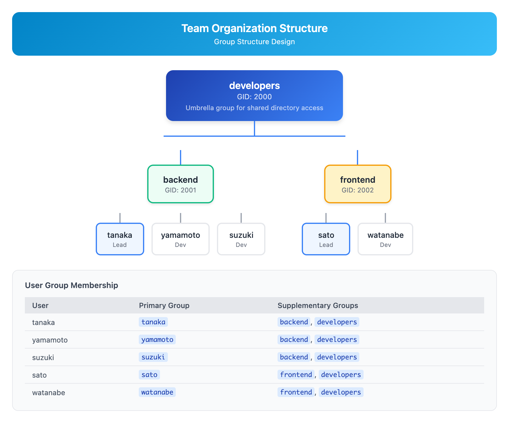

# 12 - 综合实战：多用户环境（Capstone: Multi-User Environment）

> **目标**：综合运用用户、权限、sudo 等知识，构建一个安全的多用户开发环境  
> **前置**：完成 Lessons 01-11（用户管理、权限、sudo、进程、软件包）  
> **时间**：3 小时  
> **实战场景**：为小型开发团队搭建 Linux 服务器环境  

---

## 项目背景

你是一家日本 IT 公司的系统管理员。公司新成立了一个开发团队，需要你在 Linux 服务器上为他们搭建开发环境。

这是典型的「社内開発環境構築」（内部开发环境搭建）任务。

### 团队结构

```
开发团队 (5 人)
├── Backend 组 (3 人)
│   ├── tanaka (Team Lead)
│   ├── yamamoto
│   └── suzuki
│
└── Frontend 组 (2 人)
    ├── sato (Team Lead)
    └── watanabe
```

### 需求分析

| 需求 | 实现方式 | 涉及课程 |
|------|----------|----------|
| 用户账户管理 | useradd, passwd, chage | Lesson 01-02 |
| 团队目录协作 | 组权限 + SGID | Lesson 03-04 |
| 跨团队文档共享 | ACL | Lesson 05 |
| Team Lead 安装软件 | sudo 配置 | Lesson 06 |
| 密码安全策略 | chage + PAM | Lesson 02 |
| SUID 安全审计 | find -perm | Lesson 04 |

---

## 最终交付物

完成本 Capstone 后，你需要提交以下内容：

| 交付物 | 文件名 | 说明 |
|--------|--------|------|
| 环境搭建脚本 | `setup-dev-environment.sh` | 可重复执行的自动化脚本 |
| 权限模型文档 | `PERMISSION-MODEL.md` | 记录所有权限设计决策 |
| sudo 配置文件 | `sudoers.d/team-leads` | Team Lead 的 sudo 规则 |
| SUID 审计报告 | `suid-audit-report.txt` | 系统 SUID 文件清单 |
| 用户账户清单 | `user-accounts.md` | 所有用户及其角色 |
| 新人入职指南 | `ONBOARDING.md` | 给新团队成员的环境说明 |

---

## Step 1 — 规划：权限模型设计（30 分钟）

### 1.1 组结构设计

在动手之前，先规划组结构：



<details>
<summary>View ASCII source</summary>

<!-- DIAGRAM: group-structure -->
```
团队组织结构 (Team Organization Structure)
═══════════════════════════════════════════════════════════════════════════

组结构 (Group Structure):
                    ┌─────────────────────┐
                    │     developers      │  ← 伞形组：所有开发者
                    │      (GID: 2000)    │     用于：共享文档目录
                    └──────────┬──────────┘
                               │
             ┌─────────────────┴─────────────────┐
             ▼                                   ▼
    ┌─────────────────┐                 ┌─────────────────┐
    │     backend     │                 │    frontend     │
    │   (GID: 2001)   │                 │   (GID: 2002)   │
    └────────┬────────┘                 └────────┬────────┘
             │                                   │
    ┌────────┴────────┐                 ┌────────┴────────┐
    │                 │                 │                 │
    ▼                 ▼                 ▼                 ▼
┌────────┐  ┌────────┐  ┌────────┐  ┌────────┐  ┌────────┐
│ tanaka │  │yamamoto│  │ suzuki │  │  sato  │  │watanabe│
│ (Lead) │  │        │  │        │  │ (Lead) │  │        │
└────────┘  └────────┘  └────────┘  └────────┘  └────────┘

用户组归属:
┌──────────────────────────────────────────────────────────────────────────┐
│  用户       │ 主组      │ 附加组                                          │
├──────────────────────────────────────────────────────────────────────────┤
│  tanaka    │ tanaka   │ backend, developers                             │
│  yamamoto  │ yamamoto │ backend, developers                             │
│  suzuki    │ suzuki   │ backend, developers                             │
│  sato      │ sato     │ frontend, developers                            │
│  watanabe  │ watanabe │ frontend, developers                            │
└──────────────────────────────────────────────────────────────────────────┘
```
<!-- /DIAGRAM -->

</details>

### 1.2 目录结构设计

```
/opt/projects/
├── backend/          ← backend 组专用 (drwxrwsr-x backend:backend)
│   └── ...
│
├── frontend/         ← frontend 组专用 (drwxrwsr-x frontend:frontend)
│   └── ...
│
└── shared/           ← 共享目录 (drwxrwsr-x root:developers)
    ├── docs/         ← 所有人可读写
    └── releases/     ← backend 可写，frontend 只读 (使用 ACL)
```

### 1.3 sudo 权限设计

| 角色 | sudo 权限 | 理由 |
|------|-----------|------|
| Team Lead (tanaka, sato) | 安装/更新软件包 | 团队需要安装开发工具 |
| 普通成员 | 无 | 最小权限原则 |

**sudo 配置原则**：

- 仅允许特定命令，不使用 `ALL`
- 不使用 `NOPASSWD: ALL`
- 每次操作都有日志记录

### 1.4 密码策略

按照公司安全基线：

| 策略 | 值 | 命令 |
|------|-----|------|
| 最大有效期 | 90 天 | `chage -M 90` |
| 最小更改间隔 | 7 天 | `chage -m 7` |
| 过期提前警告 | 14 天 | `chage -W 14` |

---

## Step 2 — 实现：创建用户和组（30 分钟）

### 2.1 创建组

```bash
# 创建伞形组
sudo groupadd -g 2000 developers

# 创建团队组
sudo groupadd -g 2001 backend
sudo groupadd -g 2002 frontend

# 验证
grep -E "^(developers|backend|frontend):" /etc/group
```

### 2.2 创建用户

```bash
# Backend 组
sudo useradd -m -s /bin/bash -c "Tanaka - Backend Lead" \
    -G backend,developers tanaka

sudo useradd -m -s /bin/bash -c "Yamamoto - Backend Dev" \
    -G backend,developers yamamoto

sudo useradd -m -s /bin/bash -c "Suzuki - Backend Dev" \
    -G backend,developers suzuki

# Frontend 组
sudo useradd -m -s /bin/bash -c "Sato - Frontend Lead" \
    -G frontend,developers sato

sudo useradd -m -s /bin/bash -c "Watanabe - Frontend Dev" \
    -G frontend,developers watanabe

# 验证
for user in tanaka yamamoto suzuki sato watanabe; do
    echo "=== $user ==="
    id $user
done
```

### 2.3 设置密码和密码策略

```bash
# 设置初始密码（生产环境应使用更安全的方式）
for user in tanaka yamamoto suzuki sato watanabe; do
    echo "Setting password for $user..."
    echo "$user:TempPassword123!" | sudo chpasswd

    # 强制首次登录修改密码
    sudo passwd -e $user
done

# 设置密码策略
for user in tanaka yamamoto suzuki sato watanabe; do
    # 最大 90 天，最小 7 天，警告 14 天
    sudo chage -M 90 -m 7 -W 14 $user

    # 验证
    echo "=== $user password aging ==="
    sudo chage -l $user | grep -E "^(Minimum|Maximum|Warning)"
done
```

### 2.4 验证 Home 目录权限

```bash
# Home 目录应该是私有的
ls -la /home/ | grep -E "(tanaka|yamamoto|suzuki|sato|watanabe)"

# 确保权限是 700（只有所有者可以访问）
for user in tanaka yamamoto suzuki sato watanabe; do
    sudo chmod 700 /home/$user
done

# 再次验证
ls -la /home/ | grep -E "(tanaka|yamamoto|suzuki|sato|watanabe)"
```

---

## Step 3 — 实现：创建项目目录（30 分钟）

### 3.1 创建目录结构

```bash
# 创建主项目目录
sudo mkdir -p /opt/projects/{backend,frontend,shared/{docs,releases}}

# 设置所有权
sudo chown root:backend /opt/projects/backend
sudo chown root:frontend /opt/projects/frontend
sudo chown root:developers /opt/projects/shared
sudo chown root:developers /opt/projects/shared/docs
sudo chown root:developers /opt/projects/shared/releases

# 设置基本权限 + SGID
# 团队目录：组成员可读写执行，SGID 确保新文件继承组
sudo chmod 2775 /opt/projects/backend
sudo chmod 2775 /opt/projects/frontend
sudo chmod 2775 /opt/projects/shared
sudo chmod 2775 /opt/projects/shared/docs
sudo chmod 2775 /opt/projects/shared/releases

# 验证
ls -la /opt/projects/
ls -la /opt/projects/shared/
```

### 3.2 配置 releases 目录的 ACL

`releases` 目录需要特殊权限：

- Backend 组：可读写（发布代码）
- Frontend 组：只读（获取后端 API）

```bash
# 设置 ACL
sudo setfacl -m g:backend:rwx /opt/projects/shared/releases
sudo setfacl -m g:frontend:rx /opt/projects/shared/releases

# 设置默认 ACL（新文件继承）
sudo setfacl -m d:g:backend:rwx /opt/projects/shared/releases
sudo setfacl -m d:g:frontend:rx /opt/projects/shared/releases

# 验证
getfacl /opt/projects/shared/releases
```

### 3.3 测试目录权限

```bash
# 测试 backend 用户创建文件
sudo -u tanaka touch /opt/projects/backend/test-backend.txt
sudo -u tanaka touch /opt/projects/shared/releases/api-v1.tar.gz

# 验证文件组继承（SGID 效果）
ls -l /opt/projects/backend/
ls -l /opt/projects/shared/releases/

# 测试 frontend 用户权限
sudo -u sato touch /opt/projects/frontend/test-frontend.txt
sudo -u sato cat /opt/projects/shared/releases/api-v1.tar.gz  # 应该可读
sudo -u sato touch /opt/projects/shared/releases/frontend.txt  # 应该失败
# touch: cannot touch: Permission denied

# 清理测试文件
sudo rm -f /opt/projects/backend/test-backend.txt
sudo rm -f /opt/projects/frontend/test-frontend.txt
sudo rm -f /opt/projects/shared/releases/api-v1.tar.gz
```

---

## Step 4 — 实现：配置 sudo（30 分钟）

### 4.1 安全警告：防止锁定

> **重要**：配置 sudo 前务必遵循安全协议！  

```bash
# 1. 保持一个 root 终端会话始终打开
# 打开另一个终端：sudo -i 或 su -

# 2. 备份当前配置
sudo cp /etc/sudoers /etc/sudoers.bak

# 3. 使用 visudo 编辑（语法检查）
# 4. 在另一个终端测试新规则
```

### 4.2 创建 Team Lead 的 sudo 配置

```bash
# 创建配置文件
sudo visudo -f /etc/sudoers.d/team-leads
```

添加以下内容：

```
# ============================================================
# Team Lead sudo Configuration
# Created: 2026-01-04
# Purpose: Allow team leads to install/manage packages
# ============================================================

# Command Aliases
Cmnd_Alias PKG_INSTALL = /usr/bin/dnf install *, \
                         /usr/bin/dnf update *, \
                         /usr/bin/yum install *, \
                         /usr/bin/yum update *, \
                         /usr/bin/apt install *, \
                         /usr/bin/apt update

Cmnd_Alias PKG_QUERY = /usr/bin/dnf list *, \
                       /usr/bin/dnf info *, \
                       /usr/bin/dnf search *, \
                       /usr/bin/yum list *, \
                       /usr/bin/yum info *, \
                       /usr/bin/apt list *, \
                       /usr/bin/apt show *, \
                       /usr/bin/apt search *

Cmnd_Alias PKG_REMOVE = /usr/bin/dnf remove *, \
                        /usr/bin/yum remove *, \
                        /usr/bin/apt remove *

# User Alias for Team Leads
User_Alias TEAM_LEADS = tanaka, sato

# Rules
# Team leads can install and query packages
TEAM_LEADS ALL=(root) PKG_INSTALL, PKG_QUERY

# Package removal requires password (extra confirmation)
TEAM_LEADS ALL=(root) PKG_REMOVE

# Note: Deliberately NOT using NOPASSWD for security
# Each sudo operation is logged for audit
```

### 4.3 设置文件权限并验证

```bash
# 设置正确权限
sudo chmod 0440 /etc/sudoers.d/team-leads

# 验证语法
sudo visudo -c
sudo visudo -c -f /etc/sudoers.d/team-leads

# 测试 Team Lead 的权限
sudo -l -U tanaka
sudo -l -U sato

# 测试普通成员没有 sudo 权限
sudo -l -U yamamoto
# User yamamoto is not allowed to run sudo on this host.
```

### 4.4 测试 sudo 权限（可选）

```bash
# 以 tanaka 身份测试（需要切换用户或使用 su）
# 在生产环境中，让 tanaka 自己测试

# 模拟测试：检查权限列表
sudo -U tanaka -l

# 输出应该类似：
# User tanaka may run the following commands on this host:
#     (root) /usr/bin/dnf install *, /usr/bin/dnf update *, ...
```

---

## Step 5 — 实现：SUID 安全审计（20 分钟）

### 5.1 生成 SUID 审计报告

```bash
# 创建审计目录
mkdir -p ~/capstone-deliverables

# 生成 SUID 文件清单
cat > ~/capstone-deliverables/suid-audit-report.txt << 'HEADER'
===============================================
SUID File Audit Report
Generated: $(date '+%Y-%m-%d %H:%M:%S')
Server: $(hostname)
===============================================

SUID Files Found in System:
-----------------------------------------------
HEADER

# 添加 SUID 文件列表
sudo find / -perm -4000 -type f 2>/dev/null | while read file; do
    ls -la "$file"
done >> ~/capstone-deliverables/suid-audit-report.txt

# 添加统计信息
cat >> ~/capstone-deliverables/suid-audit-report.txt << 'FOOTER'

-----------------------------------------------
Summary:
FOOTER

echo "Total SUID files: $(sudo find / -perm -4000 -type f 2>/dev/null | wc -l)" >> ~/capstone-deliverables/suid-audit-report.txt

# 检查非标准路径的 SUID 文件
echo "" >> ~/capstone-deliverables/suid-audit-report.txt
echo "SUID files in non-standard locations (requires investigation):" >> ~/capstone-deliverables/suid-audit-report.txt
sudo find / -perm -4000 -type f 2>/dev/null | grep -v -E "^/(usr|bin|sbin)" >> ~/capstone-deliverables/suid-audit-report.txt || echo "None found" >> ~/capstone-deliverables/suid-audit-report.txt

# 查看报告
cat ~/capstone-deliverables/suid-audit-report.txt
```

### 5.2 标记已知的合法 SUID 文件

在报告中添加备注，说明哪些是系统必需的：

```bash
cat >> ~/capstone-deliverables/suid-audit-report.txt << 'KNOWN_SUID'

-----------------------------------------------
Known Legitimate SUID Files:
-----------------------------------------------
/usr/bin/passwd     - Password change (required)
/usr/bin/su         - Switch user (required)
/usr/bin/sudo       - Privilege escalation (required)
/usr/bin/chsh       - Change shell (optional, can remove)
/usr/bin/chfn       - Change finger info (optional, can remove)
/usr/bin/mount      - Mount filesystems (depends on use case)
/usr/bin/umount     - Unmount filesystems (depends on use case)
/usr/bin/ping       - Network diagnostics (optional on modern systems)

Recommendation:
- Review any SUID files not listed above
- Consider removing SUID from optional utilities
- Document any exceptions with justification
-----------------------------------------------
KNOWN_SUID
```

---

## Step 6 — 创建交付物文档（30 分钟）

### 6.1 权限模型文档

创建 `PERMISSION-MODEL.md`：

```bash
cat > ~/capstone-deliverables/PERMISSION-MODEL.md << 'EOF'
# 权限模型文档 (Permission Model Documentation)

## 概述

本文档描述开发团队 Linux 服务器的权限设计。

## 组结构

| 组名 | GID | 用途 |
|------|-----|------|
| developers | 2000 | 所有开发人员的伞形组 |
| backend | 2001 | 后端开发组 |
| frontend | 2002 | 前端开发组 |

## 用户账户

| 用户名 | 角色 | 主组 | 附加组 |
|--------|------|------|--------|
| tanaka | Backend Lead | tanaka | backend, developers |
| yamamoto | Backend Dev | yamamoto | backend, developers |
| suzuki | Backend Dev | suzuki | backend, developers |
| sato | Frontend Lead | sato | frontend, developers |
| watanabe | Frontend Dev | watanabe | frontend, developers |

## 目录权限

### /opt/projects/backend

- 所有者：root:backend
- 权限：drwxrwsr-x (2775)
- SGID：是（新文件自动属于 backend 组）
- 访问者：backend 组成员

### /opt/projects/frontend

- 所有者：root:frontend
- 权限：drwxrwsr-x (2775)
- SGID：是（新文件自动属于 frontend 组）
- 访问者：frontend 组成员

### /opt/projects/shared/docs

- 所有者：root:developers
- 权限：drwxrwsr-x (2775)
- SGID：是
- 访问者：所有 developers 组成员（读写）

### /opt/projects/shared/releases

- 所有者：root:developers
- 权限：drwxrwsr-x (2775) + ACL
- ACL：
  - g:backend:rwx（后端组可发布）
  - g:frontend:rx（前端组只读）
- 默认 ACL：继承上述权限

## sudo 权限

| 用户 | 权限 | 配置文件 |
|------|------|----------|
| tanaka | 软件包安装/更新 | /etc/sudoers.d/team-leads |
| sato | 软件包安装/更新 | /etc/sudoers.d/team-leads |

**设计原则**：
- 最小权限原则：只授予必需的命令
- 无 NOPASSWD: ALL：每次操作需要认证
- 完整审计：所有 sudo 操作记录在日志中

## 密码策略

| 策略项 | 值 |
|--------|-----|
| 最大有效期 | 90 天 |
| 最小更改间隔 | 7 天 |
| 过期警告 | 14 天 |
| 首次登录 | 必须修改密码 |

## Home 目录

- 权限：700（只有所有者可访问）
- 目的：保护个人文件隐私

## 变更记录

| 日期 | 变更内容 | 操作者 |
|------|----------|--------|
| 2026-01-04 | 初始设置 | System Admin |
EOF

echo "Created: ~/capstone-deliverables/PERMISSION-MODEL.md"
```

### 6.2 用户账户清单

```bash
cat > ~/capstone-deliverables/user-accounts.md << 'EOF'
# 用户账户清单 (User Account List)

## 账户列表

| 用户名 | UID | 角色 | 部门 | 创建日期 | 状态 |
|--------|-----|------|------|----------|------|
| tanaka | 1001 | Team Lead | Backend | 2026-01-04 | Active |
| yamamoto | 1002 | Developer | Backend | 2026-01-04 | Active |
| suzuki | 1003 | Developer | Backend | 2026-01-04 | Active |
| sato | 1004 | Team Lead | Frontend | 2026-01-04 | Active |
| watanabe | 1005 | Developer | Frontend | 2026-01-04 | Active |

## 角色权限说明

### Team Lead

- 可以使用 sudo 安装/更新软件包
- 负责团队成员的技术指导
- 项目发布权限

### Developer

- 标准开发权限
- 无 sudo 权限
- 只能访问所属团队目录

## 账户管理流程

### 新员工入职

1. 由 IT 部门使用 setup 脚本创建账户
2. 分配初始密码（首次登录必须修改）
3. 添加到相应组
4. 发送入职指南

### 员工离职

1. 立即锁定账户：`sudo usermod -L username`
2. 移除 sudo 权限（如有）
3. 备份 Home 目录
4. 删除账户：`sudo userdel -r username`（30 天后）
5. 从所有组中移除

## 审计要求

- 每月检查账户状态
- 每季度审核 sudo 权限
- 离职后立即处理账户
EOF

echo "Created: ~/capstone-deliverables/user-accounts.md"
```

### 6.3 新人入职指南

```bash
cat > ~/capstone-deliverables/ONBOARDING.md << 'EOF'
# 新人入职指南 (Onboarding Guide)

欢迎加入开发团队！本指南帮助你快速熟悉 Linux 开发环境。

## 首次登录

### 1. 连接服务器

```bash
ssh your-username@server-ip
```

### 2. 修改密码

首次登录时，系统会强制你修改密码：

```
You are required to change your password immediately (administrator enforced)
Current password: [输入临时密码]
New password: [输入新密码]
Retype new password: [再次输入]
```

**密码要求**：
- 至少 8 位字符
- 包含大小写字母和数字
- 不能与用户名相似
- 每 90 天需要更换

## 目录结构

```
/opt/projects/
├── backend/          ← Backend 组的代码目录
├── frontend/         ← Frontend 组的代码目录
└── shared/
    ├── docs/         ← 共享文档（所有人可读写）
    └── releases/     ← 发布目录
        - Backend: 可读写
        - Frontend: 只读
```

### 你可以访问的目录

- 你的 Home 目录：`/home/your-username`
- 你的团队目录：`/opt/projects/backend` 或 `/opt/projects/frontend`
- 共享文档：`/opt/projects/shared/docs`
- 发布目录：`/opt/projects/shared/releases`（权限因角色而异）

## 常用命令

### 查看你的用户信息

```bash
# 查看用户名和组
id

# 查看你属于哪些组
groups
```

### 团队协作

```bash
# 进入团队目录
cd /opt/projects/backend    # 或 frontend

# 创建文件（自动属于团队组）
touch my-file.txt
ls -l my-file.txt
```

### 共享文档

```bash
# 查看共享文档
ls /opt/projects/shared/docs

# 添加文档（所有开发者可读写）
echo "Meeting notes" > /opt/projects/shared/docs/meeting-2026-01-04.md
```

## Team Lead 特权

如果你是 Team Lead（tanaka 或 sato），你可以安装软件：

```bash
# 安装开发工具
sudo dnf install git nodejs python3

# 查看可用软件
sudo dnf search keyword
```

**注意**：每次使用 sudo 都会记录日志，请谨慎操作。

## 安全须知

1. **不要共享密码** - 每个人使用自己的账户
2. **不要修改他人文件** - 除非在共享目录且有权限
3. **定期更换密码** - 系统会在 90 天后强制更换
4. **离开时锁屏** - 保护你的登录会话

## 遇到问题？

- 技术问题：联系 IT 部门
- 权限问题：联系你的 Team Lead
- 紧急情况：联系系统管理员

## 术语表

| 日语术语 | 中文/英文 | 说明 |
|----------|-----------|------|
| アカウント | Account | 用户账户 |
| パスワード | Password | 密码 |
| 権限 | Permission | 访问权限 |
| 共有フォルダ | Shared Folder | 共享目录 |
| ログイン | Login | 登录 |
| ログアウト | Logout | 登出 |
EOF

echo "Created: ~/capstone-deliverables/ONBOARDING.md"
```

---

## Step 7 — 创建自动化脚本（30 分钟）

### 7.1 环境搭建脚本

```bash
cat > ~/capstone-deliverables/setup-dev-environment.sh << 'SCRIPT'
#!/bin/bash
#===============================================================================
# Development Environment Setup Script
# Purpose: Create multi-user development environment for the team
# Author: System Administrator
# Created: 2026-01-04
# Usage: sudo ./setup-dev-environment.sh
#===============================================================================

set -e  # Exit on error

# Color codes for output
RED='\033[0;31m'
GREEN='\033[0;32m'
YELLOW='\033[1;33m'
NC='\033[0m' # No Color

# Logging function
log() {
    echo -e "${GREEN}[$(date '+%Y-%m-%d %H:%M:%S')]${NC} $1"
}

warn() {
    echo -e "${YELLOW}[WARNING]${NC} $1"
}

error() {
    echo -e "${RED}[ERROR]${NC} $1"
    exit 1
}

# Check if running as root
if [ "$(id -u)" -ne 0 ]; then
    error "This script must be run as root (use sudo)"
fi

log "Starting development environment setup..."

#-------------------------------------------------------------------------------
# Step 1: Create Groups
#-------------------------------------------------------------------------------
log "Creating groups..."

groupadd -g 2000 developers 2>/dev/null || warn "Group 'developers' already exists"
groupadd -g 2001 backend 2>/dev/null || warn "Group 'backend' already exists"
groupadd -g 2002 frontend 2>/dev/null || warn "Group 'frontend' already exists"

log "Groups created successfully"

#-------------------------------------------------------------------------------
# Step 2: Create Users
#-------------------------------------------------------------------------------
log "Creating users..."

# Function to create user
create_user() {
    local username=$1
    local fullname=$2
    local groups=$3

    if id "$username" &>/dev/null; then
        warn "User '$username' already exists, skipping..."
        return
    fi

    useradd -m -s /bin/bash -c "$fullname" -G "$groups" "$username"
    echo "${username}:TempPassword123!" | chpasswd
    passwd -e "$username"  # Force password change on first login
    chage -M 90 -m 7 -W 14 "$username"  # Set password aging
    chmod 700 "/home/$username"  # Private home directory

    log "Created user: $username"
}

# Backend team
create_user "tanaka" "Tanaka - Backend Lead" "backend,developers"
create_user "yamamoto" "Yamamoto - Backend Dev" "backend,developers"
create_user "suzuki" "Suzuki - Backend Dev" "backend,developers"

# Frontend team
create_user "sato" "Sato - Frontend Lead" "frontend,developers"
create_user "watanabe" "Watanabe - Frontend Dev" "frontend,developers"

log "Users created successfully"

#-------------------------------------------------------------------------------
# Step 3: Create Project Directories
#-------------------------------------------------------------------------------
log "Creating project directories..."

mkdir -p /opt/projects/{backend,frontend,shared/{docs,releases}}

# Set ownership and permissions
chown root:backend /opt/projects/backend
chown root:frontend /opt/projects/frontend
chown root:developers /opt/projects/shared
chown root:developers /opt/projects/shared/docs
chown root:developers /opt/projects/shared/releases

# Set permissions with SGID
chmod 2775 /opt/projects/backend
chmod 2775 /opt/projects/frontend
chmod 2775 /opt/projects/shared
chmod 2775 /opt/projects/shared/docs
chmod 2775 /opt/projects/shared/releases

log "Project directories created successfully"

#-------------------------------------------------------------------------------
# Step 4: Configure ACLs for releases directory
#-------------------------------------------------------------------------------
log "Configuring ACLs..."

# Check if ACL tools are available
if ! command -v setfacl &>/dev/null; then
    warn "setfacl not found. Installing acl package..."
    if command -v dnf &>/dev/null; then
        dnf install -y acl
    elif command -v apt &>/dev/null; then
        apt update && apt install -y acl
    else
        error "Cannot install acl package. Please install manually."
    fi
fi

setfacl -m g:backend:rwx /opt/projects/shared/releases
setfacl -m g:frontend:rx /opt/projects/shared/releases
setfacl -m d:g:backend:rwx /opt/projects/shared/releases
setfacl -m d:g:frontend:rx /opt/projects/shared/releases

log "ACLs configured successfully"

#-------------------------------------------------------------------------------
# Step 5: Configure sudo for Team Leads
#-------------------------------------------------------------------------------
log "Configuring sudo for Team Leads..."

cat > /etc/sudoers.d/team-leads << 'SUDOERS'
# Team Lead sudo Configuration
# Created by setup script

# Command Aliases
Cmnd_Alias PKG_INSTALL = /usr/bin/dnf install *, \
                         /usr/bin/dnf update *, \
                         /usr/bin/yum install *, \
                         /usr/bin/yum update *, \
                         /usr/bin/apt install *, \
                         /usr/bin/apt update

Cmnd_Alias PKG_QUERY = /usr/bin/dnf list *, \
                       /usr/bin/dnf info *, \
                       /usr/bin/dnf search *, \
                       /usr/bin/yum list *, \
                       /usr/bin/yum info *, \
                       /usr/bin/apt list *, \
                       /usr/bin/apt show *, \
                       /usr/bin/apt search *

Cmnd_Alias PKG_REMOVE = /usr/bin/dnf remove *, \
                        /usr/bin/yum remove *, \
                        /usr/bin/apt remove *

# User Alias
User_Alias TEAM_LEADS = tanaka, sato

# Rules
TEAM_LEADS ALL=(root) PKG_INSTALL, PKG_QUERY
TEAM_LEADS ALL=(root) PKG_REMOVE
SUDOERS

chmod 0440 /etc/sudoers.d/team-leads

# Validate sudoers syntax
if visudo -c -f /etc/sudoers.d/team-leads; then
    log "sudo configuration validated successfully"
else
    rm -f /etc/sudoers.d/team-leads
    error "Invalid sudoers syntax! File removed."
fi

#-------------------------------------------------------------------------------
# Step 6: Generate SUID Audit Report
#-------------------------------------------------------------------------------
log "Generating SUID audit report..."

AUDIT_FILE="/root/suid-audit-$(date +%Y%m%d).txt"

cat > "$AUDIT_FILE" << HEADER
===============================================
SUID File Audit Report
Generated: $(date '+%Y-%m-%d %H:%M:%S')
Server: $(hostname)
===============================================

SUID Files Found:
-----------------------------------------------
HEADER

find / -perm -4000 -type f 2>/dev/null | while read file; do
    ls -la "$file"
done >> "$AUDIT_FILE"

echo "" >> "$AUDIT_FILE"
echo "Total SUID files: $(find / -perm -4000 -type f 2>/dev/null | wc -l)" >> "$AUDIT_FILE"

log "SUID audit report saved to: $AUDIT_FILE"

#-------------------------------------------------------------------------------
# Summary
#-------------------------------------------------------------------------------
echo ""
echo "==============================================="
echo "  Setup Complete!"
echo "==============================================="
echo ""
echo "Groups created:"
echo "  - developers (GID: 2000)"
echo "  - backend (GID: 2001)"
echo "  - frontend (GID: 2002)"
echo ""
echo "Users created:"
echo "  - tanaka (Backend Lead)"
echo "  - yamamoto (Backend Dev)"
echo "  - suzuki (Backend Dev)"
echo "  - sato (Frontend Lead)"
echo "  - watanabe (Frontend Dev)"
echo ""
echo "Directories:"
echo "  - /opt/projects/backend"
echo "  - /opt/projects/frontend"
echo "  - /opt/projects/shared/docs"
echo "  - /opt/projects/shared/releases"
echo ""
echo "sudo configured for: tanaka, sato"
echo ""
echo "SUID audit: $AUDIT_FILE"
echo ""
echo "IMPORTANT:"
echo "  - All users have temporary password: TempPassword123!"
echo "  - Users must change password on first login"
echo "  - Password expires after 90 days"
echo ""
log "Setup script completed successfully!"
SCRIPT

chmod +x ~/capstone-deliverables/setup-dev-environment.sh
echo "Created: ~/capstone-deliverables/setup-dev-environment.sh"
```

---

## Step 8 — 自我评估（15 分钟）

### 8.1 评估检查清单

完成以下检查，确保环境符合要求：

```bash
# 创建评估脚本
cat > ~/capstone-deliverables/evaluate-environment.sh << 'EVAL'
#!/bin/bash
#===============================================================================
# Environment Evaluation Script
#===============================================================================

PASS=0
FAIL=0

check() {
    local description=$1
    local command=$2

    if eval "$command" &>/dev/null; then
        echo "[PASS] $description"
        ((PASS++))
    else
        echo "[FAIL] $description"
        ((FAIL++))
    fi
}

echo "==============================================="
echo "  Development Environment Evaluation"
echo "==============================================="
echo ""

# Group checks
echo "--- Groups ---"
check "developers group exists" "getent group developers"
check "backend group exists" "getent group backend"
check "frontend group exists" "getent group frontend"

# User checks
echo ""
echo "--- Users ---"
for user in tanaka yamamoto suzuki sato watanabe; do
    check "User $user exists" "id $user"
done

# Home directory privacy
echo ""
echo "--- Home Directory Privacy ---"
for user in tanaka yamamoto suzuki sato watanabe; do
    check "$user home dir is 700" "[ \$(stat -c %a /home/$user 2>/dev/null) = '700' ]"
done

# Directory structure
echo ""
echo "--- Directory Structure ---"
check "/opt/projects/backend exists" "[ -d /opt/projects/backend ]"
check "/opt/projects/frontend exists" "[ -d /opt/projects/frontend ]"
check "/opt/projects/shared/docs exists" "[ -d /opt/projects/shared/docs ]"
check "/opt/projects/shared/releases exists" "[ -d /opt/projects/shared/releases ]"

# SGID checks
echo ""
echo "--- SGID on Directories ---"
check "backend dir has SGID" "[ -g /opt/projects/backend ]"
check "frontend dir has SGID" "[ -g /opt/projects/frontend ]"
check "shared dir has SGID" "[ -g /opt/projects/shared ]"

# ACL checks
echo ""
echo "--- ACLs ---"
check "releases has ACL" "getfacl /opt/projects/shared/releases 2>/dev/null | grep -q 'group:backend:rwx'"
check "releases has default ACL" "getfacl /opt/projects/shared/releases 2>/dev/null | grep -q 'default:group:backend:rwx'"

# sudo checks
echo ""
echo "--- sudo Configuration ---"
check "team-leads sudoers file exists" "[ -f /etc/sudoers.d/team-leads ]"
check "sudoers syntax valid" "visudo -c -f /etc/sudoers.d/team-leads"
check "tanaka has sudo rights" "sudo -l -U tanaka 2>/dev/null | grep -q 'install'"
check "sato has sudo rights" "sudo -l -U sato 2>/dev/null | grep -q 'install'"
check "yamamoto has NO sudo rights" "! sudo -l -U yamamoto 2>/dev/null | grep -q 'install'"

# Password policy
echo ""
echo "--- Password Policy ---"
for user in tanaka yamamoto suzuki sato watanabe; do
    check "$user max password age is 90" "[ \$(sudo chage -l $user 2>/dev/null | grep 'Maximum' | awk -F: '{print \$2}' | tr -d ' ') = '90' ]"
done

# Security checks
echo ""
echo "--- Security Checks ---"
check "No chmod 777 directories in /opt/projects" "! find /opt/projects -type d -perm 777 2>/dev/null | grep -q ."
check "No world-writable files in /opt/projects" "! find /opt/projects -type f -perm -002 2>/dev/null | grep -q ."

# Summary
echo ""
echo "==============================================="
echo "  Evaluation Summary"
echo "==============================================="
echo "  Passed: $PASS"
echo "  Failed: $FAIL"
echo "==============================================="

if [ $FAIL -eq 0 ]; then
    echo "  All checks passed!"
    exit 0
else
    echo "  Some checks failed. Review and fix issues."
    exit 1
fi
EVAL

chmod +x ~/capstone-deliverables/evaluate-environment.sh
echo "Created: ~/capstone-deliverables/evaluate-environment.sh"
```

### 8.2 运行评估

```bash
# 运行评估脚本
sudo ~/capstone-deliverables/evaluate-environment.sh
```

---

## 反模式检查清单

在提交之前，确认你**没有**犯以下错误：

### 权限反模式

| 反模式 | 检查命令 | 正确做法 |
|--------|----------|----------|
| chmod 777 | `find /opt/projects -perm 777` | 使用 2775 + SGID |
| 777 文件 | `find /opt/projects -type f -perm -002` | 文件不应是 world-writable |
| 无 SGID | `ls -ld /opt/projects/*` | 团队目录需要 `s` |

### sudo 反模式

| 反模式 | 如何避免 |
|--------|----------|
| NOPASSWD: ALL | 只对特定命令免密，且有正当理由 |
| user ALL=(ALL) ALL | 指定具体命令，不用 ALL |
| 直接编辑 /etc/sudoers | 始终使用 visudo |

### 用户管理反模式

| 反模式 | 正确做法 |
|--------|----------|
| 共享 root 密码 | 使用 sudo + 个人账户 |
| 无密码策略 | chage 设置过期时间 |
| Home 目录 755 | 设置为 700 保护隐私 |

---

## 职场小贴士（Japan IT Context）

### 这个 Capstone 对应的日本 IT 职场术语

| 本课内容 | 日语术语 | 场景 |
|----------|----------|------|
| 环境搭建 | 環境構築（かんきょうこうちく） | 新项目启动时 |
| 权限设计 | 権限設計（けんげんせっけい） | 安全设计阶段 |
| 用户管理 | アカウント管理 | 日常运维 |
| SUID 审计 | セキュリティ監査 | 合规检查 |
| 交付文档 | 設計書（せっけいしょ） | 项目交付物 |
| 入职指南 | 引継ぎ資料（ひきつぎしりょう） | 人员交接 |

### 日本 IT 现场的最佳实践

**文档化（ドキュメント化）**：

日本企业非常重视文档。你创建的以下文档在实际工作中都会用到：

- `PERMISSION-MODEL.md` → 権限設計書
- `user-accounts.md` → アカウント台帳
- `ONBOARDING.md` → 引継ぎ資料
- `suid-audit-report.txt` → 監査報告書

**变更管理（変更管理）**：

```bash
# 在日本企业，任何系统变更都需要记录
# 变更请求号：CHG-2026-0104
# 变更内容：開発チーム環境構築
# 申请人：田中
# 承认人：山田部長
# 実施日：2026年1月4日

# 所有命令都应该记录
script -a /var/log/setup-$(date +%Y%m%d).log
# ... 执行设置命令 ...
exit
```

**交接（引継ぎ）**：

当你离职或换项目时，`ONBOARDING.md` 和其他文档会帮助下一任管理员接手。这在日本职场被称为「引継ぎ」，是专业素养的体现。

---

## 检查清单

完成本 Capstone 后，你应该能够：

- [ ] 设计多组织的 Linux 用户/组结构
- [ ] 创建用户并正确设置主组/附加组
- [ ] 配置密码策略（chage）
- [ ] 创建 SGID 目录实现团队协作
- [ ] 使用 ACL 实现细粒度权限控制
- [ ] 配置 sudo 权限并遵循最小权限原则
- [ ] 执行 SUID 安全审计
- [ ] 编写环境搭建自动化脚本
- [ ] 创建规范的权限模型文档
- [ ] 编写新人入职指南
- [ ] **不使用** chmod 777 或其他危险权限
- [ ] **不使用** NOPASSWD: ALL

---

## 延伸挑战

完成基础要求后，可以尝试以下扩展：

### 挑战 1：添加审计组

添加一个 `auditors` 组，成员可以只读访问所有项目目录：

```bash
# 提示：使用 ACL
sudo setfacl -m g:auditors:rx /opt/projects/backend
sudo setfacl -m g:auditors:rx /opt/projects/frontend
# ... 设置默认 ACL ...
```

### 挑战 2：配置日志目录

创建 `/var/log/projects/` 用于存放项目日志，只有 developers 组可以写入：

```bash
# 提示：考虑日志文件的 append-only 属性
sudo chattr +a /var/log/projects/*.log
```

### 挑战 3：实现账户锁定策略

使用 PAM 配置：3 次密码错误后锁定账户 15 分钟。

```bash
# 提示：使用 pam_faillock 模块
# 参考 Lesson 02 的 PAM 内容
```

---

## 本课小结

| 任务 | 涉及知识点 | 状态 |
|------|------------|------|
| 创建组结构 | groupadd, /etc/group | |
| 创建用户 | useradd, passwd, chage | |
| Home 目录隐私 | chmod 700 | |
| 团队目录 | SGID (2775) | |
| 跨团队 ACL | setfacl, getfacl | |
| Team Lead sudo | sudoers.d, visudo | |
| SUID 审计 | find -perm -4000 | |
| 自动化脚本 | Bash scripting | |
| 文档化 | Markdown | |

---

## 系列导航

[<-- 11 - 软件源与 GPG](../11-repository-gpg/) | [系列首页](../)

---

## 课程总结

恭喜！完成这个 Capstone，你已经掌握了 Linux 系统管理的核心技能：

1. **用户管理** - 创建、修改、删除用户和组
2. **权限控制** - chmod, chown, SUID/SGID/Sticky, ACL
3. **sudo 配置** - 最小权限原则的特权管理
4. **进程管理** - 查看、控制、信号处理
5. **软件包管理** - RPM/DEB 安装和仓库配置

这些技能是 Linux 运维工程师的基础，无论是在日本还是全球的 IT 行业都是必备能力。

**下一步学习建议**：

- [LX05-SYSTEMD](../../systemd/) - systemd 服务管理
- [LX06-NETWORK](../../network/) - 网络配置与故障排除
- [LX07-STORAGE](../../storage/) - 存储管理与 LVM

祝你在 Linux 系统管理的道路上继续前进！
