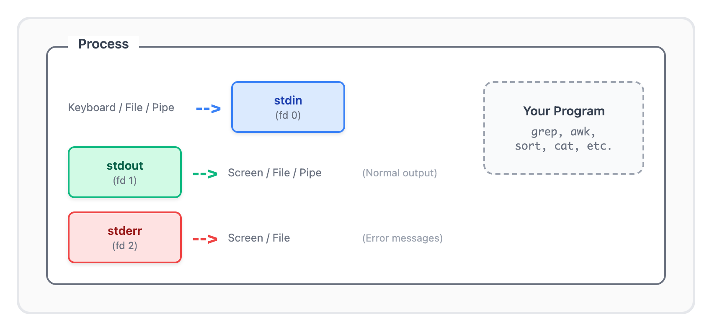

# 01 · 管道和重定向（Pipes and Redirection）

> **目标**：掌握 Unix 数据流控制，学会用管道连接命令 
> **前置**：基础 Linux 命令行操作（cd, ls, cat） 
> **时间**：60-90 分钟 
> **实战场景**：日志监控与数据流分流  

---

## 将学到的内容

1. 理解标准输入/输出/错误（stdin, stdout, stderr）
2. 掌握重定向操作符（>, >>, <, 2>, &>）
3. 使用管道（|）连接命令
4. 使用 tee 分流输出

---

## 先跑起来！（5 分钟）

> 在学习理论之前，先体验命令组合的威力。  
> 运行这些命令，观察输出 — 这就是你将要掌握的技能。  

```bash
# 查看系统日志前 5 行
cat /var/log/syslog | head -5
# 如果没有 syslog，用 dmesg 代替
dmesg | head -5

# 筛选内核错误消息
dmesg | grep -i error | tail -10

# 查找 SSH 相关进程
ps aux | grep ssh

# 分流输出：同时保存到文件 + 计数
echo 'hello world' | tee /tmp/test.txt | wc -c
cat /tmp/test.txt
```

**你刚刚用 `|`（管道）把多个命令连接起来了！**

这就是 Unix 哲学：**小工具 + 组合 = 强大功能**。

现在让我们理解背后的原理。

---

## Step 1 — 标准流：数据的三条通道（10 分钟）

### 1.1 三个流，三个数字

每个 Linux 进程启动时都会打开三个数据通道：



<details>
<summary>View ASCII source</summary>

<!-- DIAGRAM: standard-streams -->
```
┌─────────────────────────────────────────────────────────────────┐
│                         进程 (Process)                           │
│                                                                  │
│   ┌──────────┐                              ┌──────────────────┐ │
│   │  stdin   │◀──── 键盘/文件/管道          │     你的程序      │ │
│   │   (0)    │                              │                  │ │
│   └──────────┘                              │   grep, awk,     │ │
│                                             │   sort, etc.     │ │
│   ┌──────────┐                              │                  │ │
│   │  stdout  │────▶ 屏幕/文件/管道          │                  │ │
│   │   (1)    │      (正常输出)              └──────────────────┘ │
│   └──────────┘                                                   │
│                                                                  │
│   ┌──────────┐                                                   │
│   │  stderr  │────▶ 屏幕/文件               （错误信息）         │
│   │   (2)    │                                                   │
│   └──────────┘                                                   │
└─────────────────────────────────────────────────────────────────┘
```
<!-- /DIAGRAM -->

</details>

| 流 | 文件描述符 | 默认方向 | 用途 |
|----|-----------|----------|------|
| stdin | 0 | 键盘输入 | 接收输入数据 |
| stdout | 1 | 屏幕输出 | 正常输出结果 |
| stderr | 2 | 屏幕输出 | 错误和诊断信息 |

### 1.2 为什么分开 stdout 和 stderr？

```bash
# 这个命令同时产生正常输出和错误
ls /home /nonexistent 2>/dev/null
```

运行结果：
- `/home` 的内容 → stdout（显示在屏幕）
- "No such file or directory" → stderr（被丢弃到 /dev/null）

**分离的好处**：可以单独处理正常数据和错误信息。

---

## Step 2 — 重定向：控制数据流向（15 分钟）

### 2.1 输出重定向

```bash
# 准备练习目录
mkdir -p ~/text-processing-lab
cd ~/text-processing-lab

# > 覆盖写入
echo "第一行" > output.txt
cat output.txt    # 输出: 第一行

# >> 追加写入
echo "第二行" >> output.txt
cat output.txt    # 输出: 第一行 第二行

# 覆盖会清空原内容！
echo "新内容" > output.txt
cat output.txt    # 输出: 新内容 （原内容没了）
```

### 2.2 错误重定向

```bash
# 2> 重定向错误到文件
ls /nonexistent 2> error.log
cat error.log

# 2>> 追加错误
ls /another-fake 2>> error.log

# 丢弃错误（/dev/null = 黑洞）
ls /nonexistent 2>/dev/null
```

### 2.3 同时重定向 stdout 和 stderr

```bash
# 方法 1：分别重定向到不同文件
ls /home /nonexistent > stdout.log 2> stderr.log

# 方法 2：合并到同一文件
ls /home /nonexistent > combined.log 2>&1
# 解释：先把 stdout 定向到文件，再把 stderr 定向到 stdout 所在的位置

# 方法 3：Bash 简写（推荐）
ls /home /nonexistent &> combined.log
```

### 2.4 输入重定向

```bash
# 从文件读取输入
echo -e "apple\nbanana\ncherry" > fruits.txt
sort < fruits.txt

# 与参数的区别
sort fruits.txt      # sort 自己打开文件
sort < fruits.txt    # shell 打开文件，传给 sort 的 stdin
# 结果相同，但机制不同
```

### 2.5 重定向速查表

| 操作符 | 含义 | 示例 |
|--------|------|------|
| `>` | stdout 覆盖写入文件 | `ls > list.txt` |
| `>>` | stdout 追加到文件 | `echo "log" >> app.log` |
| `<` | 从文件读取到 stdin | `sort < data.txt` |
| `2>` | stderr 重定向到文件 | `cmd 2> error.log` |
| `2>>` | stderr 追加到文件 | `cmd 2>> error.log` |
| `2>&1` | stderr 合并到 stdout | `cmd > all.log 2>&1` |
| `&>` | stdout+stderr 到文件（Bash） | `cmd &> all.log` |
| `&>>` | stdout+stderr 追加（Bash） | `cmd &>> all.log` |

---

## Step 3 — 管道：连接命令（15 分钟）

### 3.1 管道的本质

管道 `|` 把左边命令的 **stdout** 连接到右边命令的 **stdin**。


<details>
<summary>View ASCII source</summary>

<!-- DIAGRAM: pipe-mechanism -->
```
┌──────────┐  stdout    stdin  ┌──────────┐  stdout    stdin  ┌──────────┐
│  命令 A   │─────────▶────────│  命令 B   │─────────▶────────│  命令 C   │
└──────────┘                   └──────────┘                   └──────────┘

例子：
┌──────────┐           ┌──────────┐           ┌──────────┐
│   cat    │─────────▶ │   grep   │─────────▶ │   wc     │
│ file.log │  全部内容  │ "ERROR"  │  含ERROR  │   -l     │
└──────────┘           └──────────┘   的行     └──────────┘
                                                  ▼
                                              行数统计
```
<!-- /DIAGRAM -->

</details>

### 3.2 基础管道示例

```bash
# 统计当前目录文件数量
ls | wc -l

# 查找特定进程
ps aux | grep nginx

# 按大小排序文件
ls -lS | head -10    # 最大的 10 个文件

# 统计登录用户
who | wc -l
```

### 3.3 管道链：多级处理

```bash
# 创建示例日志
cat > access.log << 'EOF'
192.168.1.100 - - [01/Jan/2026:10:00:00] "GET /index.html" 200
192.168.1.101 - - [01/Jan/2026:10:00:01] "GET /api/users" 500
192.168.1.100 - - [01/Jan/2026:10:00:02] "POST /api/login" 200
192.168.1.102 - - [01/Jan/2026:10:00:03] "GET /api/data" 500
192.168.1.100 - - [01/Jan/2026:10:00:04] "GET /style.css" 200
192.168.1.103 - - [01/Jan/2026:10:00:05] "GET /api/users" 404
EOF

# 统计访问 IP 的出现次数，按频率排序
cat access.log | awk '{print $1}' | sort | uniq -c | sort -rn
```

输出：
```
      3 192.168.1.100
      1 192.168.1.103
      1 192.168.1.102
      1 192.168.1.101
```

### 3.4 管道只传递 stdout

**重要**：管道默认只传递 stdout，stderr 会直接显示在终端。

```bash
# stderr 不会被传递给 grep
ls /nonexistent 2>&1 | grep "No such"
# 如果不加 2>&1，错误信息不会被 grep 处理
```

**Bash 4+ 的 `|&` 语法**：

```bash
# |& 等同于 2>&1 |
ls /nonexistent |& grep "No such"
```

---

## Step 4 — tee：分流输出（10 分钟）

### 4.1 tee 的作用

`tee` 像管道中的 T 型接头，把数据同时送往文件和下一个命令。


<details>
<summary>View ASCII source</summary>

<!-- DIAGRAM: tee-command -->
```
                    ┌────────────────┐
                    │   文件保存      │
                    │  (backup.log)  │
                    └────────▲───────┘
                             │
┌──────────┐      ┌──────────┴──────────┐      ┌──────────┐
│  命令 A   │─────▶│        tee          │─────▶│  命令 B   │
│          │      │    (T 型分流器)      │      │          │
└──────────┘      └─────────────────────┘      └──────────┘
```
<!-- /DIAGRAM -->

</details>

### 4.2 基础用法

```bash
# 保存输出同时显示在屏幕
dmesg | grep -i error | tee errors.log

# 追加模式
dmesg | grep -i warning | tee -a errors.log

# 写入多个文件
echo "important data" | tee file1.txt file2.txt file3.txt
```

### 4.3 实战场景：障害対応记录

在日本 IT 职场，处理故障时需要保留所有操作记录（障害対応記録）。

```bash
# 一边排查问题，一边保留记录
tail -f /var/log/syslog | tee -a incident_$(date +%Y%m%d).log

# 在另一个终端，可以实时查看记录文件
# tail -f incident_20260104.log
```

### 4.4 结合管道使用

```bash
# 监控日志，同时保存错误记录，并统计数量
tail -100 access.log | grep "500" | tee server_errors.log | wc -l
```

---

## Step 5 — 动手实验：日志流分离（15 分钟）

> **场景**：你是运维工程师，需要监控 Web 服务器日志。  
> 要求：实时查看错误，同时保存完整记录。  

### 5.1 准备模拟环境

```bash
cd ~/text-processing-lab

# 创建模拟的应用程序（同时产生 stdout 和 stderr）
cat > simulate_app.sh << 'EOF'
#!/bin/bash
for i in {1..10}; do
    if [ $((i % 3)) -eq 0 ]; then
        echo "[ERROR] Something went wrong at iteration $i" >&2
    else
        echo "[INFO] Processing iteration $i"
    fi
    sleep 0.5
done
echo "[INFO] Done"
EOF
chmod +x simulate_app.sh
```

### 5.2 任务 1：分离正常输出和错误

```bash
# 运行模拟程序，stdout 和 stderr 分别保存
./simulate_app.sh > info.log 2> error.log

# 检查结果
echo "=== INFO LOG ==="
cat info.log

echo "=== ERROR LOG ==="
cat error.log
```

### 5.3 任务 2：实时监控 + 保存记录

```bash
# 合并输出，同时显示在屏幕和保存到文件
./simulate_app.sh 2>&1 | tee combined.log

# 检查保存的记录
cat combined.log
```

### 5.4 任务 3：构建过滤管道

```bash
# 只保存错误，但显示所有内容
./simulate_app.sh 2>&1 | tee >(grep ERROR > errors_only.log)

# 上面用了进程替换 >()，如果不支持，用这个方法：
./simulate_app.sh 2>&1 | tee full.log | grep ERROR > errors_only.log
```

### 5.5 检查清单

完成以下任务：

- [ ] stdout 和 stderr 分别保存到不同文件
- [ ] 使用 tee 同时显示和保存输出
- [ ] 构建管道提取特定内容

---

## 反模式：常见错误

### 错误 1：重定向顺序错误

```bash
# 错误：2>&1 放在 > 前面
command 2>&1 > output.log
# stderr 去了终端，只有 stdout 进了文件

# 正确：先定向 stdout，再合并 stderr
command > output.log 2>&1
```

**原因**：重定向是从左到右处理的。`2>&1` 的意思是"把 stderr 送到 stdout 当前指向的地方"。

### 错误 2：不小心混合 stdout 和 stderr

```bash
# 危险：错误信息混入正常数据
ls /home /nonexistent 2>&1 | grep "home"
# 可能匹配到错误信息里的内容

# 更安全：明确丢弃错误
ls /home /nonexistent 2>/dev/null | grep "home"

# 或者：明确需要处理错误
ls /home /nonexistent 2>&1 | grep -v "No such"
```

### 错误 3：覆盖重要文件

```bash
# 危险！这会清空 important.log
command > important.log

# 安全做法：先检查文件是否存在
[ -f important.log ] && echo "警告：文件已存在"

# 或使用 noclobber 选项
set -o noclobber    # 启用保护
command > important.log    # 如果文件存在会报错
set +o noclobber    # 关闭保护
```

---

## 职场小贴士（Japan IT Context）

### 运维监控（運用監視）中的应用

在日本 IT 公司的运维现场，以下场景非常常见：

| 日语术语 | 含义 | 管道应用 |
|----------|------|----------|
| 標準出力（ひょうじゅんしゅつりょく） | stdout | 正常的命令输出 |
| 標準エラー出力 | stderr | 错误和警告信息 |
| ログ監視 | 日志监控 | `tail -f log \| grep ERROR` |
| 障害対応 | 故障处理 | `tee` 保存操作记录 |

### 实际场景

**夜班监控（夜勤）**：

```bash
# 夜勤担当者常用：实时监控 + 记录
tail -f /var/log/messages | tee -a shift_$(date +%Y%m%d).log | grep -i error
```

**故障报告（障害報告書）**：

处理故障后需要提交报告，操作记录非常重要：

```bash
# 所有排查命令的输出都保存
{
    echo "=== 调查开始 $(date) ==="
    df -h
    free -m
    ps aux | head -20
    echo "=== 调查结束 $(date) ==="
} | tee investigation_$(date +%Y%m%d_%H%M%S).log
```

---

## 检查清单

完成本课后，你应该能够：

- [ ] 解释 stdin、stdout、stderr 的区别
- [ ] 使用 `>` 和 `>>` 把输出保存到文件
- [ ] 使用 `2>` 单独处理错误输出
- [ ] 使用 `2>&1` 或 `&>` 合并输出流
- [ ] 使用 `|` 连接多个命令
- [ ] 使用 `tee` 分流数据到文件和管道
- [ ] 避免重定向顺序错误

---

## 本课小结

| 概念 | 语法 | 记忆点 |
|------|------|--------|
| 标准流 | fd 0, 1, 2 | 输入、输出、错误 |
| 覆盖写入 | `>` | 会清空原文件 |
| 追加写入 | `>>` | 保留原内容 |
| 错误重定向 | `2>` | 数字 2 代表 stderr |
| 合并输出 | `2>&1` 或 `&>` | stderr 跟随 stdout |
| 管道 | `\|` | stdout → stdin |
| 分流 | `tee` | 同时输出到文件和管道 |

---

## 延伸阅读

- [Bash Manual - Redirections](https://www.gnu.org/software/bash/manual/html_node/Redirections.html)
- 下一课：[02 · 查看和流式处理文件](../02-viewing-files/) — 学习 cat、less、tail -f
- 相关课程：[LX04 · Shell 脚本编程](../../shell-scripting/) — 在脚本中使用重定向

---

## 系列导航

[系列首页](../) | [02 · 查看和流式处理文件 →](../02-viewing-files/)
