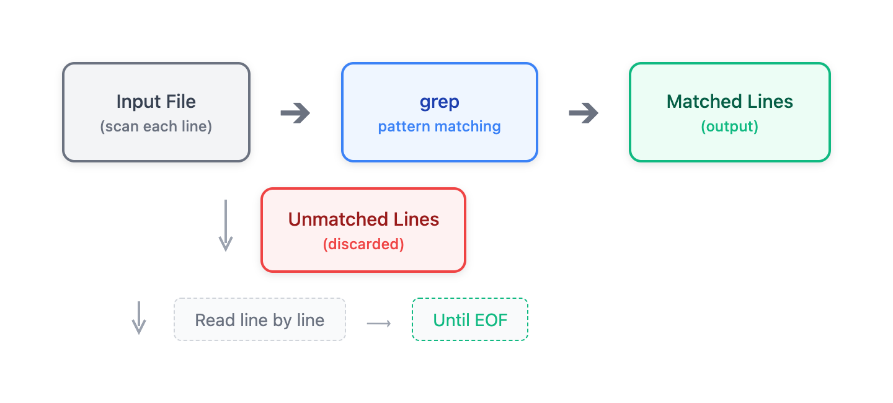

# 03 - grep 基础

> **目标**：掌握 grep 文本搜索工具，快速定位日志中的关键信息  
> **前置**：已完成 [02 - 查看和流式处理文件](../02-viewing-files/)  
> **时间**：⚡ 20 分钟（速读）/ 🔬 75 分钟（完整实操）  
> **费用**：无（本地练习）  

---

## 将学到的内容

1. 使用 grep 搜索文件中的文本模式
2. 掌握常用选项：`-i`, `-v`, `-n`, `-c`, `-l`, `-r`, `-w`, `-F`
3. 使用上下文选项 `-A`, `-B`, `-C` 获取匹配行周围的内容
4. 理解 grep 退出码（exit code）及其在脚本中的应用
5. 多模式搜索：`-e` 和 `-E`

---

## Step 1 - 先跑起来（5 分钟）

> 在学习理论之前，先体验 grep 的威力！  

### 1.1 创建练习环境

```bash
# 创建练习目录
mkdir -p ~/grep-lab && cd ~/grep-lab

# 创建模拟应用日志
cat > app.log << 'EOF'
2026-01-04 09:00:01 INFO  Application starting...
2026-01-04 09:00:02 INFO  Loading configuration from /etc/myapp/config.yaml
2026-01-04 09:00:03 INFO  Database connection established
2026-01-04 09:00:15 WARN  Cache miss ratio is high: 45%
2026-01-04 09:01:22 ERROR Failed to process request: timeout after 30s
2026-01-04 09:01:22 ERROR Stack trace:
2026-01-04 09:01:22 ERROR   at RequestHandler.process(handler.java:142)
2026-01-04 09:01:22 ERROR   at ThreadPool.execute(pool.java:89)
2026-01-04 09:01:23 INFO  Retry attempt 1 of 3
2026-01-04 09:01:25 INFO  Request processed successfully after retry
2026-01-04 09:05:00 INFO  Health check: OK
2026-01-04 09:10:01 error Database connection lost
2026-01-04 09:10:02 ERROR Attempting reconnection...
2026-01-04 09:10:05 INFO  Database reconnected
2026-01-04 09:15:00 INFO  Scheduled cleanup task completed
2026-01-04 09:20:33 WARNING Memory usage at 85%
2026-01-04 09:25:00 INFO  Health check: OK
EOF

# 创建第二个日志文件
cat > access.log << 'EOF'
192.168.1.100 - - [04/Jan/2026:09:00:01] "GET /api/users HTTP/1.1" 200 1234
192.168.1.101 - - [04/Jan/2026:09:00:05] "POST /api/login HTTP/1.1" 200 89
10.0.0.50 - - [04/Jan/2026:09:01:22] "GET /api/orders HTTP/1.1" 504 0
192.168.1.100 - - [04/Jan/2026:09:01:23] "GET /api/orders HTTP/1.1" 200 5678
10.0.0.50 - - [04/Jan/2026:09:05:00] "GET /health HTTP/1.1" 200 15
192.168.1.102 - - [04/Jan/2026:09:10:01] "GET /api/products HTTP/1.1" 500 0
192.168.1.102 - - [04/Jan/2026:09:10:05] "GET /api/products HTTP/1.1" 200 2345
EOF
```

### 1.2 立即体验

```bash
# 找出所有 ERROR 行
grep 'ERROR' app.log

# 找出所有错误（不区分大小写）
grep -i 'error' app.log

# 统计错误数量
grep -c 'ERROR' app.log

# 显示行号
grep -n 'ERROR' app.log

# 找出 HTTP 5xx 错误（状态码 500-599）
grep '" 5[0-9][0-9] ' access.log
```

**观察输出**：

```
2026-01-04 09:01:22 ERROR Failed to process request: timeout after 30s
2026-01-04 09:01:22 ERROR Stack trace:
2026-01-04 09:01:22 ERROR   at RequestHandler.process(handler.java:142)
2026-01-04 09:01:22 ERROR   at ThreadPool.execute(pool.java:89)
2026-01-04 09:10:02 ERROR Attempting reconnection...
```

你刚刚用 grep 从日志中精准定位到了所有错误信息！这就是运维现场最常用的技能。

---

## Step 2 - grep 是什么？（5 分钟）

### 2.1 基本语法

```bash
grep [选项] '模式' 文件
```

**grep** = **G**lobal **R**egular **E**xpression **P**rint

- 从文件中搜索包含指定模式（pattern）的行
- 返回匹配的行内容
- 支持正则表达式（下一课深入讲解）



<details>
<summary>View ASCII source</summary>

```
┌─────────────┐     ┌─────────────┐     ┌─────────────┐
│  输入文件    │────▶│    grep     │────▶│  匹配的行   │
│  (每行扫描)  │     │  模式匹配    │     │  (输出)     │
└─────────────┘     └─────────────┘     └─────────────┘
       │                   │
       │                   ▼
       │            ┌─────────────┐
       │            │  不匹配的行  │
       │            │  (丢弃)     │
       │            └─────────────┘
       │
       ▼
   逐行读取 ──────────────────────────▶ 直到文件结束
```

</details>

### 2.2 退出码（Exit Code）

grep 的退出码在脚本中非常重要：

| 退出码 | 含义 |
|--------|------|
| `0` | 找到匹配 |
| `1` | 未找到匹配 |
| `2` | 发生错误（如文件不存在） |

```bash
# 验证退出码
grep 'ERROR' app.log
echo "Exit code: $?"   # 输出: 0 (找到匹配)

grep 'CRITICAL' app.log
echo "Exit code: $?"   # 输出: 1 (未找到匹配)

grep 'pattern' nonexistent.log
echo "Exit code: $?"   # 输出: 2 (文件不存在)
```

**脚本中的应用**：

```bash
# 检查日志中是否有错误
if grep -q 'ERROR' app.log; then
    echo "Errors found in log!"
    # 发送告警...
fi
```

> **提示**：`-q`（quiet）选项让 grep 只返回退出码，不输出任何内容。  

---

## Step 3 - 必备选项（15 分钟）

### 3.1 基础选项

| 选项 | 全称 | 功能 | 助记 |
|------|------|------|------|
| `-i` | `--ignore-case` | 忽略大小写 | **I**nsensitive |
| `-v` | `--invert-match` | 反向匹配（不包含） | in**V**ert |
| `-n` | `--line-number` | 显示行号 | **N**umber |
| `-c` | `--count` | 统计匹配行数 | **C**ount |

```bash
# -i: 忽略大小写
grep -i 'error' app.log
# 匹配: ERROR, error, Error 等

# -v: 反向匹配（排除 INFO 行）
grep -v 'INFO' app.log

# -n: 显示行号（方便定位）
grep -n 'ERROR' app.log
# 输出: 5:2026-01-04 09:01:22 ERROR Failed to process...

# -c: 统计匹配数量
grep -c 'INFO' app.log
# 输出: 9

# 组合使用
grep -in 'error' app.log   # 不区分大小写 + 显示行号
```

### 3.2 文件操作选项

| 选项 | 全称 | 功能 |
|------|------|------|
| `-l` | `--files-with-matches` | 只输出包含匹配的文件名 |
| `-L` | `--files-without-match` | 只输出不包含匹配的文件名 |
| `-r` | `--recursive` | 递归搜索目录 |
| `-h` | `--no-filename` | 不显示文件名前缀 |
| `-H` | `--with-filename` | 显示文件名前缀（默认多文件时启用） |

```bash
# -l: 找出哪些文件包含 ERROR
grep -l 'ERROR' *.log
# 输出: app.log

# -r: 递归搜索目录
grep -r 'timeout' /var/log/   # 搜索整个 /var/log

# 组合: 递归搜索并只显示文件名
grep -rl 'ERROR' /var/log/
```

### 3.3 匹配控制选项

| 选项 | 全称 | 功能 |
|------|------|------|
| `-w` | `--word-regexp` | 全词匹配 |
| `-x` | `--line-regexp` | 全行匹配 |
| `-F` | `--fixed-strings` | 固定字符串（禁用正则） |

```bash
# -w: 全词匹配
echo -e "error\nerror_code\nmy_error" > test.txt
grep 'error' test.txt     # 匹配所有 3 行
grep -w 'error' test.txt  # 只匹配 "error" 这一行

# -F: 固定字符串（当搜索内容包含正则特殊字符时）
grep -F '[error]' app.log   # 搜索字面量 "[error]"
grep '\[error\]' app.log    # 等价的正则写法（需转义）
```

> **何时用 `-F`？** 搜索包含 `.`, `*`, `[`, `]`, `$` 等特殊字符的文本时，用 `-F` 比转义更简单。  

---

## Step 4 - 上下文选项：障害対応必备（10 分钟）

在故障排查（障害対応）中，仅看到错误行往往不够——你需要知道错误发生的上下文。

### 4.1 上下文选项

| 选项 | 含义 | 助记 |
|------|------|------|
| `-A n` | 显示匹配行**后** n 行 | **A**fter |
| `-B n` | 显示匹配行**前** n 行 | **B**efore |
| `-C n` | 显示匹配行**前后** n 行 | **C**ontext |

```bash
# -A: 显示匹配行后 3 行（查看错误详情）
grep -A 3 'Failed to process' app.log

# 输出:
# 2026-01-04 09:01:22 ERROR Failed to process request: timeout after 30s
# 2026-01-04 09:01:22 ERROR Stack trace:
# 2026-01-04 09:01:22 ERROR   at RequestHandler.process(handler.java:142)
# 2026-01-04 09:01:22 ERROR   at ThreadPool.execute(pool.java:89)
```

```bash
# -B: 显示匹配行前 2 行（查看错误前发生了什么）
grep -B 2 'Database connection lost' app.log

# 输出:
# 2026-01-04 09:05:00 INFO  Health check: OK
# 2026-01-04 09:10:01 error Database connection lost
```

```bash
# -C: 显示前后各 2 行（最常用！）
grep -C 2 'timeout' app.log

# 输出:
# 2026-01-04 09:00:15 WARN  Cache miss ratio is high: 45%
# 2026-01-04 09:01:22 ERROR Failed to process request: timeout after 30s
# 2026-01-04 09:01:22 ERROR Stack trace:
# 2026-01-04 09:01:22 ERROR   at RequestHandler.process(handler.java:142)
```

### 4.2 实战场景

**场景**：用户报告订单接口超时，需要查看相关日志

```bash
# 找出超时错误及其上下文
grep -C 5 -i 'timeout' app.log access.log

# 查看 504 错误前后的请求
grep -B 2 -A 2 '" 504 ' access.log
```


<details>
<summary>View ASCII source</summary>

```
            -B 3 (Before)
                 │
                 ▼
         ┌───────────────┐
    行 7 │  INFO  xxx    │
    行 8 │  WARN  yyy    │
    行 9 │  DEBUG zzz    │
         ├───────────────┤
   行 10 │  ERROR !!!    │ ◀── 匹配行
         ├───────────────┤
   行 11 │  INFO  aaa    │
   行 12 │  INFO  bbb    │
   行 13 │  INFO  ccc    │
         └───────────────┘
                 ▲
                 │
            -A 3 (After)

        -C 3 = -B 3 + -A 3
```

</details>

---

## Step 5 - 多模式搜索（10 分钟）

### 5.1 使用 `-e` 指定多个模式

```bash
# 搜索 ERROR 或 WARN
grep -e 'ERROR' -e 'WARN' app.log

# 等价写法（使用扩展正则）
grep -E 'ERROR|WARN' app.log
```

### 5.2 使用 `-E` 启用扩展正则

| grep 模式 | 说明 |
|-----------|------|
| `grep` | 基本正则表达式（BRE） |
| `grep -E` | 扩展正则表达式（ERE） |
| `egrep` | 等同于 `grep -E`（已废弃） |

```bash
# 搜索 ERROR、WARN 或 WARNING
grep -E 'ERROR|WARN(ING)?' app.log

# 搜索 HTTP 4xx 或 5xx 错误
grep -E '" [45][0-9]{2} ' access.log
```

### 5.3 从文件读取模式

```bash
# 创建模式文件
cat > patterns.txt << 'EOF'
ERROR
WARN
timeout
EOF

# 使用 -f 从文件读取模式
grep -f patterns.txt app.log
```

---

## Step 6 - 动手练习（25 分钟）

### Lab 1: 错误统计

```bash
# 任务 1: 统计 app.log 中不同级别的日志数量
grep -c 'INFO' app.log
grep -c 'WARN' app.log
grep -c 'ERROR' app.log

# 任务 2: 找出所有非 INFO 级别的日志
grep -v 'INFO' app.log

# 任务 3: 统计（不区分大小写的）错误数量
grep -ic 'error' app.log
```

### Lab 2: 故障排查场景

模拟一个 timeout 故障排查：

```bash
# 1. 首先找出所有 timeout 相关的行
grep -in 'timeout' app.log

# 2. 查看 timeout 发生前后的上下文
grep -C 3 -n 'timeout' app.log

# 3. 同时搜索 app.log 和 access.log
grep -h 'timeout\|504' app.log access.log

# 4. 找出哪些日志文件包含 timeout
grep -l 'timeout' *.log
```

### Lab 3: 文件搜索

```bash
# 创建测试目录结构
mkdir -p logs/{app,web,db}
echo "ERROR: App crash" > logs/app/error.log
echo "INFO: Normal" > logs/app/info.log
echo "ERROR: 504 Gateway Timeout" > logs/web/nginx.log
echo "ERROR: Connection refused" > logs/db/mysql.log

# 任务 1: 递归搜索所有 ERROR
grep -r 'ERROR' logs/

# 任务 2: 只显示包含 ERROR 的文件名
grep -rl 'ERROR' logs/

# 任务 3: 只搜索 .log 文件
grep -r --include='*.log' 'ERROR' logs/
```

### Lab 4: 脚本中使用 grep

```bash
# 创建一个简单的日志检查脚本
cat > check_errors.sh << 'EOF'
#!/bin/bash

LOG_FILE="${1:-app.log}"

# 使用 -q 选项只检查是否存在
if grep -q 'ERROR' "$LOG_FILE"; then
    ERROR_COUNT=$(grep -c 'ERROR' "$LOG_FILE")
    echo "Alert: Found $ERROR_COUNT errors in $LOG_FILE"

    # 显示最近的 3 个错误
    echo "Recent errors:"
    grep 'ERROR' "$LOG_FILE" | tail -3

    exit 1  # 返回非零表示有错误
else
    echo "OK: No errors in $LOG_FILE"
    exit 0
fi
EOF

chmod +x check_errors.sh
./check_errors.sh app.log
```

---

## Step 7 - 避免常见错误（10 分钟）

### Anti-Pattern 1: 列举文件而不是用通配符

```bash
# 不好: 手动列举文件
grep 'ERROR' file1.log file2.log file3.log file4.log

# 好: 使用通配符
grep 'ERROR' *.log
```

### Anti-Pattern 2: 递归搜索时包含 .git 目录

```bash
# 不好: 搜索 .git 目录（浪费时间，结果混乱）
grep -r 'function' .

# 好: 排除 .git 目录
grep -r --exclude-dir='.git' 'function' .

# 更好: 使用 ripgrep（自动排除 .gitignore 中的文件）
rg 'function'
```

### Anti-Pattern 3: 忘记引号导致 shell 展开

```bash
# 危险: * 会被 shell 展开为文件名！
grep ERROR * 2>/dev/null   # 可能不是你想要的结果

# 安全: 总是给模式加引号
grep 'ERROR' *
grep "ERROR" *
```

### Anti-Pattern 4: 不使用 -F 搜索特殊字符

```bash
# 不好: 需要转义多个特殊字符
grep '\[2026-01-04\]' app.log

# 好: 使用 -F 禁用正则
grep -F '[2026-01-04]' app.log
```

---

## Step 8 - 现代替代工具：ripgrep（5 分钟）

**ripgrep (rg)** 是 grep 的现代替代品，具有以下优势：

| 特性 | grep | ripgrep (rg) |
|------|------|--------------|
| 速度 | 慢 | 快 10-100 倍 |
| 默认递归 | 需要 `-r` | 自动递归 |
| .gitignore | 需手动排除 | 自动尊重 |
| 跳过二进制 | 需 `--binary-files` | 自动跳过 |
| 彩色输出 | 需 `--color` | 默认启用 |

### ripgrep 安装

```bash
# Ubuntu/Debian
sudo apt install ripgrep

# macOS
brew install ripgrep

# RHEL/CentOS
sudo dnf install ripgrep
```

### ripgrep 常用命令

```bash
# 基本搜索（自动递归）
rg 'ERROR'

# 不区分大小写
rg -i 'error'

# 只显示文件名
rg -l 'ERROR'

# 限定文件类型
rg -t py 'import'    # 只搜索 Python 文件
rg -t log 'ERROR'    # 只搜索 .log 文件

# 上下文
rg -C 3 'ERROR'      # 前后各 3 行
```

### grep vs rg 对照表

| grep | rg | 说明 |
|------|-----|------|
| `grep -r 'pattern' .` | `rg 'pattern'` | 递归搜索 |
| `grep -i 'pattern'` | `rg -i 'pattern'` | 忽略大小写 |
| `grep -l 'pattern' *` | `rg -l 'pattern'` | 只显示文件名 |
| `grep -n 'pattern'` | `rg 'pattern'` | 行号（rg 默认显示） |
| `grep -r --include='*.py'` | `rg -t py` | 限定文件类型 |

> **建议**：在个人开发环境安装 ripgrep，但在生产服务器上，grep 是保证存在的——确保两者都熟练。  

---

## 职场小贴士

### 日本 IT 现场术语

| 日本語 | 中文 | 场景 |
|--------|------|------|
| パターン検索 | 模式搜索 | grep 最常用的场景 |
| エラー抽出 | 错误提取 | 从日志中筛选错误 |
| ログ調査 | 日志调查 | 障害対応的第一步 |
| 絞り込み | 筛选/过滤 | 缩小问题范围 |

### 障害対応中的 grep 工作流

```
1. 初步定位
   grep -i 'error\|fail\|timeout' /var/log/app/*.log

2. 确认时间范围
   grep '2026-01-04 09:0' app.log | grep -i error

3. 获取上下文
   grep -C 5 'specific_error_message' app.log

4. 找出所有相关文件
   grep -rl 'error_code_123' /var/log/

5. 记录证据
   grep -C 10 'error_code_123' app.log > /tmp/incident_evidence.txt
```

### 实际案例

**场景**：凌晨 3 点收到告警，订单系统异常

```bash
# 1. 快速确认是否有错误
grep -c 'ERROR' /var/log/order-service/*.log

# 2. 查看最近的错误
tail -1000 /var/log/order-service/app.log | grep -A 3 'ERROR'

# 3. 统计错误类型
grep 'ERROR' /var/log/order-service/app.log | cut -d' ' -f5 | sort | uniq -c | sort -rn

# 4. 导出证据给开发团队
grep -C 10 'OrderProcessingException' /var/log/order-service/app.log > ~/incident_$(date +%Y%m%d_%H%M).txt
```

---

## 检查清单

完成本课后，你应该能够：

- [ ] 使用 `grep 'pattern' file` 搜索文本
- [ ] 使用 `-i` 进行不区分大小写的搜索
- [ ] 使用 `-v` 排除匹配的行
- [ ] 使用 `-n` 显示行号
- [ ] 使用 `-c` 统计匹配数量
- [ ] 使用 `-l` 和 `-r` 进行递归文件搜索
- [ ] 使用 `-w` 进行全词匹配
- [ ] 使用 `-F` 搜索包含特殊字符的文本
- [ ] 使用 `-A`, `-B`, `-C` 显示上下文
- [ ] 使用 `-e` 或 `-E` 搜索多个模式
- [ ] 在脚本中利用 grep 退出码进行条件判断
- [ ] 知道何时使用 ripgrep 替代 grep

**验证命令**：

```bash
# 测试 1: 统计错误
grep -c 'ERROR' app.log
# 预期: 5

# 测试 2: 上下文搜索
grep -A 2 'timeout' app.log | wc -l
# 预期: 3

# 测试 3: 多模式搜索
grep -E 'ERROR|WARN' app.log | wc -l
# 预期: 7

# 测试 4: 脚本退出码
grep -q 'CRITICAL' app.log; echo $?
# 预期: 1 (未找到)
```

---

## 延伸阅读

### 官方文档

- [GNU grep Manual](https://www.gnu.org/software/grep/manual/)
- [ripgrep User Guide](https://github.com/BurntSushi/ripgrep/blob/master/GUIDE.md)

### 相关课程

- [04 - 正则表达式](../04-regular-expressions/) - grep 的强大来自正则表达式
- [05 - sed 文本转换](../05-sed-transformation/) - 不只搜索，还要修改
- [02 - 查看文件](../02-viewing-files/) - tail -f 与 grep 结合使用

### 速查表

**grep 选项速查**：

```
-i    忽略大小写        -c    统计数量
-v    反向匹配          -l    只显示文件名
-n    显示行号          -r    递归搜索
-w    全词匹配          -F    固定字符串
-A n  后 n 行           -B n  前 n 行
-C n  前后 n 行         -e    多模式
-E    扩展正则          -q    静默模式
```

---

## 清理

```bash
# 清理练习文件
cd ~
rm -rf ~/grep-lab
```

---

## 系列导航

[02 - 查看文件](../02-viewing-files/) | [Home](../) | [04 - 正则表达式](../04-regular-expressions/)
