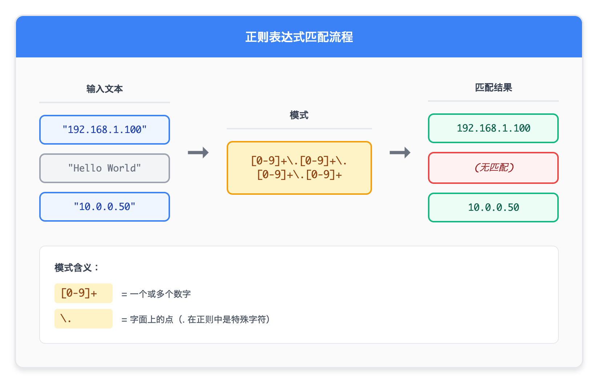

# 04 - 用于 grep 和 sed 的正则表达式

> **目标**：掌握正则表达式基础，在 grep 和 sed 中高效匹配文本模式  
> **前置**：[03 - grep 基础](../03-grep-fundamentals/)  
> **时间**：90-120 分钟  
> **实战项目**：从日志中提取 IP 地址、时间戳、HTTP 状态码  

---

## 将学到的内容

1. BRE（基本正则）与 ERE（扩展正则）的区别
2. 锚点（`^`, `$`）、字符类、量词
3. 实用模式：IPv4、日期、HTTP 状态码
4. 正则表达式常见陷阱与反模式

---

## 先跑起来（5 分钟）

> 先体验正则表达式的威力，再学习理论。  

### 创建测试日志

```bash
mkdir -p ~/regex-lab
cat > ~/regex-lab/access.log << 'EOF'
192.168.1.100 - - [2026-01-04T10:15:30+0900] "GET /index.html HTTP/1.1" 200 1234
10.0.0.50 - - [2026-01-04T10:15:31+0900] "POST /api/login HTTP/1.1" 401 89
192.168.1.101 - - [2026-01-04T10:15:32+0900] "GET /css/style.css HTTP/1.1" 200 567
# This is a comment line
172.16.0.1 - - [2026-01-04T10:15:33+0900] "GET /api/users HTTP/1.1" 500 0

10.0.0.50 - - [2026-01-04T10:15:34+0900] "GET /admin HTTP/1.1" 403 150
192.168.1.100 - - [2026-01-04T10:15:35+0900] "GET /api/products HTTP/1.1" 503 0
EOF
```

### 运行这些命令

```bash
# 1. 提取所有 IP 地址
grep -oE '[0-9]+\.[0-9]+\.[0-9]+\.[0-9]+' ~/regex-lab/access.log

# 2. 找出所有 5xx 错误
grep -E '" 5[0-9]{2} ' ~/regex-lab/access.log

# 3. 提取 ISO 日期时间
grep -oE '[0-9]{4}-[0-9]{2}-[0-9]{2}T[0-9]{2}:[0-9]{2}:[0-9]{2}' ~/regex-lab/access.log

# 4. 过滤掉注释和空行
grep -vE '^#|^$' ~/regex-lab/access.log
```

**输出示例**：

```
# 命令 1 输出：
192.168.1.100
10.0.0.50
192.168.1.101
172.16.0.1
10.0.0.50
192.168.1.100

# 命令 2 输出：
172.16.0.1 - - [2026-01-04T10:15:33+0900] "GET /api/users HTTP/1.1" 500 0
192.168.1.100 - - [2026-01-04T10:15:35+0900] "GET /api/products HTTP/1.1" 503 0
```

你刚刚用正则表达式（Regular Expression，简称 regex）完成了：
- 从文本中提取特定格式的数据
- 筛选符合条件的行
- 排除不需要的内容

现在让我们理解背后的原理。

---

## 发生了什么？

### 正则表达式是什么？

正则表达式是一种描述文本模式的语言。它告诉程序"我要找的文本长这样"。



<details>
<summary>View ASCII source</summary>

```
┌─────────────────────────────────────────────────────────────┐
│                    正则表达式匹配流程                          │
├─────────────────────────────────────────────────────────────┤
│                                                             │
│   输入文本                    模式                匹配结果    │
│   ─────────                  ─────              ─────────   │
│                                                             │
│   "192.168.1.100"     [0-9]+\.[0-9]+\.       192.168.1.100  │
│   "Hello World"   ──▶ [0-9]+\.[0-9]+    ──▶  (无匹配)       │
│   "10.0.0.50"                                10.0.0.50      │
│                                                             │
│   模式含义：                                                 │
│   [0-9]+ = 一个或多个数字                                    │
│   \.     = 字面上的点（. 在正则中是特殊字符）                  │
│                                                             │
└─────────────────────────────────────────────────────────────┘
```

</details>

---

## 核心概念

### BRE vs ERE：两种正则表达式方言

这是最常见的困惑点。Linux 有两种正则表达式语法：

| 特性 | BRE（基本正则） | ERE（扩展正则） |
|------|----------------|-----------------|
| 默认使用 | `grep`, `sed` | `grep -E`, `sed -E`, `awk` |
| `+` (一或多) | 必须转义 `\+` | 直接使用 `+` |
| `?` (零或一) | 必须转义 `\?` | 直接使用 `?` |
| `|` (或) | 必须转义 `\|` | 直接使用 `|` |
| `()` (分组) | 必须转义 `\(\)` | 直接使用 `()` |
| `{}` (量词) | 必须转义 `\{\}` | 直接使用 `{}` |

**示例对比**：

```bash
# BRE：找 "error" 或 "warning"
grep 'error\|warning' file.log

# ERE：同样功能，更清晰
grep -E 'error|warning' file.log
```

**建议**：始终使用 `-E`（ERE），代码更易读。

```bash
# 养成习惯：总是用 grep -E
alias grep='grep -E'   # 可以加到 ~/.bashrc
```

---

### 锚点（Anchors）

锚点指定模式在行中的位置：

| 锚点 | 含义 | 示例 |
|------|------|------|
| `^` | 行首 | `^ERROR` 匹配以 ERROR 开头的行 |
| `$` | 行尾 | `ok$` 匹配以 ok 结尾的行 |
| `^$` | 空行 | 完全没有内容的行 |
| `\b` | 单词边界 | `\berror\b` 只匹配独立的 error |

**实战示例**：

```bash
# 找以 ERROR 开头的行
grep -E '^ERROR' app.log

# 找以数字结尾的行
grep -E '[0-9]$' data.txt

# 删除空行
grep -vE '^$' file.txt
# 或
sed '/^$/d' file.txt

# 只匹配独立单词 "error"（不匹配 "errors" 或 "myerror"）
grep -Ew 'error' app.log
# 或
grep -E '\berror\b' app.log
```

---

### 字符类（Character Classes）

字符类匹配指定范围内的单个字符：

| 语法 | 含义 | 匹配示例 |
|------|------|----------|
| `[abc]` | a、b 或 c | a, b, c |
| `[a-z]` | 小写字母 | a, b, ..., z |
| `[A-Z]` | 大写字母 | A, B, ..., Z |
| `[0-9]` | 数字 | 0, 1, ..., 9 |
| `[a-zA-Z]` | 任意字母 | a-z, A-Z |
| `[^abc]` | 非 a、b、c | d, e, 1, 2, ... |
| `.` | 任意单个字符 | a, 1, @, ... |

**POSIX 字符类**（更可读）：

| 语法 | 等价于 | 含义 |
|------|--------|------|
| `[[:digit:]]` | `[0-9]` | 数字 |
| `[[:alpha:]]` | `[a-zA-Z]` | 字母 |
| `[[:alnum:]]` | `[a-zA-Z0-9]` | 字母数字 |
| `[[:space:]]` | 空白字符 | 空格、Tab、换行 |
| `[[:upper:]]` | `[A-Z]` | 大写字母 |
| `[[:lower:]]` | `[a-z]` | 小写字母 |

**实战示例**：

```bash
# 匹配十六进制数
grep -E '[0-9a-fA-F]+' file.txt

# 匹配非数字开头的行
grep -E '^[^0-9]' file.txt

# 使用 POSIX 类（更可读）
grep -E '[[:digit:]]{4}-[[:digit:]]{2}-[[:digit:]]{2}' file.txt
```

---

### 量词（Quantifiers）

量词指定前面元素出现的次数：

| 量词 | 含义 | BRE | ERE |
|------|------|-----|-----|
| `*` | 零或多次 | `*` | `*` |
| `+` | 一或多次 | `\+` | `+` |
| `?` | 零或一次 | `\?` | `?` |
| `{n}` | 恰好 n 次 | `\{n\}` | `{n}` |
| `{n,}` | 至少 n 次 | `\{n,\}` | `{n,}` |
| `{n,m}` | n 到 m 次 | `\{n,m\}` | `{n,m}` |

**实战示例**：

```bash
# 匹配一个或多个数字
grep -E '[0-9]+' file.txt

# 匹配可选的 www 前缀
grep -E 'https?://(www\.)?example\.com' urls.txt

# 匹配恰好 4 位数字（如年份）
grep -E '\b[0-9]{4}\b' file.txt

# 匹配 2-4 位数字
grep -E '\b[0-9]{2,4}\b' file.txt
```

---

### 分组与或（Groups and Alternation）

| 语法 | 含义 | 示例 |
|------|------|------|
| `(...)` | 分组 | `(error|warn)` |
| `\|` | 或（BRE） | `error\|warning` |
| `|` | 或（ERE） | `error|warning` |

**实战示例**：

```bash
# 匹配 ERROR 或 WARNING 开头
grep -E '^(ERROR|WARNING)' app.log

# 匹配 HTTP 4xx 或 5xx 错误
grep -E '" [45][0-9]{2} ' access.log

# 匹配 .jpg 或 .png 文件
ls | grep -E '\.(jpg|png)$'
```

---

## 实用正则模式速查表

### 日志分析常用模式

```bash
# IPv4 地址
grep -oE '([0-9]{1,3}\.){3}[0-9]{1,3}' file.log

# IPv4 地址（简化版，足够实用）
grep -oE '[0-9]+\.[0-9]+\.[0-9]+\.[0-9]+' file.log

# ISO 日期 (YYYY-MM-DD)
grep -oE '[0-9]{4}-[0-9]{2}-[0-9]{2}' file.log

# ISO 日期时间
grep -oE '[0-9]{4}-[0-9]{2}-[0-9]{2}T[0-9]{2}:[0-9]{2}:[0-9]{2}' file.log

# HTTP 状态码（3 位数字）
grep -oE '" [0-9]{3} ' access.log

# HTTP 5xx 错误
grep -E '" 5[0-9]{2} ' access.log

# HTTP 4xx 或 5xx 错误
grep -E '" [45][0-9]{2} ' access.log

# 注释行（以 # 开头）
grep -E '^[[:space:]]*#' config.txt

# 非注释非空行
grep -vE '^[[:space:]]*(#|$)' config.txt
```

### 系统管理常用模式

```bash
# MAC 地址
grep -oE '([0-9a-fA-F]{2}:){5}[0-9a-fA-F]{2}' file.txt

# UUID
grep -oE '[0-9a-f]{8}-[0-9a-f]{4}-[0-9a-f]{4}-[0-9a-f]{4}-[0-9a-f]{12}' file.txt

# 进程 ID（纯数字行或字段）
grep -oE '\b[0-9]{1,7}\b' file.txt

# 文件路径（以 / 开头）
grep -oE '/[a-zA-Z0-9_/.-]+' file.txt
```

---

## 动手练习（30 分钟）

### 练习环境准备

```bash
# 创建更丰富的测试数据
cat > ~/regex-lab/mixed.log << 'EOF'
2026-01-04 10:00:01 INFO  Server started on 192.168.1.100:8080
2026-01-04 10:00:02 DEBUG Connection from 10.0.0.50
2026-01-04 10:00:03 ERROR Failed to connect to database
2026-01-04 10:00:04 WARN  High memory usage: 85%
# Maintenance window starts
2026-01-04 10:00:05 INFO  Request: GET /api/users HTTP/1.1 200 45ms
2026-01-04 10:00:06 ERROR Timeout after 30000ms
2026-01-04 10:00:07 INFO  Request: POST /api/login HTTP/1.1 401 12ms

2026-01-04 10:00:08 ERROR Connection refused: 172.16.0.1:5432
2026-01-04 10:00:09 INFO  Request: GET /health HTTP/1.1 200 2ms
2026-01-04 10:00:10 WARN  Slow query: 1523ms
EOF
```

### 练习 1：提取日志级别

提取所有出现的日志级别（INFO, DEBUG, ERROR, WARN）：

```bash
# 你的命令：
grep -oE '\b(INFO|DEBUG|ERROR|WARN)\b' ~/regex-lab/mixed.log
```

**预期输出**：

```
INFO
DEBUG
ERROR
WARN
INFO
ERROR
INFO
ERROR
INFO
WARN
```

### 练习 2：统计各级别数量

```bash
# 你的命令：
grep -oE '\b(INFO|DEBUG|ERROR|WARN)\b' ~/regex-lab/mixed.log | sort | uniq -c | sort -rn
```

**预期输出**：

```
      4 INFO
      3 ERROR
      2 WARN
      1 DEBUG
```

### 练习 3：提取响应时间

找出所有请求的响应时间（数字 + ms）：

```bash
# 你的命令：
grep -oE '[0-9]+ms' ~/regex-lab/mixed.log
```

**预期输出**：

```
30000ms
45ms
12ms
2ms
1523ms
```

### 练习 4：找出慢请求

找出响应时间超过 100ms 的行：

```bash
# 思路：先找所有带响应时间的行，再用 awk 过滤
# 方法 1：用 grep 找含 ms 的行
grep -E '[0-9]+ms' ~/regex-lab/mixed.log

# 方法 2：更精确 - 只找真正的慢请求（响应时间 >= 100）
# 这需要 awk，纯正则做不到数值比较
grep -E '[0-9]+ms' ~/regex-lab/mixed.log | awk '{
    for(i=1; i<=NF; i++) {
        if(match($i, /^([0-9]+)ms$/, arr)) {
            if(arr[1] >= 100) print $0
            break
        }
    }
}'
```

### 练习 5：清理配置文件

删除注释和空行，只保留有效配置：

```bash
# 创建测试配置
cat > ~/regex-lab/config.conf << 'EOF'
# Database settings
db_host=localhost
db_port=5432

# Application settings
app_name=myapp
# debug=true
app_port=8080

EOF

# 你的命令：
grep -vE '^[[:space:]]*(#|$)' ~/regex-lab/config.conf
```

**预期输出**：

```
db_host=localhost
db_port=5432
app_name=myapp
app_port=8080
```

### 练习 6：用 sed 替换 IP 地址

将日志中的 IP 地址匿名化（替换为 x.x.x.x）：

```bash
# 你的命令：
sed -E 's/[0-9]+\.[0-9]+\.[0-9]+\.[0-9]+/x.x.x.x/g' ~/regex-lab/mixed.log
```

**预期输出**（部分）：

```
2026-01-04 10:00:01 INFO  Server started on x.x.x.x:8080
2026-01-04 10:00:02 DEBUG Connection from x.x.x.x
...
```

---

## 反模式：这些坑不要踩

### 反模式 1：复杂嵌套正则

```bash
# 不好：过于复杂，难以维护
grep -E '^([0-9]{1,3}\.){3}[0-9]{1,3}:[0-9]+\s+-\s+-\s+\[.*\]\s+"(GET|POST|PUT|DELETE)\s+.*"' access.log

# 好：使用 awk 分字段处理
awk '$7 ~ /^"(GET|POST|PUT|DELETE)/ && $1 ~ /^[0-9]+\.[0-9]+/' access.log
```

**原则**：如果正则表达式超过 50 个字符，考虑用 awk 或写脚本。

### 反模式 2：用正则验证邮箱

```bash
# 不好：邮箱规则极其复杂，正则无法完全覆盖
grep -E '^[a-zA-Z0-9._%+-]+@[a-zA-Z0-9.-]+\.[a-zA-Z]{2,}$' emails.txt

# 这个正则会漏掉合法邮箱，也会匹配非法邮箱
# 例如：user@domain 缺少顶级域名但可能在内网有效
```

**原则**：邮箱、URL 验证应该用专门的库，不要用正则。

### 反模式 3：忘记锚定

```bash
# 不好：可能匹配到不想要的内容
grep -E 'error' app.log
# 会匹配：error, myerror, error_handler, errorCode...

# 好：使用单词边界或 -w
grep -Ew 'error' app.log
grep -E '\berror\b' app.log
```

### 反模式 4：贪婪匹配陷阱

```bash
# 问题：.* 是贪婪的，会匹配尽可能多的内容
echo 'name="John" age="30"' | grep -oE '".*"'
# 输出："John" age="30"（不是你想要的）

# 解决：使用非贪婪（部分工具支持）或更精确的字符类
echo 'name="John" age="30"' | grep -oE '"[^"]*"'
# 输出：
# "John"
# "30"
```

---

## 职场小贴士

### 日本 IT 术语

| 日本語 | 含义 | 场景 |
|--------|------|------|
| 正規表現 (seiki hyougen) | 正则表达式 | 技术文档、代码审查 |
| パターンマッチング | 模式匹配 | 讨论搜索逻辑 |
| 障害分析 (shougai bunseki) | 故障分析 | 日志分析排障 |
| ログ解析 (log kaiseki) | 日志解析 | 运维日常 |

### 职场场景

**场景 1：故障初查**

```bash
# 运维接到告警，第一步通常是：
# 1. 找出错误行
grep -E 'ERROR|FATAL' /var/log/app/app.log | tail -20

# 2. 提取时间范围内的日志
grep -E '^2026-01-04 10:(1[5-9]|2[0-9])' /var/log/app/app.log
```

**场景 2：安全审计**

```bash
# 找出所有 SSH 失败登录的源 IP
grep -E 'Failed password' /var/log/secure | grep -oE '[0-9]+\.[0-9]+\.[0-9]+\.[0-9]+' | sort | uniq -c | sort -rn
```

**场景 3：配置检查**

```bash
# 找出配置文件中所有非注释的有效行
grep -vE '^[[:space:]]*(#|;|$)' /etc/nginx/nginx.conf
```

---

## 检查清单

完成本课后，你应该能够：

- [ ] 解释 BRE 和 ERE 的区别，知道何时用 `-E`
- [ ] 使用锚点 `^` `$` 匹配行首行尾
- [ ] 使用字符类 `[0-9]` `[a-z]` 匹配字符范围
- [ ] 使用量词 `+` `*` `?` `{n,m}` 控制匹配次数
- [ ] 写出匹配 IP 地址的正则表达式
- [ ] 写出匹配 ISO 日期的正则表达式
- [ ] 用 grep 过滤掉注释和空行
- [ ] 用 sed 进行简单的正则替换
- [ ] 避免使用过于复杂的正则表达式

---

## 现代替代工具

### ripgrep (rg)

ripgrep 默认使用类似 ERE 的语法，无需 `-E` 标志：

```bash
# grep -E 需要 -E 标志
grep -E '[0-9]+\.[0-9]+\.[0-9]+\.[0-9]+' access.log

# rg 默认就是扩展正则
rg '[0-9]+\.[0-9]+\.[0-9]+\.[0-9]+' access.log

# rg 还支持更多功能
rg -o '\d+\.\d+\.\d+\.\d+'  # \d 代替 [0-9]
rg --pcre2 '(?<=").*?(?=")'  # 支持 PCRE2 高级特性
```

**安装**：

```bash
# Amazon Linux / RHEL
sudo yum install ripgrep

# Ubuntu / Debian
sudo apt install ripgrep

# macOS
brew install ripgrep
```

---

## 延伸阅读

- [GNU grep Manual - Regular Expressions](https://www.gnu.org/software/grep/manual/grep.html#Regular-Expressions)
- [sed Manual](https://www.gnu.org/software/sed/manual/sed.html)
- [regex101.com](https://regex101.com/) - 在线正则测试工具（推荐）
- [05 - sed 文本转换](../05-sed-transformation/) - 下一课

---

## 附录：正则表达式速查卡

### 元字符

| 字符 | 含义 |
|------|------|
| `.` | 任意单个字符 |
| `^` | 行首 |
| `$` | 行尾 |
| `*` | 零或多次 |
| `+` | 一或多次（ERE） |
| `?` | 零或一次（ERE） |
| `\` | 转义特殊字符 |
| `[]` | 字符类 |
| `[^]` | 否定字符类 |
| `\|` | 或（ERE 用 `|`） |
| `()` | 分组（ERE） |
| `{}` | 量词（ERE） |

### 预定义字符类（ERE）

| 语法 | 含义 |
|------|------|
| `\d` | 数字（部分工具支持） |
| `\w` | 单词字符 [a-zA-Z0-9_] |
| `\s` | 空白字符 |
| `\b` | 单词边界 |

### 常用组合

| 模式 | 匹配 |
|------|------|
| `.*` | 任意内容（贪婪） |
| `.+` | 至少一个任意字符 |
| `[0-9]+` | 一或多个数字 |
| `[a-zA-Z]+` | 一或多个字母 |
| `^$` | 空行 |
| `^#` | 注释行 |

---

## 系列导航

← [03 - grep 基础](../03-grep-fundamentals/) | [课程首页](../) | [05 - sed 文本转换](../05-sed-transformation/) →
