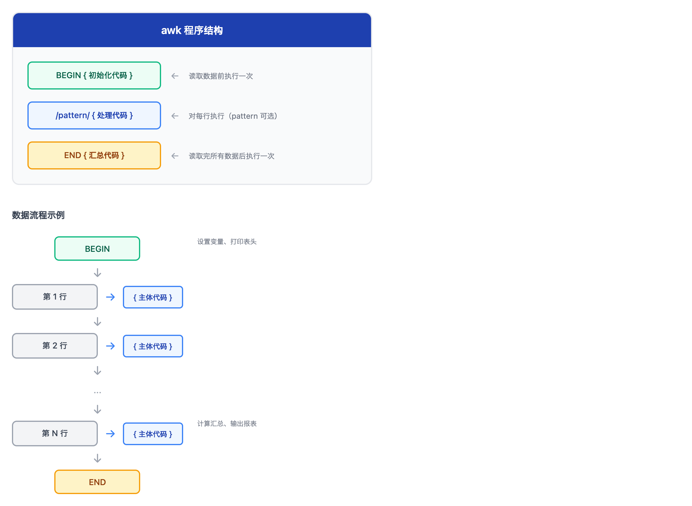

# 07 - awk 程序和聚合（awk Programs and Aggregation）

> **目标**：掌握 awk 的 BEGIN/END 块、变量、计算和关联数组，构建日志分析仪表板  
> **前置**：[06 - awk 字段处理](../06-awk-fields/)  
> **时间**：90-120 分钟  
> **实战项目**：日志指标仪表板（Log Metrics Dashboard）  

---

## 先跑起来

> 不需要理解，先体验 awk 的聚合威力。  

```bash
# 创建练习目录
mkdir -p ~/awk-programs-lab && cd ~/awk-programs-lab

# 创建模拟的 Web 服务器访问日志
cat > access.log << 'EOF'
192.168.1.100 - - [04/Jan/2026:10:00:01] "GET /api/users HTTP/1.1" 200 1234 0.045
192.168.1.100 - - [04/Jan/2026:10:00:02] "GET /api/orders HTTP/1.1" 200 5678 0.123
10.0.2.50 - - [04/Jan/2026:10:00:03] "POST /api/login HTTP/1.1" 401 89 0.034
192.168.1.101 - - [04/Jan/2026:10:00:04] "GET /static/css/main.css HTTP/1.1" 304 0 0.002
10.0.2.50 - - [04/Jan/2026:10:00:05] "POST /api/login HTTP/1.1" 200 456 0.056
203.0.113.42 - - [04/Jan/2026:10:00:06] "GET /admin HTTP/1.1" 403 123 0.015
192.168.1.100 - - [04/Jan/2026:10:00:07] "GET /api/products HTTP/1.1" 500 0 2.345
192.168.1.101 - - [04/Jan/2026:10:00:08] "GET /api/users HTTP/1.1" 200 2345 0.089
203.0.113.42 - - [04/Jan/2026:10:00:09] "GET /admin HTTP/1.1" 403 123 0.012
10.0.2.50 - - [04/Jan/2026:10:00:10] "GET /api/orders HTTP/1.1" 200 3456 0.156
EOF

# 魔法 1: 统计总请求数
awk 'END {print "总请求数:", NR}' access.log

# 魔法 2: 计算平均响应时间
awk '{sum += $10} END {printf "平均响应时间: %.3f 秒\n", sum/NR}' access.log

# 魔法 3: HTTP 状态码直方图
awk '{count[$9]++} END {for (code in count) print code, count[code]}' access.log | sort -k1n

# 魔法 4: Top 3 IP 地址（按请求数）
awk '{count[$1]++} END {for (ip in count) print count[ip], ip}' access.log | sort -rn | head -3
```

你刚刚用 awk 完成了：
- **总计数**：统计行数（集計）
- **平均值计算**：响应时间均值
- **分组统计**：状态码分布
- **排序输出**：Top N 分析

这些都是运维报表（運用レポート）和障害分析（障害分析）的核心技能。现在让我们系统学习！

---

## 核心概念

### awk 程序结构

awk 程序由三个可选部分组成：



<details>
<summary>View ASCII source</summary>

<!-- DIAGRAM: awk-program-structure -->
```
┌─────────────────────────────────────────────────────────────┐
│                    awk 程序结构                              │
├─────────────────────────────────────────────────────────────┤
│                                                             │
│   BEGIN { 初始化代码 }     ← 读取数据前执行一次             │
│                                                             │
│   /pattern/ { 处理代码 }   ← 对每行执行（pattern 可选）     │
│                                                             │
│   END { 汇总代码 }         ← 读取完所有数据后执行一次        │
│                                                             │
└─────────────────────────────────────────────────────────────┘

                    数据流程示例

    ┌─────────┐
    │ BEGIN   │  设置变量、打印表头
    └────┬────┘
         │
         ▼
    ┌─────────┐
    │ 第 1 行  │──▶ { 主体代码 }
    └────┬────┘
         │
         ▼
    ┌─────────┐
    │ 第 2 行  │──▶ { 主体代码 }
    └────┬────┘
         │
         ▼
       ...
         │
         ▼
    ┌─────────┐
    │ 第 N 行  │──▶ { 主体代码 }
    └────┬────┘
         │
         ▼
    ┌─────────┐
    │  END    │  计算汇总、输出报表
    └─────────┘
```
<!-- /DIAGRAM -->

</details>

```bash
# 完整结构示例
awk '
    BEGIN { print "=== 报表开始 ===" }
    { print "处理:", $0 }
    END { print "=== 报表结束 ===" }
' file.txt
```

---

## BEGIN 和 END 块

### BEGIN：初始化

在读取任何数据之前执行，用于：
- 设置变量初始值
- 定义字段分隔符
- 打印报表头部

```bash
cd ~/awk-programs-lab

# 设置分隔符并打印表头
awk '
    BEGIN {
        FS = " "              # 输入字段分隔符
        OFS = "\t"            # 输出字段分隔符
        print "IP地址\t状态码\t响应时间"
        print "---\t---\t---"
    }
    { print $1, $9, $10 }
' access.log
```

### END：汇总

在处理完所有数据之后执行，用于：
- 输出统计结果
- 计算均值、总和
- 生成报表尾部

```bash
# 计算统计信息
awk '
    {
        sum += $10
        if ($10 > max) max = $10
    }
    END {
        print "总请求数:", NR
        print "平均响应时间:", sum/NR, "秒"
        print "最大响应时间:", max, "秒"
    }
' access.log
```

---

## 变量和计算

### 内置变量回顾

| 变量 | 含义 |
|------|------|
| `NR` | 当前行号（Number of Records） |
| `NF` | 当前行字段数（Number of Fields） |
| `$0` | 整行内容 |
| `$1, $2, ...` | 第 1、2... 个字段 |
| `FS` | 输入字段分隔符 |
| `OFS` | 输出字段分隔符 |

### 用户自定义变量

awk 变量无需声明，自动初始化：
- 数值变量：初始值为 0
- 字符串变量：初始值为空字符串 `""`

```bash
cd ~/awk-programs-lab

# 变量自动初始化演示
awk '
    {
        count++           # 自动初始化为 0，然后 +1
        sum += $10        # 累加响应时间
    }
    END {
        print "count =", count
        print "sum =", sum
        print "average =", sum/count
    }
' access.log
```

### 常用计算模式

```bash
# 求和
awk '{sum += $10} END {print "总和:", sum}' access.log

# 求平均
awk '{sum += $10} END {print "平均:", sum/NR}' access.log

# 求最大值
awk '{if ($10 > max) max = $10} END {print "最大:", max}' access.log

# 求最小值（注意：需要初始化）
awk '
    NR == 1 { min = $10 }
    $10 < min { min = $10 }
    END { print "最小:", min }
' access.log

# 同时计算多个统计量
awk '
    NR == 1 { min = max = $10 }
    {
        sum += $10
        if ($10 > max) max = $10
        if ($10 < min) min = $10
    }
    END {
        printf "最小: %.3f | 最大: %.3f | 平均: %.3f\n", min, max, sum/NR
    }
' access.log
```

---

## 关联数组（Associative Arrays）

这是 awk 最强大的特性之一。关联数组可以用任意字符串作为索引（类似 Python 的字典或 JavaScript 的对象）。

### 基本语法

```bash
# 声明和使用
array["key"] = value
array[$1]++              # 以第一个字段为键，计数

# 遍历
for (key in array) {
    print key, array[key]
}
```

### 实际演示

```bash
cd ~/awk-programs-lab

# 统计每个 IP 的请求数
awk '
    { ip_count[$1]++ }
    END {
        print "=== IP 请求统计 ==="
        for (ip in ip_count) {
            print ip, ip_count[ip], "次"
        }
    }
' access.log

# 统计每个状态码的出现次数
awk '
    { status_count[$9]++ }
    END {
        print "=== 状态码分布 ==="
        for (code in status_count) {
            print code ":", status_count[code], "次"
        }
    }
' access.log
```

### 多维统计

```bash
# 统计每个 IP 的每种状态码
awk '
    { count[$1][$9]++ }
    END {
        for (ip in count) {
            for (status in count[ip]) {
                print ip, status, count[ip][status]
            }
        }
    }
' access.log
```

> **注意**：关联数组遍历顺序是不确定的。如果需要排序输出，需要管道到 `sort`。  

---

## 条件语句

### if-else 语法

```bash
awk '
    {
        if ($9 >= 500) {
            print "ERROR:", $0
        } else if ($9 >= 400) {
            print "WARNING:", $0
        } else {
            print "OK:", $0
        }
    }
' access.log
```

### 三元运算符

```bash
# condition ? true_value : false_value
awk '{ print ($9 >= 400 ? "异常" : "正常"), $0 }' access.log
```

### 条件计数

```bash
cd ~/awk-programs-lab

# 分类统计
awk '
    {
        total++
        if ($9 >= 500) errors++
        else if ($9 >= 400) warnings++
        else success++
    }
    END {
        print "总计:", total
        print "成功 (2xx/3xx):", success
        print "警告 (4xx):", warnings
        print "错误 (5xx):", errors
    }
' access.log
```

---

## 实战项目：日志指标仪表板

### 场景

> 你是运维团队的一员，需要为每日站会（朝会）准备 Web 服务器的运行状况报告。报告需要包含：总请求数、状态码分布、Top IP、平均响应时间。  

### 准备更真实的测试数据

```bash
cd ~/awk-programs-lab

# 创建更大的测试日志（100 行）
cat > access_large.log << 'EOF'
192.168.1.100 - - [04/Jan/2026:10:00:01] "GET /api/users HTTP/1.1" 200 1234 0.045
192.168.1.100 - - [04/Jan/2026:10:00:02] "GET /api/orders HTTP/1.1" 200 5678 0.123
10.0.2.50 - - [04/Jan/2026:10:00:03] "POST /api/login HTTP/1.1" 401 89 0.034
192.168.1.101 - - [04/Jan/2026:10:00:04] "GET /static/css/main.css HTTP/1.1" 304 0 0.002
10.0.2.50 - - [04/Jan/2026:10:00:05] "POST /api/login HTTP/1.1" 200 456 0.056
203.0.113.42 - - [04/Jan/2026:10:00:06] "GET /admin HTTP/1.1" 403 123 0.015
192.168.1.100 - - [04/Jan/2026:10:00:07] "GET /api/products HTTP/1.1" 500 0 2.345
192.168.1.101 - - [04/Jan/2026:10:00:08] "GET /api/users HTTP/1.1" 200 2345 0.089
203.0.113.42 - - [04/Jan/2026:10:00:09] "GET /admin HTTP/1.1" 403 123 0.012
10.0.2.50 - - [04/Jan/2026:10:00:10] "GET /api/orders HTTP/1.1" 200 3456 0.156
172.16.0.25 - - [04/Jan/2026:10:00:11] "GET /api/users HTTP/1.1" 200 1234 0.067
192.168.1.100 - - [04/Jan/2026:10:00:12] "GET /api/products HTTP/1.1" 200 4567 0.234
10.0.2.50 - - [04/Jan/2026:10:00:13] "POST /api/orders HTTP/1.1" 201 789 0.189
192.168.1.101 - - [04/Jan/2026:10:00:14] "GET /static/js/app.js HTTP/1.1" 200 12345 0.003
203.0.113.42 - - [04/Jan/2026:10:00:15] "GET /admin/users HTTP/1.1" 403 123 0.018
192.168.1.100 - - [04/Jan/2026:10:00:16] "GET /api/users HTTP/1.1" 500 0 3.456
172.16.0.25 - - [04/Jan/2026:10:00:17] "GET /api/orders HTTP/1.1" 200 2345 0.145
10.0.2.50 - - [04/Jan/2026:10:00:18] "GET /api/products HTTP/1.1" 200 3456 0.178
192.168.1.101 - - [04/Jan/2026:10:00:19] "GET /api/users HTTP/1.1" 200 1234 0.056
192.168.1.100 - - [04/Jan/2026:10:00:20] "POST /api/orders HTTP/1.1" 201 567 0.234
EOF

echo "测试数据已创建: access_large.log ($(wc -l < access_large.log) 行)"
```

### Step 1：基础统计

```bash
cd ~/awk-programs-lab

# 基础统计：总请求数、成功/失败数
awk '
    BEGIN {
        print "======================================"
        print "       Web 服务器日志分析报告"
        print "======================================"
        print ""
    }
    {
        total++
        if ($9 >= 200 && $9 < 300) success++
        else if ($9 >= 300 && $9 < 400) redirect++
        else if ($9 >= 400 && $9 < 500) client_err++
        else if ($9 >= 500) server_err++
    }
    END {
        print "【基础统计】"
        print "总请求数:", total
        print ""
        print "【状态码分布】"
        printf "  2xx (成功):     %d (%.1f%%)\n", success, success/total*100
        printf "  3xx (重定向):   %d (%.1f%%)\n", redirect, redirect/total*100
        printf "  4xx (客户端错误): %d (%.1f%%)\n", client_err, client_err/total*100
        printf "  5xx (服务端错误): %d (%.1f%%)\n", server_err, server_err/total*100
    }
' access_large.log
```

### Step 2：状态码详细分布

```bash
# 详细状态码直方图
awk '
    { status_count[$9]++ }
    END {
        print "【状态码详细分布】"
        for (code in status_count) {
            printf "  %s: %d 次\n", code, status_count[code]
        }
    }
' access_large.log | sort -t: -k1n
```

### Step 3：Top 10 IP 地址

```bash
# Top 10 IP（按请求数排序）
awk '
    { ip_count[$1]++ }
    END {
        for (ip in ip_count) {
            print ip_count[ip], ip
        }
    }
' access_large.log | sort -rn | head -10 | awk '
    BEGIN { print "【Top 10 IP 地址】" }
    { printf "  %d. %-15s %d 次\n", NR, $2, $1 }
'
```

### Step 4：响应时间分析

```bash
# 响应时间统计
awk '
    NR == 1 { min = max = $10 }
    {
        sum += $10
        if ($10 > max) { max = $10; max_url = $7 }
        if ($10 < min) min = $10

        # 统计慢请求（> 1秒）
        if ($10 > 1) slow_count++
    }
    END {
        print "【响应时间分析】"
        printf "  平均响应时间: %.3f 秒\n", sum/NR
        printf "  最小响应时间: %.3f 秒\n", min
        printf "  最大响应时间: %.3f 秒 (%s)\n", max, max_url
        printf "  慢请求数 (>1s): %d 次\n", slow_count
    }
' access_large.log
```

### Step 5：完整仪表板脚本

```bash
cat > ~/awk-programs-lab/dashboard.sh << 'SCRIPT'
#!/bin/bash
# 日志指标仪表板 - Log Metrics Dashboard
# 用于每日站会（朝会）报告

set -euo pipefail

# 输入验证
log_file="${1:-}"
if [[ -z "$log_file" || ! -f "$log_file" ]]; then
    echo "Usage: $0 <access_log_file>"
    exit 1
fi

# 生成报告时间
report_date=$(date '+%Y-%m-%d %H:%M:%S')

# 完整分析
awk -v report_date="$report_date" '
    BEGIN {
        print "======================================"
        print "       Web 服务器运行状况报告"
        print "======================================"
        print "报告生成时间:", report_date
        print ""
    }

    NR == 1 { min_time = max_time = $10 }

    {
        # 基础计数
        total++

        # 状态码分类
        status_count[$9]++
        if ($9 >= 200 && $9 < 300) success++
        else if ($9 >= 300 && $9 < 400) redirect++
        else if ($9 >= 400 && $9 < 500) client_err++
        else if ($9 >= 500) server_err++

        # IP 统计
        ip_count[$1]++

        # 响应时间
        sum_time += $10
        if ($10 > max_time) { max_time = $10; max_url = $7 }
        if ($10 < min_time) min_time = $10
        if ($10 > 1) slow_count++
    }

    END {
        # 基础统计
        print "【基础统计】"
        print "  总请求数:", total
        print ""

        # 状态码分布
        print "【状态码分布】"
        printf "  2xx (成功):      %4d (%5.1f%%)\n", success+0, (success+0)/total*100
        printf "  3xx (重定向):    %4d (%5.1f%%)\n", redirect+0, (redirect+0)/total*100
        printf "  4xx (客户端错误): %4d (%5.1f%%)\n", client_err+0, (client_err+0)/total*100
        printf "  5xx (服务端错误): %4d (%5.1f%%)\n", server_err+0, (server_err+0)/total*100
        print ""

        # 详细状态码
        print "【状态码明细】"
        for (code in status_count) {
            printf "  %s: %d 次\n", code, status_count[code]
        }
        print ""

        # 响应时间
        print "【响应时间分析】"
        printf "  平均响应时间: %.3f 秒\n", sum_time/total
        printf "  最小响应时间: %.3f 秒\n", min_time
        printf "  最大响应时间: %.3f 秒 (%s)\n", max_time, max_url
        printf "  慢请求数 (>1s): %d 次\n", slow_count+0
        print ""

        # Top IP（需要排序，存储后输出）
        print "【Top 10 IP 地址】"
        n = 0
        for (ip in ip_count) {
            ip_list[++n] = ip_count[ip] " " ip
        }
        # 简单冒泡排序（小数据量可接受）
        for (i = 1; i <= n; i++) {
            for (j = i + 1; j <= n; j++) {
                split(ip_list[i], a, " ")
                split(ip_list[j], b, " ")
                if (a[1] < b[1]) {
                    tmp = ip_list[i]
                    ip_list[i] = ip_list[j]
                    ip_list[j] = tmp
                }
            }
        }
        for (i = 1; i <= (n < 10 ? n : 10); i++) {
            split(ip_list[i], parts, " ")
            printf "  %2d. %-15s %d 次\n", i, parts[2], parts[1]
        }
        print ""
        print "======================================"
        print "              报告结束"
        print "======================================"
    }
' "$log_file"
SCRIPT

chmod +x ~/awk-programs-lab/dashboard.sh
```

### 运行仪表板

```bash
cd ~/awk-programs-lab
./dashboard.sh access_large.log
```

**预期输出**：

```
======================================
       Web 服务器运行状况报告
======================================
报告生成时间: 2026-01-04 10:30:00

【基础统计】
  总请求数: 20

【状态码分布】
  2xx (成功):        13 ( 65.0%)
  3xx (重定向):       1 (  5.0%)
  4xx (客户端错误):   4 ( 20.0%)
  5xx (服务端错误):   2 ( 10.0%)

【状态码明细】
  200: 11 次
  201: 2 次
  304: 1 次
  401: 1 次
  403: 3 次
  500: 2 次

【响应时间分析】
  平均响应时间: 0.373 秒
  最小响应时间: 0.002 秒
  最大响应时间: 3.456 秒 (/api/users)
  慢请求数 (>1s): 2 次

【Top 10 IP 地址】
   1. 192.168.1.100   6 次
   2. 10.0.2.50       4 次
   3. 192.168.1.101   4 次
   4. 203.0.113.42    3 次
   5. 172.16.0.25     3 次

======================================
              报告结束
======================================
```

---

## 高级技巧：多文件日志关联

> **重要**：这是 LX10-TROUBLESHOOTING 的预备技能。故障排查需要同时分析多个日志文件。  

### 场景：为什么要关联多个日志？


<details>
<summary>View ASCII source</summary>

<!-- DIAGRAM: multi-log-correlation -->
```
                    故障排查场景

用户报告 "下单失败"
         │
         ▼
┌─────────────────────────────────────────────────────────────┐
│                     需要检查多个日志                         │
├─────────────────────────────────────────────────────────────┤
│                                                             │
│   access.log          error.log           app.log          │
│   ───────────         ──────────          ────────         │
│   [请求记录]          [错误详情]          [业务逻辑]        │
│   IP、URL、状态码     异常堆栈            订单处理流程       │
│                                                             │
│         │                  │                  │             │
│         └────────┬─────────┴────────┬─────────┘             │
│                  │                  │                       │
│                  ▼                  ▼                       │
│           通过时间戳关联      通过请求ID关联                 │
│                  │                  │                       │
│                  └────────┬─────────┘                       │
│                           │                                 │
│                           ▼                                 │
│                    构建完整时间线                            │
│                    定位根因                                  │
│                                                             │
└─────────────────────────────────────────────────────────────┘

  反面模式：只看一个日志 → 错过关联信息 → 无法构建完整时间线
```
<!-- /DIAGRAM -->

</details>

### 模式 1：合并多文件后分析

最简单的方法 - 适用于同格式的日志文件：

```bash
cd ~/awk-programs-lab

# 创建第二个日志文件
cat > access2.log << 'EOF'
192.168.1.100 - - [04/Jan/2026:11:00:01] "GET /api/users HTTP/1.1" 200 1234 0.045
172.16.0.99 - - [04/Jan/2026:11:00:02] "GET /api/orders HTTP/1.1" 200 5678 0.123
192.168.1.100 - - [04/Jan/2026:11:00:03] "GET /api/products HTTP/1.1" 500 0 1.234
EOF

# 合并所有日志统计 IP
cat access.log access2.log | awk '
    { count[$1]++ }
    END {
        for (ip in count)
            print count[ip], ip
    }
' | sort -rn | head -5

# 使用通配符
cat *.log | awk '{count[$1]++} END {for(k in count) print count[k], k}' | sort -rn
```

### 模式 2：NR==FNR 关联键匹配

这是 awk 的经典模式，用于关联两个文件：

```bash
cd ~/awk-programs-lab

# 创建错误日志（包含请求 ID）
cat > error.log << 'EOF'
2026-01-04 10:00:07 req-12345 ERROR Database connection timeout
2026-01-04 10:00:16 req-12350 ERROR Query execution failed
EOF

# 创建访问日志（包含请求 ID）
cat > access_with_id.log << 'EOF'
192.168.1.100 req-12345 [04/Jan/2026:10:00:07] "GET /api/products" 500
192.168.1.100 req-12346 [04/Jan/2026:10:00:08] "GET /api/users" 200
192.168.1.101 req-12347 [04/Jan/2026:10:00:09] "GET /api/orders" 200
192.168.1.100 req-12350 [04/Jan/2026:10:00:16] "GET /api/users" 500
172.16.0.25 req-12351 [04/Jan/2026:10:00:17] "GET /api/orders" 200
EOF

# 找出 error.log 中出错的请求 ID，然后在 access.log 中找到对应记录
awk '
    NR == FNR {
        # 第一个文件（error.log）：记录有错误的请求 ID
        error_ids[$3] = 1
        next
    }
    # 第二个文件（access.log）：检查请求 ID 是否在错误列表中
    $2 in error_ids {
        print "发现关联记录:", $0
    }
' error.log access_with_id.log
```

**解释**：
- `NR == FNR`：当处理第一个文件时为真（NR 是总行号，FNR 是当前文件行号）
- `next`：跳过当前行的后续处理
- `$2 in error_ids`：检查第二个文件的字段是否存在于数组中

### 模式 3：基于时间的过滤

障害対応 最常见的需求：提取特定时间范围的日志。

```bash
cd ~/awk-programs-lab

# 创建带时间戳的日志
cat > timed.log << 'EOF'
2026-01-04 09:55:00 [INFO] System starting up
2026-01-04 10:00:00 [INFO] Service ready
2026-01-04 10:00:15 [WARNING] High memory usage
2026-01-04 10:00:30 [ERROR] Database connection failed
2026-01-04 10:00:45 [ERROR] Request timeout
2026-01-04 10:01:00 [INFO] Retry successful
2026-01-04 10:01:30 [INFO] Normal operation resumed
2026-01-04 10:30:00 [INFO] Scheduled maintenance
EOF

# awk 时间范围过滤
# 提取 10:00:00 到 10:01:00 之间的日志
awk '$2 >= "10:00:00" && $2 <= "10:01:00"' timed.log

# sed 地址范围过滤
# 从匹配 10:00:00 到匹配 10:01:00
sed -n '/10:00:00/,/10:01:00/p' timed.log

# grep 时间戳正则
# 匹配 10:00:xx 的所有记录
grep -E '^[0-9-]+ 10:00:[0-9]{2}' timed.log
```

### 实战：故障时间线构建

```bash
cd ~/awk-programs-lab

# 创建多个日志文件
cat > app.log << 'EOF'
2026-01-04 10:00:25 [app] Processing order #1001
2026-01-04 10:00:30 [app] Database query started
2026-01-04 10:00:35 [app] Database query timeout
2026-01-04 10:00:36 [app] Order #1001 failed
EOF

cat > db.log << 'EOF'
2026-01-04 10:00:30 [db] Connection pool: 10/10 in use
2026-01-04 10:00:32 [db] Warning: connection pool exhausted
2026-01-04 10:00:35 [db] Query killed after 5s timeout
EOF

cat > nginx.log << 'EOF'
2026-01-04 10:00:25 [nginx] POST /api/orders 192.168.1.100
2026-01-04 10:00:36 [nginx] 504 Gateway Timeout /api/orders
EOF

# 合并所有日志，按时间排序，构建时间线
cat app.log db.log nginx.log | sort -k1,2 | awk '
    BEGIN {
        print "====== 故障时间线 ======"
    }
    {
        print $1, $2, $0
    }
    END {
        print "====== 时间线结束 ======"
    }
'
```

**输出**：

```
====== 故障时间线 ======
2026-01-04 10:00:25 2026-01-04 10:00:25 [nginx] POST /api/orders 192.168.1.100
2026-01-04 10:00:25 2026-01-04 10:00:25 [app] Processing order #1001
2026-01-04 10:00:30 2026-01-04 10:00:30 [db] Connection pool: 10/10 in use
2026-01-04 10:00:30 2026-01-04 10:00:30 [app] Database query started
2026-01-04 10:00:32 2026-01-04 10:00:32 [db] Warning: connection pool exhausted
2026-01-04 10:00:35 2026-01-04 10:00:35 [db] Query killed after 5s timeout
2026-01-04 10:00:35 2026-01-04 10:00:35 [app] Database query timeout
2026-01-04 10:00:36 2026-01-04 10:00:36 [app] Order #1001 failed
2026-01-04 10:00:36 2026-01-04 10:00:36 [nginx] 504 Gateway Timeout /api/orders
====== 时间线结束 ======
```

> **根因分析**：从时间线可以看出，数据库连接池耗尽（10:00:32）导致查询超时（10:00:35），最终造成订单失败。  

---

## 职场小贴士

### 日本 IT 公司常见场景

| 日语术语 | 含义 | 本课技能应用 |
|----------|------|--------------|
| 集計（しゅうけい） | 聚合统计 | `awk '{count[$1]++} END {...}'` |
| 統計（とうけい） | 统计分析 | 平均值、最大最小值计算 |
| 時系列分析 | 时间序列分析 | 按时间范围过滤日志 |
| 運用レポート | 运维报告 | 日志仪表板脚本 |
| 引継ぎ（ひきつぎ） | 交接班 | 报告交给下一班次 |
| 障害分析 | 故障分析 | 多文件日志关联 |
| 一次対応（いちじたいおう） | 初动响应 | 时间范围过滤快速定位 |

### 运维中的 awk 聚合使用场景

1. **每日站会报告（朝会）**
   ```bash
   # 昨日错误统计
   awk '$9 >= 500 {count[$7]++} END {for(u in count) print count[u], u}' \
       /var/log/nginx/access.log | sort -rn | head -5
   ```

2. **交接班报告（引継ぎ）**
   ```bash
   # 本班次异常汇总
   awk '/ERROR|WARNING/ {count[$4]++} END {for(t in count) print t, count[t]}' \
       /var/log/app/app.log
   ```

3. **障害対応（故障响应）**
   ```bash
   # 快速提取事故前后 30 分钟的日志
   awk '$2 >= "14:30:00" && $2 <= "15:00:00"' /var/log/app/app.log
   ```

4. **定期报表自动化**
   ```bash
   # 每周运行，生成 CSV 报表
   awk -F, '{sum[$1] += $3} END {for(k in sum) print k","sum[k]}' \
       weekly_data.csv > report.csv
   ```

---

## 现代替代工具：datamash

`datamash` 是 GNU 提供的数据统计工具，比 awk 更简洁：

```bash
# 安装
# macOS: brew install datamash
# Linux: apt install datamash / yum install datamash

# 基本统计
echo -e "10\n20\n30\n40\n50" | datamash sum 1 mean 1 min 1 max 1
# 输出: 150    30    10    50

# 分组统计
cat > sales.csv << 'EOF'
Tokyo,100
Osaka,200
Tokyo,150
Osaka,180
Nagoya,120
EOF

datamash -t, groupby 1 sum 2 < sales.csv
# 输出:
# Nagoya,120
# Osaka,380
# Tokyo,250
```

**datamash vs awk 对比**：

| 操作 | awk | datamash |
|------|-----|----------|
| 求和 | `awk '{sum+=$1} END{print sum}'` | `datamash sum 1` |
| 均值 | `awk '{sum+=$1} END{print sum/NR}'` | `datamash mean 1` |
| 分组求和 | `awk '{a[$1]+=$2} END{for(k in a)...}'` | `datamash groupby 1 sum 2` |
| 灵活性 | 高（可编程） | 低（固定操作） |
| 学习成本 | 高 | 低 |

> **建议**：简单统计用 datamash；复杂逻辑、多条件处理用 awk。  

---

## 反面模式（Anti-Patterns）

### 1. 过长的一行 awk 命令

```bash
# 不推荐：难以阅读和调试
awk '{a[$1]++;b[$9]++;s+=$10}END{for(i in a)print i,a[i];for(j in b)print j,b[j];print s/NR}' log

# 推荐：使用多行或脚本文件
awk '
    {
        ip_count[$1]++
        status_count[$9]++
        sum += $10
    }
    END {
        print "=== IP 统计 ==="
        for (ip in ip_count) print ip, ip_count[ip]
        print "=== 状态码 ==="
        for (code in status_count) print code, status_count[code]
        print "=== 平均响应 ==="
        print sum/NR
    }
' log
```

### 2. 复杂逻辑应该用 Python

```bash
# 不推荐：awk 做复杂数据处理
awk '
    # 100 行复杂逻辑...
    # 错误处理困难
    # 调试困难
' log

# 推荐：超过 50 行的逻辑，用 Python
# 更好的错误处理、调试、测试
```

### 3. 忘记排序关联数组输出

```bash
# 问题：输出顺序不确定
awk '{count[$1]++} END {for(ip in count) print ip, count[ip]}' log
# 每次运行顺序可能不同！

# 正确做法：管道到 sort
awk '{count[$1]++} END {for(ip in count) print count[ip], ip}' log | sort -rn
```

### 4. 只看一个日志文件

```bash
# 反面模式：只看应用日志
grep "ERROR" /var/log/app/app.log

# 正确做法：检查关联日志
grep "ERROR" /var/log/app/app.log
grep "ERROR" /var/log/nginx/error.log
dmesg | grep -i error
# 或者合并分析
cat /var/log/app/app.log /var/log/nginx/error.log | sort -k1,2 | grep ERROR
```

---

## 动手练习

### 练习 1：基础聚合

```bash
cd ~/awk-programs-lab

# 使用 access_large.log 完成以下任务：

# 1. 统计总字节数（第 8 字段）
# 你的答案：
# awk '{sum += $8} END {print "总字节数:", sum}' access_large.log

# 2. 计算平均字节数
# 你的答案：
# awk '{sum += $8} END {print "平均字节数:", sum/NR}' access_large.log

# 3. 找出传输最大字节的请求
# 你的答案：
# awk '{if ($8 > max) {max = $8; url = $7}} END {print "最大:", max, url}' access_large.log
```

### 练习 2：关联数组统计

```bash
cd ~/awk-programs-lab

# 1. 统计每个 URL 的请求次数
# 你的答案：
# awk '{count[$7]++} END {for(url in count) print count[url], url}' access_large.log | sort -rn

# 2. 统计每个 IP 的平均响应时间
# 你的答案：
# awk '{sum[$1] += $10; count[$1]++} END {for(ip in sum) printf "%s: %.3f\n", ip, sum[ip]/count[ip]}' access_large.log

# 3. 找出 5xx 错误最多的 IP
# 你的答案：
# awk '$9 >= 500 {count[$1]++} END {for(ip in count) print count[ip], ip}' access_large.log | sort -rn | head -1
```

### 练习 3：多文件关联

```bash
cd ~/awk-programs-lab

# 使用之前创建的 error.log 和 access_with_id.log

# 1. 找出所有出错请求的来源 IP
# 提示：先从 error.log 提取请求 ID，再关联 access_with_id.log
# 你的答案：
# awk 'NR==FNR {ids[$3]; next} $2 in ids {print $1}' error.log access_with_id.log

# 2. 统计每个 IP 的错误次数
# 你的答案：
# awk 'NR==FNR {ids[$3]; next} $2 in ids {count[$1]++} END {for(ip in count) print ip, count[ip]}' error.log access_with_id.log
```

### 练习 4：时间范围过滤

```bash
cd ~/awk-programs-lab

# 使用 timed.log

# 1. 提取 10:00:00 到 10:00:45 之间的所有日志
# 你的答案：
# awk '$2 >= "10:00:00" && $2 <= "10:00:45"' timed.log

# 2. 只提取这个时间范围内的 ERROR 日志
# 你的答案：
# awk '$2 >= "10:00:00" && $2 <= "10:00:45" && /ERROR/' timed.log

# 3. 统计这个时间范围内每种日志级别的数量
# 你的答案：
# awk '$2 >= "10:00:00" && $2 <= "10:00:45" {gsub(/[\[\]]/, "", $3); count[$3]++} END {for(l in count) print l, count[l]}' timed.log
```

---

## 检查清单

完成本课后，你应该能够：

- [ ] 使用 `BEGIN` 块进行初始化（设置变量、打印表头）
- [ ] 使用 `END` 块输出统计结果
- [ ] 使用变量进行累加、计数、最大/最小值计算
- [ ] 使用关联数组进行分组统计
- [ ] 使用 `if-else` 进行条件判断
- [ ] 编写完整的日志分析脚本
- [ ] **使用 `cat *.log | awk` 合并多文件分析**
- [ ] **使用 `NR==FNR` 模式关联两个文件**
- [ ] **使用 awk 进行时间范围过滤**
- [ ] 知道何时应该用 Python 替代复杂 awk
- [ ] 记住关联数组输出需要 `| sort`

---

## 快速参考

```bash
# BEGIN/END 结构
awk 'BEGIN {setup} {process} END {summary}' file

# 基础统计
awk '{sum += $1} END {print sum}' file              # 求和
awk '{sum += $1} END {print sum/NR}' file           # 求平均
awk '{if($1>max)max=$1} END {print max}' file       # 求最大

# 关联数组
awk '{count[$1]++} END {for(k in count) print k, count[k]}' file

# 条件
awk '{if ($1 > 100) print}' file
awk '$1 > 100 {print}' file                         # 简写形式

# 多文件关联（NR==FNR 模式）
awk 'NR==FNR {a[$1]; next} $2 in a' file1 file2

# 时间范围过滤
awk '$2 >= "10:00" && $2 <= "11:00"' file

# 合并多文件
cat *.log | awk '{count[$1]++} END {...}'

# 排序输出
awk '{...} END {for(k in arr) print arr[k], k}' file | sort -rn
```

---

## 延伸阅读

- **官方文档**: [GNU awk Manual](https://www.gnu.org/software/gawk/manual/gawk.html)
- **现代替代**: [datamash - GNU Data Statistics](https://www.gnu.org/software/datamash/)
- **下一课**: [08 - 排序、去重和字段提取](../08-sorting-uniqueness/) - sort/uniq/cut
- **进阶应用**: [LX10 - 故障排查](../../troubleshooting/) - 多文件关联的高级应用

---

## 系列导航

| 课程 | 主题 |
|------|------|
| [01 - 管道和重定向](../01-pipes-redirection/) | stdin/stdout/stderr |
| [02 - 查看和流式处理文件](../02-viewing-files/) | cat/less/head/tail |
| [03 - grep 基础](../03-grep-fundamentals/) | 模式搜索 |
| [04 - 正则表达式](../04-regular-expressions/) | BRE/ERE |
| [05 - sed 文本转换](../05-sed-transformation/) | 替换和转换 |
| [06 - awk 字段处理](../06-awk-fields/) | 字段提取 |
| **07 - awk 程序和聚合** | 当前课程 |
| [08 - 排序、去重和字段提取](../08-sorting-uniqueness/) | sort/uniq/cut |
| [09 - 使用 find 和 xargs 查找文件](../09-find-xargs/) | 文件查找 |
| [10 - 综合项目：日志分析管道](../10-capstone-pipeline/) | 实战项目 |
