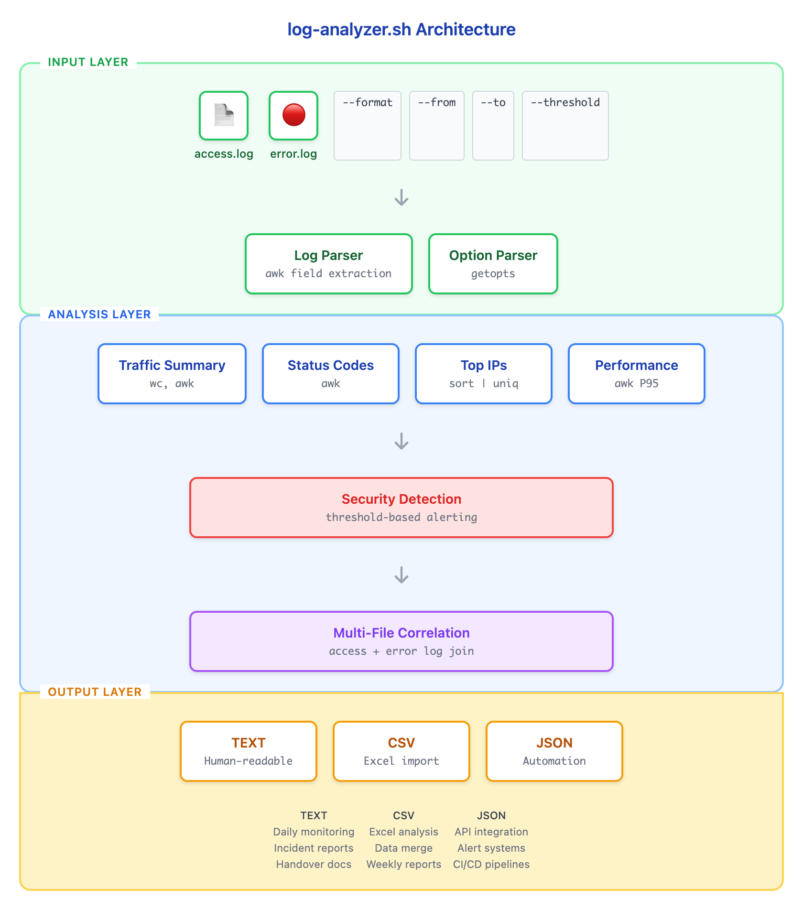

# 10 - 综合项目：日志分析管道

> **目标**：综合运用本课程所有文本处理技能，构建一个完整的日志分析工具  
> **前置**：已完成 [09 - 使用 find 和 xargs 查找文件](../09-find-xargs/)  
> **时间**：⚡ 35 分钟（速读）/ 🔬 150 分钟（完整实操）  
> **实战成果**：可在实际工作中使用的 log-analyzer.sh 脚本  

---

## 先跑起来

> 不要看代码，先体验最终成果！  

```bash
# 创建项目目录
mkdir -p ~/capstone-lab && cd ~/capstone-lab

# 下载示例日志和分析脚本（或使用课程代码）
# GitHub（海外用户）
git clone --filter=blob:none --sparse https://github.com/shiicho/cloud-atlas ~/cloud-atlas 2>/dev/null || true
cd ~/cloud-atlas && git sparse-checkout set foundations/linux/text-processing/10-capstone-pipeline

# Gitee（中国大陆用户）
# git clone --filter=blob:none --sparse https://gitee.com/shiicho/cloud-atlas ~/cloud-atlas
# cd ~/cloud-atlas && git sparse-checkout set foundations/linux/text-processing/10-capstone-pipeline

# 运行分析脚本（人类可读格式）
cd ~/cloud-atlas/foundations/linux/text-processing/10-capstone-pipeline/code
chmod +x log-analyzer.sh
./log-analyzer.sh --format text sample-access.log
```

**预期输出**：

```
======================================
Web Server Log Analysis Report
Generated: 2026-01-04 15:30:00
Log File: sample-access.log
======================================

TRAFFIC SUMMARY
---------------
Total Requests: 500
Unique IPs: 45
Time Range: 2026-01-04 08:00:00 - 2026-01-04 12:59:59

STATUS CODE BREAKDOWN
---------------------
2xx: 420 (84.0%)
3xx: 35 (7.0%)
4xx: 30 (6.0%)
5xx: 15 (3.0%)

TOP 10 IPs
----------
  1. 192.168.1.100    85 requests
  2. 10.0.2.50        72 requests
  3. 172.16.0.25      58 requests
  ...

PERFORMANCE
-----------
Average Response Time: 245ms
P95 Response Time: 890ms
Slowest Request: 5234ms GET /api/heavy-query

SECURITY ALERTS
---------------
[!] Potential attack: 192.168.1.100 - 85 requests (threshold: 50)

======================================
```

现在试试其他输出格式：

```bash
# CSV 格式（导入 Excel）
./log-analyzer.sh --format csv sample-access.log

# JSON 格式（自动化处理）
./log-analyzer.sh --format json sample-access.log | jq .

# 时间范围过滤
./log-analyzer.sh --format text --from "09:00" --to "10:00" sample-access.log

# 多文件关联分析
./log-analyzer.sh --format text --error-log sample-error.log sample-access.log
```

你刚刚运行了一个完整的日志分析工具，它使用了本课程学习的所有技能：
- `grep` 过滤和搜索
- `sed` 数据清洗
- `awk` 字段提取和聚合
- `sort | uniq` 频率统计
- 管道组合

**这就是 Unix 文本处理的威力！** 现在让我们一步步构建它。

---

## 项目目标

### 功能需求

构建一个 `log-analyzer.sh` 脚本，能够：

| 功能 | 描述 | 用到的技能 |
|------|------|------------|
| 解析日志格式 | 处理 Apache/Nginx Combined Log Format | awk 字段提取 |
| 流量统计 | 总请求数、唯一 IP 数 | awk 聚合、sort \| uniq |
| 状态码分析 | 按 2xx/3xx/4xx/5xx 分组统计 | awk 条件判断 |
| Top N IP | 识别最活跃的访问者 | sort -rn \| head |
| 性能分析 | 平均响应时间、P95、最慢请求 | awk 计算、排序 |
| 安全检测 | 检测异常高频访问 | 阈值判断 |
| 时间过滤 | 提取指定时间范围的日志 | awk 时间比较 |
| 多文件关联 | 同时分析 access.log + error.log | 多文件处理 |

### 输出格式

脚本支持三种输出格式：

1. **Text（人类可读）** - 用于日常查看、报告
2. **CSV** - 用于导入 Excel、进一步分析
3. **JSON** - 用于自动化、API 集成

---

## Combined Log Format 解析

### 日志格式说明

Apache/Nginx Combined Log Format 是最常见的 Web 服务器日志格式：

```
192.168.1.100 - tanaka [04/Jan/2026:09:15:30 +0900] "GET /api/users HTTP/1.1" 200 1234 "https://example.com/" "Mozilla/5.0..."
```


<details>
<summary>View ASCII source</summary>

<!-- DIAGRAM: combined-log-format -->
```
字段位置:
$1          $2 $3     $4                        $5    $6        $7     $8   $9    $10        ...
|           |  |      |                         |     |         |      |    |     |
192.168.1.100 - tanaka [04/Jan/2026:09:15:30 +0900] "GET /api/users HTTP/1.1" 200 1234 "referer" "user-agent"
|           |  |      |                         |     |         |      |    |     |
IP          -  用户名  时间戳                    方法   路径      协议   状态码 字节数 来源      浏览器
```
<!-- /DIAGRAM -->

</details>

### 字段提取

```bash
# 创建测试日志
cat > ~/capstone-lab/test.log << 'EOF'
192.168.1.100 - tanaka [04/Jan/2026:09:15:30 +0900] "GET /api/users HTTP/1.1" 200 1234 "https://example.com/" "Mozilla/5.0"
10.0.2.50 - - [04/Jan/2026:09:15:31 +0900] "POST /api/login HTTP/1.1" 401 89 "-" "curl/7.68.0"
172.16.0.25 - admin [04/Jan/2026:09:15:32 +0900] "GET /static/app.js HTTP/1.1" 304 0 "https://example.com/app" "Mozilla/5.0"
EOF

cd ~/capstone-lab

# 提取 IP 地址（$1）
awk '{print $1}' test.log

# 提取时间戳（$4，去掉方括号）
awk '{gsub(/\[|\]/, "", $4); print $4}' test.log

# 提取 HTTP 方法（$6，去掉引号）
awk '{gsub(/"/, "", $6); print $6}' test.log

# 提取状态码（$9）
awk '{print $9}' test.log

# 提取响应字节数（$10）
awk '{print $10}' test.log
```

**关键技巧**：
- `gsub(/\[|\]/, "", $4)` - 去掉方括号
- `gsub(/"/, "", $6)` - 去掉引号
- 字段位置可能因日志格式略有差异，需要先验证

---

## 分步构建

### Step 1: 基础统计

```bash
cd ~/capstone-lab

# 创建脚本骨架
cat > log-analyzer-v1.sh << 'SCRIPT'
#!/bin/bash
# Log Analyzer v1 - Basic Statistics
# 日志分析器 v1 - 基础统计

set -euo pipefail

# 输入验证
log_file="${1:-}"
if [[ -z "$log_file" || ! -f "$log_file" ]]; then
    echo "Usage: $0 <access.log>" >&2
    exit 1
fi

echo "========================================"
echo "Web Server Log Analysis Report"
echo "Generated: $(date '+%Y-%m-%d %H:%M:%S')"
echo "Log File: $log_file"
echo "========================================"
echo ""

# 总请求数
total=$(wc -l < "$log_file")
echo "Total Requests: $total"

# 唯一 IP 数
unique_ips=$(awk '{print $1}' "$log_file" | sort -u | wc -l)
echo "Unique IPs: $unique_ips"
SCRIPT

chmod +x log-analyzer-v1.sh
./log-analyzer-v1.sh test.log
```

### Step 2: 状态码分析

```bash
cat > log-analyzer-v2.sh << 'SCRIPT'
#!/bin/bash
# Log Analyzer v2 - Status Code Analysis
# 日志分析器 v2 - 状态码分析

set -euo pipefail

log_file="${1:-}"
if [[ -z "$log_file" || ! -f "$log_file" ]]; then
    echo "Usage: $0 <access.log>" >&2
    exit 1
fi

total=$(wc -l < "$log_file")

echo "STATUS CODE BREAKDOWN"
echo "---------------------"

# 使用 awk 统计状态码分组
awk '
{
    status = $9
    if (status ~ /^2/) s2xx++
    else if (status ~ /^3/) s3xx++
    else if (status ~ /^4/) s4xx++
    else if (status ~ /^5/) s5xx++
}
END {
    total = s2xx + s3xx + s4xx + s5xx
    if (total > 0) {
        printf "2xx: %d (%.1f%%)\n", s2xx, s2xx*100/total
        printf "3xx: %d (%.1f%%)\n", s3xx, s3xx*100/total
        printf "4xx: %d (%.1f%%)\n", s4xx, s4xx*100/total
        printf "5xx: %d (%.1f%%)\n", s5xx, s5xx*100/total
    }
}
' "$log_file"
SCRIPT

chmod +x log-analyzer-v2.sh
./log-analyzer-v2.sh test.log
```

### Step 3: Top IP 统计

```bash
cat > log-analyzer-v3.sh << 'SCRIPT'
#!/bin/bash
# Log Analyzer v3 - Top IPs
# 日志分析器 v3 - 高频 IP 统计

set -euo pipefail

log_file="${1:-}"
top_n="${2:-10}"

if [[ -z "$log_file" || ! -f "$log_file" ]]; then
    echo "Usage: $0 <access.log> [top_n]" >&2
    exit 1
fi

echo "TOP $top_n IPs"
echo "----------"

# 统计 IP 频率并排序
awk '{count[$1]++} END {for (ip in count) print count[ip], ip}' "$log_file" \
    | sort -rn \
    | head -n "$top_n" \
    | awk '{printf "%3d. %-15s %5d requests\n", NR, $2, $1}'
SCRIPT

chmod +x log-analyzer-v3.sh
./log-analyzer-v3.sh test.log 5
```

### Step 4: 性能分析

对于响应时间分析，我们需要一个包含响应时间的日志格式。假设日志最后一个字段是响应时间（毫秒）：

```bash
# 创建带响应时间的测试日志
cat > ~/capstone-lab/test-perf.log << 'EOF'
192.168.1.100 - - [04/Jan/2026:09:15:30 +0900] "GET /api/users HTTP/1.1" 200 1234 "-" "Mozilla/5.0" 245
10.0.2.50 - - [04/Jan/2026:09:15:31 +0900] "POST /api/login HTTP/1.1" 200 89 "-" "curl/7.68.0" 1523
172.16.0.25 - - [04/Jan/2026:09:15:32 +0900] "GET /static/app.js HTTP/1.1" 200 50000 "-" "Mozilla/5.0" 45
192.168.1.100 - - [04/Jan/2026:09:15:33 +0900] "GET /api/heavy-query HTTP/1.1" 200 89000 "-" "Mozilla/5.0" 5234
EOF

cat > log-analyzer-v4.sh << 'SCRIPT'
#!/bin/bash
# Log Analyzer v4 - Performance Analysis
# 日志分析器 v4 - 性能分析

set -euo pipefail

log_file="${1:-}"

if [[ -z "$log_file" || ! -f "$log_file" ]]; then
    echo "Usage: $0 <access.log>" >&2
    exit 1
fi

echo "PERFORMANCE"
echo "-----------"

# 假设最后一个字段是响应时间（毫秒）
awk '
{
    # 获取响应时间（最后一个字段）
    rt = $NF
    if (rt ~ /^[0-9]+$/) {
        sum += rt
        count++
        times[count] = rt

        # 记录最慢请求
        if (rt > max_rt) {
            max_rt = rt
            max_method = $6
            max_path = $7
            gsub(/"/, "", max_method)
        }
    }
}
END {
    if (count > 0) {
        avg = sum / count
        printf "Average Response Time: %dms\n", avg

        # 计算 P95（需要排序）
        n = asort(times)
        p95_idx = int(n * 0.95)
        if (p95_idx < 1) p95_idx = 1
        printf "P95 Response Time: %dms\n", times[p95_idx]

        printf "Slowest Request: %dms %s %s\n", max_rt, max_method, max_path
    } else {
        print "No response time data available"
    }
}
' "$log_file"
SCRIPT

chmod +x log-analyzer-v4.sh
./log-analyzer-v4.sh test-perf.log
```

### Step 5: 安全检测

```bash
cat > log-analyzer-v5.sh << 'SCRIPT'
#!/bin/bash
# Log Analyzer v5 - Security Detection
# 日志分析器 v5 - 安全检测

set -euo pipefail

log_file="${1:-}"
threshold="${2:-50}"  # 默认阈值：50 请求

if [[ -z "$log_file" || ! -f "$log_file" ]]; then
    echo "Usage: $0 <access.log> [threshold]" >&2
    exit 1
fi

echo "SECURITY ALERTS (threshold: $threshold requests)"
echo "---------------"

# 检测高频访问 IP
awk -v threshold="$threshold" '
{
    count[$1]++
}
END {
    found = 0
    for (ip in count) {
        if (count[ip] >= threshold) {
            printf "[!] Potential attack: %s - %d requests\n", ip, count[ip]
            found = 1
        }
    }
    if (!found) {
        print "No suspicious activity detected"
    }
}
' "$log_file"
SCRIPT

chmod +x log-analyzer-v5.sh
./log-analyzer-v5.sh test.log 2
```

### Step 6: 时间范围过滤

```bash
cat > log-analyzer-v6.sh << 'SCRIPT'
#!/bin/bash
# Log Analyzer v6 - Time Filtering
# 日志分析器 v6 - 时间范围过滤

set -euo pipefail

log_file="${1:-}"
from_time="${2:-00:00:00}"
to_time="${3:-23:59:59}"

if [[ -z "$log_file" || ! -f "$log_file" ]]; then
    echo "Usage: $0 <access.log> [from_time] [to_time]" >&2
    echo "Example: $0 access.log 09:00:00 12:00:00" >&2
    exit 1
fi

echo "Time Range: $from_time - $to_time"
echo ""

# 提取时间并过滤
awk -v from="$from_time" -v to="$to_time" '
{
    # 提取时间部分 [04/Jan/2026:09:15:30 -> 09:15:30
    match($4, /[0-9]{2}:[0-9]{2}:[0-9]{2}/)
    time = substr($4, RSTART, RLENGTH)

    if (time >= from && time <= to) {
        print $0
    }
}
' "$log_file"
SCRIPT

chmod +x log-analyzer-v6.sh
# 只显示 09:15:30 - 09:15:31 之间的日志
./log-analyzer-v6.sh test.log "09:15:30" "09:15:31"
```

### Step 7: 多文件关联

```bash
# 创建 error.log 示例
cat > ~/capstone-lab/test-error.log << 'EOF'
[2026-01-04 09:15:31] [error] [client 10.0.2.50] Authentication failed for user admin
[2026-01-04 09:15:33] [error] [client 192.168.1.100] Database connection timeout
[2026-01-04 09:15:35] [warn] [client 172.16.0.25] Rate limit exceeded
EOF

cat > log-analyzer-v7.sh << 'SCRIPT'
#!/bin/bash
# Log Analyzer v7 - Multi-File Correlation
# 日志分析器 v7 - 多文件关联分析

set -euo pipefail

access_log="${1:-}"
error_log="${2:-}"

if [[ -z "$access_log" || ! -f "$access_log" ]]; then
    echo "Usage: $0 <access.log> [error.log]" >&2
    exit 1
fi

echo "=== Access Log Analysis ==="
# ... (前面的分析代码)

if [[ -n "$error_log" && -f "$error_log" ]]; then
    echo ""
    echo "=== Error Log Correlation ==="

    # 提取 access.log 中的高频 IP
    high_freq_ips=$(awk '{count[$1]++} END {for(ip in count) if(count[ip]>=2) print ip}' "$access_log")

    # 在 error.log 中查找这些 IP
    echo "Errors from high-frequency IPs:"
    for ip in $high_freq_ips; do
        errors=$(grep -c "$ip" "$error_log" 2>/dev/null || echo "0")
        if [[ "$errors" -gt 0 ]]; then
            echo "  $ip: $errors errors"
            grep "$ip" "$error_log" | head -2 | sed 's/^/    /'
        fi
    done
fi
SCRIPT

chmod +x log-analyzer-v7.sh
./log-analyzer-v7.sh test.log test-error.log
```

---

## 完整脚本结构

### 项目文件组织

```
10-capstone-pipeline/
├── README.md                 # 本文档
└── code/
    ├── log-analyzer.sh       # 完整分析脚本
    ├── sample-access.log     # 500 条示例访问日志
    └── sample-error.log      # 示例错误日志
```

### log-analyzer.sh 功能架构



<details>
<summary>View ASCII source</summary>

<!-- DIAGRAM: log-analyzer-architecture -->
```
                          log-analyzer.sh 架构

┌─────────────────────────────────────────────────────────────────────┐
│                         INPUT LAYER                                  │
├─────────────────────────────────────────────────────────────────────┤
│  access.log    error.log     CLI Options                            │
│      │             │         --format, --from, --to, --threshold    │
│      └──────┬──────┘                    │                           │
│             │                           │                           │
│             ▼                           ▼                           │
│  ┌──────────────────┐    ┌─────────────────────────┐               │
│  │  Log Parser      │    │  Option Parser          │               │
│  │  (awk 字段提取)   │    │  (getopts)              │               │
│  └────────┬─────────┘    └───────────┬─────────────┘               │
└───────────┼──────────────────────────┼──────────────────────────────┘
            │                          │
            ▼                          ▼
┌─────────────────────────────────────────────────────────────────────┐
│                       ANALYSIS LAYER                                 │
├─────────────────────────────────────────────────────────────────────┤
│                                                                      │
│  ┌────────────┐  ┌────────────┐  ┌────────────┐  ┌────────────┐    │
│  │  Traffic   │  │  Status    │  │  Top IPs   │  │ Performance│    │
│  │  Summary   │  │  Codes     │  │  Analysis  │  │  Metrics   │    │
│  │  (wc, awk) │  │  (awk)     │  │  (sort)    │  │  (awk)     │    │
│  └─────┬──────┘  └─────┬──────┘  └─────┬──────┘  └─────┬──────┘    │
│        │               │               │               │            │
│  ┌─────┴───────────────┴───────────────┴───────────────┴─────┐     │
│  │                  Security Detection                        │     │
│  │                  (threshold-based alerting)                │     │
│  └─────────────────────────────┬─────────────────────────────┘     │
│                                │                                    │
│  ┌─────────────────────────────┴─────────────────────────────┐     │
│  │              Multi-File Correlation                        │     │
│  │              (access + error log join)                     │     │
│  └─────────────────────────────┬─────────────────────────────┘     │
└────────────────────────────────┼────────────────────────────────────┘
                                 │
                                 ▼
┌─────────────────────────────────────────────────────────────────────┐
│                       OUTPUT LAYER                                   │
├─────────────────────────────────────────────────────────────────────┤
│                                                                      │
│  ┌────────────┐  ┌────────────┐  ┌────────────┐                     │
│  │   TEXT     │  │    CSV     │  │   JSON     │                     │
│  │  (人类可读) │  │  (Excel)   │  │  (自动化)   │                     │
│  └────────────┘  └────────────┘  └────────────┘                     │
│                                                                      │
│  运用场景:                                                           │
│  - 日常监控      - 导入 Excel   - API 集成                          │
│  - 障害対応报告   - 数据分析     - 告警系统                          │
│  - 引継ぎ资料    - 定期报表     - 自动化流水线                       │
│                                                                      │
└─────────────────────────────────────────────────────────────────────┘
```
<!-- /DIAGRAM -->

</details>

---

## 输出格式详解

### Text 格式（人类可读）

```bash
./log-analyzer.sh --format text access.log
```

输出示例见开头的「先跑起来」部分。

### CSV 格式

```bash
./log-analyzer.sh --format csv access.log
```

```csv
metric,value
report_time,2026-01-04 15:30:00
log_file,access.log
total_requests,500
unique_ips,45
status_2xx,420
status_2xx_pct,84.0
status_3xx,35
status_3xx_pct,7.0
status_4xx,30
status_4xx_pct,6.0
status_5xx,15
status_5xx_pct,3.0
avg_response_ms,245
p95_response_ms,890
slowest_request_ms,5234
slowest_request_path,/api/heavy-query
alert_high_freq_ips,1
```

**用途**：
- 导入 Excel 或 Google Sheets 进行进一步分析
- 与其他 CSV 数据合并
- 生成图表和趋势报告

### JSON 格式

```bash
./log-analyzer.sh --format json access.log | jq .
```

```json
{
  "report_time": "2026-01-04 15:30:00",
  "log_file": "access.log",
  "traffic_summary": {
    "total_requests": 500,
    "unique_ips": 45,
    "time_range": {
      "start": "2026-01-04 08:00:00",
      "end": "2026-01-04 12:59:59"
    }
  },
  "status_breakdown": {
    "2xx": {"count": 420, "percentage": 84.0},
    "3xx": {"count": 35, "percentage": 7.0},
    "4xx": {"count": 30, "percentage": 6.0},
    "5xx": {"count": 15, "percentage": 3.0}
  },
  "top_ips": [
    {"ip": "192.168.1.100", "count": 85},
    {"ip": "10.0.2.50", "count": 72},
    {"ip": "172.16.0.25", "count": 58}
  ],
  "performance": {
    "avg_response_ms": 245,
    "p95_response_ms": 890,
    "slowest": {
      "response_ms": 5234,
      "method": "GET",
      "path": "/api/heavy-query"
    }
  },
  "security_alerts": [
    {
      "type": "high_request_rate",
      "ip": "192.168.1.100",
      "count": 85,
      "threshold": 50
    }
  ]
}
```

**用途**：
- 发送到监控系统（Zabbix, Datadog）
- 存储到 Elasticsearch
- 通过 API 提供给其他系统
- 与 `jq` 配合进行命令行处理

---

## 动手练习

### 练习 1：运行完整脚本

```bash
cd ~/cloud-atlas/foundations/linux/text-processing/10-capstone-pipeline/code

# 基本分析
./log-analyzer.sh sample-access.log

# 不同格式输出
./log-analyzer.sh --format csv sample-access.log > report.csv
./log-analyzer.sh --format json sample-access.log > report.json

# 查看生成的文件
cat report.csv
jq . report.json
```

### 练习 2：时间范围分析

```bash
# 分析上午 9-10 点的流量
./log-analyzer.sh --format text --from "09:00" --to "10:00" sample-access.log

# 分析中午时段
./log-analyzer.sh --format text --from "12:00" --to "13:00" sample-access.log
```

### 练习 3：多文件关联

```bash
# 关联 access.log 和 error.log
./log-analyzer.sh --format text --error-log sample-error.log sample-access.log

# 重点关注：
# - 哪些高频 IP 同时出现在 error.log 中？
# - 错误类型是什么？
```

### 练习 4：安全阈值调整

```bash
# 降低阈值，查看更多潜在威胁
./log-analyzer.sh --format text --threshold 20 sample-access.log

# 提高阈值，只关注严重情况
./log-analyzer.sh --format text --threshold 100 sample-access.log
```

### 练习 5：扩展脚本（可选）

尝试添加以下功能：

1. **URL 路径统计** - 最热门的 URL 是什么？
2. **HTTP 方法分析** - GET vs POST 分布
3. **User-Agent 分析** - 浏览器 vs 爬虫
4. **小时流量分布** - 每小时请求数直方图

提示：

```bash
# URL 路径统计
awk '{print $7}' access.log | sort | uniq -c | sort -rn | head -10

# HTTP 方法分析
awk '{gsub(/"/, "", $6); print $6}' access.log | sort | uniq -c | sort -rn

# 小时分布
awk '{
    match($4, /[0-9]{2}:[0-9]{2}:[0-9]{2}/)
    hour = substr($4, RSTART, 2)
    count[hour]++
}
END {
    for (h in count) print h, count[h]
}' access.log | sort -n
```

---

## 职场小贴士

### 日本 IT 运维中的日志分析

| 日语术语 | 含义 | 本课对应功能 |
|----------|------|--------------|
| 運用レポート | 运维报告 | Text/CSV 输出 |
| 障害分析 | 故障分析 | 多文件关联、时间过滤 |
| 日次レポート | 日报 | 定期运行脚本 |
| 週次レポート | 周报 | CSV 汇总分析 |
| アクセス解析 | 访问分析 | Top IP、流量统计 |
| 不正アクセス検知 | 异常访问检测 | 安全告警 |

### 实际工作场景

**场景 1：晨会报告（朝会レポート）**

```bash
# 每天早上 9 点自动生成昨日报告
0 9 * * * /opt/scripts/log-analyzer.sh --format text \
    /var/log/nginx/access.log.1 | mail -s "日次アクセスレポート" team@company.co.jp
```

**场景 2：障害対応（故障响应）**

```bash
# 提取故障时间段的日志
./log-analyzer.sh --format text \
    --from "14:30" --to "15:00" \
    --error-log /var/log/nginx/error.log \
    /var/log/nginx/access.log > incident-2026-01-04.txt

# 导出给外部厂商（需要先匿名化）
# 参考 05-sed-transformation 的匿名化脚本
```

**场景 3：定期监控（定期監視）**

```bash
# JSON 格式输出到监控系统
./log-analyzer.sh --format json /var/log/nginx/access.log \
    | curl -X POST -H "Content-Type: application/json" \
           -d @- http://monitoring-api.internal/logs
```

**场景 4：引継ぎ（交接班）**

```bash
# 生成交接报告
./log-analyzer.sh --format text \
    --from "08:00" --to "17:00" \
    /var/log/nginx/access.log > handover-$(date +%Y%m%d).txt
```

---

## 评估标准

完成项目后，检查以下标准：

### 功能完整性

- [ ] 能正确解析 Combined Log Format
- [ ] 统计总请求数和唯一 IP 数
- [ ] 按状态码分组（2xx/3xx/4xx/5xx）并计算百分比
- [ ] 列出 Top 10 高频 IP
- [ ] 计算平均响应时间和 P95
- [ ] 找出最慢的请求
- [ ] 检测异常高频访问（可配置阈值）
- [ ] 支持时间范围过滤
- [ ] 支持多文件关联分析

### 输出格式

- [ ] Text 格式可读性好，适合人工查看
- [ ] CSV 格式可导入 Excel
- [ ] JSON 格式结构完整，可被程序解析

### 代码质量

- [ ] 脚本有清晰的注释
- [ ] 使用 `set -euo pipefail` 确保错误处理
- [ ] 输入验证（文件存在性检查）
- [ ] 帮助信息完整（`--help`）
- [ ] 边界情况处理（空文件、无匹配）

### 技能运用

- [ ] 正确使用 awk 进行字段提取和聚合
- [ ] 正确使用 sort | uniq 进行频率统计
- [ ] 正确使用管道组合多个命令
- [ ] 理解 grep/sed/awk 的适用场景

---

## 检查清单

完成本项目后，你应该能够：

- [ ] **从零构建** 一个完整的日志分析脚本
- [ ] **灵活运用** grep、sed、awk、sort、uniq 等工具
- [ ] **设计管道** 将多个命令组合成复杂的处理流程
- [ ] **多格式输出** Text/CSV/JSON 满足不同场景需求
- [ ] **时间过滤** 提取指定时间范围的日志
- [ ] **多文件关联** 同时分析多个相关日志
- [ ] **安全检测** 基于阈值检测异常访问
- [ ] **实际应用** 在日本 IT 运维场景中使用这些技能

---

## 延伸阅读

### 课程资源

- [01 - 管道和重定向](../01-pipes-redirection/) - 复习基础
- [06 - awk 字段处理](../06-awk-fields/) - 深入 awk
- [07 - awk 程序和聚合](../07-awk-programs/) - 高级 awk

### 外部资源

- [Apache Log Format](https://httpd.apache.org/docs/current/logs.html)
- [Nginx Log Format](https://nginx.org/en/docs/http/ngx_http_log_module.html)
- [AWK Programming Language](https://www.gnu.org/software/gawk/manual/)
- [jq Manual](https://stedolan.github.io/jq/manual/)

### 下一步

恭喜你完成 **LX03-TEXT 文本处理精通** 课程！

推荐学习路径：
- **LX04-SHELL** - 进阶 Shell 脚本编程
- **LX08-SECURITY** - 安全日志分析
- **LX10-TROUBLESHOOTING** - 系统故障排查（使用你构建的工具！）

---

## 系列导航

| 课程 | 主题 |
|------|------|
| [01 · 管道和重定向](../01-pipes-redirection/) | stdin/stdout/stderr |
| [02 · 查看和流式处理文件](../02-viewing-files/) | cat/less/head/tail |
| [03 · grep 基础](../03-grep-fundamentals/) | 模式搜索 |
| [04 · 正则表达式](../04-regular-expressions/) | BRE/ERE |
| [05 · sed 文本转换](../05-sed-transformation/) | 替换和删除 |
| [06 · awk 字段处理](../06-awk-fields/) | 字段提取 |
| [07 · awk 程序和聚合](../07-awk-programs/) | 数据分析 |
| [08 · 排序、去重和字段提取](../08-sorting-uniqueness/) | sort/uniq/cut |
| [09 · 使用 find 和 xargs 查找文件](../09-find-xargs/) | 文件查找 |
| **10 · 综合项目：日志分析管道** | 当前课程 |

---

<< [09 · find 和 xargs](../09-find-xargs/) | [Home](../) | 课程完成！
