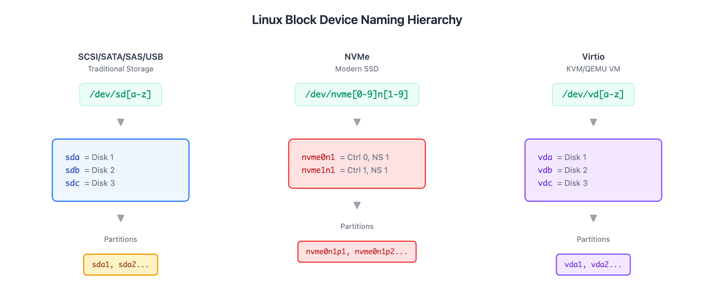
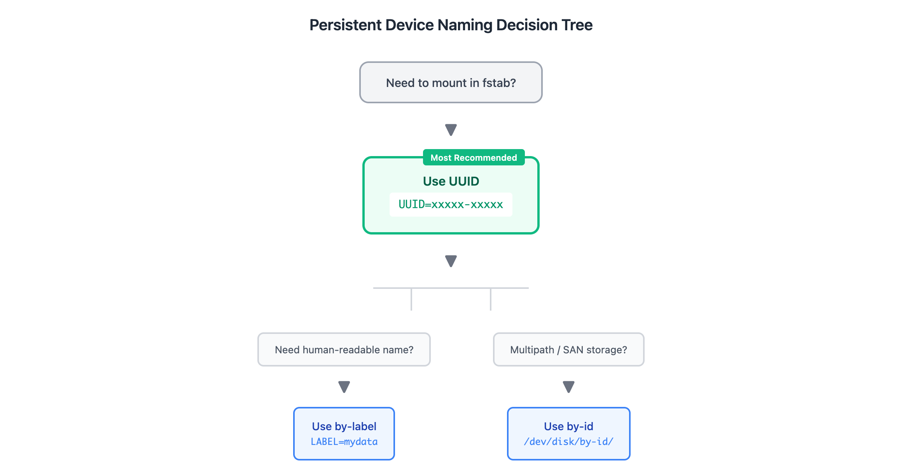

# 01 - 块设备与持久命名（Block Devices and Persistent Naming）

> **目标**：理解 Linux 块设备命名规则，掌握持久设备名的使用  
> **前置**：基础 Linux 命令行操作（cd, ls, cat）  
> **时间**：60-90 分钟  
> **实战场景**：服务器磁盘更换后重启失败的排查与预防  

---

## 将学到的内容

1. 理解 Linux 块设备命名规则（sd*, nvme*, vd*）
2. 使用 lsblk、blkid 查看设备信息
3. 掌握持久设备名（UUID、by-id、by-path）
4. 理解为什么 /dev/sdX 在 fstab 中是危险的

---

## 先跑起来！（10 分钟）

> 先动手查看你的存储，再学习背后的原理。  

打开终端，运行这些命令：

```bash
# 1. 查看所有块设备的树形结构
lsblk

# 2. 查看已挂载分区的使用情况
df -h

# 3. 查看开机自动挂载配置
cat /etc/fstab

# 4. 查看当前挂载的设备
mount | grep -E '^/dev'
```

**观察问题**：
- 你有几个磁盘？分别是什么类型（sd*, nvme*, vd*）？
- `df -h` 和 `lsblk` 的输出有什么不同？
- fstab 中用的是 `/dev/sdX` 还是 `UUID`？

**你刚刚完成了存储探索！**

接下来我们会解释：为什么 fstab 用 UUID 而不是 /dev/sdX。这个问题的答案，关系到服务器能否正常启动。

---

## Step 1 -- 块设备命名规则（15 分钟）

### 1.1 什么是块设备？

块设备（Block Device）是以固定大小的数据块进行读写的设备。最常见的例子就是硬盘、SSD、USB 存储。

```bash
# 查看系统中的块设备
lsblk
```

输出示例：

```
NAME   MAJ:MIN RM   SIZE RO TYPE MOUNTPOINT
sda      8:0    0    40G  0 disk
├─sda1   8:1    0     1G  0 part /boot
└─sda2   8:2    0    39G  0 part /
nvme0n1 259:0   0   100G  0 disk
└─nvme0n1p1 259:1 0  100G  0 part /data
```

### 1.2 命名规则解析



<details>
<summary>View ASCII source</summary>

```
Linux 块设备命名体系

  传统 SCSI/SATA/SAS/USB                 NVMe（现代 SSD）               虚拟化环境
  ─────────────────────                ────────────────              ─────────────
       /dev/sd[a-z]                    /dev/nvme[0-9]n[1-9]          /dev/vd[a-z]
            │                                  │                          │
            ▼                                  ▼                          ▼
   ┌────────────────┐              ┌────────────────────┐       ┌──────────────┐
   │ sda = 第 1 块盘│              │ nvme0n1 = 控制器0  │       │ vda = 第 1 块│
   │ sdb = 第 2 块盘│              │          命名空间1 │       │ vdb = 第 2 块│
   │ sdc = 第 3 块盘│              │ nvme1n1 = 控制器1  │       │ vdc = 第 3 块│
   └───────┬────────┘              │          命名空间1 │       └──────┬───────┘
           │                       └─────────┬──────────┘              │
           ▼                                 ▼                         ▼
       分区编号                          分区编号                   分区编号
     sda1, sda2...                 nvme0n1p1, nvme0n1p2...        vda1, vda2...
```

</details>

### 1.3 三种命名类型

| 类型 | 前缀 | 使用场景 | 示例 |
|------|------|----------|------|
| **SCSI/SATA/SAS/USB** | sd* | 传统硬盘、USB 存储 | sda, sdb, sdc |
| **NVMe** | nvme* | NVMe SSD | nvme0n1, nvme1n1 |
| **Virtio** | vd* | KVM/QEMU 虚拟机 | vda, vdb |

```bash
# 识别设备类型
lsblk -d -o NAME,TYPE,SIZE,MODEL

# 查看更多硬件信息
lsblk -d -o NAME,TRAN,SIZE,MODEL
# TRAN 列显示传输类型：sata, nvme, usb 等
```

### 1.4 分区命名规则

```bash
# SATA/SCSI 分区
sda1   # 第 1 块盘的第 1 个分区
sda2   # 第 1 块盘的第 2 个分区

# NVMe 分区（注意有个 p）
nvme0n1p1   # 控制器 0、命名空间 1 的第 1 个分区
nvme0n1p2   # 控制器 0、命名空间 1 的第 2 个分区

# Virtio 分区
vda1   # 第 1 块虚拟盘的第 1 个分区
```

---

## Step 2 -- 设备名的危险：为什么 /dev/sdX 不可靠（10 分钟）

### 2.1 致命问题：设备名会变！

看这个真实场景：

```
周五：
  sda = 系统盘
  sdb = 数据盘（挂载到 /data）

周一（更换了故障磁盘）：
  sda = 数据盘（原来的 sdb！）
  sdb = 新系统盘
```

**如果 fstab 写的是**：

```
/dev/sdb1  /data  ext4  defaults  0  2
```

**结果**：系统启动失败，因为 sdb1 现在是新磁盘，可能没有分区或者是错误的文件系统！

### 2.2 设备名变化的原因

| 原因 | 说明 |
|------|------|
| 磁盘更换 | 控制器顺序变化 |
| BIOS 设置 | 启动顺序调整 |
| 热插拔 | USB 设备插拔顺序 |
| 内核版本 | 驱动加载顺序变化 |
| 虚拟化 | 虚拟磁盘添加/删除 |

### 2.3 反模式：在 fstab 中使用 /dev/sdX

```bash
# 危险！不要这样做！
/dev/sdb1  /data  ext4  defaults  0  2

# 正确做法：使用 UUID
UUID=a1b2c3d4-e5f6-7890-abcd-ef1234567890  /data  ext4  defaults  0  2
```

> **日本 IT 障害対応**：设备名变化导致的启动失败是常见的运维事故。  
> 正规运维手册会要求使用 UUID 配置 fstab。  

---

## Step 3 -- 持久设备名：UUID 和 /dev/disk/by-* （15 分钟）

### 3.1 查看设备 UUID

```bash
# 方法 1：使用 blkid
sudo blkid

# 输出示例：
/dev/sda1: UUID="abc12345-6789-0def-ghij-klmnopqrstuv" TYPE="ext4"
/dev/sda2: UUID="xyz98765-4321-fedc-ba98-765432109876" TYPE="xfs"

# 方法 2：使用 lsblk -f
lsblk -f

# 方法 3：查看 /dev/disk/by-uuid/ 目录
ls -la /dev/disk/by-uuid/
```

### 3.2 持久命名目录

Linux 在 `/dev/disk/` 下维护了多种持久命名方式：

```bash
# 查看所有持久命名目录
ls /dev/disk/

# 输出：
by-id     by-label  by-partuuid  by-path  by-uuid
```

| 目录 | 基于 | 使用场景 | 稳定性 |
|------|------|----------|--------|
| by-uuid | 文件系统 UUID | fstab 挂载（推荐） | 高 |
| by-id | 硬件序列号 | 多路径存储 | 高 |
| by-path | 物理路径 | 特定插槽设备 | 中 |
| by-label | 文件系统标签 | 人类可读名称 | 中 |
| by-partuuid | 分区 UUID | GPT 分区 | 高 |

### 3.3 实际查看

```bash
# 查看 UUID 符号链接
ls -la /dev/disk/by-uuid/

# 输出示例：
lrwxrwxrwx 1 root root 10 Jan  4 10:00 abc12345-... -> ../../sda1
lrwxrwxrwx 1 root root 10 Jan  4 10:00 xyz98765-... -> ../../sda2

# 查看 ID 符号链接（包含硬件信息）
ls -la /dev/disk/by-id/

# 输出示例：
lrwxrwxrwx 1 root root  9 Jan  4 10:00 ata-Samsung_SSD_860_S3Y9NX0M123456-part1 -> ../../sda1
```

### 3.4 选择哪种持久命名？



<details>
<summary>View ASCII source</summary>

```
选择持久设备名的决策树

                    ┌─────────────────────┐
                    │ 需要挂载到 fstab？   │
                    └──────────┬──────────┘
                               │
                    ┌──────────▼──────────┐
                    │    使用 UUID        │◄─── 最推荐、最常用
                    │ UUID=xxxxx-xxxxx    │
                    └──────────┬──────────┘
                               │
            ┌──────────────────┴──────────────────┐
            │                                      │
   ┌────────▼────────┐                  ┌─────────▼─────────┐
   │ 需要人类可读？   │                  │ 多路径/SAN 存储？  │
   │   用 by-label   │                  │   用 by-id        │
   │  LABEL=mydata   │                  │  /dev/disk/by-id/ │
   └─────────────────┘                  └───────────────────┘
```

</details>

---

## Step 4 -- 动手实验：设备探索（15 分钟）

### 4.1 收集系统存储信息

```bash
# 完整的块设备信息（包含文件系统和 UUID）
lsblk -f

# 输出示例：
NAME   FSTYPE LABEL UUID                                 MOUNTPOINT
sda
├─sda1 ext4         abc12345-6789-0def-ghij-klmnopqrstuv /boot
└─sda2 xfs          xyz98765-4321-fedc-ba98-765432109876 /
```

### 4.2 对比 fstab 配置

```bash
# 查看 fstab
cat /etc/fstab

# 检查是否使用 UUID（正确做法）
grep UUID /etc/fstab

# 检查是否使用 /dev/sdX（危险做法）
grep '/dev/sd' /etc/fstab
```

### 4.3 验证 UUID 映射

```bash
# 获取某个设备的 UUID
blkid /dev/sda1

# 反向验证：UUID 链接到哪个设备
ls -la /dev/disk/by-uuid/ | grep abc12345

# 使用 findfs 查找
findfs UUID=abc12345-6789-0def-ghij-klmnopqrstuv
```

### 4.4 探索其他持久命名

```bash
# 按硬件 ID 查看
ls -la /dev/disk/by-id/

# 按物理路径查看
ls -la /dev/disk/by-path/

# 按标签查看（如果有设置）
ls -la /dev/disk/by-label/
```

---

## 实验环境：Loop 设备（可选）

如果你的系统只有一块磁盘，可以使用 loop 设备模拟多磁盘环境：

```bash
# 创建 3 个虚拟磁盘
for i in 1 2 3; do
  fallocate -l 1G /tmp/disk$i.img
  sudo losetup /dev/loop$i /tmp/disk$i.img
done

# 查看创建的虚拟磁盘
lsblk /dev/loop1 /dev/loop2 /dev/loop3

# 清理（实验结束后）
for i in 1 2 3; do
  sudo losetup -d /dev/loop$i 2>/dev/null
  rm -f /tmp/disk$i.img
done
```

> Loop 设备在后续 LVM 和 RAID 实验中会经常使用。  

---

## 职场小贴士（Japan IT Context）

### 存储管理术语

| 日语术语 | 含义 | 使用场景 |
|----------|------|----------|
| ブロックデバイス | 块设备 | 技术文档 |
| 永続的命名 | 持久命名 | fstab 配置 |
| デバイス名変更 | 设备名变更 | 障害報告 |
| マウント設定 | 挂载配置 | 运维手册 |

### 面试常见问题

**Q: fstab で UUID を使う理由は？**

A: デバイス名（/dev/sdX）は、ディスク交換やBIOS設定変更で変わる可能性があります。UUID は各パーティションに固有なので、デバイス名が変わっても正しくマウントできます。これにより、ディスク交換後の起動障害を防げます。

**Q: blkid と lsblk の違いは？**

A: `blkid` はファイルシステムの UUID やタイプを表示します。`lsblk` はブロックデバイスの階層構造とマウント状態を表示します。両方を組み合わせて使うことが多いです。

### 障害対応のポイント

fstab の設定ミスによる起動障害は、日本の運用現場でよくあるインシデントです：

1. **設定変更前**：必ず `mount -a` でテスト
2. **UUID 確認**：`blkid` で正確な UUID を取得
3. **バックアップ**：fstab 変更前にコピーを取る

---

## 本課小結

| 概念 | コマンド | 記憶ポイント |
|------|----------|--------------|
| 块设备查看 | `lsblk` | 树形结构，TYPE/MOUNTPOINT |
| 设备属性 | `blkid` | UUID、TYPE、LABEL |
| 持久命名 | `/dev/disk/by-*` | by-uuid 最推荐 |
| fstab 安全 | `UUID=xxx` | 永远不用 /dev/sdX |
| 命名类型 | sd*, nvme*, vd* | 对应不同硬件类型 |

**核心理念**：`/dev/sdX` 是动态分配的，会因硬件变化而改变。**永远使用 UUID** 配置 fstab，这是避免启动失败的基本原则。

---

## 检查清单

完成本课后，确认你能够：

- [ ] 使用 `lsblk` 查看块设备树形结构
- [ ] 使用 `blkid` 获取设备 UUID
- [ ] 解释 sd*, nvme*, vd* 三种设备命名的区别
- [ ] 说明为什么 /dev/sdX 在 fstab 中是危险的
- [ ] 列出 /dev/disk/by-* 目录下的持久命名方式
- [ ] 在 fstab 中使用 UUID 而非设备名

---

## 延伸阅读

- [Arch Wiki: Persistent block device naming](https://wiki.archlinux.org/title/Persistent_block_device_naming)
- [Linux man page: blkid](https://man7.org/linux/man-pages/man8/blkid.8.html)
- [Linux man page: lsblk](https://man7.org/linux/man-pages/man8/lsblk.8.html)
- 下一课：[02 - 分区管理](../02-partitioning/) -- 学习 fdisk/gdisk 分区操作
- 相关课程：[04 - 挂载与 fstab](../04-mounting-fstab/) -- fstab 配置详解

---

## 系列导航

[系列首页](../) | [02 - 分区管理 -->](../02-partitioning/)
