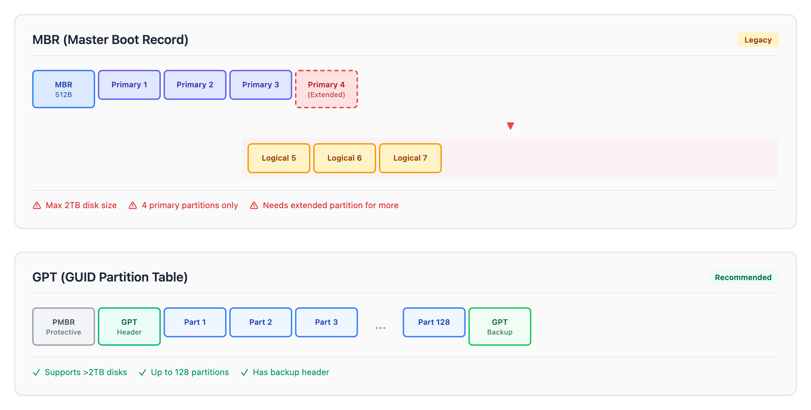

# 02 - 分区管理

> **目标**：掌握 MBR 与 GPT 分区表差异，使用 fdisk/gdisk/sgdisk 进行分区操作  
> **前置**：[01 - 块设备与持久命名](../01-block-devices-naming/)  
> **时间**：⚡ 12 分钟（速读）/ 🔬 45 分钟（完整实操）  
> **环境**：任意 Linux 发行版（需要 root 权限）  

---

## 将学到的内容

1. 理解 MBR 与 GPT 分区表的区别
2. 使用 fdisk 创建 MBR/GPT 分区
3. 使用 gdisk/sgdisk 进行 GPT 分区操作
4. 掌握脚本化分区的自动化方法

---

## Step 1 - 先跑起来：创建虚拟磁盘（5 分钟）

> 在真实磁盘上练习分区太危险了。我们用 loop device 创建安全的实验环境。  

```bash
# 创建 1GB 虚拟磁盘文件
fallocate -l 1G /tmp/disk1.img

# 将文件关联到 loop 设备
sudo losetup /dev/loop1 /tmp/disk1.img

# 确认设备已创建
lsblk /dev/loop1
```

```
NAME  MAJ:MIN RM SIZE RO TYPE MOUNTPOINTS
loop1   7:1    0   1G  0 loop
```

**你刚刚创建了一个虚拟磁盘！** 接下来的所有操作都在这个安全的环境中进行。

> **清理方法**（实验结束后）：  
> ```bash  
> sudo losetup -d /dev/loop1  
> rm /tmp/disk1.img  
> ```  

---

## Step 2 - MBR vs GPT：两种分区表（10 分钟）

### 2.1 分区表是什么？

分区表是磁盘开头的一小块数据，记录了磁盘如何被分割。就像一本书的目录，告诉系统每个分区从哪里开始、到哪里结束。



<details>
<summary>View ASCII source</summary>

```
┌─────────────────────────────────────────────────────────────────────┐
│                        MBR (Master Boot Record)                      │
├─────────────────────────────────────────────────────────────────────┤
│ ┌─────┐ ┌──────────┐ ┌──────────┐ ┌──────────┐ ┌──────────┐        │
│ │ MBR │ │ Primary1 │ │ Primary2 │ │ Primary3 │ │ Primary4 │        │
│ │512B │ │          │ │          │ │          │ │(Extended)│        │
│ └─────┘ └──────────┘ └──────────┘ └──────────┘ └──────────┘        │
│                                                      │              │
│                              ┌───────────────────────┘              │
│                              ▼                                      │
│                    ┌──────────┐ ┌──────────┐ ┌──────────┐          │
│                    │ Logical5 │ │ Logical6 │ │ Logical7 │          │
│                    └──────────┘ └──────────┘ └──────────┘          │
│                                                                     │
│  限制：最大 2TB，4 个主分区，需要扩展分区容纳更多                    │
└─────────────────────────────────────────────────────────────────────┘

┌─────────────────────────────────────────────────────────────────────┐
│                     GPT (GUID Partition Table)                       │
├─────────────────────────────────────────────────────────────────────┤
│ ┌─────┐ ┌─────┐ ┌──────┐ ┌──────┐ ┌──────┐     ┌──────┐ ┌─────┐   │
│ │PMBR │ │GPT  │ │ Part │ │ Part │ │ Part │ ... │ Part │ │GPT  │   │
│ │     │ │Hdr  │ │  1   │ │  2   │ │  3   │     │ 128  │ │Bkup │   │
│ └─────┘ └─────┘ └──────┘ └──────┘ └──────┘     └──────┘ └─────┘   │
│                                                                     │
│  优势：支持 >2TB，最多 128 个分区，有备份头，推荐使用               │
└─────────────────────────────────────────────────────────────────────┘
```

</details>

### 2.2 决策指南

| 场景 | 选择 | 原因 |
|------|------|------|
| UEFI 系统（现代电脑） | **GPT** | UEFI 原生支持，必须用 GPT |
| 磁盘 > 2TB | **GPT** | MBR 无法寻址超过 2TB |
| 新系统、新磁盘 | **GPT** | 现代标准，没有理由用 MBR |
| Legacy BIOS + 旧系统 | MBR | 兼容性考虑 |
| 与 Windows XP 共存 | MBR | 老系统不支持 GPT |

> **简单规则**：除非有特殊兼容性需求，**永远选择 GPT**。  

---

## Step 3 - 使用 fdisk 创建 GPT 分区（15 分钟）

fdisk 是最常用的分区工具。现代版本同时支持 MBR 和 GPT。

### 3.1 查看当前分区表

```bash
sudo fdisk -l /dev/loop1
```

```
Disk /dev/loop1: 1 GiB, 1073741824 bytes, 2097152 sectors
Units: sectors of 1 * 512 = 512 bytes
...
Disklabel type: dos    # 如果是空磁盘，可能没有这行
```

### 3.2 创建 GPT 分区表

```bash
sudo fdisk /dev/loop1
```

进入交互模式后，输入以下命令：

```
Command (m for help): g          # 创建新的 GPT 分区表
Created a new GPT disklabel (GUID: xxxxxxxx-xxxx-xxxx-xxxx-xxxxxxxxxxxx).

Command (m for help): n          # 创建新分区
Partition number (1-128, default 1): 1
First sector (2048-2097118, default 2048): [回车]
Last sector, +/-sectors or +/-size{K,M,G,T,P} (2048-2097118, default 2097118): +500M

Created a new partition 1 of type 'Linux filesystem' and of size 500 MiB.

Command (m for help): n          # 创建第二个分区
Partition number (2-128, default 2): 2
First sector (1026048-2097118, default 1026048): [回车]
Last sector, +/-sectors or +/-size{K,M,G,T,P} (1026048-2097118, default 2097118): [回车]

Created a new partition 2 of type 'Linux filesystem' and of size 523 MiB.

Command (m for help): p          # 打印分区表查看
Disk /dev/loop1: 1 GiB, 1073741824 bytes, 2097152 sectors
Disklabel type: gpt
...
Device        Start     End Sectors  Size Type
/dev/loop1p1   2048 1026047 1024000  500M Linux filesystem
/dev/loop1p2 1026048 2097118 1071071  523M Linux filesystem

Command (m for help): w          # 写入分区表并退出
The partition table has been altered.
```

### 3.3 验证分区

```bash
lsblk /dev/loop1
```

```
NAME      MAJ:MIN RM  SIZE RO TYPE MOUNTPOINTS
loop1       7:1    0    1G  0 loop
├─loop1p1 259:0    0  500M  0 part
└─loop1p2 259:1    0  523M  0 part
```

### 3.4 fdisk 常用命令速查

| 命令 | 作用 |
|------|------|
| `g` | 创建新的 GPT 分区表 |
| `o` | 创建新的 MBR (DOS) 分区表 |
| `n` | 新建分区 |
| `d` | 删除分区 |
| `t` | 更改分区类型 |
| `p` | 打印分区表 |
| `w` | 写入并退出 |
| `q` | 不保存退出 |

---

## Step 4 - 使用 gdisk 进行 GPT 操作（10 分钟）

gdisk 专为 GPT 设计，提供更丰富的 GPT 功能。

### 4.1 为什么用 gdisk？

| 工具 | 优势 | 适用场景 |
|------|------|----------|
| fdisk | 系统自带，通用 | 日常分区操作 |
| gdisk | GPT 专用，功能更全 | 复杂 GPT 操作 |
| sgdisk | gdisk 的脚本版本 | 自动化、批量操作 |

### 4.2 gdisk 交互示例

```bash
# 先重置虚拟磁盘
sudo losetup -d /dev/loop1
fallocate -l 1G /tmp/disk1.img  # 覆盖旧文件
sudo losetup /dev/loop1 /tmp/disk1.img

# 使用 gdisk
sudo gdisk /dev/loop1
```

```
GPT fdisk (gdisk) version 1.0.9

Partition table scan:
  MBR: not present
  BSD: not present
  APM: not present
  GPT: not present

Creating new GPT entries in memory.

Command (? for help): n          # 新建分区
Partition number (1-128, default 1): 1
First sector (34-2097118, default = 2048) or {+-}size{KMGTP}: [回车]
Last sector (2048-2097118, default = 2097118) or {+-}size{KMGTP}: +500M
Current type is 8300 (Linux filesystem)
Hex code or GUID (L to show codes, Enter = 8300): [回车]

Command (? for help): p          # 打印
...
Number  Start (sector)    End (sector)  Size       Code  Name
   1            2048         1026047   500.0 MiB   8300  Linux filesystem

Command (? for help): w          # 写入
Final checks complete. About to write GPT data. THIS WILL OVERWRITE EXISTING
PARTITIONS!!

Do you want to proceed? (Y/N): Y
```

### 4.3 常见分区类型代码

| 代码 | 类型 | 用途 |
|------|------|------|
| 8300 | Linux filesystem | 普通 Linux 分区 |
| 8e00 | Linux LVM | LVM 物理卷 |
| fd00 | Linux RAID | 软件 RAID 成员 |
| ef00 | EFI System | EFI 启动分区 |
| 8200 | Linux swap | 交换分区 |

---

## Step 5 - sgdisk：脚本化分区（10 分钟）

在生产环境中，手动输入命令太慢且容易出错。sgdisk 支持一行命令完成所有操作。

### 5.1 sgdisk 一行创建分区

```bash
# 重置磁盘
sudo losetup -d /dev/loop1 2>/dev/null
fallocate -l 1G /tmp/disk1.img
sudo losetup /dev/loop1 /tmp/disk1.img

# 一行命令：清除 + 创建 GPT + 两个分区
sudo sgdisk -Z \
  -n 1:0:+500M -t 1:8300 -c 1:"Linux Data" \
  -n 2:0:0     -t 2:8e00 -c 2:"LVM PV" \
  /dev/loop1
```

```
Creating new GPT entries in memory.
GPT data structures destroyed! You may now partition the disk using fdisk or
other utilities.
The operation has completed successfully.
```

### 5.2 验证结果

```bash
sudo gdisk -l /dev/loop1
```

```
Number  Start (sector)    End (sector)  Size       Code  Name
   1            2048         1026047   500.0 MiB   8300  Linux Data
   2         1026048         2097118   523.0 MiB   8E00  LVM PV
```

### 5.3 sgdisk 常用参数

| 参数 | 作用 | 示例 |
|------|------|------|
| `-Z` | 清除所有分区数据 | `sgdisk -Z /dev/sdb` |
| `-n` | 新建分区 | `-n 1:0:+500M` (分区号:起始:大小) |
| `-t` | 设置类型 | `-t 1:8300` |
| `-c` | 设置名称 | `-c 1:"Boot"` |
| `-p` | 打印分区表 | `sgdisk -p /dev/sdb` |
| `-d` | 删除分区 | `-d 1` |

### 5.4 自动化脚本示例

```bash
#!/bin/bash
# partition-new-disk.sh - 标准化新磁盘分区
# Usage: ./partition-new-disk.sh /dev/sdX

DISK=$1

if [ -z "$DISK" ]; then
    echo "Usage: $0 /dev/sdX"
    exit 1
fi

echo "Partitioning $DISK with standard layout..."

sgdisk -Z \
    -n 1:0:+512M -t 1:ef00 -c 1:"EFI System" \
    -n 2:0:+1G   -t 2:8300 -c 2:"Boot" \
    -n 3:0:0     -t 3:8e00 -c 3:"LVM" \
    "$DISK"

echo "Partition table:"
sgdisk -p "$DISK"
```

---

## 职场小贴士

> **日本 IT 运维现场**  

在日本企业的サーバ管理（服务器管理）中：

- **変更管理（变更管理）**：分区操作属于高风险变更，需要提前申请和批准
- **手順書（操作手册）**：所有分区操作必须有详细的手順書，包括回退方案
- **本番環境（生产环境）**：绝对不允许在生产服务器上"试一试"
- **検証環境（测试环境）**：所有操作先在测试环境验证

**面试高频问题**：

> Q: MBR と GPT の違いは何ですか？  
>
> A: MBR は最大 2TB、4つのプライマリパーティションという制限があります。GPT は 2TB 以上のディスクをサポートし、最大 128 パーティション作成できます。UEFI システムでは GPT が必須です。  

---

## 检查清单

在继续下一课之前，确认你能：

- [ ] 解释 MBR 和 GPT 的主要区别
- [ ] 使用 loop device 创建安全的实验环境
- [ ] 使用 fdisk 交互式创建 GPT 分区
- [ ] 使用 gdisk 查看和创建 GPT 分区
- [ ] 使用 sgdisk 进行脚本化分区操作
- [ ] 说出至少 3 个常见分区类型代码（8300, 8e00, ef00）

---

## 延伸阅读

- [Arch Wiki - Partitioning](https://wiki.archlinux.org/title/Partitioning)
- [Red Hat - Managing partitions](https://docs.redhat.com/en/documentation/red_hat_enterprise_linux/8/html/managing_storage_devices/getting-started-with-partitions_managing-storage-devices)
- [gdisk Manual](https://www.rodsbooks.com/gdisk/)

---

## 清理实验环境

```bash
# 删除 loop 设备
sudo losetup -d /dev/loop1

# 删除磁盘镜像文件
rm /tmp/disk1.img
```

---

## 系列导航

<- [01 - 块设备与持久命名](../01-block-devices-naming/) | [课程首页](../) | [03 - 文件系统选择与创建 ->](../03-filesystems/)
