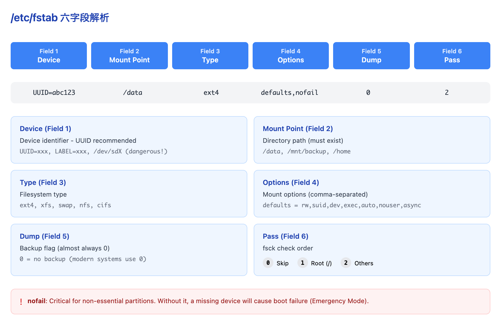

# 04 - 挂载与 fstab

> **目标**：掌握 mount/umount 操作和 fstab 配置，学会从 fstab 故障中恢复  
> **前置**：完成 [03 - 文件系统选择与创建](../03-filesystems/)  
> **时间**：⚡ 15 分钟（速读）/ 🔬 60 分钟（完整实操）  
> **环境**：任意 Linux（Ubuntu/RHEL/AlmaLinux），需要 root 权限  

---

## 将学到的内容

1. 使用 mount/umount 进行手动挂载
2. 理解 fstab 六个字段的含义
3. 掌握 nofail、x-systemd.device-timeout 等关键选项
4. 练习 fstab 错误导致启动失败的恢复

---

## Step 1 - mount/umount 基础操作

### 1.1 临时挂载

挂载（mount）是将文件系统附加到目录树的过程。最简单的挂载：

```bash
# 创建挂载点
sudo mkdir -p /mnt/data

# 挂载分区
sudo mount /dev/sdb1 /mnt/data

# 验证挂载
df -h /mnt/data
mount | grep /mnt/data
```

### 1.2 指定文件系统类型

```bash
# 显式指定类型（推荐）
sudo mount -t ext4 /dev/sdb1 /mnt/data
sudo mount -t xfs /dev/sdb2 /mnt/xfs_data

# 使用 UUID 挂载（最安全）
sudo mount UUID=a1b2c3d4-e5f6-7890-abcd-ef1234567890 /mnt/data
```

### 1.3 卸载文件系统

```bash
# 标准卸载
sudo umount /mnt/data

# 如果提示 "target is busy"
lsof /mnt/data          # 查看谁在使用
fuser -vm /mnt/data     # 显示进程详情
sudo umount -l /mnt/data  # 懒卸载（lazy unmount）
```

> **重要**：`umount` 不是 `unmount`！这是初学者常犯的拼写错误。  

---

## Step 2 - fstab 解剖：六个字段

`/etc/fstab` 是 Linux 最关键的配置文件之一。**一行错误就能让服务器无法启动**。

### 2.1 fstab 结构图



<details>
<summary>View ASCII source</summary>

```
/etc/fstab 六字段解析

 字段1          字段2         字段3    字段4           字段5  字段6
 设备           挂载点        类型     选项            dump   pass
 ─────────────────────────────────────────────────────────────────────────

 UUID=abc123    /data         ext4     defaults,nofail  0      2
      │            │           │            │           │      │
      │            │           │            │           │      └─ fsck 顺序
      │            │           │            │           │         0=跳过 1=根 2=其他
      │            │           │            │           │
      │            │           │            │           └─ dump 备份
      │            │           │            │              0=不备份（现代系统都用0）
      │            │           │            │
      │            │           │            └─ 挂载选项（逗号分隔）
      │            │           │               defaults = rw,suid,dev,exec,auto,nouser,async
      │            │           │               nofail = 设备不存在时不阻塞启动
      │            │           │
      │            │           └─ 文件系统类型
      │            │              ext4, xfs, swap, nfs, cifs...
      │            │
      │            └─ 挂载点目录（必须存在）
      │
      └─ 设备标识（推荐用 UUID）
         UUID=xxx, LABEL=xxx, /dev/sdX (危险!)
```

</details>

### 2.2 字段详解

| 字段 | 名称 | 说明 | 示例 |
|------|------|------|------|
| 1 | 设备 | 推荐 UUID，避免 /dev/sdX | `UUID=abc123-...` |
| 2 | 挂载点 | 目录路径，必须存在 | `/data`, `/mnt/backup` |
| 3 | 类型 | 文件系统类型 | `ext4`, `xfs`, `swap` |
| 4 | 选项 | 挂载参数 | `defaults,nofail` |
| 5 | dump | 备份标志（几乎总是 0） | `0` |
| 6 | pass | fsck 检查顺序 | `0`, `1`, `2` |

### 2.3 pass 字段详解

```bash
# pass 字段的三个值
0  # 不检查（swap、网络文件系统、非关键分区）
1  # 根分区（/）专用，最先检查
2  # 其他本地分区，在根分区后检查
```

---

## Step 3 - 关键选项：nofail 和 x-systemd.device-timeout

### 3.1 nofail：防止启动卡死

**场景**：服务器有一块非关键的数据盘，如果这块盘故障或被拔掉，服务器还能正常启动吗？

```bash
# 危险配置：缺少 nofail
UUID=xxx-xxx  /backup  ext4  defaults  0  2
# 结果：磁盘不存在时，服务器进入 Emergency Mode！

# 安全配置：添加 nofail
UUID=xxx-xxx  /backup  ext4  defaults,nofail  0  2
# 结果：磁盘不存在时，跳过挂载，系统正常启动
```

> **规则**：除了根分区和关键系统分区，其他分区都应该加 `nofail`。  

### 3.2 x-systemd.device-timeout：设备等待超时

当设备存在但响应慢（如网络存储、USB 设备）：

```bash
# 默认等待 90 秒，可能导致启动很慢
UUID=xxx-xxx  /slow_storage  ext4  defaults,nofail  0  2

# 优化：设置 10 秒超时
UUID=xxx-xxx  /slow_storage  ext4  defaults,nofail,x-systemd.device-timeout=10  0  2
```

### 3.3 常用挂载选项速查

| 选项 | 含义 | 使用场景 |
|------|------|----------|
| `defaults` | rw,suid,dev,exec,auto,nouser,async | 标准配置 |
| `nofail` | 设备不存在时继续启动 | 非关键分区 |
| `noauto` | 启动时不自动挂载 | 可移动设备 |
| `ro` | 只读挂载 | 保护数据 |
| `noexec` | 禁止执行二进制 | 安全加固 |
| `nosuid` | 禁止 SUID 位 | 安全加固 |
| `nodev` | 禁止设备文件 | 安全加固 |
| `x-systemd.device-timeout=N` | 设备等待 N 秒 | 慢设备 |

---

## Step 4 - 灾难实验：fstab 故障恢复

> **这是本课最重要的实验！** 在安全环境中练习，以便真正故障时能快速恢复。  

### 4.1 场景：Monday Morning Boot Failure

**症状**：
- 服务器重启后进入 Emergency Mode
- 控制台显示 "Dependency failed for /data"
- 系统提示输入 root 密码

**根因**：fstab 中配置了不存在的 UUID 或语法错误

### 4.2 动手实验：故意破坏 fstab

> **警告**：请在虚拟机或测试环境中进行！  

```bash
# 1. 备份 fstab（非常重要！）
sudo cp /etc/fstab /etc/fstab.backup

# 2. 创建一个会失败的条目
sudo tee -a /etc/fstab << 'EOF'
UUID=00000000-0000-0000-0000-000000000000  /nonexistent  ext4  defaults  0  2
EOF

# 3. 测试配置（不要直接重启！）
sudo mount -a
# 你会看到错误信息

# 4. 现在有两个选择：
#    A) 修复并继续（推荐）
#    B) 重启体验 Emergency Mode（仅在测试环境）
```

### 4.3 Emergency Mode 恢复步骤

如果你选择了重启（或真实故障）：

```bash
# 1. 看到 Emergency Mode 提示，输入 root 密码

# 2. 根文件系统可能是只读的，需要重新挂载为可写
mount -o remount,rw /

# 3. 编辑 fstab，注释或删除错误行
vi /etc/fstab
# 在问题行前加 # 号注释掉

# 4. 保存退出后重启
reboot
```

### 4.4 恢复后验证

```bash
# 确认系统正常启动
systemctl status

# 检查所有挂载点
df -h

# 恢复原始 fstab（如果需要）
sudo cp /etc/fstab.backup /etc/fstab
```

---

## 反模式与正确做法

### 反模式 1：非关键分区缺少 nofail

```bash
# 错误
UUID=xxx-xxx  /backup  ext4  defaults  0  2

# 正确
UUID=xxx-xxx  /backup  ext4  defaults,nofail  0  2
```

**风险**：备份磁盘故障导致整个服务器无法启动

### 反模式 2：修改 fstab 后直接重启

```bash
# 危险操作流程
vim /etc/fstab
reboot              # 直接重启

# 正确操作流程
vim /etc/fstab
mount -a            # 先测试！
echo $?             # 确认返回 0
reboot              # 确认无误后再重启
```

**规则**：**永远先 `mount -a` 测试，再重启！**

### 反模式 3：使用 /dev/sdX 而非 UUID

```bash
# 危险（已在 Lesson 01 详细解释）
/dev/sdb1  /data  ext4  defaults  0  2

# 正确
UUID=a1b2c3d4-...  /data  ext4  defaults  0  2
```

---

## 动手实验：添加新分区到 fstab

```bash
# 1. 获取分区 UUID
sudo blkid /dev/sdb1
# /dev/sdb1: UUID="a1b2c3d4-e5f6-7890-abcd-ef1234567890" TYPE="ext4"

# 2. 创建挂载点
sudo mkdir -p /data

# 3. 添加 fstab 条目
echo 'UUID=a1b2c3d4-e5f6-7890-abcd-ef1234567890  /data  ext4  defaults,nofail  0  2' | sudo tee -a /etc/fstab

# 4. 测试挂载
sudo mount -a

# 5. 验证
df -h /data
mount | grep /data

# 6. 确认无误后，重启验证持久性
sudo reboot
```

---

## 职场小贴士

### 日本 IT 运维场景

**fstab 変更は変更管理が必要**

在日本企业的运维现场，修改 fstab 属于**変更管理**（Change Management）范畴：

1. **変更申請**（Change Request）：提交变更申请
2. **承認**（Approval）：获得主管审批
3. **作業窓口**（Maintenance Window）：在计划的维护窗口执行
4. **復旧手順**（Recovery Procedure）：准备回滚方案

**障害対応のキーポイント**：

| 术语 | 读音 | 含义 |
|------|------|------|
| 起動障害 | きどうしょうがい | 启动故障 |
| 緊急対応 | きんきゅうたいおう | 紧急应对 |
| 復旧手順書 | ふっきゅうてじゅんしょ | 恢复手册 |
| エマージェンシーモード | - | Emergency Mode |

---

## 面试准备

**Q: fstab の設定ミスで起動しなくなった場合、どう対応しますか？**

A: Emergency Mode に入ったら、root パスワードを入力してログインします。`mount -o remount,rw /` でルートを書き込み可能にしてから、`/etc/fstab` を編集して問題のある行をコメントアウトします。保存後、`reboot` で再起動します。

**Q: nofail オプションの目的は何ですか？**

A: デバイスが存在しない場合でもブート処理を続行させるオプションです。バックアップディスクなど非クリティカルなパーティションに使用します。これがないと、ディスク障害時にサーバー全体が起動できなくなります。

**Q: mount -a を実行する意味は？**

A: fstab の設定を再起動なしでテストできます。fstab を変更した後は必ず `mount -a` を実行してエラーがないことを確認してから再起動するのがベストプラクティスです。

---

## 本課小結

| 概念 | コマンド/設定 | 記憶ポイント |
|------|---------------|--------------|
| 手動マウント | `mount -t ext4 UUID=xxx /mnt` | UUID を使用 |
| アンマウント | `umount /mnt` | busy なら lsof 確認 |
| fstab 構造 | 6 フィールド | device, mount, type, options, dump, pass |
| nofail | `defaults,nofail` | 非クリティカル分区必須 |
| 設定テスト | `mount -a` | 再起動前に必ず実行！ |
| Emergency 復旧 | `mount -o remount,rw /` | root パスワード必要 |

**核心理念**：fstab 配置错误是服务器启动失败的常见原因。**Always run `mount -a` before rebooting!**

---

## 检查清单

完成本课后，确认你能够：

- [ ] 使用 `mount` 和 `umount` 进行手动挂载操作
- [ ] 解释 fstab 六个字段的含义
- [ ] 说明 nofail 选项的作用和使用场景
- [ ] 使用 `mount -a` 测试 fstab 配置
- [ ] 从 Emergency Mode 恢复 fstab 故障
- [ ] 正确添加新分区到 fstab（使用 UUID）

---

## 延伸阅读

- [Arch Wiki: fstab](https://wiki.archlinux.org/title/fstab)
- [Red Hat - Mounting File Systems (RHEL 9)](https://docs.redhat.com/en/documentation/red_hat_enterprise_linux/9/html/managing_file_systems/mounting-file-systems_managing-file-systems)
- [systemd.mount man page](https://www.freedesktop.org/software/systemd/man/systemd.mount.html)
- 下一课：[05 - LVM 架构](../05-lvm-architecture/) -- 学习 LVM 三层架构
- 回顾：[01 - 块设备与持久命名](../01-block-devices-naming/) -- UUID 详解

---

## 系列导航

<- [03 - 文件系统选择与创建](../03-filesystems/) | [课程首页](../) | [05 - LVM 架构 ->](../05-lvm-architecture/)
