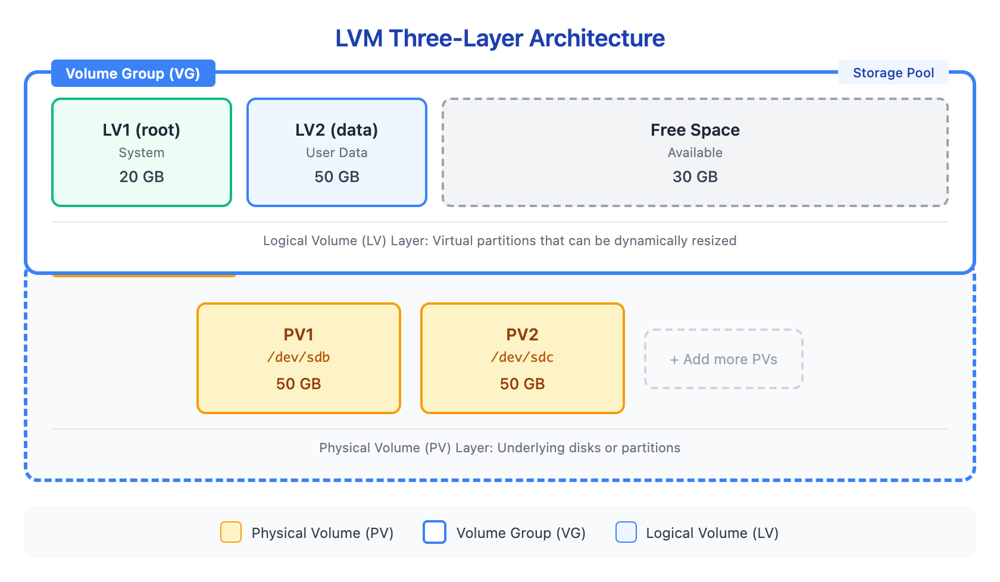

# 05 - LVM 架构

> **目标**：理解 LVM 三层架构（PV -> VG -> LV），掌握状态查看命令  
> **前置**：完成 [04 - 挂载与 fstab](../04-mounting-fstab/)  
> **时间**：⚡ 15 分钟（速读）/ 🔬 50 分钟（完整实操）  
> **环境**：任意 Linux（Ubuntu/RHEL/AlmaLinux），需要 root 权限  

---

## 将学到的内容

1. 理解 LVM 三层架构：PV -> VG -> LV
2. 掌握 PE（Physical Extent）的概念
3. 使用 pvs/vgs/lvs 查看 LVM 状态
4. 理解 LVM 在企业环境中的价值
5. 完成 LVM 创建完整流程：从裸盘到挂载

---

## Step 1 - 传统分区的痛点

在前几课中，你学会了分区和文件系统。但传统分区有个致命问题：

```
传统分区的困境

  周一：规划分区
  ┌─────────────────────────────────────────────────────┐
  │  /dev/sda (100GB)                                    │
  │  ├── sda1 (20GB) -> /          "应该够用了"          │
  │  ├── sda2 (50GB) -> /home      "给用户多点空间"      │
  │  └── sda3 (30GB) -> /var       "日志不会很大吧"      │
  └─────────────────────────────────────────────────────┘

  三个月后：
  ┌─────────────────────────────────────────────────────┐
  │  /dev/sda                                            │
  │  ├── sda1 (20GB) -> /          [已满 98%!]          │
  │  ├── sda2 (50GB) -> /home      [仅用 10%]           │
  │  └── sda3 (30GB) -> /var       [仅用 5%]            │
  └─────────────────────────────────────────────────────┘

  问题：sda1 满了，但 sda2/sda3 有大量空闲空间
  传统方案：备份 -> 删分区 -> 重建分区 -> 恢复数据
  停机时间：可能需要数小时！
```

**LVM 解决了这个问题**：可以动态调整卷大小，无需重建分区。

---

## Step 2 - LVM 三层架构

LVM（Logical Volume Manager）引入了三个抽象层：



<details>
<summary>View ASCII source</summary>

```
LVM 三层架构图

┌─────────────────────────────────────────────────────────────────┐
│                        Volume Group (VG)                         │
│                        卷组 = 存储池                              │
│  ┌─────────────┐  ┌─────────────┐  ┌─────────────────────────┐  │
│  │     LV1     │  │     LV2     │  │      Free Space         │  │
│  │   (root)    │  │   (data)    │  │      (可随时分配)        │  │
│  │   20 GB     │  │   50 GB     │  │        30 GB            │  │
│  └─────────────┘  └─────────────┘  └─────────────────────────┘  │
│                                                                  │
│  逻辑卷 (LV) 层：虚拟分区，可动态扩展/收缩                          │
├──────────────────────────────────────────────────────────────────┤
│                                                                  │
│  ┌──────────────────┐  ┌──────────────────┐                     │
│  │       PV1        │  │       PV2        │   (可继续添加 PV)    │
│  │    /dev/sdb      │  │    /dev/sdc      │                     │
│  │      50 GB       │  │      50 GB       │                     │
│  └──────────────────┘  └──────────────────┘                     │
│                                                                  │
│  物理卷 (PV) 层：底层磁盘或分区                                    │
└──────────────────────────────────────────────────────────────────┘
```

</details>

### 三层概念详解

| 层级 | 名称 | 英文 | 作用 |
|------|------|------|------|
| **底层** | 物理卷 | Physical Volume (PV) | 磁盘或分区，LVM 管理的基础单元 |
| **中层** | 卷组 | Volume Group (VG) | 存储池，汇聚多个 PV 的容量 |
| **顶层** | 逻辑卷 | Logical Volume (LV) | 虚拟分区，可格式化为文件系统使用 |

**类比理解**：

```
物理磁盘世界          LVM 世界
─────────────        ─────────────
原料（木头）    <-->  PV（物理卷）
木材仓库        <-->  VG（卷组）
家具成品        <-->  LV（逻辑卷）

仓库可以持续进货（添加 PV）
家具可以改造加大（扩展 LV）
```

---

## Step 3 - Physical Extent（PE）

VG 内部的分配单元叫做 **PE（Physical Extent）**：

```
PE（Physical Extent）= 存储的"最小单位"

┌───────────────────────────────────────────────────────┐
│                    Volume Group                        │
│  ┌────┬────┬────┬────┬────┬────┬────┬────┬────┬────┐ │
│  │ PE │ PE │ PE │ PE │ PE │ PE │ PE │ PE │ PE │ PE │ │
│  │ 1  │ 2  │ 3  │ 4  │ 5  │ 6  │ 7  │ 8  │ 9  │ 10 │ │
│  └─┬──┴──┬─┴────┴────┴──┬─┴────┴────┴──┬─┴────┴────┘ │
│    │     │              │              │              │
│    │     │              │              └── Free       │
│    │     │              │                             │
│    │     └──────────────┴── LV2 (data)               │
│    │                                                  │
│    └── LV1 (root)                                    │
└───────────────────────────────────────────────────────┘

默认 PE 大小：4 MB
一个 100GB 的 VG 约有 25,600 个 PE
```

**为什么需要了解 PE？**

1. LV 大小必须是 PE 的整数倍
2. PE 大小影响 VG 的最大容量
3. 某些高级操作需要按 PE 数量计算

---

## Step 4 - 查看 LVM 状态

LVM 提供三个核心查看命令，对应三层架构：

### 4.1 查看物理卷（pvs）

```bash
sudo pvs
```

输出示例：

```
  PV         VG        Fmt  Attr PSize   PFree
  /dev/sdb   data_vg   lvm2 a--  <50.00g <10.00g
  /dev/sdc   data_vg   lvm2 a--  <50.00g <50.00g
```

| 列 | 含义 |
|-----|------|
| PV | 物理卷设备路径 |
| VG | 所属卷组 |
| Fmt | 格式（lvm2） |
| PSize | 物理卷大小 |
| PFree | 剩余空间 |

更详细的信息：

```bash
sudo pvdisplay /dev/sdb
```

### 4.2 查看卷组（vgs）

```bash
sudo vgs
```

输出示例：

```
  VG        #PV #LV #SN Attr   VSize   VFree
  data_vg     2   2   0 wz--n- <99.99g <59.99g
```

| 列 | 含义 |
|-----|------|
| VG | 卷组名称 |
| #PV | 包含的物理卷数量 |
| #LV | 逻辑卷数量 |
| #SN | 快照数量 |
| VSize | 卷组总大小 |
| VFree | 卷组剩余空间 |

更详细的信息：

```bash
sudo vgdisplay data_vg
```

### 4.3 查看逻辑卷（lvs）

```bash
sudo lvs
```

输出示例：

```
  LV      VG        Attr       LSize  Pool Origin Data%  Meta%
  root    data_vg   -wi-ao---- 20.00g
  data    data_vg   -wi-ao---- 20.00g
```

| 列 | 含义 |
|-----|------|
| LV | 逻辑卷名称 |
| VG | 所属卷组 |
| Attr | 属性（a=活动, o=已挂载） |
| LSize | 逻辑卷大小 |

更详细的信息：

```bash
sudo lvdisplay /dev/data_vg/root
```

### 4.4 一键查看所有

```bash
# 树形结构显示 LVM
sudo lsblk

# 或者使用 lvs 的扩展输出
sudo lvs -o +devices
```

---

## Step 5 - 动手实验：创建完整 LVM 栈

> **实验目标**：从裸磁盘创建 PV -> VG -> LV -> 格式化 -> 挂载  

### 5.1 准备实验环境（Loop 设备）

```bash
# 创建 2 个 1GB 虚拟磁盘
for i in 1 2; do
  sudo fallocate -l 1G /tmp/disk$i.img
  sudo losetup /dev/loop$i /tmp/disk$i.img
done

# 验证
lsblk /dev/loop1 /dev/loop2
```

### 5.2 创建物理卷（PV）

```bash
# 将 loop 设备初始化为 PV
sudo pvcreate /dev/loop1 /dev/loop2

# 输出：
#   Physical volume "/dev/loop1" successfully created.
#   Physical volume "/dev/loop2" successfully created.

# 验证
sudo pvs
```

### 5.3 创建卷组（VG）

```bash
# 创建卷组，包含两个 PV
sudo vgcreate lab_vg /dev/loop1 /dev/loop2

# 输出：
#   Volume group "lab_vg" successfully created

# 验证
sudo vgs
sudo vgdisplay lab_vg | grep -E "VG Name|VG Size|PE Size|Total PE|Free  PE"
```

注意 PE Size（默认 4.00 MiB）和 Total PE 数量。

### 5.4 创建逻辑卷（LV）

```bash
# 创建 500MB 的逻辑卷
sudo lvcreate -L 500M -n data_lv lab_vg

# 输出：
#   Logical volume "data_lv" created.

# 验证
sudo lvs

# 查看设备路径
ls -la /dev/lab_vg/
```

逻辑卷有两种访问路径：
- `/dev/lab_vg/data_lv`（推荐，符号链接）
- `/dev/mapper/lab_vg-data_lv`（实际设备）

### 5.5 创建文件系统并挂载

```bash
# 格式化为 ext4
sudo mkfs.ext4 /dev/lab_vg/data_lv

# 创建挂载点
sudo mkdir -p /mnt/lvm_data

# 挂载
sudo mount /dev/lab_vg/data_lv /mnt/lvm_data

# 验证
df -h /mnt/lvm_data
lsblk /dev/loop1 /dev/loop2
```

### 5.6 完整流程回顾

```
完成了！从裸盘到可用存储的完整流程：

┌──────────────┐     ┌──────────────┐
│  /dev/loop1  │     │  /dev/loop2  │    裸磁盘
└──────┬───────┘     └──────┬───────┘
       │                    │
       ▼   pvcreate         ▼
┌──────────────┐     ┌──────────────┐
│     PV1      │     │     PV2      │    物理卷
└──────┬───────┘     └──────┬───────┘
       │                    │
       └────────┬───────────┘
                │   vgcreate
                ▼
       ┌────────────────┐
       │    lab_vg      │                 卷组
       │   (2 GB 池)    │
       └───────┬────────┘
               │   lvcreate
               ▼
       ┌────────────────┐
       │   data_lv      │                 逻辑卷
       │    (500 MB)    │
       └───────┬────────┘
               │   mkfs.ext4
               ▼
       ┌────────────────┐
       │    ext4 FS     │                 文件系统
       └───────┬────────┘
               │   mount
               ▼
       ┌────────────────┐
       │  /mnt/lvm_data │                 挂载点
       └────────────────┘
```

### 5.7 清理实验环境

```bash
# 卸载
sudo umount /mnt/lvm_data

# 删除逻辑卷
sudo lvremove /dev/lab_vg/data_lv -y

# 删除卷组
sudo vgremove lab_vg

# 删除物理卷
sudo pvremove /dev/loop1 /dev/loop2

# 释放 loop 设备
for i in 1 2; do
  sudo losetup -d /dev/loop$i
  sudo rm /tmp/disk$i.img
done
```

---

## LVM 在企业环境的价值

### 为什么企业普遍使用 LVM？

| 传统分区 | LVM |
|----------|-----|
| 分区大小固定 | 可动态调整 |
| 添加磁盘需要新挂载点 | 扩展现有 VG 即可 |
| 快照需要额外工具 | 内置快照功能 |
| 迁移数据复杂 | pvmove 在线迁移 |

### 典型企业场景

```
场景 1：容量扩展
  - 运维收到告警：/data 使用率 90%
  - 传统方案：添加新磁盘 -> 新挂载点 -> 迁移数据
  - LVM 方案：添加 PV -> 扩展 VG -> 扩展 LV（在线操作！）

场景 2：存储迁移
  - 需要更换故障磁盘
  - 传统方案：停机备份恢复
  - LVM 方案：添加新盘 -> pvmove 数据 -> 移除旧盘（在线！）

场景 3：配置变更前备份
  - 需要修改数据库配置
  - LVM 方案：快照 -> 修改 -> 出问题就回滚
```

---

## 职场小贴士

### 日本 IT 运维场景

**変更管理（Change Management）**

在日本企业，LVM 操作属于「変更作業」，需要遵循变更管理流程：

| 阶段 | 日语术语 | 内容 |
|------|----------|------|
| 申请 | 変更申請 | 提交变更请求书（LV 扩展多少、理由等） |
| 审批 | 承認 | 上级或变更委员会审批 |
| 计划 | 作業計画 | 详细操作步骤、回滚计划 |
| 执行 | 作業実施 | 在批准的作業窓口执行 |
| 确认 | 完了確認 | 验证变更成功，更新文档 |

> **本番環境での LVM 拡張は必ず事前承認が必要です。**  
> 生产环境的 LVM 扩展必须事先获得批准。  

### 面试常见问题

**Q: LVM の 3 層構造を説明してください。**

A: LVM は PV（物理ボリューム）、VG（ボリュームグループ）、LV（論理ボリューム）の 3 層構造です。PV は物理ディスクやパーティション、VG は複数の PV をまとめたストレージプール、LV は VG から切り出した仮想パーティションです。この構造により、動的なサイズ変更やオンライン拡張が可能になります。

**Q: PE とは何ですか？**

A: Physical Extent の略で、VG 内の割り当て単位です。デフォルトは 4MB で、LV のサイズは PE の倍数になります。PE サイズは VG 作成時に設定でき、大容量 VG では大きな PE サイズが効率的です。

---

## 本课小结

| 概念 | 命令 | 记忆点 |
|------|------|--------|
| 物理卷 (PV) | `pvs`, `pvcreate` | 底层磁盘/分区 |
| 卷组 (VG) | `vgs`, `vgcreate` | 存储池 |
| 逻辑卷 (LV) | `lvs`, `lvcreate` | 虚拟分区 |
| PE | `vgdisplay` | 分配单元，默认 4MB |
| 创建流程 | PV -> VG -> LV -> mkfs -> mount | 从下往上 |

**核心理念**：LVM 将物理存储抽象为逻辑存储，实现了容量的灵活管理。记住三层架构：**PV（原料）-> VG（仓库）-> LV（成品）**。

---

## 下一步

你已经理解了 LVM 架构并创建了第一个 LVM 栈。下一课我们将学习 LVM 日常操作：**扩展、收缩、添加磁盘**——这是运维工作中最常用的 LVM 技能。

-> [06 - LVM 日常操作](../06-lvm-operations/)

---

## 检查清单

完成本课后，确认你能够：

- [ ] 解释 LVM 三层架构（PV -> VG -> LV）
- [ ] 说明 PE（Physical Extent）的作用
- [ ] 使用 `pvs`、`vgs`、`lvs` 查看 LVM 状态
- [ ] 完成从裸盘到挂载的完整 LVM 创建流程
- [ ] 说明 LVM 相比传统分区的优势
- [ ] 理解日本企业変更管理流程对 LVM 操作的要求

---

## 延伸阅读

- [Red Hat - Configuring and Managing Logical Volumes (RHEL 9)](https://docs.redhat.com/en/documentation/red_hat_enterprise_linux/9/html-single/configuring_and_managing_logical_volumes/)
- [Arch Wiki - LVM](https://wiki.archlinux.org/title/LVM)
- [Linux man page - lvm(8)](https://man7.org/linux/man-pages/man8/lvm.8.html)

---

## 系列导航

<- [04 - 挂载与 fstab](../04-mounting-fstab/) | [课程首页](../) | [06 - LVM 日常操作 ->](../06-lvm-operations/)
