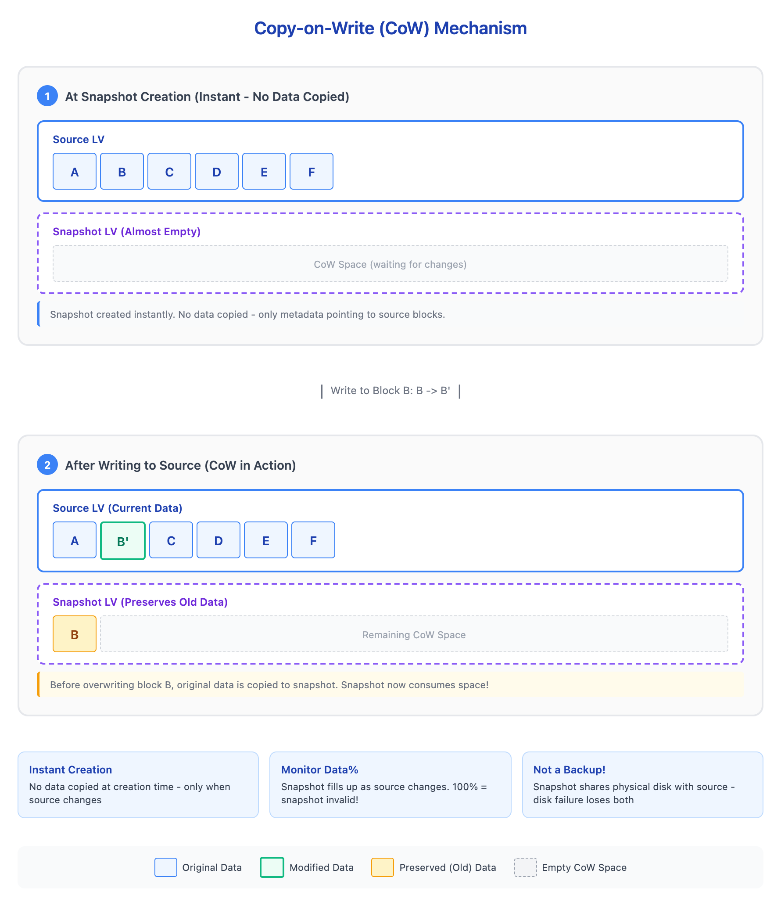

# 07 - LVM 快照（LVM Snapshots）

> **目标**：理解 LVM 快照的 Copy-on-Write 原理，掌握快照创建、监控和回滚  
> **前置**：完成 [06 - LVM 日常操作](../06-lvm-operations/) 课程  
> **时间**：60-90 分钟  
> **灾难场景**：快照空间耗尽，备份中断，源卷 I/O 错误  

---

## 将学到的内容

1. 理解 LVM 快照的 Copy-on-Write 原理
2. 创建和管理 LVM 快照
3. 掌握快照大小计算和监控（Data% 列）
4. 理解快照的限制：**快照不是备份！**

---

## Step 1 -- Copy-on-Write 原理（10 分钟）

### 1.1 快照是什么？

LVM 快照（Snapshot）是源卷在某一时刻的"冻结副本"。但它不是完整复制，而是使用 **Copy-on-Write (CoW)** 机制。

### 1.2 CoW 工作原理



<details>
<summary>View ASCII source</summary>

```
创建快照时：
┌─────────────────────────────────────────────────────────────┐
│                     Source LV (源卷)                         │
│  ┌─────┐ ┌─────┐ ┌─────┐ ┌─────┐ ┌─────┐ ┌─────┐           │
│  │ A   │ │ B   │ │ C   │ │ D   │ │ E   │ │ F   │           │
│  └─────┘ └─────┘ └─────┘ └─────┘ └─────┘ └─────┘           │
└─────────────────────────────────────────────────────────────┘
                            ↓
┌─────────────────────────────────────────────────────────────┐
│               Snapshot LV (快照卷) - 几乎为空                │
│  ┌───────────────────────────────────────────────────────┐  │
│  │           CoW 空间（等待存储变化的数据）              │  │
│  │                     （目前为空）                       │  │
│  └───────────────────────────────────────────────────────┘  │
└─────────────────────────────────────────────────────────────┘

写入 Block B 时（B → B'）：
┌─────────────────────────────────────────────────────────────┐
│                     Source LV (源卷)                         │
│  ┌─────┐ ┌─────┐ ┌─────┐ ┌─────┐ ┌─────┐ ┌─────┐           │
│  │ A   │ │ B'  │ │ C   │ │ D   │ │ E   │ │ F   │  ← 新数据  │
│  └─────┘ └─────┘ └─────┘ └─────┘ └─────┘ └─────┘           │
└─────────────────────────────────────────────────────────────┘
                            ↓
┌─────────────────────────────────────────────────────────────┐
│               Snapshot LV (快照卷) - 保存旧数据              │
│  ┌─────┐ ┌─────────────────────────────────────────────┐   │
│  │ B   │ │         剩余 CoW 空间                        │   │
│  │(旧) │ │                                              │   │
│  └─────┘ └─────────────────────────────────────────────┘   │
└─────────────────────────────────────────────────────────────┘
```

</details>

**关键理解**：
- 创建快照时不复制任何数据（瞬间完成）
- 只有当源卷数据**被修改**时，旧数据才被复制到快照空间
- 快照空间必须足够大，否则会溢出失效

### 1.3 为什么用快照？

| 使用场景 | 说明 |
|----------|------|
| **备份前一致性** | 快照 + rsync，保证备份时数据一致 |
| **测试变更** | 修改前快照，出问题可回滚 |
| **数据库维护** | 停止写入 → 快照 → 恢复写入 → 备份快照 |

---

## Step 2 -- 创建 LVM 快照（15 分钟）

### 2.1 实验环境准备

```bash
# 创建 loop 设备
fallocate -l 2G /tmp/disk1.img
sudo losetup /dev/loop1 /tmp/disk1.img

# 创建 LVM 结构
sudo pvcreate /dev/loop1
sudo vgcreate vg_snap /dev/loop1
sudo lvcreate -L 500M -n lv_data vg_snap
sudo mkfs.ext4 /dev/vg_snap/lv_data

# 挂载并写入测试数据
sudo mkdir -p /mnt/data
sudo mount /dev/vg_snap/lv_data /mnt/data
sudo cp /etc/passwd /mnt/data/
sudo cp /etc/hosts /mnt/data/
echo "original config" | sudo tee /mnt/data/config.txt
```

### 2.2 创建快照

```bash
# 创建快照：-s = snapshot，-L = 快照空间大小
sudo lvcreate -s -L 100M -n snap_data /dev/vg_snap/lv_data
```

参数说明：
- `-s` 或 `--snapshot`：创建快照
- `-L 100M`：快照空间大小（用于存储 CoW 数据）
- `-n snap_data`：快照名称
- `/dev/vg_snap/lv_data`：源卷

### 2.3 验证快照

```bash
# 查看 LV 列表
lvs

# 输出示例：
#   LV        VG      Attr       LSize   Pool Origin  Data%
#   lv_data   vg_snap owi-aos--- 500.00m
#   snap_data vg_snap swi-a-s--- 100.00m      lv_data 0.00
```

关键字段：
- `Origin`：源卷名称
- `Data%`：快照空间使用率（**必须监控！**）
- `Attr`：`s` = snapshot，`o` = origin

---

## Step 3 -- 快照监控：Data% 是关键（10 分钟）

### 3.1 监控命令

```bash
# 基础查看
lvs

# 详细查看快照状态
lvs -o lv_name,origin,lv_size,data_percent,lv_attr
```

### 3.2 Data% 的含义

```
Data%    状态        风险
─────────────────────────────────
0-50%    健康        继续监控
50-80%   警告        考虑扩展或删除快照
80-99%   危险        立即处理
100%     失效！      快照无效，必须删除
```

### 3.3 监控脚本示例

```bash
#!/bin/bash
# 检查所有快照的填充率
lvs --noheadings -o lv_name,data_percent,origin | while read lv pct origin; do
  if [[ -n "$origin" ]]; then
    # 去除百分号比较
    pct_num=${pct%.*}
    if (( pct_num >= 80 )); then
      echo "WARNING: Snapshot $lv at ${pct}% - action required!"
    fi
  fi
done
```

---

## Step 4 -- 快照回滚实验（25 分钟）

这是最实用的快照场景：配置出错后快速恢复。

### 4.1 场景：模拟配置错误

```bash
# 当前状态：正常配置文件
cat /mnt/data/config.txt
# 输出：original config

# 记录快照状态
lvs
# Data% 应该还是 0.00（没有变化发生）

# 模拟"错误的配置修改"
echo "BROKEN CONFIG!!!" | sudo tee /mnt/data/config.txt
sudo rm /mnt/data/passwd

# 检查破坏
cat /mnt/data/config.txt
# 输出：BROKEN CONFIG!!!
ls /mnt/data/
# passwd 文件不见了！
```

### 4.2 检查快照状态

```bash
lvs
# Data% 现在应该 > 0（因为有数据变化被记录）
```

### 4.3 使用快照恢复

**方法 A：合并快照到源卷（回滚）**

```bash
# 卸载源卷
sudo umount /mnt/data

# 合并快照到源卷（回滚到快照时刻）
sudo lvconvert --merge /dev/vg_snap/snap_data

# 重新激活（可能需要）
sudo lvchange -an /dev/vg_snap/lv_data
sudo lvchange -ay /dev/vg_snap/lv_data

# 重新挂载
sudo mount /dev/vg_snap/lv_data /mnt/data

# 验证恢复
cat /mnt/data/config.txt
# 输出：original config（恢复了！）
ls /mnt/data/
# passwd 文件回来了！
```

**注意**：合并后快照会被自动删除。

**方法 B：从快照挂载读取（保留快照）**

```bash
# 挂载快照为只读
sudo mkdir -p /mnt/snap
sudo mount -o ro /dev/vg_snap/snap_data /mnt/snap

# 从快照复制需要的文件
sudo cp /mnt/snap/passwd /mnt/data/

# 完成后卸载
sudo umount /mnt/snap
```

---

## Step 5 -- 灾难实验：快照溢出（20 分钟）

这是生产环境的真实故障场景。

### 5.1 场景设置

```bash
# 创建新的小快照（故意设置太小）
sudo lvcreate -s -L 10M -n snap_small /dev/vg_snap/lv_data

# 检查初始状态
lvs
# snap_small 的 Data% = 0.00
```

### 5.2 填满快照空间

```bash
# 向源卷写入大量数据
sudo dd if=/dev/zero of=/mnt/data/bigfile bs=1M count=50

# 监控快照填充
watch -n 1 'lvs'
# 观察 Data% 快速增长...
# 当达到 100% 时，快照失效！
```

### 5.3 快照溢出后的症状

```bash
# 查看 LV 状态
lvs
# snap_small 显示 100.00，状态变为 "I"(Invalid)

# 尝试挂载快照
sudo mount /dev/vg_snap/snap_small /mnt/snap 2>&1
# mount: /mnt/snap: can't read superblock on /dev/mapper/...
```

### 5.4 诊断和修复

```bash
# 诊断：确认快照失效
lvs -o lv_name,lv_attr,data_percent
# Attr 列中 "I" 表示 Invalid

# 修复：删除失效的快照
sudo lvremove -f /dev/vg_snap/snap_small

# 清理测试文件
sudo rm /mnt/data/bigfile
```

### 5.5 实验教训

| 症状 | 原因 | 解决 |
|------|------|------|
| Backup 卡住 | 快照空间满 | 监控 Data%，及时扩展 |
| 源卷 I/O 错误 | 快照失效 | 删除失效快照 |
| 快照无法挂载 | 已经 Invalid | 删除并重新创建 |

---

## 快照不是备份！

> **Critical Warning**  

快照和源卷在 **同一物理设备** 上：

```
┌─────────────────────────────────────────────────────────────┐
│                    物理磁盘 /dev/sda                         │
│                                                             │
│  ┌───────────────────────────────────────────────────────┐  │
│  │                  Volume Group                          │  │
│  │  ┌─────────────────┐  ┌─────────────────┐             │  │
│  │  │   Source LV     │  │   Snapshot LV   │             │  │
│  │  │   (lv_data)     │  │   (snap_data)   │             │  │
│  │  └─────────────────┘  └─────────────────┘             │  │
│  └───────────────────────────────────────────────────────┘  │
│                                                             │
│  ⚠️ 磁盘故障 = 两者都丢失！                                 │
└─────────────────────────────────────────────────────────────┘
```

**正确做法**：快照 + rsync 到远程存储

```bash
# 正确的备份流程
lvcreate -s -L 1G -n snap_backup /dev/vg/lv_data
mount -o ro /dev/vg/snap_backup /mnt/snap
rsync -av /mnt/snap/ backup-server:/backup/
umount /mnt/snap
lvremove -f /dev/vg/snap_backup
```

---

## Sidebar：Thin Provisioning 概述

> **进阶话题**：Thin Provisioning 允许创建超过实际可用空间的逻辑卷，但需要更严格的监控。  

### 什么是 Thin Provisioning？

| 传统 LVM | Thin LVM |
|----------|----------|
| 分配即占用空间 | 写入时才占用空间 |
| 无法超额分配 | 可以过度分配 |
| 管理简单 | 需要严格监控 |

### 风险提示

- **Thin Pool 满了** = 所有 Thin LV 都会出问题
- 需要配置 `dmeventd` 自动扩展或告警
- 适合有成熟监控体系的环境

### 建议

先掌握传统 LVM 快照，Thin Provisioning 留待你对存储监控有更多经验后再学习。

---

## 职场小贴士（Japan IT Context）

### 运维场景术语

| 日语术语 | 含义 | 场景 |
|----------|------|------|
| スナップショット | 快照 | LVM/VM 快照操作 |
| バックアップ前処理 | 备份前处理 | 创建快照保证一致性 |
| ロールバック | 回滚 | 使用快照恢复 |
| 容量監視 | 容量监控 | Data% 监控 |

### 面试常见问题

**Q: LVM スナップショットと完全バックアップの違いは？**

A: スナップショットはソースボリュームと同じ物理ディスク上に存在するため、ディスク障害時には両方とも失われます。完全バックアップは別のストレージに保存されるため、ディスク障害から保護されます。スナップショットは「バックアップ中の一貫性確保」や「ロールバック用」として使い、それ自体をバックアップとして扱うべきではありません。

**Q: スナップショットが 100% になるとどうなりますか？**

A: スナップショットは無効（Invalid）になり、使用できなくなります。さらに、ソースボリュームの I/O にも影響が出る可能性があります。`lvs` コマンドで `Data%` を監視し、80% を超えたら対処が必要です。

---

## 本课小结

| 操作 | 命令 | 注意点 |
|------|------|--------|
| 创建快照 | `lvcreate -s -L SIZE -n NAME ORIGIN` | 空间要足够 |
| 监控快照 | `lvs` (Data% 列) | 80% 是警告线 |
| 回滚快照 | `lvconvert --merge` | 需要卸载源卷 |
| 删除快照 | `lvremove` | 失效快照必须删除 |

**核心要点**：
1. 快照使用 Copy-on-Write，创建瞬间完成
2. Data% 必须监控，100% = 快照失效
3. **快照不是备份**，两者在同一物理设备

---

## 检查清单

完成本课后，确认你能够：

- [ ] 解释 Copy-on-Write 原理
- [ ] 使用 `lvcreate -s` 创建快照
- [ ] 使用 `lvs` 监控 Data% 填充率
- [ ] 使用 `lvconvert --merge` 回滚快照
- [ ] 解释为什么"快照不是备份"
- [ ] 诊断并处理快照溢出问题

---

## 实验清理

```bash
# 卸载
sudo umount /mnt/data
sudo umount /mnt/snap 2>/dev/null

# 删除 LVM 结构
sudo lvremove -f /dev/vg_snap/lv_data
sudo vgremove vg_snap
sudo pvremove /dev/loop1

# 清理 loop 设备
sudo losetup -d /dev/loop1 2>/dev/null
rm -f /tmp/disk1.img
```

---

## 延伸阅读

- [Red Hat: LVM Snapshot](https://docs.redhat.com/en/documentation/red_hat_enterprise_linux/8/html/configuring_and_managing_logical_volumes/snapshot-of-logical-volumes_configuring-and-managing-logical-volumes)
- [lvcreate man page](https://man7.org/linux/man-pages/man8/lvcreate.8.html)
- [lvconvert man page](https://man7.org/linux/man-pages/man8/lvconvert.8.html)
- 上一课：[06 - LVM 日常操作](../06-lvm-operations/) -- lvextend、vgextend 操作
- 下一课：[08 - RAID 概念](../08-raid-concepts/) -- RAID 级别选择与原理

---

## 系列导航

[<-- 06 - LVM 日常操作](../06-lvm-operations/) | [系列首页](../) | [08 - RAID 概念 -->](../08-raid-concepts/)
