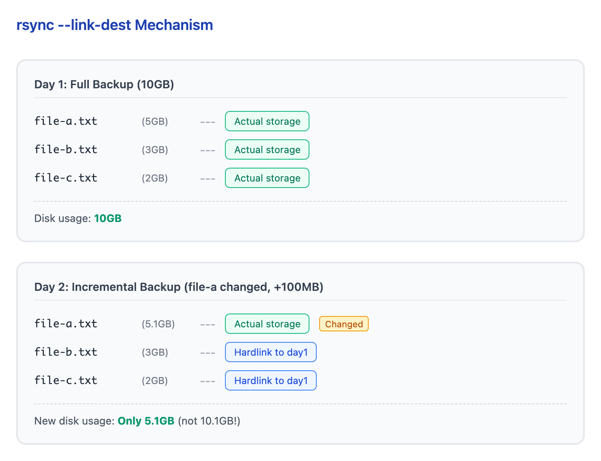
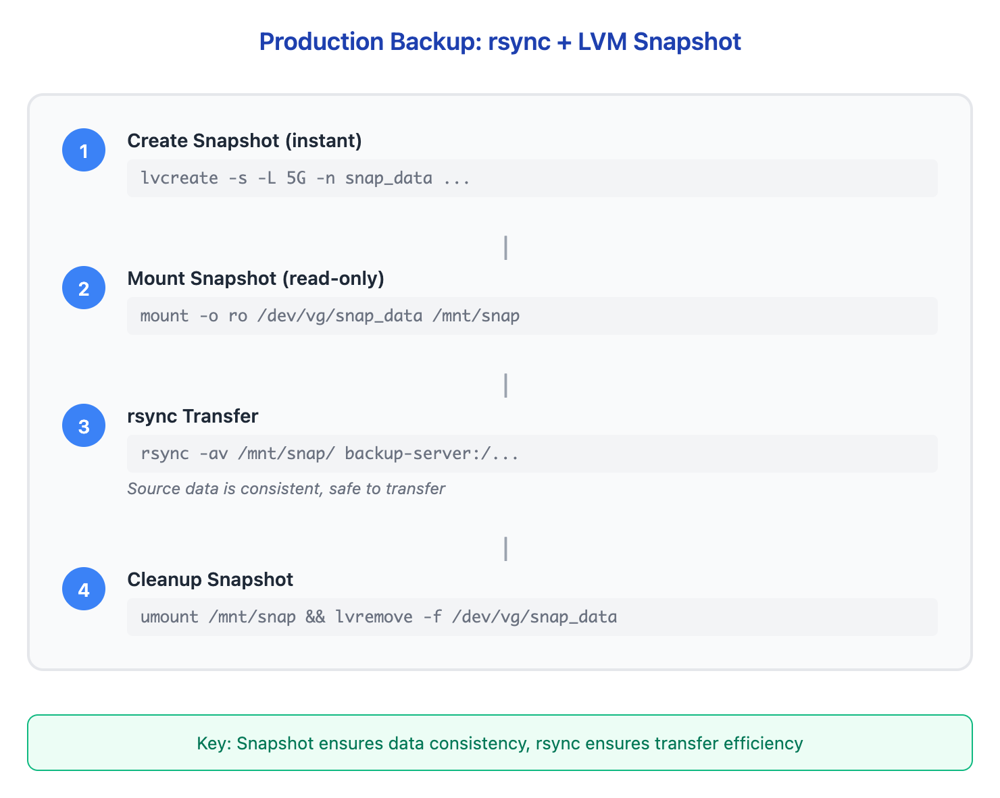

# 10 - 备份策略（Backup with tar and rsync）

> **目标**：掌握 tar 和 rsync 备份工具，理解 3-2-1 备份规则和生产级备份模式  
> **前置**：完成 [07 - LVM 快照](../07-lvm-snapshots/) 和 [09 - mdadm 实战](../09-mdadm-operations/) 课程  
> **时间**：75-90 分钟  
> **实战场景**：凌晨 2 点服务器崩溃，需要从备份恢复关键数据  

---

## 将学到的内容

1. 使用 tar 创建压缩归档（完整备份）
2. 使用 rsync 进行增量同步（只传输变化部分）
3. 掌握 rsync --link-dest 实现空间高效的增量备份
4. 理解 rsync + LVM snapshot 的生产备份模式
5. 理解 3-2-1 备份规则

---

## Step 1 -- tar 基础：打包与压缩（15 分钟）

### 1.1 tar 是什么？

`tar`（Tape Archive）是 Unix/Linux 标准的归档工具。它将多个文件打包成一个文件，可选压缩。

### 1.2 常用选项

| 选项 | 含义 |
|------|------|
| `-c` | Create（创建归档） |
| `-x` | Extract（解压归档） |
| `-v` | Verbose（显示过程） |
| `-f` | File（指定文件名） |
| `-z` | gzip 压缩 |
| `-j` | bzip2 压缩 |
| `-J` | xz 压缩（压缩率最高） |
| `-t` | List（列出内容） |

### 1.3 创建备份

```bash
# 创建测试目录
mkdir -p /tmp/myapp/{config,logs,data}
echo "db_host=localhost" > /tmp/myapp/config/app.conf
echo "2026-01-04 log entry" > /tmp/myapp/logs/app.log
dd if=/dev/urandom of=/tmp/myapp/data/records.db bs=1M count=10 2>/dev/null

# 创建 gzip 压缩归档
tar -czvf /tmp/myapp-backup.tar.gz /tmp/myapp/

# 查看归档内容（不解压）
tar -tzvf /tmp/myapp-backup.tar.gz
```

### 1.4 恢复备份

```bash
# 模拟灾难：删除原目录
rm -rf /tmp/myapp

# 从备份恢复
cd /
tar -xzvf /tmp/myapp-backup.tar.gz

# 验证恢复
ls /tmp/myapp/
cat /tmp/myapp/config/app.conf
```

### 1.5 带日期的备份命名

```bash
# 生产环境常用命名格式
BACKUP_NAME="myapp-$(date +%Y%m%d-%H%M%S).tar.gz"
tar -czvf /tmp/$BACKUP_NAME /tmp/myapp/

# 示例输出：myapp-20260104-143022.tar.gz
```

---

## Step 2 -- rsync 基础：增量同步（20 分钟）

### 2.1 为什么用 rsync？

| 方式 | 首次 10GB | 变化 100MB |
|------|-----------|------------|
| tar 完整备份 | 10GB | 10GB |
| rsync 增量 | 10GB | 100MB |

rsync 只传输**变化的部分**，大幅节省时间和带宽。

### 2.2 基本用法

```bash
# 本地同步
rsync -av /source/ /destination/

# 远程同步
rsync -av /source/ user@server:/backup/

# 带 SSH 的远程同步（默认）
rsync -avz -e ssh /source/ user@server:/backup/
```

### 2.3 常用选项

| 选项 | 含义 |
|------|------|
| `-a` | Archive（保留权限、时间戳等） |
| `-v` | Verbose（显示过程） |
| `-z` | 传输时压缩 |
| `--delete` | 删除目标中源不存在的文件 |
| `--dry-run` | 模拟运行，不实际执行 |
| `-P` | 显示进度 + 断点续传 |

### 2.4 尾部斜杠：关键区别！

这是 rsync 最容易出错的地方：

```bash
# 创建测试环境
mkdir -p /tmp/src/files
touch /tmp/src/files/{a,b,c}.txt
mkdir -p /tmp/dest

# 情况 A：源路径没有斜杠
rsync -av /tmp/src /tmp/dest/
# 结果：/tmp/dest/src/files/...
# src 目录本身被复制

# 情况 B：源路径有斜杠
rsync -av /tmp/src/ /tmp/dest/
# 结果：/tmp/dest/files/...
# src 目录的内容被复制
```

**记忆法**：

```
/src   → 复制 src 这个目录
/src/  → 复制 src 里面的东西
```

### 2.5 --delete 选项

```bash
# 源目录删除了文件
rm /tmp/src/files/b.txt

# 没有 --delete：目标保留已删除的文件
rsync -av /tmp/src/ /tmp/dest/
ls /tmp/dest/files/
# a.txt  b.txt  c.txt （b.txt 还在！）

# 有 --delete：目标同步删除
rsync -av --delete /tmp/src/ /tmp/dest/
ls /tmp/dest/files/
# a.txt  c.txt （b.txt 被删除）
```

> **注意**：`--delete` 是镜像同步必需的，但使用前务必确认方向正确！  

---

## Step 3 -- rsync 增量备份：--link-dest（25 分钟）

### 3.1 什么是 --link-dest？

`--link-dest` 让 rsync 创建硬链接指向未变化的文件，只复制变化的文件。

**结果**：每个备份看起来是完整的，但只占用变化量的空间。

### 3.2 原理图

<!-- DIAGRAM: link-dest-mechanism -->


<details>
<summary>View ASCII source</summary>

```
第 1 天完整备份（10GB）：
┌─────────────────────────────────────────────────────────────┐
│  backup-day1/                                               │
│  ├── file-a.txt  (5GB) ──────── 实际存储                    │
│  ├── file-b.txt  (3GB) ──────── 实际存储                    │
│  └── file-c.txt  (2GB) ──────── 实际存储                    │
│                                                             │
│  磁盘占用：10GB                                              │
└─────────────────────────────────────────────────────────────┘

第 2 天增量备份（file-a 变化，100MB）：
┌─────────────────────────────────────────────────────────────┐
│  backup-day2/                                               │
│  ├── file-a.txt  (5.1GB) ──── 实际存储（变化了）             │
│  ├── file-b.txt  ─────────┬── 硬链接到 day1                 │
│  └── file-c.txt  ─────────┘── 硬链接到 day1                 │
│                                                             │
│  新增磁盘占用：仅 5.1GB（而不是 10.1GB）                     │
└─────────────────────────────────────────────────────────────┘
```

</details>
<!-- /DIAGRAM -->

### 3.3 实战演练

```bash
# 创建测试数据
mkdir -p /tmp/app-data
dd if=/dev/urandom of=/tmp/app-data/big-file.bin bs=1M count=100 2>/dev/null
echo "config v1" > /tmp/app-data/config.txt
echo "data v1" > /tmp/app-data/data.txt

# 第一次完整备份
BACKUP_1="/tmp/backups/$(date +%Y%m%d-001)"
mkdir -p "$BACKUP_1"
rsync -av /tmp/app-data/ "$BACKUP_1/"

# 检查大小
du -sh "$BACKUP_1"
# 约 101M

# 修改一个小文件
echo "config v2 - updated" > /tmp/app-data/config.txt

# 第二次增量备份（使用 --link-dest）
BACKUP_2="/tmp/backups/$(date +%Y%m%d-002)"
rsync -av --link-dest="$BACKUP_1" /tmp/app-data/ "$BACKUP_2/"

# 检查大小
du -sh "$BACKUP_2"
# 约 101M（看起来完整）

# 检查实际磁盘占用
du -sh /tmp/backups/
# 约 102M（而不是 202M！）
```

### 3.4 验证硬链接

```bash
# 检查 inode 号（相同 = 硬链接）
ls -li "$BACKUP_1/big-file.bin"
ls -li "$BACKUP_2/big-file.bin"
# inode 号相同 = 同一个文件

ls -li "$BACKUP_1/config.txt"
ls -li "$BACKUP_2/config.txt"
# inode 号不同 = 独立文件（因为内容变化了）
```

### 3.5 备份脚本模板

```bash
#!/bin/bash
# incremental-backup.sh - 使用 rsync + link-dest 的增量备份

SOURCE="/var/www/app/"
BACKUP_BASE="/backup/app"
DATE=$(date +%Y%m%d-%H%M%S)
BACKUP_DIR="$BACKUP_BASE/$DATE"
LATEST_LINK="$BACKUP_BASE/latest"

# 创建备份目录
mkdir -p "$BACKUP_DIR"

# 找到最新的备份作为 link-dest
if [ -L "$LATEST_LINK" ]; then
  LINK_DEST="--link-dest=$LATEST_LINK"
else
  LINK_DEST=""
fi

# 执行备份
rsync -av --delete $LINK_DEST "$SOURCE" "$BACKUP_DIR/"

# 更新 latest 链接
rm -f "$LATEST_LINK"
ln -s "$BACKUP_DIR" "$LATEST_LINK"

echo "Backup completed: $BACKUP_DIR"
```

---

## Step 4 -- 生产模式：rsync + LVM Snapshot（25 分钟）

### 4.1 为什么需要快照？

直接 rsync 正在使用的文件可能导致：
- 文件在传输过程中被修改 = **不一致状态**
- 数据库备份可能损坏

**解决方案**：先快照（冻结状态）→ 再 rsync（传输）→ 删除快照

### 4.2 完整流程

<!-- DIAGRAM: rsync-snapshot-workflow -->


<details>
<summary>View ASCII source</summary>

```
┌─────────────────────────────────────────────────────────────┐
│                    生产备份流程                              │
│                                                             │
│  ┌─────────────┐                                            │
│  │ 1. 创建快照  │  lvcreate -s -L 5G -n snap_data ...       │
│  │    (瞬间)    │                                           │
│  └──────┬──────┘                                            │
│         │                                                   │
│         ▼                                                   │
│  ┌─────────────┐                                            │
│  │ 2. 挂载快照  │  mount -o ro /dev/vg/snap_data /mnt/snap  │
│  │   (只读)     │                                           │
│  └──────┬──────┘                                            │
│         │                                                   │
│         ▼                                                   │
│  ┌─────────────┐                                            │
│  │ 3. rsync    │  rsync -av /mnt/snap/ backup-server:/...   │
│  │   传输数据   │  （源数据一致，可安全传输）                 │
│  └──────┬──────┘                                            │
│         │                                                   │
│         ▼                                                   │
│  ┌─────────────┐                                            │
│  │ 4. 清理快照  │  umount /mnt/snap                         │
│  │             │  lvremove -f /dev/vg/snap_data             │
│  └─────────────┘                                            │
│                                                             │
│  关键点：快照保证数据一致性，rsync 保证传输效率              │
└─────────────────────────────────────────────────────────────┘
```

</details>
<!-- /DIAGRAM -->

### 4.3 实战脚本

```bash
#!/bin/bash
# snapshot-backup.sh - LVM 快照 + rsync 备份

set -e  # 出错即退出

# 配置
LV_PATH="/dev/vg_data/lv_app"
SNAP_NAME="snap_backup"
SNAP_SIZE="5G"
SNAP_MOUNT="/mnt/backup-snap"
BACKUP_SERVER="backup-server:/backup/app/"
DATE=$(date +%Y%m%d-%H%M%S)

echo "=== Starting backup at $(date) ==="

# 1. 创建快照
echo "Creating snapshot..."
lvcreate -s -L "$SNAP_SIZE" -n "$SNAP_NAME" "$LV_PATH"

# 2. 挂载快照（只读）
echo "Mounting snapshot..."
mkdir -p "$SNAP_MOUNT"
mount -o ro "/dev/vg_data/$SNAP_NAME" "$SNAP_MOUNT"

# 3. rsync 传输
echo "Syncing to backup server..."
rsync -avz --delete "$SNAP_MOUNT/" "$BACKUP_SERVER"

# 4. 清理
echo "Cleaning up..."
umount "$SNAP_MOUNT"
lvremove -f "/dev/vg_data/$SNAP_NAME"

echo "=== Backup completed at $(date) ==="
```

### 4.4 快照大小估算

快照大小取决于备份期间源卷的变化量：

| 场景 | 变化率 | 建议快照大小 |
|------|--------|--------------|
| 静态网站 | 很低 | 源卷 5-10% |
| 普通应用 | 中等 | 源卷 10-20% |
| 活跃数据库 | 高 | 源卷 20-30% |

> **重要**：监控 `lvs` 的 Data% 列，确保快照不会溢出。  

---

## Step 5 -- 3-2-1 备份规则（10 分钟）

### 5.1 规则定义

<!-- DIAGRAM: 3-2-1-rule -->


<details>
<summary>View ASCII source</summary>

```
┌─────────────────────────────────────────────────────────────┐
│                     3-2-1 备份规则                           │
│                                                             │
│    ┌─────┐     ┌─────┐     ┌─────┐                         │
│    │  3  │     │  2  │     │  1  │                         │
│    │份副本│     │种介质│     │份异地│                         │
│    └──┬──┘     └──┬──┘     └──┬──┘                         │
│       │           │           │                             │
│       ▼           ▼           ▼                             │
│  ┌─────────┐ ┌─────────┐ ┌─────────┐                       │
│  │ 本地副本 │ │ 本地磁盘 │ │ 云存储   │                       │
│  │ 远程副本 │ │ 磁带/云  │ │ 另一城市 │                       │
│  │ 云端副本 │ │          │ │ 数据中心 │                       │
│  └─────────┘ └─────────┘ └─────────┘                       │
│                                                             │
│  目的：防范各种灾难场景                                       │
│  - 文件误删 → 本地备份恢复                                   │
│  - 磁盘故障 → 另一介质恢复                                   │
│  - 火灾/地震 → 异地备份恢复                                  │
└─────────────────────────────────────────────────────────────┘
```

</details>
<!-- /DIAGRAM -->

### 5.2 实际应用

| 层级 | 实现方式 | 恢复场景 |
|------|----------|----------|
| 本地快照 | LVM Snapshot | 配置错误回滚（分钟级） |
| 本地备份 | rsync 到本地磁盘 | 文件删除（小时级） |
| 远程备份 | rsync 到另一服务器 | 服务器故障（小时级） |
| 异地备份 | S3/Azure Blob | 数据中心灾难（天级） |

### 5.3 RPO 和 RTO

日本 IT 运维中常用的两个关键指标：

| 指标 | 全称 | 含义 | 示例 |
|------|------|------|------|
| **RPO** | Recovery Point Objective | 可接受的数据丢失量 | RPO = 1h → 最多丢 1 小时数据 |
| **RTO** | Recovery Time Objective | 恢复所需时间 | RTO = 4h → 4 小时内恢复服务 |

```
时间线示例：
─────────────────────────────────────────────────────────
  备份1        备份2        故障发生       服务恢复
   │            │            │              │
   ▼            ▼            ▼              ▼
──○────────────○────────────✕──────────────○───────────
  00:00       04:00        05:30         08:30

  RPO = 1.5h（从 04:00 到 05:30 的数据丢失）
  RTO = 3h（从 05:30 到 08:30 恢复服务）
```

---

## 常见错误

### 错误 1：rsync 尾部斜杠混淆

```bash
# 错误：想复制内容，但忘了斜杠
rsync -av /data /backup/
# 结果：/backup/data/...（多了一层目录）

# 正确：
rsync -av /data/ /backup/
# 结果：/backup/...（内容直接放入）
```

### 错误 2：忘记 --delete

```bash
# 场景：源删除了敏感文件
rm /data/secret.txt

# 问题：没有 --delete
rsync -av /data/ /backup/
# /backup/secret.txt 还在！备份里保留了应该删除的文件

# 解决：加上 --delete
rsync -av --delete /data/ /backup/
```

### 错误 3：快照空间不足

```bash
# 问题：备份时间长，快照空间用完
lvs
#  snap_backup   100.00 ← 失效！

# 预防：
# 1. 合理估算快照大小
# 2. 监控 Data%
# 3. 缩短备份时间（增量备份）
```

---

## 职场小贴士（Japan IT Context）

### 运维术语

| 日语术语 | 含义 | 场景 |
|----------|------|------|
| バックアップ運用 | 备份运维 | 日常备份任务管理 |
| フルバックアップ | 完整备份 | tar 或首次 rsync |
| 差分バックアップ | 差分备份 | rsync + link-dest |
| RPO / RTO | 恢复指标 | SLA 文档必备 |
| 障害復旧 | 灾难恢复 | 从备份恢复服务 |

### 运用手順書（操作手册）示例

日本企业的备份操作通常需要详细的手顺书：

```
【バックアップ運用手順書】

1. 目的
   本手順は、xxx システムのデータバックアップ手順を定める。

2. RPO / RTO
   - RPO: 24 時間（日次バックアップ）
   - RTO: 4 時間

3. バックアップ方式
   - 日次：rsync 増分（毎日 02:00）
   - 週次：tar フルバックアップ（日曜 03:00）
   - 月次：テープ保管（毎月 1 日）

4. 手順
   [詳細手順...]

5. 復旧手順
   [復旧手順...]
```

### 面试常见问题

**Q: 3-2-1 ルールを説明してください。**

A: 3-2-1 ルールとは、データ保護のベストプラクティスです。データを 3 つのコピーに保持し、2 種類の異なるメディアに保存し、1 つは物理的に離れた場所に保管します。これにより、ハードウェア障害、人的ミス、災害など様々なリスクから保護できます。

**Q: rsync と tar の使い分けは？**

A: tar は完全なアーカイブ作成に適しており、一つのファイルにまとめて可搬性が高いです。rsync は増量転送に優れ、変更部分のみを転送するため、定期バックアップに最適です。実務では、週次フルバックアップに tar、日次増量バックアップに rsync という組み合わせがよく使われます。

---

## 本课小结

| 工具 | 用途 | 命令示例 |
|------|------|----------|
| tar | 完整备份 | `tar -czvf backup.tar.gz /data/` |
| rsync 基础 | 同步/增量备份 | `rsync -av --delete /src/ /dest/` |
| rsync link-dest | 空间高效增量 | `rsync -av --link-dest=PREV /src/ /dest/` |
| 快照 + rsync | 一致性备份 | 快照 → rsync → 删除快照 |

**核心要点**：

1. rsync 尾部斜杠决定是复制目录还是内容
2. `--delete` 确保目标与源完全镜像
3. `--link-dest` 让每日备份只占增量空间
4. LVM 快照保证备份时数据一致性
5. 3-2-1 规则：3 份、2 介质、1 异地

---

## 检查清单

完成本课后，确认你能够：

- [ ] 使用 `tar` 创建和恢复压缩归档
- [ ] 解释 rsync 尾部斜杠的区别
- [ ] 正确使用 `rsync --delete` 实现镜像同步
- [ ] 使用 `rsync --link-dest` 创建空间高效的增量备份
- [ ] 实现 LVM 快照 + rsync 的生产备份流程
- [ ] 解释 3-2-1 备份规则
- [ ] 解释 RPO 和 RTO 的含义

---

## 实验清理

```bash
# 清理测试数据
rm -rf /tmp/myapp /tmp/myapp-backup.tar.gz
rm -rf /tmp/src /tmp/dest
rm -rf /tmp/app-data /tmp/backups
```

---

## 延伸阅读

- [rsync man page](https://man7.org/linux/man-pages/man1/rsync.1.html)
- [tar man page](https://man7.org/linux/man-pages/man1/tar.1.html)
- [Red Hat: System Backup Guide](https://docs.redhat.com/en/documentation/red_hat_enterprise_linux/8/html/configuring_basic_system_settings/backing-up-and-restoring-data_configuring-basic-system-settings)
- 上一课：[09 - mdadm 实战](../09-mdadm-operations/) -- 软件 RAID 创建与故障恢复
- 下一课：[11 - 文件系统维护](../11-filesystem-maintenance/) -- fsck, xfs_repair 与故障诊断

---

## 系列导航

[<-- 09 - mdadm 实战](../09-mdadm-operations/) | [系列首页](../) | [11 - 文件系统维护 -->](../11-filesystem-maintenance/)
