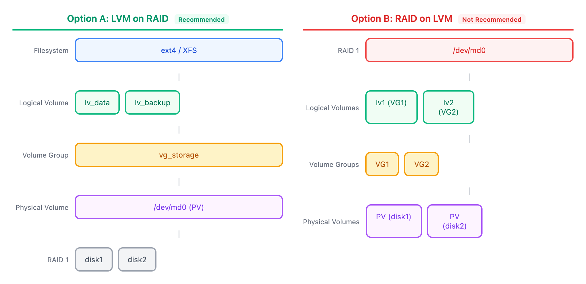

# 12 - 综合项目：弹性存储架构（Capstone: Resilient Storage Architecture）

> **目标**：综合运用全课程知识，设计并实施包含冗余、灵活性和自动化的企业级存储架构  
> **前置**：完成 [01-11 全部课程](../)  
> **时间**：⚡ 40 分钟（速读）/ 🔬 150 分钟（完整实操）  
> **成果**：完整的存储架构设计文档 + 可运行的配置脚本 + 自动化备份和监控  

---

## 将学到的内容

1. 设计包含冗余和灵活性的存储架构
2. 实施 LVM on RAID 方案（生产推荐）
3. 配置自动化备份流程（rsync + cron）
4. 建立存储容量监控和告警

---

## 项目概述

在这个综合项目中，你将扮演一名 Linux 系统管理员，为公司的文件服务器设计和实施存储方案。

**业务需求**：

| 需求 | 说明 |
|------|------|
| **冗余** | 单块磁盘故障不丢数据 |
| **灵活** | 可在线扩展存储空间 |
| **备份** | 每日自动备份到异地 |
| **监控** | 容量告警，提前预警 |

**技术选型**：LVM on RAID（RAID 提供冗余，LVM 提供灵活性）

---

## 架构选择：LVM on RAID vs RAID on LVM

### 两种方案对比

<!-- DIAGRAM: lvm-raid-architectures -->


<details>
<summary>View ASCII source</summary>

```
方案 A：LVM on RAID（推荐）
─────────────────────────────────────────────────────
                    ┌─────────────────────────────────┐
   Filesystem       │        ext4 / XFS              │
                    └────────────────┬────────────────┘
                                     │
                    ┌────────────────┴────────────────┐
   Logical Volume   │  lv_data      │   lv_backup    │
                    └────────────────┬────────────────┘
                                     │
                    ┌────────────────┴────────────────┐
   Volume Group     │           vg_storage            │
                    └────────────────┬────────────────┘
                                     │
                    ┌────────────────┴────────────────┐
   Physical Volume  │         /dev/md0 (PV)           │
                    └────────────────┬────────────────┘
                                     │
                    ┌────────────────┴────────────────┐
   RAID 1           │    loop1    |    loop2         │
                    │    (disk1)  |    (disk2)       │
                    └─────────────────────────────────┘

方案 B：RAID on LVM（不推荐生产使用）
─────────────────────────────────────────────────────
                    ┌─────────────────────────────────┐
   RAID 1           │          /dev/md0              │
                    └────────────────┬────────────────┘
                                     │
                    ┌────────────────┴────────────────┐
   Logical Volumes  │    lv1 (VG1)  |  lv2 (VG2)     │
                    └────────────────┬────────────────┘
                                     │
                    ┌────────────────┴────────────────┐
   Volume Groups    │      VG1      |      VG2       │
                    └────────────────┬────────────────┘
                                     │
                    ┌────────────────┴────────────────┐
   Physical Volumes │   PV (disk1)  |  PV (disk2)    │
                    └─────────────────────────────────┘
```

</details>
<!-- /DIAGRAM -->

### 为什么选择 LVM on RAID？

| 方面 | LVM on RAID | RAID on LVM |
|------|-------------|-------------|
| **管理复杂度** | 低 | 高 |
| **冗余清晰度** | RAID 层统一管理 | 多个 VG 分散管理 |
| **扩展性** | 添加磁盘到 RAID，VG 自动扩展 | 需要分别扩展多个 VG |
| **快照支持** | LVM 快照正常使用 | 快照覆盖所有数据 |
| **生产推荐** | **是** | 否 |

> **结论**：生产环境优先选择 LVM on RAID。本项目采用此方案。  

---

## 实验环境准备

```bash
# 创建 4 个虚拟磁盘（用于 RAID + 热备）
for i in 1 2 3 4; do
  fallocate -l 1G /tmp/disk$i.img
  sudo losetup /dev/loop$i /tmp/disk$i.img
done

# 验证
lsblk /dev/loop{1,2,3,4}

# 创建备份目标目录（模拟远程存储）
sudo mkdir -p /backup
```

---

## Part 1 -- 创建 RAID 阵列（20 分钟）

### 1.1 创建 RAID 1

```bash
# 使用 loop1 和 loop2 创建 RAID 1
sudo mdadm --create /dev/md0 \
  --level=1 \
  --raid-devices=2 \
  /dev/loop1 /dev/loop2

# 确认创建（输入 y）
```

### 1.2 添加 Hot Spare

```bash
# loop3 作为热备盘
sudo mdadm --manage /dev/md0 --add-spare /dev/loop3

# 验证状态
cat /proc/mdstat
sudo mdadm --detail /dev/md0
```

预期输出：
```
md0 : active raid1 loop3[2](S) loop2[1] loop1[0]
      1046528 blocks super 1.2 [2/2] [UU]
```

> **说明**：`(S)` 表示 Spare 状态。  

### 1.3 持久化 RAID 配置

```bash
# 保存 RAID 配置
sudo mdadm --detail --scan | sudo tee -a /etc/mdadm/mdadm.conf

# 查看保存的配置
cat /etc/mdadm/mdadm.conf
```

---

## Part 2 -- 创建 LVM on RAID（25 分钟）

### 2.1 在 RAID 上创建 PV

```bash
# 将 RAID 设备初始化为 LVM 物理卷
sudo pvcreate /dev/md0

# 验证
sudo pvs
```

### 2.2 创建 VG

```bash
# 创建 Volume Group
sudo vgcreate vg_storage /dev/md0

# 验证
sudo vgs
```

### 2.3 创建 LV

```bash
# 创建数据卷（600MB）
sudo lvcreate -L 600M -n lv_data vg_storage

# 创建备份暂存卷（300MB）
sudo lvcreate -L 300M -n lv_staging vg_storage

# 预留空间用于将来扩展
# 验证
sudo lvs
```

预期输出：
```
  LV         VG         Attr       LSize   Pool Origin Data%  Meta%
  lv_data    vg_storage -wi-a----- 600.00m
  lv_staging vg_storage -wi-a----- 300.00m
```

### 2.4 创建文件系统

```bash
# 数据卷使用 ext4（支持收缩）
sudo mkfs.ext4 /dev/vg_storage/lv_data

# 暂存卷使用 XFS（高吞吐量）
sudo mkfs.xfs /dev/vg_storage/lv_staging
```

### 2.5 挂载

```bash
# 创建挂载点
sudo mkdir -p /data /staging

# 挂载
sudo mount /dev/vg_storage/lv_data /data
sudo mount /dev/vg_storage/lv_staging /staging

# 验证
df -h /data /staging
```

---

## Part 3 -- fstab 配置（15 分钟）

### 3.1 获取 UUID

```bash
# 查看 LV 的 UUID
sudo blkid /dev/vg_storage/lv_data
sudo blkid /dev/vg_storage/lv_staging
```

### 3.2 配置 fstab

```bash
# 备份原始 fstab
sudo cp /etc/fstab /etc/fstab.backup

# 添加挂载配置（使用 UUID）
# 格式：UUID=xxx  挂载点  类型  选项  dump  pass
```

**编辑 /etc/fstab，添加以下内容**：

```
# Storage Project - LVM on RAID
# Created: $(date)

# Data volume - ext4, nofail for non-critical
UUID=<lv_data的UUID>    /data      ext4  defaults,nofail  0  2

# Staging volume - XFS, nofail
UUID=<lv_staging的UUID> /staging   xfs   defaults,nofail  0  2
```

**关键选项**：

| 选项 | 作用 |
|------|------|
| `nofail` | 设备不存在时不阻塞启动 |
| `defaults` | rw, suid, dev, exec, auto, nouser, async |
| `0` (dump) | 不需要 dump 备份 |
| `2` (pass) | 非根分区，第二轮 fsck |

### 3.3 验证 fstab

```bash
# 卸载后重新挂载测试
sudo umount /data /staging
sudo mount -a

# 如果没有错误，说明配置正确
df -h /data /staging
```

> **Critical**：**永远不要跳过 `mount -a` 测试！** fstab 错误会导致服务器无法启动。  

---

## Part 4 -- 自动化备份（30 分钟）

### 4.1 备份脚本

创建 `/usr/local/bin/storage-backup.sh`：

```bash
#!/bin/bash
# storage-backup.sh - Automated backup with LVM snapshot
#
# This script:
# 1. Creates LVM snapshot for consistency
# 2. Mounts snapshot read-only
# 3. Syncs to backup destination
# 4. Removes snapshot after completion

set -e

# Configuration
SOURCE_LV="/dev/vg_storage/lv_data"
SNAP_NAME="snap_backup"
SNAP_SIZE="100M"
SNAP_MOUNT="/mnt/snap_backup"
BACKUP_DEST="/backup/data"
LOG_FILE="/var/log/storage-backup.log"

# Logging function
log() {
  echo "$(date '+%Y-%m-%d %H:%M:%S') - $1" | tee -a "$LOG_FILE"
}

# Cleanup function
cleanup() {
  log "Cleaning up..."
  umount "$SNAP_MOUNT" 2>/dev/null || true
  lvremove -f "/dev/vg_storage/$SNAP_NAME" 2>/dev/null || true
}

# Set trap for cleanup
trap cleanup EXIT

# Main backup process
main() {
  log "=== Starting backup ==="

  # Create snapshot
  log "Creating snapshot..."
  lvcreate -s -L "$SNAP_SIZE" -n "$SNAP_NAME" "$SOURCE_LV"

  # Mount snapshot read-only
  log "Mounting snapshot..."
  mkdir -p "$SNAP_MOUNT"
  mount -o ro "/dev/vg_storage/$SNAP_NAME" "$SNAP_MOUNT"

  # Ensure backup destination exists
  mkdir -p "$BACKUP_DEST"

  # Rsync with incremental backup
  log "Starting rsync..."
  rsync -av --delete \
    "$SNAP_MOUNT/" \
    "$BACKUP_DEST/"

  log "=== Backup completed successfully ==="
}

# Run main function
main "$@"
```

### 4.2 设置权限并测试

```bash
# 设置可执行权限
sudo chmod +x /usr/local/bin/storage-backup.sh

# 创建测试数据
sudo mkdir -p /data/projects
echo "Project data v1" | sudo tee /data/projects/readme.txt

# 手动运行测试
sudo /usr/local/bin/storage-backup.sh

# 验证备份
ls -la /backup/data/
cat /backup/data/projects/readme.txt
```

### 4.3 配置 Cron 定时任务

```bash
# 编辑 root 的 crontab
sudo crontab -e
```

添加以下行（每天凌晨 2 点执行）：

```cron
# Storage backup - daily at 2:00 AM
0 2 * * * /usr/local/bin/storage-backup.sh >> /var/log/storage-backup.log 2>&1
```

> **日本 IT 运维实践**：备份窗口（バックアップウィンドウ）通常选择业务低峰期，如凌晨 2-5 点。  

---

## Part 5 -- 容量监控脚本（25 分钟）

### 5.1 监控脚本

创建 `/usr/local/bin/storage-monitor.sh`：

```bash
#!/bin/bash
# storage-monitor.sh - Storage capacity monitoring
#
# Checks:
# 1. Filesystem usage (df)
# 2. Inode usage (df -i)
# 3. LVM snapshot status
# 4. RAID status

# Configuration
WARN_THRESHOLD=80
CRIT_THRESHOLD=90
MAILTO="admin@example.com"

# Output buffer
ALERTS=""

# Check filesystem usage
check_filesystem() {
  echo "=== Filesystem Usage ==="
  df -h /data /staging 2>/dev/null | tail -n +2 | while read fs size used avail pct mount; do
    pct_num=${pct%\%}
    if (( pct_num >= CRIT_THRESHOLD )); then
      ALERTS="${ALERTS}CRITICAL: $mount at ${pct} usage\n"
      echo "CRITICAL: $mount is at ${pct}"
    elif (( pct_num >= WARN_THRESHOLD )); then
      ALERTS="${ALERTS}WARNING: $mount at ${pct} usage\n"
      echo "WARNING: $mount is at ${pct}"
    else
      echo "OK: $mount is at ${pct}"
    fi
  done
}

# Check inode usage
check_inodes() {
  echo ""
  echo "=== Inode Usage ==="
  df -i /data /staging 2>/dev/null | tail -n +2 | while read fs inodes iused ifree ipct mount; do
    pct_num=${ipct%\%}
    if (( pct_num >= CRIT_THRESHOLD )); then
      echo "CRITICAL: $mount inodes at ${ipct}"
    elif (( pct_num >= WARN_THRESHOLD )); then
      echo "WARNING: $mount inodes at ${ipct}"
    else
      echo "OK: $mount inodes at ${ipct}"
    fi
  done
}

# Check LVM snapshots
check_snapshots() {
  echo ""
  echo "=== LVM Snapshots ==="
  lvs --noheadings -o lv_name,data_percent,origin 2>/dev/null | while read lv pct origin; do
    if [[ -n "$origin" ]]; then
      pct_num=${pct%.*}
      if (( pct_num >= 80 )); then
        echo "WARNING: Snapshot $lv at ${pct}% - consider removing"
      else
        echo "OK: Snapshot $lv at ${pct}%"
      fi
    fi
  done
}

# Check RAID status
check_raid() {
  echo ""
  echo "=== RAID Status ==="
  if [[ -f /proc/mdstat ]]; then
    if grep -q '\[U_\]\|\_U\]\|\[_\]' /proc/mdstat; then
      echo "CRITICAL: RAID degraded!"
      cat /proc/mdstat
    else
      echo "OK: RAID healthy"
      grep "^md" /proc/mdstat
    fi
  else
    echo "INFO: No software RAID configured"
  fi
}

# Main
main() {
  echo "Storage Health Check - $(date)"
  echo "================================"
  check_filesystem
  check_inodes
  check_snapshots
  check_raid
  echo ""
  echo "Check completed."
}

main "$@"
```

### 5.2 测试监控脚本

```bash
# 设置权限
sudo chmod +x /usr/local/bin/storage-monitor.sh

# 运行测试
sudo /usr/local/bin/storage-monitor.sh
```

预期输出：
```
Storage Health Check - Sat Jan  4 14:30:00 JST 2026
================================
=== Filesystem Usage ===
OK: /data is at 5%
OK: /staging is at 1%

=== Inode Usage ===
OK: /data inodes at 1%
OK: /staging inodes at 1%

=== LVM Snapshots ===

=== RAID Status ===
OK: RAID healthy
md0 : active raid1 loop3[2](S) loop2[1] loop1[0]

Check completed.
```

### 5.3 配置定时监控

```bash
# 添加到 crontab（每小时检查）
sudo crontab -e
```

添加：
```cron
# Storage monitoring - every hour
0 * * * * /usr/local/bin/storage-monitor.sh >> /var/log/storage-monitor.log 2>&1
```

---

## 设计文档模板

完成实施后，撰写设计文档（設計書）：

```markdown
# 存储架构设计文档
# Storage Architecture Design Document

## 1. 概要（Overview）

| 项目 | 内容 |
|------|------|
| 服务器名 | server-prod-01 |
| 设计日期 | 2026-01-04 |
| 设计者 | [Your Name] |
| 版本 | v1.0 |

## 2. 架构（Architecture）

采用 LVM on RAID 架构：
- RAID 层：RAID 1 (镜像) + 1 Hot Spare
- LVM 层：2 个 Logical Volumes
- 文件系统：ext4 (data), XFS (staging)

## 3. 磁盘配置（Disk Configuration）

| 设备 | 角色 | 容量 |
|------|------|------|
| /dev/sdb | RAID 1 成员 | 1TB |
| /dev/sdc | RAID 1 成员 | 1TB |
| /dev/sdd | Hot Spare | 1TB |

## 4. LVM 配置（LVM Configuration）

| VG | LV | 大小 | 挂载点 | 文件系统 |
|----|----|----|--------|----------|
| vg_storage | lv_data | 600G | /data | ext4 |
| vg_storage | lv_staging | 300G | /staging | XFS |
| (预留) | - | 100G | - | - |

## 5. 备份策略（Backup Strategy）

- 方式：LVM Snapshot + rsync
- 频率：每日 02:00
- 保留：7 天
- 目标：/backup (NFS mount)

## 6. 监控配置（Monitoring）

- 容量告警：80% WARNING, 90% CRITICAL
- RAID 状态：hourly check
- 日志位置：/var/log/storage-*.log

## 7. 恢复手順（Recovery Procedures）

### 7.1 RAID 降级恢复
1. 确认状态：cat /proc/mdstat
2. 识别故障盘：mdadm --detail /dev/md0
3. 移除故障盘：mdadm --fail --remove
4. 更换物理磁盘
5. 添加新盘：mdadm --add
6. 监控重建：watch cat /proc/mdstat

### 7.2 数据恢复
1. 从 /backup 使用 rsync 恢复
2. 如需特定时间点，使用增量备份
```

---

## 职场小贴士（Japan IT Context）

### 设计书（設計書）的重要性

在日本 IT 企业，**設計書**（设计文档）是必须的：

| 文档类型 | 日语 | 用途 |
|----------|------|------|
| 基本設計書 | きほんせっけいしょ | 整体架构 |
| 詳細設計書 | しょうさいせっけいしょ | 具体配置 |
| 運用手順書 | うんようてじゅんしょ | 日常操作 |
| 障害対応手順 | しょうがいたいおうてじゅん | 故障恢复 |

### 面试加分项

**Q: ストレージ設計で重要なポイントは何ですか？**

A: 三つのポイントがあります：

1. **冗長性（Redundancy）**：RAID による耐障害性の確保
2. **拡張性（Scalability）**：LVM によるオンライン拡張の可能性
3. **運用性（Operability）**：監視、バックアップ、復旧手順の整備

特に本番環境では、ホットスペアの設定と自動バックアップの実装が重要です。

---

## 交付物检查清单

完成项目后，确认以下交付物：

### 配置成果

- [ ] RAID 1 阵列创建完成，状态为 [UU]
- [ ] Hot Spare 已配置
- [ ] mdadm.conf 已更新
- [ ] LVM on RAID 创建完成（vg_storage, lv_data, lv_staging）
- [ ] fstab 使用 UUID 配置，包含 nofail
- [ ] mount -a 测试通过

### 自动化脚本

- [ ] `/usr/local/bin/storage-backup.sh` 可执行且测试通过
- [ ] `/usr/local/bin/storage-monitor.sh` 可执行且测试通过
- [ ] Cron 任务已配置（备份 + 监控）

### 文档

- [ ] 存储架构设计文档已完成
- [ ] 包含 RAID、LVM、备份、监控配置
- [ ] 包含恢复手順

---

## 课程完成总结

恭喜！你已完成 Linux 存储管理全部 12 课。

### 技能总览

| 模块 | 掌握技能 |
|------|----------|
| **基础** | 块设备命名、UUID、fstab |
| **分区** | fdisk/gdisk、GPT/MBR |
| **文件系统** | ext4/XFS 选择、mkfs、挂载 |
| **LVM** | PV/VG/LV 创建、扩展、快照 |
| **RAID** | 级别选择、mdadm 操作、降级恢复 |
| **运维** | 备份策略、容量监控、故障处理 |

### 认证对标

| 考试 | 覆盖内容 |
|------|----------|
| **LPIC-2** | 203.1, 203.2, 203.3 (Storage) |
| **RHCSA** | Configure local storage, LVM, filesystems |

---

## 实验清理

```bash
# 卸载文件系统
sudo umount /data /staging

# 删除 LVM 结构
sudo lvremove -f /dev/vg_storage/lv_data
sudo lvremove -f /dev/vg_storage/lv_staging
sudo vgremove vg_storage
sudo pvremove /dev/md0

# 停止 RAID
sudo mdadm --stop /dev/md0
sudo mdadm --zero-superblock /dev/loop{1,2,3,4} 2>/dev/null

# 释放 loop 设备
for i in 1 2 3 4; do
  sudo losetup -d /dev/loop$i 2>/dev/null
done

# 删除模拟磁盘
rm -f /tmp/disk{1,2,3,4}.img

# 删除备份目录
sudo rm -rf /backup

# 删除脚本（可选）
sudo rm -f /usr/local/bin/storage-backup.sh
sudo rm -f /usr/local/bin/storage-monitor.sh
```

---

## 下一步学习

完成存储管理课程后，推荐继续学习：

| 课程 | 内容 | 关联 |
|------|------|------|
| **LX09-PERFORMANCE** | I/O 性能分析 | iostat, iotop, fio |
| **LX10-TROUBLESHOOTING** | 存储故障排查 | 综合诊断技能 |

---

## 延伸阅读

- [Red Hat: LVM Administrator's Guide](https://docs.redhat.com/en/documentation/red_hat_enterprise_linux/8/html-single/configuring_and_managing_logical_volumes/)
- [Arch Wiki: LVM](https://wiki.archlinux.org/title/LVM)
- [Linux RAID Wiki](https://raid.wiki.kernel.org/)
- 上一课：[11 - 文件系统维护](../11-filesystem-maintenance/) -- fsck, xfs_repair, inode 诊断

---

## 系列导航

[<-- 11 - 文件系统维护](../11-filesystem-maintenance/) | [系列首页](../) | **课程完成**
