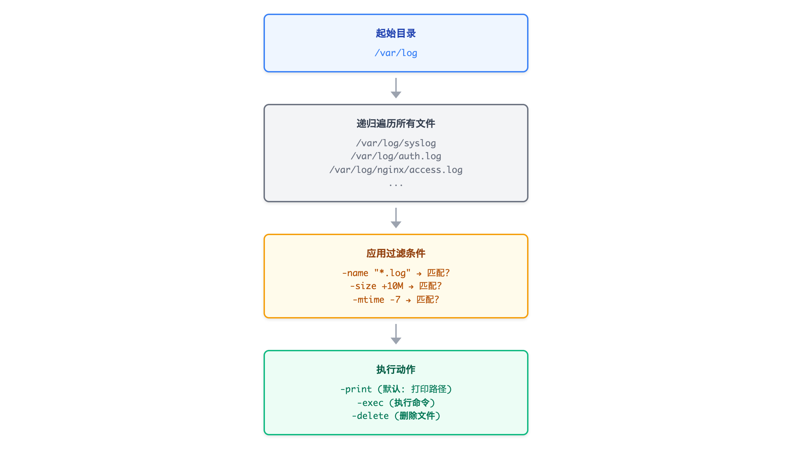
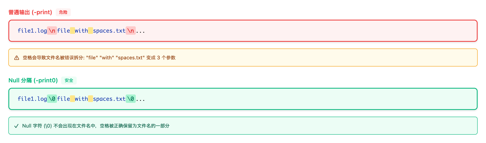

# 09 - 使用 find 和 xargs 查找文件

> **目标**：掌握 find 和 xargs 命令，高效查找文件并批量执行操作
> **前置**：已完成 [08 - 排序、去重和字段提取](../08-sorting-uniqueness/)
> **时间**：105 分钟
> **费用**：无（本地练习）

---

## 将学到的内容

1. 使用 find 按名称、类型、大小、时间查找文件
2. 组合条件：`-a`（与）、`-o`（或）、`!`（非）
3. 对找到的文件执行命令：`-exec {} \;`、`-exec {} +`、`-delete`
4. 使用 xargs 进行高效批量处理：`-I {}`、`-0`、`-P`（并行）、`-n`
5. 安全处理带空格的文件名
6. logrotate 日志轮转基础

---

## Step 1 - 先跑起来（5 分钟）

> 在学习理论之前，先体验 find 和 xargs 的威力！

### 1.1 创建练习环境

```bash
# 创建练习目录
mkdir -p ~/find-lab/{logs,tmp,data} && cd ~/find-lab

# 创建各种测试文件
echo "2026-01-04 ERROR Database timeout" > logs/app.log
echo "2026-01-03 INFO Application started" > logs/app.log.1
echo "old log content" > logs/app.log.2.gz
echo "temporary data" > tmp/cache.tmp
echo "more temp" > tmp/session.tmp
echo "important data" > data/users.csv

# 创建一些大文件（模拟）
dd if=/dev/zero of=logs/large.log bs=1M count=5 2>/dev/null
dd if=/dev/zero of=tmp/huge.tmp bs=1M count=10 2>/dev/null

# 创建带空格的文件名（常见问题来源）
echo "test content" > "tmp/file with spaces.txt"
echo "another test" > "tmp/日志 2026.txt"

# 修改文件时间（模拟旧文件）
touch -d "7 days ago" logs/app.log.2.gz
touch -d "30 days ago" tmp/session.tmp

# 显示目录结构
find . -type f
```

### 1.2 立即体验

```bash
# 找出所有 .log 文件
find . -name "*.log"

# 找出大于 1MB 的文件
find . -size +1M

# 找出最近 24 小时修改的文件
find . -mtime -1

# 找出 7 天前的旧文件
find . -mtime +7

# 找出所有 .tmp 文件并显示大小
find . -name "*.tmp" -exec ls -lh {} \;

# 并行压缩所有 .log 文件（xargs 的威力！）
find . -name "*.log" -print0 | xargs -0 -P2 -I {} sh -c 'echo "Processing: {}"'
```

**观察输出**：

```
./logs/app.log
./logs/app.log.1
./logs/large.log
```

你刚刚用 find 精准定位了不同类型的文件，并用 xargs 批量处理它们！这是日志清理和运维自动化的核心技能。

---

## Step 2 - find 基础语法（10 分钟）

### 2.1 基本语法

```bash
find [搜索路径] [条件] [动作]
```

- **搜索路径**：从哪里开始找（默认当前目录 `.`）
- **条件**：匹配什么文件
- **动作**：对匹配的文件做什么（默认 `-print`）



<details>
<summary>View ASCII source</summary>

```
┌─────────────┐
│  起始目录    │
│  /var/log   │
└──────┬──────┘
       │
       ▼
┌─────────────────────────────────────────┐
│           递归遍历所有文件               │
│  /var/log/syslog                        │
│  /var/log/auth.log                      │
│  /var/log/nginx/access.log              │
│  ...                                    │
└──────┬──────────────────────────────────┘
       │
       ▼
┌─────────────────────────────────────────┐
│           应用过滤条件                   │
│  -name "*.log"  ─▶  匹配？              │
│  -size +10M     ─▶  匹配？              │
│  -mtime -7      ─▶  匹配？              │
└──────┬──────────────────────────────────┘
       │
       ▼
┌─────────────────────────────────────────┐
│           执行动作                       │
│  -print    (默认: 打印路径)             │
│  -exec     (执行命令)                   │
│  -delete   (删除文件)                   │
└─────────────────────────────────────────┘
```

</details>

### 2.2 按名称查找

| 选项 | 功能 | 示例 |
|------|------|------|
| `-name` | 按名称匹配（区分大小写） | `-name "*.log"` |
| `-iname` | 按名称匹配（不区分大小写） | `-iname "*.LOG"` |

```bash
# 找出所有 .log 文件
find /var/log -name "*.log"

# 不区分大小写
find . -iname "*.txt"

# 精确匹配文件名
find . -name "app.log"

# 注意：通配符必须加引号，否则会被 shell 展开！
find . -name *.log    # 错误：如果当前目录有 .log 文件会出问题
find . -name "*.log"  # 正确
```

### 2.3 按类型查找

| `-type` 值 | 含义 |
|------------|------|
| `f` | 普通文件（file） |
| `d` | 目录（directory） |
| `l` | 符号链接（link） |

```bash
# 只找文件
find . -type f

# 只找目录
find . -type d

# 只找符号链接
find /etc -type l
```

### 2.4 按大小查找

| 后缀 | 单位 |
|------|------|
| `c` | 字节（bytes） |
| `k` | KB |
| `M` | MB |
| `G` | GB |

```bash
# 大于 100MB 的文件
find / -type f -size +100M 2>/dev/null

# 小于 1KB 的文件
find . -type f -size -1k

# 正好 10MB（几乎不用）
find . -type f -size 10M

# 查找大文件并显示大小
find / -type f -size +100M -exec ls -lh {} \; 2>/dev/null
```

### 2.5 按时间查找

| 选项 | 单位 | 含义 |
|------|------|------|
| `-mtime` | 天 | 修改时间（Modification time） |
| `-mmin` | 分钟 | 修改时间 |
| `-atime` | 天 | 访问时间（Access time） |
| `-ctime` | 天 | 状态改变时间（Change time） |

```bash
# 最近 7 天内修改的文件
find . -mtime -7

# 7 天前修改的文件（超过 7 天）
find . -mtime +7

# 最近 60 分钟内修改的文件
find . -mmin -60

# 正好 7 天前修改（第 7 天）
find . -mtime 7
```

**时间理解图**：


<details>
<summary>View ASCII source</summary>

```
         +7         7        -7
      ◀───────│─────────│───────▶
      更旧的   │  正好7天 │  更新的
              │         │
    ┌─────────┼─────────┼─────────┐
    │  10天前  │  7天前   │  3天前  │  今天
    │         │         │         │
    └─────────┴─────────┴─────────┘
         ▲                   ▲
    -mtime +7            -mtime -7
    匹配这里              匹配这里
```

</details>

---

## Step 3 - 组合条件（10 分钟）

### 3.1 逻辑操作符

| 操作符 | 含义 | 示例 |
|--------|------|------|
| `-a` 或直接连写 | AND（与） | `-name "*.log" -a -size +1M` |
| `-o` | OR（或） | `-name "*.log" -o -name "*.txt"` |
| `!` 或 `-not` | NOT（非） | `! -name "*.log"` |
| `\( \)` | 分组 | `\( -name "*.log" -o -name "*.txt" \)` |

### 3.2 AND 条件（默认）

```bash
# 找出大于 1MB 的 .log 文件
# 以下两种写法等价
find . -name "*.log" -size +1M
find . -name "*.log" -a -size +1M

# 找出 7 天内修改的 .log 文件
find . -name "*.log" -mtime -7
```

### 3.3 OR 条件

```bash
# 找出 .log 或 .txt 文件
find . -name "*.log" -o -name "*.txt"

# 注意：-o 的优先级问题
# 错误：只对 .txt 文件检查 -type f
find . -name "*.log" -o -name "*.txt" -type f

# 正确：用括号分组
find . \( -name "*.log" -o -name "*.txt" \) -type f
```

### 3.4 NOT 条件

```bash
# 找出所有非 .log 文件
find . -type f ! -name "*.log"

# 找出不在 tmp 目录下的文件
find . -type f ! -path "*/tmp/*"

# 组合：找出非压缩的日志文件
find . -name "*.log" ! -name "*.gz"
```

### 3.5 实战组合

```bash
# 场景：清理临时文件
# 找出 tmp 目录下超过 7 天的 .tmp 或 .cache 文件
find /tmp \( -name "*.tmp" -o -name "*.cache" \) -mtime +7 -type f

# 场景：日志归档
# 找出 logs 目录下大于 100MB 或超过 30 天的 .log 文件
find /var/log \( -size +100M -o -mtime +30 \) -name "*.log" -type f
```

---

## Step 4 - 对找到的文件执行命令（15 分钟）

### 4.1 -exec 基础

```bash
find [条件] -exec 命令 {} \;
```

- `{}` 是占位符，代表找到的每个文件
- `\;` 表示命令结束（分号需要转义）

```bash
# 显示找到的文件详情
find . -name "*.log" -exec ls -l {} \;

# 查看文件内容
find . -name "*.log" -exec cat {} \;

# 搜索文件内容
find . -name "*.log" -exec grep "ERROR" {} \;
```

### 4.2 -exec 的两种模式

| 模式 | 语法 | 行为 | 效率 |
|------|------|------|------|
| 单文件 | `-exec cmd {} \;` | 每个文件执行一次命令 | 慢 |
| 批量 | `-exec cmd {} +` | 多个文件一起传给命令 | 快 |

```bash
# 单文件模式：每个文件执行一次 ls
find . -name "*.log" -exec ls -l {} \;
# 等价于：ls -l file1.log; ls -l file2.log; ls -l file3.log

# 批量模式：所有文件一次传给 ls
find . -name "*.log" -exec ls -l {} +
# 等价于：ls -l file1.log file2.log file3.log
```

**性能差异**：

```bash
# 测试 1000 个文件
# 单文件模式：启动 1000 次进程（慢）
time find . -name "*.txt" -exec echo {} \;

# 批量模式：可能只启动 1-2 次进程（快）
time find . -name "*.txt" -exec echo {} +
```

### 4.3 -delete 选项

```bash
# 删除找到的文件（危险操作！）
find . -name "*.tmp" -delete

# 安全做法：先用 -print 确认
find . -name "*.tmp" -print
# 确认无误后再改为 -delete
find . -name "*.tmp" -delete
```

> **警告**：`-delete` 不可逆！永远先用 `-print` 测试！

### 4.4 -ok 交互确认

```bash
# 删除前逐个确认
find . -name "*.tmp" -ok rm {} \;
# 每个文件都会提示：< rm ... ./tmp/cache.tmp > ?
# 输入 y 确认，n 跳过
```

### 4.5 实战示例

```bash
# 搜索所有日志中的错误
find /var/log -name "*.log" -exec grep -l "ERROR" {} +

# 批量修改文件权限
find . -type f -name "*.sh" -exec chmod +x {} +

# 批量压缩旧日志
find /var/log -name "*.log" -mtime +7 -exec gzip {} \;

# 删除空目录
find . -type d -empty -delete
```

---

## Step 5 - xargs 批量处理（15 分钟）

### 5.1 为什么需要 xargs？

有些命令不接受管道输入，需要 xargs 转换：

```bash
# 错误：echo 不读取 stdin
find . -name "*.log" | echo    # 不工作

# 正确：用 xargs 将 stdin 转为参数
find . -name "*.log" | xargs echo
```

### 5.2 xargs 基础

```bash
# 基本用法
find . -name "*.log" | xargs ls -l

# 等价于 find 的 -exec {} +
find . -name "*.log" -exec ls -l {} +
```

### 5.3 xargs 关键选项

| 选项 | 功能 | 示例 |
|------|------|------|
| `-I {}` | 指定占位符位置 | `xargs -I {} cp {} /backup/` |
| `-0` | 处理 null 分隔的输入 | `find . -print0 \| xargs -0` |
| `-P n` | 并行执行 n 个进程 | `xargs -P 4` |
| `-n n` | 每次传递 n 个参数 | `xargs -n 1` |

### 5.4 -I {} 占位符

```bash
# 复制文件到备份目录
find . -name "*.log" | xargs -I {} cp {} /backup/

# 重命名文件
find . -name "*.txt" | xargs -I {} mv {} {}.bak

# 执行复杂命令
find . -name "*.log" | xargs -I {} sh -c 'echo "Processing: {}"; wc -l {}'
```

### 5.5 处理带空格的文件名（重要！）

```bash
# 问题演示
ls tmp/
# file with spaces.txt
# 日志 2026.txt

# 错误：空格导致文件名被拆分
find . -name "*.txt" | xargs rm
# rm: cannot remove './tmp/file': No such file or directory
# rm: cannot remove 'with': No such file or directory
# rm: cannot remove 'spaces.txt': No such file or directory

# 正确：使用 -print0 和 -0
find . -name "*.txt" -print0 | xargs -0 rm
# 安全删除所有 .txt 文件（包括带空格的）
```

**原理**：

- `-print0`：用 null 字符（`\0`）而不是换行分隔文件名
- `-0`：xargs 以 null 字符分隔输入



<details>
<summary>View ASCII source</summary>

```
普通输出 (-print):
┌─────────────────────────────────────────┐
│ file1.log\nfile with spaces.txt\n...   │
│           ▲                             │
│           └── 空格会导致错误拆分         │
└─────────────────────────────────────────┘

Null 分隔 (-print0):
┌─────────────────────────────────────────┐
│ file1.log\0file with spaces.txt\0...   │
│                    ▲                    │
│                    └── 空格被正确保留    │
└─────────────────────────────────────────┘
```

</details>

### 5.6 -P 并行执行

```bash
# 串行压缩（慢）
find . -name "*.log" | xargs gzip

# 并行压缩，4 个进程同时工作（快 4 倍）
find . -name "*.log" -print0 | xargs -0 -P 4 gzip

# 并行下载
cat urls.txt | xargs -P 10 -I {} curl -O {}

# 并行处理，每次一个文件
find . -name "*.jpg" -print0 | xargs -0 -P 4 -n 1 convert -resize 50%
```

### 5.7 -n 控制参数数量

```bash
# 默认：所有参数一次传递
echo "a b c d e" | xargs echo
# 输出：a b c d e

# 每次传递 2 个
echo "a b c d e" | xargs -n 2 echo
# 输出：
# a b
# c d
# e

# 实用：每个文件单独处理
find . -name "*.log" | xargs -n 1 wc -l
```

---

## Step 6 - logrotate 日志轮转（15 分钟）

> 日志管理不只是分析——还要控制增长。logrotate 是 Linux 标准的日志轮转工具，与 find 配合使用。

### 6.1 为什么需要日志轮转？

```bash
# 常见问题：磁盘被日志撑满
df -h
# /dev/sda1  100G   98G  2G  98% /var

# 罪魁祸首
du -sh /var/log/*
# 80G  /var/log/app/huge.log

# 临时解决：手动删除
rm /var/log/app/huge.log   # 不好！没有策略，问题会复发
```

**正确做法**：配置 logrotate 自动管理日志生命周期。

### 6.2 logrotate 配置位置

| 路径 | 用途 |
|------|------|
| `/etc/logrotate.conf` | 全局配置 |
| `/etc/logrotate.d/` | 应用配置（drop-in 目录） |

```bash
# 查看全局配置
cat /etc/logrotate.conf

# 查看应用配置
ls /etc/logrotate.d/
# apt  dpkg  nginx  rsyslog  ...
```

### 6.3 常用配置选项

| 选项 | 功能 | 示例 |
|------|------|------|
| `daily`/`weekly`/`monthly` | 轮转周期 | `daily` |
| `rotate n` | 保留 n 个旧文件 | `rotate 7` |
| `compress` | 压缩旧日志 | `compress` |
| `delaycompress` | 延迟一次再压缩 | `delaycompress` |
| `missingok` | 日志不存在不报错 | `missingok` |
| `notifempty` | 空文件不轮转 | `notifempty` |
| `size` | 按大小轮转 | `size 100M` |
| `create` | 创建新日志文件 | `create 0640 www-data www-data` |
| `postrotate/endscript` | 轮转后执行命令 | 重启服务等 |

### 6.4 配置示例

```bash
# 创建自定义应用的 logrotate 配置
sudo cat > /etc/logrotate.d/myapp << 'EOF'
/var/log/myapp/*.log {
    daily
    rotate 7
    compress
    delaycompress
    missingok
    notifempty
    create 0640 www-data www-data
    postrotate
        systemctl reload myapp > /dev/null 2>&1 || true
    endscript
}
EOF
```

**配置解释**：

```
/var/log/myapp/*.log {    # 匹配哪些日志文件
    daily                 # 每天轮转
    rotate 7              # 保留 7 个旧文件 (.1, .2, ... .7)
    compress              # 压缩旧文件 (.gz)
    delaycompress         # 最新的一个不压缩（便于查看）
    missingok             # 日志不存在也不报错
    notifempty            # 空文件不轮转
    create 0640 www-data www-data  # 创建新日志，指定权限和所有者
    postrotate            # 轮转后执行的命令
        systemctl reload myapp > /dev/null 2>&1 || true
    endscript
}
```

### 6.5 测试和调试

```bash
# 干跑测试（不实际轮转）
sudo logrotate -d /etc/logrotate.d/myapp
# 输出会显示将要执行的操作

# 强制立即轮转
sudo logrotate -f /etc/logrotate.d/myapp

# 查看轮转状态
cat /var/lib/logrotate/status

# 查看某个日志的轮转历史
ls -la /var/log/myapp/
# app.log
# app.log.1
# app.log.2.gz
# app.log.3.gz
```

### 6.6 按大小轮转

```bash
# 当日志超过 100MB 时轮转
sudo cat > /etc/logrotate.d/largeapp << 'EOF'
/var/log/largeapp/*.log {
    size 100M
    rotate 5
    compress
    missingok
    notifempty
}
EOF
```

### 6.7 find + logrotate 配合

```bash
# 场景：找出没有配置 logrotate 的大日志
find /var/log -name "*.log" -size +100M -exec ls -lh {} \;

# 检查这些日志是否有轮转配置
for log in $(find /var/log -name "*.log" -size +100M 2>/dev/null); do
    grep -l "$log" /etc/logrotate.d/* 2>/dev/null || echo "No rotate config: $log"
done
```

### 6.8 职场反模式

> **Anti-Pattern**：收到磁盘满告警后，手动 `rm` 删除日志
>
> **问题**：没有持久化策略，问题会反复出现。凌晨 3 点又会被告警叫醒。
>
> **正确做法**：配置 logrotate 自动管理日志生命周期。

```bash
# 不好：临时灭火
rm /var/log/app/huge.log

# 好：建立长效机制
sudo vim /etc/logrotate.d/app
sudo logrotate -f /etc/logrotate.d/app
```

---

## Step 7 - 动手练习（20 分钟）

### Lab 1: 基础查找

```bash
cd ~/find-lab

# 任务 1: 找出所有 .log 文件
find . -name "*.log"

# 任务 2: 找出大于 1MB 的文件
find . -size +1M

# 任务 3: 找出最近 24 小时修改的文件
find . -mtime -1

# 任务 4: 找出超过 7 天的文件
find . -mtime +7

# 任务 5: 找出所有目录
find . -type d
```

### Lab 2: 组合条件

```bash
# 任务 1: 找出大于 1MB 的 .log 文件
find . -name "*.log" -size +1M

# 任务 2: 找出 .tmp 或 .cache 文件
find . \( -name "*.tmp" -o -name "*.cache" \)

# 任务 3: 找出非 .log 文件
find . -type f ! -name "*.log"

# 任务 4: 找出 logs 目录下超过 7 天或大于 5MB 的文件
find ./logs \( -mtime +7 -o -size +5M \) -type f
```

### Lab 3: 执行命令

```bash
# 任务 1: 显示所有 .log 文件的详细信息
find . -name "*.log" -exec ls -lh {} +

# 任务 2: 搜索所有 .log 文件中的 ERROR
find . -name "*.log" -exec grep -l "ERROR" {} +

# 任务 3: 统计每个 .log 文件的行数
find . -name "*.log" -exec wc -l {} +

# 任务 4: 安全删除测试（先打印确认）
find . -name "*.tmp" -mtime +7 -print
# 确认后:
# find . -name "*.tmp" -mtime +7 -delete
```

### Lab 4: xargs 实战

```bash
# 任务 1: 用 xargs 显示文件详情
find . -name "*.log" | xargs ls -l

# 任务 2: 安全处理带空格的文件名
find . -name "*.txt" -print0 | xargs -0 ls -l

# 任务 3: 并行压缩（模拟）
find . -name "*.log" -print0 | xargs -0 -P 2 -I {} echo "Compressing: {}"

# 任务 4: 复制到备份目录
mkdir -p backup
find . -name "*.log" -print0 | xargs -0 -I {} cp {} backup/
```

### Lab 5: 日志清理场景

```bash
# 场景：清理 /tmp 下的旧文件
# 1. 先查看会删除什么
find /tmp -type f -mtime +7 -name "*.tmp" 2>/dev/null | head -20

# 2. 统计数量和大小
find /tmp -type f -mtime +7 -name "*.tmp" 2>/dev/null | wc -l
find /tmp -type f -mtime +7 -name "*.tmp" -exec du -ch {} + 2>/dev/null | tail -1

# 3. 确认后删除（在练习环境中测试）
find ~/find-lab/tmp -name "*.tmp" -mtime +7 -delete
```

---

## Step 8 - 避免常见错误（10 分钟）

### Anti-Pattern 1: find | xargs rm（空格问题）

```bash
# 危险：带空格的文件名会被拆分
find . -name "*.txt" | xargs rm
# "file with spaces.txt" 会被拆成 3 个参数！

# 安全：使用 -print0 和 -0
find . -name "*.txt" -print0 | xargs -0 rm
```

### Anti-Pattern 2: -exec rm {} \;（效率问题）

```bash
# 慢：每个文件启动一次 rm 进程
find . -name "*.tmp" -exec rm {} \;

# 快：批量传递给 rm
find . -name "*.tmp" -exec rm {} +

# 更快：使用 -delete（内置，最快）
find . -name "*.tmp" -delete
```

### Anti-Pattern 3: -delete 不测试（危险！）

```bash
# 危险：直接删除，万一条件写错？
find /var/log -name "*.log" -mtime +30 -delete

# 安全：先用 -print 确认
find /var/log -name "*.log" -mtime +30 -print
# 确认输出无误后，再改为 -delete
find /var/log -name "*.log" -mtime +30 -delete
```

### Anti-Pattern 4: 忘记引号

```bash
# 错误：如果当前目录有 .log 文件，通配符会被 shell 展开
find . -name *.log

# 正确：总是给通配符加引号
find . -name "*.log"
```

### Anti-Pattern 5: 权限错误不处理

```bash
# 问题：大量权限错误刷屏
find / -name "*.conf"
# find: '/root': Permission denied
# find: '/proc/1/map_files': Permission denied
# ...

# 解决：重定向 stderr
find / -name "*.conf" 2>/dev/null

# 或者只搜索有权限的目录
find /home -name "*.conf"
```

---

## Step 9 - 现代替代工具：fd（5 分钟）

**fd** 是 find 的现代替代品，具有更友好的语法和更快的速度。

### fd vs find 对比

| 特性 | find | fd |
|------|------|-----|
| 语法 | 复杂（`-name "*.log"`） | 简单（`-e log`） |
| 默认递归 | 是 | 是 |
| 忽略 .gitignore | 需手动 | 默认 |
| 忽略隐藏文件 | 需 `! -name ".*"` | 默认 |
| 彩色输出 | 需 `-ls` | 默认 |
| 速度 | 较慢 | 快 |
| 并行执行 | 需 xargs -P | 内置（`-x`） |

### fd 安装

```bash
# Ubuntu/Debian
sudo apt install fd-find
# 注意：可执行文件叫 fdfind，可创建别名
alias fd=fdfind

# macOS
brew install fd

# RHEL/CentOS
sudo dnf install fd-find
```

### fd 常用命令

```bash
# 按名称查找（默认模糊匹配）
fd log
# 等价于：find . -name "*log*"

# 按扩展名
fd -e log
# 等价于：find . -name "*.log"

# 只找文件
fd -t f
# 等价于：find . -type f

# 只找目录
fd -t d
# 等价于：find . -type d

# 显示隐藏文件
fd -H

# 不忽略 .gitignore
fd -I

# 执行命令（并行）
fd -e log -x gzip {}
# 等价于：find . -name "*.log" -print0 | xargs -0 -P$(nproc) gzip

# 指定搜索目录
fd -e log /var/log
```

### 对照表

| find | fd |
|------|-----|
| `find . -name "*.log"` | `fd -e log` |
| `find . -type f` | `fd -t f` |
| `find . -type d` | `fd -t d` |
| `find . -name "*.log" -exec ls {} +` | `fd -e log -x ls` |
| `find . -name "*.log" -print0 \| xargs -0 -P4 gzip` | `fd -e log -x gzip` |

> **建议**：在个人环境安装 fd 提高效率，但 find 是标准工具，生产服务器上必须熟练。

---

## 职场小贴士

### 日本 IT 现场术语

| 日本語 | 中文 | 场景 |
|--------|------|------|
| ファイル検索 | 文件搜索 | 查找配置文件、日志文件 |
| 一括処理（ikkatsu shori） | 批量处理 | 批量压缩、删除、权限修改 |
| ログローテーション | 日志轮转 | 自动管理日志生命周期 |
| 定期メンテナンス | 定期维护 | 定时清理任务 |
| ディスク容量監視 | 磁盘容量监控 | 监控告警触发后的处理 |

### 定期メンテナンス常见任务

```bash
# 1. 清理临时文件（每周）
find /tmp -type f -mtime +7 -delete
find /var/tmp -type f -mtime +30 -delete

# 2. 压缩旧日志（每天）
find /var/log -name "*.log" -mtime +1 ! -name "*.gz" -exec gzip {} \;

# 3. 查找大文件（磁盘告警时）
find / -type f -size +100M 2>/dev/null | head -20

# 4. 清理旧备份（每月）
find /backup -name "*.tar.gz" -mtime +90 -delete
```

### 实际案例

**场景**：收到磁盘使用率 90% 告警

```bash
# Step 1: 找出占用空间最大的目录
du -sh /* 2>/dev/null | sort -rh | head -10

# Step 2: 定位大文件
find /var/log -type f -size +100M -exec ls -lh {} \;

# Step 3: 检查是否有 logrotate 配置
grep -r "/var/log/bigapp" /etc/logrotate.d/

# Step 4: 如果没有，创建配置
sudo vim /etc/logrotate.d/bigapp

# Step 5: 测试并执行
sudo logrotate -d /etc/logrotate.d/bigapp
sudo logrotate -f /etc/logrotate.d/bigapp

# Step 6: 记录处理方法（日本职场重视记录）
echo "$(date): 配置 /etc/logrotate.d/bigapp 解决磁盘告警" >> ~/incident_log.txt
```

---

## 检查清单

完成本课后，你应该能够：

- [ ] 使用 `-name`、`-iname` 按名称查找文件
- [ ] 使用 `-type f`、`-type d` 按类型查找
- [ ] 使用 `-size +10M` 按大小查找
- [ ] 使用 `-mtime`、`-mmin` 按时间查找
- [ ] 使用 `-a`、`-o`、`!` 组合条件
- [ ] 使用 `-exec {} \;` 对每个文件执行命令
- [ ] 使用 `-exec {} +` 批量执行命令
- [ ] 理解 `-delete` 的危险性，先用 `-print` 测试
- [ ] 使用 `xargs -I {}` 指定占位符
- [ ] 使用 `-print0 | xargs -0` 处理带空格的文件名
- [ ] 使用 `xargs -P` 并行执行
- [ ] 配置 logrotate 管理日志轮转
- [ ] 使用 `logrotate -d` 测试配置
- [ ] 知道何时使用 fd 替代 find

**验证命令**：

```bash
cd ~/find-lab

# 测试 1: 按名称查找
find . -name "*.log" | wc -l
# 预期: 3 (app.log, app.log.1, large.log)

# 测试 2: 按大小查找
find . -size +1M | wc -l
# 预期: 2 (large.log, huge.tmp)

# 测试 3: 组合条件
find . -name "*.tmp" -size +1M | wc -l
# 预期: 1 (huge.tmp)

# 测试 4: xargs 处理空格
find . -name "*.txt" -print0 | xargs -0 wc -l 2>/dev/null | tail -1
# 预期: total 行显示正确（不报错）

# 测试 5: 时间查找
find . -mtime +7 | wc -l
# 预期: 2 (app.log.2.gz, session.tmp)
```

---

## 延伸阅读

### 官方文档

- [GNU find Manual](https://www.gnu.org/software/findutils/manual/html_mono/find.html)
- [xargs Manual](https://www.gnu.org/software/findutils/manual/html_node/find_html/xargs-options.html)
- [logrotate Manual](https://linux.die.net/man/8/logrotate)
- [fd GitHub](https://github.com/sharkdp/fd)

### 相关课程

- [08 - 排序和去重](../08-sorting-uniqueness/) - sort、uniq 与 find 配合
- [03 - grep 基础](../03-grep-fundamentals/) - find + grep 组合搜索
- [10 - 综合项目](../10-capstone-pipeline/) - 日志分析管道

### 速查表

**find 选项速查**：

```
-name "*.log"   按名称        -iname        不区分大小写
-type f         文件          -type d       目录
-size +10M      大于10MB      -size -1k     小于1KB
-mtime -7       7天内修改     -mtime +30    30天前
-mmin -60       60分钟内      -exec {} \;   逐个执行
-exec {} +      批量执行      -delete       删除
-a              AND           -o            OR
!               NOT           \( \)         分组
```

**xargs 选项速查**：

```
-I {}    指定占位符     -0       null分隔输入
-P n     并行n个进程    -n n     每次n个参数
-t       显示执行命令   -p       执行前确认
```

**logrotate 选项速查**：

```
daily/weekly/monthly   轮转周期
rotate 7               保留7个
compress               压缩
delaycompress          延迟压缩
missingok              文件不存在不报错
notifempty             空文件不轮转
size 100M              按大小轮转
create 0640 user group 创建新文件
postrotate/endscript   轮转后执行
```

---

## 清理

```bash
# 清理练习文件
cd ~
rm -rf ~/find-lab
```

---

## 系列导航

[08 - 排序和去重](../08-sorting-uniqueness/) | [Home](../) | [10 - 综合项目](../10-capstone-pipeline/)
