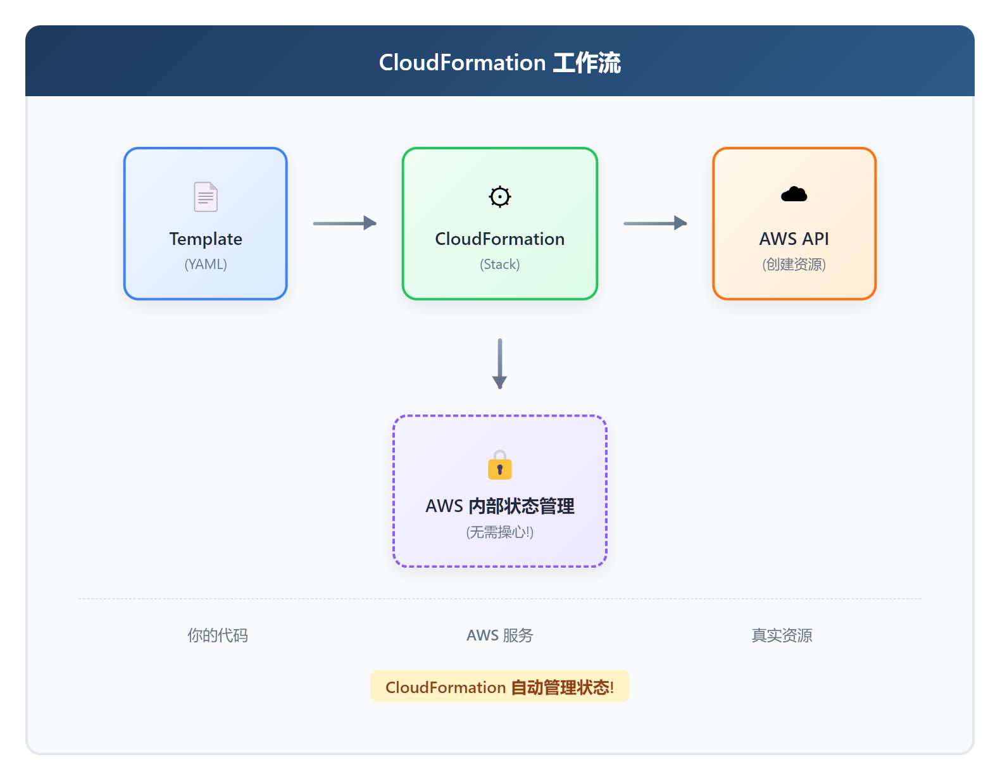
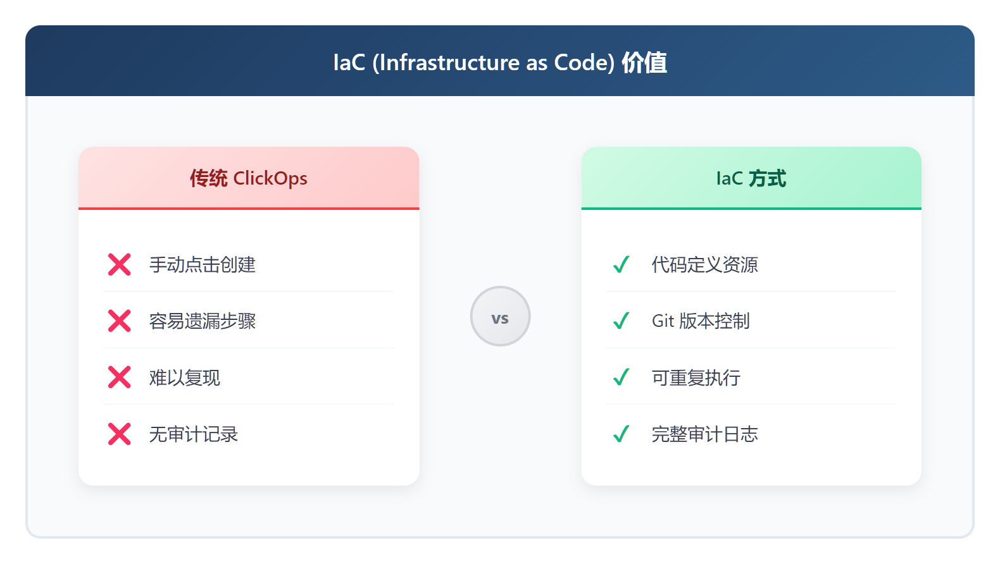

# 00 - CloudFormation 基础与第一个 Stack

> **目标**：10 分钟内创建你的第一个 CloudFormation Stack，体验 AWS 原生 IaC
> **时间**：30 分钟
> **费用**：S3 Bucket（免费层 - 5GB 存储 + 2万次 GET/月）
> **区域**：ap-northeast-1（Tokyo）推荐，或 us-east-1
> **前置**：AWS 账号 + Console 访问权限

> ⚠️ **费用提醒**：本课使用 S3 Bucket，属于 AWS Free Tier（免费层）。
> 但请务必在课程结束后删除 Stack（Step 8），避免长期存储产生费用。
> 养成"用完即删"的好习惯！

---

## 将学到的内容

1. 理解 Infrastructure as Code (IaC) 的核心价值
2. 对比 CloudFormation vs Terraform 的优缺点
3. 通过 Console 创建第一个 Stack（S3 Bucket）
4. 理解 Template、Stack、Resource 三大核心概念
5. 体验 Stack 生命周期：CREATE → UPDATE → DELETE

---

## Step 1 — 先跑起来！（10 分钟）

> 先"尝到"CloudFormation 的味道，再理解原理。

### 1.1 准备模板文件

创建一个名为 `first-stack.yaml` 的文件，内容如下：

```yaml
AWSTemplateFormatVersion: '2010-09-09'
Description: My First CloudFormation Stack - S3 Bucket

Resources:
  MyFirstBucket:
    Type: AWS::S3::Bucket
    Properties:
      BucketName: !Sub 'my-first-cfn-bucket-${AWS::AccountId}'
      Tags:
        - Key: Name
          Value: My First CloudFormation Bucket
        - Key: Environment
          Value: learning
        - Key: Purpose
          Value: CloudFormation 课程练习
```

> 你也可以直接使用课程代码：`code/first-stack.yaml`

### 1.2 通过 Console 创建 Stack

1. 登录 AWS Console，搜索 **CloudFormation**
2. 点击 **Create stack** → **With new resources (standard)**

<!-- SCREENSHOT: cloudformation-console-create-stack -->

3. 选择 **Upload a template file**
4. 点击 **Choose file**，上传你的 `first-stack.yaml`
5. 点击 **Next**

<!-- SCREENSHOT: cloudformation-upload-template -->

6. **Stack name**: 输入 `my-first-stack`
7. 点击 **Next** → **Next** → **Submit**

<!-- SCREENSHOT: cloudformation-stack-name -->

### 1.3 观察创建过程

Stack 创建过程中，你会看到：

```
CREATE_IN_PROGRESS  →  CREATE_COMPLETE
```

<!-- SCREENSHOT: cloudformation-stack-events -->

点击 **Events** 标签页，观察每个资源的创建状态：

| Timestamp | Logical ID | Status | Status reason |
|-----------|------------|--------|---------------|
| 12:00:01 | my-first-stack | CREATE_IN_PROGRESS | User Initiated |
| 12:00:02 | MyFirstBucket | CREATE_IN_PROGRESS | - |
| 12:00:05 | MyFirstBucket | CREATE_COMPLETE | - |
| 12:00:06 | my-first-stack | CREATE_COMPLETE | - |

### 1.4 验证资源已创建

1. 在 CloudFormation Console，点击 **Resources** 标签页
2. 找到 `MyFirstBucket`，点击 Physical ID 链接
3. 跳转到 S3 Console，确认 Bucket 存在

<!-- SCREENSHOT: cloudformation-resources-tab -->

恭喜！你刚刚用 CloudFormation 创建了一个 S3 Bucket！

---

## Step 2 — 发生了什么？（5 分钟）

现在你已经"尝到"了 CloudFormation，让我们理解刚才发生了什么。

### 2.1 三个核心概念


<details>
<summary>View ASCII source</summary>

```
┌─────────────────────────────────────────────────────────────────────────────┐
│                      CloudFormation 核心概念                                  │
├─────────────────────────────────────────────────────────────────────────────┤
│                                                                             │
│   Template (模板)          Stack (栈)              Resource                 │
│  ┌─────────────────┐    ┌─────────────────┐    ┌─────────────────┐         │
│  │                 │    │                 │    │                 │         │
│  │   YAML / JSON   │───▶│  my-first-stack │───▶│    S3 Bucket    │         │
│  │    定义资源      │创建 │ CloudFormation管理│管理│    AWS 资源     │         │
│  │                 │    │                 │    │                 │         │
│  └─────────────────┘    └─────────────────┘    └─────────────────┘         │
│                                                                             │
│    你写的代码              CloudFormation            AWS 资源               │
│  声明 "我要什么"            管理的单元               真实存在               │
│                                                                             │
└─────────────────────────────────────────────────────────────────────────────┘
```

</details>

| 概念 | 英文 | 说明 |
|------|------|------|
| **Template** | 模板 | 你编写的 YAML/JSON 文件，声明要创建什么资源 |
| **Stack** | 栈 | CloudFormation 管理的资源集合，一个模板创建一个 Stack |
| **Resource** | 资源 | AWS 中真实存在的东西（S3 Bucket、EC2 实例等） |

### 2.2 CloudFormation 工作流



<details>
<summary>View ASCII source</summary>

```
┌─────────────────────────────────────────────────────────────────────────────┐
│                        CloudFormation 工作流                                  │
├─────────────────────────────────────────────────────────────────────────────┤
│                                                                             │
│  ┌─────────────┐     ┌─────────────────┐     ┌─────────────────┐           │
│  │  Template   │────▶│ CloudFormation  │────▶│    AWS API      │           │
│  │   (YAML)    │     │    (Stack)      │     │   (创建资源)     │           │
│  └─────────────┘     └────────┬────────┘     └─────────────────┘           │
│     你的代码                   │                   真实资源                 │
│                               │                                            │
│                               ▼                                            │
│                    ┌ ─ ─ ─ ─ ─ ─ ─ ─ ─ ┐                                   │
│                    │  AWS 内部状态管理   │                                   │
│                    │   (无需操心!)       │                                   │
│                    └ ─ ─ ─ ─ ─ ─ ─ ─ ─ ┘                                   │
│                                                                             │
│              CloudFormation 自动管理状态!                                    │
│                                                                             │
└─────────────────────────────────────────────────────────────────────────────┘
```

</details>

**关键点**：CloudFormation 自动管理状态！

- 不像 Terraform 需要管理 `.tfstate` 文件
- AWS 在后台自动追踪 Stack 管理的资源
- 你只需要关心模板代码

---

## Step 3 — 核心概念深入（10 分钟）

### 3.1 什么是 Infrastructure as Code (IaC)?

**传统方式**：登录 Console → 点击创建 → 手动配置 → 忘记做了什么

**IaC 方式**：写代码 → 版本控制 → 自动执行 → 可重复、可审计



<details>
<summary>View ASCII source</summary>

```
┌─────────────────────────────────────────────────────────────────────────────┐
│                   IaC (Infrastructure as Code) 价值                          │
├─────────────────────────────────────────────────────────────────────────────┤
│                                                                             │
│   ┌───────────────────────┐         ┌───────────────────────┐              │
│   │     传统 ClickOps      │         │       IaC 方式        │              │
│   ├───────────────────────┤   vs    ├───────────────────────┤              │
│   │  ✗ 手动点击创建        │         │  ✓ 代码定义资源        │              │
│   │  ✗ 容易遗漏步骤        │         │  ✓ Git 版本控制       │              │
│   │  ✗ 难以复现           │         │  ✓ 可重复执行         │              │
│   │  ✗ 无审计记录         │         │  ✓ 完整审计日志       │              │
│   └───────────────────────┘         └───────────────────────┘              │
│                                                                             │
└─────────────────────────────────────────────────────────────────────────────┘
```

</details>

**IaC 核心价值**：

| 问题 | IaC 解决方案 |
|------|-------------|
| "这个资源谁创建的？" | Git commit 记录 |
| "配置改了什么？" | ChangeSet 显示差异 |
| "能再建一套一样的吗？" | 同样模板，另一个环境 |
| "出问题怎么回滚？" | CloudFormation 自动回滚 |

### 3.2 CloudFormation vs Terraform

这两个都是主流 IaC 工具，各有优势：

| 维度 | CloudFormation | Terraform |
|------|----------------|-----------|
| **云支持** | AWS 专用 | **多云**（AWS, Azure, GCP...） |
| **语言** | YAML/JSON | HCL（更简洁） |
| **状态管理** | **AWS 自动管理** | 需要自己配置 |
| **回滚** | **自动回滚** | 需要手动处理 |
| **AWS 新功能** | **即日支持** | 等待 Provider 更新 |
| **学习曲线** | AWS 深度集成 | 较平缓 |
| **AWS 支持** | **官方支持** | 第三方工具 |

**什么时候用 CloudFormation？**

- 纯 AWS 项目
- 日本企业 SIer 合同（多数要求使用 AWS 原生服务）
- 金融/政府等合规要求严格的行业
- 需要自动回滚保障

**什么时候用 Terraform？**

- 多云项目
- 团队已有 Terraform 经验
- 需要更丰富的社区 Module

> 参考 [Terraform 系列](../../terraform/) 了解 Terraform 的详细用法。

### 3.3 CloudFormation 独特优势

**1. 无需状态文件管理**

```
Terraform:
  代码 (.tf) + 状态文件 (.tfstate) = 当前状态
  → 状态文件可能丢失、冲突、泄露敏感信息

CloudFormation:
  代码 (YAML) + AWS 内部状态 = 当前状态
  → 你不需要操心状态管理！
```

**2. 自动回滚**

```
CloudFormation 创建失败时:
  1. 自动检测错误
  2. 自动回滚已创建的资源
  3. 恢复到创建前状态

Terraform 创建失败时:
  1. 检测错误
  2. 停止执行
  3. 已创建的资源保留（需要手动清理）
```

**3. AWS 新功能即日支持**

AWS 发布新服务或新功能时，CloudFormation 通常当天就支持。Terraform 需要等 HashiCorp 更新 AWS Provider。

### 3.4 Template 结构概览

```yaml
AWSTemplateFormatVersion: '2010-09-09'    # 固定值
Description: 模板描述                       # 可选但建议写

Parameters:                                # 可选：输入参数
  # ...

Mappings:                                  # 可选：静态映射表
  # ...

Conditions:                                # 可选：条件逻辑
  # ...

Resources:                                 # 必须：资源定义
  MyFirstBucket:
    Type: AWS::S3::Bucket
    Properties:
      # ...

Outputs:                                   # 可选：输出值
  # ...
```

**本课只用了 Resources**，其他部分会在后续课程介绍。

---

## Step 4 — 动手实验：更新 Stack（8 分钟）

> 目标：修改模板，体验 CloudFormation 的更新流程。

### 4.1 修改模板添加标签

修改 `first-stack.yaml`，添加一个新标签：

```yaml
      Tags:
        - Key: Name
          Value: My First CloudFormation Bucket
        - Key: Environment
          Value: learning
        - Key: Purpose
          Value: CloudFormation 课程练习
        - Key: Owner                          # 新增
          Value: your-name                    # 新增
```

### 4.2 更新 Stack

1. 在 CloudFormation Console，选择 `my-first-stack`
2. 点击 **Update**
3. 选择 **Replace current template**
4. 上传修改后的 `first-stack.yaml`
5. 点击 **Next** → **Next** → **Next** → **Submit**

<!-- SCREENSHOT: cloudformation-update-stack -->

### 4.3 观察更新过程

在 **Events** 标签页，你会看到：

```
UPDATE_IN_PROGRESS  →  UPDATE_COMPLETE
```

### 4.4 验证更新

1. 进入 S3 Console
2. 点击你的 Bucket
3. 点击 **Properties** → **Tags**
4. 确认新标签 `Owner` 已添加

---

## Step 5 — 清理资源（3 分钟）

> **重要**：完成学习后，立即删除 Stack！

### 5.1 删除 Stack

1. 在 CloudFormation Console，选择 `my-first-stack`
2. 点击 **Delete**
3. 在确认对话框点击 **Delete**

<!-- SCREENSHOT: cloudformation-delete-stack -->

### 5.2 观察删除过程

在 **Events** 标签页，你会看到：

```
DELETE_IN_PROGRESS  →  DELETE_COMPLETE
```

CloudFormation 会自动删除 Stack 管理的所有资源（S3 Bucket）。

### 5.3 验证删除

进入 S3 Console，确认 Bucket 已被删除。

---

## Step 6 — Stack 生命周期总结


<details>
<summary>View ASCII source</summary>

```
┌─────────────────────────────────────────────────────────────────────────────┐
│                           Stack 生命周期                                      │
├─────────────────────────────────────────────────────────────────────────────┤
│                                                                             │
│      CREATE              UPDATE              DELETE                         │
│   ┌───────────┐       ┌───────────┐       ┌───────────┐                    │
│   │           │       │           │       │           │                    │
│   │  上传模板  │──────▶│  修改模板  │──────▶│ 删除 Stack │                    │
│   │           │       │           │       │           │                    │
│   └─────┬─────┘       └─────┬─────┘       └─────┬─────┘                    │
│         │                   │                   │                          │
│         ▼                   ▼                   ▼                          │
│  ┌─────────────┐     ┌─────────────┐     ┌─────────────┐                   │
│  │ CREATE_IN_  │     │ UPDATE_IN_  │     │ DELETE_IN_  │                   │
│  │  PROGRESS   │     │  PROGRESS   │     │  PROGRESS   │                   │
│  └─────┬───────┘     └─────┬───────┘     └─────┬───────┘                   │
│        │                   │                   │                           │
│        ▼                   ▼                   ▼                           │
│  ┌─────────────┐     ┌─────────────┐     ┌─────────────┐                   │
│  │  CREATE_    │     │  UPDATE_    │     │  DELETE_    │                   │
│  │  COMPLETE   │     │  COMPLETE   │     │  COMPLETE   │                   │
│  └─────────────┘     └─────────────┘     └─────────────┘                   │
│   (或 ROLLBACK)       (或 ROLLBACK)       (Stack 消失)                     │
│                                                                             │
└─────────────────────────────────────────────────────────────────────────────┘
```

</details>

**关键状态**：

| 状态 | 说明 |
|------|------|
| `CREATE_IN_PROGRESS` | 正在创建资源 |
| `CREATE_COMPLETE` | 创建成功 |
| `CREATE_FAILED` | 创建失败（会自动回滚） |
| `UPDATE_IN_PROGRESS` | 正在更新资源 |
| `UPDATE_COMPLETE` | 更新成功 |
| `ROLLBACK_IN_PROGRESS` | 正在回滚 |
| `DELETE_IN_PROGRESS` | 正在删除资源 |
| `DELETE_COMPLETE` | 删除成功 |

---

## 职场小贴士

### 日本 IT 企业的 CloudFormation 使用场景

在日本的 SIer（System Integrator）和金融/政府客户中，CloudFormation 比 Terraform 更受欢迎：

**1. 合规要求**

> "AWS 標準サービスのみ使用すること"（只允许使用 AWS 标准服务）

这种要求在金融、政府项目中很常见，CloudFormation 作为 AWS 原生服务，天然满足要求。

**2. 変更管理（变更管理）**

在日本企业，任何基础设施变更都需要：

1. **変更管理票**（变更申请单）
2. **承認**（审批）
3. **証跡**（审计日志）

CloudFormation 的 **ChangeSet** 功能完美支持这个流程（后续课程会详细介绍）。

**3. AWS サポート対象**

CloudFormation 是 AWS 官方服务，遇到问题可以直接联系 AWS Support。Terraform 是第三方工具，AWS 不提供支持。

### 常见日语术语

| 日语 | 读音 | 中文 | 英文 |
|------|------|------|------|
| スタック | sutakku | 栈 | Stack |
| テンプレート | tenpureeto | 模板 | Template |
| 変更管理 | henkou kanri | 变更管理 | Change Management |
| 自動ロールバック | jidou roorubakku | 自动回滚 | Automatic Rollback |

---

## 检查清单

完成本课后，你应该能够：

- [ ] 解释 IaC 的核心价值（可重复、可版本控制、可审计）
- [ ] 说出 CloudFormation vs Terraform 的 3 个主要区别
- [ ] 通过 Console 创建一个简单的 CloudFormation Stack
- [ ] 理解 Template、Stack、Resource 的关系
- [ ] 描述 Stack 的生命周期状态
- [ ] 解释 CloudFormation 的自动回滚机制

---

## 面试准备

### よくある質問（常见面试题）

**Q: CloudFormation と Terraform の違いは？**

A: CloudFormation は AWS 専用、State ファイル不要、自動ロールバック機能あり。Terraform はマルチクラウド対応、State 管理が必要、手動ロールバック。日本の SIer では CloudFormation が好まれる傾向。

（CloudFormation 是 AWS 专用，不需要状态文件，有自动回滚功能。Terraform 支持多云，需要状态管理，手动回滚。日本 SIer 倾向于使用 CloudFormation。）

**Q: CloudFormation を使うメリットは？**

A: 主なメリットは 4 つ：
1. AWS の新機能即日対応
2. 自動ロールバックでデプロイ失敗時も安全
3. State ファイル管理不要
4. AWS サポート対象なのでトラブル時に問い合わせ可能

（主要优势有 4 个：1. AWS 新功能即日支持 2. 自动回滚保证部署安全 3. 不需要管理状态文件 4. 是 AWS 支持对象，出问题可以咨询。）

**Q: Stack とは何ですか？**

A: CloudFormation が管理するリソースの集合。一つのテンプレートから一つの Stack が作成され、Stack 単位で作成・更新・削除を管理。

（Stack 是 CloudFormation 管理的资源集合。一个模板创建一个 Stack，以 Stack 为单位管理创建、更新、删除。）

---

## 延伸阅读

- [AWS CloudFormation ユーザーガイド](https://docs.aws.amazon.com/ja_jp/AWSCloudFormation/latest/UserGuide/Welcome.html)
- [CloudFormation ベストプラクティス](https://docs.aws.amazon.com/ja_jp/AWSCloudFormation/latest/UserGuide/best-practices.html)
- [Terraform 系列](../../terraform/) - 对比学习另一种 IaC 工具

---

## 下一步

你已经体验了 CloudFormation 的基本流程。下一课我们将深入学习：

- Template 的完整结构
- Parameters（参数）实现模板复用
- 内置函数：`!Ref`、`!Sub`、`!GetAtt`

→ [01 - 模板语法与内置函数](../01-template-syntax/)

---

## 系列导航

[Home](../) | [01 - 模板语法 →](../01-template-syntax/)
