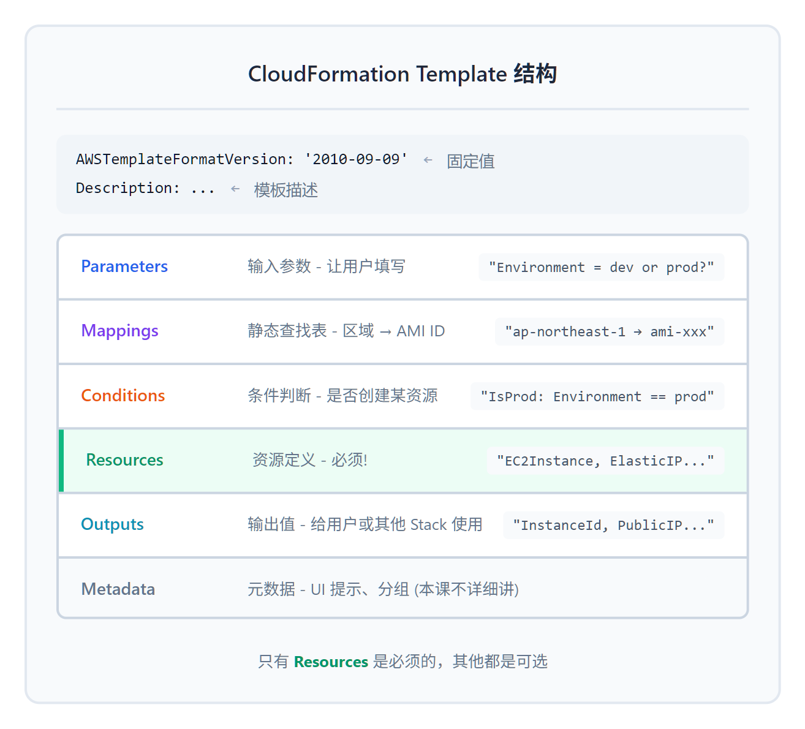

# 01 - 模板语法与内置函数

> **目标**：掌握 CloudFormation 模板完整结构，使用内置函数创建可复用模板
> **时间**：45 分钟
> **费用**：EC2 t3.micro（免费层）
> **前置**：已完成 [00 - CloudFormation 基础](../00-fundamentals/)

---

## 将学到的内容

1. 掌握 YAML 模板的完整结构（六大 Section）
2. 使用 Parameters 实现模板复用
3. 使用 Mappings 和 Conditions 实现条件逻辑
4. 掌握核心内置函数：`!Ref`, `!GetAtt`, `!Sub`, `!Join`, `!If`
5. 使用 Outputs 导出资源信息

---

## Step 1 - 先跑起来！（10 分钟）

> 先"尝到"一个完整模板的味道，再理解每个部分的作用。

### 1.1 准备多环境 EC2 模板

这个模板支持 `dev` 和 `prod` 两个环境切换，根据环境自动选择不同的实例大小：

创建文件 `ec2-multi-env.yaml`：

```yaml
AWSTemplateFormatVersion: '2010-09-09'
Description: Multi-environment EC2 template with Parameters and Conditions

# ============================================================
# Parameters - 让模板可复用
# ============================================================
Parameters:
  Environment:
    Type: String
    Default: dev
    AllowedValues:
      - dev
      - prod
    Description: Environment type (dev or prod)

  KeyPairName:
    Type: AWS::EC2::KeyPair::KeyName
    Description: Name of an existing EC2 KeyPair

# ============================================================
# Mappings - 静态查找表
# ============================================================
Mappings:
  RegionAMI:
    ap-northeast-1:
      AmazonLinux2023: ami-0d52744d6551d851e
    ap-northeast-3:
      AmazonLinux2023: ami-0599b6e53ca798bb2
    us-east-1:
      AmazonLinux2023: ami-0c02fb55956c7d316

  EnvironmentConfig:
    dev:
      InstanceType: t3.micro
      VolumeSize: 8
    prod:
      InstanceType: t3.small
      VolumeSize: 20

# ============================================================
# Conditions - 条件逻辑
# ============================================================
Conditions:
  IsProd: !Equals [!Ref Environment, prod]

# ============================================================
# Resources - 资源定义（必须）
# ============================================================
Resources:
  EC2Instance:
    Type: AWS::EC2::Instance
    Properties:
      ImageId: !FindInMap [RegionAMI, !Ref 'AWS::Region', AmazonLinux2023]
      InstanceType: !FindInMap [EnvironmentConfig, !Ref Environment, InstanceType]
      KeyName: !Ref KeyPairName
      Tags:
        - Key: Name
          Value: !Sub '${Environment}-web-server'
        - Key: Environment
          Value: !Ref Environment
        - Key: ManagedBy
          Value: CloudFormation

  # 只在 prod 环境创建 EIP
  ElasticIP:
    Type: AWS::EC2::EIP
    Condition: IsProd
    Properties:
      InstanceId: !Ref EC2Instance
      Tags:
        - Key: Name
          Value: !Sub '${Environment}-eip'

# ============================================================
# Outputs - 导出信息
# ============================================================
Outputs:
  InstanceId:
    Description: EC2 Instance ID
    Value: !Ref EC2Instance

  PrivateIP:
    Description: Private IP Address
    Value: !GetAtt EC2Instance.PrivateIp

  PublicIP:
    Description: Public IP Address (EIP for prod, dynamic for dev)
    Value: !If
      - IsProd
      - !Ref ElasticIP
      - !GetAtt EC2Instance.PublicIp

  InstanceArn:
    Description: EC2 Instance ARN
    Value: !Sub 'arn:aws:ec2:${AWS::Region}:${AWS::AccountId}:instance/${EC2Instance}'
```

> 你也可以直接使用课程代码：`code/ec2-multi-env.yaml`

### 1.2 通过 Console 创建 Stack

1. 登录 AWS Console，搜索 **CloudFormation**
2. 点击 **Create stack** > **With new resources (standard)**
3. 选择 **Upload a template file**，上传 `ec2-multi-env.yaml`
4. 点击 **Next**

<!-- SCREENSHOT: cfn-upload-template -->

### 1.3 填写 Parameters

你会看到一个参数表单：

| Parameter | 值 |
|-----------|---|
| Stack name | `dev-web-server` |
| Environment | `dev` |
| KeyPairName | （选择你的 Key Pair） |

<!-- SCREENSHOT: cfn-parameters-form -->

5. 点击 **Next** > **Next** > **Submit**

### 1.4 观察创建过程

在 **Events** 标签页观察：

```
CREATE_IN_PROGRESS  MyEC2Instance
CREATE_COMPLETE     MyEC2Instance
CREATE_COMPLETE     dev-web-server (Stack)
```

**注意**：因为是 `dev` 环境，`ElasticIP` 资源**没有被创建**！

### 1.5 查看 Outputs

点击 **Outputs** 标签页：

| Key | Value |
|-----|-------|
| InstanceId | i-0abc123def456... |
| PrivateIP | 10.0.1.23 |
| PublicIP | 54.178.xxx.xxx |
| InstanceArn | arn:aws:ec2:ap-northeast-1:123456789012:instance/i-0abc... |

恭喜！你刚刚创建了一个**可复用**的多环境模板！

---

## Step 2 - 发生了什么？（5 分钟）

刚才的模板展示了 CloudFormation 的强大之处：**同一份代码，不同的配置**。

### 2.1 模板的六大 Section



<details>
<summary>📝 ASCII 源码（点击展开）</summary>

```
┌─────────────────────────────────────────────────────────────────────────┐
│                    CloudFormation Template 结构                          │
├─────────────────────────────────────────────────────────────────────────┤
│                                                                         │
│   AWSTemplateFormatVersion: '2010-09-09'     ← 固定值                   │
│   Description: ...                           ← 模板描述                 │
│                                                                         │
│   ┌─────────────────────────────────────────────────────────────────┐   │
│   │ Parameters      输入参数 - 让用户填写                            │   │
│   │                 "Environment = dev or prod?"                    │   │
│   ├─────────────────────────────────────────────────────────────────┤   │
│   │ Mappings        静态查找表 - 区域→AMI ID                        │   │
│   │                 "ap-northeast-1 → ami-xxx"                      │   │
│   ├─────────────────────────────────────────────────────────────────┤   │
│   │ Conditions      条件判断 - 是否创建某资源                        │   │
│   │                 "IsProd: Environment == prod"                   │   │
│   ├─────────────────────────────────────────────────────────────────┤   │
│   │ Resources       资源定义 - 必须！                                │   │
│   │                 "EC2Instance, ElasticIP..."                     │   │
│   ├─────────────────────────────────────────────────────────────────┤   │
│   │ Outputs         输出值 - 给用户或其他 Stack 使用                 │   │
│   │                 "InstanceId, PublicIP..."                       │   │
│   ├─────────────────────────────────────────────────────────────────┤   │
│   │ Metadata        元数据 - UI 提示、分组                           │   │
│   │                 (本课不详细讲)                                   │   │
│   └─────────────────────────────────────────────────────────────────┘   │
│                                                                         │
│   只有 Resources 是必须的，其他都是可选                                  │
│                                                                         │
└─────────────────────────────────────────────────────────────────────────┘
```

</details>

### 2.2 数据流向


<details>
<summary>📝 ASCII 源码（点击展开）</summary>

```
┌──────────────┐     ┌──────────────┐     ┌──────────────┐
│  Parameters  │────▶│  Conditions  │────▶│  Resources   │
│  用户输入     │     │  条件判断     │     │  资源创建     │
└──────┬───────┘     └──────────────┘     └──────┬───────┘
       │                                         │
       ▼                                         ▼
┌──────────────┐                         ┌──────────────┐
│   Mappings   │                         │   Outputs    │
│   查找表      │                         │   输出值     │
└──────────────┘                         └──────────────┘

数据流:
  1. Parameters 接收用户输入 (Environment = "dev")
  2. Mappings 根据 Region 查找 AMI ID
  3. Conditions 判断 IsProd = false
  4. Resources 创建 EC2（跳过 EIP 因为 IsProd = false）
  5. Outputs 输出 InstanceId, PublicIP
```

</details>

---

## Step 3 - 核心概念详解（15 分钟）

### 3.1 Parameters - 让模板可复用

Parameters 让用户在创建 Stack 时填写值，而不是硬编码在模板里。

**基础语法**：

```yaml
Parameters:
  ParameterName:
    Type: String              # 类型（必须）
    Default: default-value    # 默认值
    Description: 描述信息      # 说明
    AllowedValues:            # 允许的值列表
      - value1
      - value2
    AllowedPattern: ^[a-z]+$  # 正则表达式约束
    MinLength: 1              # 最小长度
    MaxLength: 64             # 最大长度
    ConstraintDescription: 自定义错误信息
```

**常用 Parameter 类型**：

| Type | 说明 | 示例 |
|------|------|------|
| `String` | 字符串 | `my-bucket` |
| `Number` | 数字 | `8080` |
| `List<Number>` | 数字列表 | `80,443,8080` |
| `CommaDelimitedList` | 逗号分隔列表 | `a,b,c` |
| `AWS::EC2::KeyPair::KeyName` | EC2 Key Pair（带下拉选择） | `my-keypair` |
| `AWS::EC2::VPC::Id` | VPC ID（带下拉选择） | `vpc-xxx` |
| `AWS::SSM::Parameter::Value<String>` | SSM Parameter 值 | `/my/param` |

**AWS-specific 类型的好处**：Console 会显示下拉菜单，用户不需要手动输入！

<!-- SCREENSHOT: parameter-dropdown -->

### 3.2 Mappings - 静态查找表

Mappings 用于创建**键值对查找表**，最常见的用途是存储不同区域的 AMI ID。

**语法**：

```yaml
Mappings:
  MapName:
    TopLevelKey1:
      SecondLevelKey: value
    TopLevelKey2:
      SecondLevelKey: value
```

**使用 !FindInMap**：

```yaml
!FindInMap [MapName, TopLevelKey, SecondLevelKey]
```

**实际例子 - 区域 AMI 映射**：

```yaml
Mappings:
  RegionAMI:
    ap-northeast-1:           # Tokyo
      AmazonLinux2023: ami-0d52744d6551d851e
      Ubuntu22: ami-0bba69335379e17f8
    ap-northeast-3:           # Osaka
      AmazonLinux2023: ami-0599b6e53ca798bb2
      Ubuntu22: ami-0e9085e5dd6a47b69
    us-east-1:                # Virginia
      AmazonLinux2023: ami-0c02fb55956c7d316
      Ubuntu22: ami-0c7217cdde317cfec

Resources:
  MyInstance:
    Type: AWS::EC2::Instance
    Properties:
      ImageId: !FindInMap
        - RegionAMI                 # Map 名称
        - !Ref 'AWS::Region'        # 当前区域（Pseudo Parameter）
        - AmazonLinux2023           # 选择 Amazon Linux 2023
```

**为什么不用 SSM 公共参数？**

AWS 提供最新 AMI 的 SSM 参数，更推荐使用：

```yaml
Parameters:
  LatestAmiId:
    Type: AWS::SSM::Parameter::Value<AWS::EC2::Image::Id>
    Default: /aws/service/ami-amazon-linux-latest/al2023-ami-kernel-default-x86_64
```

但有些企业要求使用**固定版本**的 AMI（审计需求），这时 Mappings 更合适。

### 3.3 Conditions - 条件逻辑

Conditions 用于**条件创建资源**或**条件设置属性值**。

**条件函数**：

| 函数 | 说明 | 示例 |
|------|------|------|
| `!Equals` | 相等判断 | `!Equals [!Ref Env, prod]` |
| `!Not` | 取反 | `!Not [!Equals [!Ref Env, prod]]` |
| `!And` | 且 | `!And [Condition1, Condition2]` |
| `!Or` | 或 | `!Or [Condition1, Condition2]` |
| `!If` | 条件选择值 | `!If [IsProd, t3.large, t3.micro]` |

**定义 Condition**：

```yaml
Conditions:
  IsProd: !Equals [!Ref Environment, prod]
  IsNotProd: !Not [!Equals [!Ref Environment, prod]]
  CreateEIP: !And
    - !Equals [!Ref Environment, prod]
    - !Equals [!Ref CreateElasticIP, 'true']
```

**使用 Condition**：

```yaml
Resources:
  # 条件创建资源
  ElasticIP:
    Type: AWS::EC2::EIP
    Condition: IsProd           # 只在 prod 环境创建
    Properties:
      InstanceId: !Ref MyInstance

  # 条件设置属性值
  MyInstance:
    Type: AWS::EC2::Instance
    Properties:
      InstanceType: !If
        - IsProd                # Condition 名称
        - t3.large              # true 时的值
        - t3.micro              # false 时的值
```

### 3.4 内置函数详解

CloudFormation 提供了一系列**内置函数（Intrinsic Functions）**来实现动态值。

#### !Ref - 引用资源或参数

```yaml
# 引用 Parameter
!Ref Environment        # → "dev"

# 引用 Resource（返回主标识符）
!Ref MyEC2Instance      # → "i-0abc123..."（Instance ID）
!Ref MyS3Bucket         # → "my-bucket-name"（Bucket Name）
```

**!Ref 返回什么？**

| 资源类型 | !Ref 返回 |
|----------|-----------|
| AWS::EC2::Instance | Instance ID |
| AWS::S3::Bucket | Bucket Name |
| AWS::EC2::SecurityGroup | Security Group ID |
| AWS::EC2::VPC | VPC ID |
| AWS::Lambda::Function | Function Name |

#### !GetAtt - 获取资源属性

`!Ref` 只能获取主标识符，`!GetAtt` 可以获取**任意属性**：

```yaml
# 语法
!GetAtt ResourceName.AttributeName

# 示例
!GetAtt MyEC2Instance.PrivateIp        # → "10.0.1.23"
!GetAtt MyEC2Instance.PublicIp         # → "54.178.xxx.xxx"
!GetAtt MyEC2Instance.AvailabilityZone # → "ap-northeast-1a"
!GetAtt MyS3Bucket.Arn                 # → "arn:aws:s3:::my-bucket"
!GetAtt MyS3Bucket.DomainName          # → "my-bucket.s3.amazonaws.com"
!GetAtt MyLambda.Arn                   # → "arn:aws:lambda:..."
```

**面试重点：!Ref vs !GetAtt**

```
!Ref MyEC2Instance        → Instance ID（主标识符）
!GetAtt MyEC2Instance.Arn → Instance ARN（特定属性）
```

#### !Sub - 字符串替换

`!Sub` 用于**变量替换**，比字符串拼接更清晰：

```yaml
# 基础用法 - 引用 Parameter 和 Resource
!Sub '${Environment}-web-server'       # → "dev-web-server"
!Sub 'arn:aws:s3:::${MyBucket}/*'      # → "arn:aws:s3:::my-bucket/*"

# 引用 Pseudo Parameters
!Sub 'arn:aws:ec2:${AWS::Region}:${AWS::AccountId}:instance/${MyInstance}'
# → "arn:aws:ec2:ap-northeast-1:123456789012:instance/i-0abc..."

# 自定义变量映射
!Sub
  - 'https://${Domain}/api/${Stage}'
  - Domain: !GetAtt MyALB.DNSName
    Stage: !Ref Environment
# → "https://my-alb-xxx.elb.amazonaws.com/api/dev"
```

#### !Join - 连接字符串

```yaml
# 语法
!Join [delimiter, [list of values]]

# 示例
!Join ['-', [!Ref Environment, web, server]]
# → "dev-web-server"

!Join ['', ['arn:aws:s3:::', !Ref MyBucket, '/*']]
# → "arn:aws:s3:::my-bucket/*"
```

**!Sub vs !Join**：推荐使用 `!Sub`，更易读：

```yaml
# 推荐
!Sub '${Environment}-web-server'

# 不推荐（等价但难读）
!Join ['-', [!Ref Environment, web, server]]
```

#### !Select 和 !Split

```yaml
# !Split - 分割字符串
!Split [',', 'a,b,c']     # → ['a', 'b', 'c']

# !Select - 选择列表元素（0-indexed）
!Select [0, [a, b, c]]    # → 'a'
!Select [1, !Split [',', 'a,b,c']]  # → 'b'

# 实际用途 - 从 CIDR 提取 IP
!Select [0, !Split ['/', '10.0.1.0/24']]  # → '10.0.1.0'
```

### 3.5 Pseudo Parameters - 伪参数

CloudFormation 提供一些**内置参数**，无需定义即可使用：

| Pseudo Parameter | 值 | 示例 |
|------------------|---|------|
| `AWS::Region` | 当前区域 | `ap-northeast-1` |
| `AWS::AccountId` | 当前账户 ID | `123456789012` |
| `AWS::StackName` | Stack 名称 | `my-stack` |
| `AWS::StackId` | Stack ARN | `arn:aws:cloudformation:...` |
| `AWS::NoValue` | 删除属性 | 用于条件删除 |

**常见用法**：

```yaml
# 构建 ARN
!Sub 'arn:aws:s3:::${AWS::AccountId}-logs-${AWS::Region}'
# → "arn:aws:s3:::123456789012-logs-ap-northeast-1"

# 在 Tag 中使用
Tags:
  - Key: StackName
    Value: !Ref AWS::StackName
```

### 3.6 Outputs - 导出信息

Outputs 用于：
1. 在 Console 显示重要信息
2. 导出值供其他 Stack 使用（Cross-Stack Reference）
3. 供 CLI/脚本读取

**语法**：

```yaml
Outputs:
  OutputName:
    Description: 描述信息
    Value: !Ref MyResource       # 必须
    Export:                      # 可选：导出给其他 Stack
      Name: !Sub '${AWS::StackName}-OutputName'
    Condition: SomeCondition     # 可选：条件输出
```

**完整示例**：

```yaml
Outputs:
  VpcId:
    Description: VPC ID for cross-stack reference
    Value: !Ref MyVPC
    Export:
      Name: !Sub '${AWS::StackName}-VpcId'

  WebServerURL:
    Description: Web server URL
    Value: !Sub 'http://${MyInstance.PublicIp}:80'
    Condition: HasPublicIP
```

---

## Step 4 - 反模式与最佳实践（5 分钟）

### Anti-Pattern 1: Hardcoding AMI ID

**Bad** - 硬编码 AMI ID：

```yaml
Resources:
  MyInstance:
    Type: AWS::EC2::Instance
    Properties:
      ImageId: ami-0d52744d6551d851e   # 只在 ap-northeast-1 有效！
```

**Good** - 使用 Mappings 或 SSM Parameter：

```yaml
# 方案 1: Mappings
Mappings:
  RegionAMI:
    ap-northeast-1:
      AMI: ami-0d52744d6551d851e
    us-east-1:
      AMI: ami-0c02fb55956c7d316

Resources:
  MyInstance:
    Type: AWS::EC2::Instance
    Properties:
      ImageId: !FindInMap [RegionAMI, !Ref 'AWS::Region', AMI]

# 方案 2: SSM Parameter（推荐）
Parameters:
  LatestAmiId:
    Type: AWS::SSM::Parameter::Value<AWS::EC2::Image::Id>
    Default: /aws/service/ami-amazon-linux-latest/al2023-ami-kernel-default-x86_64

Resources:
  MyInstance:
    Type: AWS::EC2::Instance
    Properties:
      ImageId: !Ref LatestAmiId
```

### Anti-Pattern 2: Hardcoding Account ID

**Bad**：

```yaml
!Sub 'arn:aws:s3:::123456789012-my-bucket'
```

**Good**：

```yaml
!Sub 'arn:aws:s3:::${AWS::AccountId}-my-bucket'
```

### Anti-Pattern 3: Too Many Required Parameters

**Bad** - 10+ 必填参数：

```yaml
Parameters:
  VpcCidr:
    Type: String
    # 无默认值 = 必填
  Subnet1Cidr:
    Type: String
  Subnet2Cidr:
    Type: String
  # ... 更多参数
```

**Good** - 合理默认值 + 少量必填：

```yaml
Parameters:
  Environment:
    Type: String
    Default: dev
    AllowedValues: [dev, prod]

  VpcCidr:
    Type: String
    Default: 10.0.0.0/16

  # 只有真正需要用户决定的才必填
  KeyPairName:
    Type: AWS::EC2::KeyPair::KeyName
    Description: Required - Select your key pair
```

---

## Step 5 - 动手练习：切换到 prod 环境（8 分钟）

> 目标：用同一份模板创建 prod 环境，观察 Conditions 的效果。

### 5.1 创建 prod Stack

1. 在 CloudFormation Console，点击 **Create stack**
2. 上传同一份 `ec2-multi-env.yaml`
3. 填写 Parameters：

| Parameter | 值 |
|-----------|---|
| Stack name | `prod-web-server` |
| Environment | `prod` |
| KeyPairName | （选择你的 Key Pair） |

4. 点击 **Next** > **Next** > **Submit**

### 5.2 观察差异

在 **Events** 标签页，这次你会看到：

```
CREATE_IN_PROGRESS  EC2Instance
CREATE_COMPLETE     EC2Instance
CREATE_IN_PROGRESS  ElasticIP       ← dev 环境没有这个！
CREATE_COMPLETE     ElasticIP
CREATE_COMPLETE     prod-web-server
```

在 **Resources** 标签页：

| Logical ID | Type | Status |
|------------|------|--------|
| EC2Instance | AWS::EC2::Instance | CREATE_COMPLETE |
| ElasticIP | AWS::EC2::EIP | CREATE_COMPLETE |

**对比 dev Stack**：dev 只有 EC2Instance，没有 ElasticIP！

### 5.3 检查 Instance Type

1. 进入 EC2 Console
2. 找到 `prod-web-server` 实例
3. 查看 Instance Type：应该是 `t3.small`（dev 是 `t3.micro`）

---

## Step 6 - 清理资源（3 分钟）

> **重要**：完成学习后，立即删除两个 Stack！

### 6.1 删除 Stack

1. 在 CloudFormation Console，选择 `prod-web-server`
2. 点击 **Delete** > **Delete**
3. 重复删除 `dev-web-server`

### 6.2 验证删除

进入 EC2 Console，确认两个实例已终止。

---

## 职场小贴士

### 日本企业模板设计原则

在日本的 SIer 项目中，模板设计有以下惯例：

**1. 设计书对应**

模板结构通常对应「設計書」（设计文档）：

```yaml
# 模板顶部注释：对应设计文档编号
# 設計書番号: INFRA-2024-001
# 設計者: 田中太郎
# 作成日: 2024-01-15
# 更新履歴:
#   2024-02-01 - 山田花子 - EIP 追加
```

**2. 参数命名规范**

日本企业常用日语拼音命名（虽然不推荐，但需要能读懂）：

```yaml
Parameters:
  Kankyo:           # 環境 (Environment)
    Type: String
  SabaKishu:        # サーバ機種 (Server Type)
    Type: String
```

**3. 変更管理对应**

每个可能变更的值都应该是 Parameter：

```yaml
# 方便変更管理票记录 "InstanceType を t3.micro から t3.small に変更"
Parameters:
  InstanceType:
    Type: String
    Default: t3.micro
    AllowedValues:
      - t3.micro
      - t3.small
      - t3.medium
```

### 常见日语术语

| 日语 | 读音 | 中文 | 英文 |
|------|------|------|------|
| 内部関数 | naibukansuu | 内置函数 | Intrinsic Function |
| パラメータ | parameetaa | 参数 | Parameter |
| 条件 | jouken | 条件 | Condition |
| 参照 | sanshou | 引用 | Reference |
| 属性取得 | zokusei shutoku | 获取属性 | Get Attribute |

---

## 检查清单

完成本课后，你应该能够：

- [ ] 说出 CloudFormation Template 的六大 Section
- [ ] 使用 Parameters 让模板接受用户输入
- [ ] 使用 Mappings 创建区域 AMI 映射表
- [ ] 使用 Conditions 实现条件创建资源
- [ ] 正确使用 `!Ref` 和 `!GetAtt`（并说明区别）
- [ ] 使用 `!Sub` 构建动态字符串
- [ ] 使用 Outputs 导出资源信息
- [ ] 避免 hardcoding AMI ID 和 Account ID

---

## 面试准备

### よくある質問（常见面试题）

**Q: !Ref と !GetAtt の違いは？**

A: `!Ref` は論理 ID から物理 ID（主識別子）を取得。`!GetAtt` はリソースの特定属性（Arn, DnsName, PrivateIp 等）を取得。例えば EC2 の場合、`!Ref` は Instance ID、`!GetAtt` で PrivateIp や PublicIp を取得。

（`!Ref` 从逻辑 ID 获取物理 ID（主标识符）。`!GetAtt` 获取资源的特定属性。例如 EC2，`!Ref` 返回 Instance ID，`!GetAtt` 可以获取 PrivateIp、PublicIp 等。）

**Q: Mappings はどんな時に使いますか？**

A: リージョン別 AMI ID、環境別設定値など、静的なルックアップテーブルとして使用。最近は SSM パラメータストアの公開パラメータ（/aws/service/ami-amazon-linux-latest/...）を使うことも多い。ただし固定バージョンの AMI が必要な監査要件がある場合は Mappings が適切。

（用于区域 AMI ID、环境配置等静态查找表。最近也常用 SSM Parameter Store 的公开参数。但如果有需要固定版本 AMI 的审计要求，Mappings 更合适。）

**Q: Pseudo Parameters を3つ挙げてください**

A: `AWS::Region`（現在のリージョン）、`AWS::AccountId`（アカウント ID）、`AWS::StackName`（スタック名）。ARN 構築時に `!Sub` と組み合わせて使うことが多い。

（`AWS::Region`（当前区域）、`AWS::AccountId`（账户 ID）、`AWS::StackName`（Stack 名称）。常与 `!Sub` 组合使用来构建 ARN。）

---

## 延伸阅读

- [AWS CloudFormation 内部関数リファレンス](https://docs.aws.amazon.com/ja_jp/AWSCloudFormation/latest/UserGuide/intrinsic-function-reference.html)
- [AWS リソースタイプリファレンス](https://docs.aws.amazon.com/ja_jp/AWSCloudFormation/latest/UserGuide/aws-template-resource-type-ref.html)
- [Parameters ベストプラクティス](https://docs.aws.amazon.com/ja_jp/AWSCloudFormation/latest/UserGuide/parameters-section-structure.html)

---

## 下一步

你已经掌握了 CloudFormation 模板的完整语法。但直接 `Update Stack` 很危险 - 下一课我们学习：

- ChangeSets：预览变更再执行
- DeletionPolicy：保护关键资源
- 回滚处理：UPDATE_ROLLBACK_FAILED 怎么办

-> [02 - 安全运维：ChangeSets 与回滚策略](../02-safe-operations/)

---

## 系列导航

[<- 00 - 基础与第一个 Stack](../00-fundamentals/) | [Home](../) | [02 - 安全运维 ->](../02-safe-operations/)
